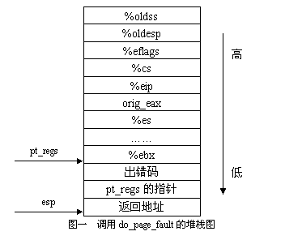

> @Date    : 2020-10-27 10:20:53
>
> @Author  : Lewis Tian (taseikyo@gmail.com)
>
> @Link    : github.com/taseikyo

# 利用异常表处理 Linux 内核态缺页异常

—— 一种提高系统稳定性的方法

> 原文：https://www.ibm.com/developerworks/cn/linux/kernel/l-page/index.html 彭洋 2003 年 11 月 17 日发布

## Table of Contents

- [前言](#前言)
- [GCC 的扩展功能](#gcc-的扩展功能)
- [内核缺页异常处理](#内核缺页异常处理)
- [异常表的实现机制](#异常表的实现机制)
- [总结](#总结)
- [结束语](#结束语)

## 前言

在程序的执行过程中，因为遇到某种障碍而使 CPU 无法最终访问到相应的物理内存单元，即无法完成从虚拟地址到物理地址映射的时候，CPU 会产生一次缺页异常，从而进行相应的缺页异常处理。基于 CPU 的这一特性，Linux 采用了请求调页（Demand Paging）和写时复制（Copy On Write）的技术

1. 请求调页是一种动态内存分配技术，它把页框的分配推迟到不能再推迟为止。这种技术的动机是：进程开始运行的时候并不访问地址空间中的全部内容。事实上，有一部分地址也许永远也不会被进程所使用。程序的局部性原理也保证了在程序执行的每个阶段，真正使用的进程页只有一小部分，对于临时用不到的页，其所在的页框可以由其它进程使用。因此，请求分页技术增加了系统中的空闲页框的平均数，使内存得到了很好的利用。从另外一个角度来看，在不改变内存大小的情况下，请求分页能够提高系统的吞吐量。当进程要访问的页不在内存中的时候，就通过缺页异常处理将所需页调入内存中。

2. 写时复制主要应用于系统调用 fork，父子进程以只读方式共享页框，当其中之一要修改页框时，内核才通过缺页异常处理程序分配一个新的页框，并将页框标记为可写。这种处理方式能够较大的提高系统的性能，这和 Linux 创建进程的操作过程有一定的关系。在一般情况下，子进程被创建以后会马上通过系统调用 execve 将一个可执行程序的映象装载进内存中，此时会重新分配子进程的页框。那么，如果 fork 的时候就对页框进行复制的话，显然是很不合适的。

在上述的两种情况下出现缺页异常，进程运行于用户态，异常处理程序可以让进程从出现异常的指令处恢复执行，使用户感觉不到异常的发生。当然，也会有异常无法正常恢复的情况，这时，异常处理程序会进行一些善后的工作，并结束该进程。也就是说，运行在用户态的进程如果出现缺页异常，不会对操作系统核心的稳定性造成影响。那么对于运行在核心态的进程如果发生了无法正常恢复的缺页异常，应该如何处理呢？是否会导致系统的崩溃呢？是否能够解决好内核态缺页异常对于操作系统核心的稳定性来说会产生很大的影响，如果一个误操作就会造成系统的 Oops，这对于用户来说显然是不能容忍的。本文正是针对这个问题，介绍了一种 Linux 内核中所采取的解决方法。

在读者继续往下阅读之前，有一点需要先说明一下，本文示例中所选的代码取自于 Linux-2.4.0，编译环境是 gcc-2.96，objdump 的版本是 2.11.93.0.2，具体的版本信息可以通过以下的命令进行查询：

```Bash
$ gcc -v
Reading specs from /usr/lib/gcc-lib/i386-redhat-linux/2.96/specs
gcc version 2.96 20000731 (Red Hat Linux 7.3 2.96-110)
$ objdump -v
GNU objdump 2.11.93.0.2 20020207
Copyright 2002 Free Software Foundation, Inc.
```

## GCC 的扩展功能

由于本文中会用到 GCC 的扩展功能，即汇编器 as 中提供的 `.section` 伪操作，在文章开始之前我再作一个简要的介绍。此伪操作对于不同的可执行文件格式有不同的解释，我也不一一列举，仅对我们所感兴趣的 Linux 中常用的 ELF 格式的用法加以描述，其指令格式如下：

```ELF
.section NAME[, "FLAGS"]
```

大家所熟知的 C 程序一般由以下的几个部分组成：代码段（text section）、初始化数据段（data section）、非初始化数据段（bss section）、栈（heap） 以及堆（stack），具体的地址空间布局可以参考《UNIX 环境高级编程》一书。

在 Linux 内核中，通过使用 `.section` 的伪操作，可以把随后的代码汇编到一个由 NAME 指定的段中。而 FLAGS 字段则说明了该段的属性，它可以用下面介绍的单个字符来表示，也可以是多个字符的组合。

- 'a' 可重定位的段
- 'w' 可写段
- 'x' 可执行段
- 'W' 可合并的段
- 's' 共享段

举个例子来说明，读者在后面会看到的：`.section .fixup, "ax"`

这样的一条指令定义了一个名为 `.fixup` 的段，随后的指令会被加入到这个段中，该段的属性是可重定位并可执行。

## 内核缺页异常处理

运行在核心态的进程经常需要访问用户地址空间的内容，但是谁都无法保证内核所得到的这些从用户空间传入的地址信息是 "合法" 的。为了保护内核不受错误信息的攻击，需要验证这些从用户空间传入的地址信息的正确性。

在老版本的 Linux 中，这个工作是通过函数 verify_area 来完成的：

```C
extern inline int verify_area(int type, const void * addr, unsigned long size)
```

该函数验证了是否可以以 type 中说明的访问类型（read or write）访问从地址 addr 开始、大小为 size 的一块虚拟存储区域。为了做到这一点，verify_read 首先需要找到包含地址 addr 的虚拟存储区域（vma）。一般的情况下（正确运行的程序）这个测试都会成功返回，在少数情况下才会出现失败的情况。也就是说，大部分的情况下内核在一些无用的验证操作上花费了不算短的时间，这从操作系统运行效率的角度来说是不可接受的。

为了解决这个问题，现在的 Linux 设计中将验证的工作交给虚存中的硬件设备来完成。当系统启动分页机制以后，如果一条指令的虚拟地址所对应的页框（page frame）不在内存中或者访问的类型有错误，就会发生缺页异常。处理器把引起缺页异常的虚拟地址装到寄存器 CR2 中，并提供一个出错码，指示引起缺页异常的存储器访问的类型，随后调用 Linux 的缺页异常处理函数进行处理。

Linux 中进行缺页异常处理的函数如下：

```C
asmlinkage void do_page_fault(struct pt_regs *regs, unsigned long error_code)
{
……………………
    __asm__("movl %%cr2,%0":"=r" (address));
    ……………………
    vma = find_vma(mm, address);
    if (!vma)
        goto bad_area;
    if (vma->vm_start <= address)
        goto good_area;
    if (!(vma->vm_flags & VM_GROWSDOWN))
        goto bad_area;
    if (error_code & 4) {
        if (address + 32 < regs->esp)
            goto bad_area;
    ……………………
bad_area:
    ……………………
no_context:
    /* Are we prepared to handle this kernel fault?  */
    if ((fixup = search_exception_table(regs->eip)) != 0) {
        regs->eip = fixup;
        return;
    }
    ………………………
}
```

首先让我们来看看传给这个函数调用的两个参数：它们都是通过 entry.S 在堆栈中建立的（arch/i386/kernel/entry.S），参数 regs 指向保存在堆栈中的寄存器，error_code 中存放着异常的出错码，具体的堆栈布局参见图一（堆栈的生成过程请参考《Linux 内核源代码情景分析》一书）



该函数首先从 CPU 的控制寄存器 CR2 中获取出现缺页异常的虚拟地址。由于缺页异常处理程序需要处理的缺页异常类型很多，分支也很复杂。基于本文的主旨，我们只关心以下的几种内核缺页异常处理的情况：

1. 程序要访问的内核地址空间的内容不在内存中，先跳转到标号 vmalloc_fault，如果当前访问的内容所对应的页目录项不在内存中，再跳转到标号 no_context；
2. 缺页异常发生在中断或者内核线程中，跳转到标号 no_context；
3. 程序在核心态运行时访问用户空间的数据，被访问的数据不在内存中
	1. a）出现异常的虚拟地址在进程的某个 vma 中，但是系统内存无法分配空闲页框（page frame），则先跳转到标号 out_of_memory，再跳转到标号 no_context；
	2. b）出现异常的虚拟地址不属于进程任一个 vma，而且不属于堆栈扩展的范畴，则先跳转到标号 bad_area，最终也是到达标号 no_context。

从上面的这几种情况来看，我们关注的焦点最后集中到标号 no_context 处，即对函数 search_exception_table 的调用。这个函数的作用就是通过发生缺页异常的指令 (regs->eip) 在异常表（exception table）中寻找下一条可以继续运行的指令(fixup)。这里提到的异常表包含一些地址对，地址对中的前一个地址表示出现异常的指令的地址，后一个表示当前一个指令出现错误时，程序可以继续得以执行的修复地址。

如果这个查找操作成功的话，缺页异常处理程序将堆栈中的返回地址（regs->eip）修改成修复地址并返回，随后，发生异常的进程将按照 fixup 中安排好的指令继续执行下去。当然，如果无法找到与之匹配的修复地址，系统只有打印出出错信息并停止运作。

那么，这个所谓的修复地址又是如何生成的呢？是系统自动生成的吗？答案当然是否定的，这些修复指令都是编程人员通过 as 提供的扩展功能写进内核源码中的。下面我们就来分析一下其实现机制。

## 异常表的实现机制

笔者取 include/asm-i386/uaccess.h 中的宏定义 `__copy_user` 编写了一段程序作为例子加以讲解。

```C
/* hello.c */
#include <stdio.h>
#include <string.h>
#define __copy_user(to,from,size)       \
do {                                    \
    int __d0, __d1;                     \
    __asm__ __volatile__(               \
        "0: rep; movsl\n"               \
        "   movl %3,%0\n"               \
        "1: rep; movsb\n"               \
        "2:\n"                          \
        ".section .fixup,\"ax\"\n"      \
        "3: lea 0(%3,%0,4),%0\n"        \
        "   jmp 2b\n"                   \
        ".previous\n"                   \
        ".section __ex_table,\"a\"\n"   \
        "   .align 4\n"                 \
        "   .long 0b,3b\n"              \
        "   .long 1b,2b\n"              \
        ".previous"                     \
        : "=&c"(size), "=&D" (__d0), "=&S" (__d1)       \
        : "r"(size & 3), "0"(size / 4), "1"(to), "2"(from)  \
        : "memory");                        \
} while (0)
int main(void)
{
    const   char    *string = "Hello, world!";
    char    buf[20];
    unsigned long   n, m;
    m = n = strlen(string);
    __copy_user(buf, string, n);
    buf[m] = '\0';
    printf("%s\n", buf);
    exit(0);
}
```

先看看本程序的执行结果：

```Bash
$ gcc hello.c -o hello
$ ./hello
Hello, world!
```

显然，这就是一个简单的 "hello world" 程序，那为什么要写得这么复杂呢？程序中的一大段汇编代码在内核中才能体现出其价值，笔者将其加入到上面的程序中，是为了后面的分析而准备的。

系统在核心态运行的时候，参数是通过寄存器来传递的，由于寄存器所能够传递的信息有限，所以传递的参数大多数是指针。要使用指针所指向的更大块的数据，就需要将用户空间的数据拷贝到系统空间来。上面的 `__copy_user` 在内核中正是扮演着这样的一个拷贝数据的角色，当然，内核中这样的宏定义还很多，笔者也只是取其中的一个来讲解，读者如果感兴趣的话可以看完本文以后自行学习。

如果读者对于简单的嵌入式汇编还不是很了解的话，可以参考《Linux 内核源代码情景分析》一书。下面我们将程序编译成汇编程序来加以分析：

```Bash
$ gcc -S hello.c
/* hello.s */
    movl    -60(%ebp), %eax
    andl    $3, %eax
    movl    -60(%ebp), %edx
    movl    %edx, %ecx
    shrl    $2, %ecx
    leal    -56(%ebp), %edi
    movl    -12(%ebp), %esi
#APP
0:  rep; movsl
    movl %eax,%ecx
1:  rep; movsb
2:
.section .fixup,"ax"
3:  lea 0(%eax,%ecx,4),%ecx
    jmp 2b
.previous
.section __ex_table,"a"
    .align 4
    .long 0b,3b
    .long 1b,2b
.previous
#NO_APP
    movl    %ecx, %eax
```

从上面通过 gcc 生成的汇编程序中，我们可以很容易的找到访问用户地址空间的指令，也就是程序中的标号为 0 和 1 的两条语句。而程序中伪操作 `.section` 的作用就是定义了 `.fixup` 和 `__ex_table` 这样的两个段，那么这两段在可执行程序中又是如何安排的呢？下面就通过 objdump 给读者一个直观的概念：

```Bash
$ objdump --section-headers hello
hello:     file format elf32-i386
Sections:
Idx Name          Size      VMA       LMA       File off  Algn
  0 .interp       00000013  080480f4  080480f4  000000f4  2**0
                  CONTENTS, ALLOC, LOAD, READONLY, DATA
    ………………………………
  9 .init         00000018  080482e0  080482e0  000002e0  2**2
                  CONTENTS, ALLOC, LOAD, READONLY, CODE
 10 .plt          00000070  080482f8  080482f8  000002f8  2**2
                  CONTENTS, ALLOC, LOAD, READONLY, CODE
 11 .text         000001c0  08048370  08048370  00000370  2**4
                  CONTENTS, ALLOC, LOAD, READONLY, CODE
 12 .fixup        00000009  08048530  08048530  00000530  2**0
                  CONTENTS, ALLOC, LOAD, READONLY, CODE
 13 .fini         0000001e  0804853c  0804853c  0000053c  2**2
                  CONTENTS, ALLOC, LOAD, READONLY, CODE
 14 .rodata       00000019  0804855c  0804855c  0000055c  2**2
                  CONTENTS, ALLOC, LOAD, READONLY, DATA
 15 __ex_table    00000010  08048578  08048578  00000578  2**2
                  CONTENTS, ALLOC, LOAD, READONLY, DATA
 16 .data         00000010  08049588  08049588  00000588  2**2
                  CONTENTS, ALLOC, LOAD, DATA
                  CONTENTS, READONLY
    ………………………………
 26 .note         00000078  00000000  00000000  0000290d  2**0
                  CONTENTS, READONLY
```

上面通过 objdump 显示出来的可执行程序的头部信息中，有一些是读者所熟悉的，例如 `.text`、`.data` 以及被笔者省略掉的 `.bss`，而我们所关心的是 12 和 15，也就是 `.fixup` 和 `__ex_table`。对照 hello.s 中段的定义来看，两个段声明中的 FLAGS 字段分别为 'ax' 和 'a'，而 objdump 的结果显示，`.fixup` 段是可重定位的代码段，`__ex_table` 段是可重定位的数据段，两者是吻合的。

那么为什么要通过 `.section` 定义独立的段呢？为了解开这个问题的答案，我们需要进一步看看我们所写的代码在可执行文件中是如何表示的。

```Bash
$ objdump --disassemble --section=.text hello
hello:     file format elf32-i386
Disassembly of section .text:
8048498:    8b 45 c4                mov         0xffffffc4(%ebp),%eax
804849b:    83 e0 03                and         $0x3,%eax
804849e:    8b 55 c4                mov         0xffffffc4(%ebp),%edx
80484a1:    89 d1                   mov         %edx,%ecx
80484a3:    c1 e9 02                shr         $0x2,%ecx
80484a6:    8d 7d c8                lea         0xffffffc8(%ebp),%edi
80484a9:    8b 75 f4                mov         0xfffffff4(%ebp),%esi
80484ac:    f3 a5                   repz movsl  %ds:(%esi),%es:(%edi)
80484ae:    89 c1                   mov         %eax,%ecx
80484b0:    f3 a4                   repz movsb  %ds:(%esi),%es:(%edi)
80484b2:    89 c8                   mov         %ecx,%eax
```

前面的 hello.s 中的汇编片断在可执行文件中就是通过上面的 11 条指定来表达，读者也许会问，由 `.section` 伪操作定义的段怎么不见了？别着急，慢慢往下看，由 `.section` 伪操作定义的段并不在正常的程序执行路径上，它们是被安排在可执行文件的其它地方了：

```Bash
$ objdump --disassemble --section=.fixup hello
hello:     file format elf32-i386
Disassembly of section .fixup:
08048530 <.fixup>:
8048530:    8d 4c 88 00             lea    0x0(%eax,%ecx,4),%ecx
8048534:    e9 79 ff ff ff          jmp    80484b2 <main+0x42>
```

由此可见，`.fixup` 是作为一个单独的段出现在可执行程序中的，而此段中所包含的语句则正好是和源程序 hello.c 中的两条语句相对应的。

将 `.fixup` 段和 `.text` 段独立开来的目的是为了提高 CPU 流水线的利用率。熟悉体系结构的读者应该知道，当前的 CPU 引入了流水线技术来加快指令的执行，即在执行当前指令的同时，要将下面的一条甚至多条指令预取到流水线中。这种技术在面对程序执行分支的时候遇到了问题：如果预取的指令并不是程序下一步要执行的分支，那么流水线中的所有指令都要被排空，这对系统的性能会产生一定的影响。在我们的这个程序中，如果将 `.fixup` 段的指令安排在正常执行的 `.text` 段中，当程序执行到前面的指令时，这几条很少执行的指令会被预取到流水线中，正常的执行必然会引起流水线的排空操作，这显然会降低整个系统的性能。

下面我们就可以看到异常表是如何形成的了：

```Bash
$ objdump --full-contents --section=__ex_table hello
hello:     file format elf32-i386
Contents of section __ex_table:
8048578 ac840408 30850408 b0840408 b2840408  ....0...........
```

由于 x86 使用小尾端的编址方式，上面的这段数据比较凌乱。让我把上面的 `__ex_table` 中的内容转变成大家通常看到的样子，相信会更容易理解一些：

```
8048578 80484ac 8048530 80484b0 80484b2  ....0...........
```

上面的红色部分就是我们最感兴趣的地方，而这段数据是如何形成的呢？将前面 objdump 生成的可执行程序中的汇编语句和 hello.c 中的源程序结合起来看，就可以发现一些有趣的东西了！

先让我们回头看看 hello.c 中 `__ex_table` 段的语句 `.long 0b,3b`。其中标签 0b（b 代表 backward，即往回的标签 0）是可能出现异常的指令的地址。结合 objdump 生成的可执行程序 `.text` 段的汇编语句可以知道标签 0 就是 80484ac：

原始的汇编语句： `0: rep; movsl`

链接到可执行程序后： `80484ac: f3 a5 repz movsl %ds:(%esi),%es:(%edi)`

而标签 3 就是处理异常的指令的地址，在我们的这个例子中就是 80484b0：

原始的汇编语句： `3: lea 0(%eax,%ecx,4),%ecx`

链接到可执行程序后： `8048530: 8d 4c 88 00 lea 0x0(%eax,%ecx,4),%ecx`

因此，相应的汇编语句

```ASM
.section __ex_table,"a"
.align 4
.long 0b,3b
```

就变成了： 8048578 80484ac 8048530 …………

这样，异常表中的地址对（80484ac，8048530）就诞生了，而对于地址对（80484b0 80484b2）的生成，情况相同，不再赘述。

读到这儿了，有一件事要告诉读者的是，其实例子中异常表的安排在用户空间是不会得到执行的。当运行在用户态的进程访问到标签 0 处的指令出现缺页异常时，do_page_fault 只会将该指令对应的进程页调入内存中，使指令能够重新正确执行，或者直接就杀死该进程，并不会到达函数 search_exception_table 处。

也许有的读者会问了，既然不执行，前面的例子和围绕例子所展开的讨论又有什么作用呢？大家大可打消这样的疑虑，我们前面的分析并没有白费，因为真正的内核异常表中地址对的生成机制和前面讲述的原理是完全一样的，笔者通过一个运行在用户空间的程序来讲解也是希望让读者能够更加容易的理解异常表的机制，不至于陷入到内核源码的汪洋大海中去。现在，我们可以自己通过 objdump 工具查看一下内核中的异常表：

```Bash
$ objdump --full-contents --section=__ex_table vmlinux
vmlinux:     file format elf32-i386
Contents of section __ex_table:
c024ac80 e36d10c0 e66d10c0 8b7110c0 6c7821c0
……………………
```

做一下转化：

```
c024ac80 c0106de3 c0106de6 c010718b c021786c
```

上面的 vmlinux 就是编译内核所生成的内核可执行程序。和本文给出的例子相比，唯一的不同就是此时的地址对中的异常指令地址和修复地址都是内核空间的虚拟地址。也正是在内核中，异常表才真正发挥着它应有的作用。

## 总结

下面我对前面所讲述的内容做一个归纳，希望读者能够对内核缺页异常处理有一个清楚的认识：

1. 进程访问内核地址空间的 "非法" 地址 c010718b
2. 存储管理部件（MMU）产生一个缺页异常；
3. CPU 调用函数 do_page_fault；
4. do_page_fault 调用函数 search_exception_table（regs->eip == c010718b）；
5. search_exception_table 在异常表中查找地址 c010718b，并返回地址对中的修复地址 c021786c；
6. do_page_fault 将堆栈中的返回地址 eip 修改成 c021786c 并返回；
7. 代码按照缺页异常处理程序的返回地址继续执行，也就是从 c021786c 开始继续执行。

将验证用户空间地址信息 "合法" 性的工作交给硬件来完成（通过缺页异常的方式）其实就是一种 Lazy Computation，也就是等到真正出现缺页异常的时候才进行处理。通过本文的分析可以看出，这种方法与本文前面所提到的通过 verify_area 来验证的方法相比，较好的避免了系统在无用验证上的开销，能够有效的提高系统的性能。此外，在分析源码的过程中读者会发现，异常表并不仅仅用在缺页异常处理程序中，在通用保护（General Protection）异常等地方，也同样用到了这一技术。

由此可见，异常表是一种广泛应用于 Linux 内核中的异常处理方法。在系统软件的设计中，异常表也应该成为一种提高系统稳定性的重要手段。

## 结束语

公开的 Linux 源码，对许多计算机爱好者来说，无异于一座取之不尽的宝库。在 Linux 的设计和程序的编写中，处处体现着程序员们的思想结晶。越来越多的人正加入到分析 Linux 操作系统行列中来，大家都想去揭开计算机世界那神秘的面纱。但是，源码中那些 GCC 的扩展语法、嵌入式汇编等生僻的用法，给很多人的成长之路设置了无形的障碍。

分析源码的过程本来就不是一片坦途，很多专家也都是通过十多年的研究才能在操作系统的某个方面取得成就的。计算机的世界其实也并不枯燥，关键是要找到其中的乐趣所在。
