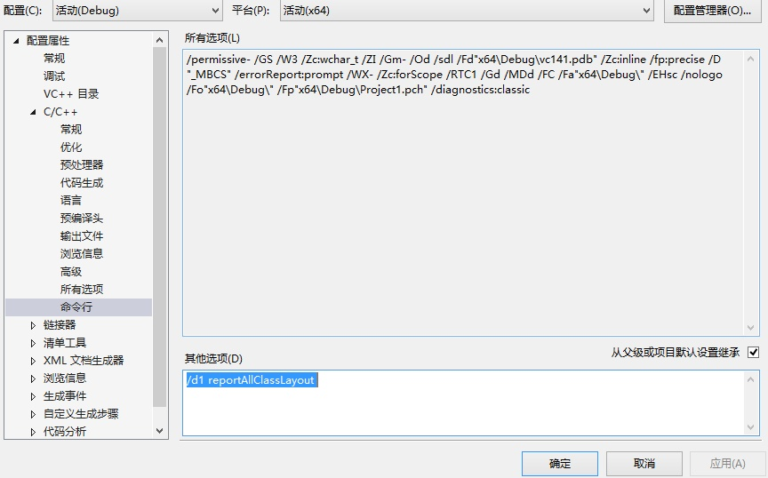
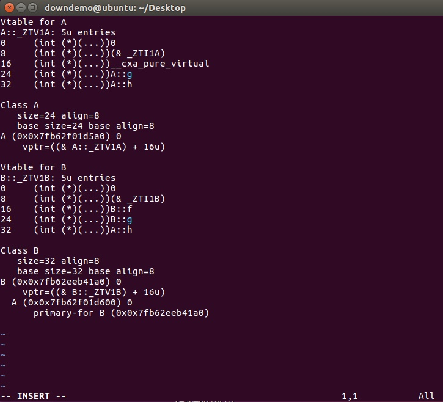

> @Date    : 2020-09-15 11:21:27
>
> @Author  : Lewis Tian (taseikyo@gmail.com)
>
> @Link    : github.com/taseikyo

# VS 或者 GCC 下查看类的虚表布局

> 原文：https://www.zhihu.com/question/304309743/answer/543219797 作者：[已注销](https://www.zhihu.com/people/downdemo) 2018-12-01

VS查看内存布局的方法：`Properties - Configuration Properties - C/C++ - Command Line - Addtion Options` 添加 `/d1 reportAllClassLayout`。这样会在 Debug 的输出中显示所有类的内存布局。如果要指定只查看某个类的，比如有个 `class A`，则只要添加 `/d1 reportSingleClassLayoutA`



比如对如下的类：

```C++
class A {
    virtual void f() = 0;
    virtual void g() {}
    virtual void h() {}
    int i;
    char a;
    double d;
};

class B : public A {
    virtual void g() {}
    virtual void f() {}
    int* p;
};
```

内存布局会在Debug的输出窗口中显示，记得修改 `显示输出来源` 为 `生成`


如果是 Linux 下，直接用下面的命令即可将 xxx.cpp 的内存布局导出到一个生成的 xxx.cpp.002t.class 文件中：

```bash
g++ -fdump-class-hierarchy xxx.cpp
```



这两种内存布局的结果可能不同，不用奇怪，各家编译器的具体实现并不完全一致。