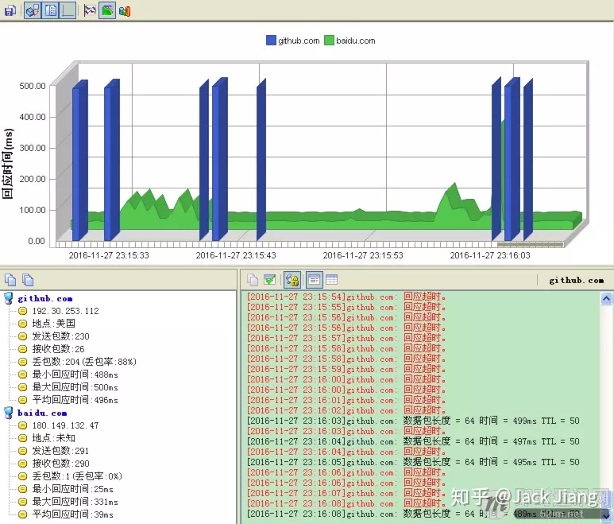
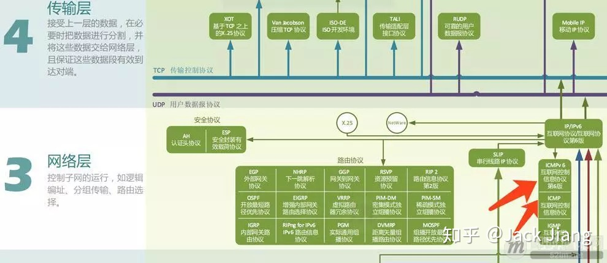
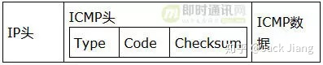
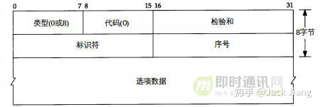
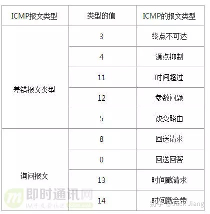
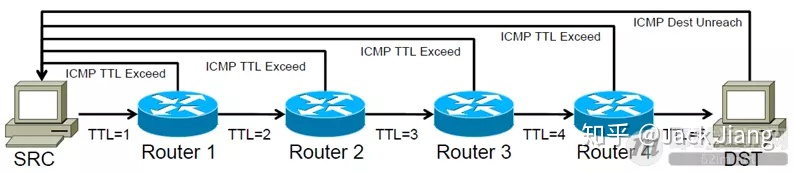
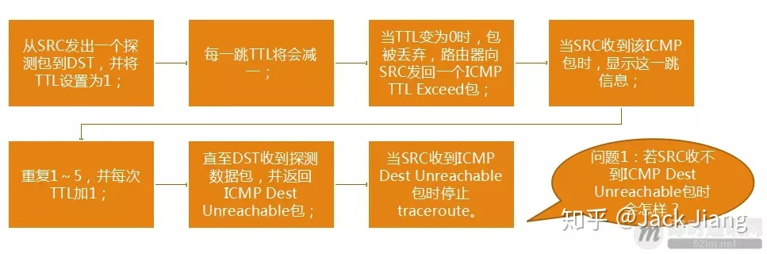

> @Date    : 2020-08-31 09:41:54
>
> @Author  : Lewis Tian (taseikyo@gmail.com)
>
> @Link    : github.com/taseikyo

> 本文由 [简悦 SimpRead](http://ksria.com/simpread/) 转码， 原文地址 [zhuanlan.zhihu.com](https://zhuanlan.zhihu.com/p/45110873) [Jack Jiang](https://www.zhihu.com/people/nan-ren-2600) 2018-09-21

# 每天都在用的 Ping 命令，它到底是什么？

## 1、前言

老于网络编程熟手来说，在测试和部署网络通信应用（比如 IM 聊天、实时音视频等）时，如果发现网络连接超时，第一时间想到的就是使用 Ping 命令 Ping 一下服务器看看通不通。甚至在有些情况下通过图形化的 Ping 命令工具对目标网络进行长测（比如：《[两款增强型 Ping 工具：持续统计、图形化展式网络状况 [附件下载]](https://link.zhihu.com/?target=http%3A//www.52im.net/thread-610-1-3.html)》、《[网络测试：Android 版多路 ping 命令工具 EnterprisePing[附件下载]](https://link.zhihu.com/?target=http%3A//www.52im.net/thread-145-1-1.html)》），可以得出当前网络通信的网络延迟、网络丢包率、网络抖动等等有价值信息。

Ping 命令很简单，但作为为数不多的网络检测工具，却非常有用，是开发网络应用时最常用到的命令。虽然 “Ping” 这个动作这么简单，但你知道 Ping 命令背后后的逻辑吗？这就是本文要告诉你！

## 2、Ping 命令的作用和原理

简单来说，「ping」是用来探测本机与网络中另一主机之间是否可达的命令，如果两台主机之间 ping 不通，则表明这两台主机不能建立起连接。ping 是定位网络通不通的一个重要手段。

ping 命令是基于 ICMP 协议来工作的，「 ICMP 」全称为 Internet 控制报文协议（[Internet Control Message Protocol](https://link.zhihu.com/?target=https%3A//tools.ietf.org/html/rfc792)）。ping 命令会发送一份 ICMP 回显请求报文给目标主机，并等待目标主机返回 ICMP 回显应答。因为 ICMP 协议会要求目标主机在收到消息之后，必须返回 ICMP 应答消息给源主机，如果源主机在一定时间内收到了目标主机的应答，则表明两台主机之间网络是可达的。

**举一个例子来描述「ping」命令的工作过程：**

1. 假设有两个主机，主机 A（192.168.0.1）和主机 B（192.168.0.2），现在我们要监测主机 A 和主机 B 之间网络是否可达，那么我们在主机 A 上输入命令：ping 192.168.0.2；
2. 此时，ping 命令会在主机 A 上构建一个 ICMP 的请求数据包（数据包里的内容后面再详述），然后 ICMP 协议会将这个数据包以及目标 IP（192.168.0.2）等信息一同交给 IP 层协议；
3. IP 层协议得到这些信息后，将源地址（即本机 IP）、目标地址（即目标 IP：192.168.0.2）、再加上一些其它的控制信息，构建成一个 IP 数据包；

4. IP 数据包构建完成后，还不够，还需要加上 MAC 地址，因此，还需要通过 ARP 映射表找出目标 IP 所对应的 MAC 地址。当拿到了目标主机的 MAC 地址和本机 MAC 后，一并交给数据链路层，组装成一个数据帧，依据以太网的介质访问规则，将它们传送出出去；
5. 当主机 B 收到这个数据帧之后，会首先检查它的目标 MAC 地址是不是本机，如果是就接收下来处理，接收之后会检查这个数据帧，将数据帧中的 IP 数据包取出来，交给本机的 IP 层协议，然后 IP 层协议检查完之后，再将 ICMP 数据包取出来交给 ICMP 协议处理，当这一步也处理完成之后，就会构建一个 ICMP 应答数据包，回发给主机 A；
6. 在一定的时间内，如果主机 A 收到了应答包，则说明它与主机 B 之间网络可达，如果没有收到，则说明网络不可达。除了监测是否可达以外，还可以利用应答时间和发起时间之间的差值，计算出数据包的延迟耗时。

通过 ping 的流程可以发现，ICMP 协议是这个过程的基础，是非常重要的，下面的章节会把 ICMP 协议再详细解释一下，请继续往下读。

## 3、正确理解 ICMP 协议

**Ping 命令所基于的 ICMP 协议所处的网络模型层级：**

（▲ 上图来自《[计算机网络通讯协议关系图（中文珍藏版）[附件下载]](https://link.zhihu.com/?target=http%3A//www.52im.net/thread-180-1-1.html)》，您可下载此图的完整清晰版）

Ping 命令这么简单，在任何系统上上手就能使用，很多人可能想当然的认为 Ping 命令使用的 ICMP 协议应该是基于传输层的 TCP 或 UDP 协议的吧。

正如上图所示，ICMP 协议既不是基于 TCP，也不是基于 UDP，而是直接基于网络层的 IP 协议，在整个网络协议栈中属于相当底层的协议了。这也从侧面证明了它的重要性，因为根据 ICMP 的 [RFC 手册](https://link.zhihu.com/?target=https%3A//tools.ietf.org/html/rfc792)规定：ICMP 协议是任何支持 IP 协议的系统必须实现的，没有余地。而 IP 协议是整个互联网的基石，ICMP 协议虽简单，但重要性不言而喻。

所以，以后面视的时候，如果碰到 “ICMP 协议是基于什么实现的？” 这样的问题，请一定要记往此节所讲的内容。

## 4、深入 ICMP 协议

我们知道，ping 命令是基于 ICMP 协议来实现的。那么我们再来看下图，就明白了 ICMP 协议又是通过 IP 协议来发送的，即 ICMP 报文是封装在 IP 包中（如下图所示）。

IP 协议是一种无连接的，不可靠的数据包协议，它并不能保证数据一定被送达，那么我们要保证数据送到就需要通过其它模块来协助实现，这里就引入的是 ICMP 协议。

当传送的 IP 数据包发送异常的时候，ICMP 就会将异常信息封装在包内，然后回传给源主机。

**将上图再细拆一下可见：**

**继续将 ICMP 协议模块细拆:**

由图可知，ICMP 数据包由 8bit 的类型字段和 8bit 的代码字段以及 16bit 的校验字段再加上选项数据组成。

**ICMP 协议大致可分为两类：**

1）查询报文类型；

2）差错报文类型。

【关于查询报文类型】

查询报文主要应用于：ping 查询、子网掩码查询、时间戳查询等等。

上面讲到的 ping 命令的流程其实就对应 ICMP 协议查询报文类型的一种使用。在主机 A 构建 ICMP 请求数据包的时候，其 ICMP 的类型字段中使用的是 8 （回送请求），当主机 B 构建 ICMP 应答包的时候，其 ICMP 类型字段就使用的是 0 （回送应答），更多类型值参考上表。

对 查询报文类型 的理解可参考一下文章最开始讲的 ping 流程，这里就不做赘述。

【关于差错报文类型】

差错报文主要产生于当数据传送发送错误的时候。

它包括：目标不可达（网络不可达、主机不可达、协议不可达、端口不可达、禁止分片等）、超时、参数问题、重定向（网络重定向、主机重定向等）等等。

差错报文通常包含了引起错误的 IP 数据包的第一个分片的 IP 首部，加上该分片数据部分的前 8 个字节。

当传送 IP 数据包发生错误的时候（例如 主机不可达），ICMP 协议就会把错误信息封包，然后传送回源主机，那么源主机就知道该怎么处理了。

## 5、ICMP 差错报文的妙用

正如上一节所介绍的那样，ICMP 协议主要有：查询报文类型和差错报文类型两种。对于差错报文来说，是不是只有遇到错误的时候才能使用呢？不是！

基于这个特性，Linux 下的 Traceroute 指令（Windows 下的对等指令是 tracert）利于 ICMP 的差错报文可以实现遍历到数据包传输路径上的所有路由器！这真是个有用的命令！

**百度百科上关于 traceroute 命令的用途：**

> traceroute (Windows 系统下是 tracert) 命令利用 ICMP 协议定位您的计算机和目标计算机之间的所有路由器。TTL 值可以反映数据包经过的路由器或网关的数量，通过操纵独立 ICMP 呼叫报文的 TTL 值和观察该报文被抛弃的返回信息，traceroute 命令能够遍历到数据包传输路径上的所有路由器。

ICMP 的差错报文的使用，使得 Traceroute 成为用来侦测源主机到目标主机之间所经过路由情况的常用工具。Traceroute 的原理就是利用 ICMP 的规则，制造一些错误的事件出来，然后根据错误的事件来评估网络路由情况。

**traceroute 的基本原理如下图所示：**

**具体做法就是：**

**1）**Traceroute 会设置特殊的 TTL 值，来追踪源主机和目标主机之间的路由数。首先它给目标主机发送一个 TTL=1 的 UDP 数据包，那么这个数据包一旦在路上遇到一个路由器，TTL 就变成了 0（TTL 规则是每经过一个路由器都会减 1），因为 TTL=0 了，所以路由器就会把这个数据包丢掉，然后产生一个错误类型（超时）的 ICMP 数据包回发给源主机，也就是差错包。这个时候源主机就拿到了第一个路由节点的 IP 和相关信息了；

**2）**接着，源主机再给目标主机发一个 TTL=2 的 UDP 数据包，依旧上述流程走一遍，就知道第二个路由节点的 IP 和耗时情况等信息了；

**3）**如此反复进行，Traceroute 就可以拿到从主机 A 到主机 B 之间所有路由器的信息了。

但是有个问题是，如果数据包到达了目标主机的话，即使目标主机接收到 TTL 值为 1 的 IP 数据包，它也是不会丢弃该数据包的，也不会产生一份超时的 ICMP 回发数据包的，因为数据包已经达到了目的地嘛。那我们应该怎么认定数据包是否达到了目标主机呢？

Traceroute 的方法是在源主机发送 UDP 数据包给目标主机的时候，会设置一个不可能达到的目标端口号（例如大于 30000 的端口号），那么当这个数据包真的到达目标主机的时候，目标主机发现没有对应的端口号，因此会产生一份 “端口不可达” 的错误 ICMP 报文返回给源主机。

可见 Traceroute 的原理确实很取巧，很有趣。如您对 Traceroute 感兴趣，可以深入读一读《[从 Traceroute 看网络问题](https://link.zhihu.com/?target=https%3A//cloud.tencent.com/developer/article/1004762)》一文。
