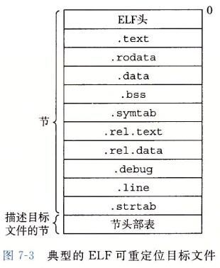
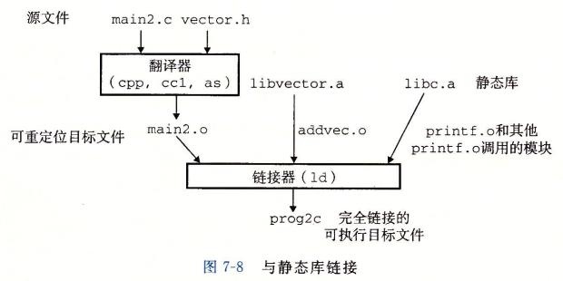

> @Date    : 2020-09-25 10:47:41
>
> @Author  : Lewis Tian (taseikyo@gmail.com)
>
> @Link    : github.com/taseikyo

# 链接（Linking）

## Table of Contents

- [7.1 编译器驱动程序](#71-编译器驱动程序)
- [7.2 静态链接](#72-静态链接)
- [7.3 目标文件](#73-目标文件)
- [7.4 可重定位目标文件](#74-可重定位目标文件)
- [7.5 符号和符号表](#75-符号和符号表)
	- [练习题 7.1](#练习题-71)
- [7.6 符号解析](#76-符号解析)
	- [7.6.1 链接器如何解析多重定义的全局符号](#761-链接器如何解析多重定义的全局符号)
	- [练习题 7.2](#练习题-72)
	- [7.6.2 与静态库链接](#762-与静态库链接)
	- [7.6.3 链接器如何使用静态库来解析引用](#763-链接器如何使用静态库来解析引用)
	- [练习题 7.3](#练习题-73)
- [7.7 重定位](#77-重定位)
	- [7.7.1 重定位条目](#771-重定位条目)
	- [7.7.2 重定位符号引用](#772-重定位符号引用)
		- [1. 重定位 PC 相对引用](#1-重定位-pc-相对引用)
		- [2. 重定位绝对引用](#2-重定位绝对引用)
	- [练习题 7.4](#练习题-74)
	- [练习题 7.5](#练习题-75)
- [7.8 可执行目标文件](#78-可执行目标文件)
- [7.9 加载可执行目标文件](#79-加载可执行目标文件)
- [7.10 动态链接共享库](#710-动态链接共享库)
- [7.11 从应用程序中加载和链接共享库](#711-从应用程序中加载和链接共享库)
- [7.12 位置无关代码](#712-位置无关代码)
	- [1. PIC 数据引用](#1-pic-数据引用)
	- [2.PIC 函数调用](#2pic-函数调用)
- [7.13 库打桩机制](#713-库打桩机制)
	- [7.13.1 编译时打桩](#7131-编译时打桩)
	- [7.13.2 链接时打桩](#7132-链接时打桩)
- [7.13.3 运行时打桩](#7133-运行时打桩)
- [7.14 处理目标文件的工具](#714-处理目标文件的工具)
- [7.15 小结](#715-小结)

链接（linking）是将各种代码和数据片段收集并组合成为一个单一文件的过程，这个文件可被加载（复制）到内存并执行。链接可以执行于编译时（compile time），也就是在源代码被翻译成机器代码时；也可以执行于加载时（load time），也就是在程序被加载器（loader）加载到内存并执行时；甚至执行于运行时（run time），也就是由应用程序来执行。在早期的计算机系统中，链接是手动执行的。在现代系统中，链接是由叫做链接器（linker）的程序自动执行的

链接器在软件开发中扮演着一个关键的角色，因为它们使得分离编译（separate compilation）成为可能。我们不用将一个大型的应用程序组织为一个巨大的源文件，而是可以把它分解为更小、更好管理的模块，可以独立地修改和编译这些模块。当我们改变这些模块中的一个时，只需简单地重新编译它，并重新链接应用，而不必重新编译其他文件。链接通常是由链接器来默默地处理的，对于那些在编程入门课堂上构造小程序的学生而言，链接不是一个重要的议题

- 理解链接器将帮助你构造大型程序。构造大型程序的程序员经常会遇到由于缺少模块、缺少库或者不兼容的库版本引起的链接器错误。除非你理解链接器是如何解析引用、什么是库以及链接器是如何使用库来解析引用的，否则这类错误将令你感到迷惑和挫败。
- 理解链接器将帮助你避免一些危险的编程错误。Linux 链接器解析符号引用时所做的决定可以不动声色地影响你程序的正确性。在默认情况下，错误地定义多个全局变量的程序将通过链接器，而不产生任何警告信息。由此得到的程序会产生令人迷惑的运行时行为，而且非常难以调试。我们将向你展示这是如何发生的，以及该如何避免它。
- 理解链接将帮助你理解语言的作用域规则是如何实现的。例如，全局和局部变量之间的区别是什么？当你定义一个具有 static 属性的变量或者函数时，实际到底意味着什么？
- 理解链接将帮助你理解其他重要的系统概念。链接器产生的可执行目标文件在重要的系统功能中扮演着关键角色，比如加载和运行程序、虚拟内存、分页、内存映射。
- 理解链接将使你能够利用共享库。多年以来，链接都被认为是相当简单和无趣的。然而，随着共享库和动态链接在现代操作系统中重要性的日益加强，链接成为一个复杂的过程，为掌握它的程序员提供了强大的能力。比如，许多软件产品在运行时使用共享库来升级压缩包装的（shrink-wrapped）二进制程序。还有，大多数 Web 服务器都依赖于共享库的动态链接来提供动态内容。

为了使描述具体和便于描述，完美讨论基于：Linux x86-64 系统，使用标准的 ELF-64（此后被称为 ELF）目标文件格式。无论使什么 OS、ISA 或者目标文件格式，基本链接概念是通用的。

## 7.1 编译器驱动程序

考虑图 7-1（下面）中的 C 语言程序，它将帮助我们说明关于链接是如何工作的一些重要知识点

```C
// code/link.main.c
int sum(int *a, int n);

int array[2] = {1, 2};

int main() {
	int val = sum(array, 2);
	return val;
}
```

```C
// code/link/sum.c
int sum(int *a, int n) {
	int i, s = 0;
	for (i = 0; i < n; i++) {
		s += a[i];
	}
	return s;
}
```

图 7-1 示例程序 1。这个示例程序由两个源文件组成，main.c 和 sum.c。main 函数初始化一个整数数组，然后调用 sum 函数来对数组元素求和

大多数编译系统提供编译器驱动程序（compiler driver），它代表用户在需要时调用语言预处理器、编译器、汇编器和链接器。比如，要用 GNU 编译系统构造示例程序，我们就要通过在 shell 中输入下列命令来调用 GCC 驱动程序：

```Bash
gcc -Og -o prog main.c sum.c
```


图 7-2 概括了驱动程序在将示例程序从 ASCII 码源文件翻译成可执行目标文件时的行为（GCC  -v 选项可以看步骤）。

1. 运行 C 预处理器（cpp），它将 C 的源程序 main.c 翻译成一个 ASCII 码的中间文件 main.i：

```BASH
cpp [other arguments] main.c /tmp/main.i
```

2. 运行 C 编译器（ccl），它将 main.i 翻译成一个 ASCII 汇编语言文件 main.s：

```Bash
ccl /tmp/main.i -Og [other arguments] -o /tmp/main.s
```

3. 运行汇编器（as），它将 main.s 翻译成一个可重定位目标文件（relocatable object file）main.o：

```Bash
as [other arguments] -o /tmp/main.o /tmp/main.s
```

驱动程序经过相同的过程生成 sum.o。最后，它运行链接器程序 ld，将 main.o 和 sum.o 以及一些必要的系统目标文件组合起来，创建一个可执行目标文件（executable object file）prog：

```Bash
ld -o prog [system object files and args] /tmp/main.o /tmp/sum.o
```

要运行可执行文件 prog，我们在 Linux shell 的命令行上输入它的名字：

```Bash
./prog
```

shell 调用操作系统中一个叫做加载器（loader）的函数，它将可执行文件 prog 中的代码和数据复制到内存，然后将控制转移到这个程序的开头

## 7.2 静态链接

像 Linux LD 程序这样的静态链接器（static linker）以一组可重定位目标文件和命令行参数作为输入，生成一个完全链接的、可以加载和运行的可执行目标文件作为输出。输入的可重定位目标文件由各种不同的代码和数据节（section）组成，每一节都是一个连续的字节序列。指令在一节中，初始化了的全局变量在另一节中，而未初始化的变量又在另外一节中

为了构造可执行文件，链接器必须完成两个主要任务：

- 符号解析（symbol resolution）。目标文件定义和引用符号，每个符号对应于一个函数、一个全局变量或一个静态变量（即 C 语言中任何以 static 属性声明的变量）。符号解析的目的是将每个符号引用正好和一个符号定义关联起来
- 重定位（relocation）。编译器和汇编器生成从地址 0 开始的代码和数据节。链接器通过把每个符号定义与一个内存位置关联起来，从而重定位这些节，然后修改所有对这些符号的引用，使得它们指向这个内存位置。链接器使用汇编器产生的重定位条目（relocation entry）的详细指令，不加甄别地执行这样的重定位

你应该记住关于链接器的一些基本事实：目标文件纯粹是字节块的集合。这些块中，有些包含程序代码，有些包含程序数据，而其他的则包含引导链接器和加载器的数据结构。链接器将这些块连接起来，确定被连接块的运行时位置，并且修改代码和数据块中的各种位置。链接器对目标机器了解甚少。产生目标文件的编译器和汇编器已经完成了大部分工作

## 7.3 目标文件

目标文件有三种形式：

1. 可重定位目标文件。包含二进制代码和数据，其形式可以在编译时与其他可重定位目标文件合并起来，创建一个可执行目标文件
2. 可执行目标文件。包含二进制代码和数据，其形式可以被直接复制到内存并执行
3. 共享目标文件。一种特殊类型的可重定位目标文件，可以在加载或者运行时被动态地加载进内存并链接

编译器和汇编器生成可重定位目标文件（包括共享目标文件）。链接器生成可执行目标文件。从技术上来说，一个目标模块（object module）就是一个字节序列，而一个目标文件（object file）就是一个以文件形式存放在磁盘中的目标模块

目标文件是按照特定的目标文件格式来组织的，各个系统的目标文件格式都不相同。从贝尔实验室诞生的第一个 Unix 系统使用的是 a.out 格式（直到今天，可执行文件仍然称为 a.out 文件）。Windows 使用可移植可执行（Portable Executable，PE）格式。Mac OSX 使用 Mach-O 格式。现代 x86-64Linux 和 Unix 系统使用可执行可链接格式（Execut-
able and Linkable Format，ELF）

## 7.4 可重定位目标文件

图 7-3 展示了一个典型的 ELF 可重定位目标文件的格式。ELF 头（ELF header）以一个 16 字节的序列开始，这个序列描述了生成该文件的系统的字的大小和字节顺序。ELF 头剩下的部分包含帮助链接器语法分析和解释目标文件的信息。其中包括 ELF 头的大小、目标文件的类型（如可重定位、可执行或者共享的）、机器类型（如 ×86-64）、节头部表（section header table）的文件偏移，以及节头部表中条目的大小和数量。不同节的位置和大小是由节头部表描述的，其中目标文件中每个节都有一个固定大小的条目（entry）



夹在 ELF 头和节头部表之间的都是节。一个典型的 ELF 可重定位目标文件包含下面几个节：

.text：已编译程序的机器代码
.rodata：只读数据，比如 printf 语句中的格式串和开关语句的跳转表
.data：已初始化的全局和静态 C 变量
：bss：未初始化的全局和静态 C 变量，以及所有被初始化为 0 的全局或静态变量。在目标文件中这个节不占据实际的空间，它仅仅是一个占位符。目标文件格式区分已初始化和未初始化变量是为了空间效率：在目标文件中，未初始化变量不需要占据任何实际的磁盘空间。运行时，在内存中分配这些变量，初始值为 0
.symtab：一个符号表，它存放在程序中定义和引用的函数和全局变量的信息。一些程序员错误地认为必须通过 -g 选项来编译一个程序才能得到符号表信息。实际上，每个可重定位目标文件在 .symtab 中都有一张符号表（除非程序员特意用 strip 命令去掉它）。然而，和编译器中的符号表不同，.symtab 符号表不包含局部变量的条目
.rel.text：一个 .text 节中位置的列表，当链接器把这个目标文件和其他文件组合时，需要修改这些位置。一般而言，任何调用外部函数或者引用全局变量的指令都需要修改。另一方面，调用本地函数的指令则不需要修改。注意，可执行目标文件中并不需要重定位信息，因此通常省略，除非用户显式地指示链接器包含这些信息
.rel.data：被模块引用或定义的所有全局变量的重定位信息。一般而言，任何已初始化的全局变量，如果它的初始值是一个全局变量地址或者外部定义函数的地址，都需要被修改
.debug：一个调试符号表，其条目是程序中定义的局部变量和类型定义，程序中定义和引用的全局变量，以及原始的 C 源文件。只有以 -g 选项调用编译器驱动程序时，才会得到这张表。
.line：原始 C 源程序中的行号和 .text 节中机器指令之间的映射。只有以 -g 选项调用编译器驱动程序时，才会得到这张表
.strtab：一个字符串表，其内容包括 .symtab 和 .debug 节中的符号表，以及节头部中的节名字。字符串表就是以 null 结尾的字符串的序列

> ### 旁注：为什么未初始化的数据称为 .bss
>
> 用术语 .bss 来表示未初始化的数据是很普遍的。它起始于 IBM704 汇编语言（大约在 1957 年）中 "块存储开始（Block Storage Start）" 指令的首字母缩写，并沿用至今。 一种记住 .data 和 .bss 节之间区别的简单方法是把 "bss" 看成是 "更好地节省空间（Better Save Space）" 的缩写。【奇怪的缩写增加了.jpg】

## 7.5 符号和符号表

每个可重定位目标模块 m 都有一个符号表，它包含 m 定义和引用的符号的信息。在链接器的上下文中，有三种不同的符号：

- 由模块 m 定义并能被其他模块引用的全局符号。全局链接器符号对应于非静态的 C 函数和全局变量
- 由其他模块定义并被模块 m 引用的全局符号。这些符号称为外部符号，对应于在其他模块中定义的非静态 C 函数和全局变量
- 只被模块 m 定义和引用的局部符号。它们对应于带 static 属性的 C 函数和全局变量

认识到本地链接器符号和本地程序变量不同是很重要的。.symtab 中的符号表不包含对应于本地非静态程序变量的任何符号。这些符号在运行时在栈中被管理，链接器对此类符号不感兴趣。
有趣的是，定义为带有 C static 属性的本地过程变量是不在栈中管理的。相反，编译器在 .data 或 .bss 中为每个定义分配空间，并在符号表中创建一个有唯一名字的本地链接器符号。比如，假设在同一模块中的两个函数各自定义了一个静态局部变量 x：

```C
int f() { static intx = 0; return x;}

int g() { static intx = 1; return x;}
```

在这种情况中，编译器向汇编器输出两个不同名字的局部链接器符号。比如，它可以用 x.1 表示函数 f 中的定义，而用 x.2 表示函数 g 中的定义

> 给 C 语言初学者：利用 static 属性隐藏变量和函数名字
>
> C 程序员使用 static 属性隐藏模块内部的变量和函数声明，就像你在 Java 和 C++ 中使用 public 和 private 声明一样。在 C 中，源文件扮演模块的角色。任何带有 static 属性声明的全局变量或者函数都是模块私有的。类似地，任何不带 static 属性声明的全局变量和函数都是公共的，可以被其他模块访问。尽可能用 static 属性来保护你的变量和函数是很好的编程习惯

符号表是由汇编器构造的，使用编译器输出到汇编语言 .s 文件中的符号。.symtab 节中包含 ELF 符号表。这张符号表包含一个条目的数组。图 7-4 展示了每个条目的格式

```C
// code/link/elfstructs.c

typedef struct {
	int name;/*String table offset*/
	char type: 4, /* Function or data (4 bits)*/
	     binding: 4; /* Local or global (4 bits)*/
	char reserved;/* Unused */
	short section;/* Section header index*/
	long value;/* Section offset or absolute address*/
	long size;/*Object size in bytes*/
} Elf64_Symbol;
```

图 7-4 ELF 符号表条目。type 和 binding 字段每个都是 4 位

【明明都是代码却放张图，跟 7-1 一样，译者有问题】

| 字段  | 含义                                                                                                                                                |
|-------|----------------------------------------------------------------------------------------------------------------------------------------------------|
| name  | 字符串表中的字节偏移，指向符号的以 null 结尾的字符串名字                                                                                                |
| value | 符号的地址。对于可重定位的模块来说，value 是距定义目标的节的起始位置的偏移。对于可执行目标文件来说，该值是一个绝对运行时地址                                  |
| size  | 目标的大小（以字节为单位）                                                                                                                            |
| type  | 通常要么是数据，要么是函数。符号表还可以包含各个节的条目，以及对应原始源文件的路径名的条目。所以这些目标的类型也有所不同。binding 字段表示符号是本地的还是全局的 |

每个符号都被分配到目标文件的某个节，由 section 字段表示，该字段也是一个到节头部表的索引。有三个特殊的伪节（pseudosection），它们在节头部表中是没有条目的：

- ABS 代表不该被重定位的符号
- UNDEF 代表未定义的符号，也就是在本目标模块中引用，但是却在其他地方定义的符号
- COMMON 表示还未被分配位置的未初始化的数据目标

对于 COMMON 符号，value 字段给出对齐要求，而 size 给出最小的大小。注意，只有可重定位目标文件中才有这些伪节，可执行目标文件中是没有的

COMMON 和 .bss 的区别很细微。现代的 GCC 版本根据以下规则来将可重定位目标文件中的符号分配到 COMMON 和 .bss 中：

- COMMON 未初始化的全局变量
- .bss 未初始化的静态变量，以及初始化为 0 的全局或静态变量

采用这种看上去很绝对的区分方式的原因来自于链接器执行符号解析的方式，我们会在
7.6 节中加以解释

GNU readelf 程序是一个查看目标文件内容的很方便的工具。比如，下面是图 7-1 中示例程序的可重定位目标文件 main.o 的符号表中的最后三个条目。开始的 8 个条目没有显示出来，它们是链接器内部使用的局部符号

【命令怎么都喜欢大写，前面的 strip 是这样，readelf 也是，大小写第一眼还是不同的好吧，上面第一眼看 STRIP 没认出来时个什么词，绝了】

```Bash
Num:	Value			Size	Type	Bind 	Vis 	Ndx Name
8:	0000000000000000	24 		FUNC	GLOBAL	DEFAULT 1	main
9:	0000000000000000	8 		OBJECT	GLOBAL	DEFAULT 3 	array
10:	0000000000000000	0 		NOTYPE	GLOBAL	DEFAULT UND sum
```

在这个例子中，我们看到全局符号 main 定义的条目，它是一个位于 .text 节中偏移量为 0（即 value 值）处的 24 字节函数。其后跟随着的是全局符号 array 的定义，它是一个位于 .data 节中偏移量为 0 处的 8 字节目标。最后一个条目来自对外部符号 sum 的引用。readelf 用一个整数索引来标识每个节。Ndx=1 表示 .text 节，而 Ndx=3 表示 .data 节
 
【试了下用 readelf 看 main.o，多了个 `_GLOBAL_OFFSET_TABLE_`，https://stackoverflow.com/questions/9685699/what-is-global-offset-table ，"用于查找 PIC（位置无关代码）的全局变量（函数，变量等）的实际地址，它通常称为 GOT"】

```Bash
 tian@node:~/Desktop/200925-test$ gcc -c main.c
 tian@node:~/Desktop/200925-test$ file main.o
main.o: ELF 64-bit LSB relocatable, x86-64, version 1 (SYSV), not stripped
 tian@node:~/Desktop/200925-test$ readelf -s main.o

Symbol table '.symtab' contains 12 entries:
   Num:    Value          Size Type    Bind   Vis      Ndx Name
     0: 0000000000000000     0 NOTYPE  LOCAL  DEFAULT  UND 
     1: 0000000000000000     0 FILE    LOCAL  DEFAULT  ABS main.c
     2: 0000000000000000     0 SECTION LOCAL  DEFAULT    1 
     3: 0000000000000000     0 SECTION LOCAL  DEFAULT    3 
     4: 0000000000000000     0 SECTION LOCAL  DEFAULT    4 
     5: 0000000000000000     0 SECTION LOCAL  DEFAULT    6 
     6: 0000000000000000     0 SECTION LOCAL  DEFAULT    7 
     7: 0000000000000000     0 SECTION LOCAL  DEFAULT    5 
     8: 0000000000000000     8 OBJECT  GLOBAL DEFAULT    3 array
     9: 0000000000000000    33 FUNC    GLOBAL DEFAULT    1 main
    10: 0000000000000000     0 NOTYPE  GLOBAL DEFAULT  UND _GLOBAL_OFFSET_TABLE_
    11: 0000000000000000     0 NOTYPE  GLOBAL DEFAULT  UND sum
```

### 练习题 7.1

这个题目针对图 7-5 中的 m.o 和 swap.o 模块。对于每个在 swap.o 中定义或引用的符号，请指出它是否在模块 swap.o 中的.symtab 节中有一个符号表条目。如果是，请指出定义该符号的模块（swap.o 或者 m.o）、符号类型（局部、全局或者外部）以及它在模块中被分配到的节（.text、.data、.bss 或 COMMON）。

```C
// code/link/m.c
void swap();
int buf[2] = {1, 2};

int main() {
	swap();
	return 0;
}
```

```C
// code/link/swap.c
extern int buf[];

int *bufp0 = &buf[0];
int *bufp1;

void swap() {
	int temp;
	bufp1 = &buf[1];
	temp = *bufp0;
	*bufp0 = *bufp1;
	*bufp1 = temp;
}
```

| 符号  | .symtab 条目？ | 符号类型 | 在哪个模块中定义 | 节 |
|-------|----------------|----------|------------------|----|
| buf   |                |          |                  |    |
| bufp0 |                |          |                  |    |
| bufp1 |                |          |                  |    |
| swap  |                |          |                  |    |
| temp  |                |          |                  |    |

【下面是我的结果，不知道正确与否，也没搜到标准答案】

| 符号  | .symtab 条目？ | 符号类型 | 在哪个模块中定义 | 节     |
|-------|----------------|----------|------------------|--------|
| buf   | Y              | 外部     | m.o              | .data  |
| bufp0 | Y              | 全局     | swap.o           | .data  |
| bufp1 | Y              | 全局     | swap.o           | COMMON |
| swap  | Y              | 全局     | swap.o           | .text  |
| temp  | N              | 局部     | swap.o           |        |

```Bash
tian@node:~/Desktop/200925-test$ readelf -s swap.o

Symbol table '.symtab' contains 13 entries:
   Num:    Value          Size Type    Bind   Vis      Ndx Name
     0: 0000000000000000     0 NOTYPE  LOCAL  DEFAULT  UND 
     1: 0000000000000000     0 FILE    LOCAL  DEFAULT  ABS swap.c
     2: 0000000000000000     0 SECTION LOCAL  DEFAULT    1 
     3: 0000000000000000     0 SECTION LOCAL  DEFAULT    3 
     4: 0000000000000000     0 SECTION LOCAL  DEFAULT    4 
     5: 0000000000000000     0 SECTION LOCAL  DEFAULT    5 
     6: 0000000000000000     0 SECTION LOCAL  DEFAULT    8 
     7: 0000000000000000     0 SECTION LOCAL  DEFAULT    9 
     8: 0000000000000000     0 SECTION LOCAL  DEFAULT    7 
     9: 0000000000000000     8 OBJECT  GLOBAL DEFAULT    5 bufp0
    10: 0000000000000000     0 NOTYPE  GLOBAL DEFAULT  UND buf
    11: 0000000000000008     8 OBJECT  GLOBAL DEFAULT  COM bufp1
    12: 0000000000000000    63 FUNC    GLOBAL DEFAULT    1 swap
```

readelf -S 可以看对应节的 Ndx，1 是 .text，3 是 .data，5 是 .data.rel

## 7.6 符号解析

链接器解析符号引用的方法是将每个引用与它输入的可重定位目标文件的符号表中的一个确定的符号定义关联起来。对那些和引用定义在相同模块中的局部符号的引用，符号解析是非常简单明了的。编译器只允许每个模块中每个局部符号有一个定义。静态局部变量也会有本地链接器符号，编译器还要确保它们拥有唯一的名字

不过，对全局符号的引用解析就棘手得多。当编译器遇到一个不是在当前模块中定义的符号（变量或函数名）时，会假设该符号是在其他某个模块中定义的，生成一个链接器符号表条目，并把它交给链接器处理。如果链接器在它的任何输入模块中都找不到这个被引用符号的定义，就输出一条（通常很难阅读的）错误信息并终止。比如，如果编译如下代码：

```C
// linkerror.c
void foo(void);

int main() {
	foo();
	return 0;
}
```

```Bash
tian@node:~/Desktop/200925-test$ gcc -Wall -Og -o linkerror linkerror.c
/tmp/ccAhDBe6.o: In function `main':
linkerror.c:(.text+0x5): undefined reference to `foo'
collect2: error: ld returned 1 exit status
```

对全局符号的符号解析很棘手，还因为多个目标文件可能会定义相同名字的全局符号。在这种情况中，链接器必须要么标志一个错误，要么以某种方法选出一个定义并抛弃其他定义。Linux 系统采纳的方法涉及编译器、汇编器和链接器之间的协作，这样也可能给不警觉的程序员带来一些麻烦

> ### 旁注：对 C++ 和 Java 中链接器符号的重整
>
> C++ 和 Java 都允许重载方法，这些方法在源代码中有相同的名字，却有不同的参数列表。那么链接器是如何区别这些不同的重载函数之间的差异呢？C++ 和 Java 中能使用重载函数，是因为编译器将每个唯一的方法和参数列表组合编码成一个对链接器来说唯一的名字。这种编码过程叫做重整（mangling），而相反的过程叫做恢复（demangling）
>
> 幸运的是，C++ 和 Java 使用兼容的重整策略。一个被重整的类名字是由名字中字符的整数数量，后面跟原始名字组成的。比如，类 Foo 被编码成 3Foo。方法被编码为原始方法名，后面加上 `__`，加上被重整的类名，再加上每个参数的单字母编码。比如，`Foo::bar(int, long)` 被编码为 `bar__3Fooil`。重整全局变量和模板名字的策略是相似的

### 7.6.1 链接器如何解析多重定义的全局符号

链接器的输入是一组可重定位目标模块。每个模块定义一组符号，有些是局部的（只对定义该符号的模块可见），有些是全局的（对其他模块也可见）。如果多个模块定义同名的全局符号，会发生什么呢？下面是 Linux 编译系统采用的方法

在编译时，编译器向汇编器输出每个全局符号，或者是强（strong）或者是弱（weak），而汇编器把这个信息隐含地编码在可重定位目标文件的符号表里。函数和已初始化的全局变量是强符号，未初始化的全局变量是弱符号。

根据强弱符号的定义，Linux 链接器使用下面的规则来处理多重定义的符号名：

1. 不允许有多个同名的强符号
2. 如果有一个强符号和多个弱符号同名，那么选择强符号
3. 如果有多个弱符号同名，那么从这些弱符号中任意选择一个

比如，假设我们试图编译和链接下面两个 C 模块，链接器将生成一条错误信息，因为强符号 main 被定义了多次（规则 1）：

```C
/* foo1.c */
int main() { return 0; }

/* bar1.c */
int main() { return 0; }
```

链接器对于下面的模块也会生成一条错误信息，因为强符号 x 被定义了两次（规则 1）：

```C
/* foo2.c */
int x = 15213;
int main() {
	return 0;
}

/* bar2.c */
int x = 15213;
void f() {}
```

然而，如果在一个模块里 x 未被初始化，那么链接器将安静地选择在另一个模块中定义的强符号（规则 2）：

```C
/* foo3.c */
#include<stdio.h>

void f(void);
int x = 15213;

int main() {
	f();
	printf("x=%d\n", x);
	return 0;
}

/* bar3.c */
int x;

void f() {
	x = 15212;
}
```

在运行时，函数 f 将 x 的值由 15213 改为 15212，这会给 main 函数的作者带来不受欢迎的意外！注意，链接器通常不会表明它检测到多个 x 的定义

如果 x 有两个弱定义，也会发生相同的事情（规则 3）：

```C
/* foo4.c */
#include<stdio.h>
void f(void);
int x;

int main() {
	x = 15213;
	f();
	printf("x=%d\n", x);
	return 0;
}

/* bar4.c */
int x;

void f() {
	x = 15212;
}
```

规则 2 和规则 3 的应用会造成一些不易察觉的运行时错误，对于不警觉的程序员来说，是很难理解的，尤其是如果重复的符号定义还有不同的类型时。考虑下面这个例子，其中 x 不幸地在一个模块中定义为 int，而在另一个模块中定义为 double：

```C
/* foo5.c */
#include<stdio.h>
void f(void);
int y = 15212;
int x = 15213;

int main() {
	f();
	printf("x=0x%x y=0x%x \n", x, y);
	return 0;
}

/* bar5.c */
double x;

void f() {
	x = -0.0;
}
```

在一台 x86-64/Linux 机器上，doub1e 类型是 8 个字节，而 int 类型是 4 个字节。在我们的系统中，x 的地址是 0x601020，y 的地址是 0x601024。因此，bar5.c 的第 6 行中的赋值 x=-0.0 将用负零的双精度浮点表示覆盖内存中 x 和 y 的位置！

【果然 y 也变了，有趣】

```Bash
tian@node:~/Desktop/200925-test$ gcc -Wall -Og -o foobar5 foo5.c bar5.c
/usr/bin/ld: Warning: alignment 4 of symbol `x' in /tmp/ccFVqZcn.o is smaller than 8 in /tmp/ccY8TO0s.o
tian@node:~/Desktop/200925-test$ ./foobar5
x=0x0 y=0x80000000
```

这是一个细微而令人讨厌的错误，尤其是因为它只会触发链接器发出一条警告，而且通常要在程序执行很久以后才表现出来，且远离错误发生地。在一个拥有成百上千个模块的大型系统中，这种类型的错误相当难以修正，尤其因为许多程序员根本不知道链接器是如何工作的。当你怀疑有此类错误时，用像 GCC -fno-common 标志这样的选项调用链接器，这个选项会告诉链接器，在遇到多重定义的全局符号时，触发一个错误。或者使用 -Werror 选项，它会把所有的警告都变为错误

在 7.5 节中，我们看到了编译器如何按照一个看似绝对的规则来把符号分配为 COMMON 和 .bss。实际上，采用这个惯例是由于在某些情况中链接器允许多个模块定义同名的全局符号。当编译器在翻译某个模块时，遇到一个弱全局符号，比如说 x，它并不知道其他模块是否也定义了 x，如果是，它无法预测链接器该使用 x 的多重定义中的哪一个。所以编译器把 x 分配成 COMMON，把决定权留给链接器。另一方面，如果 x 初始化为 0，那么它是一个强符号（因此根据规则 2 必须是唯一的），所以编译器可以很自信地将它分配成.bss。类似地，静态符号的构造就必须是唯一的，所以编译器可以自信地把它们分配成 .data 或.bss

### 练习题 7.2

在此题中，REF（x.i）→DEF（x.k）表示链接器将把模块 i 中对符号 x 的任意引用与模块 k 中 x 的定义关联起来。对于下面的每个示例，用这种表示法来说明链接器将如何解析每个模块中对多重定义符号的引用。如果有一个链接时错误（规则 1），写
"错误"。如果链接器从定义中任意选择一个（规则 3），则写 "未知"。

```
A. /*Module 1*/             /*Module 2*/
int main() {}              int main;
                           int p2() {}

(a)REF(main.1)→DEF()
(b)REF(main.2)→DEF()

B. /*Module 1*/             /*Module 2*/
void main() {}              int main=1;
                            int p2() {}


(a)REF(main.1)→DEF()
(b)REF(main.2)→DEF()

C. /*Module 1*/           /*Module 2*/
int x;                    double x=1.0;
void main(){}             int p2() {}

(a)REF(x.1)→DEF()
(b)REF(x.2)→DEF()
```

【好玩的】

```
A. /*Module 1*/             /*Module 2*/
int main() {}              int main;
                           int p2() {}

(a)REF(main.1)→DEF(main.2)
(b)REF(main.2)→DEF(main.1)

B. /*Module 1*/             /*Module 2*/
void main() {}              int main=1;
                            int p2() {}


(a)REF(main.1)→DEF(错误)
(b)REF(main.2)→DEF(错误)

C. /*Module 1*/           /*Module 2*/
int x;                    double x=1.0;
void main(){}             int p2() {}

(a)REF(x.1)→DEF(x.2)
(b)REF(x.2)→DEF(x.1)
```

### 7.6.2 与静态库链接

迄今为止，我们都是假设链接器读取一组可重定位目标文件，并把它们链接起来，形 成一个输出的可执行文件。实际上，所有的编译系统都提供一种机制，将所有相关的目标 模块打包成为一个单独的文件，称为静态库 (static library), 它可以用做链接器的输入。 当链接器构造一个输出的可执行文件时，它只复制静态库里被应用程序引用的目标模块

为什么系统要支持库的概念呢？以 ISO C99 为例，它定义了一组广泛的标准 I/O、字 符串操作和整数数学函数，例如 atoi、printf, scanf、strcpy 和 rand。它们在 libc.a 库中，对每个 C 程序来说都是可用的。ISOC99 还在 libm.a 库中定义了一组广泛的浮 点数学函数，例如 sin、cos 和 sqrt

让我们来看看如果不使用静态库，编译器开发人员会使用什么方法来向用户提供这些函数。一种方法是让编译器辨认出对标准函数的调用，并直接生成相应的代码。Pascal (只提供了一小部分标准函数) 采用的就是这种方法，但是这种方法对 C 而言是不合适的，因为 C 标准定义了大量的标准函数。这种方法将给编译器增加显著的复杂性，而且每次添加、删除或修改一个标准函数时，就需要一个新的编译器版本。然而，对于应用程序员而言，这种方法会是非常方便的，因为标准函数将总是可用的

另一种方法是将所有的标准 C 函数都放在一个单独的可重定位目标模块中 (比如说 libc.o 中) 应用程序员可以把这个模块链接到他们的可执行文件中：

```Bash
gcc main.c /usr/lib/libc.o
```

这种方法的优点是它将编译器的实现与标准函数的实现分离开来，并且仍然对程序员保持适度的便利。然而，一个很大的缺点是系统中每个可执行文件现在都包含着一份标准：函数集合的完全副本，这对磁盘空间是很大的浪费。（在一个典型的系统上，libc.a 大约 是 5MB, 而 libm.a 大约是 2MB）。更糟的是，每个正在运行的程序都将它自己的这些函数的副本放在内存中，这是对内存的极度浪费。另一个大的缺点是，对任何标准函数的任何改变，无论多么小的改变，都要求库的开发人员重新编译整个源文件，这是一个非常耗时的操作，使得标准函数的开发和维护变得很复杂

我们可以通过为每个标准函数创建一个独立的可重定位文件，把它们存放在一个为大 家都知道的目录中来解决其中的一些问题。然而，这种方法要求应用程序员显式地链接合 适的目标模块到它们的可执行文件中，这是一个容易出错而旦耗时的过程：

```Bash
gcc main.c /usr/lib/printf.o /usr/lib/scanf.o ...
```

静态库概念被提出来，以解决这些不同方法的缺点。相关的函数可以被编译为独立的目标模块，然后封装成一个单独的静态库文件。然后，应用程序可以通过在命令行上指定单独的文件名字来使用这些在库中定义的函数。比如，使用 C 标准库和数学库中函数的程序可以用形式如下的命令行来编译和链接：

```Bash
gcc main.c /usr/lib/libm.a /usr/lib/libc.a
```

在链接时，链接器将只复制被程序引用的目标模块，这就减少了可执行文件在磁盘和内存中的大小。另一方面，应用程序员只需要包含较少的库文件的名字（实际上，C 编译器驱动程序总是传送 libc.a 给链接器，所以前面提到的对 libc.a 的引用是不必要的）

在 Linux 系统中，静态库以一种称为存档（archive）的特殊文件格式存放在磁盘中。存档文件是一组连接起来的可重定位目标文件的集合，有一个头部用来描述每个成员目标文件的大小和位置。存档文件名由后缀 .a 标识

为了使我们对库的讨论更加形象具体，考虑图 7-6 中的两个向量例程。每个例程定义在它自己的目标模块中，对两个输入向量进行一个向量操作，并把结果存放在一个输出向量中。每个例程有一个副作用，会记录它自己被调用的次数，每次被调用会把一个全局变量加 1（当我们在 7. 12 节中解释位置无关代码的思想时会起作用）

```C
// code/link/addvec.c

int addcnt = 0;

void addvec(int *x, int *y,
            int *z, int n) {
	int i;
	addcnt++;
	for (i = 0; i < n; i++)
		z[i] = x[i] + y[i];
}
```

```C
// code/link/multvec.c
int multcnt = 0;

void multvec(int *x, int *y,
             int *z, int n) {
	int i;
	multcnt++;
	for (i = 0; i < n; i++)
		z[i] = x[i] * y[i];
}

```

图 7-6 libvector 库中的成员目标文件

```Bash
gcc -c addvec.c multvec.c
ar res libvector.a addvec.o multvec.o
```

为了使用这个库，我们可以编写一个应用，比如图 7-7 中的 main2.c，它调用 addvec 库例程。包含（或头）文件 vector.h 定义了 libvector.a 中例程的函数原型

```C
// code/link/main2. c
#include <stdio.h>
#include "vector.h"

int	x[2] = {1, 2};
int y[2] = {3, 4};
int	z[2];

int	main() {
	addvec(x, y, z, 2);
	printf ("z = [%d %d] \n", z[0], z[1]);
	return 0;
}
```

为了创建这个可执行文件，我们要编译和链接输入文件 main.o 和 libvector.a：

```C
gcc -c main2.c
gcc -static -o prog2c main2.o ./libvector.a
```

或者等价地使用：

```C
gcc -c main2.c
gcc -static -o prog2c main2.o -L. -lvector
```

图 7-8 概括了链接器的行为。-static 参数告诉编译器驱动程序，链接器应该构建一 个完全链接的可执行目标文件，它可以加载到内存并运行，在加载时无须更进一步的链接。-lvector 参数是 libvector.a 的缩写，-L. 参数告诉链接器在当前目录下查找 libvector.a



当链接器运行时，它判定 main2.0 引用了 addvec.o 定义的 addvec 符号，所以复制 addvec.o 到可执行文件。因为程序不引用任何由 multvec.o 定义的符号，所以链接器就不会复制这个模块到可执行文件。链接器还会复制 libc.a 中的 printf.o 模块，以及许多 C 运行时系统中的其他模块

### 7.6.3 链接器如何使用静态库来解析引用

虽然静态库很有用，但是它们同时也是一个程序员迷惑的源头，原因在于 Linux 链接器使用它们解析外部引用的方式。在符号解析阶段，链接器从左到右按照它们在编译器驱动程序命令行上出现的顺序来扫描可重定位目标文件和存档文件（驱动程序自动将命令行中所有的 .c 文件翻译为 .o 文件）。在这次扫描中，链接器维护一个可重定位目标文件的集合 E（这个集合中的文件会被合并起来形成可执行文件），一个未解析的符号（即引用了但是尚未定义的符号）集合 U，以及一个在前面输入文件中已定义的符号集合 D，初始时， E U D 均为空

- 对于命令行上的每个输入文件 f，链接器会判断 f 是一个目标文件还是一个存档文件。如果 f 是一个目标文件，那么链接器把 f 添加到 E，修改 U 和 D 来反映 f 中 的符号定义和引用，并继续下一个输入文件
- 如果 f 是一个存档文件，链接器尝试匹配 U 中未解析的符号和由存档文件成员定义的符号。如果某个存档文件成员 m，定义了一个符号来解析 U 中的一个引用，那么就 将 m 加到 E 中，并且链接器修改 U 和 D。来反映 m 中的符号定义和引用。对存档文件中所有的成员目标文件都依次进行这个过程，直到 U 和 D 都不再发生变化。此时，任何不包含在 E 中的成员目标文件都简单地被丢弃，而链接器将继续处理下一个输入文件
- 如果当链接器完成对命令行上输入文件的扫描后，U 是非空的，那么链接器就会输出一 个错误并终止。否则，它会合并和重定位 E 中的目标文件，构建输出的可执行文件

这种算法会导致一些链接时错误，因为命令行上的库和目标文件的顺序非常重要。在命令行中，如果定义一个符号的库出现在引用这个符号的目标文件之前，那么引用就不能被解析，链接会失败：

```Bash
gcc static ./libvector.a main2.c
/tmp/cc9XH6Rp.o: In function 'main':
/tmp/cc9XH6Rp.o（.text+0xl8）: undefined reference to 'addvec'
```

在处理 libvector.a 时，U 是空的，所以没有 libvector.a 中的成员目标文件会添加到 E 中。因此，对 addvec 的引用是绝不会被解析的，所以链接器会产生一条错误信息并终止

关于库的一般准则是将它们放在命令行的结尾。如果各个库的成员是相互独立的（也就是说没有成员引用另一个成员定义的符号），那么这些库就可以以任何顺序放置在命令行的结尾处。另一方面，如果库不是相互独立的，那么必须对它们排序，使得对于每个被存档文件的成员外部引用的符号 S，在命令行中至少有一个 S 的定义是在对 S 的引用之后的。比如，假设 foo.c 调用 libx.a 和 libz.a 中的函数，而这两个库又调用 liby.a 中 的函数。那么，在命令行中 libx.a 和 libz.a 必须处在 liby.a 之前：

```Bash
gcc foo.c libx.a libz.a liby.a
```

如果需要满足依赖需求，可以在命令行上重复库。比如，假设 foo.c 调用 libx.a 中的函数，该库又调用 liby.a 中的函数，而 liby.a 又调用 libx.a 中的函数。那么 libx. a 必须在命令行上重复出现：

```Bash
gcc foo.c libx.a liby.a libx.a
```

另一种方法是，我们可以将 libx.a 和 liby.a 合并成一个单独的存档文件

### 练习题 7.3

a 和 b 表示当前目录中的目标模块或者静态库，而 a→b 表示 a 依赖于 b, 也 就是说 b 定义了一个被 a 引用的符号。对于下面每种场景，请给出最小的命令行（即一个含有最少数量的目标文件和库参数的命令），使得静态链接器能解析所有的符号引用

A. p.o → libx.a
B. p.o → libx.a → liby.a
C. p.o → libx.a → liby.a 且 liby.a → libx.a → p.o

```Bash
gcc p.o libx.a
gcc p.o libx.a liby.a
gcc p.o libx.a liby.a libx.a p.o
```

## 7.7 重定位

一旦链接器完成了符号解析这一步，就把代码中的每个符号引用和正好一个符号定义（即它的一个输入目标模块中的一个符号表条目）关联起来。此时，链接器就知道它的输入目标模块中的代码节和数据节的确切大小。现在就可以开始重定位步骤了，在这个步骤中，将合并输入模块，并为每个符号分配运行时地址。重定位由两步组成：

- 重定位节和符号定义。在这一步中，链接器将所有相同类型的节合并为同一类型的新的聚合节。例如，来自所有输入模块的 .data 节被全部合并成一个节，这个节成为输出的可执行目标文件的 .data 节。然后，链接器将运行时内存地址赋给新的聚合节，赋给输入模块定义的每个节，以及赋给输入模块定义的每个符号。当这一步完成时，程序中的每条指令和全局变量都有唯一的运行时内存地址了
- 重定位节中的符号引用。在这一步中，链接器修改代码节和数据节中对每个符号的引用，使得它们指向正确的运行时地址。要执行这一步，链接器依赖于可重定位目标模块中称为重定位条目（relocation entry）的数据结构

### 7.7.1 重定位条目

当汇编器生成一个目标模块时，它并不知道数据和代码最终将放在内存中的什么位置。它也不知道这个模块引用的任何外部定义的函数或者全局变量的位置。所以，无论何时汇编器遇到对最终位置未知的目标引用，它就会生成一个重定位条目，告诉链接器在将目标文件合并成可执行文件时如何修改这个引用。代码的重定位条目放在 .rel.text 中。已初始化数据的重定位条目放在 .rel.data 中

图 7-9 展示了 ELF 重定位条目的格式。offset 是需要被修改的引用的节偏移。symbol 标识被修改引用应该指向的符号。type 告知链接器如何修改新的引用。addend 是一个有 符号常数，一些类型的重定位要使用它对被修改引用的值做偏移调整

```C
// code/link/elfstructs.c
typedef struct {
	long offset;     /* Offset of the reference to relocate */
	long type: 32,   /* Relocation type */
	     symbol: 32; /* Symbol table index */
	long addend;     /* Constant part of relocation expression */
} Elf64_Rela;
```

图 7-9 ELF 重定位条目。每个条目表示一个必须被重定位的引用，并指明如何计算被修改的引用

ELF 定义了 32 种不同的重定位类型，有些相当隐秘。我们只关心其中两种最基本的重定位类型：

- R_X86_64_PC32。重定位一个使用 32 位 PC 相对地址的引用。回想一下 3.6.3 节，一个 PC 相对地址就是距程序计数器（PC）的当前运行时值的偏移量。当 CPU 执行一条使用 PC 相对寻址的指令时，它就将在指令中编码的 32 位值加上 PC 的当前运行时值，得到有效地址（如 call 指令的目标），PC 值通常是下一条指令在内存中的地址
- R_X86_64_32。重定位一个使用 32 位绝对地址的引用。通过绝对寻址，CPU 直接使用在指令中编码的 32 位值作为有效地址，不需要进一步修改

这两种重定位类型支持 x86-64 小型代码模型（small code model），该模型假设可执行目标文件中的代码和数据的总体大小小于 2GB，因此在运行时可以用 32 位 PC 相对地址来访问。GCC 默认使用小型代码模型。大于 2GB 的程序可以用 -mcmodel=medium（中型代码模型）和 -mcmodel=large（大型代码模型）标志来编译，不过在此我们不讨论这些模型

### 7.7.2 重定位符号引用

图 7-10 展示了链接器的重定位算法的伪代码。第 1 行和第 2 行在每个节 s 以及与每个节相关联的重定位条目 r 上迭代执行。为了使描述具体化，假设每个节 s 是一个字节数组，每个重定位条目 r 是一个类型为 Elf64_Rela 的结构，如图 7-9 中的定义。另外，还假设当算法运行时，链接器已经为每个节（用 ADDR(s) 表示）和每个符号都选择了运行时地址（用 ADDR(r.symbol) 表示）。第 3 行计算的是需要被重定位的 4 字节引用的数组 s 中的地址。根据类型来选择重定位方式。

```C
foreach section s {
foreach relocation entry r {
	refptr = s + r.offset;  /* ptr to reference to be relocated */

	/* Relocate a PC-relative reference */
	if (r.type == R_X86_64_PC32) {
			refaddr = ADDR(s) + r.offset; /* ref's run-time address */
			*refptr = (unsigned) (ADDR(r.symbol) + r.addend - refaddr);
		}

	/* Relocate an absolute reference */
	if (r.type == R_X86_64_32)
		*refptr = (unsigned) (ADDR(r.symbol) + r.addend);
	}
}
```

图 7-10 重定位算法

让我们来看看链接器如何用这个算法来重定位图 7-1 示例程序中的引用。图 7-11 给出了（用 `objdump-dx main.o` 产生的）GNU OBJDUMP 工具产生的 main.o 的反汇编代码。

```Bash
# code/link/main-relo.d
0000000000000000 <main>:         
   0:   48 83 ec 08             sub    $0x8,%rsp
   4:   be 02 00 00 00          mov    $0x2,%esi
   9:   bf 00 00 00 00          mov    $0x0,%edi        %edi = &array
                        a: R_X86_64_32 array            Relocation entry
   e:   e8 00 00 00 00          callq  13 <main+0x13>   sum()
                        f: R_X86_64_PC32 sum-0x4        Relocation entry
  13:   48 83 c4 08             add $0x8,%rsp
  17:   c3                      retq
```

图 7-11 main.o 的代码和重定位条目。原始 C 代码在图 7-1 中

main 函数引用了两个全局符号：array 和 sum。为每个引用，汇编器产生一个重定位条目，显示在引用的后面一行上。这些重定位条目告诉链接器对 sum 的引用要使用 32 位 PC 相对地址进行重定位，而对 array 的引用要使用 32 位绝对地址进行重定位（回想一下. 重定位条目和指令实际上存放在目标文件的不同节中。为了方便，OBJDUMP 工具把它们显示在一起）

#### 1. 重定位 PC 相对引用

图 7-11 的第 6 行中，函数 main 调用 sum 函数，sum 函数是在模块 sum.o 中定义的。call 指令开始于节偏移 0xe 的地方，包括 1 字节的操作码 0xe8，后面跟着的是对目标 sum 的 32 位 PC 相对引用的占位符

相应的重定位条目 r 由 4 个字段组成：

```C
r.offset = 0xf
r.symbol = sum
r.type   = R_X86_64_PC32
r.addend = -4
```

这些字段告诉链接器修改开始于偏移量 0xf 处的 32 位 PC 相对引用，这样在运行时它会指向 sum 例程。现在，假设链接器已经确定

```C
ADDR(s) = ADDR(.text) = 0x4004d0
```

和

```C
ADDR(r.symbol) = ADDR(sum) = 0x4004e8
```

使用图 7-10 中的算法，链接器首先计算出引用的运行时地址（第 7 行）：

```C
refaddr = ADDR(s)  + r.offset
        = 0x4004d0 + 0xf
        = 0x4004df
```

然后，更新该引用，使得它在运行时指向 sum 程序（第 8 行）：

```C
*refptr = (unsigned) (ADDR(r.symbol) + r.addend - refaddr)
        = (unsigned) (0x4004e8       + (-4)     - 0x4004df)
        = (unsigned) (0x5)
```

在得到的可执行目标文件中，call 指令有如下的重定位的形式：

```C
4004de:  e8 05 00 00 00      callq  4004e8 <sum>       sum()
```

在 call 指令之后的指令的地址。为了执行这条指令，CPU 执行以下的步骤：

1. 将 PC 压入栈中
2. PC ← PC + 0x5 = 0x4004e3 + 0x5 = 0x4004e8

因此，要执行的下一条指令就是 sum 例程的第一条指令，这当然就是我们想要的！

#### 2. 重定位绝对引用

重定位绝对引用相当简单。例如，图 7-11 的第 4 行中，mov 指令将 array 的地址（一个 32 位立即数值）复制到寄存器％edi 中。mov 指令开始于节偏移量 0x9 的位置，包括 1 字节操作码 Oxbf，后面跟着对 array 的 32 位绝对引用的占位符。

对应的占位符条目 r 包括 4 个字段：

```C
r.offset = 0xa
r.symbol = array
r.type   = R_X86_64_32
r.addend = 0
```

这些字段告诉链接器要修改从偏移量 0xa 开始的绝对引用，这样在运行时它将会指向 array 的第一个字节。现在，假设链接器巳经确定

```C
ADDR(r.symbol) = ADDR(array) = 0x601018
```

链接器使用图 7-10 中算法的第 13 行修改了引用：

```C
*refptr = (unsigned) (ADDR(r.symbol) + r.addend)
        = (unsigned) (0x601018       + 0)
        = (unsigned) (0x601018)
```

在得到的可执行目标文件中，该引用有下面的重定位形式：

```C
4004d9:  bf 18 10 60 00	      mov   $0x601018,%edi         %edi = &array
```

综合到一起，图 7-12 给出了最终可执行目标文件中已重定位的 .text 节和 .data 节。在加载的时候，加载器会把这些节中的字节直接复制到内存，不再进行任何修改地执行这些指令

```Bash
# 已重定位的 .text 节
00000000004004d0 <main>:
  4004d0:  48 83 ec 08          sub    $0x8,%rsp
  4004d4:  be 02 00 00 00       mov    $0x2,%esi
  4004d9:  bf 18 10 60 00       mov    $0x601018,%edi    %edi = &array
  4004de:  e8 05 00 00 00       callq  4004e8 <sum>      sum()
  4004e3:  48 83 c4 08          add    $0x8,%rsp
  4004e7:  c3                   retq

00000000004004e8 <sum>:
  4004e8:  b8 00 00 00 00       mov    $0x0,%eax
  4004ed:  ba 00 00 00 00       mov    $0x0,%edx
  4004f2:  eb 09                jmp    4004fd <sum+0xl5>
  4004f4:  48 63 ca             movslq %edx,%rcx
  4004f7:  03 04 8f             add    (%rdi,%rcx,4),%eax
  4004fa:  83 c2 01             add    $0x1,%edx
  4004fd:  39 f2                cmp    %esi,%edx
  4004ff:  7c f3                jl     4004f4 <sum+0xc>
  400501:  f3 c3                repz retq
```

```Bash
# 已重定位的 .data 节
0000000000601018 <array>:
  601018:  01 00 00 00 02 00 00 00
```

图 7-12 可执行文件 prog 的已重定位的 .text 节和 .data 节。原始的 C 代码在图 7-1 中

### 练习题 7.4

这道题涉及的是图 7-12a 中的反汇编列表。目的是让你练习阅读反汇编列表，并检查你对 PC 相对寻址的理解。

- A. 第 5 行中对 sum 的重定位引用的十六进制地址是多少？
- B. 第 5 行中对 sum 的重定位引用的十六进制值是多少？


- A. 第 5 行被重定位引用的十六进制地址为 0x4004df
- B. 第 5 行被重定位引用的十六进制值为 0x5

### 练习题 7.5

考虑目标文件 m.o 中对 swap 函数的调用（图 7-5）。

```Bash
9:  e8 00 00 00 00            callq  e <main+0xe>      swap()
```

它的重定位条目如下：

```C
r.offset = 0xa
r.symbol = swap
r.type   = R_X86_64_PC32
r.addend = -4
```

现在假设链接器将 m.o 中的 .text 重定位到地址 0x4004d0，将 swap 重定位到地址 0x4004e8。那么 callq 指令中对 swap 的重定位引用的值是什么？


使用图 7-10 中的算法，链接器首先计算引用的运行时地址：

```C
ADDR(s) = ADDR(.text) = 0x4004d0
ADDR(r.symbol) = ADDR(swap) = 0x4004e8
refaddr = ADDR(s)  + r.offset
        = 0x4004d0 + 0xa
        = 0x4004da

*refptr = (unsigned) (ADDR(r.symbol) + r.addend - refaddr)
        = (unsigned) (0x4004e8       + (-4)     - 0x4004da)
        = (unsigned) (0xa)
```

因此，得到的可执行目标文件中，对 swap 的 PC 相对引用的值为 0xa：

```C
4004d9: e8 0a 00 00 00          callq 4004e8 <swap>
```

## 7.8 可执行目标文件

我们已经看到链接器如何将多个目标文件合并成一个可执行目标文件。我们的示例 C 程序，开始时是一组 ASCII 文本文件，现在已经被转化为一个二进制文件，且这个二进制文件包含加载程序到内存并运行它所需的所有信息。图 7-13 概括了一个典型的 ELF 可执行文件中的各类信息


可执行目标文件的格式类似于可重定位目标文件的格式。ELF 头描述文件的总体格式。它还包括程序的入口点（entry point），也就是当程序运行时要执行的第一条指令的地址。.text、.rodata 和 .data 节与可重定位目标文件中的节是相似的，除了这些节已经被重定位到它们最终的运行时内存地址以外。.init 节定义了一个小函数，叫做 `_init`，程序的初始化代码会调用它。因为可执行文件是完全链接的（已被重定位），所以它不再需要 .rel 节。
ELF 可执行文件被设计得很容易加载到内存，可执行文件的连续的片（chunk）被映射到连续的内存段。程序头部表（program header table）描述了这种映射关系。图 7-14 展示了可执行文件 prog 的程序头部表，是由 OBJDUMP 显示的

```Bash
Read-only code segment
LOAD off    0x0000000000000000 vaddr 0x0000000000400000 paddr 0x0000000000400000 align 2**21
     filesz 0x000000000000069c memsz 0x00000oo000o0069c flags r-x

Read/write data segment
LOAD off    0x0000000000000df8 vaddr 0x0000000000600df8 paddr 0x0000000000600df8 align 2**21
     filesz 0x0000000000000228 memsz 0x0000000000000230 flags rw-
```

图 7-14 示例可执行文件 prog 的程序头部表

- off：目标文件中的偏移
- vaddr/paddr：内存地址
- align：对齐要求
- filesz：目标文件中的段大小
- memsz：内存中的段大小
- flags：运行时访问权限


从程序头部表，我们会看到根据可执行目标文件的内容初始化两个内存段。第 1 行和第 2 行告诉我们第一个段（代码段）有读 / 执行访问权限，开始于内存地址 0x400000 处，总共的内存大小是 0x69c 字节，并且被初始化为可执行目标文件的头 0x69c 个字节，其中包括 ELF 头、程序头部表以及 .initx.text 和 .rodata 节。

第二个段（数据段）有读/写访问权限，开始于内存地址 0x600df8 处，总的内存大小为 0x230 字节，并用从目标文件中偏移 Oxdf8 处开始的 .data 节中的 0x228 个字节初始化。该段中剩下的 8 个字节对应于运行时将被初始化为 0 的 .bss 数据

对于任何段 s，链接器必须选择一个起始地址 vaddr，使得

```C
vaddr mod align = off mod align
```

这里，off 是目标文件中段的第一个节的偏移量，align 是程序头部中指定的对齐（2^21 = 0x200000）。例如，图 7-14 中的数据段中

```C
vaddr mod align = 0x600df8 mod 0x200000 = 0xdf8
||
off mod align = 0xdf8 mod 0x200000 = 0xdf8
```

这个对齐要求是一种优化，使得当程序执行时，目标文件中的段能够很有效率地传送到内存中。原因有点儿微妙，在于虚拟内存的组织方式，它被组织成一些很大的、连续的、大小为 2 的幂的字节片

## 7.9 加载可执行目标文件

要运行可执行目标文件 prog，我们可以在 Linux shell 的命令行中输入它的名字：`./prog`

因为 prog 不是一个内置的 shell 命令，所以 shell 会认为 prog 是一个可执行目标文件，通过调用某个驻留在存储器中称为加载器（loader）的操作系统代码来运行它。任何 Linux 程序都可以通过调用 execve 函数来调用加载器，我们将在 8.4.6 节中详细描述这个函数。加载器将可执行目标文件中的代码和数据从磁盘复制到内存中，然后通过跳转到程序的第一条指令或入口点来运行该程序。这个将程序复制到内存并运行的过程叫做加载

每个 Linux 程序都有一个运行时内存映像，类似于图 7-15 中所示。在 Linux 86-64 系统中，代码段总是从地址 0x400000 处开始，后面是数据段。运行时堆在数据段之后，通过调用 malloc 库往上增长（我们将在 9.9 节中详细描述 mallow 和堆）。堆后面的区域是为共享模块保留的。用户栈总是从最大的合法用户地址（$ 2^{48}-1 $）开始，向较小内存地址增长。栈上的区域，从地址 $ 2^{48} $ 开始，是为内核（kernel）中的代码和数据保留的，所谓内核就是操作系统驻留在内存的部分

为了简洁，我们把堆、数据和代码段画得彼此相邻，并且把栈顶放在了最大的合法用户地址处。实际上，由于 .data 段有对齐要求（见 7.8 节），所以代码段和数据段之间是有间隙的。同时，在分配栈、共享库和堆段运行时地址的时候，链接器还会使用地址空间布局随机化（ASLR，参见 3.10.4 节）。虽然每次程序运行时这些区域的地址都会改变，它们的相对位置是不变的

当加载器运行时，它创建类似于图 7-15 所示的内存映像。在程序头部表的引导下，加载器将可执行文件的片（chunk）复制到代码段和数据段。接下来，加载器跳转到程序的入口点，也就是 `_start` 函数的地址。这个函数是在系统目标文件 ctrl.o 中定义的，对所有的 C 程序都是一样的。`_start` 函数调用系统启动函数 `__libc_start_main`，该函数定义在 libc.so 中。它初始化执行环境，调用用户层的 main 函数，处理 main 函数的返回值，并且在需要的时候把控制返回给内核


图 7-15 Linux x86-64 运行时内存映像。没有展示出由于段对齐要求和地址空间布局随机化（ASLR）造成的空隙

> ### 旁注：加载器实际是如何工作的？
>
> 我们对于加载的描述从概念上来说是正确的，但也不是完全准确，这是有意为之。要理解加载实际是如何工作的，你必须理解进程、虚拟内存和内存映射的概念，这些我们还没有加以讨论。在后面第 8 章和第 9 章中遇到这些概念时，我们将重新回到加载的问题上，并逐渐向你揭开它的神秘面纱
>
> 对于不够有耐心的读者，下面是关于加载实际是如何工作的一个概述：Linux 系统中的每个程序都运行在一个进程上下文中，有自己的虚拟地址空间。当 shell 运行一个程序时，父 shell 进程生成一个子进程，它是父进程的一个复制。子进程通过 execve 系统调用启动加载器。加载器删除子进程现有的虚拟内存段，并创建一组新的代码、数据、堆和栈段。新的栈和堆段被初始化为零。通过将虚拟地址空间中的页映射到可执行文件的页大小的片（chunk），新的代码和数据段被初始化为可执行文件的内容。最后，加载器跳转到 `_start` 地址，它最终会调用应用程序的 main 函数。除了一些头部信息，在加载过程中没有任何从磁盘到内存的数据复制。直到 CPU 引用一个被映射的虚拟页时才会进行复制，此时，操作系统利用它的页面调度机制自动将页面从磁盘传送到内存

## 7.10 动态链接共享库

我们在 7.6.2 节中研究的静态库解决了许多关于如何让大量相关函数对应用程序可用的问题。然而，静态库仍然有一些明显的缺点。静态库和所有的软件一样，需要定期维护和更新。如果应用程序员想要使用一个库的最新版本，他们必须以某种方式了解到该库的更新情况，然后显式地将他们的程序与更新了的库重新链接

另一个问题是几乎每个 C 程序都使用标准 I/O 函数，比如 printf 和 scanf。在运行时，这些函数的代码会被复制到每个运行进程的文本段中。在一个运行上百个进程的典型系统上，这将是对稀缺的内存系统资源的极大浪费（内存的一个有趣属性就是不论系统的内存有多大，它总是一种稀缺资源。磁盘空间和厨房的垃圾桶同样有这种属性）

共享库（shared library）是致力于解决静态库缺陷的一个现代创新产物。共享库是一个目标模块，在运行或加载时，可以加载到任意的内存地址，并和一个在内存中的程序链接起来。这个过程称为动态链接（dynamic linking），是由一个叫做动态链接器（dynamic linker）的程序来执行的。共享库也称为共享目标（shared object），在 Linux 系统中通常用 .so 后缀来表示。微软的操作系统大量地使用了共享库，它们称为 DLL（动态链接库）

共享库是以两种不同的方式来"共享"的。首先，在任何给定的文件系统中，对于一个库只有一个 .so 文件。所有引用该库的可执行目标文件共享这个 .so 文件中的代码和数据，而不是像静态库的内容那样被复制和嵌入到引用它们的可执行的文件中。其次，在内存中，一个共享库的 .text 节的一个副本可以被不同的正在运行的进程共享。在第 9 章我们学习虚拟内存时将更加详细地讨论这个问题

图 7-16 概括了图 7-7 中示例程序的动态链接过程


为了构造图 7-6 中示例向量例程的共享库 libvector.so，我们调用编译器驱动程序，给编译器和链接器如下特殊指令：

```Bash
gcc -shared -fpic -o libvector.so addvec.c multvec.c
```

-fpic 选项指示编译器生成与位置无关的代码（下一节将详细讨论这个问题）。-shared 选项指示链接器创建一个共享的目标文件。一旦创建了这个库，随后就要将它链接到图 7-7 的示例程序中：

```Bash
gcc -o prog2l main2.c ./libvector.so
```

这样就创建了一个可执行目标文件 prog2l，而此文件的形式使得它在运行时可以和 libvector.so 链接。基本的思路是当创建可执行文件时，静态执行一些链接，然后在程序加载时，动态完成链接过程。认识到这一点是很重要的：此时，没有任何 libvector.so 的代码和数据节真的被复制到可执行文件 prog2l 中。反之，链接器复制了一些重定位和符号表信息，它们使得运行时可以解析对 libvector.so 中代码和数据的引用。

当加载器加载和运行可执行文件 prog2l 时，它利用 7.9 节中讨论过的技术，加载部分链接的可执行文件 prog2l。接着，它注意到 prog2l 包含一个 .interp 节，这一节包含动态链接器的路径名，动态链接器本身就是一个共享目标（如在 Linux 系统上的 ld-linux.so）。加载器不会像它通常所做地那样将控制传递给应用，而是加载和运行这个动态链接器。然后，动态链接器通过执行下面的重定位完成链接任务：

- 重定位 libc.so 的文本和数据到某个内存段
- 重定位 libvector.so 的文本和数据到另一个内存段
- 重定位 prog2l 中所有对由 libc.so 和 libvector.so 定义的符号的引用

最后，动态链接器将控制传递给应用程序。从这个时刻开始，共享库的位置就固定了，并且在程序执行的过程中都不会改变

## 7.11 从应用程序中加载和链接共享库

到目前为止，我们已经讨论了在应用程序被加载后执行前时，动态链接器加载和链接共享库的情景。然而，应用程序还可能在它运行时要求动态链接器加载和链接某个共享库，而无需在编译时将那些库链接到应用中

动态链接是一项强大有用的技术。下面是一些现实世界中的例子：

- 分发软件。微软 Wmdows 应用的开发者常常利用共享库来分发软件更新。他们生成一个共库的新版本，然后用户可以下载，并用它替代当前的版本。下一次他们运行应用程序时，应用将自动链接和加载新的共享库
- 构建高性能 Web 服务器。许多 Web 服务器生成动态内容，比如个性化的 Web 页面、账户余额和广告标语。早期的 Web 服务器通过使用 fork 和 execve 创建一个子进程，并在该子进程的上下文中运行 CGI 程序来生成动态内容。然而，现代高性能的 Web 服务器可以使用基于动态链接的更有效和完善的方法来生成动态内容

其思路是将每个生成动态内容的函数打包在共享库中。当一个来自 Web 浏览器的请求到达时，服务器动态地加载和链接适当的函数，然后直接调用它，而不是使用 fork 和 execve 在子进程的上下文中运行函数。函数会一直缓存在服务器的地址空间中，所以只要一个简单的函数调用的开销就可以处理随后的请求了。这对一个繁忙的网站来说是有很大影响的。更进一步地说，在运行时无需停止服务器，就可以更新已存在的函数，以及添加新的函数

Linux 系统为动态链接器提供了一个简单的接口，允许应用程序在运行时加载和链接共享库

```C
#include <dlfcn.h>
void *dlopen(const char *filename, int flag);
// 返回：若成功则为指向句柄的指针，若出错则为 NULL。
```

dlopen 函数加载和链接共享库 filenameo 用已用带 RTLD_GLOBAL 选项打开了的库解析 filename 中的外部符号。如果当前可执行文件是带 -rdynamic 选项编译的，那么对符号解析而言，它的全局符号也是可用的。flag 参数必须要么包括 RTLD_NOW，该标志告诉链接器立即解析对外部符号的引用，要么包括 RTLD_LAZY 标志，该标志指示链接器推迟符号解析直到执行来自库中的代码。这两个值中的任意一个都可以和 RTLD_GLOBAL 标志取或

```C
#include <dlfcn.h>
void *dlsym(void *handle, char *symbol);
// 返回：若成功则为指向符号的指针，若出错则为NULL
```

dlsym 函数的输入是一个指向前面已经打开了的共享库的句柄和一个 symbol 名字，如果该符号存在，就返回符号的地址，否则返回 NULL

```C
#include <dlfcn.h>
int dlclose (void *handle);
// 返回:若成功则为0，若出错则为-1
```

如果没有其他共享库还在使用这个共享库，dlclose 函数就卸载该共享库

```C
include <dlfcn.h>
const char *dlerror(void);
// 返回：如果前面对 dlopen、dlsym 或 dlclose 的调用失败，
// 则为错误消息，如果前面的调用成功，则为 NULL
```

dlerror 函数返回一个字符串，它描述的是调用 dlopen、dlsym 或者 dlclose 函数时发生的最近的错误，如果没有错误发生，就返回 NULL

图 7-17 展示了如何利用这个接口动态链接我们的 libvector.so 共享库，然后调用它的 addvec 例程。要编译这个程序，我们将以下面的方式调用 GCC：

```Bash
gcc -rdynamic -o prog2r dll.c -ldl
```

```C
// code/link/dll.c
#include <stdio.h>
#include <stdlib.h>
#include <dlfcn.h>

int x[2] = {1, 2};
int y[2] = {3, 4};
int z[2];

int main() {
	void *handle;
	void (*addvec)(int *, int *, int *, int);
	char *error;

	/* Dynamically load the shared library containing addvec() */
	handle = dlopen("./libvector.so", RTLD_LAZY);
	if (!handle) {
		fprintf(stderr, "%s\n", dlerror());
		exit(1);
	}

	/* Get a pointer to the addvec() function we just loaded */
	addvec = dlsym(handle, "addvec");
	if ((error = dlerror()) != NULL) {
		fprintf(stderr, "%s\n", error);
		exit(1);
	}

	/* Now we can call addvec() just like any other function */
	addvec(x, y, z, 2);
	printf("z = [%d %d]\n", z[0], z[1]);

	/* Unload the shared library */
	if (dlclose(handle) < 0) {
		fprintf(stderr, "%s\n", dlerror());
		exit(1);
	}
	return 0;
}
```

图 7-17 示例程序 3。在运行时动态加载和链接共享库 libvector.so

> ### 旁注 - 共享库和 Java 本地接口
>
> Java 定义了一个标准调用规则，叫做 Java 本地接口（Java Native Interface，JNI），它允许 Java 程序调用"本地的" C 和 C++ 函数。JNI 的基本思想是将本地 C 函数（如 foo）编译到一个共享库中（如 foo.so）。当一个正在运行的 Java 程序试图调用函数 foo 时，Java 解释器利用 dlopen 接口（或者与其类似的接口）动态链接和加载 foo.so，然后再调用 foo

## 7.12 位置无关代码

共享库的一个主要目的就是允许多个正在运行的进程共享内存中相同的库代码，因而节约宝贵的内存资源。多个进程是如何共享程序的一个副本的呢？一种方法是给每个共享库分配一个事先预备的专用的地址空间片，然后要求加载器总是在这个地址加载共享库。虽然这种方法很简单，但是它也造成了一些严重的问题。它对地址空间的使用效率不高，因为即使一个进程不使用这个库，那部分空间还是会被分配出来。它也难以管理。我们必须保证没有片会重叠。每次当一个库修改了之后，我们必须确认已分配给它的片还适合它的大小。如果不适合了，必须找一个新的片。并且，如果创建了一个新的库，我们还必须为它寻找空间。随着时间的进展，假设在一个系统中有了成百个库和库的各个版本库，就很难避免地址空间分裂成大量小的、未使用而又不再能使用的小洞。更糟的是，对每个系统而言，库在内存中的分配都是不同的，这就引起了更多令人头痛的管理问题

要避免这些问题，现代系统以这样一种方式编译共享模块的代码段，使得可以把它们加载到内存的任何位置而无需链接器修改。使用这种方法，无限多个进程可以共享一个共享模块的代码段的单一副本（当然，每个进程仍然会有它自己的读/写数据块）

可以加载而无需重定位的代码称为位置无关代码（Position-Independent Code，PIC）。用户对 GCC 使用 -fpic 选项指示 GNU 编译系统生成 PIC 代码。共享库的编译必须总是使用该选项

在一个 x86-64 系统中，对同一个目标模块中符号的引用是不需要特殊处理使之成为 PIC。可以用 PC 相对寻址来编译这些引用，构造目标文件时由静态链接器重定位。然而，对共享模块定义的外部过程和对全局变量的引用需要一些特殊的技巧，接下来我们会谈到。

### 1. PIC 数据引用

编译器通过运用以下这个有趣的事实来生成对全局变量的 PIC 引用：无论我们在内存中的何处加载一个目标模块（包括共享目标模块），数据段与代码段的距离总是保持不变。因此，代码段中任何指令和数据段中任何变量之间的距离都是一个运行时常量，与代码段和数据段的绝对内存位置是无关的

想要生成对全局变量 PIC 引用的编译器利用了这个事实，它在数据段开始的地方创建了一个表，叫做**全局偏移量表**（Global Offset Table，GOT）。在 GOT 中，每个被这个目标模块引用的全局数据目标（过程或全局变量）都有一个 8 字节条目。编译器还为 GOT 中每个条目生成一个重定位记录。在加载时，动态链接器会重定位 GOT 中的每个条目，使得它包含目标的正确的绝对地址。每个引用全局目标的目标模块都有自己的 GOT

图 7-18 展示了示例 libvector.so 共享模块的 GOT。addvec 例程通过 GOT[3] 间接地加载全局变量 addcnt 的地址，然后把 addcnt 在内存中加 1。这里的关键思想是对 GOTQ[3] 的 PC 相对引用中的偏移量是一个运行时常量。


图 7-18 用 GOT 引用全局变量。libvector.so 中的 addvec 例程通过 libvector.so 的 GOT 间接引用了 addcnt

因为 addcnt 是由 libvector.so 模块定义的，编译器可以利用代码段和数据段之间不变的距离，产生对 addcnt 的直接 PC 相对引用，并增加一个重定位，让链接器在构造这个共享模块时解析它。不过，如果 addcnt 是由另一个共享模块定义的，那么就需要通过 GOT 进行间接访问。在这里，编译器选择采用最通用的解决方案，为所有的引用使用 GOT

### 2.PIC 函数调用

假设程序调用一个由共享库定义的函数。编译器没有办法预测这个函数的运行时地址，因为定义它的共享模块在运行时可以加载到任意位置。正常的方法是为该引用生成一条重定位记录，然后动态链接器在程序加载的时候再解析它。不过，这种方法并不是 PIC，因为它需要链接器修改调用模块的代码段，GNU 编译系统使用了一种很有趣的技术来解决这个问题，称为**延迟绑定**（lazy binding），将过程地址的绑定推迟到第一次调用该过程时

使用延迟绑定的动机是对于一个像 libc.so 这样的共享库输出的成百上千个函数中，一个典型的应用程序只会使用其中很少的一部分。把函数地址的解析推迟到它实际被调用的地方，能避免动态链接器在加载时进行成百上千个其实并不需要的重定位。第一次调用过程的运行时开销很大，但是其后的每次调用都只会花费一条指令和一个间接的内存引用

延迟绑定是通过两个数据结构之间简洁但又有些复杂的交互来实现的，这两个数据结构是：GOT 和过程链接表（Procedure Linkage Table，PLT）。如果一个目标模块调用定义在共享库中的任何函数，那么它就有自己的 GOT 和 PLT。GOT 是数据段的一部分，而 PLT 是代码段的一部分

图 7-19 展示的是 PLT 和 GOT 如何协作在运行时解析函数的地址。首先，让我们检查一下这两个表的内容。

- 过程链接表（PLT）。PLT 是一个数组，其中每个条目是 16 字节代码。PLT[0] 是一个特殊条目，它跳转到动态链接器中。每个被可执行程序调用的库函数都有它自己的 PLT 条目。每个条目都负责调用一个具体的函数。PLT[1]（图中未显示）调用系统启动函数（`__libc_start_main`），它初始化执行环境，调用 main 函数并处理其返回值从 PLT[2] 开始的条目调用用户代码调用的函数。在我们的例子中，PLT[2] 调用 addvec，PLT[3]（图中未显示）调用 printf
- 全局偏移量表（GOT）。正如我们看到的，GOT 是一个数组，其中每个条目是 8 字节地址。和 PLT 联合使用时，GOT[O] 和 GOT[1] 包含动态链接器在解析函数地址时会使用的信息。GOT[2] 是动态链接器在 ld-linux.so 模块中的入口点。其余的每个条目对应于一个被调用的函数，其地址需要在运行时被解析。每个条目都有一个相匹配的 PLT 条目。例如，GOT[4] 和 PLT[2] 对应于 addvec。初始时，每个 GOT 条目都指向对应 PLT 条目的第二条指令。


图 7-19 用 PLT 和 GOT 调用外部函数。在第一次调用 addvec 时，动态链接器解析它的地址

图 7-19a 展示了 GOT 和 PLT 如何协同工作，在 addvec 被第一次调用时，延迟解析它的运行时地址：

1. 不直接调用 addvec，程序调用进入 PLT[2]，这是 addvec 的 PLT 条目
2. 第一条 PLT 指令通过 GOT[4] 进行间接跳转。因为每个 GOT 条目初始时都指向它对应的 PLT 条目的第二条指令，这个间接跳转只是简单地把控制传送回 PLT[2] 中的下一条指令
3. 在把 addvec 的 ID（0x1）压入栈中之后，PLT[2] 跳转到 PLT[0]
4. PLT[0] 通过 GOT[1] 间接地把动态链接器的一个参数压入栈中，然后通过 GOT[2] 间接跳转进动态链接器中。动态链接器使用两个栈条目来确定 addvec 的运行时位置，用这个地址重写 GOT[4]，再把控制传递给 addvec

图 7-19b 给出的是后续再调用 addvec 时的控制流：

1. 和前面一样，控制传递到 PLT[2]
2. 不过这次通过 GOT[4] 的间接跳转会将控制直接转移到 addvec

## 7.13 库打桩机制

Linux 链接器支持一个很强大的技术，称为库打桩（library interpositioning），它允许你截获对共享库函数的调用，取而代之执行自己的代码。使用打桩机制，你可以追踪对某个特殊库函数的调用次数，验证和追踪它的输入和输出值，或者甚至把它替换成一个完全不同的实现

下面是它的基本思想：给定一个需要打桩的目标函数，创建一个包装函数，它的原型与目标函数完全一样。使用某种特殊的打桩机制，你就可以欺骗系统调用包装函数而不是目标函数了。包装函数通常会执行它自己的逻辑，然后调用目标函数，再将目标函数的返回值传递给调用者

打桩可以发生在编译时、链接时或当程序被加载和执行的运行时。要研究这些不同的机制，我们以图 7-20a 中的示例程序作为运行例子。它调用 C 标准库（libc.so）中的 malloc 和 free 函数。对 malloc 的调用从堆中分配一个 32 字节的块，并返回指向该块的指针。对 free 的调用把块还回到堆，供后续的 malloc 调用使用。我们的目标是用打桩来追踪程序运行时对 malloc 和 free 的调用

### 7.13.1 编译时打桩

图 7-20 展示了如何使用 C 预处理器在编译时打桩。mymalloc.c 中的包装函数（图 7-20c）调用目标函数，打印追踪记录，并返回。本地的 malloc.h 头文件（图 7-20b）指示预处理器用对相应包装函数的调用替换掉对目标函数的调用

```C
// code/link/interpose/int.c
#include <stdio.h>
#include <malloc.h>

int main() {
	int *p = malloc(32);
	free(p);
	return (0);
}
```

a) 示例程序 int.c

```C
// code/link/interpose/malloc.h
#define malloc(size) mymalloc(size)
#define free(ptr) myfree(ptr)

void *mymalloc(size_t size);
void myfree(void *ptr);
```

```C
// code/link/interpose/mymalloc.c
#ifdef COMPILETIME
#include <stdio.h>
#include <malloc.h>

/* malloc wrapper function */
void *mymalloc(size_t size) {
	void *ptr = malloc(size);
	printf("malloc(%d)=%p\n", (int)size, ptr);
	return ptr;
}

/* free wrapper function */
void myfree(void *ptr) {
	free(ptr);
	printf("free(%p)\n", ptr);
}
#endif
```

c) mymalloc.c 中的包装函数

图 7-20 用 C 预处理进行编译时打桩

像下面这样编译和链接这个程序：

```Bash
gcc -DCOMPILETIME -c mymalloc.c
gcc -I. -o intc int.c mymalloc.o
```

由于有 `-I.` 参数，所以会进行打桩，它告诉C预处理器在搜索通常的系统目录之前， 先在当前目录中查找 malloc.h，注意，mymalloc.c 中的包装函数是使用标准 malloc.h 头文件编译的

运行这个程序会得到如下的追踪信息：

```Bash
./intc
malloc(32)=0x9ee010
free(0x9ee010)
```

### 7.13.2 链接时打桩

Linux 静态链接器支持用 `--wrap f` 标志进行链接时打桩。这个标志告诉链接器，把对符号 f 的引用解析成 wrap_f（前缀是两个下划线），还要把对符号 `__real_f`（前缀是两个下划线）的引用解析为 f。图 7-21 给出我们示例程序的包装函数

```C
// code/link/interpose/mymalloc.c
#ifdef LINKTIME
#include <stdio.h>

void *__real_malloc(size_t size);
void __real_free(void *ptr);

/* malloc wrapper function */
void *__wrap_malloc(size_t size) {
	void *ptr = __real_malloc(size); /* Call libc malloc */
	printf("malloc(%d) = %p\n", (int)size, ptr);
	return ptr;
}

/* free wrapper function */
void __wrap_free(void *ptr) {
	__real_free(ptr); /* Call libc free */
	printf("free(%p)\n", ptr);
}
#endif
```

图 7-21 用 --wrap 标志进行链接时打桩

用下述方法把这些源文件编译成可重定位目标文件：

```Bash
gcc -DLINKTIME -c mymalloc.c
gcc -c int.c
```

然后把目标文件链接成可执行文件：

```Bash
gcc -Wl,--wrap,malloc -Wl,--wrap,free -o intl int.o mymalloc.o
```

`-Wl,option` 标志把 `option` 传递给链接器。`option` 中的每个逗号都要替换为一个空格。所以 `-Wl,--wrap,malloc` 就把 `--wrap malloc` 传递给链接器，以类似的方式传递 `-Wl,--wrap,free`

运行该程序会得到如下追踪信息：

```Bash
./intl
malloc(32) = 0x18cf010
free(0x18cf010)
```

## 7.13.3 运行时打桩

编译时打桩需要能够访问程序的源代码，链接时打桩需要能够访问程序的可重定位对象文件。不过，有一种机制能够在运行时打桩，它只需要能够访问可执行目标文件。这个很厉害的机制基于动态链接器的 LD_PRELOAD 环境变量

如果 LD_PRELOAD 环境变量被设置为一个共享库路径名的列表（以空格或分号分隔），那么当你加载和执行一个程序，需要解析未定义的引用时，动态链接器（LD-LINUX.SO）会先搜索 LD_PRELOAD 库，然后才搜索任何其他的库。有了这个机制，当你加载和执行任意可执行文件时，可以对任何共享库中的任何函数打桩，包括 libc.so。

图 7-22 展示了 malloc 和 free 的包装函数。每个包装函数中，对 dlsym 的调用返回指向目标 libc 函数的指针。然后包装函数调用目标函数，打印追踪记录，再返回。

```C
// code/link/interpose/mymalloc.c
#ifdef RUNTIME
#define _GNU_SOURCE
#include <stdio.h>
#include <stdlib.h>
#include <dlfcn.h>

/* malloc wrapper function */
void *malloc(size_t size) {
	void *(*mallocp)(size_t size);
	char *error;

	mallocp = dlsym(RTLD_NEXT,
	                "malloc"); /* Get address of libc   malloc */
	if ((error = dlerror()) != NULL) {
		fputs(error, stderr);
		exit(1);
	}
	char *ptr = mallocp(size); /* Call libc malloc */
	printf("malloc(%d) = %p\n", (int)size, ptr);
	return ptr;
}

/* free wrapper function */
void free(void *ptr) {
	void (*freep)(void *) = NULL;
	char *error;

	if (!ptr)
		return;

	freep = dlsym(RTLD_NEXT, "free"); /* Get address of libc free */
	if ((error = dlerror()) != NULL) {
		fputs(error, stderr);
		exit(1);
	}
	freep(ptr); /* Call libc free */
	printf("free(%p)\n", ptr);
}
#endif
```

图 7-22 用 LD_PRELOAD 进行运行时打桩

下面是如何构建包含这些包装函数的共享库的方法：

```Bash
gcc -DRUNTIME -shared -fpic -o mymalloc.so mymalloc.c -ldl
```

这是如何编译主程序：

```Bash
gcc -o intr int.c
```

下面是如何从 bash shell 中运行这个程序：

```Bash
LD_PRELOAD="./mymalloc.so" ./intr
malloc(32) = 0x1bf7010
free(0x1bf7010)
```

下面是如何在 csh 或 tcsh 中运行这个程序：

```Bash
(setenv LD_PRELOAD "./mymalloc.so"; ./intr; unsetenv LD_PRELOAD)
malloc(32) = 0x2157010
free(0x2157010)
```

请注意，你可以用 LD_PRELOAD 对任何可执行程序的库函数调用打桩！

```Bash
LD_PRELOAD="./mymalloc.so" /usr/bin/uptime
malloc(568) = 0x21bb010
free(0x21bb010)
malloc(15) = 0x21bb010
malloc(568) = 0x21bb030
malloc(2255) = 0x21bb270
free(0x21bb030)
malloc(20) = 0x21bb030
malloc(20) = 0x21bb050
malloc(20) = 0x21bb070
malloc(20) = 0x21bb090
malloc(20) = 0x21bb0b0
malloc(384) = 0x21bb0d0
20:47:36 up 85 days, 6:04, 1 user, load average: 0.10, 0.04, 0.05
```

## 7.14 处理目标文件的工具

在 Linux 系统中有大量可用的工具可以帮助你理解和处理目标文件。特别地，GNU binutils 包尤其有帮助，而且可以运行在每个 Linux 平台上

- AR：创建静态库，插入、删除、列出和提取成员
- STRINGS：列出一个目标文件中所有可打印的字符串
- STRIP：从目标文件中删除符号表信息
- NM：列出一个目标文件的符号表中定义的符号
- SIZE：列出目标文件中节的名字和大小
- READELF：显示一个目标文件的完整结构，包括 ELF 头中编码的所有信息。包含 SIZE 和 NM 的功能
- OBJDUMP：所有二进制工具之母。能够显示一个目标文件中所有的信息。它最大的作用是反汇编 .text 节中的二进制指令

Linux 系统为操作共享库还提供了 LDD 程序：

- LDD：列出一个可执行文件在运行时所需要的共享库

## 7.15 小结

链接可以在编译时由静态编译器来完成，也可以在加载时和运行时由动态链接器来完成。链接器处理称为目标文件的二进制文件，它有 3 种不同的形式：可重定位的、可执行的和共享的。可重定位的目标文件由静态链接器合并成一个可执行的目标文件，它可以加载到内存中并执行。共享目标文件（共享库）是在运行时由动态链接器链接和加载的，或者隐含地在调用程序被加载和开始执行时，或者根据需要在程序调用 dlopen 库的函数时

链接器的两个主要任务是符号解析和重定位，符号解析将目标文件中的每个全局符号都绑定到一个唯一的定义，而重定位确定每个符号的最终内存地址，并修改对那些目标的引用

静态链接器是由像 GCC 这样的编译驱动程序调用的。它们将多个可重定位目标文件合并成一个单独的可执行目标文件。多个目标文件可以定义相同的符号，而链接器用来悄悄地解析这些多重定义的规则可能在用户程序中引入微妙的错误

多个目标文件可以被连接到一个单独的静态库中。链接器用库来解析其他目标模块中的符号引用。许多链接器通过从左到右的顺序扫描来解析符号引用，这是另一个引起令人迷惑的链接时错误的来源

加载器将可执行文件的内容映射到内存，并运行这个程序。链接器还可能生成部分链接的可执行目标文件，这样的文件中有对定义在共享库中的例程和数据的未解析的引用。在加载时，加载器将部分链接的可执行文件映射到内存，然后调用动态链接器，它通过加载共享库和重定位程序中的引用来完成链接任务

被编译为位置无关代码的共享库可以加载到任何地方，也可以在运行时被多个进程共享。为了加载、链接和访问共享库的函数和数据，应用程序也可以在运行时使用动态链接器
