> @Date    : 2020-09-28 20:47:03
>
> @Author  : Lewis Tian (taseikyo@gmail.com)
>
> @Link    : github.com/taseikyo

# 异常控制流

## Table of Contents

- [8.1 异常](#8.1-异常)
	- [8.1.1 异常处理](#8.1.1-异常处理)
	- [8.1.2 异常的类别](#8.1.2-异常的类别)
		- [1. 中断](#1.-中断)
		- [2. 陷阱和系统调用](#2.-陷阱和系统调用)
		- [3. 故障](#3.-故障)
		- [4. 终止](#4.-终止)
	- [8.1.3 Linux/x86-64 系统中的异常](#8.1.3-linuxx86-64-系统中的异常)
		- [1. Linux/x86-64 故障和终止](#1.-linuxx86-64-故障和终止)
		- [2. Linux/86-64 系统调用](#2.-linux/86-64-系统调用)
- [8.2 进程](#8.2-进程)
	- [8.2.1 逻辑控制流](#8.2.1-逻辑控制流)
	- [8.2.2 并发流](#8.2.2-并发流)
	- [8.2.3 私有地址空间](#8.2.3-私有地址空间)
	- [8.2.4 用户模式和内核模式](#8.2.4-用户模式和内核模式)
	- [8.2.5 上下文切换](#8.2.5-上下文切换)
- [8.3 系统调用错误处理](#8.3-系统调用错误处理)
- [8.4 进程控制](#8.4-进程控制)
	- [8.4.1 获取进程 ID](#8.4.1-获取进程-id)
	- [8.4.2 创建和终止进程](#8.4.2-创建和终止进程)
	- [8.4.3 回收子进程](#8.4.3-回收子进程)
		- [1. 判定等待集合的成员](#1.-判定等待集合的成员)
		- [2. 修改默认行为](#2.-修改默认行为)
		- [3. 检查已回收子进程的退出状态](#3.-检查已回收子进程的退出状态)
		- [4. 错误条件](#4.-错误条件)
		- [5. wait 函数](#5.-wait-函数)
		- [6. 使用 waitpid 的示例](#6.-使用-waitpid-的示例)
	- [8.4.4 让进程休眠](#8.4.4-让进程休眠)
	- [8.4.5 加载并允许程序](#8.4.5-加载并允许程序)
	- [练习题 8.6](#练习题-8.6)
	- [8.4.6 利用 fork 和 execve 运行程序](#8.4.6-利用-fork-和-execve-运行程序)
- [8.5 信号](#8.5-信号)
	- [8.5.1 信号术语](#8.5.1-信号术语)
	- [8.5.2 发送信号](#8.5.2-发送信号)
		- [1. 进程组](#1.-进程组)
		- [2. 用 /bin/kill 程序发送信号](#2.-用-binkill-程序发送信号)
		- [3. 从键盘发送信号](#3.-从键盘发送信号)
		- [4. 用 kill 函数发送信号](#4.-用-kill-函数发送信号)
		- [5. 用 alarm 函数发送信号](#5.-用-alarm-函数发送信号)
	- [8.5.3 接收信号](#8.5.3-接收信号)
	- [练习题 8.7](#练习题-8.7)
	- [8.5.4 阻塞和解除阻塞信号](#8.5.4-阻塞和解除阻塞信号)
	- [8.5.5 编写信号处理程序](#8.5.5-编写信号处理程序)
		- [1. 安全的信号处理](#1.-安全的信号处理)
		- [2. 正确的信号处理](#2.-正确的信号处理)
		- [练习题 8.8](#练习题-8.8)
		- [3. 可移植的信号处理](#3.-可移植的信号处理)
	- [8.5.6 同步流以避免讨厌的并发错误](#8.5.6-同步流以避免讨厌的并发错误)
	- [8.5.7 显式地等待信号](#8.5.7-显式地等待信号)
- [8.6 非本地跳转](#8.6-非本地跳转)
- [8.7 操作进程的工具](#8.7-操作进程的工具)
- [8.8 小结](#8.8-小结)

从给处理器加电开始，直到你断电为止，程序计数器假设一个值的序列

$$
a_0, a_1, \cdots, a_{n-1}
$$

其中，每个 $ a_k $ 是某个相应的指令 $ I_k $ 的地址。每次从 $ a_k $ 到 $ a_{k+1} $ 的过渡称为**控制转移**（control transfer）。这样的控制转移序列叫做处理器的**控制流**（flow of control 或 control flow）

最简单的一种控制流是一个"平滑的"序列，其中每个 $ I_k $ 和 $ I_{k+1} $在内存中都是相邻的。这种平滑流的突变（也就是 $ I_{k+1} $与 $ I_k $不相邻）通常是由诸如跳转、调用和返回这样一些熟悉的程序指令造成的。这样一些指令都是必要的机制，使得程序能够对由程序变量表示的内部程序状态中的变化做出反应

但是系统也必须能够对系统状态的变化做出反应，这些系统状态不是被内部程序变量捕获的，而且也不一定要和程序的执行相关。比如，一个硬件定时器定期产生信号，这个事件必须得到处理。包到达网络适配器后，必须存放在内存中。程序向磁盘请求数据，然后休眠，直到被通知说数据已就绪。当子进程终止时，创造这些子进程的父进程必须得到通知

现代系统通过使控制流发生突变来对这些情况做出反应。一般而言，我们把这些突变称为**异常控制流**（Exceptional Control Flow，ECF）。异常控制流发生在计算机系统的各个层次。比如，在硬件层，硬件检测到的事件会触发控制突然转移到异常处理程序。在操作系统层，内核通过上下文切换将控制从一个用户进程转移到另一个用户进程。在应用层，一个进程可以发送信号到另一个进程，而接收者会将控制突然转移到它的一个信号处理程序。一个程序可以通过回避通常的栈规则，并执行到其他函数中任意位置的非本地跳转来对错误做出反应

作为程序员，理解 ECF 很重要，这有很多原因：

- 理解 ECF 将帮助你理解重要的系统概念。ECF 是操作系统用来实现 I/O、进程和虚拟内存的基本机制。在能够真正理解这些重要概念之前，你必须理解 ECF
- 理解 ECF 将帮助你理解应用程序是如何与操作系统交互的。应用程序通过使用一个叫做陷阱（trap）或者系统调用（system call）的 ECF 形式，向操作系统请求服务。比如，向磁盘写数据、从网络读取数据、创建一个新进程，以及终止当前进程，都是通过应用程序调用系统调用来实现的。理解基本的系统调用机制将帮助你理解这些服务是如何提供给应用的
- 理解 ECF 将帮助你编写有趣的新应用程序。操作系统为应用程序提供了强大的 ECF 机制，用来创建新进程、等待进程终止、通知其他进程系统中的异常事件，以及检测和响应这些事件。如果理解了这些 ECF 机制，那么你就能用它们来编写诸如 Unix shell 和 Web 服务器之类的有趣程序了
- 理解 ECF 将帮助你理解并发。ECF 是计算机系统中实现并发的基本机制。在运行中的并发的例子有：中断应用程序执行的异常处理程序，在时间上重叠执行的进程和线程，以及中断应用程序执行的信号处理程序。理解 ECF 是理解并发的第一步。我们会在第 12 章中更详细地研究并发
- 理解 ECF 将帮助你理解软件异常如何工作。像 C++ 和 Java 这样的语言通过 try、catch 以及 throw 语句来提供软件异常机制。软件异常允许程序进行非本地跳转（即违反通常的调用/返回栈规则的跳转）来响应错误情况。非本地跳转是一种应用层 ECF，在 C 中是通过 setjmp 和 longjmp 函数提供的。理解这些低级函数将帮助你理解高级软件异常如何得以实现

对系统的学习，到目前为止你已经了解了应用是如何与硬件交互的。本章的重要性在于你将开始学习应用是如何与操作系统交互的。有趣的是，这些交互都是围绕着 ECF 的。我们将描述存在于一个计算机系统中所有层次上的各种形式的 ECF。从异常开始，异常位于硬件和操作系统交界的部分。我们还会讨论系统调用，它们是为应用程序提供到操作系统的入口点的异常。然后，我们会提升抽象的层次，描述进程和信号，它们位于应用和操作系统的交界之处。最后讨论非本地跳转，这是 ECF 的一种应用层形式

## 8.1 异常

异常是异常控制流的一种形式，它一部分由硬件实现，一部分由操作系统实现。因为它们有一部分是由硬件实现的，所以具体细节将随系统的不同而有所不同。然而，对于每个系统而言，基本的思想都是相同的。在这一节中我们的目的是让你对异常和异常处理有一个一般性的了解，并且向你揭示现代计算机系统的一个经常令人感到迷惑的方面。

**异常**（exception）就是控制流中的突变，用来响应处理器状态中的某些变化。图 8-1 展示了基本的思想

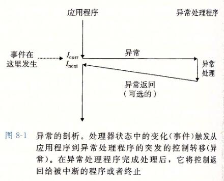

在图中，当处理器状态中发生一个重要的变化时，处理器正在执行某个当前指令 $ I_{curr} $ 。在处理器中，状态被编码为不同的位和信号。状态变化称为**事件**（event）。事件可能和当前指令的执行直接相关。比如，发生虚拟内存缺页、算术溢出，或者一条指令试图除以零。另一方面，事件也可能和当前指令的执行没有关系。比如，一个系统定时器产生信号或者一个 I/O 请求完成

在任何情况下，当处理器检测到有事件发生时，它就会通过一张叫做**异常表**（exception table）的跳转表，进行一个间接过程调用（异常），到一个专门设计用来处理这类事件的操作系统子程序（**异常处理程序**（exception handler））.当异常处理程序完成处理后，根据引起异常的事件的类型，会发生以下 3 种情况中的一种：

1. 处理程序将控制返回给当前指令 $ I_{curr} $ ，即当事件发生时正在执行的指令
2. 处理程序将控制返回给 $ I_{next} $ ，如果没有发生异常将会执行的下一条指令
3. 处理程序终止被中断的程序

8.1.2 节将讲述关于这些可能性的更多内容

> ### 旁注 - 硬件异常与软件异常
>
> C++ 和 Java 的程序员会注意到术语 "异常" 也用来描述由 C++ 和 Java 以 catch、throw 和 try 语句形式提供的应用级 ECF。如果想严格清晰，我们必须区别 "硬件" 和"软件" 异常，但这通常是不必要的，因为从上下文中就能够很清楚地知道是哪种含义。

### 8.1.1 异常处理

异常可能会难以理解，因为处理异常需要硬件和软件紧密合作。很容易搞混哪个部分执行哪个任务。让我们更详细地来看看硬件和软件的分工吧

系统中可能的每种类型的异常都分配了一个唯一的非负整数的**异常号**（exception number）。其中一些号码是由处理器的设计者分配的，其他号码是由操作系统内核（操作系统常驻内存的部分）的设计者分配的。前者的示例包括被零除、缺页、内存访问违例、断点以及算术运算溢出。后者的示例包括系统调用和来自外部 I/O 设备的信号

在系统启动时（当计算机重启或者加电时），操作系统分配和初始化一张称为**异常表**的跳转表，使得表目 k 包含异常 k 的处理程序的地址。图 8-2 展示了异常表的格式

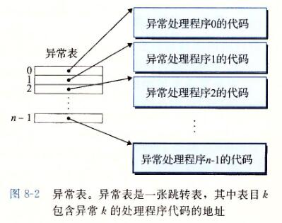

在运行时（当系统在执行某个程序时），处理器检测到发生了一个事件，并且确定了相应的异常号 k。随后，处理器触发异常，方法是执行间接过程调用，通过异常表的表目 k，转到相应的处理程序。图 8-3 展示了处理器如何使用异常表来形成适当的异常处理程序的地址。异常号是到异常表中的索引，异常表的起始地址放在一个叫做**异常表基址寄存器**（exception table base register）的特殊 CPU 寄存器里

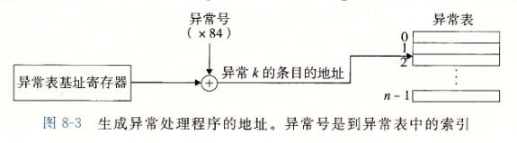

异常类似于过程调用，但是有一些重要的不同之处：

- 过程调用时，在跳转到处理程序之前，处理器将返回地址压入栈中。然而，根据异常的类型，返回地址要么是当前指令（当事件发生时正在执行的指令），要么是下一条指令（如果事件不发生，将会在当前指令后执行的指令）
- 处理器也把一些额外的处理器状态压到栈里，在处理程序返回时，重新开始执行被中断的程序会需要这些状态。比如，x86-64 系统会将包含当前条件码的 EFLAGS 寄存器和其他内容压入栈中
- 如果控制从用户程序转移到内核，所有这些项目都被压到内核栈中，而不是压到用户栈中
- 异常处理程序运行在内核模式下（见 8.2.4 节），这意味着它们对所有的系统资源都有完全的访问权限

一旦硬件触发了异常，剩下的工作就是由异常处理程序在软件中完成。在处理程序处理完事件之后，它通过执行一条特殊的"从中断返回"指令，可选地返回到被中断的程序，该指令将适当的状态弹回到处理器的控制和数据寄存器中，如果异常中断的是一个用户程序，就将状态恢复为**用户模式**（见 8.2.4 节），然后将控制返回给被中断的程序

### 8.1.2 异常的类别

异常可以分为四类：**中断**（interrupt），**陷阱**（trap）、**故障**（fault）和**终止**（abort）。图 8-4 中的表对这些类别的属性做了小结。

| 类别 |         原因        | 异步/同步 | 返回行为            |
|:----:|:-------------------:|-----------|-------------------|
| 中断 | 来自 I/O 设备的信号 | 异步      | 总是返回到下一条指令 |
| 陷阱 | 有意的异常          | 同步      | 总是返回到下一条指令 |
| 故障 | 潜在可恢复的错误    | 同步      | 可能返回到当前指令   |
| 终止 | 不可恢复的错误      | 同步      | 不会返回            |

图 8-4 异常的类别。异步异常是由处理器外部的 I/O 设备中的事件产生的。同步异常是执行一条指令的直接产物

#### 1. 中断

**中断**是异步发生的，是来自处理器外部的 I/O 设备的信号的结果。硬件中断不是由任何一条专门的指令造成的，从这个意义上来说它是异步的。硬件中断的异常处理程序常常称为**中断处理程序**（interrupt handler）

图 8-5 概述了一个中断的处理。I/O 设备，例如网络适配器、磁盘控制器和定时器芯片，通过向处理器芯片上的一个引脚发信号，并将异常号放到系统总线上，来触发中断，这个异常号标识了引起中断的设备

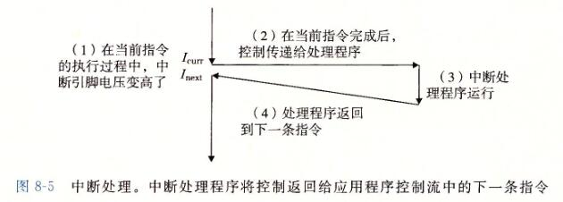

在当前指令完成执行之后，处理器注意到中断引脚的电压变高了，就从系统总线读取异常号，然后调用适当的中断处理程序。当处理程序返回时，它就将控制返回给下一条指令（也即如果没有发生中断，在控制流中会在当前指令之后的那条指令）。结果是程序继续执行，就好像没有发生过中断一样

剩下的异常类型（陷阱、故障和终止）是同步发生的，是执行当前指令的结果。我们把这类指令叫做**故障指令**（faulting instruction）

#### 2. 陷阱和系统调用

陷阱是有意的异常，是执行一条指令的结果。就像中断处理程序一样，陷阱处理程序将控制返回到下一条指令。陷阱最重要的用途是在用户程序和内核之间提供一个像过程一样的接口，叫做**系统调用**

用户程序经常需要向内核请求服务，比如读一个文件（read）、创建一个新的进程（fork），加载一个新的程序（execve），或者终止当前进程（exit）。为了允许对这些内核服务的受控的访问，处理器提供了一条特殊的 "syscall n" 指令，当用户程序想要请求服务 n 时，可以执行这条指令。执行 syscall 指令会导致一个到异常处理程序的陷阱，这个处理程序解析参数，并调用适当的内核程序。图 8-6 概述了一个系统调用的处理

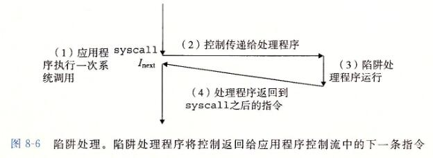

从程序员的角度来看，系统调用和普通的函数调用是一样的。然而，它们的实现非常不同。普通的函数运行在用户模式中，用户模式限制了函数可以执行的指令的类型，而且它们只能访问与调用函数相同的栈。系统调用运行在内核模式中，内核模式允许系统调用执行特权指令，并访问定义在内核中的栈。8.2.4 节会更详细地讨论用户模式和内核模式

#### 3. 故障

故障由错误情况引起，它可能能够被故障处理程序修正。当故障发生时，处理器将控制转移给故障处理程序。如果处理程序能够修正这个错误情况，它就将控制返回到引起故障的指令，从而重新执行它。否则，处理程序返回到内核中的 abort 例程，abort 例程会终止引起故障的应用程序。图 8-7 概述了一个故障的处理

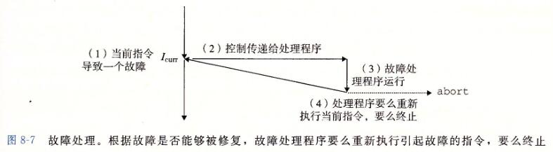

一个经典的故障示例是缺页异常，当指令引用一个虚拟地址，而与该地址相对应的物理页面不在内存中，因此必须从磁盘中取出时，就会发生故障。就像我们将在第 9 章中看到的那样，一个页面就是虚拟内存的一个连续的块（典型的是 4KB）。缺页处理程序从磁盘加载适当的页面，然后将控制返回给引起故障的指令。当指令再次执行时，相应的物理页面已经驻留在内存中了，指令就可以没有故障地运行完成了

#### 4. 终止

终止是不可恢复的致命错误造成的结果，通常是一些硬件错误，比如 DRAM 或者 SRAM 位被损坏时发生的奇偶错误。终止处理程序从不将控制返回给应用程序。如图 8-8 所示，处理程序将控制返回给一个 abort 例程，该例程会终止这个应用程序

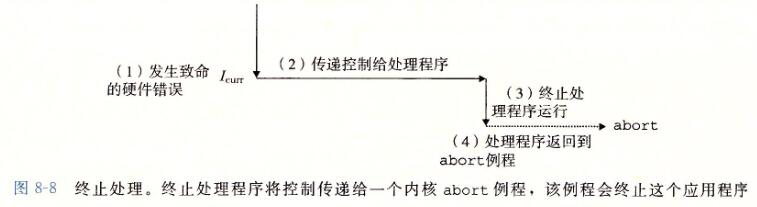

### 8.1.3 Linux/x86-64 系统中的异常

为了使描述更具体，让我们来看看为 x86-64 系统定义的一些异常。有高达 256 种不同的异常类型【50】。0 ∼ 31 的号码对应的是由 Intel 架构师定义的异常，因此对任何 x86-64 系统都是一样的。32 ∼ 255 的号码对应的是操作系统定义的中断和陷阱。图 8-9 展示了一些示例

| 异常号 |        描述        | 异常类别   |
|:------:|:------------------:|------------|
| 0      | 除法错误           | 故障       |
| 13     | 一般保护故障       | 故障       |
| 14     | 缺页               | 故障       |
| 18     | 机器检查           | 终止       |
| 32~255 | 操作系统定义的异常 | 中断或陷阱 |

图 8-9 x86-64 系统中的异常示例

#### 1. Linux/x86-64 故障和终止

- 除法错误。当应用试图除以零时，或者当一个除法指令的结果对于目标操作数来说太大了的时候，就会发生除法错误（异常 0）。Unix 不会试图从除法错误中恢复，而是选择终止程序。Linux shell 通常会把除法错误报告为"浮点异常（Floating exception）"
- 一般保护故障。许多原因都会导致不为人知的一般保护故障（异常 13），通常是因为一个程序引用了一个未定义的虚拟内存区域，或者因为程序试图写一个只读的文本段。Linux 不会尝试恢复这类故障。Linux shell 通常会把这种一般保护故障报告为"段故障（Segmentation fault）"
- 缺页（异常 14）是会重新执行产生故障的指令的一个异常示例。处理程序将适当的磁盘上虚拟内存的一个页面映射到物理内存的一个页面，然后重新执行这条产生故障的指令。我们将在第 9 章中看到缺页是如何工作的细节
- 机器检查。机器检查（异常 18）是在导致故障的指令执行中检测到致命的硬件错误时发生的。机器检查处理程序从不返回控制给应用程序

#### 2. Linux/86-64 系统调用

Linux 提供几百种系统调用，当应用程序想要请求内核服务时可以使用，包括读文件、写文件或是创建一个新进程。图 8-10 给出了一些常见的 Linux 系统调用。每个系统调用都有一个唯一的整数号，对应于一个到内核中跳转表的偏移量（注意：这个跳转表和异常表不一样）

C 程序用 syscall 函数可以直接调用任何系统调用。然而，实际中几乎没必要这么做。对于大多数系统调用，标准 C 库提供了一组方便的包装函数。这些包装函数将参数打包到一起，以适当的系统调用指令陷入内核，然后将系统调用的返回状态传递回调用程序。在本书中，我们将系统调用和与它们相关联的包装函数都称为**系统级函数**，这两个术语可以互换地使用

在 X86-64 系统上，系统调用是通过一条称为 syscall 的陷阱指令来提供的。研究程序能够如何使用这条指令来直接调用 Linux 系统调用是很有趣的。所有到 Linux 系统调用的参数都是通过通用寄存器而不是栈传递的。按照惯例，寄存器 ％rax 包含系统调用号，寄存器 %rdi、%rsi、%rdx、%r10、%r8 和 ％r9 包含最多 6 个参数。第一个参数在  ％rdi 中，第二个在 ％rsi 中，以此类推。从系统调用返回时，寄存器 %rcx 和 ％r11 都会被破坏，％rax 包含返回值。-4095 到 -1 之间的负数返回值表明发生了错误，对应于负的 errno

| 编号 |  名字 | 描述               | 编号 | 名字   | 描述                 |
|:----:|:-----:|--------------------|------|--------|----------------------|
| 0    | read  | 读文件             | 33   | pause  | 挂起进程直到信号到达 |
| 1    | write | 写文件             | 37   | alarm  | 调度告警信号的传送   |
| 2    | open  | 打开文件           | 39   | getpid | 获得进程 ID          |
| 4    | stat  | 获得文件信息       | 59   | execve | 执行一个程序         |
| 9    | mmap  | 将内存页映射到文件 | 60   | `_exit` | 终止进程             |
| 12   | brk   | 重置堆顶           | 61   | wait4  | 等待一个进程终止     |
| 32   | dup2  | 复制文件描述符     | 62   | kill   | 发送信号到一个进程   |

图 8-10 Linux x86-64 系统中常用的系统调用示例

用系统级函数 write（见 10.4 节）来写 hello world，而不是用 printf：

```C
int main() {
	write(1, "hello, world\n", 13);
	_exit(0);
}
```

write 函数的第一个参数将输出发送到 stdout。第二个参数是要写的字节序列，而第三个参数是要写的字节数

图 8-11 给出的是 hello 程序的汇编语言版本，直接使用 syscall 指令来调用 write 和 exit 系统调用。第 9 ∼ 13 行调用 write 函数。首先，第 9 行将系统调用 write 的编号存放在 ％rax 中，第 10 ∼ 12 行设置参数列表。然后第 13 行使用 syscall 指令来调用系统调用。类似地，第 14 ∼ 16 行调用 `_exit` 系统调用。

```ASM
.section .data
string:
    .ascii "hello, world\n"
string_end:
    .equ len, string_end - string

.section .text
.globl main

main:
    # First, call write(1, "hello, world\n", 13)
    movq $1, %rax      # write is system call 1
    movq $1, %rdi      # Arg1: stdout has descriptor 1
    movq $string, %rsi # Arg2: hello world string
    movq $len, %rdx    # Arg3: string length
    syscall            # Make the system call

    # Next, call _exit(o)
    movq $60, %rax     # exit is system call 60
    movq $0, %rdi      # Arg1: exit status is 0
    syscall            # Make the system call
```

图 8-11 直接用 Linux 系统调用来实现 hello 程序

> ### 旁注 - 关于术语的注释
>
> 各种异常类型的术语根据系统的不同而有所不同。处理器 ISA 规范通常会区分异步"中断"和同步"异常"，但是并没有提供描述这些非常相似的概念的概括性的术语。为了避免不断地提到"异常和中断"以及"异常或者中断"，我们用单词"异常"作为通用的术语，而且只有在必要时才区别异步异常（中断）和同步异常（陷阱、故障和终止）。正如我们提到过的，对于每个系统而言，基本的概念都是相同的，但是你应该意识到一些制造厂商的手册会用"异常" 仅仅表示同步事件引起的控制流的改变。

## 8.2 进程

异常是允许操作系统内核提供**进程**（process）概念的基本构造块，进程是计算机科学中最深刻、最成功的概念之一

在现代系统上运行一个程序时，我们会得到一个假象，就好像我们的程序是系统中当前运行的唯一的程序一样。我们的程序好像是独占地使用处理器和内存。处理器就好像是无间断地一条接一条地执行我们程序中的指令。最后，我们程序中的代码和数据好像是系统内存中唯一的对象。这些假象都是通过进程的概念提供给我们的

进程的经典定义就是一个执行中程序的实例。系统中的每个程序都运行在某个进程的**上下文**（context）中。上下文是由程序正确运行所需的状态组成的。这个状态包括存放在内存中的程序的代码和数据，它的栈、通用目的寄存器的内容、程序计数器、环境变量以及打开文件描述符的集合

每次用户通过向 shell 输入一个可执行目标文件的名字，运行程序时，shell 就会创建一个新的进程，然后在这个新进程的上下文中运行这个可执行目标文件。应用程序也能够创建新进程，并且在这个新进程的上下文中运行它们自己的代码或其他应用程序

关于操作系统如何实现进程的细节的讨论超出了本书的范围。反之，我们将关注进程提供给应用程序的关键抽象：

- 一个独立的逻辑控制流，它提供一个假象，好像我们的程序独占地使用处理器
- 一个私有的地址空间，它提供一个假象，好像我们的程序独占地使用内存系统。让我们更深入地看看这些抽象

### 8.2.1 逻辑控制流

即使在系统中通常有许多其他程序在运行，进程也可以向每个程序提供一个假象，好像它在独占地使用处理器。如果想用调试器单步执行程序，我们会看到一系列的程序计数器（PC）的值，这些值唯一地对应于包含在程序的可执行目标文件中的指令，或是包含在运行时动态链接到程序的共享对象中的指令。这个 PC 值的序列叫做**逻辑控制流**，或者简称**逻辑流**

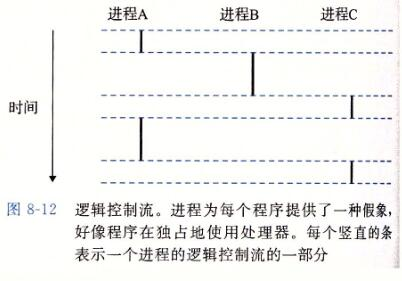

考虑一个运行着三个进程的系统，如图 8-12 所示。处理器的一个物理控制流被分成了三个逻辑流，每个进程一个。每个竖直的条表示一个进程的逻辑流的一部分。在这个例子中，三个逻辑流的执行是交错的。进程 A 运行了一会儿，然后是进程 B 开始运行到完成。然后，进程 C 运行了一会儿，进程 A 接着运行直到完成。最后，进程 C 可以运行到结束了

图 8-12 的关键点在于进程是轮流使用处理器的。每个进程执行它的流的一部分，然后被**抢占**（preempted）（暂时挂起），然后轮到其他进程。对于一个运行在这些进程之一的上下文中的程序，它看上去就像是在独占地使用处理器。唯一的反面例证是，如果我们精确地测量每条指令使用的时间，会发现在程序中一些指令的执行之间，CPU 好像会周期性地停顿。然而，每次处理器停顿，它随后会继续执行我们的程序，并不改变程序内存位置或寄存器的内容

### 8.2.2 并发流

计算机系统中逻辑流有许多不同的形式。异常处理程序、进程、信号处理程序、线程和 Java 进程都是逻辑流的例子

一个逻辑流的执行在时间上与另一个流重叠，称为**并发流**（concurrent flow），这两个流被称为**并发地运行**。更准确地说，流 X 和 Y 互相并发，当且仅当 X 在 Y 开始之后和 Y 结束之前开始，或者 Y 在 X 开始之后和 X 结束之前开始。例如，图 8-12 中，进程 A 和 B 并发地运行，A 和 C 也一样。另一方面，B 和 C 没有并发地运行，因为 B 的最后一条指令在 C 的第一条指令之前执行。

多个流并发地执行的一般现象被称为**并发**（concurrency）。一个进程和其他进程轮流运行的概念称为**多任务**（multitasking）。一个进程执行它的控制流的一部分的每一时间段叫做**时间片**（time slice）。因此，多任务也叫做**时间分片**（time slicing）。例如，图 8-12 中，进程 A 的流由两个时间片组成

注意，并发流的思想与流运行的处理器核数或者计算机数无关。如果两个流在时间上重叠，那么它们就是并发的，即使它们是运行在同一个处理器上。不过，有时我们会发现确认并行流是很有帮助的，它是并发流的一个真子集。如果两个流并发地运行在不同的处理器核或者计算机上，那么我们称它们为**并行流**（parallel flow），它们**并行地运行**（running in parallel），且**并行地执行**（parallel execution）

### 8.2.3 私有地址空间

进程也为每个程序提供一种假象，好像它独占地使用系统地址空间。在一台 n 位地址的机器上，地址空间是 $ 2^n $ 个可能地址的集合，0，1，⋯，$ 2^n -1 $ 。进程为每个程序提供它自己的**私有地址空间**。一般而言，和这个空间中某个地址相关联的那个内存字节是不能被其他进程读或者写的，从这个意义上说，这个地址空间是私有的

尽管和每个私有地址空间相关联的内存的内容一般是不同的，但是每个这样的空间都有相同的通用结构。比如，图 8-13 展示了一个 x86-64 Linux 进程的地址空间的组织结构

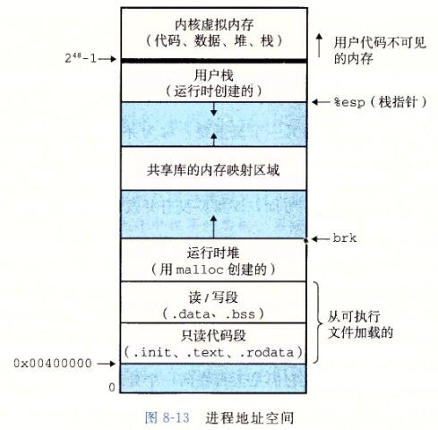

地址空间底部是保留给用户程序的，包括通常的代码、数据、堆和栈段。代码段总是从地址 0x400000 开始。地址空间顶部保留给内核（操作系统常驻内存的部分）。地址空间的这个部分包含内核在代表进程执行指令时（比如当应用程序执行系统调用时）使用的代码、数据和栈

### 8.2.4 用户模式和内核模式

为了使操作系统内核提供一个无懈可击的进程抽象，处理器必须提供一种机制，限制一个应用可以执行的指令以及它可以访问的地址空间范围

处理器通常是用某个控制寄存器中的一个**模式位**（mode bit）来提供这种功能的，该寄存器描述了进程当前享有的特权。当设置了模式位时，进程就运行在**内核模式**中（有时叫做**超级用户模式**）。一个运行在内核模式的进程可以执行指令集中的任何指令，并且可以访问系统中的任何内存位置

没有设置模式位时，进程就运行在用户模式中。用户模式中的进程不允许执行**特权指令**（privileged instruction），比如停止处理器、改变模式位，或者发起一个 I/。操作。也不允许用户模式中的进程直接引用地址空间中内核区内的代码和数据。任何这样的尝试都会导致致命的保护故障。反之，用户程序必须通过系统调用接口间接地访问内核代码和数据

运行应用程序代码的进程初始时是在用户模式中的。进程从用户模式变为内核模式的唯一方法是通过诸如中断、故障或者陷入系统调用这样的异常。当异常发生时，控制传递到异常处理程序，处理器将模式从用户模式变为内核模式。处理程序运行在内核模式中，当它返回到应用程序代码时，处理器就把模式从内核模式改回到用户模式

Linux 提供了一种聪明的机制，叫做 /proc 文件系统，它允许用户模式进程访问内核数据结构的内容。/proc 文件系统将许多内核数据结构的内容输出为一个用户程序可以读的文本文件的层次结构。比如，你可以使用 /proc 文件系统找出一般的系统属性，比如 CPU 类型（/proc/cpuinfo），或者某个特殊的进程使用的内存段（`/proc/<process-id>/maps`）。2.6 版本的 Linux 内核引入 /sys 文件系统，它输岀关于系统总线和设备的额外的低层信息

### 8.2.5 上下文切换

操作系统内核使用一种称为**上下文切换**（context switch）的较高层形式的异常控制流来实现多任务。上下文切换机制是建立在 8.1 节中已经讨论过的那些较低层异常机制之上的

内核为每个进程维持一个**上下文**（context）。上下文就是内核重新启动一个被抢占的进程所需的状态。它由一些对象的值组成，这些对象包括通用目的寄存器、浮点寄存器、程序计数器、用户栈、状态寄存器、内核栈和各种内核数据结构，比如描述地址空间的页表、包含有关当前进程信息的进程表，以及包含进程已打开文件的信息的文件表

在进程执行的某些时刻，内核可以决定抢占当前进程，并重新开始一个先前被抢占了的进程。这种决策就叫做**调度**（scheduling），是由内核中称为**调度器**（scheduler）的代码处理的。当内核选择一个新的进程运行时，我们说内核调度了这个进程。在内核调度了一个新的进程运行后，它就抢占当前进程，并使用一种称为上下文切换的机制来将控制转移到新的进程，上下文切换：

1. 保存当前进程的上下文
2. 恢复某个先前被抢占的进程被保存的上下文
3. 将控制传递给这个新恢复的进程

当内核代表用户执行系统调用时，可能会发生上下文切换。如果系统调用因为等待某个事件发生而阻塞，那么内核可以让当前进程休眠，切换到另一个进程。比如，如果一个 read 系统调用需要访问磁盘，内核可以选择执行上下文切换，运行另外一个进程，而不是等待数据从磁盘到达。另一个示例是 sleep 系统调用，它显式地请求让调用进程休眠。一般而言，即使系统调用没有阻塞，内核也可以决定执行上下文切换，而不是将控制返回给调用进程

中断也可能引发上下文切换。比如，所有的系统都有某种产生周期性定时器中断的机制，通常为每 1 毫秒或每 10 毫秒。每次发生定时器中断时，内核就能判定当前进程已经运行了足够长的时间，并切换到一个新的进程

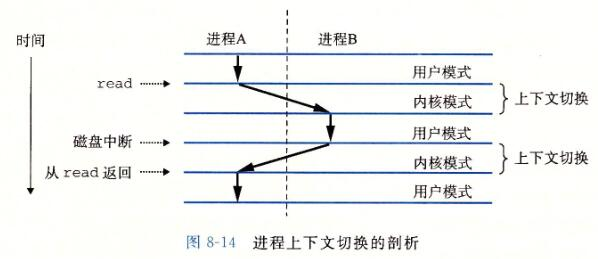

图 8-14 展示了一对进程 A 和 B 之间上下文切换的示例。在这个例子中，进程 A 初始运行在用户模式中，直到它通过执行系统调用 read 陷入到内核。内核中的陷阱处理程序请求来自磁盘控制器的 DMA 传输，并且安排在磁盘控制器完成从磁盘到内存的数据传输后，磁盘中断处理器

磁盘取数据要用一段相对较长的时间（数量级为几十毫秒），所以内核执行从进程 A 到进程 B 的上下文切换，而不是在这个间歇时间内等待，什么都不做。注意在切换之前，内核正代表进程 A 在用户模式下执行指令（即没有单独的内核进程）。在切换的第一部分中，内核代表进程 A 在内核模式下执行指令。然后在某一时刻，它开始代表进程 B（仍然是内核模式下）执行指令。在切换之后，内核代表进程 B 在用户模式下执行指令

随后，进程 B 在用户模式下运行一会儿，直到磁盘发出一个中断信号，表示数据已经从磁盘传送到了内存。内核判定进程 B 已经运行了足够长的时间，就执行一个从进程 B 到进程 A 的上下文切换，将控制返回给进程 A 中紧随在系统调用 read 之后的那条指令。进程 A 继续运行，直到下一次异常发生，依此类推

## 8.3 系统调用错误处理

当 Unix 系统级函数遇到错误时，它们通常会返回 —1，并设置全局整数变量 errno 来表示什么出错了。程序员应该总是检査错误，但是不幸的是，许多人都忽略了错误检查，因为它使代码变得臃肿，而且难以读懂。比如，下面是我们调用 Unix fork 函数时会如何检査错误：

```C
if ((pid = fork()) < 0) {
	fprintf(stderr, "fork error: %s\n", strerror(errno));
	exit(0);
}
```

strerror 函数返回一个文本串，描述了和某个 errno 值相关联的错误。通过定义下面的错误报告函数，我们能够在某种程度上简化这个代码：

```C
/* Unix-style error */
void unix_error(char *msg) {
	fprintf(stderr, "%s: %s\n", msg, strerror(errno));
	exit(0);
}
```

给定这个函数，我们对 fork 的调用从 4 行缩减到 2 行：

```C
if ((pid = fork()) < 0)
	unix_error("fork error");
```

通过使用错误处理包装函数，我们可以更进一步地简化代码，Stevens 在【110】中首先提出了这种方法。对于一个给定的基本函数 foo，我们定义一个具有相同参数的包装函数 Foo，但是第一个字母大写了。包装函数调用基本函数，检査错误，如果有任何问题就终止。比如，下面是 fork 函数的错误处理包装函数：

```C
pid_t Fork(void) {
	pid_t pid;

	if ((pid = fork()) < 0)
		unix_error("Fork error");
	return pid;
}
```

给定这个包装函数，我们对 fork 的调用就缩减为 1 行：

```C
pid = Fork();
```

我们将在本书剩余的部分中都使用错误处理包装函数。它们能够保持代码示例简洁，而又不会给你错误的假象，认为允许忽略错误检査。注意，当在本书中谈到系统级函数时，我们总是用它们的小写字母的基本名字来引用它们，而不是用它们大写的包装函数名来引用

关于 Unix 错误处理以及本书中使用的错误处理包装函数的讨论，请参见附录 A。包装函数定义在一个叫做 csapp.c 的文件中，它们的原型定义在一个叫做 csapp.h 的头文件中；可以从 CS：APP 网站上在线地得到这些代码

## 8.4 进程控制

Unix 提供了大量从 C 程序中操作进程的系统调用

### 8.4.1 获取进程 ID

每个进程都有一个唯一的正数（非零）进程 ID（PID）。getpid 函数返回调用进程的 PID。getppid 函数返回它的父进程的 PID（创建调用进程的进程）

```C
#include <sys/types.h>
#include <unistd.h>
pid_t getpid(void);
pid_t getppid(void);
// 返回：调用者或其父进程的 PID
```

getpid 和 getppid 函数返回一个类型为 pid_t 的整数值，在 Linux 系统上它在 types.h 中被定义为 int

### 8.4.2 创建和终止进程

从程序员的角度，我们可以认为进程总是处于下面三种状态之一：

- 运行。进程要么在 CPU 上 执行，要么在等待被执行且最终会被内核调度
- 停止。进程的执行被挂起（suspended），且不会被调度。当收到 SIGSTOP、SIGTSTP、SIGTTIN 或者 SIGTTOU 信号时，进程就停止，并且保持停止直到它收到一个 SIGCONT 信号，在这个时刻，进程再次开始运行（信号是一种软件中断的形式，将在 8.5 节中详细描述）
- 终止。进程永远地停止了。进程会因为三种原因终止：
  1. 收到一个信号，该信号的默认行为是终止进程
  2. 从主程序返回
  3. 调用 exit 函数

```C
#include <stdlib.h>
void exit(int status);
// 该函数不返回
```

exit 函数以 status 退出状态来终止进程（另一种设置退出状态的方法是从主程序中返回一个整数值）

父进程通过调用 fork 函数创建一个新的运行的子进程

```C
#include <sys/types.h>
#include <unistd.h>
pid_t fork(void);

// 返回：子进程返回 0，父进程返回子进程的 PID，如果出错，则为 -1
```

新创建的子进程几乎但不完全与父进程相同。子进程得到与父进程用户级虚拟地址空间相同的（但是独立的）一份副本，包括代码和数据段、堆、共享库以及用户栈。子进程还获得与父进程任何打开文件描述符相同的副本，这就意味着当父进程调用 fork 时，子进程可以读写父进程中打开的任何文件。父进程和新创建的子进程之间最大的区别在于它们有不同的 PID

fork 函数是有趣的（也常常令人迷惑），因为它只被调用一次，却会返回两次：一次是在调用进程（父进程）中，一次是在新创建的子进程中。在父进程中，fork 返回子进程的 PID。在子进程中，fork 返回 0。因为子进程的 PID 总是为非零，返回值就提供一个明确的方法来分辨程序是在父进程还是在子进程中执行

图 8-15 展示了一个使用 fork 创建子进程的父进程的示例。当 fork 调用在第 6 行返回时，在父进程和子进程中 x 的值都为 1。子进程在第 8 行加一并输出它的 x 的副本。相似地，父进程在第 13 行减一并输出它的 x 的副本

```C
// code/ecf/fork.c
int main() {
	pid_t pid;
	int x = 1;

	pid = Fork();
	if (pid == 0) { /* Child */
		printf("child : x=%d\n", ++x);
		exit(0);
	}

	/* Parent */
	printf("parent: x=%d\n", --x);
	exit(0);
}
```

图 8-15 使用 fork 创建一个新进程

当在 Unix 系统上运行这个程序时，我们得到下面的结果：

```Bash
./fork
parent：x=0
child ：x=2
```

这个简单的例子有一些微妙的方面。

- 调用一次，返回两次。fork 函数被父进程调用一次，但是却返回两次次是返回到父进程，一次是返回到新创建的子进程。对于只创建一个子进程的程序来说，这还是相当简单直接的。但是具有多个 fork 实例的程序可能就会令人迷惑，需要仔细地推敲了
- 并发执行。父进程和子进程是并发运行的独立进程。内核能够以任意方式交替执行它们的逻辑控制流中的指令。在我们的系统上运行这个程序时，父进程先完成它的 printf 语句，然后是子进程。然而，在另一个系统上可能正好相反。一般而言，作为程序员，我们决不能对不同进程中指令的交替执行做任何假设
- 相同但是独立的地址空间。如果能够在 fork 函数在父进程和子进程中返回后立即暂停这两个进程，我们会看到两个进程的地址空间都是相同的。每个进程有相同的用户栈、相同的本地变量值、相同的堆、相同的全局变量值，以及相同的代码。因此，在我们的示例程序中，当 fork 函数在第 6 行返回时，本地变量 x 在父进程和子进程中都为 1。然而，因为父进程和子进程是独立的进程，它们都有自己的私有地址空间。后面，父进程和子进程对 x 所做的任何改变都是独立的，不会反映在另一个进程的内存中。这就是为什么当父进程和子进程调用它们各自的 printf 语句时，它们中的变量 x 会有不同的值
- 共享文件。当运行这个示例程序时，我们注意到父进程和子进程都把它们的输出显示在屏幕上。原因是子进程继承了父进程所有的打开文件。当父进程调用 fork 时，stdout 文件是打开的，并指向屏幕。子进程继承了这个文件，因此它的输出也是指向屏幕的

如果你是第一次学习 fork 函数，画进程图通常会有所帮助，进程图是刻画程序语句的偏序的一种简单的前趋图。每个顶点 a 对应于一条程序语句的执行。有向边 a → b 表示语句 a 发生在语句 b 之前。边上可以标记出一些信息，例如一个变量的当前值。对应于 printf 语句的顶点可以标记上 printf 的输出。每张图从一个顶点开始，对应于调用 main 的父进程。这个顶点没有入边，并且只有一个出边。每个进程的顶点序列结束于一个对应于 exit 调用的顶点。这个顶点只有一条入边，没有出边。例如，图 8-16 展示了图 8-15 中示例程序的进程图。初始时，父进程将变量 x 设置为 1。父进程调用 fork，创建一个子进程，它在自己的私有地址空间中与父进程并发执行。

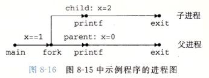

对于运行在单处理器上的程序，对应进程图中所有顶点的**拓扑排序**（topological sort）表示程序中语句的一个可行的全序排列。下面是一个理解拓扑排序概念的简单方法：给定进程图中顶点的一个排列，把顶点序列从左到右写成一行，然后画出每条有向边。排列是一个拓扑排序，当且仅当画出的每条边的方向都是从左往右的。因此，在图 8-15 的示例程序中，父进程和子进程的 printf 语句可以以任意先后顺序执行，因为每种顺序都对应于图顶点的某种拓扑排序

进程图特别有助于理解带有嵌套 fork 调用的程序。例如，图 8-17 中的程序源码中两次调用了 fork。对应的进程图可帮助我们看清这个程序运行了四个进程，每个都调用了—次 printf，这些 printf 可以以任意顺序执行。

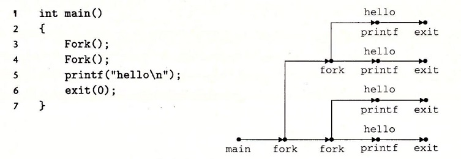

### 8.4.3 回收子进程

当一个进程由于某种原因终止时，内核并不是立即把它从系统中清除。相反，进程被保持在一种已终止的状态中，直到被它的父进程**回收**（reaped）。当父进程回收已终止的子进程时，内核将子进程的退出状态传递给父进程，然后抛弃已终止的进程，从此时开始，该进程就不存在了。一个终止了但还未被回收的进程称为**僵死进程**（zombie）


> ### 旁注 - 为什么已终止的子进程被称为僵死进程
>
> 在民间传说中，僵尸是活着的尸体，一种半生半死的实体。僵死进程已经终止了，而内核仍保留着它的某些状态直到父进程回收它为止，从这个意义上说它们是类似的

如果一个父进程终止了，内核会安排 init 进程成为它的孤儿进程的养父。init 进程的 PID 为 1，是在系统启动时由内核创建的，它不会终止，是所有进程的祖先。如果父进程没有回收它的僵死子进程就终止了，那么内核会安排 init 进程去回收它们。不过，长时间运行的程序，比如 shell 或者服务器，总是应该回收它们的僵死子进程。即使僵死子进程没有运行，它们仍然消耗系统的内存资源

一个进程可以通过调用 waitpid 函数来等待它的子进程终止或者停止。

```C
#include <sys/types.h>
#include <sys/wait.h>

pid_t waitpid(pid_t pid, int *statusp, int options);

// 返回：如果成功，则为子进程的 PID，如果 WNOHANG，则为 0，如果其他错误，则为 -1
```

waitpid 函数有点复杂。默认情况下（当 options=0 时），waitpid 挂起调用进程的执行，直到它的**等待集合**（wait set）中的一个子进程终止。如果等待集合中的一个进程在刚调用的时刻就已经终止了，那么 waitpid 就立即返回。在这两种情况中，waitpid 返回导致 waitpid 返回的已终止子进程的 PID。此时，已终止的子进程已经被回收，内核会从系统中删除掉它的所有痕迹

#### 1. 判定等待集合的成员

等待集合的成员是由参数 pid 来确定的：

- 如果 `pid>0`，那么等待集合就是一个单独的子进程，它的进程 ID 等于 pid
- 如果 `pid=-1`，那么等待集合就是由父进程所有的子进程组成的

waitpid 函数还支持其他类型的等待集合，包括 Unix 进程组，对此我们将不做讨论

#### 2. 修改默认行为

可以通过将 options 设置为常量 WNOHANG，WUNTRACED 和 WCONTINUED 的各种组合来修改默认行为：

- WNOHANG：如果等待集合中的任何子进程都还没有终止，那么就立即返回（返回值为 0）。默认的行为是挂起调用进程，直到有子进程终止。在等待子进程终止的同时，如果还想做些有用的工作，这个选项会有用
- WUNTRACED：挂起调用进程的执行，直到等待集合中的一个进程变成已终止或者被停止，返回的 PID 为导致返回的已终止或被停止子进程的 PID。默认的行为是只返回已终止的子进程。当你想要检査已终止和被停止的子进程时，这个选项会有用
- WCONTINUED：挂起调用进程的执行，直到等待集合中一个正在运行的进程终止或等待集合中一个被停止的进程收到 SIGCONT 信号重新开始执行（8.5 节会解释这些信号）

可以用或运算把这些选项组合起来：

- WNOHANG | WUNTRACED：立即返回，如果等待集合中的子进程都没有被停止或终止，则返回值为 0；如果有一个停止或终止，则返回值为该子进程的 PID

#### 3. 检查已回收子进程的退出状态

如果 statusp 参数是非空的，那么 waitpid 就会在 status 中放上关于导致返回的子进程的状态信息，status 是 statusp 指向的值。wait.h 头文件定义了解释 status 参数的几个宏：

- WIFEXITED(status)：如果于进程通过调用 exit 或者一个返回（return）正常终止，就返回真
- WEXITSTATUS(status)：返回一令正常终止的子进程的退出状态。只有在 WIFEXITED() 返回为真时，才会定义这个状态
- WIFSIGNALED(status)：如果子进程是因为一个未被捕获的信号终止的，那么就返回真
- WTERMSIG(status)：返回导致子进程终止的信号的编号。只有在 WIFSIGNALED() 返回为真时，才定义这个状态
- WIFSTOPPED(status)：如果引起返回的子进程当前是停止的，那么就返回真
- WSTOPSIG(status)：返回引起子进程停止的信号的编号。只有在 WIFSTOPPED() 返回为真时，才定义这个状态
- WIFCONTINUED(status)：如果子进程收到 SIGCONT 信号重新启动，则返回真

#### 4. 错误条件

如果调用进程没有子进程，那么 waitpid 返回 -1，并且设置 errno 为 ECHILD。如果 waitpid 函数被一个信号中断，那么它返回 -1，并设置 errno 为 EINTR

> ### 旁注 - 和 Unix 函数相关的常量
>
> 像 WNOHANG 和 WUNTRACED 这样的常量是由系统头文件定义的。例如，WNO¬HANG 和 WUNTRACED 是由 wait.h 头文件（间接）定义的：
>
> ```C
> /* Bits in the third argument to 'waitpid'. */
> #define WNOHANG    1   /* Don’t block waiting. */
> #define WUNTRACED  2   /* Report status of stopped children. */
> ```
>
> 为了使用这些常量，必须在代码中包含 wait.h 头文件：
>
> ```C
> #include <sys/wait.h>
> ```
>
> 每个 Unix 函数的 man 页列出了无论何时你在代码中使用那个函数都要包含的头文件。同时，为了检查诸如 ECHILD 和 EINTR 之类的返回代码，你必须包含 errno.h

#### 5. wait 函数

wait 函数是 waitpid 函数的简单版本：

```C
#include <sys/types.h>
#include <sys/wait.h>

pid_t wait(int *statusp);
// 返回：如果成功，则为子进程的 PID，如果出错，则为 -1。
```

调用 wait(&status) 等价于调用 waitpid(-1, &status, 0)

#### 6. 使用 waitpid 的示例

因为 waitpid 函数有些复杂，看几个例子会有所帮助。图 8-18 展示了一个程序，它使用 waitpid，不按照特定的顺序等待它的所有 N 个子进程终止。在第 11 行，父进程创建 N 个子进程，在第 12 行，每个子进程以一个唯一的退出状态退出。在我们继续讲解之前，请确认你已经理解为什么每个子进程会执行第 12 行，而父进程不会

```C
// code/ecf/waitpid1.c
#include "csapp.h"
#define N 2

int main() {
	int status, i;
	pid_t pid;

	/* Parent creates N children */
	for (i = 0; i < N; i++)
		if ((pid = Fork()) == 0) /* Child */
			exit(100 + i);

	/* Parent reaps N children in no particular order */
	while ((pid = waitpid(-1, &status, 0)) > 0) {
		if (WIFEXITED(status))
			printf("child %d terminated normally with exit status=%d\n",
			       pid, WEXITSTATUS(status));
		else
			printf("child %d terminated abnormally\n", pid);
	}

	/* The only normal termination is if there are no more children */
	if (errno != ECHILD)
		unix_error("waitpid error");

	exit(0);
}
```

图 8-18 使用 waitpid 函数不按照特定的顺序回收僵死子进程

在第 15 行，父进程用 waitpid 作为 while 循环的测试条件，等待它所有的子进程终止。因为第一个参数是 -1，所以对 waitpid 的调用会阻塞，直到任意一个子进程终止。在每个子进程终止时，对 waitpid 的调用会返回，返回值为该子进程的非零的 PID。第 16 行检查子进程的退出状态。如果子进程是正常终止的——在此是以调用 exit 函数终止的——那么父进程就提取出退出状态，把它输出到 stdout 上

当回收了所有的子进程之后，再调用 waitpid 就返回 -1，并且设置 errno 为 ECHILD。第 24 行检查 waitpid 函数是正常终止的，否则就输出一个错误消息。在我们的 Linux 系统上运行这个程序时，它产生如下输出：

```Bash
./waitpid1
child 22966 terminated normally with exit status=100
child 22967 terminated normally with exit status=101
```

图 8-19 展示了一个简单的改变，它消除了这种不确定性，按照父进程创建子进程的相同顺序来回收这些子进程。在第 11 行中，父进程按照顺序存储了它的子进程的 PID，然后通过用适当的 PID 作为第一个参数来调用 waitpid，按照同样的顺序来等待每个子进程。

```C
// code/ecf/waitpid2.c
#include "csapp.h"
#define N 2

int main() {
	int status, i;
	pid_t pid[N], retpid;

	/* Parent creates N children */
	for (i = 0; i < N; i++)
		if ((pid[i] = Fork()) == 0) /* Child */
			exit(100 + i);

	/* Parent reaps N children in order */
	i = 0;
	while ((retpid = waitpid(pid[i++], &status, 0)) > 0) {
		if (WIFEXITED(status))
			printf("child %d terminated normally with exit status=%d\n",
			       retpid, WEXITSTATUS(status));
		else
			printf("child %d terminated abnormally\n", retpid);
	}

	/* The only normal termination is if there are no more children */
	if (errno != ECHILD)
		unix_error("waitpid error");

	exit(0);
}
```

图 8-19 使用 waitpid 按照创建子进程的顺序来回收这些僵死子进程

### 8.4.4 让进程休眠

sleep函数将一个进程挂起一段指定的时间

```C
#include <unistd.h>
unsigned int sleep(unsigned int secs);

// 返回：还要休眠的秒数
```

如果请求的时间量已经到了，sleep 返回 0，否则返回还剩下的要休眠的秒数。后一种情况是可能的，如果因为 sleep 函数被一个信号中断而过早地返回。我们将在 8.5 节中详细讨论信号

我们会发现另一个很有用的函数是 pause 函数，该函数让调用函数休眠，直到该进程收到一个信号

```C
#include <unistd.h>
int pause(void);

// 总是返回 -1
```

### 8.4.5 加载并允许程序

execve 函数在当前进程的上下文中加载并运行一个新程序。

```C
#include <unistd.h>
int execve(const char *filename, const char *argv[],
           const char *envp[]);

// 如果成功，则不返回，如果错误，则返回 -1
```

execve 函数加载并运行可执行目标文件 filename，且带参数列表 argv 和环境变量列表 envp。只有当出现错误时，例如找不到 filename，execve 才会返回到调用程序。所以，与 fork 一次调用返回两次不同，execve 调用一次并从不返回

参数列表是用图 8-20 中的数据结构表示的。argv 变量指向一个以 null 结尾的指针数组，其中每个指针都指向一个参数字符串。按照惯例，argv[0] 是可执行目标文件的名字

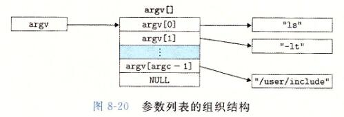

环境变量的列表是由一个类似的数据结构表示的，如图 8-21 所示。envp 变量指向一个以 null 结尾的指针数组，其中每个指针指向一个环境变量字符串，每个串都是形如 "name=value" 的键值对

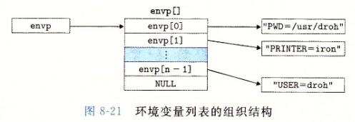

在 execve 加载了 filename 之后，它调用 7.9 节中描述的启动代码。启动代码设置栈，并将控制传递给新程序的主函数，该主函数有如下形式的原型

```C
int main(int argc, char **argv, char **envp);
// 或者等价的
int main(int argc, char *argv[], char *envp[]);
```

当 main 开始执行时，用户栈的组织结构如图 8-22 所示。让我们从栈底（高地址）往栈顶（低地址）依次看一看。首先是参数和环境字符串。栈往上紧随其后的是以 null 结尾的指针数组，其中每个指针都指向栈中的一个环境变量字符串。全局变量 environ 指向这些指针中的第一个 envp[0]。紧随环境变量数组之后的是以 null 结尾的 argv[] 数组，其中每个元素都指向栈中的一个参数字符串。在栈的顶部是系统启动函数 libc_start_main（见 7.9 节）的栈帧

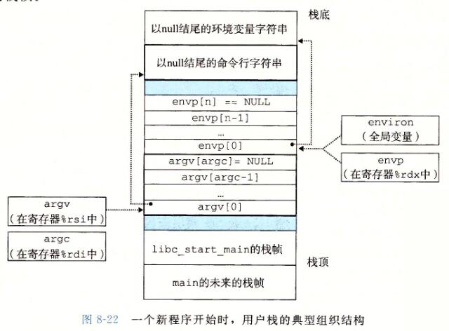

main 函数有 3 个参数：

1. argc，它给出 argv[] 数组中非空指针的数量
2. argv，指向 argv[] 数组中的第一个条目
3. envp，指向 envp[] 数组中的第一个条目

Linux 提供了几个函数来操作环境数组：

```C
#include <stdlib.h>
char *getenv(const char *name);
// 返回：若存在则为指向 name 的指针，若无匹配的，则为 NULL

int setenv(const char *name, const char *newvalue, int overwrite);
// 返回：若成功则为 0，若错误则为 -1

void unsetenv(const char *name);
```

如果环境数组包含一个形如 "name=oldva1ue" 的字符串，那么 unsetenv 会删除它，而 setenv 会用 newvalue 代替 oldvalue，但是只有在 overwirte 非零时才会这样。如果 name 不存在，那么 setenv 就把 "name=newvalue" 添加到数组中

> ### 旁注：程序与进程
>
> 这是一个适当的地方，停下来，确认一下你理解了程序和进程之间的区别。程序是一堆代码和数据；程序可以作为目标文件存在于磁盘上，或者作为段存在于地址空间中。进程是执行中程序的一个具体的实例；程序总是运行在某个进程的上下文中。如果你想要理解 fork 和 execve 函数，理解这个差异是很重要的。fork 函数在新的子进程中运行相同的程序，新的子进程是父进程的一个复制品。execve 函数在当前进程的上下文中加载并运行一个新的程序。它会覆盖当前进程的地址空间，但并没有创建一个新进程。新的程序仍然有相同的 PID，并且继承了调用 execve 函数时已打开的所有文件描述符

### 练习题 8.6

编写一个叫做 myecho 的程序，打印出它的命令行参数和环境变量。

```C
linux> ./myecho arg1 arg2
Command-ine arguments:
    argv[ 0]: myecho
    argv[ 1]: arg1
    argv[ 2]: arg2
Environment variables:
    envp[ 0]: PWD=/usr0/droh/ics/code/ecf
    envp[ 1]: TERM=emacs
    .
    .
    .
    envp[25]: USER=droh
    envp[26]: SHELL=/usr/local/bin/tcsh
    envp[27]: HOME=/usr0/droh
```

```C
// code/ecf/myecho.c
#include "csapp.h"

int main(int argc, char *argv[], char *envp[]) {
	int i;

	printf("Command-line arguments:\n");
	for (i = 0; argv[i] != NULL; i++)
		printf(" argv[%2d]: %s\n", i, argv[i]);

	printf("\n");
	printf("Environment variables:\n");
	for (i = 0; envp[i] != NULL; i++)
		printf(" envp[%2d]: %s\n", i, envp[i]);

	exit(0);
}
```

### 8.4.6 利用 fork 和 execve 运行程序

像 Unix shell 和 Web 服务器这样的程序大量使用了 fork 和 execve 函数。shell 是一个交互型的应用级程序，它代表用户运行其他程序。最早的 shell 是 sh 程序，后面出现了—些变种，比如 csh、tcsh、ksh 和 bash。shell 执行一系列的读/求值（read/evaluate）步骤，然后终止。读步骤读取来自用户的一个命令行。求值步骤解析命令行，并代表用户运行程序

图 8-23 展示了一个简单 shell 的 main 例程。shell 打印一个命令行提示符，等待用户在 stdin 上 输入命令行，然后对这个命令行求值

```C
// code/ecf/shellex.c
#include "csapp.h"
#define MAXARGS 128

/* Function prototypes */
void eval(char *cmdline);
int parseline(char *buf, char **argv);
int builtin_command(char **argv);

int main() {
	char cmdline[MAXLINE]; /* Command line */

	while (1) {
		/* Read */
		printf("> ");
		Fgets(cmdline, MAXLINE, stdin);
		if (feof(stdin))
			exit(0);

		/* Evaluate */
		eval(cmdline);
	}
}
```

图 8-23 一个简单的 shell 程序的 main 例程

图 8-24 展示了对命令行求值的代码。它的首要任务是调用 parseline 函数（见图 8-25），这个函数解析了以空格分隔的命令行参数，并构造最终会传递给 execve 的 argv 向量。第一个参数被假设为要么是一个内置的 shell 命令名，马上就会解释这个命令，要么是一个可执行目标文件，会在一个新的子进程的上下文中加载并运行这个文件

```C
// code/ecf/shellex.c
/* eval - Evaluate a command line */
void eval(char *cmdline) {
	char *argv[MAXARGS]; /* Argument list execve() */
	char buf[MAXLINE];   /* Holds modified command line */
	int bg;              /* Should the job run in bg or fg? */
	pid_t pid;           /* Process id */

	strcpy(buf, cmdline);
	bg = parseline(buf, argv);
	if (argv[0] == NULL)
		return;   /* Ignore empty lines */

	if (!builtin_command(argv)) {
		if ((pid = Fork()) == 0) {   /* Child runs user job */
			if (execve(argv[0], argv, environ) < 0) {
				printf("%s: Command not found.\n", argv[0]);
				exit(0);
			}
		}

		/* Parent waits for foreground job to terminate */
		if (!bg) {
			int status;
			if (waitpid(pid, &status, 0) < 0)
				unix_error("waitfg: waitpid error");
		} else
			printf("%d %s", pid, cmdline);
	}
	return;
}

/* If first arg is a builtin command, run it and return true */
int builtin_command(char **argv) {
	if (!strcmp(argv[0], "quit")) /* quit command */
		exit(0);
	if (!strcmp(argv[0], "&"))    /* Ignore singleton & */
		return 1;
	return 0;                     /* Not a builtin command */
}
```

图 8-24 eval 对 shell 命令行求值

```C
// code/ecf/shellex.c
/* parseline - Parse the command line and build the argv array */
int parseline(char *buf, char **argv) {
	char *delim;         /* Points to first space delimiter */
	int argc;            /* Number of args */
	int bg;              /* Background job? */

	buf[strlen(buf) - 1] = ' '; /* Replace trailing '\n' with space */
	while (*buf && (*buf == ' ')) /* Ignore leading spaces */
		buf++;

	/* Build the argv list */
	argc = 0;
	while ((delim = strchr(buf, ' '))) {
		argv[argc++] = buf;
		*delim = '\0';
		buf = delim + 1;
		while (*buf && (*buf == ' ')) /* Ignore spaces */
			buf++;
	}
	argv[argc] = NULL;

	if (argc == 0) /* Ignore blank line */
		return 1;

	/* Should the job run in the background? */
	if ((bg = (*argv[argc - 1] == '&')) != 0)
		argv[--argc] = NULL;

	return bg;
}
```

图 8-25 parseline 解析 shell 的一个输入行

如果最后一个参数是一个 "&" 字符，那么 parseline 返回 1，表示应该在后台执行该程序（shell 不会等待它完成）。否则，它返回 0，表示应该在前台执行这个程序（shell 会等待它完成）

在解析了命令行之后，eval 函数调用 builtin_command 函数，该函数检查第一个命令行参数是否是一个内置的 shell 命令。如果是，它就立即解释这个命令，并返回值 1。否则返回 0。简单的 shell 只有一个内置命令—— quit 命令，该命令会终止 shell。实际使用的 shell 有大量的命令，比如 pwd、jobs 和 fg。

如果 builtin_cornnand 返回 0，那么 shell 创建一个子进程，并在子进程中执行所请求的程序。如果用户要求在后台运行该程序，那么 shell 返回到循环的顶部，等待下一个命令行。否则，shell 使用 waitpid 函数等待作业终止。当作业终止时，shell 就开始下一轮迭代

注意，这个简单的 shell 是有缺陷的，因为它并不回收它的后台子进程。修改这个缺陷就要求使用信号，我们将在下一节中讲述信号

## 8.5 信号

到目前为止对异常控制流的学习中，我们已经看到了硬件和软件是如何合作以提供基本的低层异常机制的。我们也看到了操作系统如何利用异常来支持进程上下文切换的异常控制流形式。在本节中，我们将研究一种更高层的软件形式的异常，称为 **Linux 信号**，它允许进程和内核中断其他进程

一个**信号**就是一条小消息，它通知进程系统中发生了一个某种类型的事件。比如，图 8-26 展示了 Linux 系统上支持的 30 种不同类型的信号

每种信号类型都对应于某种系统事件。低层的硬件异常是由内核异常处理程序处理的，正常情况下，对用户进程而言是不可见的。信号提供了一种机制，通知用户进程发生了这些异常。比如，如果一个进程试图除以 0，那么内核就发送给它一个 SIGFPE 信号（号码 8）。如果一个进程执行一条非法指令，那么内核就发送给它一个 SIGILL 信号（号码 4）。如果进程进行非法内存引用，内核就发送给它一个 SIGSEGV 信号（号码 11）。其他信号对应于内核或者其他用户进程中较高层的软件事件。比如，如果当进程在前台运行时，你键入 Ctrl+C（也就是同时按下 Ctrl 键和 C 键），那么内核就会发送一个 SIGINT 信号（号码 2）给这个前台进程组中的每个进程。一个进程可以通过向另一个进程发送一个 SIGKILL 信号（号码 9）强制终止它。当一个子进程终止或者停止时，内核会发送一个 SIGCHLD 信号（号码 17）给父进程

| 序号 | 名称      | 默认行为                 | 相应事件                       |
|------|-----------|--------------------------|------------------------------|
| 1    | SIGHUP    | 终止                     | 终端线挂断                     |
| 2    | SIGINT    | 终止                     | 来自键盘的中断                 |
| 3    | SIGQUIT   | 终止                     | 来自键盘的退出                 |
| 4    | SIGILL    | 终止                     | 非法指令                       |
| 5    | SIGTRAP   | 终止并转储内存$^①$       | 跟踪陷阱                       |
| 6    | SIGABRT   | 终止并转储内存$^①$       | 来自 abort 函数的终止信号      |
| 7    | SIGBUS    | 终止                     | 总线错误                       |
| 8    | SIGFPE    | 终止并转储内存$^①$       | 浮点异常                       |
| 9    | SIGKILL   | 终止$^②$                  | 杀死程序                     |
| 10   | SIGUSR1   | 终止                     | 用户定义的信号 1               |
| 11   | SIGSEGV   | 终止并转储内存$^①$       | 无效的内存引用（段故障）       |
| 12   | SIGUSR2   | 终止                     | 用户定义的信号 2               |
| 13   | SIGPIPE   | 终止                     | 向一个没有读用户的管道做写操作 |
| 14   | SIGALRM   | 终止                     | 来自 alarm 函数的定时器信号    |
| 15   | SIGTERM   | 终止                     | 软件终止信号                   |
| 16   | SIGSTKFLT | 终止                     | 协处理器上的栈故障             |
| 17   | SIGCHLD   | 忽略                     | 一个子进程停止或者终止         |
| 18   | SIGCONT   | 忽略                     | 继续进程如果该进程停止         |
| 19   | SIGSTOP   | 停止直到下一个SIGCONT$^②$| 不是来自终端的停止信号         |
| 20   | SIGTSTP   | 停止直到下一个SIGCONT    | 来自终端的停止信号             |
| 21   | SIGTTIN   | 停止直到下一个SIGCONT    | 后台进程从终端读               |
| 22   | SIGTTOU   | 停止直到下一个SIGCONT    | 后台进程向终端写               |
| 23   | SIGURG    | 忽略                     | 套接字上的紧急情况             |
| 24   | SIGXCPU   | 终止                     | CPU 时间限制超出               |
| 25   | SIGXFSZ   | 终止                     | 文件大小限制超出               |
| 26   | SIGVTALRM | 终止                     | 虚拟定时器期满                 |
| 27   | SIGPROF   | 终止                     | 剖析定时器期满                 |
| 28   | SIGWINCH  | 忽略                     | 窗口大小变化                   |
| 29   | SIGIO     | 终止                     | 在某个描述符上可执行 I/O 操作  |
| 30   | SIGPWR    | 终止                     | 电源故障                       |

图 8-26 Linux 信号

> ① 多年前，主存是用一种称为磁芯存储器（core memory）的技术来实现的。"转储内存"（dumping core）是一个历史术语，意思是把代码和数据内存段的映像写到磁盘上。
>
> ② 这个信号既不能被捕获，也不能被忽略。
>
> （来源：man 7 signal。数据来自 Linux Foundation。）

### 8.5.1 信号术语

传送一个信号到目的进程是由两个不同步骤组成的：

- 发送信号。内核通过更新目的进程上下文中的某个状态，发送（递送）一个信号给目的进程。发送信号可以有如下两种原因：
  1. 内核检测到一个系统事件，比如除零错误或者子进程终止。
  2. 一个进程调用了 kill 函数（在下一节中讨论），显式地要求内核发送一个信号给目的进程。一个进程可以发送信号给它自己
- 接收信号。当目的进程被内核强迫以某种方式对信号的发送做出反应时，它就接收了信号。进程可以忽略这个信号，终止或者通过执行一个称为**信号处理程序**（signal handler）的用户层函数捕获这个信号。图 8-27 给出了信号处理程序捕获信号的基本思想

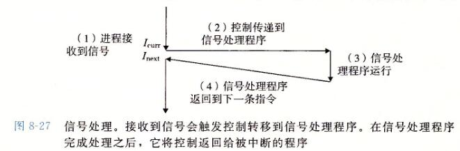

一个发出而没有被接收的信号叫做**待处理信号**（pending signal）。在任何时刻，一种类型至多只会有一个待处理信号。如果一个进程有一个类型为 k 的待处理信号，那么任何接下来发送到这个进程的类型为 k 的信号都不会排队等待；它们只是被简单地丢弃。一个进程可以有选择性地阻塞接收某种信号。当一种信号被阻塞时，它仍可以被发送，但是产生的待处理信号不会被接收，直到进程取消对这种信号的阻塞

一个待处理信号最多只能被接收一次。内核为每个进程在 pending 位向量中维护着待处理信号的集合，而在 blocked 位向量中维护着被阻塞的信号集合。只要传送了一个类型为 k 的信号，内核就会设置 pending 中的第 k 位，而只要接收了一个类型为 k 的信号，内核就会清除 pending 中的第 k 位


> blocked 位向量：也称为信号掩码（signal mask）

### 8.5.2 发送信号

Unix 系统提供了大量向进程发送信号的机制。所有这些机制都是基于进程组（process group）这个概念的

#### 1. 进程组

每个进程都只属于一个进程组，进程组是由一个正整数进程组 ID 来标识的。getpgrp 函数返回当前进程的进程组 ID：

```C
#include <unistd.h>
pid_t getpgrp(void);

// 返回：调用进程的进程组 ID
```

默认地，一个子进程和它的父进程同属于一个进程组。一个进程可以通过使用 setpgid 函数来改变自己或者其他进程的进程组：

```C
#include <unistd.h>
int setpgid(pid_t pid, pid_t pgid);

// 返回：若成功则为 0，若错误则为 -1
```

setpgid 函数将进程 pid 的进程组改为 pgid。如果 pid 是 0，那么就使用当前进程的 PID。如果 pgid 是 0，那么就用 pid 指定的进程的 PID 作为进程组 ID。例如，如果进程 15213 是调用进程，那么会创建一个新的进程组，其进程组 ID 是 15213，并且把进程 15213 加入到这个新的进程组中

#### 2. 用 /bin/kill 程序发送信号

/bin/kill 程序可以向另外的进程发送任意的信号。比如，命令

```Bash
/bin/kill -9 15213
```

发送信号 9（SIGKILL）给进程 15213。一个为负的 PID 会导致信号被发送到进程组 PID 中的每个进程。比如，命令

```Bash
/bin/kill -9 -15213
```

发送一个 SIGKILL 信号给进程组 15213 中的每个进程。注意，在此我们使用完整路径 /bin/kill，因为有些 Unix shell 有自己内置的 kill 命令

#### 3. 从键盘发送信号

Unix shell 使用**作业**（job）这个抽象概念来表示为对一条命令行求值而创建的进程。在任何时刻，至多只有一个前台作业和 0 个或多个后台作业。比如，键入

```C
ls | sort
```

会创建一个由两个进程组成的前台作业，这两个进程是通过 Unix 管道连接起来的：一个进程运行 ls 程序，另一个运行 sort 程序。shell 为每个作业创建一个独立的进程组。进程组 ID 通常取自作业中父进程中的一个。比如，图 8-28 展示了有一个前台作业和两个后台作业的 shell。前台作业中的父进程 PID 为 20，进程组 ID 也为 20。父进程创建两个子进程，每个也都是进程组 20 的成员

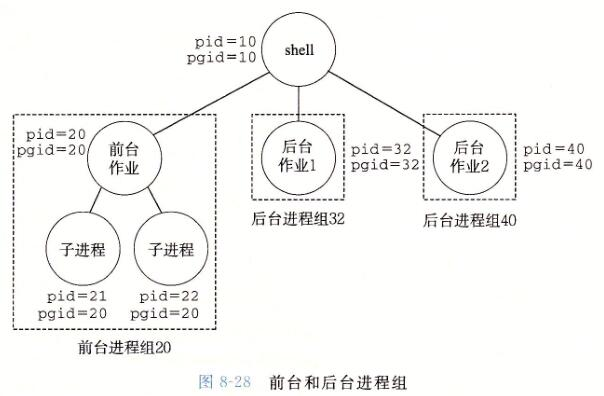

在键盘上输入 Ctrl+C 会导致内核发送一个 SIGINT 信号到前台进程组中的每个进程。默认情况下，结果是终止前台作业。类似地，输入 Ctrl+Z 会发送一个 SIGTSTP 信号到前台进程组中的每个进程。默认情况下，结果是停止（挂起）前台作业。

#### 4. 用 kill 函数发送信号

进程通过调用 kill 函数发送信号给其他进程（包括它们自己）

```C
#include <sys/types.h>
#include <signal.h>

int kill(pid_t pid, int sig);

// 返回：若成功则为 0，若错误则为 -1
```

如果 pid 大于零，那么 kill 函数发送信号号码 sig 给进程 pid。如果 pid 等于零，那么 kill 发送信号 sig 给调用进程所在进程组中的每个进程，包括调用进程自己。如果 pid 小于零，kill 发送信号 sig 给进程组 `|pid|`（pid 的绝对值）中的每个进程。图 8-29 展示了一个示例，父进程用 kill 函数发送 SIGKILL 信号给它的子进程

```C
// code/ecf/kill.c
#include "csapp.h"

int main() {
	pid_t pid;

	/* Child sleeps until SIGKILL signal received, then dies */
	if ((pid = Fork()) == 0) {
		Pause(); /* Wait for a signal to arrive */
		printf("control should never reach here!\n");
		exit(0);
	}

	/* Parent sends a SIGKILL signal to a child */
	Kill(pid, SIGKILL);
	exit(0);
}
```

图 8-29 使用 kill 函数发送信号给子进程

#### 5. 用 alarm 函数发送信号

进程可以通过调用 alarm 函数向它自己发送 SIGALRM 信号

```C
#include <unistd.h>
unsigned int alarm(unsigned int secs);

// 返回：前一次闹钟剩余的秒数，若以前没有设定闹钟，则为0
```

alarm 函数安排内核在 secs 秒后发送一个 SIGALRM 信号给调用进程。如果 secs 是零，那么不会调度安排新的闹钟（alarm）。在任何情况下，对 alarm 的调用都将取消任何待处理的（pending）闹钟，并且返回任何待处理的闹钟在被发送前还剩下的秒数（如果这次对 alarm 的调用没有取消它的话）；如果没有任何待处理的闹钟，就返回零

### 8.5.3 接收信号

当内核把进程 p 从内核模式切换到用户模式时（例如，从系统调用返回或是完成了一次上下文切换），它会检查进程 p 的未被阻塞的待处理信号的集合（`pending &~blocked`）。如果这个集合为空（通常情况下），那么内核将控制传递到 p 的逻辑控制流中的下一条指令（$ I_{next} $）。然而，如果集合是非空的，那么内核选择集合中的某个信号 k （通常是最小的 k），并且强制 p 接收信号 k。收到这个信号会触发进程采取某种行为。一旦进程完成了这个行为，那么控制就传递回 p 的逻辑控制流中的下一条指令（$ I_{next} $）。每个信号类型都有一个预定义的**默认行为**，是下面中的一种：

- 进程终止
- 进程终止并转储内存
- 进程停止（挂起）直到被 SIGCONT 信号重启
- 进程忽略该信号

图 8-26 展示了与每个信号类型相关联的默认行为。比如，收到 SIGKILL 的默认行为就是终止接收进程。另外，接收到 SIGCHLD 的默认行为就是忽略这个信号。进程可以通过使用 signal 函数修改和信号相关联的默认行为。唯一的例外是 SIGSTOP 和 SIGKILL，它们的默认行为是不能修改的

```C
#include <signal.h>
typedef void (*sighandler_t)(int);

sighandler_t signal(int signum, sighandler_t handler);

// 返回：若成功则为指向前次处理程序的指针，若出错则为 SIG_ERR（不设置 errno）
```

signal 函数可以通过下列三种方法之一来改变和信号 signum 相关联的行为：

- 如果 handler 是 SIG_IGN，那么忽略类型为 signum 的信号
- 如果 handler 是 SIG_DFL，那么类型为 signum 的信号行为恢复为默认行为
- 否则，handler 就是用户定义的函数的地址，这个函数被称为**信号处理程序**，只要进程接收到一个类型为 signum 的信号，就会调用这个程序。通过把处理程序的地址传递到 signal 函数从而改变默认行为，这叫做**设置信号处理程序**（installing the handler）。调用信号处理程序被称为**捕获信号**。执行信号处理程序被称为**处理信号**

当一个进程捕获了一个类型为 k 的信号时，会调用为信号 k 设置的处理程序，一个整数参数被设置为 k。这个参数允许同一个处理函数捕获不同类型的信号。

当处理程序执行它的 return 语句时，控制（通常）传递回控制流中进程被信号接收中断位置处的指令。我们说"通常"是因为在某些系统中，被中断的系统调用会立即返回一个错误

图 8-30 展示了一个程序，它捕获用户在键盘上输入 Ctrl+C 时发送的 SIGINT 信号。SIGINT 的默认行为是立即终止该进程。在这个示例中，我们将默认行为修改为捕获信号，输出一条消息，然后终止该进程

```C
// code/ecf/sigint.c
#include "csapp.h"

void sigint_handler(int sig) { /* SIGINT handler */
	printf("Caught SIGINT!\n");
	exit(0);
}

int main() {
	/* Install the SIGINT handler */
	if (signal(SIGINT, sigint_handler) == SIG_ERR)
		unix_error("signal error");

	pause(); /* Wait for the receipt of a signal */

	return 0;
}
```

图 8-30 一个用信号处理程序捕获 SIGINT 信号的程序

信号处理程序可以被其他信号处理程序中断，如图 8-31 所示。在这个例子中，主程序捕获到信号 S，该信号会中断主程序，将控制转移到处理程序 S。S 在运行时，程序捕获信号 t≠s，该信号会中断 S，控制转移到处理程序 T。当 T 返回时，S 从它被中断的地方继续执行。最后，S 返回，控制传送回主程序，主程序从它被中断的地方继续执行

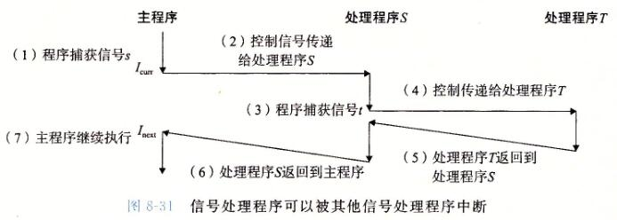

### 练习题 8.7

编写一个叫做 snooze 的程序，它有一个命令行参数，用这个参数调用练习题 8.5 中的 snooze 函数，然后终止。编写程序，使得用户可以通过在键盘上输入 Ctrl+C 中断 snooze 函数。比如：

```Bash
./snooze 5
CTRL+C                     // User hits Crtl+C after 3 seconds
Slept for 3 of 5 secs.
```

答案：

只要休眠进程收到一个未被忽略的信号，sleep 函数就会提前返回。但是，因为收到一个 SIGINT 信号的默认行为就是终止进程（图 8-26），我们必须设置一个 SIGINT 处理程序来允许 sleep 函数返回。处理程序简单地捕获 SIGNAL，并将控制返回给 sleep 函数，该函数会立即返回

```C
// code/ecf/snooze.c
#include "csapp.h"

/* SIGINT handler */
void handler(int sig) {
	return; /* Catch the signal and return */
}

unsigned int snooze(unsigned int secs) {
	unsigned int rc = sleep(secs);

	printf("Slept for %d of %d secs.\n", secs - rc, secs);

	return rc;
}

int main(int argc, char **argv) {

	if (argc != 2) {
		fprintf(stderr, "usage: %s <secs>\n", argv[0]);
		exit(0);
	}

	if (signal(SIGINT, handler) == SIG_ERR) /* Install SIGINT */
		unix_error("signal error\n"); /* handler */
	(void)snooze(atoi(argv[1]));
	exit(0);
}
```

### 8.5.4 阻塞和解除阻塞信号

Linux 提供阻塞信号的隐式和显式的机制：

- 隐式阻塞机制。内核默认阻塞任何当前处理程序正在处理信号类型的待处理的信号。例如，图 8-31 中，假设程序捕获了信号 s，当前正在运行处理程序 S。如果发送给该进程另一个信号 s，那么直到处理程序 S 返回，s 会变成待处理而没有被接收
- 显式阻塞机制。应用程序可以使用 sigprocmask 函数和它的辅助函数，明确地阻塞和解除阻塞选定的信号

```C
#include <signal.h>

int sigprocmask(int how, const sigset_t *set, sigset_t *oldset);
int sigemptyset(sigset_t *set);
int sigfillset(sigset_t *set);
int sigaddset(sigset_t *set, int signum);
int sigdelset(sigset_t *set, int signum);
//返回；如果成功则为 0，若出错则为 -1

int sigismember(const sigset_t *set, int signum);
// 返回：若 signum 是 set 的成员则为 1，如果不是则为 0，若出错则为 -1
```

sigprocmask 函数改变当前阻塞的信号集合（8.5.1 节中描述的 blocked 位向量）。具体的行为依赖于 how 的值：

- SIG_BLOCK：把 set 中的信号添加到 blocked 中（`blocked=blocked | set`）
- SIG_UNBLOCK：从 blocked 中删除 set 中的信号（`blocked=blocked &~set`）
- SIG_SETMASK：block=set

如果 oldset 非空，那么 blocked 位向量之前的值保存在 oldset 中

使用下述函数对 set 信号集合进行操作：sigemptyset 初始化 set 为空集合。sigfillset 函数把每个信号都添加到 set 中。sigaddset 函数把 signum 添加到 set，sigdelset 从 set 中删除 signum，如果 signum 是 set 的成员，那么 sigismember 返回 1，否则返回 0

例如，图 8-32 展示了如何用 sigprocmask 来临时阻塞接收 SIGINT 信号

```C
sigset_t mask, prev_mask;

Sigemptyset(&mask);
Sigaddset(&mask, SIGINT);

/* Block SIGINT and save previous blocked set */
Sigprocmask(SIG_BLOCK, &mask, &prev_mask);
.
.  // Code region that will not be interrupted by SIGINT
.
/* Restore previous blocked set, unblocking SIGINT */
Sigprocmask(SIG_SETMASK, &prev_mask, NULL);
```

图 8-32 临时阻塞接收一个信号

### 8.5.5 编写信号处理程序

信号处理是 Linux 系统编程最棘手的一个问题。处理程序有几个属性使得它们很难推理分析：

1. 处理程序与主程序并发运行，共享同样的全局变量，因此可能与主程序和其他处理程序互相干扰
2. 如何以及何时接收信号的规则常常有违人的直觉
3. 不同的系统有不同的信号处理语义

在本节中，我们将讲述这些问题，介绍编写安全、正确和可移植的信号处理程序的一些基本规则

#### 1. 安全的信号处理

信号处理程序很麻烦是因为它们和主程序以及其他信号处理程序并发地运行，正如我们在图 8-31 中看到的那样。如果处理程序和主程序并发地访问同样的全局数据结构，那么结果可能就不可预知，而且经常是致命的

我们会在第 12 章详细讲述并发编程。这里我们的目标是给你一些保守的编写处理程序的原则，使得这些处理程序能安全地并发运行。如果你忽视这些原则，就可能有引入细微的并发错误的风险。如果有这些错误，程序可能在绝大部分时候都能正确工作。然而当它出错的时候，就会错得不可预测和不可重复，这样是很难调试的。一定要防患于未然！

- G0. 处理程序要尽可能简单。避免麻烦的最好方法是保持处理程序尽可能小和简单。例如，处理程序可能只是简单地设置全局标志并立即返回；所有与接收信号相关的处理都由主程序执行，它周期性地检查（并重置）这个标志
- G1. 在处理程序中只调用异步信号安全的函数。所谓**异步信号安全**的函数（或简称安全的函数）能够被信号处理程序安全地调用，原因有二：要么它是可重入的（例如只访问局部变量，见 12.7.2 节），要么它不能被信号处理程序中断。图 8-33 列出了 Linux 保证安全的系统级函数。注意，许多常见的函数（例如 printf、sprintf、malloc 和 exit）都不在此列

|  |  |  |  |
| :--- | :--- | :--- | :--- |
| \_Exit | fexecve | poll | sigqueue |
| \_exit | fork | posix_trace_event | sigset |
| abort | fstat | pselect | sigsuspend |
| accept | fstatat | raise | sleep |
| access | fsync | read | sockatmark |
| aio_error | ftruncate | readlink | socket |
| aio_return | futimens | readlinkat | socketpair |
| aio_suspend | getegid | recv | stat |
| alarm | geteuid | recvfrom | symlink |
| bind | getgid | recvmsg | symlinkat |
| cfgetispeed | getgroups | rename | tcdrain |
| cfgetospeed | getpeername | renameat | tcflow |
| cfsetispeed | getpgrp | rmdir | tcflush |
| cfsetospeed | getpid | select | tcgetattr |
| chdir | getppid | sem_post | tcgetpgrp |
| chmod | getsockname | send | tcsendbreak |
| chown | getsockopt | sendmsg | tcsetattr |
| clock_gettime | getuid | sendto | tcsetpgrp |
| close | kill | setgid | time |
| connect | link | setpgid | timer_getoverrun |
| creat | linkat | setsid | timer_gettime |
| dup | listen | setsockopt | timer_settime |
| dup2 | lseek | setuid | times |
| execl | lstat | shutdown | umask |
| execle | mkdir | sigaction | uname |
| execv | mkdirat | sigaddset | unlink |
| execve | mkfifo | sigdelset | unlinkat |
| faccessat | mkfifoat | sigemptyset | utime |
| fchmod | mknod | sigfillset | utimensat |
| fchmodat | mknodat | sigismember | utimes |
| fchown | open | signal | wait |
| fchownat | openat | sigpause | waitpid |
| fcntl | pause | sigpending | write |
| fdatasync | pipe | sigprocmask |  |

图 8-33 异步信号安全的函数（来源：man 7 signal。数据来自 Linux Foundation）

信号处理程序中产生输出唯一安全的方法是使用 write 函数（见 10.1 节）。特别地，调用 printf 或 sprintf 是不安全的。为了绕开这个不幸的限制，我们开发一些安全的函数，称为 SIO（安全的 I/O）包，可以用来在信号处理程序中打印简单的消息。

```C
#include "csapp.h"

ssize_t sio_putl(long v);
ssize_t sio_puts(char s[]);
// 返回：如果成功则为传送的字节数，如果出错，则为 -1

void sio_error(char s[]);
```

sio_putl 和 sio_puts 函数分别向标准输出传送一个 long 类型数和一个字符串。sio_error 函数打印一条错误消息并终止

图 8-34 给出的是 SIO 包的实现，它使用了 csapp.c 中两个私有的可重入函数。sio_strlen 返回 s 的长度。sio_ltoa 函数基于 itoa 函数，把 v 转换成它的基 b 字符串表示，保存在 s 中。第 17 行的 `_exit` 函数是 exit 的一个异步信号安全的变种

```C
// code/src/csapp.c
ssize_t sio_puts(char s[]) { /* Put string */
	return write(STDOUT_FILENO, s, sio_strlen(s));
}

ssize_t sio_putl(long v) { /* Put long */
	char s[128];

	sio_ltoa(v, s, 10); /* Based on K&R itoa() */
	return sio_puts(s);
}

void sio_error(char s[]) { /* Put error message and exit */
	sio_puts(s);
	_exit(1);
}
```

图 8-34 信号处理程序的 SIO（安全 I/O）包

图 8-35 给出了图 8-30 中 SIGINT 处理程序的一个安全的版本。

```C
// code/ecf/sigintsafe.c
#include "csapp.h"

void sigint_handler(int sig) { /* Safe SIGINT handler */
	Sio_puts("Caught SIGINT!\n"); /* Safe output */
	_exit(0);                     /* Safe exit */
}
```

图 8-35 图 8-30 的 SIGINT 处理程序的一个安全版本

- G2. 保存和恢复 errno。许多 Linux 异步信号安全的函数都会在出错返回时设置 errno。在处理程序中调用这样的函数可能会干扰主程序中其他依赖于 errno 的部分。解决方法是在进入处理程序时把 errno 保存在一个局部变量中，在处理程序返回前恢复它。注意，只有在处理程序要返回时才有此必要。如果处理程序调用 `_exit` 终止该进程，那么就不需要这样做了
- G3. 阻塞所有的信号，保护对共享全局数据结构的访问。如果处理程序和主程序或其他处理程序共享一个全局数据结构，那么在访问（读或者写）该数据结构时，你的处理程序和主程序应该暂时阻塞所有的信号。这条规则的原因是从主程序访问一个数据结构 d 通常需要一系列的指令，如果指令序列被访问次的处理程序中断，那么处理程序可能会发现 d 的状态不一致，得到不可预知的结果。在访问 d 时暂时阻塞信号保证了处理程序不会中断该指令序列
- G4. 用 volatile 声明全局变量。考虑一个处理程序和一个 main 函数，它们共享一个全局变量 g。处理程序更新 g，main 周期性地读 g。对于一个优化编译器而言，main 中 g 的值看上去从来没有变化过，因此使用缓存在寄存器中 g 的副本来满足对 g 的每次引用是很安全的。如果这样，main 函数可能永远都无法看到处理程序更新过的值

	可以用 volatile 类型限定符来定义一个变量，告诉编译器不要缓存这个变量。例如： `volatile int g;` volatile 限定符强迫编译器每次在代码中引用 g 时，都要从内存中读取 g 的值。一般来说，和其他所有共享数据结构一样，应该暂时阻塞信号，保护每次对全局变量的访问

- G5. 用 sig_atomic_t 声明标志。在常见的处理程序设计中，处理程序会写全局标志来记录收到了信号。主程序周期性地读这个标志，响应信号，再清除该标志。对于通过这种方式来共享的标志，C 提供一种整型数据类型 sig_atomic_t，对它的读和写保证会是原子的（不可中断的），因为可以用一条指令来实现它们：`volatile sig_atomic_t flag;` 因为它们是不可中断的，所以可以安全地读和写 sig_atomic_t 变量，而不需要暂时阻塞信号。注意，这里对原子性的保证只适用于单个的读和写，不适用于像 **flag++** 或 **flag=flag+10** 这样的更新，它们可能需要多条指令

要记住我们这里讲述的规则是保守的，也就是说它们不总是严格必需的。例如，如果你知道处理程序绝对不会修改 errno，那么就不需要保存和恢复 errno。或者如果你可以证明 printf 的实例都不会被处理程序中断，那么在处理程序中调用 printf 就是安全的。对共享全局数据结构的访问也是同样。不过，一般来说这种断言很难证明。所以我们建议你采用保守的方法，遵循这些规则，使得处理程序尽可能简单，调用安全函数，保存和恢复 errno，保护对共享数据结构的访问，并使用 volatile 和 sig_atomic_t

【难怪之前在 osv 调用 printf debug 会出错，别问为什么用 printf】

#### 2. 正确的信号处理

信号的一个与直觉不符的方面是未处理的信号是不排队的。因为 pending 位向量中每种类型的信号只对应有一位，所以每种类型最多只能有一个未处理的信号。因此，如果两个类型 k 的信号发送给一个目的进程，而因为目的进程当前正在执行信号 k 的处理程序，所以信号 k 被阻塞了，那么第二个信号就简单地被丢弃了；它不会排队。关键思想是如果存在一个未处理的信号就表明**至少**有一个信号到达了

要了解这样会如何影响正确性，来看一个简单的应用，它本质上类似于像 shell 和 Web 服务器这样的真实程序。基本的结构是父进程创建一些子进程，这些子进程各自独立运行一段时间，然后终止。父进程必须回收子进程以避免在系统中留下僵死进程。但是我们还希望父进程能够在子进程运行时自由地去做其他的工作。所以，我们决定用 SIGCHLD 处理程序来回收子进程，而不是显式地等待子进程终止（回想一下，只要有一个子进程终止或者停止，内核就会发送一个 SIGCHLD 信号给父进程）

图 8-36 展示了我们的初次尝试。父进程设置了一个 SIGCHLD 处理程序，然后创建了 3 个子进程。同时，父进程等待来自终端的一个输入行，随后处理它。这个处理被模型化为一个无限循环。当每个子进程终止时，内核通过发送一个 SIGCHLD 信号通知父进程。父进程捕获这个 SIGCHLD 信号，回收一个子进程，做一些其他的清理工作（模型化为 sleep 语句），然后返回

```C
// code/ecf/signal.c
/* WARNING: This code is buggy! */

void handler1(int sig) {
	int olderrno = errno;

	if ((waitpid(-1, NULL, 0)) < 0)
		sio_error("waitpid error");
	Sio_puts("Handler reaped child\n");
	Sleep(1);
	errno = olderrno;
}

int main() {
	int i, n;
	char buf[MAXBUF];

	if (signal(SIGCHLD, handler1) == SIG_ERR)
		unix_error("signal error");

	/* Parent creates children */
	for (i = 0; i < 3; i++) {
		if (Fork() == 0) {
			printf("Hello from child %d\n", (int)getpid());
			exit(0);
		}
	}

	/* Parent waits for terminal input and then processes it */
	if ((n = read(STDIN_FILENO, buf, sizeof(buf))) < 0)
		unix_error("read");

	printf("Parent processing input\n");
	while (1)
		;

	exit(0);
}
```

图 8-36 signal1：这个程序是有缺陷的，因为它假设信号是排队的

图 8-36 中的 signal1 程序看起来相当简单。然而，当在 Linux 系统上运行它时，我们得到如下输出：

```C
linux> ./signal1
Hello from child 14073
Hello from child 14074
Hello from child 14075
Handler reaped child
Handler reaped child
CR
Parent processing input
```

从输出中我们注意到，尽管发送了 3 个 SIGCHLD 信号给父进程，但是其中只有两个信号被接收了，因此父进程只是回收了两个子进程。如果挂起父进程，我们看到，实际上子进程 14075 没有被回收，它成了一个僵死进程（在 ps 命令的输出中由字符串 "defunct" 表明）：

```C
Ctrl+Z
Suspended
linux> ps t
  PID TTY   STAT   TIME COMMAND
  .
  .
  .
14072 pts/3 T      0:02 ./signal1
14075 pts/3 Z      0:00 [signal1] <defunct>
14076 pts/3 R+     0:00 ps t
```

哪里出错了呢？问题就在于我们的代码没有解决信号不会排队等待这样的情况。所发生的情况是：父进程接收并捕获了第一个信号。当处理程序还在处理第一个信号时，第二个信号就传送并添加到了待处理信号集合里。然而，因为 SIGCHLD 信号被 SIGCHLD 处理程序阻塞了，所以第二个信号就不会被接收。此后不久，就在处理程序还在处理第一个信号时，第三个信号到达了。因为已经有了一个待处理的 SIGCHLD，第三个 SIGCHLD 信号会被丢弃。一段时间之后，处理程序返回，内核注意到有一个待处理的 SIGCHLD 信号，就迫使父进程接收这个信号。父进程捕获这个信号，并第二次执行处理程序。在处理程序完成对第二个信号的处理之后，已经没有待处理的 SIGCHLD 信号了，而且也绝不会再有，因为第三个 SIGCHLD 的所有信息都已经丢失了。**由此得到的重要教训是，不可以用信号来对其他进程中发生的事件计数**

为了修正这个问题，我们必须回想一下，存在一个待处理的信号只是暗示自进程最后一次收到一个信号以来，至少已经有一个这种类型的信号被发送了。所以我们必须修改 SIGCHLD 的处理程序，使得每次 SIGCHLD 处理程序被调用时，回收尽可能多的僵死子进程。图 8-37 展示了修改后的 SIGCHLD 处理程序

```C
// code/ecf/signal2.c
void handler2(int sig) {
	int olderrno = errno;

	while (waitpid(-1, NULL, 0) > 0) {
		Sio_puts("Handler reaped child\n");
	}
	if (errno != ECHILD)
		Sio_error("waitpid error");
	Sleep(1);
	errno = olderrno;
}
```

> 图 8-37 signal2：图 8-36 的一个改进版本，它能够正确解决信号不会排队等待的情况

当我们在 Linux 系统上运行 signal2 时，它现在可以正确地回收所有的僵死子进程了：

```C
linux> ./signal2
Hello from child 15237
Hello from child 15238
Hello from child 15239
Handler reaped child
Handler reaped child
Handler reaped child
CR
Parent processing input
```

#### 练习题 8.8 

下面这个程序的输出是什么？

```C
// code/ecf/signalprob0.c
volatile long counter = 2;

void handler1(int sig) {
	sigset_t mask, prev_mask;

	Sigfillset(&mask);
	Sigprocmask(SIG_BLOCK, &mask, &prev_mask);  /* Block sigs */
	Sio_putl(--counter);
	Sigprocmask(SIG_SETMASK, &prev_mask, NULL); /* Restore sigs */

	_exit(0);
}

int main() {
	pid_t pid;
	sigset_t mask, prev_mask;

	printf("%ld", counter);
	fflush(stdout);

	signal(SIGUSR1, handler1);
	if ((pid = Fork()) == 0) {
		while (1) {};
	}
	Kill(pid, SIGUSR1);
	Waitpid(-1, NULL, 0);

	Sigfillset(&mask);
	Sigprocmask(SIG_BLOCK, &mask, &prev_mask);  /* Block sigs */
	printf("%ld", ++counter);
	Sigprocmask(SIG_SETMASK, &prev_mask, NULL); /* Restore sigs */

	exit(0);
}
```

这个程序打印字符串 "213"，这是卡内基-梅隆大学 CS：APP 课程的缩写名。父进程开始时打印 "2"，然后创建子进程，子进程会陷入一个无限循环。然后父进程向子进程发送一个信号，并等待它终止。子进程捕获这个信号（中断这个无限循环），对计数器值（从初始值 2）减一，打印 "1"，然后终止。在父进程回收子进程之后，它对计数器值（从初始值 2）加一，打印 "3"，并且终止

#### 3. 可移植的信号处理

Unix 信号处理的另一个缺陷在于不同的系统有不同的信号处理语义。例如：

- signal 函数的语义各有不同。有些老的 Unix 系统在信号 k 被处理程序捕获之后就把对信号 k 的反应恢复到默认值。在这些系统上，每次运行之后，处理程序必须调用 signal 函数，显式地重新设置它自己
- 系统调用可以被中断。像 read、write 和 accept 这样的系统调用潜在地会阻塞进程一段较长的时间，称为**慢速系统调用**。在某些较早版本的 Unix 系统中，当处理程序捕获到一个信号时，被中断的慢速系统调用在信号处理程序返回时不再继续，而是立即返回给用户一个错误条件，并将 errno 设置为 EINTR。在这些系统上，程序员必须包括手动重启被中断的系统调用的代码

要解决这些问题，Posix 标准定义了 sigaction 函数，它允许用户在设置信号处理时，明确指定他们想要的信号处理语义

```C
#include <signal.h>

int sigaction(int signum, struct sigaction *act,
              struct sigaction *oldact);
// 返回：若成功则为 0，若出错则为 -1
```

sigaction 函数运用并不广泛，因为它要求用户设置一个复杂结构的条目。一个更简洁的方式，最初是由 W. Richard Stevens 提出的【110】，就是定义一个包装函数，称为 Signal，它调用 sigaction。图 8-38 给出了 Signal 的定义，它的调用方式与 signal 函数的调用方式一样

```C
// code/src/csapp.c
handler_t *Signal(int signum, handler_t *handler) {
	struct sigaction action, old_action;

	action.sa_handler = handler;
	sigemptyset(&action.sa_mask); /* Block sigs of type being handled */
	action.sa_flags = SA_RESTART; /* Restart syscalls if possible */

	if (sigaction(signum, &action, &old_action) < 0)
		unix_error("Signal error");
	return (old_action.sa_handler);
}
```

图 8-38 Signal：sigaction 的一个包装函数，它提供在 Posix 兼容系统上的可移植的信号处理

Signal 包装函数设置了一个信号处理程序，其信号处理语义如下：

- 只有这个处理程序当前正在处理的那种类型的信号被阻塞
- 和所有信号实现一样，信号不会排队等待
- 只要可能，被中断的系统调用会自动重启
- 一旦设置了信号处理程序，它就会一直保持，直到 Signal 带着 handler 参数为 SIG_IGN 或者 SIG_DFL 被调用

我们在所有的代码中实现 Signal 包装函数

### 8.5.6 同步流以避免讨厌的并发错误

如何编写读写相同存储位置的并发流程序的问题，困扰着数代计算机科学家。一般而言，流可能交错的数量与指令的数量呈指数关系。这些交错中的一些会产生正确的结果，而有些则不会。基本的问题是以某种方式同步并发流，从而得到最大的可行的交错的集合，每个可行的交错都能得到正确的结果

并发编程是一个很深且很重要的问题，我们将在第 12 章中更详细地讨论。不过，在本章中学习的有关异常控制流的知识，可以让你感觉一下与并发相关的有趣的智力挑战。例如，考虑图 8-39 中的程序，它总结了一个典型的 Unixshell 的结构。父进程在一个全局作业列表中记录着它的当前子进程，每个作业一个条目。addjob 和 deletejob 函数分别向这个作业列表添加和从中删除作业

```C
// code/ecf/procmask1.c
/* WARNING: This code is buggy! */
void handler(int sig) {
	int olderrno = errno;
	sigset_t mask_all, prev_all;
	pid_t pid;

	Sigfillset(&mask_all);
	while ((pid = waitpid(-1, NULL, 0)) > 0) { /* Reap a zombie child */
		Sigprocmask(SIG_BLOCK, &mask_all, &prev_all);
		deletejob(pid); /* Delete the child from the job list */
		Sigprocmask(SIG_SETMASK, &prev_all, NULL);
	}
	if (errno != ECHILD)
		Sio_error("waitpid error");
	errno = olderrno;
}

int main(int argc, char **argv) {
	int pid;
	sigset_t mask_all, prev_all;

	Sigfillset(&mask_all);
	Signal(SIGCHLD, handler);
	initjobs(); /* Initialize the job list */

	while (1) {
		if ((pid = Fork()) == 0) { /* Child process */
			Execve("/bin/date", argv, NULL);
		}
		Sigprocmask(SIG_BLOCK, &mask_all, &prev_all); /* Parent process */
		addjob(pid);  /* Add the child to the job list */
		Sigprocmask(SIG_SETMASK, &prev_all, NULL);
	}
	exit(0);
}
```

图 8-39 一个具有细微同步错误的 shell 程序。如果子进程在父进程能够开始运行前就结束了，那么 addjob 和 deletejob 会以错误的方式被调用

当父进程创建一个新的子进程后，它就把这个子进程添加到作业列表中。当父进程在 SIGCHLD 处理程序中回收一个终止的（僵死）子进程时，它就从作业列表中删除这个子进程。

信一看，这段代码是对的。不幸的是，可能发生下面这样的事件序列：

1. 父进程执行 fork 函数，内核调度新创建的子进程运行，而不是父进程
2. 在父进程能够再次运行之前，子进程就终止，并且变成一个僵死进程，使得内核传递一个 SIGCHLD 信号给父进程
3. 后来，当父进程再次变成可运行但又在它执行之前，内核注意到有未处理的 SIGCHLD 信号，并通过在父进程中运行处理程序接收这个信号
4. 信号处理程序回收终止的子进程，并调用 deletejob，这个函数什么也不做，因为父进程还没有把该子进程添加到列表中
5. 在处理程序运行完毕后，内核运行父进程，父进程从 fork 返回，通过调用 add-job 错误地把（不存在的）子进程添加到作业列表中

因此，对于父进程的 main 程序和信号处理流的某些交错，可能会在 addjob 之前调用 deletejob。这导致作业列表中出现一个不正确的条目，对应于一个不再存在而且永远也不会被删除的作业。另一方面，也有一些交错，事件按照正确的顺序发生。例如，如果在 fork 调用返回时，内核刚好调度父进程而不是子进程运行，那么父进程就会正确地把子进程添加到作业列表中，然后子进程终止，信号处理函数把该作业从列表中删除

这是一个称为**竞争**（race）的经典同步错误的示例。在这个情况中，main 函数中调用 addjob 和处理程序中调用 deletejob 之间存在竞争。如果 addjob 赢得进展，那么结果就是正确的。如果它没有，那么结果就是错误的。这样的错误非常难以调试，因为几乎不可能测试所有的交错。你可能运行这段代码十亿次，也没有一次错误，但是下一次测试却导致引发竞争的交错。

图 8-40 展示了消除图 8-39 中竞争的一种方法。通过在调用 fork 之前，阻塞 SIGCHLD 信号，然后在调用 addjob 之后取消阻塞这些信号，我们保证了在子进程被添加到作业列表中之后回收该子进程。注意，子进程继承了它们父进程的被阻塞集合，所以我们必须在调用 execve 之前，小心地解除子进程中阻塞的 SIGCHLD 信号

```C
// code/ecf/procmask2.c
void handler(int sig) {
	int olderrno = errno;
	sigset_t mask_all, prev_all;
	pid_t pid;

	Sigfillset(&mask_all);
	while ((pid = waitpid(-1, NULL, 0)) > 0) { /* Reap a zombie child */
		Sigprocmask(SIG_BLOCK, &mask_all, &prev_all);
		deletejob(pid); /* Delete the child from the job list */
		Sigprocmask(SIG_SETMASK, &prev_all, NULL);
	}
	if (errno != ECHILD)
		Sio_error("waitpid error");
	errno = olderrno;
}

int main(int argc, char **argv) {
	int pid;
	sigset_t mask_all, mask_one, prev_one;

	Sigfillset(&mask_all);
	Sigemptyset(&mask_one);
	Sigaddset(&mask_one, SIGCHLD);
	Signal(SIGCHLD, handler);
	initjobs(); /* Initialize the job list */

	while (1) {
		Sigprocmask(SIG_BLOCK, &mask_one, &prev_one); /* Block SIGCHLD */
		if ((pid = Fork()) == 0) { /* Child process */
			Sigprocmask(SIG_SETMASK, &prev_one, NULL); /* Unblock SIGCHLD */
			Execve("/bin/date", argv, NULL);
		}
		Sigprocmask(SIG_BLOCK, &mask_all, NULL); /* Parent process */
		addjob(pid); /* Add the child to the job list */
		Sigprocmask(SIG_SETMASK, &prev_one, NULL); /* Unblock SIGCHLD */
	}
	exit(0);
}
```

图 8-40 用 sigprocmask 来同步进程。在这个例子中，父进程保证在相应的 deletejob 之前执行 addjob

### 8.5.7 显式地等待信号

有时候主程序需要显式地等待某个信号处理程序运行。例如，当 Linux shell 创建一个前台作业时，在接收下一条用户命令之前，它必须等待作业终止，被 SIGCHLD 处理程序回收。

图 8-41 给出了一个基本的思路。父进程设置 SIGINT 和 SIGCHLD 的处理程序，然后进入一个无限循环。它阻塞 SIGCHLD 信号，避免 8.5.6 节中讨论过的父进程和子进程之间的竞争。创建了子进程之后，把 pid 重置为 0，取消阻塞 SIGCHLD，然后以循环的方式等待 pid 变为非零。子进程终止后，处理程序回收它，把它非零的 PID 赋值给全局 pid 变量。这会终止循环，父进程继续其他的工作，然后开始下一次迭代

```C
// code/ecf/waitforsignal.c
#include "csapp.h"

volatile sig_atomic_t pid;

void sigchld_handler(int s) {
	int olderrno = errno;
	pid = waitpid(-1, NULL, 0);
	errno = olderrno;
}

void sigint_handler(int s) {
}

int main(int argc, char **argv) {
	sigset_t mask, prev;

	Signal(SIGCHLD, sigchld_handler);
	Signal(SIGINT, sigint_handler);
	Sigemptyset(&mask);
	Sigaddset(&mask, SIGCHLD);

	while (1) {
		Sigprocmask(SIG_BLOCK, &mask, &prev); /* Block SIGCHLD */
		if (Fork() == 0) /* Child */
			exit(0);

		/* Parent */
		pid = 0;
		Sigprocmask(SIG_SETMASK, &prev, NULL); /* Unblock SIGCHLD */

		/* Wait for SIGCHLD to be received (wasteful) */
		while (!pid)
			;

		/* Do some work after receiving SIGCHLD */
		printf(".");
	}
	exit(0);
}
```

图 8-41 用循环来等待信号。这段代码正确，但循环是一种浪费

当这段代码正确执行的时候，循环在浪费处理器资源。我们可能会想要修补这个问题，在循环体内插入 pause：

```C
while (!pid) /* Race! */
	pause();
```

注意，我们仍然需要一个循环，因为收到一个或多个 SIGINT 信号，pause 会被中断。不过，这段代码有很严重的竞争条件：如果在 while 测试后和 pause 之前收到 SIGCHLD 信号，pause 会永远睡眠。

另一个选择是用 sleep 替换 pause：

```C
while (!pid) /* Too slow! */
    sleep(1);
```

当这段代码正确执行时，它太慢了。如果在 while 之后 pause 之前收到信号，程序必须等相当长的一段时间才会再次检查循环的终止条件。使用像 nanosleep 这样更高精度的休眠函数也是不可接受的，因为没有很好的方法来确定休眠的间隔。间隔太小，循环会太浪费。间隔太大，程序又会太慢

合适的解决方法是使用 sigsuspend。

```C
#include <signal.h>

int sigsuspend(const sigset_t *mask);

// 返回：-1
```

sigsuspend 函数暂时用 mask 替换当前的阻塞集合，然后挂起该进程，直到收到一个信号，其行为要么是运行一个处理程序，要么是终止该进程。如果它的行为是终止，那么该进程不从 sigsuspend 返回就直接终止。如果它的行为是运行一个处理程序，那么 sigsuspend 从处理程序返回，恢复调用 sigsuspend 时原有的阻塞集合

sigsuspend 函数等价于下述代码的原子的（不可中断的）版本：

```C
sigprocmask(SIG_BLOCK, &mask, &prev);
pause();
sigprocmask(SIG_SETMASK, &prev, NULL);
```

原子属性保证对 sigprocmask（第 1 行）和 pause（第 2 行）的调用总是一起发生的，不会被中断。这样就消除了潜在的竞争，即在调用 sigprocmask 之后但在调用 pause 之前收到了一个信号

图 8-42 展示了如何使用 sigsuspend 来替代图 8-41 中的循环。在每次调用 sigsuspend 之前，都要阻塞 SIGCHLD。sigsuspend 会暂时取消阻塞 SIGCHLD，然后休眠，直到父进程捕获信号。在返回之前，它会恢复原始的阻塞集合，又再次阻塞 SIGCHLD。如果父进程捕获一个 SIGINT 信号，那么循环测试成功，下一次迭代又再次调用 sigsuspend。如果父进程捕获一个 SIGCHLD，那么循环测试失败，会退出循环。此时，SIGCHLD 是被阻塞的，所以我们可以可选地取消阻塞 SIGCHLDO 在真实的有后台作业需要回收的 shell 中这样做可能会有用处

```C
// code/ecf/sigsuspend.c
#include "csapp.h"

volatile sig_atomic_t pid;

void sigchld_handler(int s) {
	int olderrno = errno;
	pid = Waitpid(-1, NULL, 0);
	errno = olderrno;
}

void sigint_handler(int s) {
}

int main(int argc, char **argv) {
	sigset_t mask, prev;

	Signal(SIGCHLD, sigchld_handler);
	Signal(SIGINT, sigint_handler);
	Sigemptyset(&mask);
	Sigaddset(&mask, SIGCHLD);

	while (1) {
		Sigprocmask(SIG_BLOCK, &mask, &prev); /* Block SIGCHLD */
		if (Fork() == 0) /* Child */
			exit(0);

		/* Wait for SIGCHLD to be received */
		pid = 0;
		while (!pid)
			sigsuspend(&prev);

		/* Optionally unblock SIGCHLD */
		Sigprocmask(SIG_SETMASK, &prev, NULL);

		/* Do some work after receiving SIGCHLD */
		printf(".");
	}
	exit(0);
}
```

图 8-42 用 sigsuspend 来等待信号

sigsuspend 版本比起原来的循环版本不那么浪费，避免了引入 pause 带来的竞争，又比 sleep 更有效率

## 8.6 非本地跳转

C 语言提供了一种用户级异常控制流形式，称为非本地跳转（non local jump），它将控制直接从一个函数转移到另一个当前正在执行的函数，而不需要经过正常的调用—返回序列。非本地跳转是通过 setjmp 和 longjmp 函数来提供的

```C
#include <setjmp.h>
int setjmp(jmp_buf env);
int sigsetjmp(sigjmp_buf env, int savesigs);

// 返回：setjmp 返回 0，longjmp 返回非零
```

setjmp 函数在 env 缓冲区中保存当前调用环境，以供后面的 longjmp 使用，并返回 0。调用环境包括程序计数器、栈指针和通用目的寄存器。岀于某种超出本书描述范围的原因，setjmp 返回的值不能被赋值给变量：

```C
rc = setjmp(env);  /* Wrong! */
```

不过它可以安全地用在 switch 或条件语句的测试中【62】

```C
#include <setjmp.h>

void longjmp(jmp_buf env, int retval);
void siglongjmp(sigjmp_buf env, int retval);
// 从不返回
```

longjmp 函数从 env 缓冲区中恢复调用环境，然后触发一个从最近一次初始化 env 的 setjmp 调用的返回。然后 setjmp 返回，并带有非零的返回值 retval

第一眼看过去，setjmp 和 longjmp 之间的相互关系令人迷惑。setjmp 函数只被调用一次，但返回多次：一次是当第一次调用 setjmp，而调用环境保存在缓冲区 env 中时，一次是为每个相应的 longjmp 调用。另一方面，longjmp 函数被调用一次，但从不返回

非本地跳转的一个重要应用就是允许从一个深层嵌套的函数调用中立即返回，通常是由检测到某个错误情况引起的。如果在一个深层嵌套的函数调用中发现了一个错误情况，我们可以使用非本地跳转直接返回到一个普通的本地化的错误处理程序，而不是费力地解开调用栈

图 8-43 展示了一个示例，说明这可能是如何工作的。main 函数首先调用 setjmp 以保存当前的调用环境，然后调用函数 foo，foo 依次调用函数 bar。如果 foo 或者 bar 遇到一个错误，它们立即通过一次 longjmp 调用从 setjmp 返回。setjmp 的非零返回值指明了错误类型，随后可以被解码，且在代码中的某个位置进行处理

```C
// code/ecf/setjmp.c
#include "csapp.h"

jmp_buf buf;

int error1 = 0;
int error2 = 1;

void foo(void), bar(void);

int main() {
	switch (setjmp(buf)) {
	case 0:
		foo();
		break;
	case 1:
		printf("Detected an error1 condition in foo\n");
		break;
	case 2:
		printf("Detected an error2 condition in foo\n");
		break;
	default:
		printf("Unknown error condition in foo\n");
	}
	exit(0);
}

/* Deeply nested function foo */
void foo(void) {
	if (error1)
		longjmp(buf, 1);
	bar();
}

void bar(void) {
	if (error2)
		longjmp(buf, 2);
}
```

图 8-43 非本地跳转的示例。本示例表明了使用非本地跳转来从深层嵌套的函数调用中的错误情况恢复，而不需要解开整个栈的基本框架

longjmp 允许它跳过所有中间调用的特性可能产生意外的后果。例如，如果中间函数调用中分配了某些数据结构，本来预期在函数结尾处释放它们，那么这些释放代码会被跳过，因而会产生内存泄漏

非本地跳转的另一个重要应用是使一个信号处理程序分支到一个特殊的代码位置，而不是返回到被信号到达中断了的指令的位置。图 8-44 展示了一个简单的程序，说明了这种基本技术。当用户在键盘上键入 Ctrl+C 时，这个程序用信号和非本地跳转来实现软重启。sigsetjmp 和 siglongjmp 函数是 setjmp 和 longjmp 的可以被信号处理程序使用的版本

```C
// code/ecf/restart.c
#include "csapp.h"

sigjmp_buf buf;

void handler(int sig) {
	siglongjmp(buf, 1);
}

int main() {
	if (!sigsetjmp(buf, 1)) {
		Signal(SIGINT, handler);
		Sio_puts("starting\n");
	} else
		Sio_puts("restarting\n");

	while (1) {
		Sleep(1);
		Sio_puts("processing...\n");
	}
	exit(0); /* Control never reaches here */
}
```

图 8-44 当用户键入 Ctrl+C 时，使用非本地跳转来重启动它自身的程序

在程序第一次启动时，对 sigsetjmp 函数的初始调用保存调用环境和信号的上下文（包括待处理的和被阻塞的信号向量）。随后，主函数进入一个无限处理循环。当用户键入 Ctrl+C 时，内核发送一个 SIGINT 信号给这个进程，该进程捕获这个信号。不是从信号处理程序返回，如果是这样那么信号处理程序会将控制返回给被中断的处理循环，反之，处理程序完成一个非本地跳转，回到 main 函数的开始处。当我们在系统上运行这个程序时，得到以下输出：

```Bash
./restart
starting
processing...
processing...
Ctrl+C
restarting
processing...
Ctrl+C
restarting
processing...
```

关于这个程序有两件很有趣的事情。首先，为了避免竞争，必须在调用了 sigsetjmp 之后再设置处理程序。否则，就会冒在初始调用 sigsetjmp 为 siglongjmp 设置调用环境之前這行处理程序的风险。其次，你可能已经注意到了，sigsetjmp 和 siglongjmp 函数不在图 8-33 中异步信号安全的函数之列。原因是一般来说 siglongjmp 可以跳到任意代码，所以我们必须小心，只在 siglongjmp 可达的代码中调用安全的函数。在本例中，我们调用安全的 sio_puts 和 sleep 函数。不安全的 exit 函数是不可达的。


> ### 旁注：C++ 和 Java 中的软件异常
>
> C++ 和 Java 提供的异常机制是较高层次的，是 C 语言的 setjmp 和 longjmp 函数的更加结构化的版本。你可以把 try 语句中的 catch 子句看做类似于 setjmp 函数。相似地，throw 语句就类似于 longjmp 函数

## 8.7 操作进程的工具

Linux 系统提供了大量的监控和操作进程的有用工具

- STRACE：打印一个正在运行的程序和它的子进程调用的每个系统调用的轨迹。对于好奇的学生而言，这是一个令人着迷的工具。用 -static 编译你的程序，能得到一个更干净的、不带有大量与共享库相关的输出的轨迹
- PS：列出当前系统中的进程（包括僵死进程）
- TOP：打印出关于当前进程资源使用的信息
- PMAP：显示进程的内存映射
- /proc：一个虚拟文件系统，以 ASCII 文本格式输出大量内核数据结构的内容，用户程序可以读取这些内容。比如，输入 “cat /proc/loadavg”，可以看到你的 Linux 系统上当前的平均负载

## 8.8 小结

异常控制流（ECF）发生在计算机系统的各个层次，是计算机系统中提供并发的基本机制

在硬件层，异常是由处理器中的事件触发的控制流中的突变。控制流传递给一个软件处理程序，该处理程序进行一些处理，然后返回控制给被中断的控制流

有四种不同类型的异常：中断、故障、终止和陷阱。当一个外部 I/O 设备（例如定时器芯片或者磁盘控制器）设置了处理器芯片上的中断管脚时，（对于任意指令）中断会异步地发生。控制返回到故障指令后面的那条指令。一条指令的执行可能导致故障和终止同步发生。故障处理程序会重新启动故障指令，而终止处理程序从不将控制返回给被中断的流。最后，陷阱就像是用来实现向应用提供到操作系统代码的受控的人口点的系统调用的函数调用

在操作系统层，内核用 ECF 提供进程的基本概念。进程提供给应用两个重要的抽象：

1. 逻辑控制流，它提供给每个程序一个假象，好像它是在独占地使用处理器
2. 私有地址空间，它提供给每个程序一个假象，好像它是在独占地使用主存

在操作系统和应用程序之间的接口处，应用程序可以创建子进程，等待它们的子进程停止或者终止，运行新的程序，以及捕获来自其他进程的信号。信号处理的语义是微妙的，并且随系统不同而不同。然而，在与 Posix 兼容的系统上存在着一些机制，允许程序清楚地指定期望的信号处理语义

最后，在应用层，C 程序可以使用非本地跳转来规避正常的调用/返回栈规则，并且直接从一个函数分支到另一个函数
