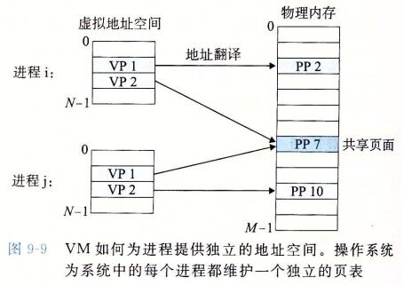
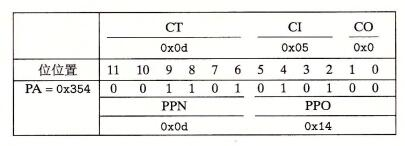

> @Date    : 2020-10-02 10:13:56
>
> @Author  : Lewis Tian (taseikyo@gmail.com)
>
> @Link    : github.com/taseikyo

# 虚拟内存（virtual memory）

一个系统中的进程是与其他进程共享 CPU 和主存资源的。然而，共享主存会形成一些特殊的挑战。随着对 CPU 需求的增长，进程以某种合理的平滑方式慢了下来。但是如果太多的进程需要太多的内存，那么它们中的一些就根本无法运行。当一个程序没有空间可用时，那就是它运气不好了。内存还很容易被破坏。如果某个进程不小心写了另一个进程使用的内存，它就可能以某种完全和程序逻辑无关的令人迷惑的方式失败

为了更加有效地管理内存并且少出错，现代系统提供了一种对主存的抽象概念，叫做**虚拟内存**（VM）。虚拟内存是硬件异常、硬件地址翻译、主存、磁盘文件和内核软件的完美交互，它为每个进程提供了一个大的、一致的和私有的地址空间。通过一个很清晰的机制，虚拟内存提供了三个重要的能力：

1. 它将主存看成是一个存储在磁盘上的地址空间的高速缓存，在主存中只保存活动区域，并根据需要在磁盘和主存之间来回传送数据，通过这种方式，它高效地使用了主存
2. 它为每个进程提供了一致的地址空间，从而简化了内存管理
3. 它保护了每个进程的地址空间不被其他进程破坏

虚拟内存是计算机系统最重要的概念之一。它成功的一个主要原因就是因为它对程序员是透明的。既然虚拟内存在幕后工作得如此之好，为什么程序员还需要理解它呢？有以下几个原因：

- 虚拟内存是核心的。虚拟内存遍及计算机系统的所有层面，在硬件异常、汇编器、链接器、加载器、共享对象、文件和进程的设计中扮演着重要角色。理解虚拟内存将帮助你更好地理解系统通常是如何工作的
- 虚拟内存是强大的。虚拟内存给予应用程序强大的能力，可以创建和销毁内存片（chunk）、将内存片映射到磁盘文件的某个部分，以及与其他进程共享内存。比如，你知道可以通过读写内存位置读或者修改一个磁盘文件的内容吗？或者可以加载一个文件的内容到内存中，而不需要进行任何显式地复制吗？理解虚拟内存将帮助你利用它的强大功能在应用程序中添加动力
- 虚拟内存是危险的。每次应用程序引用一个变量、间接引用一个指针，或者调用一个诸如 malloc 这样的动态分配程序时，它就会和虚拟内存发生交互。如果虚拟内存使用不当，应用将遇到复杂危险的与内存有关的错误。例如，一个带有错误指针的程序可以立即崩溃于"段错误"或者"保护错误"，它可能在崩溃之前还默默地运行了几个小时，或者是最令人惊慌地，运行完成却产生不正确的结果。理解虚拟内存以及诸如 malloc 之类的管理虚拟内存的分配程序，可以帮助你避免这些错误

这一章从两个角度来看虚拟内存。本章的前一部分描述虚拟内存是如何工作的。后一部分描述的是应用程序如何使用和管理虚拟内存。无可避免的事实是虚拟内存很复杂，本章很多地方都反映了这一点。好消息就是如果你掌握这些细节，你就能够手工模拟一个小系统的虚拟内存机制，而且虚拟内存的概念将永远不再神秘

第二部分是建立在这种理解之上的，向你展示了如何在程序中使用和管理虚拟内存。你将学会如何通过显式的内存映射和对像 malloc 程序这样的动态内存分配器的调用来管理虚拟内存。你还将了解到 C 程序中的大多数常见的与内存有关的错误，并学会如何避免它们的出现

## 9.1 物理和虚拟寻址

计算机系统的主存被组织成一个由 M 个连续的字节大小的单元组成的数组。每字节都有一个唯一的**物理地址**（Physical Address，PA）。第一个字节的地址为 0，接下来的字节地址为 1，再下一个为 2，依此类推。给定这种简单的结构，CPU 访问内存的最自然的方式就是使用物理地址。我们把这种方式称为**物理寻址**（physical addressing）。图 9-1 展示了一个物理寻址的示例，该示例的上下文是一条加载指令，它读取从物理地址 4 处开始的 4 字节字。当 CPU 执行这条加载指令时，会生成一个有效物理地址，通过内存总线，把它传递给主存。主存取岀从物理地址 4 处开始的 4 字节字，并将它返回给 CPU，CPU 会将它存放在一个寄存器里。


早期的 PC 使用物理寻址，而且诸如数字信号处理器、嵌入式微控制器以及 Cray 超级计算机这样的系统仍然继续使用这种寻址方式。然而，现代处理器使用的是一种称为**虚拟寻址**（virtual addressing）的寻址形式，参见图 9-2


使用虚拟寻址，CPU 通过生成一个**虚拟地址**（Virtual Address，VA）来访问主存，这个虚拟地址在被送到内存之前先转换成适当的物理地址。将一个虚拟地址转换为物理地址的任务叫做**地址翻译**（address translation）。就像异常处理一样，地址翻译需要 CPU 硬件和操作系统之间的紧密合作。CPU 芯片上叫做**内存管理单元**（Memory Management Unit，MMU）的专用硬件，利用存放在主存中的查询表来动态翻译虚拟地址，该表的内容由操作系统管理


## 9.2 地址空间

**地址空间**（addressspace）是一个非负整数地址的有序集合：$ \{0,1,2,\cdots\} $

如果地址空间中的整数是连续的，那么我们说它是一个**线性地址空间**（linear address space）。为了简化讨论，我们总是假设使用的是线性地址空间。在一个带虚拟内存的系统中，CPU 从一个有 $ N = 2^n $ 个地址的地址空间中生成虚拟地址，这个地址空间称为**虚拟地址空间**（virtual addres sspace）：$ \{0,1,2,\cdots,N-1\} $

一个地址空间的大小是由表示最大地址所需要的位数来描述的。例如，一个包含 $ N = 2^n $ 个地址的虚拟地址空间就叫做一个 n 位地址空间。现代系统通常支持 32 位或者 64 位虚拟地址空间。

一个系统还有一个**物理地址空间**（physical address space），对应于系统中物理内存的 M 个字节：$ \{0,1,2,\cdots,M—1\} $

M 不要求是 2 的幕，但是为了简化讨论，我们假设 $ M = 2^m $ 。

地址空间的概念是很重要的，因为它清楚地区分了数据对象（字节）和它们的属性（地址）。一旦认识到了这种区别，那么我们就可以将其推广，允许每个数据对象有多个独立的地址，其中每个地址都选自一个不同的地址空间。这就是虚拟内存的基本思想。主存中的每字节都有一个选自虚拟地址空间的虚拟地址和一个选自物理地址空间的物理地址

## 9.3 虚拟内存作为缓存的工具

概念上而言，虚拟内存被组织为一个由存放在磁盘上的 N 个连续的字节大小的单元组成的数组。每字节都有一个唯一的虚拟地址，作为到数组的索引。磁盘上数组的内容被缓存在主存中。和存储器层次结构中其他缓存一样，磁盘（较低层）上的数据被分割成块，这些块作为磁盘和主存（较高层）之间的传输单元。VM 系统通过将虚拟内存分割为称为**虚拟页**（Virtual Page，VP）的大小固定的块来处理这个问题。每个虚拟页的大小为 $ P = 2^p $ 字节。类似地，物理内存被分割为**物理页**（Physical Page，PP），大小也为 P 字节（物理页也被称为**页帧**（page frame））

在任意时刻，虚拟页面的集合都分为三个不相交的子集：

- 未分配的：VM 系统还未分配（或者创建）的页。未分配的块没有任何数据和它们相关联，因此也就不占用任何磁盘空间
- 缓存的：当前已缓存在物理内存中的已分配页
- 未缓存的：未缓存在物理内存中的已分配页

图 9-3 的示例展示了一个有 8 个虚拟页的小虚拟内存。虚拟页 0 和 3 还没有被分配，因此在磁盘上还不存在。虚拟页 1、4 和 6 被缓存在物理内存中。页 2、5 和 7 已经被分配了，但是当前并未缓存在主存中


### 9.3.1 DRAM 缓存的组织结构

为了有助于清晰理解存储层次结构中不同的缓存概念，我们将使用术语 **SRAM 缓存**来表示位于 CPU 和主存之间的 Ll、L2 和 L3 高速缓存，并且用术语 **DRAM 缓存**来表示虚拟内存系统的缓存，它在主存中缓存虚拟页

在存储层次结构中，DRAM 缓存的位置对它的组织结构有很大的影响。回想一下，DRAM 比 SRAM 要慢大约 10 倍，而磁盘要比 DRAM 慢大约 100000 多倍。因此，DRAM 缓存中的不命中比起 SRAM 缓存中的不命中要昂贵得多，这是因为 DRAM 缓存不命中要由磁盘来服务，而 SRAM 缓存不命中通常是由基于 DRAM 的主存来服务的。而且，从磁盘的一个扇区读取第一个字节的时间开销比起读这个扇区中连续的字节要慢大约 100000 倍。归根到底，DRAM 缓存的组织结构完全是由巨大的不命中开销驱动的

因为大的不命中开销和访问第一个字节的开销，虚拟页往往很大，通常是 4KB ~ 2MB。由于大的不命中开销，DRAM 缓存是全相联的，即任何虚拟页都可以放置在任何的物理页中。不命中时的替换策略也很重要，因为替换错了虚拟页的开销也非常之高。因此，与硬件对 SRAM 缓存相比，操作系统对 DRAM 缓存使用了更复杂精密的替换算法。（这些替换算法超出了我们的讨论范围）。最后，因为对磁盘的访问时间很长，DRAM 缓存总是使用写回，而不是直写

### 9.3.2 页表

同任何缓存一样，虚拟内存系统必须有某种方法来判定一个虚拟页是否缓存在 DRAM 中的某个地方。如果是，系统还必须确定这个虚拟页存放在哪个物理页中。如果不命中，系统必须判断这个虚拟页存放在磁盘的哪个位置，在物理内存中选择一个牺牲页，并将虚拟页从磁盘复制到 DRAM 中，替换这个牺牲页

这些功能是由软硬件联合提供的，包括操作系统软件、MMU（内存管理单元）中的地址翻译硬件和一个存放在物理内存中叫做**页表**（page table）的数据结构，页表将虚拟页映射到物理页。每次地址翻译硬件将一个虚拟地址转换为物理地址时，都会读取页表。操作系统负责维护页表的内容，以及在磁盘与 DRAM 之间来回传送页

图 9-4 展示了一个页表的基本组织结构。页表就是一个页表条目（Page Table Entry，PTE）的数组。虚拟地址空间中的每个页在页表中一个固定偏移量处都有一个 PTE。为了我们的目的，我们将假设每个 PTE 是由一个有效位（valid bit）和一个 n 位地址字段组成的。有效位表明了该虚拟页当前是否被缓存在 DRAM 中。如果设置了有效位，那么地址字段就表示 DRAM 中相应的物理页的起始位置，这个物理页中缓存了该虚拟页。如果没有设置有效位，那么一个空地址表示这个虚拟页还未被分配。否则，这个地址就指向该虚拟页在磁盘上的起始位置

图 9-4 中的示例展示了一个有 8 个虚拟页和 4 个物理页的系统的页表。四个虚拟页（VP 1、VP 2、VP 4 和 VP 7）当前被缓存在 DRAM 中。两个页（VP 0 和 VP 5 ）还未被分配，而剩下的页（VP 3 和 VP 6）已经被分配了，但是当前还未被缓存。图 9-4 中有一个要点要注意，因为 DRAM 缓存是全相联的，所以任意物理页都可以包含任意虚拟页


### 9.3.3 页命中

考虑一下当 CPU 想要读包含在 VP2 中的虚拟内存的一个字时会发生什么（图 9-5），VP 2 被缓存在 DRAM 中。使用我们将在 9.6 节中详细描述的一种技术，地址翻译硬件将虚拟地址作为一个索引来定位 PTE 2，并从内存中读取它。因为设置了有效位，那么地址翻译硬件就知道 VP 2 是缓存在内存中的了。所以它使用 PTE 中的物理内存地址（该地址指向 PP 1 中缓存页的起始位置），构造出这个字的物理地址。


### 9.3.4 缺页

在虚拟内存的习惯说法中，DRAM 缓存不命中称为缺页（page fault）。图 9-6 展示了在缺页之前我们的示例页表的状态。CPU 引用了 VP 3 中的一个字，VP 3 并未缓存在 DRAM 中。地址翻译硬件从内存中读取 PTE 3，从有效位推断出 VP 3 未被缓存，并且触发一个缺页异常。缺页异常调用内核中的缺页异常处理程序，该程序会选择一个牺牲页，在此例中就是存放在 PP 3 中的 VP 4。如果 VP 4 已经被修改了，那么内核就会将它复制回磁盘。无论哪种情况，内核都会修改 VP 4 的页表条目，反映出 VP 4 不再缓存在主存中这一事实


接下来，内核从磁盘复制 VP 3 到内存中的 PP 3，更新 PTE 3，随后返回。当异常处理程序返回时，它会重新启动导致缺页的指令，该指令会把导致缺页的虚拟地址重发送到地址翻译硬件。但是现在，VP 3 已经缓存在主存中了，那么页命中也能由地址翻译硬件正常处理了。图 9-7 展示了在缺页之后我们的示例页表的状态。


虚拟内存是在 20 世纪 60 年代早期发明的，远在 CPU - 内存之间差距的加大引发产生 SRAM 缓存之前。因此，虚拟内存系统使用了和 SRAM 缓存不同的术语，即使它们的许多概念是相似的。在虚拟内存的习惯说法中，块被称为页。在磁盘和内存之间传送页的活动叫做**交换**（swapping）或者**页面调度**（paging）。页从磁盘换入（或者页面调入）DRAM 和从 DRAM 换出（或者页面调出）磁盘。一直等待，直到最后时刻，也就是当有不命中发生时，才换入页面的这种策略称为**按需页面调度**（demand paging）。也可以采用其他的方法，例如尝试着预测不命中，在页面实际被引用之前就换入页面。然而，所有现代系统都使用的是按需页面调度的方式

### 9.3.5 分配页面

图 9-8 展示了当操作系统分配一个新的虚拟内存页时对我们示例页表的影响，例如，调用 malloc 的结果。在这个示例中，VP5 的分配过程是在磁盘上创建空间并更新 PTE 5，使它指向磁盘上这个新创建的页面


### 9.3.6 又是局部性救了我们

当我们中的许多人都了解了虚拟内存的概念之后，我们的第一印象通常是它的效率应该是非常低。因为不命中开销很大，我们担心页面调度会破坏程序性能。实际上，虚拟内存工作得相当好，这主要归功于我们的老朋友**局部性**（locality）

尽管在整个运行过程中程序引用的不同页面的总数可能超出物理内存总的大小，但是局部性原则保证了在任意时刻，程序将趋向于在一个较小的**活动页面**（active page）集合上工作，这个集合叫做**工作集**（working set）或者**常驻集合**（resident set）。在初始开销，也就是将工作集页面调度到内存中之后，接下来对这个工作集的引用将导致命中，而不会产生额外的磁盘流量

只要我们的程序有好的时间局部性，虚拟内存系统就能工作得相当好。但是，当然不是所有的程序都能展现良好的时间局部性。如果工作集的大小超出了物理内存的大小，那么程序将产生一种不幸的状态，叫做**抖动**（thrashing），这时页面将不断地换进换出。虽然虚拟内存通常是有效的，但是如果一个程序性能慢得像爬一样，那么聪明的程序员会考虑是不是发生了抖动

> ### 旁注 - 统计缺页次数
>
> 你可以利用 Linux 的 getrusage 函数监测缺页的数量（以及许多其他的信息）

## 9.4 虚拟内存作为内存管理的工具

在上一节中，我们看到虚拟内存是如何提供一种机制，利用 DRAM 缓存来自通常更大的虚拟地址空间的页面。有趣的是，一些早期的系统，比如 DEC PDP-11/70，支持的是一个比物理内存更小的虚拟地址空间。然而，虚拟地址仍然是一个有用的机制，因为它大大地简化了内存管理，并提供了一种自然的保护内存的方法

到目前为止，我们都假设有一个单独的页表，将一个虚拟地址空间映射到物理地址空间。实际上，操作系统为每个进程提供了一个独立的页表，因而也就是一个独立的虚拟地址空间。图 9-9 展示了基本思想。在这个示例中，进程 i 的页表将 VP 1 映射到 PP 2，VP 2 映射到 PP 7。相似地，进程 j 的页表将 VP 1 映射到 PP 7，VP 2 映射到 PP 10。注意，多个虚拟页面可以映射到同一个共享物理页面上



按需页面调度和独立的虚拟地址空间的结合，对系统中内存的使用和管理造成了深远的影响。特别地，VM 简化了链接和加载、代码和数据共享，以及应用程序的内存分配。

- 简化链接。独立的地址空间允许每个进程的内存映像使用相同的基本格式，而不管代码和数据实际存放在物理内存的何处。例如，像我们在图 8-13 中看到的，一个给定的 Linux 系统上的每个进程都使用类似的内存格式。对于 64 位地址空间，代码段总是从虚拟地址 0x400000 开始。数据段跟在代码段之后，中间有一段符合要求的对齐空白。栈占据用户进程地址空间最高的部分，并向下生长。这样的一致性极大地简化了链接器的设计和实现，允许链接器生成完全链接的可执行文件，这些可执行文件是独立于物理内存中代码和数据的最终位置的
- 简化加载。虚拟内存还使得容易向内存中加载可执行文件和共享对象文件。要把目标文件中 .text 和 .data 节加载到一个新创建的进程中，Linux 加载器为代码和数据段分配虚拟页，把它们标记为无效的（即未被缓存的），将页表条目指向目标文件中适当的位置。有趣的是，加载器从不从磁盘到内存实际复制任何数据。在每个页初次被引用时，要么是 CPU 取指令时引用的，要么是一条正在执行的指令引用一个内存位置时引用的，虚拟内存系统会按照需要自动地调入数据页

将一组连续的虚拟页映射到任意一个文件中的任意位置的表示法称作**内存映射**（memory mapping）。Linux 提供一个称为 mmap 的系统调用，允许应用程序自己做内存映射。我们会在 9.8 节中更详细地描述应用级内存映射

- 简化共享。独立地址空间为操作系统提供了一个管理用户进程和操作系统自身之间共享的一致机制。一般而言，每个进程都有自己私有的代码、数据、堆以及栈区域，是不和其他进程共享的。在这种情况中，操作系统创建页表，将相应的虚拟页映射到不连续的物理页面

然而，在一些情况中，还是需要进程来共享代码和数据。例如，每个进程必须调用相同的操作系统内核代码，而每个 C 程序都会调用 C 标准库中的程序，比如 printf。操作系统通过将不同进程中适当的虚拟页面映射到相同的物理页面，从而安排多个进程共享这部分代码的一个副本，而不是在每个进程中都包括单独的内核和 C 标准库的副本，如图 9-9 所示

- 简化内存分配。虚拟内存为向用户进程提供一个简单的分配额外内存的机制。当一个运行在用户进程中的程序要求额外的堆空间时（如调用 malloc 的结果），操作系统分配一个适当数字（例如 k）个连续的虚拟内存页面，并且将它们映射到物理内存中任意位置的 k 个任意的物理页面。由于页表工作的方式，操作系统没有必要分配 k 个连续的物理内存页面。页面可以随机地分散在物理内存中

## 9.5 虚拟内存作为内存保护的工具

任何现代计算机系统必须为操作系统提供手段来控制对内存系统的访问。不应该允许一个用户进程修改它的只读代码段。而且也不应该允许它读或修改任何内核中的代码和数据结构。不应该允许它读或者写其他进程的私有内存，并且不允许它修改任何与其他进程共享的虚拟页面，除非所有的共享者都显式地允许它这么做（通过调用明确的进程间通信系统调用）

就像我们所看到的，提供独立的地址空间使得区分不同进程的私有内存变得容易。但是，地址翻译机制可以以一种自然的方式扩展到提供更好的访问控制。因为每次 CPU 生成一个地址时，地址翻译硬件都会读一个 PTE，所以通过在 PTE 上添加一些额外的许可位来控制对一个虚拟页面内容的访问十分简单。图 9-10 展示了大致的思想


在这个示例中，每个 PTE 中已经添加了三个许可位。SUP 位表示进程是否必须运行在内核（超级用户）模式下才能访问该页。运行在内核模式中的进程可以访问任何页面，但是运行在用户模式中的进程只允许访问那些 SUP 为 0 的页面。READ 位和 WRITE 位控制对页面的读和写访问。例如，如果进程 i 运行在用户模式下，那么它有读 VP 0 和读写 VP 1 的权限。然而，不允许它访问 VP 2

如果一条指令违反了这些许可条件，那么 CPU 就触发一个一般保护故障，将控制传递给一个内核中的异常处理程序。Linux shell 一般将这种异常报告为"段错误（segmentation fault）"

## 9.6 地址翻译

这一节讲述的是地址翻译的基础知识。我们的目标是让你了解硬件在支持虚拟内存中的角色，并给出足够多的细节使得你可以亲手演示一些具体的示例。不过，要记住我们省略了大量的细节，尤其是和时序相关的细节，虽然这些细节对硬件设计者来说是非常重要的，但是超出了我们讨论的范围。图 9-11 概括了我们在这节里将要使用的所有符号，供读者参考

> 基本参数

| 符号     | 描述                    |
|----------|-------------------------|
| $N=2^n$  | 虚拟地址空间中的地址数量 |
| $M=2^m$  | 物理地址空间中的地址数量 |
| $P=2^p$  | 页的大小（字节）        |

> 虚拟地址（VA）的组成部分

| 符号 | 描述                   |
|------|------------------------|
| VPO  | 虚拟页面偏移量（字节） |
| VPN  | 虚拟页号               |
| TLBI | TLB 索引               |
| TLBT | TLB 标记               |

> 物理地址（PA）的组成部分

| 符号 | 描述                   |
|------|------------------------|
| PPO  | 物理页面偏移量（字节） |
| PPN  | 物理页号               |
| CO   | 缓冲块内的字节偏移量   |
| CI   | 高速缓存索引           |
| CT   | 高速缓存标记           |

> 图 9-11 地址翻译符号小结

形式上来说，地址翻译是一个 N 元素的虚拟地址空间（VAS）中的元素和一个 M 元素的物理地址空间（PAS）中元素之间的映射，

$$
MAP: VAS \rightarrow PAS \cup Ø
$$

这里

$$
MAP(A) = \begin{cases}
A' &\text{如果虚拟地址 } A \text{ 处的数据在 PAS 的物理地址 } A' \text{ 处}\\
Ø &\text{如果虚拟地址 } A \text{ 处的数据不在物理内存中}
\end{cases}
$$

图 9-12 展示了 MMU 如何利用页表来实现这种映射。CPU 中的一个控制寄存器，**页表基址寄存器**（Page Table Base Register，PTBR）指向当前页表。n 位的虚拟地址包含两个部分：一个 p 位的**虚拟页面偏移**（Virtual Page Offset，VPO）和一个 n-p 位的**虚拟页号**（Virtual Page Number，VPN）。MMU 利用 VPN 来选择适当的 PTE。例如，VPN 0 选择 PTE 0，VPN 1 选择 PTE 1，以此类推。将页表条目中**物理页号**（Physical Page Number，PPN）和虚拟地址中的 VP。串联起来，就得到相应的物理地址。注意，因为物理和虚拟页面都是 P 字节的，所以**物理页面偏移**（Physical Page Offset，PPO）和 VPO 是相同的


图 9-13a 展示了当页面命中时，CPU 硬件执行的步骤。

1. 处理器生成一个虚拟地址，并把它传送给 MMU
2. MMU 生成 PTE 地址，并从高速缓存/主存请求得到它
3. 高速缓存/主存向 MMU 返回 PTE
4. MMU 构造物理地址，并把它传送给高速缓存/主存
5. 高速缓存/主存返回所请求的数据字给处理器


页面命中完全是由硬件来处理的，与之不同的是，处理缺页要求硬件和操作系统内核协作完成，如图 9-13b 所示。

1. 和图 9-13a 中的第 1 步到第 3 步相同
2. PTE 中的有效位是零，所以 MMU 触发了一次异常，传递 CPU 中的控制到操作系统内核中的缺页异常处理程序
3. 缺页处理程序确定出物理内存中的牺牲页，如果这个页面已经被修改了，则把它换出到磁盘
4. 缺页处理程序页面调入新的页面，并更新内存中的 PTE
5. 缺页处理程序返回到原来的进程，再次执行导致缺页的指令。CPU 将引起缺页的虚拟地址重新发送给 MMU。因为虚拟页面现在缓存在物理内存中，所以就会命中，在 MMU 执行了图 9-13b 中的步骤之后，主存就会将所请求字返回给处理器

### 9.6.1 结合高速缓存和虚拟内存

在任何既使用虚拟内存又使用 SRAM 高速缓存的系统中，都有应该使用虚拟地址还是使用物理地址来访问 SRAM 高速缓存的问题。尽管关于这个折中的详细讨论已经超出了我们的讨论范围，但是大多数系统是选择物理寻址的。使用物理寻址，多个进程同时在高速缓存中有存储块和共享来自相同虚拟页面的块成为很简单的事情。而且，高速缓存无需处理保护问题，因为访问权限的检査是地址翻译过程的一部分。

图 9-14 展示了一个物理寻址的高速缓存如何和虚拟内存结合起来。主要的思路是地址翻译发生在高速缓存查找之前。注意，页表条目可以缓存，就像其他的数据字一样


### 9.6.2 利用 TLB 加速地址翻译

正如我们看到的，每次 CPU 产生一个虚拟地址，MMU 就必须查阅一个 PTE，以便将虚拟地址翻译为物理地址。在最糟糕的情况下，这会要求从内存多取一次数据，代价是几十到几百个周期。如果 PTE 碰巧缓存在 L1 中，那么开销就下降到 1 个或 2 个周期。然而，许多系统都试图消除即使是这样的开销，它们在 MMU 中包括了一个关于 PTE 的小的缓存，称为 TLB，Translation Lookaside Buffer

TLB 是一个小的、虚拟寻址的缓存，其中每一行都保存着一个由单个 PTE 组成的块。TLB 通常有高度的相联度。如图 9-15 所示，用于组选择和行匹配的索引和标记字段是从虚拟地址中的虚拟页号中提取出来的。如果 TLB 有 $ T = 2^t $ 个组，那么 **TLB 索引**（TLBI）是由 VPN 的 t 个最低位组成的，而 **TLB 标记**（TLBT）是由 VPN 中剩余的位组成的


图 9-16a 展示了当 TLB 命中时（通常情况）所包括的步骤。这里的关键点是，所有的地址翻译步骤都是在芯片上的 MMU 中执行的，因此非常快

- 第 1 步：CPU 产生一个虚拟地址
- 第 2 步和第 3 步：MMU 从 TLB 中取出相应的 PTE
- 第 4 步：MMU 将这个虚拟地址翻译成一个物理地址，并且将它发送到高速缓存/主存
- 第 5 步：高速缓存/主存将所请求的数据字返回给 CPU


当 TLB 不命中时，MMU 必须从 L1 缓存中取出相应的 PTE，如图 9-16b 所示。新取出的 PTE 存放在 TLB 中，可能会覆盖一个已经存在的条目

### 9.6.3 多级页表

到目前为止，我们一直假设系统只用一个单独的页表来进行地址翻译。但是如果我们有一个 32 位的地址空间、4KB 的页面和一个 4 字节的 PTE，那么即使应用所引用的只是虚拟地址空间中很小的一部分，也总是需要一个 4MB 的页表驻留在内存中。对于地址空间为 64 位的系统来说，问题将变得更复杂

用来压缩页表的常用方法是使用层次结构的页表。用一个具体的示例是最容易理解这个思想的。假设 32 位虚拟地址空间被分为 4KB 的页，而每个页表条目都是 4 字节。还假设在这一时刻，虚拟地址空间有如下形式：内存的前 2K 个页面分配给了代码和数据，接下来的 6K 个页面还未分配，再接下来的 1023 个页面也未分配，接下来的 1 个页面分配给了用户栈。图 9-17 展示了我们如何为这个虚拟地址空间构造一个两级的页表层次结构


一级页表中的每个 PTE 负责映射虚拟地址空间中一个 4MB 的**片**（chunk），这里每一片都是由 1024 个连续的页面组成的。比如，PTE 0 映射第一片，PTE 1 映射接下来的一片，以此类推。假设地址空间是 4GB，1024 个 PTE 已经足够覆盖整个空间了

如果片 i 中的每个页面都未被分配，那么一级 PTE i 就为空。例如，图 9-17 中，片 2 ~ 7 是未被分配的。然而，如果在片 i 中至少有一个页是分配了的，那么一级 PTE i 就指向一个二级页表的基址。例如，在图 9-17 中，片 0、1 和 8 的所有或者部分已被分配，所以它们的一级 PTE 就指向二级页表

二级页表中的每个 PTE 都负责映射一个 4KB 的虚拟内存页面，就像我们查看只有一级的页表一样。注意，使用 4 字节的 PTE，每个一级和二级页表都是 4KB 字节，这刚好和一个页面的大小是一样的

这种方法从两个方面减少了内存要求。第一，如果一级页表中的一个 PTE 是空的，那么相应的二级页表就根本不会存在。这代表着一种巨大的潜在节约，因为对于一个典型的程序，4GB 的虚拟地址空间的大部分都会是未分配的。第二，只有一级页表才需要总是在主存中；虚拟内存系统可以在需要时创建、页面调入或调出二级页表，这就减少了主存的压力；只有最经常使用的二级页表才需要缓存在主存中

图 9-18 描述了使用 k 级页表层次结构的地址翻译。虚拟地址被划分成为 k 个 VPN 和 1 个 VPO。每个 VPN i 都是一个到第 i 级页表的索引，其中 $ 1\leq i \leq k $ 。第 j 级页表中的每个 PTE，$ 1 \leq j \leq k-1 $，都指向第 j+1 级的某个页表的基址。第 k 级页表中的每个 PTE 包含某个物理页面的 PPN，或者一个磁盘块的地址。为了构造物理地址，在能够确定 PPN 之前，MMU 必须访问为个 PTE。对于只有一级的页表结构，PPO 和 VPO 是相同的


访问 k 个 PTE，第一眼看上去昂贵而不切实际。然而，这里 TLB 能够起作用，正是通过将不同层次上页表的 PTE 缓存起来。实际上，带多级页表的地址翻译并不比单级页表慢很多

### 9.6.4 综合：端到端的地址翻译

在这一节里，我们通过一个具体的端到端的地址翻译示例，来综合一下我们刚学过的这些内容，这个示例运行在有一个 TLB 和 L1 d-cache 的小系统上。为了保证可管理性，我们做出如下假设：

- 内存是按字节寻址的
- 内存访问是针对 1 字节的字的（不是 4 字节的字）
- 虚拟地址是 14 位长的（$ n=14 $）
- 物理地址是 12 位长的（$ m=12 $）
- 页面大小是 64 字节（$ P=64 $）
- TLB 是四路组相联的，总共有 16 个条目
- L1 d-cache 是物理寻址、直接映射的，行大小为 4 字节，而总共有 16 个组


图 9-19 展示了虚拟地址和物理地址的格式。因为每个页面是 $ 2^6=64 $ 字节，所以虚拟地址和物理地址的低 6 位分别作为 VPO 和 PPO。虚拟地址的高 8 位作为 VPN。物理地址的高 6 位作为 PPN


图 9-20 展示了小内存系统的一个快照，包括 TLB（图 9-20a）、页表的一部分（图 9-20b）和 L1 高速缓存（图 9-20c）。在 TLB 和高速缓存的图上面，我们还展示了访问这些设备时硬件是如何划分虚拟地址和物理地址的位的

- TLB。TLB 是利用 VPN 的位进行虚拟寻址的。因为 TLB 有 4 个组，所以 VPN 的低 2 位就作为组索引（TLBI）。VPN 中剩下的高 6 位作为标记（TLBT），用来区别可能映射到同一个 TLB 组的不同的 VPN
- 页表。这个页表是一个单级设计，一共有 $2^8=256 $个页表条目（PTE）。然而，我们只对这些条目中的开头 16 个感兴趣。为了方便，我们用索引它的 VPN 来标识每个 PTE；但是要记住这些 VPN 并不是页表的一部分，也不储存在内存中。另外，注意每个无效 PTE 的 PPN 都用一个破折号来表示，以加强一个概念：无论刚好这里存储的是什么位值，都是没有任何意义的
- 高速缓存。直接映射的缓存是通过物理地址中的字段来寻址的。因为每个块都是 4 字节，所以物理地址的低 2 位作为块偏移（CO）。因为有 16 组，所以接下来的 4 位就用来表示组索引（CI）。剩下的 6 位作为标记（CT）

给定了这种初始化设定，让我们来看看当 CPU 执行一条读地址 0x03d4 处字节的加载指令时会发生什么（回想一下我们假定 CPU 读取 1 字节的字，而不是 4 字节的字）


开始时，MMU 从虚拟地址中抽取出 VPN（0x0F），并且检查 TLB，看它是否因为前面的某个内存引用缓存了 PTE 0x0F 的一个副本。TLB 从 VPN 中抽取出 TLB 索引（0x03）和 TLB 标记（0x3），组 0x3 的第二个条目中有效匹配，所以命中，然后将缓存的 PPN（0x0D）返回给 MMU

如果 TLB 不命中，那么 MMU 就需要从主存中取出相应的 PTE。然而，在这种情况中，我们很幸运，TLB 会命中。现在，MMU 有了形成物理地址所需要的所有东西。它通过将来自 PTE 的 PPN（0x0D）和来自虚拟地址的 VPO（0x14）连接起来，这就形成了物理地址（0x354）

接下来，MMU 发送物理地址给缓存，缓存从物理地址中抽取出缓存偏移 CO（0x0）、缓存组索引 CI（0x5）以及缓存标记 CT（0x0D）



因为组 0x5 中的标记与 CT 相匹配，所以缓存检测到一个命中，读出在偏移量 CO 处的数据字节（0x36），并将它返回给 MMU，随后 MMU 将它传递回 CPU

翻译过程的其他路径也是可能的。例如，如果 TLB 不命中，那么 MMU 必须从页表中的 PTE 中取出 PPN。如果得到的 PTE 是无效的，那么就产生一个缺页，内核必须调入合适的页面，重新运行这条加载指令。另一种可能性是 PTE 是有效的，但是所需要的内存块在缓存中不命中

## 9.7 案例研究：Intel Core i7 / Linux 内存系统

一个运行 Linux 的 Intel Core i7。虽然底层的 Haswell 微体系结构允许完全的 64 位虚拟和物理地址空间，而现在的（以及可预见的未来的）Core i7 实现支持 48 位（256 TB）虚拟地址空间和 52 位（4 PB）物理地址空间，还有一个兼容模式，支持 32 位（4 GB）虚拟和物理地址空间

图 9-21 给出了 Core i7 内存系统的重要部分。**处理器封装**（processor package）包括四个核、一个大的所有核共享的 L3 高速缓存，以及一个 DDR3 内存控制器。每个核包含一个层次结构的 TLB、一个层次结构的数据和指令高速缓存，以及一组快速的点到点链路，这种链路基于 QuickPath 技术，是为了让一个核与其他核和外部 I/O 桥直接通信。TLB 是虚拟寻址的，是四路组相联的。L1、L2 和 L3 高速缓存是物理寻址的，块大小为 64 字节。L1 和 L2 是 8 路组相联的，而 L3 是 16 路组相联的。页大小可以在启动时被配置为 4 KB 或 4 MB。Linux 使用的是 4 KB 的页


### 9.7.1 Core i7 地址翻译

图 9-22 总结了完整的 Core i7 地址翻译过程，从 CPU 产生虚拟地址的时刻一直到来自内存的数据字到达 CPU。Core i7 采用四级页表层次结构。每个进程有它自己私有的页表层次结构。当一个 Linux 进程在运行时，虽然 Core i7 体系结构允许页表换进换出，但是与已分配了的页相关联的页表都是驻留在内存中的。CR3 控制寄存器指向第一级页表（L1）的起始位置。CR3 的值是每个进程上下文的一部分，每次上下文切换时，CR3 的值都会被恢复


图 9-23 给出了第一级、第二级或第三级页表中条目的格式。当 P = 1 时（Linux 中就总是如此），地址字段包含一个 40 位物理页号（PPN），它指向适当的页表的开始处。注意，这强加了一个要求，要求物理页表 4 KB 对齐


图 9-24 给出了第四级页表中条目的格式。当 P = 1，地址字段包括一个 40 位 PPN，它指向物理内存中某一页的基地址。这又强加了一个要求，要求物理页 4 KB 对齐


PTE 有三个权限位，控制对页的访问。R/W 位确定页的内容是可以读写的还是只读的。U/S 位确定是否能够在用户模式中访问该页，从而保护操作系统内核中的代码和数据不被用户程序访问。XD（禁止执行）位是在 64 位系统中引入的，可以用来禁止从某些内存页取指令。这是一个重要的新特性，通过限制只能执行只读代码段，使得操作系统内核降低了缓冲区溢出攻击的风险

当 MMU 翻译每一个虚拟地址时，它还会更新另外两个内核缺页处理程序会用到的位。每次访问一个页时，MMU 都会设置 A 位，称为**引用位**（reference bit）。内核可以用这个引用位来实现它的页替换算法。每次对一个页进行了写之后，MMU 都会设置 D 位，又称修改位或脏位（dirty bit）。修改位告诉内核在复制替换页之前是否必须写回牺牲页。内核可以通过调用一条特殊的内核模式指令来清除引用位或修改位。

图 9-25 给出了 Core i7 MMU 如何使用四级的页表来将虚拟地址翻译成物理地址。36 位 VPN 被划分成四个 9 位的片，每个片被用作到一个页表的偏移量。CR3 寄存器包含 L1 页表的**物理地址**。VPN 1 提供到一个 L1 PTE 的偏移量，这个 PTE 包含 L2 页表的基地址。VPN 2 提供到一个 L2 PTE 的偏移量，以此类推


> ### 旁注：优化地址翻译
>
> 在对地址翻译的讨论中，我们描述了一个顺序的两个步骤的过程：
>
> 1. MMU 将虚拟地址翻译成物理地址
> 2. 将物理地址传送到 L1 高速缓存
>
> 然而，实际的硬件实现使用了一个灵活的技巧，允许这些步骤部分重叠，因此也就加速了对 L1 高速缓存的访问。例如，页面大小为 4KB 的 Core i7 系统上的一个虚拟地址有 12 位的 VPO，并且这些位和相应物理地址中的 PPO 的 12 位是相同的。因为八路组相联的、物理寻址的 L1 高速缓存有 64 个组和大小为 64 字节的缓存块，每个物理地址有 6 个（$ log_264 $）缓存偏移位和 6 个（$ log_264 $）索引位。这 12 位恰好符合虚拟地址的 VPO 部分，这绝不是偶然！当 CPU 需要翻译一个虚拟地址时，它就发送 VPN 到 MMU，发送 VPO 到高速 L1 缓存。当 MMU 向 TLB 请求一个页表条目时，L1 高速缓存正忙着利用 VPO 位查找相应的组，并读出这个组里的 8 个标记和相应的数据字。当 MMU 从 TLB 得到 PPN 时，缓存已经准备好试着把这个 PPN 与这 8 个标记中的一个进行匹配了

### 9.7.2 Linux 虚拟内存系统

一个虚拟内存系统要求硬件和内核软件之间的紧密协作。版本与版本之间细节都不尽相同，对此完整的阐释超出了我们讨论的范围。但是，在这一小节中我们的目标是对 Linux 的虚拟内存系统做一个描述，使你能够大致了解一个实际的操作系统是如何组织虚拟内存，以及如何处理缺页的

Linux 为每个进程维护了一个单独的虚拟地址空间，形式如图 9-26 所示。我们已经多次看到过这幅图了，包括它那些熟悉的代码、数据、堆、共享库以及栈段。既然我们理解了地址翻译，就能够填入更多的关于内核虚拟内存的细节了，这部分虚拟内存位于用户栈之上。


内核虚拟内存包含内核中的代码和数据结构。内核虚拟内存的某些区域被映射到所有进程共享的物理页面。例如，每个进程共享内核的代码和全局数据结构。有趣的是，Linux 也将一组连续的虚拟页面（大小等于系统中 DRAM 的总量）映射到相应的一组连续的物理页面。这就为内核提供了一种便利的方法来访问物理内存中任何特定的位置，例如，当它需要访问页表，或在一些设备上执行内存映射的 I/O 操作，而这些设备被映射到特定的物理内存位置时

内核虚拟内存的其他区域包含每个进程都不相同的数据。比如说，页表、内核在进程的上下文中执行代码时使用的栈，以及记录虚拟地址空间当前组织的各种数据结构。

#### 1. Linux 虚拟内存区域

Linux 将虚拟内存组织成一些区域（也叫做段/segments）的集合。一个区域（area）就是已经存在着的（已分配的）虚拟内存的连续片（chunk），这些页是以某种方式相关联的。例如，代码段、数据段、堆、共享库段，以及用户栈都是不同的区域。每个存在的虚拟页面都保存在某个区域中，而不属于某个区域的虚拟页是不存在的，并且不能被进程引用。区域的概念很重要，因为它允许虚拟地址空间有间隙。内核不用记录那些不存在的虚拟页，而这样的页也不占用内存、磁盘或者内核本身中的任何额外资源

图 9-27 强调了记录一个进程中虚拟内存区域的内核数据结构。内核为系统中的每个进程维护一个单独的任务结构（task_struct）。任务结构中的元素包含或者指向内核运行该进程所需要的所有信息（例如，PID、指向用户栈的指针、可执行目标文件的名字，以及程序计数器）


任务结构中的一个条目指向 mm_struct，它描述了虚拟内存的当前状态。我们感兴趣的两个字段是 pgd 和 mmap，其中 pgd 指向第一级页表（页全局目录）的基址，而 mmap 指向一个 vm_area_structs（区域结构）的链表，其中每个 vm_area_structs 都描述了当前虚拟地址空间的一个区域。当内核运行这个进程时，就将 pgd 存放在 CR3 控制寄存器中

为了我们的目的，一个具体区域的区域结构包含下面的字段：

- vm_start：指向这个区域的起始处
- vm_end：指向这个区域的结束处
- vm_prot：描述这个区域内包含的所有页的读写许可权限
- vm_flags：描述这个区域内的页面是与其他进程共享的，还是这个进程私有的（还描述了其他一些信息）
- vm_next：指向链表中下—区域结构

#### 2. Linux 缺页异常处理

假设 MMU 在试图翻译某个虚拟地址 A 时，触发了一个缺页。这个异常导致控制转移到内核的缺页处理程序，处理程序随后就执行下面的步骤：

1. 虚拟地址 A 是合法的吗？换句话说，A 在某个区域结构定义的区域内吗？为了回答这个问题，缺页处理程序搜索区域结构的链表，把 A 和每个区域结构中的 vm_start 和 vm_end 做比较。如果这个指令是不合法的，那么缺页处理程序就触发一个段错误，从而终止这个进程。这个情况在图 9-28 中标识为 “1”

	因为一个进程可以创建任意数量的新虚拟内存区域（下一节中描述的 mmap 函数），所以顺序搜索区域结构的链表花销可能会很大。因此在实际中，Linux 使用某些我们没有显示出来的字段，Linux 在链表中构建了一棵树，并在这棵树上进行查找

2. 试图进行的内存访问是否合法？换句话说，进程是否有读、写或者执行这个区域内页面的权限？例如，这个缺页是不是由一条试图对这个代码段里的只读页面进行写操作的存储指令造成的？这个缺页是不是因为一个运行在用户模式中的进程试图从内核虚拟内存中读取字造成的？如果试图进行的访问是不合法的，那么缺页处理程序会触发一个保护异常，从而终止这个进程。这种情况在图 9-28 中标识为 “2”
3. 此刻，内核知道了这个缺页是由于对合法的虚拟地址进行合法的操作造成的。它是这样来处理这个缺页的：选择一个牺牲页面，如果这个牺牲页面被修改过，那么就将它交换出去，换入新的页面并更新页表。当缺页处理程序返回时，CPU 重新启动引起缺页的指令，这条指令将再次发送 A 到 MMU。这次，MMU 就能正常地翻译 A，而不会再产生缺页中断了


## 9.8 内存映射

Linux 通过将一个虚拟内存区域与一个磁盘上的**对象**（object）关联起来，以初始化这个虚拟内存区域的内容，这个过程称为**内存映射**（memory mapping），虚拟内存区域可以映射到两种类型的对象中的一种：

1. Linux 文件系统中的普通文件：一个区域可以映射到一个普通磁盘文件的连续部分，例如一个可执行目标文件。文件区（section）被分成页大小的片，每一片包含一个虚拟页面的初始内容。因为按需进行页面调度，所以这些虚拟页面没有实际交换进入物理内存，直到 CPU 第一次引用到页面（即发射一个虚拟地址，落在地址空间这个页面的范围之内）。如果区域比文件区要大，那么就用零来填充这个区域的余下部分
2. 匿名文件：一个区域也可以映射到由内核创建的全都是二进制零的匿名文件。CPU 第一次引用这样一个区域内的虚拟页面时，内核就在物理内存中找到一个合适的牺牲页面，如果该页面被修改过，就将这个页面换出来，用二进制零覆盖牺牲页面并更新页表，将这个页面标记为是驻留在内存中的。注意在磁盘和内存之间并没有实际的数据传送。因为这个原因，映射到匿名文件的区域中的页面有时也叫做**请求二进制零的页**（demand-zero page）

无论在哪种情况中，一旦一个虚拟页面被初始化了，它就在一个由内核维护的专门的**交换文件**（swap file）之间换来换去。交换文件也叫做**交换空间**（swap space）或者**交换区域**（swap area）。需要意识到的很重要的一点是，在任何时刻，交换空间都限制着当前运行着的进程能够分配的虚拟页面的总数

### 9.8.1 再看共享对象

内存映射的概念来源于一个聪明的发现：如果虚拟内存系统可以集成到传统的文件系统中，那么就能提供一种简单而高效的把程序和数据加载到内存中的方法

正如我们已经看到的，进程这一抽象能够为每个进程提供自己私有的虚拟地址空间，可以免受其他进程的错误读写。不过，许多进程有同样的只读代码区域。例如，每个运行 Linux shell 程序 bash 的进程都有相同的代码区域。而且，许多程序需要访问只读运行时库代码的相同副本。例如，每个 C 程序都需要来自标准 C 库的诸如 printf 这样的函数。那么，如果每个进程都在物理内存中保持这些常用代码的副本，那就是极端的浪费了。幸运的是，内存映射给我们提供了一种清晰的机制，用来控制多个进程如何共享对象

一个对象可以被映射到虚拟内存的一个区域，要么作为共享对象，要么作为私有对象。如果一个进程将一个共享对象映射到它的虚拟地址空间的一个区域内，那么这个进程对这个区域的任何写操作，对于那些也把这个共享对象映射到它们虚拟内存的其他进程而言，也是可见的。而且，这些变化也会反映在磁盘上的原始对象中

另一方面，对于一个映射到私有对象的区域做的改变，对于其他进程来说是不可见的，并且进程对这个区域所做的任何写操作都不会反映在磁盘上的对象中。一个映射到共享对象的虚拟内存区域叫做**共享区域**。类似地，也有**私有区域**

假设进程 1 将一个共享对象映射到它的虚拟内存的一个区域中，如图 9-29a 所示。现在假设进程 2 将同一个共享对象映射到它的地址空间（并不一定要和进程 1 在相同的虚拟地址处，如图 9-29b 所示）。


因为每个对象都有一个唯一的文件名，内核可以迅速地判定进程 1 已经映射了这个对象，而且可以使进程 2 中的页表条目指向相应的物理页面。关键点在于即使对象被映射到了多个共享区域，物理内存中也只需要存放共享对象的一个副本。为了方便，我们将物理页面显示为连续的，但是在一般情况下当然不是这样的

私有对象使用一种叫做**写时复制**（copy-on-write）的巧妙技术被映射到虚拟内存中。一个私有对象开始生命周期的方式基本上与共享对象的一样，在物理内存中只保存有私有对象的一份副本。比如，图 9-30a 展示了一种情况，其中两个进程将一个私有对象映射到它们虚拟内存的不同区域，但是共享这个对象同一个物理副本。对于每个映射私有对象的进程，相应私有区域的页表条目都被标记为只读，并且区域结构被标记为私有的写时复制。只要没有进程试图写它自己的私有区域，它们就可以继续共享物理内存中对象的一个单独副本。然而，只要有一个进程试图写私有区域内的某个页面，那么这个写操作就会触发一个保护故障


当故障处理程序注意到保护异常是由于进程试图写私有的写时复制区域中的一个页面而引起的，它就会在物理内存中创建这个页面的一个新副本，更新页表条目指向这个新的副本，然后恢复这个页面的可写权限，如图 9-30b 所示。当故障处理程序返回时，CPU 重新执行这个写操作，现在在新创建的页面上这个写操作就可以正常执行了

通过延迟私有对象中的副本直到最后可能的时刻，写时复制最充分地使用了稀有的物理内存

### 9.8.2 再看 fork 函数

既然我们理解了虚拟内存和内存映射，那么我们可以清晰地知道 fork 函数是如何创建一个带有自己独立虚拟地址空间的新进程

当 fork 函数被当前进程调用时，内核为新进程创建各种数据结构，并分配给它一个唯一的 PID。为了给这个新进程创建虚拟内存，它创建了当前进程的 mm_struct、区域结构和页表的原样副本。它将两个进程中的每个页面都标记为只读，并将两个进程中的每个区域结构都标记为私有的写时复制

当 fork 在新进程中返回时，新进程现在的虚拟内存刚好和调用 fork 时存在的虚拟内存相同。当这两个进程中的任一个后来进行写操作时，写时复制机制就会创建新页面，因此，也就为每个进程保持了私有地址空间的抽象概念

### 9.8.3 再看 execve 函数

虚拟内存和内存映射在将程序加载到内存的过程中也扮演着关键的角色。既然已经理解了这些概念，我们就能够理解 execve 函数实际上是如何加载和执行程序的。假设运行在当前进程中的程序执行了如下的 execve 调用：

```C
execve("a.out", NULL, NULL);
```

正如在第 8 章中学到的，execve 函数在当前进程中加载并运行包含在可执行目标文件 a.out 中的程序，用 a.out 程序有效地替代了当前程序。加载并运行 a.out 需要以下几个步骤：

1. 删除已存在的用户区域。删除当前进程虚拟地址的用户部分中的已存在的区域结构
2. 映射私有区域。为新程序的代码、数据、bss 和栈区域创建新的区域结构。所有这些新的区域都是私有的、写时复制的。代码和数据区域被映射为 a.out 文件中的 .text 和 .data 区。bss 区域是请求二进制零的，映射到匿名文件，其大小包含在 a.out 中。栈和堆区域也是请求二进制零的，初始长度为零。图 9-31 概括了私有区域的不同映射
3. 映射共享区域。如果 a.out 程序与共享对象（或目标）链接，比如标准 C 库 libc.so，那么这些对象都是动态链接到这个程序的，然后再映射到用户虚拟地址空间中的共享区域内
4. 设置程序计数器（PC）。execve 做的最后一件事情就是设置当前进程上下文中的程序计数器，使之指向代码区域的入口点

下一次调度这个进程时，它将从这个入口点开始执行。Linux 将根据需要换入代码和数据页面


### 9.8.4 使用 mmap 函数的用户级内存映射

Linux 进程可以使用 mmap 函数来创建新的虚拟内存区域，并将对象映射到这些区域中

```C
#include <unistd.h>
#include <sys/mman.h>

void *mmap(void *start, size_t length, int prot, int flags,
           int fd, off_t offset);

// 返回：若成功时则为指向映射区域的指针，若出错则为 MAP_FAILED(-1)
```

mmap 函数要求内核创建一个新的虚拟内存区域，最好是从地址 start 开始的一个区域，并将文件描述符 fd 指定的对象的一个连续的片（chunk）映射到这个新的区域。连续的对象片大小为 length 字节，从距文件开始处偏移量为 offset 字节的地方开始。start 地址仅仅是一个暗示，通常被定义为 NULL。为了我们的目的，我们总是假设起始地址为 NULL。图 9-32 描述了这些参数的意义


参数 prot 包含描述新映射的虚拟内存区域的访问权限位（即在相应区域结构中的 vm_prot 位）

- PROT_EXEC：这个区域内的页面由可以被 CPU 执行的指令组成
- PROT_READ：这个区域内的页面可读
- PROT_WRITE：这个区域内的页面可写
- PROT_NONE：这个区域内的页面不能被访问

参数 flags 由描述被映射对象类型的位组成。如果设置了 MAP_ANON 标记位，那么被映射的对象就是一个匿名对象，而相应的虚拟页面是请求二进制零的。MAP_PRIVATE 表示被映射的对象是一个私有的、写时复制的对象，而 MAP_SHARED 表示是一个共享对象

```C
bufp = mmap(NULL, size, PROT_READ, MAP_PRIVATE|MAP_ANON, 0, 0);
```

让内核创建一个新的包含 size 字节的只读、私有、请求二进制零的虚拟内存区域。如果调用成功，那么 bufp 包含新区域的地址

munmap 函数删除虚拟内存的区域：

```C
#include <unistd.h>
#include <sys/mman.h>

int munmap(void *start, size_t length);

// 返回：若成功则为 0，若出错则为 -1
```

munmap 函数删除从虚拟地址 start 开始的，由接下来 length 字节组成的区域。接下来对已删除区域的引用会导致段错误

### 练习题 9.5

编写一个 C 程序 mmapcopy.c，使用 mmap 将一个任意大小的磁盘文件复制到 stdouto 输入文件的名字必须作为一个命令行参数来传递


解决这个题目将帮助你很好地理解内存映射。请自己独立完成这道题。我们没有讨论 open、fstat 或者 write 函数，所以你需要阅读它们的帮助页来看看它们是如何工作的。

```C
// code/vm/mmapcopy.c
#include "csapp.h"

/*
* mmapcopy - uses mmap to copy file fd to stdout
*/
void mmapcopy(int fd, int size) {
	char *bufp; /* ptr to memory-mapped VM area */

	bufp = Mmap(NULL, size, PROT_READ, MAP_PRIVATE, fd, 0);
	Write(1, bufp, size);
	return;
}

/* mmapcopy driver */
int main(int argc, char **argv) {
	struct stat stat;
	int fd;

	/* Check for required command-line argument */
	if (argc != 2) {
		printf("usage: %s <filename>\n", argv[0]);
		exit(0);
	}

	/* Copy the input argument to stdout */
	fd = Open(argv[1], O_RDONLY, 0);
	fstat(fd, &stat);
	mmapcopy(fd, stat.st_size);
	exit(0);
}
```

## 9.9 动态内存分配

虽然可以使用低级的 mmap 和 munmap 函数来创建和删除虚拟内存的区域，但是 C 程序员还是会觉得当运行时需要额外虚拟内存时，用**动态内存分配器**（dynamic memory allocator）更方便，也有更好的可移植性

动态内存分配器维护着一个进程的虚拟内存区域，称为**堆**（heap）（见图 9-33）。系统之间细节不同，但是不失通用性，假设堆是一个请求二进制零的区域，它紧接在未初始化的数据区域后开始，并向上生长（向更高的地址）。对于每个进程，内核维护着一个变量 brk（读做 “break”），它指向堆的顶部。

-[9-33-堆.jpg]

分配器将堆视为一组不同大小的**块**（block）的集合来维护。每个块就是一个连续的虚拟内存片（chunk），要么是**已分配的**，要么是**空闲的**。已分配的块显式地保留为供应用程序使用。空闲块可用来分配。空闲块保持空闲，直到它显式地被应用所分配。一个已分配的块保持已分配状态，直到它被释放，这种释放要么是应用程序显式执行的，要么是内存分配器自身隐式执行的

分配器有两种基本风格。两种风格都要求应用显式地分配块。它们的不同之处在于由哪个实体来负责释放已分配的块

- 显式分配器（explicit allocator），要求应用显式地释放任何已分配的块。例如，C 标准库提供一种叫做 malloc 程序包的显式分配器。C 程序通过调用 malloc 函数来. 分配一个块，并通过调用 free 函数来释放一个块。C++ 中的 new 和 delete 操作符与 C 中的 malloc 和 free 相当
- 隐式分配器（implicit allocator），另一方面，要求分配器检测一个已分配块何时不再被程序所使用，那么就释放这个块。隐式分配器也叫做**垃圾收集器**（garbage collector），而自动释放未使用的已分配的块的过程叫做**垃圾收集**（garbage collection）。例如，诸如 Lisp、ML 以及 Java 之类的高级语言就依赖垃圾收集来释放已分配的块

本节剩下的部分讨论的是显式分配器的设计和实现。我们将在 9.10 节中讨论隐式分配器。为了更具体，我们的讨论集中于管理堆内存的分配器。然而，应该明白内存分配是一个普遍的概念，可以出现在各种上下文中。例如，图形处理密集的应用程序就经常使用标准分配器来要求获得一大块虚拟内存，然后使用与应用相关的分配器来管理内存，在该块中创建和销毁图形的节点

### 9.9.1 malloc 和 free 函数

C 标准库提供了一个称为 malloc 程序包的显式分配器。程序通过调用 malloc 函数来从堆中分配块

```C
#include <stdlib.h>

void *malloc(size_t size);

// 返回：若成功则为已分配块的指针，若出错则为 NULL
```

malloc 函数返回一个指针，指向大小为至少 size 字节的内存块，这个块会为可能包含在这个块内的任何数据对象类型做对齐。实际中，对齐依赖于编译代码在 32 位模式（gcc -m32）还是 64 位模式（默认的）中运行。在 32 位模式中，malloc 返回的块的地址总是 8 的倍数。在 64 位模式中，该地址总是 16 的倍数

> ### 旁注：一个字有多大
>
> 回想一下在第 3 章中我们对机器代码的讨论，Intel 将 4 字节对象称为双字。然而，在本节中，我们会假设字是 4 字节的对象，而双字是 8 字节的对象，这和传统术语是一致的

如果 malloc 遇到问题（例如，程序要求的内存块比可用的虚拟内存还要大），那么它就返回 NULL，并设置 errno。malloc 不初始化它返回的内存。那些想要已初始化的动态内存的应用程序可以使用 calloc，calloc 是一个基于 malloc 的瘦包装函数，它将分配的内存初始化为零。想要改变一个以前已分配块的大小，可以使用 realloc 函数。

动态内存分配器，例如 malloc，可以通过使用 mmap 和 munmap 函数，显式地分配和释放堆内存，或者还可以使用 sbrk 函数：

```C
#include <unistd.h>

void *sbrk(intptr_t incr);

// 返回：若成功则为旧的 brk 指针，若出错则为 -1
```

sbrk 函数通过将内核的 brk 指针增加 incr 来扩展和收缩堆。如果成功，它就返回 brk 的旧值，否则，它就返回 -1，并将 errno 设置为 ENOMEM。如果 incr 为零，那么 sbrk 就返回 brk 的当前值。用一个为负的 incr 来调用 sbrk 是合法的，而且很巧妙，因为返回值（brk 的旧值）指向距新堆顶向上 abs(incr) 字节处

程序是通过调用 free 函数来释放已分配的堆块

```C
#include <stdlib.h>

void free(void *ptr);
```

ptr 参数必须指向一个从 malloc、calloc 或者 realloc 获得的已分配块的起始位置。如果不是，那么 free 的行为就是未定义的。更糟的是，既然它什么都不返回，free 就不会告诉应用出现了错误。就像我们将在 9.11 节里看到的，这会产生一些令人迷惑的运行时错误

图 9-34 展示了一个 malloc 和 free 的实现是如何管理一个 C 程序的 16 字的（非常）小的堆的。每个方框代表了一个 4 字节的字。粗线标出的矩形对应于已分配块（有阴影的）和空闲块（无阴影的）。初始时，堆是由一个大小为 16 个字的、双字对齐的、空闲块组成的（本节中，我们假设分配器返回的块是 8 字节双字边界对齐的）

- 图 9-34a：程序请求一个 4 字的块。malloc 的响应是：从空闲块的前部切出一个 4 字的块，并返回一个指向这个块的第一字的指针
- 图 9-34b：程序请求一个 5 字的块。malloc 的响应是：从空闲块的前部分配一个 6 字的块。在本例中，malloc 在块里填充了一个额外的字，是为了保持空闲块是双字边界对齐的
- 图 9-34c：程序请求一个 6 字的块，而 malloc 就从空闲块的前部切出一个 6 字的块
- 图 9-34d：程序释放在图 9-34b 中分配的那个 6 字的块。注意，在调用 free 返回之后，指针 p2 仍然指向被释放了的块。应用有责任在它被一个新的 malloc 调用重新初始化之前，不再使用 p2
- 图 9-34e：程序请求一个 2 字的块。在这种情况中，malloc 分配在前一步中被释放了的块的一部分，并返回一个指向这个新块的指针

-[9-34-用-malloc-和-free-分配和释放块.jpg]

### 9.9.2 为什么要使用动态内存分配

程序使用动态内存分配的最重要的原因是经常直到程序实际运行时，才知道某些数据结构的大小

动态内存分配是一种有用而重要的编程技术。然而，为了正确而高效地使用分配器，程序员需要对它们是如何工作的有所了解。我们将在 9.11 节中讨论因为不正确地使用分配器所导致的一些可怕的错误

### 9.9.3 分配器的要求和目标

显式分配器必须在一些相当严格的约束条件下工作：

- 处理任意请求序列。一个应用可以有任意的分配请求和释放请求序列，只要满足约束条件：每个释放请求必须对应于一个当前已分配块，这个块是由一个以前的分配请求获得的。因此，分配器不可以假设分配和释放请求的顺序。例如，分配器不能假设所有的分配请求都有相匹配的释放请求，或者有相匹配的分配和空闲请求是嵌套的
- 立即响应请求。分配器必须立即响应分配请求。因此，不允许分配器为了提高性能重新排列或者缓冲请求
- 只使用堆。为了使分配器是可扩展的，分配器使用的任何非标量数据结构都必须保存在堆里
- 对齐块（对齐要求）。分配器必须对齐块，使得它们可以保存任何类型的数据对象
- 不修改已分配的块。分配器只能操作或者改变空闲块。特别是，一旦块被分配了，就不允许修改或者移动它了。因此，诸如压缩已分配块这样的技术是不允许使用的

在这些限制条件下，分配器的编写者试图实现吞吐率最大化和内存使用率最大化，而这两个性能目标通常是相互冲突的

1. 最大化呑吐率。假定 n 个分配和释放请求的某种序列：

$$
R_0,R_1,\cdots,R_k,\cdots,R_{n-1}
$$

我们希望一个分配器的吞吐率最大化，吞吐率定义为每个单位时间里完成的请求数。例如，如果一个分配器在 1 秒内完成 500 个分配请求和 500 个释放请求，那么它的吞吐率就是每秒 1000 次操作。一般而言，我们可以通过使满足分配和释放请求的平均时间最小化来使吞吐率最大化。正如我们会看到的，开发一个具有合理性能的分配器并不困难，所谓合理性能是指一个分配请求的最糟运行时间与空闲块的数量成线性关系，而一个释放请求的运行时间是个常数

1. 最大化内存利用率。天真的程序员经常不正确地假设虚拟内存是一个无限的资源。实际上，一个系统中被所有进程分配的虚拟内存的全部数量是受磁盘上交换空间的数量限制的。好的程序员知道虚拟内存是一个有限的空间，必须高效地使用。对于可能被要求分配和释放大块内存的动态内存分配器来说，尤其如此

有很多方式来描述一个分配器使用堆的效率如何。在我们的经验中，最有用的标准是**峰值利用率**（peak utilization）。像以前一样，我们给定 n 个分配和释放请求的某种顺序

$$
R_0,R_1,\cdots,R_k,\cdots,R_{n-1}
$$

如果一个应用程序请求一个 p 字节的块，那么得到的已分配块的**有效载荷**（payload）是 p 字节。在请求 $ R_k $ 完成之后，**聚集有效载荷**（aggregate payload）表示为 $ P_k $，为当前已分配的块的有效载荷之和，而 $ H_k $ 表示堆的当前的（单调非递减的）大小

那么，前如 $ k+1 $ 个请求的峰值利用率，表示为 $ U_k $ 可以通过下式得到：

$$
U_k = \frac{max_{i\leqslant k}P_i}{H_k}
$$

那么，分配器的目标就是在整个序列中使峰值利用率 $ U_{n-1} $ 最大化。正如我们将要看到的，在最大化吞吐率和最大化利用率之间是互相牵制的。特别是，以堆利用率为代价，很容易编写出吞吐率最大化的分配器。分配器设计中一个有趣的挑战就是在两个目标之间找到一个适当的平衡

> ### 旁注：放宽单调性假设
>
> 我们可以通过让成为前 $ k+1 $个请求的最高峰，从而使得在我们对 $ U_k $ 的定义中放宽单调非递减的假设，并且允许堆增长和降低

### 9.9.4 碎片

造成堆利用率很低的主要原因是一种称为**碎片**（fragmentation）的现象，当虽然有未使用的内存但不能用来满足分配请求时，就发生这种现象。有两种形式的碎片：内部碎片（internal fragmentation）和外部碎片（external fragmentation）

**内部碎片**是在一个已分配块比有效载荷大时发生的。很多原因都可能造成这个问题。例如，一个分配器的实现可能对已分配块强加一个最小的大小值，而这个大小要比某个请求的有效载荷大。或者，就如我们在图 9-34b 中看到的，分配器可能增加块大小以满足对齐约束条件

内部碎片的量化是简单明了的。它就是已分配块大小和它们的有效载荷大小之差的和。因此，在任意时刻，内部碎片的数量只取决于以前请求的模式和分配器的实现方式

**外部碎片**是当空闲内存合计起来足够满足一个分配请求，但是没有一个单独的空闲块足够大可以来处理这个请求时发生的。例如，如果图 9-34e 中的请求要求 6 个字，而不是 2 个字，那么如果不向内核请求额外的虚拟内存就无法满足这个请求，即使在堆中仍然有 6 个空闲的字。问题的产生是由于这 6 个字是分在两个空闲块中的

外部碎片比内部碎片的量化要困难得多，因为它不仅取决于以前请求的模式和分配器的实现方式，还取决于将来请求的模式。例如，假设在 k 个请求之后，所有空闲块的大小都恰好是 4 个字。这个堆会有外部碎片吗？答案取决于将来请求的模式。如果将来所有的分配请求都要求小于或者等于 4 个字的块，那么就不会有外部碎片。另一方面，如果有一个或者多个请求要求比 4 个字大的块，那么这个堆就会有外部碎片

因为外部碎片难以量化且不可能预测，所以分配器通常釆用启发式策略来试图维持少量的大空闲块，而不是维持大量的小空闲块

### 9.9.5 实现问题

可以想象出的最简单的分配器会把堆组织成一个大的字节数组，还有一个指针 p，初始指向这个数组的第一个字节。为了分配 size 个字节，malloc 将 p 的当前值保存在栈里，将 p 增加 size，并将 p 的旧值返回到调用函数。free 只是简单地返回到调用函数，而不做其他任何事情

这个简单的分配器是设计中的一种极端情况。因为每个 malloc 和 free 只执行很少量的指令，吞吐率会极好。然而，因为分配器从不重复使用任何块，内存利用率将极差。一个实际的分配器要在吞吐率和利用率之间把握好平衡，就必须考虑以下几个问题：

- 空闲块组织：我们如何记录空闲块？
- 放置：我们如何选择一个合适的空闲块来放置一个新分配的块？
- 分割：在将一个新分配的块放置到某个空闲块之后，我们如何处理这个空闲块中的剩余部分？
- 合并：我们如何处理一个刚刚被释放的块？

本节剩下的部分将更详细地讨论这些问题。因为像放置、分割以及合并这样的基本技术贯穿在许多不同的空闲块组织中，所以我们将在一种叫做隐式空闲链表的简单空闲块组织结构中来介绍它们

### 9.9.6 隐式空闲链表

任何实际的分配器都需要一些数据结构，允许它来区别块边界，以及区别已分配块和空闲块。大多数分配器将这些信息嵌入块本身。一个简单的方法如图 9-35 所示

-[9-35-一个简单的堆块的格式.jpg]

在这种情况中，一个块是由一个字的头部、有效载荷，以及可能的一些额外的填充组成的。头部编码了这个块的大小（包括头部和所有的填充），以及这个块是已分配的还是空闲的。如果我们强加一个双字的对齐约束条件，那么块大小就总是 8 的倍数，且块大小的最低 3 位总是零。因此，我们只需要内存大小的 29 个高位，释放剩余的 3 位来编码其他信息。在这种情况中，我们用其中的最低位（已分配位）来指明这个块是已分配的还是空闲的。例如，假设我们有一个已分配的块，大小为 24（0x18）字节。那么它的头部将是：`0x00000018 | 0x1 = 0x00000019`

类似地，一个块大小为 40（0x28）字节的空闲块有如下的头部：`0x00000028 | 0x0 = 0x00000028`

头部后面就是应用调用 malloc 时请求的有效载荷。有效载荷后面是一片不使用的填充块，其大小可以是任意的。需要填充有很多原因。比如，填充可能是分配器策略的一部分，用来对付外部碎片。或者也需要用它来满足对齐要求

假设块的格式如图 9-35 所示，我们可以将堆组织为一个连续的已分配块和空闲块的序列，如图 9-36 所示

-[9-36-用隐式空闲链表来组织堆.jpg]

我们称这种结构为**隐式空闲链表**，是因为空闲块是通过头部中的大小字段隐含地连接着的。分配器可以通过遍历堆中所有的块，从而间接地遍历整个空闲块的集合。注意，我们需要某种特殊标记的结束块，在这个示例中，就是一个设置了已分配位而大小为零的终止头部（terminating header），就像我们将在 9.9.12 节中看到的，设置已分配位简化了空闲块的合并

隐式空闲链表的优点是简单。显著的缺点是任何操作的开销，例如放置分配的块，要求对空闲链表进行搜索，该搜索所需时间与堆中已分配块和空闲块的总数呈线性关系

很重要的一点就是意识到系统对齐要求和分配器对块格式的选择会对分配器上的最小块大小有强制的要求。没有已分配块或者空闲块可以比这个最小值还小。例如，如果我们假设一个双字的对齐要求，那么每个块的大小都必须是双字（8 字节）的倍数。因此，图 9-35 中的块格式就导致最小的块大小为两个字：一个字作头，另一个字维持对齐要求。即使应用只请求一字节，分配器也仍然需要创建一个两字的块

### 练习题 9.6

确定下面 malloc 请求序列产生的块大小和头部值。假设：1）分配器保持双字对齐，并且使用块格式如图 9-35 中所示的隐式空闲链表。2）块大小向上舍入为最接近的 8 字节的倍数。

| 请求 | 块大小（十进制字节） | 块头部（十六进制） |
| :--- | :--- | :--- |
| malloc(1) |  |  |
| malloc(5) |  |  |
| malloc(12) |  |  |
| malloc(13) |  |  |


这道题触及了一些核心的概念，例如对齐要求、最小块大小以及头部编码。确定块大小的一般方法是，将所请求的有效载荷和头部大小的和舍入到对齐要求（在此例中是 8 字节）最近的整数倍。比如，malloc(1) 请求的块大小是 4+1=5，然后舍入到 8。而 malloc(13) 请求的块大小是 13+4=17，舍入到 24

| 请求       | 块大小（十进制字节）   | 块头部（十六进制）  |
|------------|:--------------------:|:------------------:|
| malloc(1)  |           8          |         0x9        |
| malloc(5)  |          16          |        0x11        |
| malloc(12) |          16          |        0x11        |
| malloc(13) |          24          |         0x19        |

### 9.9.7 放置已分配的块

当一个应用请求一个互字节的块时，分配器搜索空闲链表，查找一个足够大可以放置所请求块的空闲块。分配器执行这种搜索的方式是由放置策略（placement policy）确定的。一些常见的策略是首次适配（first fit），下一次适配（next fit）和最佳适配（best fit）

首次适配从头开始搜索空闲链表，选择第一个合适的空闲块。下一次适配和首次适配很相似，只不过不是从链表的起始处开始每次搜索，而是从上一次查询结束的地方开始。最佳适配检查每个空闲块，选择适合所需请求大小的最小空闲块

首次适配的优点是它趋向于将大的空闲块保留在链表的后面。缺点是它趋向于在靠近链表起始处留下小空闲块的“碎片”，这就增加了对较大块的搜索时间。下一次适配是由 Donald Knuth 作为首次适配的一种代替品最早提出的，源于这样一个想法：如果我们上一次在某个空闲块里已经发现了一个匹配，那么很可能下一次我们也能在这个剩余块中发现匹配。下一次适配比首次适配运行起来明显要快一些，尤其是当链表的前面布满了许多小的碎片时。然而，一些研究表明，下一次适配的内存利用率要比首次适配低得多。研究还表明最佳适配比首次适配和下一次适配的内存利用率都要高一些。然而，在简单空闲链表组织结构中，比如隐式空闲链表中，使用最佳适配的缺点是它要求对堆进行彻底的搜索。在后面，我们将看到更加精细复杂的分离式空闲链表组织，它接近于最佳适配策略，不需要进行彻底的堆搜索

### 9.9.8 分割空闲块

一旦分配器找到一个匹配的空闲块，它就必须做另一个策略决定，那就是分配这个空闲块中多少空间。一个选择是用整个空闲块。虽然这种方式简单而快捷，但是主要的缺点就是它会造成内部碎片。如果放置策略趋向于产生好的匹配，那么额外的内部碎片也是可以接受的

然而，如果匹配不太好，那么分配器通常会选择将这个空闲块分割为两部分。第一部分变成分配块，而剩下的变成一个新的空闲块。图 9-37 展示了分配器如何分割图 9-36 中 8 个字的空闲块，来满足一个应用的对堆内存 3 个字的请求

-[9-37-分割一个空闲块.jpg]

### 9.9.9 获取额外的堆内存

如果分配器不能为请求块找到合适的空闲块将发生什么呢？一个选择是通过合并那些在内存中物理上相邻的空闲块来创建一些更大的空闲块（在下一节中描述）。然而，如果这样还是不能生成一个足够大的块，或者如果空闲块已经最大程度地合并了，那么分配器就会通过调用 sbrk 函数，向内核请求额外的堆内存。分配器将额外的内存转化成一个大的空闲块，将这个块插入到空闲链表中，然后将被请求的块放置在这个新的空闲块中

### 9.9.10 合并空闲块

当分配器释放一个已分配块时，可能有其他空闲块与这个新释放的空闲块相邻。这些邻接的空闲块可能引起一种现象，叫做**假碎片**（fault fragmentation），就是有许多可用的空闲块被切割成为小的、无法使用的空闲块。比如，图 9-38 展示了释放图 9-37 中分配的块后得到的结果。结果是两个相邻的空闲块，每一个的有效载荷都为 3 个字。因此，接下来一个对 4 字有效载荷的请求就会失败，即使两个空闲块的合计大小足够大，可以满足这个请求

-[9-38-假碎片的示例.jpg]

为了解决假碎片问题，任何实际的分配器都必须合并相邻的空闲块，这个过程称为**合并**（coalescing）。这就出现了一个重要的策略决定，那就是何时执行合并。分配器可以选择**立即合并**（immediate coalescing），也就是在每次一个块被释放时，就合并所有的相邻块。或者它也可以选择**推迟合并**（deferred coalescing），也就是等到某个稍晚的时候再合并空闲块。例如，分配器可以推迟合并，直到某个分配请求失败，然后扫描整个堆，合并所有的空闲块

立即合并很简单明了，可以在常数时间内执行完成，但是对于某些请求模式，这种方式会产生一种形式的抖动，块会反复地合并，然后马上分割。例如，在图 9-38 中，反复地分配和释放一个 3 个字的块将产生大量不必要的分割和合并。在对分配器的讨论中，我们会假设使用立即合并，但是你应该了解，快速的分配器通常会选择某种形式的推迟合并

### 9.9.11 带边界标记的合并

分配器是如何实现合并的？让我们称想要释放的块为当前块。那么，合并（内存中的）下一个空闲块很简单而且高效。当前块的头部指向下一个块的头部，可以检查这个指针以判断下一个块是否是空闲的。如果是，就将它的大小简单地加到当前块头部的大小上，这两个块在常数时间内被合并

但是我们该如何合并前面的块呢？给定一个带头部的隐式空闲链表，唯一的选择将是搜索整个链表，记住前面块的位置，直到我们到达当前块。使用隐式空闲链表，这意味着每次调用 free 需要的时间都与堆的大小成线性关系。即使使用更复杂精细的空闲链表组织，搜索时间也不会是常数

Knuth 提出了一种聪明而通用的技术，叫做**边界标记（boundary tag）**，允许在常数时间内进行对前面块的合并。这种思想，如图 9-39 所示，是在每个块的结尾处添加一个**脚部**（footer，边界标记），其中脚部就是头部的一个副本。如果每个块包括这样一个脚部，那么分配器就可以通过检査它的脚部，判断前面一个块的起始位置和状态，这个脚部总是在距当前块开始位置一个字的距离

-[9-39-使用边界标记的堆块的格式.jpg]

a/f：allocated/free

考虑当分配器释放当前块时所有可能存在的情况：

1. 前面的块和后面的块都是已分配的
2. 前面的块是已分配的，后面的块是空闲的
3. 前面的块是空闲的，而后面的块是已分配的
4. 前面的和后面的块都是空闲的

-[9-40-使用边界标记的合并.jpg]

* 在 1 中，两个邻接的块都是已分配的，因此不可能进行合并。所以当前块的状态只是简单地从已分配变成空闲
* 在 2 中，n 和 m2 合并，更新当前块的头部和后面块的脚部
* 在 3 中，n 和 m1 合并，更新头部和脚部
* 在 4 中，合并三个块，更新前面块的头部和后面块的脚部。在每种情况中，合并都是在常数时间内完成的

边界标记的概念是简单优雅的，它对许多不同类型的分配器和空闲链表组织都是通用的。然而，它也存在一个潜在的缺陷。它要求每个块都保持一个头部和一个脚部，在应用程序操作许多个小块时，会产生显著的内存开销。例如，如果一个图形应用通过反复调用 malloc 和 free 来动态地创建和销毁图形节点，并且每个图形节点都只要求两个字，那么头部和脚部将占用每个已分配块的一半的空间

幸运的是，有一种非常聪明的边界标记的优化方法，能够使得在已分配块中不再需要脚部。回想一下，当我们试图在内存中合并当前块以及前面的块和后面的块时，只有在前面的块是空闲时，才会需要用到它的脚部。如果我们把前面块的已分配/空闲位存放在当前块中多出来的低位中，那么已分配的块就不需要脚部了，这样我们就可以将这个多出来的空间用作有效载荷了。不过请注意，空闲块仍然需要脚部

### 练习题 9.7

确定下面每种对齐要求和块格式的组合的最小的块大小。假设：隐式空闲链表，不允许有效载荷为零，头部和脚部存放在 4 字节的字中。

| 对齐要求 | 已分配的块 | 空闲块 | 最小块大小(字节) |
| :---: | :--- | :--- | :---: |
| 单字 | 头部和脚部 | 头部和脚部 |  |
| 单字 | 头部，但是无脚部 | 头部和脚部 |  |
| 双字 | 头部和脚部 | 头部和脚部 |  |
| 双字 | 头部，但是没有脚部 | 头部和脚部 |  |

最小块大小对内部碎片有显著的影响。因此，理解和不同分配器设计和对齐要求相关联的最小块大小是很好的。很有技巧的一部分是，要意识到相同的块可以在不同时刻被分配或者被释放。因此，最小块大小就是最小已分配块大小和最小空闲块大小两者的最大值。例如，在最后一个子问题中，最小的已分配块大小是一个 4 字节头部和一个 1 字节有效载荷，舍入到 8 字节。而最小空闲块的大小是一个 4 字节的头部和一个 4 字节的脚部，加起来是 8 字节，已经是 8 的倍数，就不需要再舍入了。所以，这个分配器的最小块大小就是 8 字节

| 对齐要求 | 已分配的块         | 空闲块     | 最小块大小(字节) |
|:--------:|------------------|------------|:---------------:|
|   单字   | 头部和脚部         | 头部和脚部 |        12       |
|   单字   | 头部，但是无脚部   | 头部和脚部 |         8        |
|   双字   | 头部和脚部         | 头部和脚部 |        16       |
|   双字   | 头部，但是没有脚部 | 头部和脚部 |         8        |

### 9.9.12 综合：实现一个简单的分配器

构造一个分配器是一件富有挑战性的任务。设计空间很大，有多种块格式、空闲链表格式，以及放置、分割和合并策略可供选择。另一个挑战就是你经常被迫在类型系统的安全和熟悉的限定之外编程，依赖于容易出错的指针强制类型转换和指针运算，这些操作都属于典型的低层系统编程

虽然分配器不需要大量的代码，但是它们也还是细微而不可忽视的。熟悉诸如 C++ 或者 Java 之类高级语言的学生通常在他们第一次遇到这种类型的编程时，会遭遇一个概念上的障碍。为了帮助你清除这个障碍，我们将基于隐式空闲链表，使用立即边界标记合并方式，从头至尾地讲述一个简单分配器的实现。最大的块大小为 $ 2^{32}=4GB $。代码是 64 位的，即代码能不加修改地运行在 32 位（gcc -m32）或 64 位（gcc -m64）的进程中

#### 1. 通用分配器设计

我们的分配器使用如图 9-41 所示的 memlib.c 包所提供的一个内存系统模型。模型的目的在于允许我们在不干涉已存在的系统层 malloc 包的情况下，运行分配器

```C
// code/vm/malloc/memlib.c
/* Private global variables */
static char *mem_heap;     /* Points to first byte of heap */
static char *mem_brk;      /* Points to last byte of heap plus 1 */
static char *mem_max_addr; /* Max legal heap addr plus 1*/

/*
* mem_init - Initialize the memory system model
*/
void mem_init(void) {
	mem_heap = (char *)Malloc(MAX_HEAP);
	mem_brk = (char *)mem_heap;
	mem_max_addr = (char *)(mem_heap + MAX_HEAP);
}

/*
* mem_sbrk - Simple model of the sbrk function. Extends the heap
*    by incr bytes and returns the start address of the new area. In
*    this model, the heap cannot be shrunk.
*/
void *mem_sbrk(int incr) {
	char *old_brk = mem_brk;

	if ((incr < 0) || ((mem_brk + incr) > mem_max_addr)) {
		errno = ENOMEM;
		fprintf(stderr, "ERROR: mem_sbrk failed. Ran out of memory...\n");
		return (void *) - 1;
	}
	mem_brk += incr;
	return (void *)old_brk;
}
```

图 9-41 memlib.c：内存系统模型

mem_init 函数将对于堆来说可用的虚拟内存模型化为一个大的、双字对齐的字节数组。在 mem_heap 和 mem_brk 之间的字节表示已分配的虚拟内存。mem_brk 之后的字节表示未分配的虚拟内存。分配器通过调用 mem_sbrk 函数来请求额外的堆内存，这个函数和系统的 sbrk 函数的接口相同，而且语义也相同，除了它会拒绝收缩堆的请求

分配器包含在一个源文件中（mm.c），用户可以编译和链接这个源文件到他们的应用之中。分配器输出三个函数到应用程序：

```C
extern int mm_init(void);
extern void *mm_malloc (size_t size);
extern void mm_free (void *ptr);
```

mm_init 函数初始化分配器，如果成功就返回 0，否则就返回 -1。mm_malloc 和 mm_free 函数 与它们对应的系统函数有相同的接口和语义。分配器使用如图 9-39 所示的块格式。最小块的大小为 16 字节。空闲链表组织成为一个隐式空闲链表，具有如图 9-42 所示的恒定形式

-[9-42-隐式空闲链表的恒定形式.jpg]

第一个字是一个双字边界对齐的不使用的填充字。填充后面紧跟着一个特殊的**序言块**（prologue block），这是一个 8 字节的已分配块，只由一个头部和一个脚部组成。序言块是在初始化时创建的，并且永不释放。在序言块后紧跟的是零个或者多个由 malloc 或者 free 调用创建的普通块。堆总是以一个特殊的**结尾块**（epilogue block）来结束，这个块是一个大小为零的已分配块，只由一个头部组成。序言块和结尾块是一种消除合并时边界条件的技巧。分配器使用一个单独的私有（static）全局变量（heap_listp），它总是指向序言块（作为一个小优化，我们可以让它指向下一个块，而不是这个序言块）

#### 2. 操作空闲链表的基本常数和宏

图 9-43 展示了一些我们在分配器编码中将要使用的基本常数和宏。定义了一些基本的大小常数：字的大小（WSIZE）和双字的大小（DSIZE），初始空闲块的大小和扩展堆时的默认大小（CHUNKSIZE）

```C
// code/vm/malloc/mm.c
/* Basic constants and macros */
#define WSIZE 4             /* Word and header/footer size (bytes) */
#define DSIZE 8             /* Double word size (bytes) */
#define CHUNKSIZE (1<<12)   /* Extend heap by this amount (bytes) */

#define MAX(x, y) ((x) > (y)? (x) : (y))

/* Pack a size and allocated bit into a word */
#define PACK(size, alloc) ((size) | (alloc))

/* Read and write a word at address p */
#define GET(p)       (*(unsigned int *)(p))
#define PUT(p, val)  (*(unsigned int *)(p) = (val))

/* Read the size and allocated fields from address p */
#define GET_SIZE(p)  (GET(p) & ~0x7)
#define GET_ALLOC(p) (GET(p) & 0x1)

/* Given block ptr bp, compute address of its header and footer */
#define HDRP(bp)       ((char *)(bp) - WSIZE)
#define FTRP(bp)       ((char *)(bp) + GET_SIZE(HDRP(bp)) - DSIZE)

/* Given block ptr bp, compute address of next and previous blocks */
#define NEXT_BLKP(bp)  ((char *)(bp) + GET_SIZE(((char *)(bp) - WSIZE)))
#define PREV_BLKP(bp)  ((char *)(bp) - GET_SIZE(((char *)(bp) - DSIZE)))
```

图 9-43 操作空闲链表的基本常数和宏

在空闲链表中操作头部和脚部可能是很麻烦的，因为它要求大量使用强制类型转换和指针运算。因此，我们发现定义一小组宏来访问和遍历空闲链表是很有帮助的。PACK 宏将大小和已分配位结合起来并返回一个值，可以把它存放在头部或者脚部中

GET 宏读取和返回参数 p 引用的字。这里强制类型转换是至关重要的。参数 P 典型地是一个（`viod*`）指针，不可以直接进行间接引用。类似地，PUT 宏将 val 存放在参数 p 指向的字中

GET_SIZE 和 GET_ALLOC 宏从地址 p 处的头部或者脚部分别返回大小和已分配位。剩下的宏是对块指针（block pointer，用 bp 表示）的操作，块指针指向第一个有效载荷字节。给定一个块指针 bp，HDRP 和 FTRP 宏分别返回指向这个块的头部和脚部的指针。NEXT_BLKP 和 PREV_BLKP 宏分别返回指向后面的块和前面的块的块指针

可以用多种方式来编辑宏，以操作空闲链表。比如，给定一个指向当前块的指针 bp，我们可以使用下面的代码行来确定内存中后面的块的大小：

```C
size_t size = GET_SIZE(HDRP(NEXT_BLKP(bp)));
```

### 3. 创建初始空闲链表

在调用 mm_malloc 或者 mm_free 之前，应用必须通过调用 mm_init 函数来初始化堆（见图 9-44），mm_init 函数从内存系统得到 4 个字，并将它们初始化，创建一个空的空闲链表。然后它调用 extend_heap 函数（图 9-45），这个函数将堆扩展 CHUNKSIZE 字节，并且创建初始的空闲块。此刻，分配器已初始化了，并且准备好接受来自应用的分配和释放请求

```C
// code/vm/malloc/mm.c
int mm_init(void) {
	/* Create the initial empty heap */
	if ((heap_listp = mem_sbrk(4 * WSIZE)) == (void *)-1)
		return -1;
	PUT(heap_listp, 0);                            /* Alignment padding */
	PUT(heap_listp + (1 * WSIZE), PACK(DSIZE, 1)); /* Prologue header */
	PUT(heap_listp + (2 * WSIZE), PACK(DSIZE, 1)); /* Prologue footer */
	PUT(heap_listp + (3 * WSIZE), PACK(0, 1));     /* Epilogue header */
	heap_listp += (2 * WSIZE);

	/* Extend the empty heap with a free block of CHUNKSIZE bytes */
	if (extend_heap(CHUNKSIZE / WSIZE) == NULL)
		return -1;
	return 0;
}
```

图 9-44 创建带一个初始空闲块的堆

```C
// code/vm/malloc/mm.c
static void *extend_heap(size_t words) {
	char *bp;
	size_t size;

	/* Allocate an even number of words to maintain alignment */
	size = (words % 2) ? (words + 1) * WSIZE : words * WSIZE;
	if ((long)(bp = mem_sbrk(size)) == -1)
		return NULL;

	/* Initialize free block header/footer and the epilogue header */
	PUT(HDRP(bp), PACK(size, 0));         /* Free block header */
	PUT(FTRP(bp), PACK(size, 0));         /* Free block footer */
	PUT(HDRP(NEXT_BLKP(bp)), PACK(0, 1)); /* New epilogue header */

	/* Coalesce if the previous block was free */
	return coalesce(bp);
}
```

图 9-45 extend_heap：用一个新的空闲块扩展堆

extend_heap 函数会在两种不同的环境中被调用：1）当堆被初始化时；2）当 mm_malloc 不能找到一个合适的匹配块时。为了保持对齐，extend_heap 将请求大小向上舍入为最接近的 2 字（8 字节）的倍数，然后向内存系统请求额外的堆空间

extend_heap 函数的剩余部分有点儿微妙。堆开始于一个双字对齐的边界，并且每次对 extend_heap 的调用都返回一个块，该块的大小是双字的整数倍。因此，对 mem_sbrk 的每次调用都返回一个双字对齐的内存片，紧跟在结尾块的头部后面。这个头部变成了新的空闲块的头部，并且这个片的最后一个字变成了新的结尾块的头部。最后，在很可能出现的前一个堆以一个空闲块结束的情况中，我们调用 coalesce 函数来合并两个空闲块，并返回指向合并后的块的块指针

#### 4. 释放和合并块

应用通过调用 mm_free 函数（图 9-46），来释放一个以前分配的块，这个函数释放所请求的块（bp），然后使用 9.9.11 节中描述的边界标记合并技术将之与邻接的空闲块合并起来

```C
// code/vm/malloc/mm.c
void mm_free(void *bp) {
	size_t size = GET_SIZE(HDRP(bp));

	PUT(HDRP(bp), PACK(size, 0));
	PUT(FTRP(bp), PACK(size, 0));
	coalesce(bp);
}

static void *coalesce(void *bp) {
	size_t prev_alloc = GET_ALLOC(FTRP(PREV_BLKP(bp)));
	size_t next_alloc = GET_ALLOC(HDRP(NEXT_BLKP(bp)));
	size_t size = GET_SIZE(HDRP(bp));

	if (prev_alloc && next_alloc) {            /* Case 1 */
		return bp;
	}

	else if (prev_alloc && !next_alloc) {      /* Case 2 */
		size += GET_SIZE(HDRP(NEXT_BLKP(bp)));
		PUT(HDRP(bp), PACK(size, 0));
		PUT(FTRP(bp), PACK(size, 0));
	}

	else if (!prev_alloc && next_alloc) {      /* Case 3 */
		size += GET_SIZE(HDRP(PREV_BLKP(bp)));
		PUT(FTRP(bp), PACK(size, 0));
		PUT(HDRP(PREV_BLKP(bp)), PACK(size, 0));
		bp = PREV_BLKP(bp);
	}

	else {                                     /* Case 4 */
		size += GET_SIZE(HDRP(PREV_BLKP(bp))) +
		        GET_SIZE(FTRP(NEXT_BLKP(bp)));
		PUT(HDRP(PREV_BLKP(bp)), PACK(size, 0));
		PUT(FTRP(NEXT_BLKP(bp)), PACK(size, 0));
		bp = PREV_BLKP(bp);
	}
	return bp;
}
```

图 9-46 mm_free：释放一个块，并使用边界标记合并将之与所有的邻接空闲块在常数时间内合并

#### 5. 分配块

一个应用通过调用 mm_malloc 函数（见图 9-47）来向内存请求大小为 size 字节的块。在检査完请求的真假之后，分配器必须调整请求块的大小，从而为头部和脚部留有空间，并满足双字对齐的要求。最小块大小是 16 字节：8 字节用来满足对齐要求，而另外 8 个用来放头部和脚部。对于超过 8 字节的请求，加上开销字节，然后向上 8 字节对齐取整

```C
// code/vm/malloc/mm.c
void *mm_malloc(size_t size) {
	size_t asize;      /* Adjusted block size */
	size_t extendsize; /* Amount to extend heap if no fit */
	char *bp;

	/* Ignore spurious requests */
	if (size == 0)
		return NULL;

	/* Adjust block size to include overhead and alignment reqs. */
	if (size <= DSIZE)
		asize = 2 * DSIZE;
	else
		asize = DSIZE * ((size + (DSIZE) + (DSIZE - 1)) / DSIZE);

	/* Search the free list for a fit */
	if ((bp = find_fit(asize)) != NULL) {
		place(bp, asize);
		return bp;
	}

	/* No fit found. Get more memory and place the block */
	extendsize = MAX(asize, CHUNKSIZE);
	if ((bp = extend_heap(extendsize / WSIZE)) == NULL)
		return NULL;
	place(bp, asize);
	return bp;
}
```

图 9-47 nun_malloc：从空闲链表分配一个块

一旦分配器调整了请求的大小，它就会搜索空闲链表，寻找一个合适的空闲块

如果分配器不能够发现一个匹配的块，那么就用一个新的空闲块来扩展堆，把请求块放置在这个新的空闲块里，可选地分割这个块（place 函数），然后返回一个指针，指向这个新分配的块

#### 练习题 9.8

为 9.9.12 节中描述的简单分配器实现一个 find_fit 函数，实现首次适配。

```C
static void *find_fit(size_t asize)
```

```C
// code/vm/malloc/mm.c
static void *find_fit(size_t asize) {
	/* First-fit search */
	void *bp;

	for (bp = heap_listp; GET_SIZE(HDRP(bp)) > 0; bp = NEXT_BLKP(bp)) {
		if (!GET_ALLOC(HDRP(bp)) && (asize <= GET_SIZE(HDRP(bp)))) {
			return bp;
		}
	}
	return NULL;
#endif
}
```

#### 练习题 9.9

为示例的分配器编写一个 place 函数，你的解答应该将请求块放置在空闲块的起始位置，只有当剩余部分的大小等于或 者超出最小块的大小时，才进行分割

```C
static void place(void *bp, size_t asize)
```

这又是一个帮助你熟悉分配器的热身练习。注意对于这个分配器，最小块大小是 16 字节。如果分割后剩下的块大于或者等于最小块大小，那么我们就分割这个块。这里唯一有技巧的部分是要意识到在移动到下一块之前，你必须放置新的已分配块

```C
// code/vm/malloc/mm.c
static void place(void *bp, size_t asize) {
	size_t csize = GET_SIZE(HDRP(bp));

	if ((csize - asize) >= (2 * DSIZE)) {
		PUT(HDRP(bp), PACK(asize, 1));
		PUT(FTRP(bp), PACK(asize, 1));
		bp = NEXT_BLKP(bp);
		PUT(HDRP(bp), PACK(csize - asize, 0));
		PUT(FTRP(bp), PACK(csize - asize, 0));
	} else {
		PUT(HDRP(bp), PACK(csize, 1));
		PUT(FTRP(bp), PACK(csize, 1));
	}
}
```

### 9.9.13 显式空闲链表

隐式空闲链表为我们提供了一种介绍一些基本分配器概念的简单方法。然而，因为块分配与堆块的总数呈线性关系，所以对于通用的分配器，隐式空闲链表是不适合的（尽管对于堆块数量预先就知道是很小的特殊的分配器来说它是可以的）

一种更好的方法是将空闲块组织为某种形式的显式数据结构。因为根据定义，程序不需要一个空闲块的主体，所以实现这个数据结构的指针可以存放在这些空闲块的主体里面。例如，堆可以组织成一个双向空闲链表，在每个空闲块中，都包含一个 pred（前驱）和 succ（后继）指针，如图 9-48 所示

-[9-48-使用双向空闲链表的堆块的格式.jpg]

使用双向链表而不是隐式空闲链表，使首次适配的分配时间从块总数的线性时间减少到了空闲块数量的线性时间。不过，释放一个块的时间可以是线性的，也可能是个常数，这取决于我们所选择的空闲链表中块的排序策略

一种方法是用**后进先出**（LIFO）的顺序维护链表，将新释放的块放置在链表的开始处。使用 LIFO 的顺序和首次适配的放置策略，分配器会最先检查最近使用过的块。在这种情况下，释放一个块可以在常数时间内完成。如果使用了边界标记，那么合并也可以在常数时间内完成

另一种方法是按照地址顺序来维护链表，其中链表中每个块的地址都小于它后继的地址。在这种情况下，释放一个块需要线性时间的搜索来定位合适的前驱。平衡点在于，按照地址排序的首次适配比 LIFO 排序的首次适配有更高的内存利用率，接近最佳适配的利用率

一般而言，显式链表的缺点是空闲块必须足够大，以包含所有需要的指针，以及头部和可能的脚部。这就导致了更大的最小块大小，也潜在地提高了内部碎片的程度
