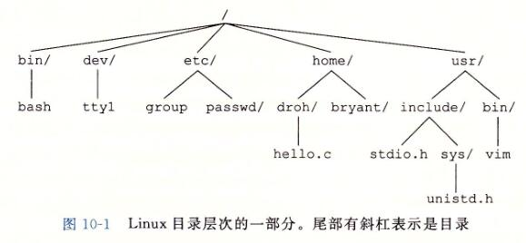
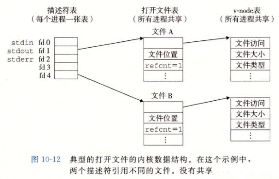
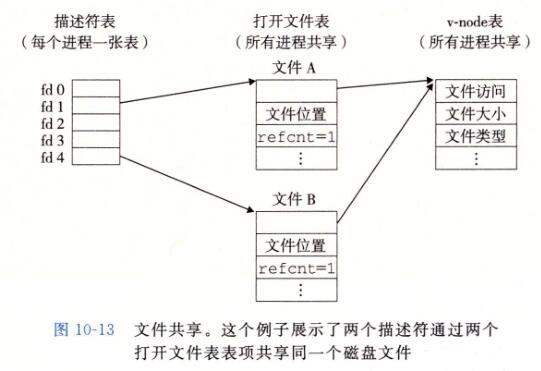
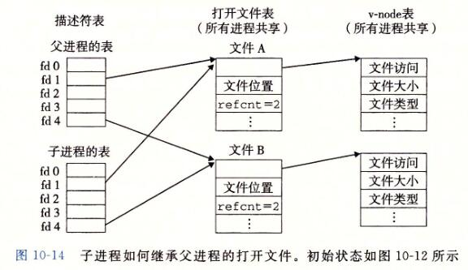
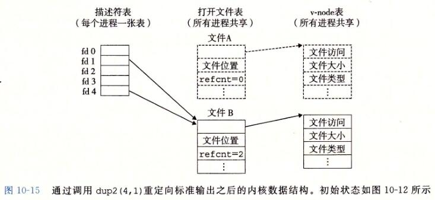
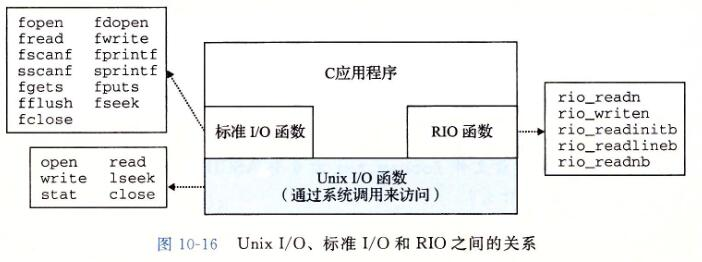

> @Date    : 2020-10-04 15:56:15
>
> @Author  : Lewis Tian (taseikyo@gmail.com)
>
> @Link    : github.com/taseikyo

# 系统级 IO

## Table of Contents

- [10.1 Unix I/O](#101-unix-io)
- [10.2 文件](#102-文件)
- [10.3 打开和关闭文件](#103-打开和关闭文件)
- [10.4 读和写文件](#104-读和写文件)
- [10.5 用 RIO 包健壮地读写](#105-用-rio-包健壮地读写)
	- [10.5.1 RIO 的无缓冲的输入输出函数](#1051-rio-的无缓冲的输入输出函数)
	- [10.5.2 RIO 的带缓冲的输入函数](#1052-rio-的带缓冲的输入函数)
- [10.6 读取文件元数据](#106-读取文件元数据)
- [10.7 读取目录内容](#107-读取目录内容)
- [10.8 共享文件](#108-共享文件)
	- [练习题 10.2](#练习题-102)
	- [练习题 10.3](#练习题-103)
- [10.9 I/O 重定向](#109-io-重定向)
	- [练习题 10.4](#练习题-104)
- [10.10 标准 I/O](#1010-标准-io)
- [10.11 综合：我该使用哪些 I/O 函数？](#1011-综合我该使用哪些-io-函数)
- [10.12 小结](#1012-小结)

I/O 是在主存和外部设备（例如磁盘驱动器、终端和网络）之间复制数据的过程。输入操作是从 I/O 设备复制数据到主存，而输出操作是从主存复制数据到 I/O 设备

所有语言的运行时系统都提供执行 I/O 的较高级别的工具。例如，ANSI C 提供标准 I/O 库，包含像 printf 和 scanf 这样执行带缓冲区的 I/O 函数。C++ 语言用它的重载操作符 `<<`（输入）和 `>>`（输出）提供了类似的功能。在 Linux 系统中，是通过使用由内核提供的系统级 Unix I/O 函数来实现这些较高级别的 I/O 函数的。大多数时候，高级别 I/O 函数工作良好，没有必要直接使用 Unix I/O。那么为什么还要麻烦地学习 Unix I/O 呢？

- 了解 Unix I/O 将帮助你理解其他的系统概念。I/O 是系统操作不可或缺的一部分，因此，我们经常遇到 I/O 和其他系统概念之间的循环依赖。例如，I/O 在进程的创建和执行中扮演着关键的角色。反过来，进程创建又在不同进程间的文件共享中扮演着关键角色。因此，要真正理解 I/O，你必须理解进程，反之亦然。在对存储器层次结构、链接和加载、进程以及虚拟内存的讨论中，我们已经接触了 I/O 的某些方面。既然你对这些概念有了比较好的理解，我们就能闭合这个循环，更加深入地研究 I/O
- 有时你除了使用 Unix I/O 以外别无选择。在某些重要的情况中，使用高级 I/O 函数不太可能，或者不太合适。例如，标准 I/O 库没有提供读取文件元数据的方式，例如文件大小或文件创建时间。另外，I/O 库还存在一些问题，使得用它来进行网络编程非常冒险

## 10.1 Unix I/O

一个 Linux 文件就是一个 m 个字节的序列：$ B_0,B_1,\cdots,B_k,\cdots,B_{m-1} $ 所有的 I/O 设备（例如网络、磁盘和终端）都被模型化为文件，而所有的输入和输出都被当作对相应文件的读和写来执行。这种将设备优雅地映射为文件的方式，允许 Linux 内核引出一个简单、低级的应用接口，称为 Unix I/O，这使得所有的输入和输出都能以一种统一且一致的方式来执行：

- 打开文件。一个应用程序通过要求内核打开相应的文件，来宣告它想要访问一个 I/O 设备。内核返回一个小的非负整数，叫做描述符，它在后续对此文件的所有操作中标识这个文件。内核记录有关这个打开文件的所有信息。应用程序只需记住这个描述符
- Linux shell 创建的每个进程开始时都有三个打开的文件：标准输入（描述符为 0）、标准输出（描述符为 1）和标准错误（描述符为 2）。头文件 `<unistd.h>` 定义了常量 STDIN_FILENO、STDOUT_FILENO 和 STDERR_FILENO，它们可用来代替显式的描述符值
- 改变当前的文件位置。对于每个打开的文件，内核保持着一个文件位置 k（相对于文件开头的偏移），初始为 0，应用可以通过 seek 操作来设置当前位置为 k
- 读写文件。一个读操作就是从文件复制 n 个字节到内存，从当前文件位置 k 开始，然后将 k 增加到 k+n。给定一个大小为 m 字节的文件，当 $ k\geqslant m $ 时执行读操作会触发一个称为 end-of-file（EOF）的条件，应用程序能检测到这个条件。在文件结尾处并没有明确的 "EOF 符号"。类似地，写操作就是从内存复制 n 个字节到一个文件，从当前文件位置 k 开始，然后更新 k
- 关闭文件。当应用完成了对文件的访问之后，它就通知内核关闭这个文件。作为响应，内核释放文件打开时创建的数据结构，并将这个描述符恢复到可用的描述符池中。无论一个进程因为何种原因终止时，内核都会关闭所有打开的文件并释放它们的内存资源

## 10.2 文件

每个 Linux 文件都有一个类型（type）来表明它在系统中的角色：

- 普通文件（regular file）包含任意数据。应用程序常常要区分文本（text file）和二进制（binary file）文件，文本文件是只含有 ASCII 或 Unicode 字符的普通文件；二进制文件是所有其他的文件。对内核而言，文本文件和二进制文件没有区别。Linux 文本文件包含了一个文本行（text line）序列，其中每一行都是一个字符序列，以一个新行符（"\n"）结束。新行符与 ASCII 的换行符（LF）是一样的，其数字值为 0x0a
- 目录（directory）是包含一组链接（link）的文件，其中每个链接都将一个文件名（filename）映射到一个文件，这个文件可能是另一个目录。每个目录至少含有两个条目：是到该目录自身的链接，以及到父目录（parent directory）的链接。你可以用 mkdir 命令创建一个目录，用 ls 查看其内容，用 rmdir 删除该目录
- 套接字（socket）是用来与另一个进程进行跨网络通信的文件（11.4 节）

其他文件类型包含命名通道（named pipe）、 符号链接（symbolic link），以及字符和块设备（character and block device），这些不在本书的讨论范畴

Linux 内核将所有文件都组织成一个目录层次结构（directory hierarchy），系统中的每个文件都是根目录的直接或间接的后代。图 10-1 显示了 Linux 系统的目录层次结构的一部分。



作为其上下文的一部分，每个进程都有一个当前工作目录（current working directory）来确定其在目录层次结构中的当前位置

目录层次结构中的位置用路径名（pathname）来指定。路径名是一个字符串，包括一个可选斜杠，其后紧跟一系列的文件名，文件名之间用斜杠分隔。路径名有两种形式：

- 绝对路径名（absolute pathname）以一个斜杠开始，表示从根节点开始的路径
- 相对路径名（relative pathname）以文件名开始，表示从当前工作目录开始的路径

## 10.3 打开和关闭文件

进程是通过调用 open 函数来打开一个已存在的文件或者创建一个新文件的：

```C
#include <sys/types.h>
#include <sys/stat.h>
#include <fcntl.h>

int open(char *filename, int flags, mode_t mode);

// 返回：若成功则为新文件描述符，若出错为 -1
```

open 函数将 filename 转换为一个文件描述符，并且返回描述符数字。返回的描述符总是在进程中当前没有打开的最小描述符。flags 参数指明了进程打算如何访问这个文件：

- O_RDONLY：只读
- O_WRONLY：只写
- O_RDWR：可读可写

```C
// 只读的方式打开一个已存在的文件
fd = Open("foo.txt", O_RDONLY, 0);
```

flags 参数也可以是一个或者更多位掩码的或，为写提供给一些额外的指示：

- O_CREAT：如果文件不存在，就创建它的一个**截断的**（truncated）（空）文件
- O_TRUNC：如果文件已经存在，就截断（truncate）它
- O_APPEND：在每次写操作前，设置文件位置到文件的结尾处

```C
// 以添加的写方式打开一个已存在文件
fd = Open("foo.txt", O_WRONLY|O_APPEND, 0);
```

mode 参数指定了新文件的访问权限位。这些位的符号名字如图 10-2 所示。

| 掩码 | 描述 |
| :--- | :--- |
| S_IRUSR | 使用者（拥有者）能够读这个文件 |
| S_IWUSR | 使用者（拥有者）能够写这个文件 |
| S_IXUSR | 使用者（拥有者）能够执行这个文件 |
| S_IRGRP | 拥有者所在组的成员能够读这个文件 |
| S_IWGRP | 拥有者所在组的成员能够写这个文件 |
| S_IXGRP | 拥有者所在组的成员能够执行这个文件 |
| S_IROTH | 其他人（任何人）能够读这个文件 |
| S_IWOTH | 其他人（任何人）能够写这个文件 |
| S_IXOTH | 其他人（任何人）能够执行这个文件 |

图 10-2 访问权限位。在 sys/stat.h 中定义

作为上下文的一部分，每个进程都有一个 umask，它是通过调用 umask 函数来设置的。当进程通过带某个 mode 参数的 open 函数调用来创建一个新文件时，文件的访问权限位被设置为 **mode & ~umask**。例如，假设我们给定下面的 mode 和 umask 默认值：

```C
#define DEF_MODE   S_IRUSR|S_IWUSR|S_IRGRP|S_IWGRP|S_IROTH|S_IWOTH
#define DEF_UMASK  S_IWGRP|S_IWOTH
```

接下来，下面的代码片段创建一个新文件，文件的拥有者有读写权限，而所有其他的用户都有读权限：

```C
umask(DEF_UMASK);
fd = Open("foo.txt", O_CREAT|O_TRUNC|O_WRONLY, DEF_MODE);
```

最后，进程通过调用 close 函数关闭一个打开的文件。

```C
#include <unistd.h>

int close(int fd);

// 返回：若成功则为 0，若出错则为 -1
```

## 10.4 读和写文件

应用程序通过调用 read 和 write 函数来执行输入和输出

```C
#include <unistd.h>

ssize_t read(int fd, void *buf, size_t n);
// 返回：若成功则为读的字节数，若 EOF 则为 0，若出错为 -1

ssize_t write(int fd, const void *buf, size_t n);
// 返回：若成功则为写的字节数，若出错则为 -1
```

```C
// code/io/cpstdin.c
#include "csapp.h"

int main(void) {
	char c;

	while (Read(STDIN_FILENO, &c, 1) != 0)
		Write(STDOUT_FILENO, &c, 1);
	exit(0);
}
```

图 10-3 一次一个字节地从标准输入复制到标准输出

通过调用 lseek 函数，应用程序能够显示地修改当前文件的位置，这部分内容不在我们的讲述范围之内。

> ### 旁注：ssize_t 和 size_t 有些什么区别？
>
> 在 x86-64 系统中，size_t 被定义为 unsigned long，而 ssize_t 被定义为 long。read 函数返回一个有符号的大小，是因为出错时它必须返回 -1

在某些情况下，read 和 write 传送的字节比应用程序要求的要少。这些**不足值**（short count）不表示有错误。出现这样情况的原因有：

- 读时遇到 EOF。假设我们准备读一个文件，该文件从当前文件位置开始只含有 20 多个字节，而我们以 50 个字节的片进行读取。这样一来，下一个 read 返回的不足值为 20，此后的 read 将通过返回不足值 0 来发出 EOF 信号
- 从终端读文本行。如果打开文件是与终端相关联的（如键盘和显示器），那么每个 read 函数将一次传送一个文本行，返回的不足值等于文本行的大小
- 读和写网络套接字（socket）。如果打开的文件对应于网络套接字（11.4 节），那么内部缓冲约束和较长的网络延迟会引起 read 和 write 返回不足值。对 Linux 管道（pipe）调用 read 和 write 时，也有可能出现不足值，这种进程间通信机制不在我们讨论的范围之内

实际上，除了 EOF，当你在读磁盘文件时，将不会遇到不足值，而且在写磁盘文件时，也不会遇到不足值。然而，如果你想创建健壮的（可靠的）诸如 Web 服务器这样的网络应用，就必须通过反复调用 read 和 write 处理不足值，直到所有需要的字节都传送完毕

## 10.5 用 RIO 包健壮地读写

RIO（Robust I/O，健壮的 I/O）包，它会自动为你处理上文中所述的不足值。在像网络程序这样容易出现不足值的应用中，RIO 包提供了方便、健壮和高效的 I/O。RIO 提供了两类不同的函数：

- 无缓冲的输入输出函数。这些函数直接在内存和文件之间传送数据，没有应用级缓冲。它们对将二进制数据读写到网络和从网络读写二进制数据尤其有用
- 带缓冲的输入函数。这些函数允许你高效地从文件中读取文本行和二进制数据，这些文件的内容缓存在应用级缓冲区内，类似于为 printf 这样的标准 I/O 函数提供的缓冲区。与【110】中讲述的带缓冲的 I/O 例程不同，带缓冲的 RIO 输入函数是线程安全的（12.7.1 节），它在同一个描述符上可以被交错地调用。例如，你可以从一个描述符中读一些文本行，然后读取一些二进制数据，接着再多读取一些文本行

我们讲述 RIO 例程有两个原因。第一，在接下来的两章中，我们开发的网络应用中使用了它们；第二，通过学习这些例程的代码，你将从总体上对 Unix I/O 有更深入的了解。

### 10.5.1 RIO 的无缓冲的输入输出函数

通过调用 rio_readn 和 rio_writen，应用程序可以在内存和文件之间直接传送数据

```C
#include "csapp.h"

ssize_t rio_readn(int fd, void *usrbuf, size_t n);
ssize_t rio_writen(int fd, void *usrbuf, size_t n);
// 返回：若成功则为传送的字节数，若 EOF 则为 0(只对 rio_readn 而言)，若出错则为 -1
```

rio_readn 函数从描述符 fd 的当前文件位置最多传送 n 个字节到内存位置 usrbuf。类似地，rio_writen 函数从位置 usrbuf 传送 n 个字节到描述符 fd。rio_read 函数在遇到 EOF 时只能返回一个不足值。rio_writen 函数决不会返回不足值。对同一个描述符，可以任意交错地调用 rio_readn 和 rio_writen

注意，如果 rio_readn 和 rio_writen 函数被一个从应用信号处理程序的返回中断，那么每个函数都会手动地重启 read 或 write。为了尽可能有较好的可移植性，我们允许被中断的系统调用，且在必要时重启它们。

```C
// code/src/csapp.c
ssize_t rio_readn(int fd, void *usrbuf, size_t n) {
	size_t nleft = n;
	ssize_t nread;
	char *bufp = usrbuf;

	while (nleft > 0) {
		if ((nread = read(fd, bufp, nleft)) < 0) {
			if (errno == EINTR) /* Interrupted by sig handler return */
				nread = 0;      /* and call read() again */
			else
				return -1;      /* errno set by read() */
		} else if (nread == 0)
			break;              /* EOF */
		nleft -= nread;
		bufp += nread;
	}
	return (n - nleft);         /* Return >= 0 */
}

ssize_t rio_writen(int fd, void *usrbuf, size_t n) {
	size_t nleft = n;
	ssize_t nwritten;
	char *bufp = usrbuf;

	while (nleft > 0) {
		if ((nwritten = write(fd, bufp, nleft)) <= 0) {
			if (errno == EINTR)  /* Interrupted by sig handler return */
				nwritten = 0;    /* and call write() again */
			else
				return -1;       /* errno set by write() */
		}
		nleft -= nwritten;
		bufp += nwritten;
	}
	return n;
}
```

图 10-4 rio_readn 和 rio_writen 函数

### 10.5.2 RIO 的带缓冲的输入函数

假设我们要计算文本文件中文本行的数量，一种方法就是用 read 函数来一次一个字节地从文件传送到用户内存，检查每个字节来查找换行符。这个方法的缺点是效率不是很高，每读取文件中的一个字节都要求陷入内核

一种更好的方法是调用一个包装函数（rio_readlineb），它从一个内部读缓冲区复制一个文本行，当缓冲区变空时，会自动地调用 read 重新填满缓冲区。对于既包含文本行也包含二进制数据的文件（例如 11.5.3 节中描述的 HTTP 响应），我们也提供了一个 rio_readn 带缓冲区的版本，叫做 rio_readnb，它从和 rio_readlineb 一样的读缓冲区中传送原始字节

```C
#include "csapp.h"

void rio_readinitb(rio_t *rp, int fd);
// 返回：无

ssize_t rio_readlineb(rio_t *rp, void *usrbuf, size_t maxlen);
ssize_t rio_readnb(rio_t *rp, void *usrbuf, size_t n);
// 返回：若成功则为读的字节数，若 EOF 则为 0，若出错则为 -1
```

每打开一个描述符，都会调用一次 rio_readinitb 函数。它将描述符 fd 和地址 rp 处的一个类型为 rio_t 的读缓冲区联系起来

rio_readlineb 函数从文件 rp 读出下一个文本行（包括结尾的换行符），将它复制到内存位置 usrbuf，并且用 NULL（零）字符来结束这个文本行。rio_readlineb 函数最多读 **maxlen-1** 个字节，余下的一个字符留给结尾的 NULL 字符。超过 **maxlen-1** 字节的文本行被截断，并用一个 NULL 字符结束。

rio_readnb 函数从文件 rp 最多读 n 个字节到内存位置 usrbuf。对同一描述符，对 rio_readlineb 和 rio_readnb 的调用可以任意交叉进行。然而，对这些带缓冲的函数的调用却不应和无缓冲的 rio_readn 函数交叉使用

图 10-5 展示了如何使用 RIO 函数来一次一行地从标准输入复制一个文本文件到标准输出

```C
// code/io/cpfile.c
#include "csapp.h"

int main(int argc, char **argv) {
	int n;
	rio_t rio;
	char buf[MAXLINE];

	Rio_readinitb(&rio, STDIN_FILENO);
	while ((n = Rio_readlineb(&rio, buf, MAXLINE)) != 0)
		Rio_writen(STDOUT_FILENO, buf, n);
}
```

图 10-5 从标准输入复制一个文本文件到标准输出

图 10-6 展示了一个读缓冲区的格式，以及初始化它的 rio_readinitb 函数的代码。rio_readinitb 函数创建了一个空的读缓冲区，并且将一个打开的文件描述符和这个缓冲区联系起来。

```C
// code/include/csapp.h
#define RIO_BUFSIZE 8192
typedef struct {
	int rio_fd;                /* Descriptor for this internal buf */
	int rio_cnt;               /* Unread bytes in internal buf */
	char *rio_bufptr;          /* Next unread byte in internal buf */
	char rio_buf[RIO_BUFSIZE]; /* Internal buffer */
} rio_t;

// code/src/csapp.c
void rio_readinitb(rio_t *rp, int fd) {
	rp->rio_fd = fd;
	rp->rio_cnt = 0;
	rp->rio_bufptr = rp->rio_buf;
}
```

图 10-6 一个类型为 rio_t 的读缓冲区和初始化它的 rio_readinitb 函数

RIO 读程序的核心是图 10-7 所示的 rio_read 函数。rio_read 函数是 Linuxread 函数的带缓冲的版本。当调用 rio_read 要求读 n 个字节时，读缓冲区内有 `rp->rio_cnt` 个未读字节。如果缓冲区为空，那么会通过调用 read 再填满它。这个 read 调用收到一个不足值并不是错误，只不过读缓冲区是填充了一部分。一旦缓冲区非空，rio_read 就从读缓冲区复制 n 和 `rp->rio_cnt` 中较小值个字节到用户缓冲区，并返回复制的字节数

```C
// code/src/csapp.c
static ssize_t rio_read(rio_t *rp, char *usrbuf, size_t n) {
	int cnt;

	while (rp->rio_cnt <= 0) {  /* Refill if buf is empty */
		rp->rio_cnt = read(rp->rio_fd, rp->rio_buf,
		                   sizeof(rp->rio_buf));
		if (rp->rio_cnt < 0) {
			if (errno != EINTR) /* Interrupted by sig handler return */
				return -1;
		} else if (rp->rio_cnt == 0) /* EOF */
			return 0;
		else
			rp->rio_bufptr = rp->rio_buf; /* Reset buffer ptr */
	}

	/* Copy min(n, rp->rio_cnt) bytes from internal buf to user buf */
	cnt = n;
	if (rp->rio_cnt < n)
		cnt = rp->rio_cnt;
	memcpy(usrbuf, rp->rio_bufptr, cnt);
	rp->rio_bufptr += cnt;
	rp->rio_cnt -= cnt;
	return cnt;
}
```

图 10-7 内部的 rio_read 函数

对于一个应用程序，rio_read 函数和 Linux read 函数有同样的语义。在出错时，它返回值 -1，并且适当地设置 errno。在 EOF 时，它返回值 0。如果要求的字节数超过了读缓冲区内未读的字节的数量，它会返回一个不足值。两个函数的相似性使得很容易通过用 rio_read 代替 read 来创建不同类型的带缓冲的读函数。例如，用 rio_read 代替 read，图 10-8 中的 rio_readnb 函数和 rio_readn 有相同的结构。相似地，图 10-8 中的 rio_readlineb 程序最多调用 `maxlen-1` 次 rio_read。每次调用都从读缓冲区返回一个字正然后检查这个字节是否是结尾的换行符

```C
// code/src/csapp.c
ssize_t rio_readlineb(rio_t *rp, void *usrbuf, size_t maxlen) {
	int n, rc;
	char c, *bufp = usrbuf;

	for (n = 1; n < maxlen; n++) {
		if ((rc = rio_read(rp, &c, 1)) == 1) {
			*bufp++ = c;
			if (c == '\n') {
				n++;
				break;
			}
		} else if (rc == 0) {
			if (n == 1)
				return 0; /* EOF, no data read */
			else
				break;    /* EOF, some data was read */
		} else
			return -1;    /* Error */
	}
	*bufp = 0;
	return n - 1;
}

ssize_t rio_readnb(rio_t *rp, void *usrbuf, size_t n) {
	size_t nleft = n;
	ssize_t nread;
	char *bufp = usrbuf;

	while (nleft > 0) {
		if ((nread = rio_read(rp, bufp, nleft)) < 0)
			return -1;          /* errno set by read() */
		else if (nread == 0)
			break;              /* EOF */
		nleft -= nread;
		bufp += nread;
	}
	return (n - nleft);         /* Return >= 0 */
}
```

图 10-8 rio_readlineb 和 rio_readnb 函数


> ### 旁注：RIO 包的起源
>
> RIO 函数的灵感来自于 W. Richard Stevens 在他的经典网络编程作品【110】中描述的 readLine、readn 和 writen 函数。rio_readn 和 rio_writen 函数与 Stevens 的 readn 和 writen 函数是一样的。然而，Stevens 的 readline 函数有一些局限性在 RI0 中得到了纠正。第一，因为 readline 是带缓冲的，而 readn 不带，所以这两个函数不能在同一描述符上一起使用。第二，因为它使用一个 static 缓冲区，Stevens 的 readline 函数不是线程安全的，这就要求 Stevens 引入一个不同的线程安全的版本，称为 read-line_ro 我们已经在 rio_readlineb 和 rio_readnb 函数中修改了这两个缺陷，使得这两个函数是相互兼容和线程安全的。

## 10.6 读取文件元数据

应用程序能够通过调用 stat 和 fstat 函数，检索到关于文件的信息（有时也称为文件的**元数据**（metadata））

```C
#include <unistd.h>
#include <sys/stat.h>

int stat(const char *filename, struct stat *buf);
int fstat(int fd, struct stat *buf);

// 返回：若成功则为 0，若出错则为 -1
```

stat 函数以一个文件名作为输入，并填写如图 10-9 所示的一个 stat 数据结构中的各个成员。fstat 函数是相似的，只不过是以文件描述符而不是文件名作为输入。当我们在 11.5 节中讨论 Web 服务器时，会需要 stat 数据结构中的 st_mode 和 st_size 成员，其他成员则不在我们的讨论之列

```C
// statbuf.h (included by sys/stat.h)
/* Metadata returned by the stat and fstat functions */
struct stat {
    dev_t         st_dev;      /* Device */
    ino_t         st_ino;      /* inode */
    mode_t        st_mode;     /* Protection and file type */
    nlink_t       st_nlink;    /* Number of hard links */
    uid_t         st_uid;      /* User ID of owner */
    gid_t         st_gid;      /* Group ID of owner */
    dev_t         st_rdev;     /* Device type (if inode device) */
    off_t         st_size;     /* Total size, in bytes */
    unsigned long st_blksize;  /* Block size for filesystem I/O */
    unsigned long st_blocks;   /* Number of blocks allocated */
    time_t        st_atime;    /* Time of last access */
    time_t        st_mtime;    /* Time of last modification */
    time_t        st_ctime;    /* Time of last change */
};
```

图 10-9 stat 数据结构

st_size 成员包含了文件的字节数大小。st_mode 成员则编码了文件访问许可位（图 10-2）和文件类型（10.2 节）。Linux 在 sys/stat.h 中定义了宏谓词来确定 st_mode 成员的文件类型：

- S_ISREG(m)。这是一个普通文件吗？
- S_ISDIR(m)。这是一个目录文件吗？
- S_ISSOCK(m)。这是一个网络套接字吗？

图 10-10 展示了我们会如何使用这些宏和 stat 函数来读取和解释一个文件的 st_mode 位

```C
// code/io/statcheck.c
#include "csapp.h"

int main (int argc, char **argv) {
	struct stat stat;
	char *type, *readok;

	Stat(argv[1], &stat);
	if (S_ISREG(stat.st_mode))     /* Determine file type */
		type = "regular";
	else if (S_ISDIR(stat.st_mode))
		type = "directory";
	else
		type = "other";
	if ((stat.st_mode & S_IRUSR))  /* Check read access */
		readok = "yes";
	else
		readok = "no";

	printf("type: %s, read: %s\n", type, readok);
	exit(0);
}
```

图 10-10 查询和处理一个文件的 st_mode 位

## 10.7 读取目录内容

应用程序可以用 readdir 系列函数来读取目录的内容。

```C
#include <sys/types.h>
#include <dirent.h>

DIR *opendir(const char *name);

// 返回：若成功，则为处理的指针；若出错，则为 NULL
```

函数 opendir 以路径名为参数，返回指向**目录流**（directory stream）的指针。流是对条目有序列表的抽象，在这里是指目录项的列表

```C
#include <dirent.h>

struct dirent *readdir(DIR *dirp);

// 返回：若成功，则为指向下一个目录项的指针；
//      若没有更多的目录项或出错，则为 NULL
```

每次对 readdir 的调用返回的都是指向流 dirp 中下一个目录项的指针，或者，如果没有更多目录项则返回 NULL。每个目录项都是一个结构，其形式如下：

```C
struct dirent {
    ino_t d_ino;      /* inode number */
    char d_name[256]; /* Filename */
};
```

虽然有些 Linux 版本包含了其他的结构成员，但是只有这两个对所有系统来说都是标准的。成员 d_name 是文件名，d_ino 是文件位置

如果出错，则 readdir 返回 NULL，并设置 errno。可惜的是，唯一能区分错误和流结束情况的方法是检査自调用 readdir 以来 errno 是否被修改过

```C
#include <dirent.h>

int closedir(DIR *dirp);

// 返回：成功为 0；错误为 -1
```

函数 closedir 关闭流并释放其所有的资源。图 10-11 展示了怎样用 readdir 来读取目录的内容

```C
// code/io/readdir.c
#include "csapp.h"

int main(int argc, char **argv) {
	DIR *streamp;
	struct dirent *dep;

	streamp = Opendir(argv[1]);

	errno = 0;
	while ((dep = readdir(streamp)) != NULL) {
		printf("Found file: %s\n", dep->d_name);
	}
	if (errno != 0)
		unix_error("readdir error");

	Closedir(streamp);
	exit(0);
}
```

图 10-11 读取目录的内容

## 10.8 共享文件

可以用许多不同的方式来共享 Linux 文件。除非你很清楚内核是如何表示打开的文件，否则文件共享的概念相当难懂。内核用三个相关的数据结构来表示打开的文件：

- 描述符表（descriptor table）。每个进程都有它独立的描述符表，它的表项是由进程打开的文件描述符来索引的。每个打开的描述符表项指向文件表中的一个表项
- 文件表（file table）。打开文件的集合是由一张文件表来表示的，所有的进程共享这张表。每个文件表的表项组成（针对我们的目的）包括当前的文件位置、引用计数（reference count）（即当前指向该表项的描述符表项数），以及一个指向 v-node 表中对应表项的指针。关闭一个描述符会减少相应的文件表表项中的引用计数。内核不会删除这个文件表表项，直到它的引用计数为零
- v-node 表（v-node table）。同文件表一样，所有的进程共享这张 v-node 表。每个表项包含 stat 结构中的大多数信息，包括 st_mode 和 st_size 成员

图 10-12 展示了一个示例，其中描述符 1 和 4 通过不同的打开文件表表项来引用两个不同的文件。这是一种典型的情况，没有共享文件，并且每个描述符对应一个不同的文件



如图 10-13 所示，多个描述符也可以通过不同的文件表表项来引用同一个文件。例如，如果以同一个 filename 调用 open 函数两次，就会发生这种情况。关键思想是每个描述符都有它自己的文件位置，所以对不同描述符的读操作可以从文件的不同位置获取数据



图 10-13 文件共享。这个例子展示了两个描述符通过两个打开文件表表项共享同一个磁盘文件

我们也能理解父子进程是如何共享文件的。假设在调用 fork 之前，父进程有如图 10-12 所示的打开文件。然后，图 10-14 展示了调用 fork 后的情况。子进程有一个父进程描述符表的副本。父子进程共享相同的打开文件表集合，因此共享相同的文件位置。一个很重要的结果就是，在内核删除相应文件表表项之前，父子进程必须都关闭了它们的描述符。



### 练习题 10.2



假设磁盘文件 foobar.txt 由 6 个 ASCII 码字符 “foobar” 组成。那么，下列程序的输出是什么？

```C
#include "csapp.h"

int main() {
	int fd1, fd2;
	char c;

	fd1 = Open("foobar.txt", O_RDONLY, 0);
	fd2 = Open("foobar.txt", O_RDONLY, 0);
	Read(fd1, &c, 1);
	Read(fd2, &c, 1);
	printf("c = %c\n", c);
	exit(0);
}
```

答案：描述符 fd1 和 fd2 都有各自的打开文件表表项，所以每个描述符对于 foobar.txt 都有它自己的文件位置。因此，从 fd2 的读操作会读取 foobar.txt 的第一个字节，并输出 **c = f** 而不是像你开始可能想的 **c = o**

### 练习题 10.3

就像前面那样，假设磁盘文件 foobar.txt 由 6 个 ASCII 码字符 “foobar” 那么下列程序的输出是什么？

```C
#include "csapp.h"

int main() {
	int fd;
	char c;

	fd = Open("foobar.txt", O_RDONLY, 0);
	if (Fork() == 0) {
		Read(fd, &c, 1);
		exit(0);
	}
	Wait(NULL);
	Read(fd, &c, 1);
	printf("c = %c\n", c);
	exit(0);
}
```

答案：回想一下，子进程会继承父进程的描述符表，以及所有进程共享的同一个打开文件表。因此，描述符 fd 在父子进程中都指向同一个打开文件表表项。当子进程读取文件的第一个字节时，文件位置加 1。因此，父进程会读取第二个字节，而输出就是 **c = o**

## 10.9 I/O 重定向

Linux shell 提供了 I/O 重定向操作符，允许用户将磁盘文件和标准输入输出联系起来

```bash
ls > foo.txt
```

使得 shell 加载和执行 ls 程序，将标准输出重定向到磁盘文件 foo.txto 就如我们将在 11.5 节中看到的那样，当一个 Web 服务器代表客户端运行 CGI 程序时，它就执行一种相似类型的重定向。那么 I/O 重定向是如何工作的呢？一种方式是使用 dup2 函数。

```C
#include <unistd.h>

int dup2(int oldfd, int newfd);

// 返回：若成功则为非负的描述符，若出错则为 -1
```

dup2 函数复制描述符表表项 oldfd 到描述符表表项 newfd，覆盖描述符表表项 newfd 以前的内容。如果 newfd 已经打开了，dup2 会在复制 oldfd 之前关闭 newfd

假设在调用 dup2(4,1) 之前，我们的状态如图 10-12 所示，其中描述符 1（标准输出）对应于文件 A（比如一个终端），描述符 4 对应于文件 B（比如一个磁盘文件）。A 和 B 的引用计数都等于 1。图 10-15 显示了调用 dup2(4,1) 之后的情况。两个描述符现在都指向文件 B；文件 A 已经被关闭了，并且它的文件表和 v-node 表表项也已经被删除了；文件 B 的引用计数已经增加了。从此以后，任何写到标准输出的数据都被重定向到文件 B



图 10-15 通过调用 dup2(4,1) 重定向标准输出之后的内核数据结构。初始状态如图 10-12 所示

> ### 旁注：左边和右边的 hoinkies
>
> 为了避免和其他括号类型操作符比如 “]” 和 “[” 相混淆，我们总是将 shell 的 “>” 操作符称为 “右 hoinky”，而将 “<” 操作符称为 “左 hoinky"

### 练习题 10.4

如何用 dup2 将标准输入重定向到描述符 5？

答案：重定向标准输入（描述符 0）到描述符 5，我们将调用 dup2(5, 0) 或者等价的 dup2(5, STDIN_FILENO)

## 10.10 标准 I/O

C 语言定义了一组高级输入输出函数，称为标准 I/O 库，为程序员提供了 Unix I/O 的较高级别的替代。这个库（libc）提供了打开和关闭文件的函数（fopen 和 fclose）、读和写字节的函数（fread 和 fwrite）、读和写字符串的函数（fgets 和 fputs），以及复杂的格式化的 I/O 函数（scanf 和 printf）

标准 I/O 库将一个打开的文件模型化为一个流。对于程序员而言，一个流就是一个指向 FILE 类型的结构的指针。每个 ANSI C 程序开始时都有三个打开的流 stdin、stdout 和 stderr，分别对应于标准输入、标准输出和标准错误：

```C
#include <stdio.h>
extern FILE *stdin;    /* Standard input (descriptor 0) */
extern FILE *stdout;   /* Standard output (descriptor 1) */
extern FILE *stderr;   /* Standard error (descriptor 2) */
```

类型为 FILE 的流是对文件描述符和流缓冲区的抽象。流缓冲区的目的和 RIO 读缓冲区的一样：就是使开销较高的 Linux I/O 系统调用的数量尽可能得小。例如，假设我们有一个程序，它反复调用标准 I/O 的 getc 函数，每次调用返回文件的下一个字符。当第一次调用 getc 时，库通过调用一次 read 函数来填充流缓冲区，然后将缓冲区中的第一个字节返回给应用程序。只要缓冲区中还有未读的字节，接下来对 getc 的调用就能直接从流缓冲区得到服务

## 10.11 综合：我该使用哪些 I/O 函数？



Unix I/O 模型是在操作系统内核中实现的。应用程序可以通过诸如 open、close、lseek、read、write 和 stat 这样的函数来访问 UnixI/O。较高级别的 RIO 和标准 I/O 函数都是基于（使用）Unix I/O 函数来实现的。RIO 函数是专为本书开发的 read 和 write 的健壮的包装函数。它们自动处理不足值，并且为读文本行提供一种高效的带缓冲的方法。标准 I/O 函数提供了 Unix I/O 函数的一个更加完整的带缓冲的替代品，包括格式化的 I/O 例程，如 printf 和 scanf

那么，在你的程序中该使用这些函数中的哪一个呢？下面是一些基本的指导原则：

- G1：只要有可能就使用标准 I/O。对磁盘和终端设备 I/O 来说，标准 I/O 函数是首选方法。大多数 C 程序员在其整个职业生涯中只使用标准 I/O，从不受较低级的 Unix I/O 函数的困扰（可能 stat 除外，因为在标准 I/O 库中没有与它对应的函数）
- G2：不要使用 scanf 或 rio_readlineb 来读二进制文件。像 scanf 或 rio_read-lineb 这样的函数是专门设计来读取文本文件的。学生通常会犯的一个错误就是用这些函数来读取二进制文件，这就使得他们的程序出现了诡异莫测的失败。比如，二进制文件可能散布着很多 Oxa 字节，而这些字节又与终止文本行无关
- G3：对网络套接字的 I/O 使用 RIO 函数。不幸的是，当我们试着将标准 I/O 用于网络的输入输出时，出现了一些令人讨厌的问题。如同我们将在 11.4 节所见，Linux 对网络的抽象是一种称为套接字的文件类型。就像所有的 Linux 文件一样，套接字由文件描述符来引用，在这种情况下称为套接字描述符。应用程序进程通过读写套接字描述符来与运行在其他计算机的进程实现通信

标准 I/O 流，从某种意义上而言是**全双工**的，因为程序能够在同一个流上执行输入和输出。然而，对流的限制和对套接字的限制，有时候会互相冲突，而又极少有文档描述这些现象：

- 限制 1：跟在输出函数之后的输入函数。如果中间没有插入对 fflush、fseek、fsetpos 或者 rewind 的调用，一个输入函数不能跟随在一个输出函数之后。fflush 函数清空与流相关的缓冲区。后三个函数使用 Unix I/O lseek 函数来重置当前的文件位置
- 限制 2：跟在输入函数之后的输出函数。如果中间没有插入对 fseek、fsetpos 或者 rewind 的调用，一个输出函数不能跟随在一个输入函数之后，除非该输入函数遇到了一个文件结束

这些限制给网络应用带来了一个问题，因为对套接字使用 lseek 函数是非法的。对流 I/O 的第一个限制能够通过采用在每个输入操作前刷新缓冲区这样的规则来满足。然而，要满足第二个限制的唯一办法是，对同一个打开的套接字描述符打开两个流，一个用来读，一个用来写：

```C
FILE *fpin, *fpout;

fpin = fdopen(sockfd, "r");
fpout = fdopen(sockfd, "w");
```

但是这种方法也有问题，因为它要求应用程序在两个流上都要调用 fclose，这样才能释放与每个流相关联的内存资源，避免内存泄漏：

```C
fclose(fpin);
fclose(fpout);
```

这些操作中的每一个都试图关闭同一个底层的套接字描述符，所以第二个 close 操作就会失败。对顺序的程序来说，这并不是问题，但是在一个线程化的程序中关闭一个已经关闭了的描述符是会导致灾难的（见 12.7.4 节）

因此，我们建议你在网络套接字上不要使用标准 I/O 函数来进行输入和输出，而要使用健壮的 RIO 函数。如果你需要格式化的输出，使用 sprintf 函数在内存中格式化一个字符串，然后用 rio_writen 把它发送到套接口。如果你需要格式化输入，使用 rio_readlineb 来读一个完整的文本行，然后用 sscanf 从文本行提取不同的字段

## 10.12 小结

Linux 提供了少量的基于 Unix I/O 模型的系统级函数，它们允许应用程序打开、关闭、读和写文件，提取文件的元数据，以及执行 I/O 重定向。Linux 的读和写操作会出现不足值，应用程序必须能正确地预计和处理这种情况。应用程序不应直接调用 Unix I/O 函数，而应该使用 RIO 包，RIO 包通过反复执行读写操作，直到传送完所有的请求数据，自动处理不足值

Linux 内核使用三个相关的数据结构来表示打开的文件。描述符表中的表项指向打开文件表中的表项，而打开文件表中的表项又指向 v-node 表中的表项。每个进程都有它自己单独的描述符表，而所有的进程共享同一个打开文件表和 v-node 表。理解这些结构的一般组成就能使我们清楚地理解文件共享和 I/O 重定向

标准 I/O 库是基于 Unix I/O 实现的，并提供了一组强大的高级 I/O 例程。对于大多数应用程序而言，标准 I/O 更简单，是优于 Unix I/O 的选择。然而，因为对标准 I/O 和网络文件的一些相互不兼容的限制，Unix I/O 比之标准 I/O 更该适用于网络应用程序
