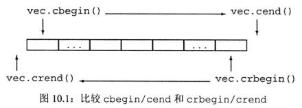
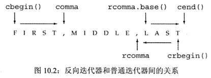

# 10. Generic Algorithms

标准库并未给每个容器都定义成员函数来实现这些操作，而是定义了一组泛型算法（generic algorithm）：称它们为 “算法”，是因为它们实现了一些经典算法的公共接口，如排序和搜索；称它们是 “泛型的”，是因为它们可以用于不同类型的元素和多种容器类型（不仅包括标准库类型，如 vector 或 list，还包括内置的数组类型），以及我们将看到的，还能用于其他类型的序列。

大多数算法都定义在 algorithm 头文件中，标准库还在头文件 numeric 中定义了一组数组泛型算法。

```c++
int val = 42;
auto result = find(v.cbegin(), v.cend(), val);
cout << "The value " << val
	 << (result == v.end() ? " is not present": " is present") << endl;

int ia[] = {27, 210, 12, 47, 109, 83};
int val = 83;
int *result = find(begin(ia), end(ia), val);
```

### 算法永远不会执行容器的操作

泛型算法本身不会执行容器的操作，它们只会运行于迭代器之上，执行迭代器的操作。泛型算法运行于迭代器之上而不会执行容器操作的特性带来了一个令人惊讶但非常必要的编程假定：算法永远不会改变底层容器的大小。算法可能改变容器中保存的元素的值，也可能在容器内移动元素，但永远不会直接添加或删除元素。

```c++
// 对 vec 中的元素求和，和的初值是 0
int sum = accumulate(vec.cbegin(), vec.cend(), 0);
```

这条语句将 sum 设置为 vec 中元素的和，和的初值被设置为 0。

**accumulate 的第三个参数的类型决定了函数中使用哪个加法运算符以及返回值的类型**

由于 string 定义了 + 运算符，所以我们可以通过调用 accumulate 来将 vector 中所有 string 元素连接起来：

```c++
string sum=accumulate(v.cbegin()，v.cend()，string(""));
// 错误：const char* 上没有定义 + 运算符
string sum = accumulate(v.cbegin(),v.cend(),"");
```

```c++
// roster2 中的元素数目应该至少与 roster1 一样多
equal(roster1.cbegin(), rosterl.cend(), roster2.cbegin());
```

**算法不会执行容器操作，因此它们自身不可能改变容器的大小**

一些算法会自己向输入范围写入元素。这些算法本质上并不危险，它们最多写入与给定序列一样多的元素。

例如，算法 fill 接受一对迭代器表示一个范围，还接受一个值作为第三个参数。fill 将给定的这个值赋予输入序列中的每个元素。

```c++
fill(vec.begin(), vec.end(), 0);// 将每个元素重置为 0
// 将容器的一个子序列设置为 10
fill(vec.begin(), vec.begin()+vec.size()/2, 10);
```

由于 fill 向给定输入序列中写入数据，因此，只要我们传递了一个有效的输入序列，写入操作就是安全的。

算法不检查写操作，如果向空容器写的话将会导致错误；

### 介绍 back_inserter

一种保证算法有足够元素空间来容纳输出数据的方法是使用插入迭代器（insert iterator）。插入迭代器是一种向容器中添加元素的迭代器。当我们通过一个插入迭代器赋值时，一个与赋值号右侧值相等的元素被添加到容器中。
我们将在 10.4.1 节中详细介绍插入迭代器的内容。但是，为了展示如何用算法向容器写入数据，我们现在将使用 back_inserter，它是定义在头文件 iterator 中的一个函数。

back_inserter 接受一个指向容器的引用，返回一个与该容器绑定的插入迭代器。当我们通过此迭代器赋值时，赋值运算符会调用 push_back 将一个具有给定值的元素添加到容器中：

```c++
vector<int>vec; // 空向量
auto it = back_inserter(vec);// 通过它赋值会将元素添加到 vec 中
*it = 42;//vec 中现在有一个元素，值为 42
```

我们常常使用 back_inserter 來创建一个迭代器，作为算法的目的位置来使用。例如：

```c++
vector<int>vec;// 空向量
// 正确：backinserter 创建一个插入选代器，可用来向 vec 添加元素
fill_n(back_inserter(vec), 10, 0); // 添加 10 个元素到 vec 
```

在每步迭代中，fill_n 向给定序列的一个元素赋值。由于我们传递的参数是 back_inserter 返回的迭代器，因此每次赋值都会在 vec 上调用 push_back。最终，这条 fill_n 调用语句向 vec 的末尾添加了 10 个元素，每个元素的值都是 0


### 拷贝算法

拷贝（copy）算法是另一个向目的位置迭代器指向的输出序列中的元素写入数据的算法。

此算法接受三个迭代器，前两个表示一个输入范围，第三个表示目的序列的起始位置。

```c++
int a1[] = {0,1,2,3,4,5,6,7,8,9};
int a2[sizeof(*a1)]; // a2 与 a1 大小一样
// ret 指向拷贝到 a2 的为元素之后的位置
auto ret = copy(begin(a1), end(a1), a2);
```

copy 返回的是目的位置迭代器（递增后）的值，即 ret 恰好指向拷贝到 a2 的尾元素之后的位置

```c++
// 将值为 0 的元素改为 42
replace(v.begin(), v.end(), 0, 42);
// 调用后 v 并未改变，iv 包含 v 的一份拷贝，不过是将原来的 0 改为 42 了
relpace_copy(v.cbegin(), v.cend(), back_inserter(iv), 0, 42);
```

### 消除重复单词

为了消除重复单词，首先将 vector 排序，使得重复的单词都相邻出现。一旦 vector 排序完毕，我们可以使用 unique 标准库算法重排 vector，使得不重复的元素出现在 vector 的开始部分。

```c++
void elimDups(vector<string> &words) {
	sort(words.begin(), words.end());
	// unique 重排输入范围，使得每个单词出现一次
	// 排列在范围的前部，返回指向不重复区域之后一个位置的迭代器
	auto end_unique = unique(words.begin(), words.end());
	words.erase(end_unique, words.end());
}
```

**标准库算法对迭代器而不是容器进行操作，因此算法不能（直接）添加或者删除元素**

### lambda 表达式

我们可以向一个算法传递任何类别的可调用对象（callable object）。对于一个对象或一个表达式，如果可以对其使用调用运算符，则称它为可调用的。即，如果 e 是一个可调用的表达式，则我们可以编写代码 e（args），其中 args 是一个逗号分隔的一个或多个参数的列表。

到目前为止，我们使用过的仅有的两种可调用对象是函数和函数指针。还有其他两种可调用对象：重载了函数调用运算符的类，我们将在 14.8 节介绍，以及 lambda 表达式（lambda expression）。

`[capture list](parameter list) -> return type {function body}`

其中，capture list（捕获列表）是一个 lambda 所在函数中定义的局部变量的列表（通常为空）；return type、parameter list 和 function body 与任何普通函数一样，分别表示返回类型、参数列表和函数体。但是，与普通函数不同，lambda 必须使用尾置返回（参见 6.3.3 节）来指定返回类型。

**一个 lambda 只有在其捕获列表中捕获一个它所在函数中的局部变量，才能在函数体中使用该变量**

**捕获列表只用于局部非 static 变量，lambda 可以直接使用局部 static 变量和它所在函数之外声明的名字**

### lambda 的捕获和返回

当定义一个 lambda 时，编译器生成一个与 lambda 对应的新的（未命名的）类类型。当向一个函数传递一个 lambda 时，同时定义了一个新类型和该类型的一个对象：传递的参数就是此编译器生成的类类型的未命名对象。类似的，当使用 auto 定义一个用 lambda 初始化的变量时，定义了一个从 lambda 生成的类型的对象。

默认情况下，从 lambda 生成的类都包含一个对应该 lambda 所捕获的变量的数据成员。类似任何普通类的数据成员，lambda 的数据成员也在 lambda 对象创建时被初始化。

1. 值捕获

类似参数传递，变量的捕获方式也可以是值或引用。与传值参数类似，采用值捕获的前提是变量可以拷贝。与参数不同，被捕获的变量的值是在 lambda 创建时拷贝，而不是调用时拷贝：

```c++
void fcn1() {
	sizet v1 = 42; //局部变量
	// 将 v1 拷贝到名为 f 的可调用对象
	auto f = [v1] {return v1;};
	v1 = 0;
	auto j = f();// j 为42;f保存了我们创建它时v1的拷贝
}
```

2. 引用捕获

```c++
void fcn2() {
	size_t v1 = 42; //局部变量
	// 对象f2包含v1的引用
	auto f2 = [&v1] {return v1;};
	v1 = 0;
	auto j = f2(); //j为0;f2保存v1的引用,而非拷贝
}
```

引用捕获与返回引用有着相同的问题和限制。**如果我们采用引用方式捕获一个变量，就必须确保被引用的对象在 lambda 执行的时候是存在的。**

lambda 捕获的都是局部变量，这些变量在函数结束后就不复存在了。如果 lambda 可能在函数结束后执行，捕获的引用指向的局部变量已经消失。

引用捕获有时是必要的。例如，我们可能希望 biggies 函数接受一个 ostream 的引用，用来输出数据，并接受一个字符作为分隔符：

```c++
void biggies(vector<string>&words,
             vector<string>::size type sz,
             ostream &os = cout, charc = '') {
	// 与之前例子一样的重排 words 的代码
	// 打印 count 的语句改为打印到 os
	for_each(words.begin(), words.end(),
	[&os, c](const string & s) {os << s << c;});
}
```

我们不能拷贝 ostream 对象，因此捕获 os 的唯一方法就是捕获其引用（或指向 os 的指针）。

当我们向一个函数传递一个 lambda 时，就像本例中调用 for_each 那样，lambda 会立即执行。在此情况下，以引用方式捕获 os 没有问题，因为当 for_each 执行时，biggies 中的变量是存在的。

我们也可以从一个函数返回 lambda。函数可以直接返回一个可调用对象，或者返回一个类对象，该类含有可调用对象的数据成员。如果函数返回一个 lambda，则与函数不能返回一个局部变量的引用类似，此 lambda 也不能包含引用捕获。

### 建议：尽量保持 lambda 的变量捕获简单化

一个 lambda 捕获从 lambda 被创建（即，定义 lambda 的代码执行时）到 lambda 自身执行（可能有多次执行）这段时间内保存的相关信息。确保 lambda 每次执行的时候这些信息都有预期的意义，是程序员的责任。

捕获一个普通变量，如 int、string 或其他非指针类型，通常可以采用简单的值捕获方式。在此情况下，只需关注变量在捕获时是否有我们所需的值就可以了。

如果我们捕获一个指针或迭代器，或采用引用捕获方式，就必须确保在 lambda 执行时，绑定到迭代器、指针或引用的对象仍然存在。而且，需要保证对象具有预期的值。在 lambda 从创建到它执行的这段时间内，可能有代码改变绑定的对象的值。也就是说，在指针（或引用）被捕获的时刻，绑定的对象的值是我们所期望的，但在 lambda 执行时，该对象的值可能已经完全不同了。

一般来说，我们应该尽量减少捕获的数据量，来避免潜在的捕获导致的问题。而且，如果可能的话，应该避免捕获指针或引用。

3. 隐式捕获

除了显式列出我们希望使用的来自所在函数的变量之外，还可以让编译器根据 lambda 体中的代码来推断我们要使用哪些变量。为了指示编译器推断捕获列表，应在捕获列表中写一个 & 或 =。& 告诉编译器采用捕获引用方式，= 则表示采用值捕获方式。例如，我们可以重写传递给 find_if 的 lambda：

```c++
//sz为隐式捕获,值捕获方式
wc = find_if(words.begin(), words.end(),
             [=](const string & s)
				{return s.size() >= sz;});
```

如果我们希望对一部分变量采用值捕获，对其他变量采用引用捕获，可以混合使用隐式捕获和显式捕获：

```c++
void biggiest(vector<string> &words,
              vector<string>::size_type sz, ostream&os = cout, charc = '') {
	//其他处理与前例一样
	//os隐式捕获,引用捕获方式;c显式捕获,值捕获方式
	for_each(words.begin(), words.end(), [&, c](const string & s) {os << s << c;});
	//os显式捕获,引用捕获方式;c隐式捕获,值捕获方式
	for_each(words.begin(), words.end(), [=, &os](const string & s) {os << s << c;});
}
```

当我们混合使用隐式捕获和显式捕获时，捕获列表中的第一个元素必须是一个 & 或 =。此符号指定了默认捕获方式为引用或值。

当混合使用隐式捕获和显式捕获时，显式捕获的变量必须使用与隐式捕获不同的方式。即，如果隐式捕获是引用方式（使用了），则显式捕获命名变量必须采用值方式，因此不能在其名字前使用 &。类似的，如果隐式捕获采用的是值方式（使用了 =），则显式捕获命名变量必须采用引用方式，即，在名字前使用 &。

### lambda 捕获列表

`[]` 空捕获列表。lambda 不能使用所在函数中的变量。一个 lambda 只有捕获变量后才能使用它们

`[names]` names 是一个逗号分隔的名字列表，这些名字都是 lambda 所在函数的局部变量。默认情况下，捕获列表中的变量都被拷贝。名字前如果使用了 &，则采用引用捕获方式

`[&]` 隐式捕获列表，采用引用捕获方式。lambda 体中所使用的来自所在函数的实体都采用引用方式使用

`[=]` 隐式捕获列表，采用值捕获方式。lambda 体将拷贝所使用的来自所在函数的实体的值

`[&, identifier_list]` identifier_list 是一个逗号分隔的列表，包含 0 个或多个来自所在函数的变量。这些变量采用值捕获方式，而任何隐式捕获的变量都采用引用方式捕获。identifier_list 中的名字前面不能使用 &

`[=, identifier_list]` identifier_list 中的变量都采用引用方式捕获，而任何隐式捕获的变量都采用值方式捕获。identifier_list 中的名字不能包括 this，且这些名字之前必须使用 &

### 可变 lambda

默认情况下，对于一个值被拷贝的变量，lambda不会改变其值（也就是说默认情况下该值 read-only）。如果我们希望能改变一个被捕获的变量的值，就必须在参数列表首加上关键字mutable。因此，可变lambda能省略参数列表：

```c++
void fcn3() {
	size_t v1 = 42; //局部变量
	// f 可以改变它所捕获的变量的值
	auto f = [v1] () mutable {return ++v1;};
	v1 = 0;
	auto j = f();//j为43
}
```

一个引用捕获的变量是否（如往常一样）可以修改依赖于此引用指向的是一个 const 类型还是一个非 const 类型：

```c++
void fcn4() {
	size_t v1 = 42; //局部变量
	// v1 是一个非 const 变量的引用
	// 可以通过 f2 中的引用来改变它
	auto f2 = [&v1]{return ++v1;};
	v1 = 0;
	autoj = f2(); //j为1
}
```

### 指定 lambda 的返回类型

```c++
transform(vi.begin(), vi.end(), vi.begin(),
		[](int i) {returni < 0？ -i: i;});
```

标准库函数 transform 接受三个迭代器和一个可调用对象。前两个迭代器表示输入序列，第三个迭代器表示目的位置。算法对输入序列中每个元素调用可调用对象，并将结果写到目的位置。如本例所示，目的位置迭代器与表示输入序列开始位置的迭代器可以是相同的。当输入迭代器和目的迭代器相同时，transform 将输入序列中每个元素替换为可调用对象操作该元素得到的结果。

在本例中，我们传递给 transform 一个 lambda，它返回其参数的绝对值。lambda 体是单一的 return 语句，返回一个条件表达式的结果。我们无须指定返回类型，因为可以根据条件运算符的类型推断出来。

但是，如果我们将程序改写为看起来是等价的 if 语句，就会产生编译错误：

```c++
// 错误:不能推断 lambda 的返回类型
transform(vi.begin(), vi.end(), vi.begin(),
[](int i) {
	if (i < 0) return -i;
	else return i;
});
```

编译器推断这个版本的 lambda 返回类型为 void，但它返回了一个 int 值。

当我们需要为一个 lambda 定义返回类型时，必须使用尾置返回类型（参见 6.3.3 节）：

```c++
transform(vi.begin(), vi.end(), vi.begin(),
[](int i) ->int {
	if (i < 0)return -i; 
	else return i;
});
```

在此例中，传递给 transform 的第四个参数是一个 lambda，它的捕获列表是空的，接受单一 int 参数，返回一个 int 值。它的函数体是一个返回其参数的绝对值的 if 语句。

### 参数绑定

对于那种只在一两个地方使用的简单操作，lambda 表达式是最有用的。如果我们需要在很多地方使用相同的操作，通常应该定义一个函数，而不是多次编写相同的 lambda 表达式。类似的，如果一个操作需要很多语句才能完成，通常使用函数更好。

如果 lambda 的捕获列表为空，通常可以用函数来代替它。但是，对于捕获局部变量的 lambda，用函数来替换它就不是那么容易了。例如，我们用在 find_if 调用中的 lambda 比较一个 string 和一个给定大小。我们可以很容易地编写一个完成同样工作的函数：

```c++
bool check_size(const string &s, string::size_type sz) {
	return s.size() >= sz;
}
```

但是，我们不能用这个函数作为 find_if 的一个参数。如前文所示，find_if 接受一个一元谓词，因此传递给 find_if 的可调用对象必须接受单一参数。biggies 传递给 find_if 的 lambda 使用捕获列表来保存 sz。为了用 check_size 来代替此 lambda，必须解决如何向 sz 形参传递一个参数的问题。

### 标准库 bind 函数

我们可以解决向 check_size 传递一个长度参数的问题，方法是使用一个新的名为 bind 的标准库函数，它定义在头文件 functional 中。可以将 bind 函数看作一个通用的函数适配器（参见 9.6 节），它接受一个可调用对象，生成一个新的可调用对象来 “适应” 原对象的参数列表。

调用 bind 的一般形式为：

```c++
auto newCallable = bind(callable, arg_list);
```

其中，newCallable 本身是一个可调用对象，arg_list 是一个逗号分隔的参数列表，对应给定的 callable 的参数。即，当我们调用 newCallable 时，newCallable 会调用 callable，并传递给它 arg_list 中的参数。

arglist 中的参数可能包含形如 `_n` 的名字，其中 n 是一个整数。这些参数是“占位符”，表示 newCallable 的参数，它们占据了传递给 newCalable 的参数的 “位置”。数值 n 表示生成的可调用对象中参数的位置：`_1` 为 newCallable 的第一个参数，`_2` 为第二个参数，依此类推。

### 绑定 check_size 的 sz 参数

作为一个简单的例子，我们将使用 bind 生成一个调用 check_size 的对象，如下所示，它用一个定值作为其大小参数来调用 check_size：

```c++
//check6 是一个可调用对象，接受一个 string 类型的参数
// 并用此 string 和值 6 来调用 check_size
auto check6 = bind(check_size，_1，6);
```

此 bind 调用只有一个占位符，表示 check6 只接受单一参数。占位符出现在 arglist 的第一个位置，表示 check6 的此参数对应 check_size 的第一个参数。此参数是一个 const strings。因此，调用 check6 必须传递给它一个 string 类型的参数，check6 会将此参数传递给 check_size。

```c++
string s="hello";
bool b1 = check6(s); //check6(s) 会调用 check_size(s,6)
```

使用 bind，我们可以将原来基于 lambda 的 find_if 调用：

```c++
auto wc = find_if(words.begin(), words.end(),
                  [sz](const string &a));
```

替换为如下使用 check_size 的版本：

```c++
auto wc = find_if(words.begin(), words.end(),
	bind(check_size, _1, sz));
```

此 bind 调用生成一个可调用对象，将 checksize 的第二个参数绑定到 sz 的值。当 find_if 对 words 中的 string 调用这个对象时，这些对象会调用 check_size，将给定的 string 和 sz 传递给它。因此，find_if 可以有效地对输入序列中每个 string 调用 check_size，实现 string 的大小与 sz 的比较。

### 使用 placeholders 名字

名字 `_n` 都定义在一个名为 placeholders 的命名空间中，而这个命名空间本身定义在 std 命名空间中。为了使用这些名字，两个命名空间都要写上。与我们的其他例子类似，对 bind 的调用代码假定之前已经恰当地使用了 using 声明。例如，`_1` 对应的 using 声明为：

```c++
using std::placeholders::_1;
```

此声明说明我们要使用的名字 `_1` 定义在命名空间 placeholders 中，而此命名空间又定义在命名空间 std 中。

对每个占位符名字，我们都必须提供一个单独的 using 声明。编写这样的声明很烦人，也很容易出错。可以使用另外一种不同形式的 using 语句，而不是分别声明每个占位符，如下所示：

```c++
using namespace namespace_name;
```

这种形式说明希望所有来自 namespace_name 的名字都可以在我们的程序中直接使用。例如：

```c++
using namespace std::placeholders;
```

使得由 placeholders 定义的所有名字都可用。与 bind 函数一样，placeholders 命名空间也定义在 functional 头文件中。

### bind 的参数

如前文所述，我们可以用 bind 修正参数的值。更一般的，可以用 bind 绑定给定可调用对象中的参数或重新安排其顺序。例如，假定 f 是一个可调用对象，它有 5 个参数，则下面对 bind 的调用：

```c++
//g 是一个有两个参教的可调用对象
auto g = bind(f, a, b, _2, c, _1);
```

生成一个新的可调用对象，它有两个参数，分别用占位符 `_2` 和 `_1` 表示。这个新的可调用对象将它自己的参数作为第三个和第五个参数传递给 f。f 的第一个、第二个和第四个参数分别被绑定到给定的值 a、b 和 c 上。
传递给 g 的参数按位置绑定到占位符。

这个 bind 调用会将 `g(_1，_2)` 映射为
`f(a, b, _2, c, _1）` 即，对 g 的调用会调用 f，用 g 的参数代替占位符，再加上绑定的参数 a、b 和 c。例如，调用 g(X, Y) 会调用 f(a, b, Y, c, X)

### 用 bind 重排参数顺序

下面是用 bind 重排参数顺序的一个具体例子，我们可以用 bind 颠倒 isshroter 的含义：

```c++
// 按单词长度由短至长排序
sort(words.begin(), words.end(), isshorter);
// 按单词长度由长至短排序
sort(words.begin(), words.end(), bind(isshorter, _2, _1));
```

在第一个调用中，当 sort 需要比较两个元素 A 和 B 时，它会调用 isshorter（A，B）。

在第二个对 sort 的调用中，传递给 isshorter 的参数被交换过来了。因此，当 sort 比较两个元素时，就好像调用 isshorter（B，A）一样。

### 绑定引用参数

默认情况下，bind 的那些不是占位符的参数被**拷贝**到 bind 返回的可调用对象中。

但是，与 lambda 类似，有时对有些绑定的参数我们希望以引用方式传递，或是要绑定参数的类型无法拷贝。

例如，为了替换一个引用方式捕获 ostream 的 lambda：

```c++
//os 是一个局部变量,引用一个输出流
//c 是一个局部变量,类型为 char
for_each(words.begin(), words.end(), 
	[&os, c](const string &s) {os << s << c;});
```

可以很容易地编写一个函数，完成相同的工作：

```c++
ostream &print(ostream &os, const string ss, char c) {
	return os << s << c;
}
```

但是，不能直接用 bind 来代替对 os 的捕获：

```c++
// 错误:不能拷贝 os
for_each(words.begin(),words.end(),
	bind(print, os, _1, ''));
```

原因在于 bind 拷贝其参数，而我们不能拷贝一个 ostream。如果我们希望传递给 bind 一个对象而又不拷贝它，就必须使用标准库 `ref` 函数：

```c++
for_each(words.begin(), words.end(),
	bind(print, ref(os), 1, ''));
```

函数 ref 返回一个对象，包含给定的引用，此对象是可以拷贝的。标准库中还有一个 cref 函数，生成一个保存 const 引用的类。与 bind 一样，函数 ref 和 cref 也定义在头文件 functional 中。

### 向后兼容：参数绑定

旧版本 C++ 提供的绑定函数参数的语言特性限制更多，也更复杂。标准库定义了两个分别名为 bind1st 和 bind2nd 的函数。类似 bind，这两个函数接受一个函数作为参数，生成一个新的可调用对象，该对象调用给定函数，并将绑定的参数传递给它。但是，这些函数分别只能绑定第一个或第二个参数。由于这些函数局限太强，在新标准中已被弃用（deprecated）。所谓被弃用的特性就是在新版本中不再支持的特性。新的 C++ 程序应该使用 bind。


## 再探迭代器

除了为每个容器定义的迭代器之外，标准库在头文件 iterator 中还定义了额外几种迭代器。这些迭代器包括以下几种：

- 插入迭代器（insert iterator）：这些迭代器被绑定到一个容器上，可用来向容器插入元素
- 流迭代器（stream iterator）：这些迭代器被绑定到输入或输出流上，可用来遍历所关联的 IO 流
- 反向迭代器（reverse iterator）：这些迭代器向后而不是向前移动。除了 forward_list 之外的标准库容器都有反向迭代器
- 移动迭代器（move iterator）：这些专用的迭代器不是拷贝其中的元素，而是移动它们。我们将在 13.6.2 节介绍移动迭代器

### 插入迭代器

插入器是一种迭代器适配器（参见 9.6 节），它接受一个容器，生成一个迭代器，能实现向给定容器添加元素。当我们通过一个插入迭代器进行赋值时，该迭代器调用容器操作来向给定容器的指定位置插入一个元素

`it=t` 在 it 指定的当前位置插入值 t。假定 c 是 it 绑定的容器，依赖于插入迭代器的不同种类，此赋值会分别调用 c.push_back(t)、c.push_front(t) 或 c.insert(t.p)，其中 p 为传递给 inserter 的选代器位置

`*it，++it，it++` 这些操作虽然存在，但不会对 it 做任何事情。每个操作都返回 it

插入器有三种类型，差异在于元素插入的位置：

- back_inserter（参见 10.2.2 节）创建一个使用 push_back 的迭代器
- front inserter 创建一个使用 push_front 的迭代器
- inserter 创建一个使用 insert 的迭代器。此函数接受第二个参数，这个参数必须是一个指向给定容器的迭代器。元素将被插入到给定迭代器所表示的元素之前

```c++
// it 是由 insert 生成的迭代器
*it = val;
// 其效果与下面代码一样
it = c.insert(it，val); // it 指向新加入的元素
++it;// 递增 it 使它指向原来的元素
```

注意 front_insert 和 insert 的区别，前者是每次插在最前面，后者是插在指定位置，在下面例子中，插入第一个元素后，所谓的 lst3.begin() 就不在是 begin 了

```c++
list<int>lst = {1, 2, 3, 4};
list<int>lst2, lst3;//空 list
//拷贝完成之后,lst2 包含 4 3 2 1
copy(lst.cbegin(), lst.cend(), front_inserter(lst2));
//拷贝完成之后,lst3 包含 1 2 3 4
copy(lst.cbegin(), lst.cend(), inserter(lst3, lst3.begin()));
```

### iostream 迭代器

虽然 iostream 类型不是容器，但标准库定义了可以用于这些 I0 类型对象的迭代器（参见 8.1 节）。istream_iterator读取输入流，ostream_iterator（参见表 10.4 节）向一个输出流写数据。这些迭代器将它们对应的流当作一个特定类型的元素序列来处理。通过使用流迭代器，我们可以用泛型算法从流对象读取数据以及向其写入数据。

### istream_iterator 操作

当创建一个流迭代器时，必须指定迭代器将要读写的对象类型。一个 istream_iterator 使用 >> 来读取流。因此，istream_iterator 要读取的类型必须定义了输入运算符。当创建一个 istream_iterator 时，我们可以将它绑定到一个流。

当然，我们还可以默认初始化迭代器，这样就创建了一个可以当作尾后值使用的迭代器。

```c++
istream_iterator<int> int_it(cin); // 从 cin 读取 int
istream_iterator<int> int_eof; // 尾后选代器
ifstream in("afile");
istream_iterator<string> str_it(in);// 从 "afile" 读取字符串
```

下面是一个用 istream_iterator 从标准输入读取数据，存入一个 vector 的例子：

```c++
istream_iterator<int> in_iter(cin);// 从 cin 读取 int
istream_iterator<int> eof;//istream 尾后选代器
while(in_iter != eof) // 当有数据可供读取时
	// 后置递增运算读取流，返回达代器的旧值
	// 解引用迭代器，获得从流读取的前一个值
	vec.push_back(*in_iter++);
```

对于一个绑定到流的迭代器，一旦其关联的流遇到文件尾或遇到 IO 错误，迭代器的值就与尾后迭代器相等。

```c++
istream_iterator<int> in_iter(cin), eof; // 从 cin 读取 int
vector<int> vec(in_iter, eof); // 从达代器范围构造vec
```

上面代码中用一对表示元素范围的迭代器来构造 vec。这两个迭代器是 istream_iterator，这意味着元素范围是通过从关联的流中读取数据获得的。这个构造函数从 cin 中读取数据，直至遇到文件尾或者遇到一个不是 int 的数据为止。从流中读取的数据被用来构造 vec。

### istream_iterator 操作

`istream_iterator<T> in(is);` in 从输入流 is 读取类型为 T 的值

`istream_iterator<T> end;` 读取类型为 T 的值的 istream_iterator 迭代器, 表示尾后位置

`in1 == in2` in1 和 in2 必须读取相同类型. 如果它们都是尾后迭代器, 或绑定到相同 in1!=in2 的输入, 则两者相等

`*in` 返回从流中读取的值

`in->mem` 与 `(*in).mem` 的含义相同

`++in,in++` 使用元素类型所定义的 >> 运算符从输入流中读取下一个值. 与以往一样, 前置版本返回一个指向递增后迭代器的引用, 后置版本返回旧值

### 使用算法操作流迭代器

由于算法使用迭代器操作来处理数据，而流迭代器又至少支持某些迭代器操作，因此我们至少可以用某些算法来操作流迭代器。我们在 l0.5.1 节会看到如何分辨哪些算法可以用于流迭代器。下面是一个例子，我们可以用一对 istream——iterator 来调用 accumulate：

```c++
istream_iterator<int> in(cin), eof;
cout<<accumulate(in, eof, 0)<<endl;
```

此调用会计算出从标准输入读取的值的和。如果输入为：

23 109 45 89 6 34 12 90 34 23 56 23 8 89 23 则输出为 664

### istream_iterator 允许使用懒惰求值

当我们将一个 istream_iterator 绑定到一个流时，标准库并不保证迭代器立即从流读取数据。具体实现可以推迟从流中读取数据，直到我们使用迭代器时才真正读取。标准库中的实现所保证的是，在我们第一次解引用迭代器之前，从流中读取数据的操作已经完成了。对于大多数程序来说，立即读取还是推迟读取没什么差别。但是，如果我们创建了一个 istream_iterator，没有使用就销毁了，或者我们正在从两个不同的对象同步读取同一个流，那么何时读取可能就很重要了。

### ostream_iterator 操作

我们可以对任何具有输出运算符（<< 运算符）的类型定义 ostream_iterator。当创建一个 ostream_iterator 时，我们可以提供（可选的）第二参数，它是一个字符串，在输出每个元素后都会打印此字符串。此字符串必须是一个 C 风格字符串（即，一个字符串字面常量或者一个指向以空字符结尾的字符数组的指针）。必须将 ostream_iterator 绑定到一个指定的流，不允许空的或表示尾后位置的 ostream_iterator。

`ostream_iterator<T> out(os);` out 将类型为 T 的值写到输出流 os 中 

`ostream_iterator<T> out(os, d);` out 将类型为 T 的值写到输出流 os 中, 每个值后面都输出一个 d。d 指向一个空字符结尾的字
符数组

`out = val` 用 << 运算符将 va1 写入到 out 所绑定的 ostream 中。va1 的类型必须与 out 可写的类型兼容

`*out,++out,out++` 这些运算符是存在的，但不对 out 做任何事情。每个运算符都返回 out

我们可以用 ostream iterator 来输出值的序列：

```c++
ostream_iterator<int> out_iter(cout, " ");
for(auto e: vec)
	*out_iter++ = e;// 赋值语句实际上将元素写到 cout
cout<<endl;
```

此程序将 vec 中的每个元素写到 cout，每个元素后加一个空格。每次向 outiter 赋值时，写操作就会被提交。

值得注意的是，当我们向 out_iter 赋值时，可以忽略解引用和递增运算。即，循环可以重写成下面的样子：

```c++
for(auto e:vec)
	out_iter = e; // 赋值语句将元素写到 cout
cout<<endl;
```

运算符 * 和 ++ 实际上对 ostream iterator 对象不做任何事情，因此忽略它们对我们的程序没有任何影响。但是，推荐第一种形式。在这种写法中，流迭代器的使用与其他迭代器的使用保持一致。如果想将此循环改为操作其他迭代器类型，修改起来非常容易。而且，对于读者来说，此循环的行为也更为清晰。

可以通过调用 copy 来打印 vec 中的元素，这比编写循环更为简单：

```c++
copy(vec.begin(), vec.end(), out_iter);
cout<<endl;
```

### 使用流选代器处理类类型

我们可以为任何定义了 >> 运算符的类型创建 istream_iterator 对象。类似的，只要类型有输出运算符（<<），我们就可以为其定义 ostream_iterator。

由于 Salesitem 既有输入运算符也有输出运算符，因此可以使用 IO 迭代器重写 1.6 节中的书店程序：

```c++
istream_iterator<Sales_item> item_iter(cin), eof;
ostream_iterator<Sales_item> out_iter(cout, "\n");
// 将第一笔交易记录存在 sum 中,并读取下一条记录
Salesitem sum = *item_iter++;
while(item_iter != eof){
	// 如果当前交易记录(存在 item_iter 中)有着相同的 ISBN 号
	if(item_iter->isbn() == sum.isbn())
		sum += *item_iter++; // 将其加到 sum 上并读取下一条记录
	else{
		out_iter = sum; // 输出 sum 当前值
		sum = *item_iter++; // 读取下一条记录
	}
}
out_iter = sum;// 记得打印最后一组记录的和
```

此程序使用 item_iter 从 cin 读取 Sales_item 交易记录，并将和写入 cout，每个结果后面都跟一个换行符。定义了自己的迭代器后，我们就可以用 item_iter 读取第一条交易记录，用它的值来初始化 sum。

### 反向迭代器



反向迭代器就是在容器中从尾元素向首元素反向移动的迭代器。对于反向迭代器，递增（以及递减）操作的含义会颠倒过来。递增一个反向迭代器（++it）会移动到前一个元素；递减一个迭代器（--it）会移动到下一个元素。

除了 forward_list 之外，其他容器都支持反向迭代器。我们可以通过调用 rbegin、rend、crbegin 和 crend 成员函数来获得反向迭代器。这些成员函数返回指向容器尾元素和首元素之前一个位置的迭代器。与普通迭代器一样，反向迭代器也有 const 和非 const 版本。

**不能从 forward_list 和一个流迭代器创建反向迭代器**

### 反向迭代器和其他迭代器间的关系

假设有个名为 line 的 string，保存着以逗号分隔的单词列表，我们希望打印最后一个单词，那么我们可以用反向迭代器，找到最后一个逗号

```c++
auto rcomma = find(line.crbegin(), line.crend(), ',');
// 猜猜这里输出什么？
cout << string(line.crbegin(), rcomma) << endl;
```

如果 line 是 "First, Middle, Last"，上面输出是 tsaL，逆序输出了。

由于我们使用的是反向迭代器，所以会反向处理 string，因此上面的输出是从 crbegin 开始反向打印 line 中的内容。如果想正向打印，不能直接使用 rcomma，因为它是一个反向迭代器。需要酱 rcomma，需要将其换回普通迭代器。通过 reverse_iterator 的 base 成员函数来完成这一转换。

```c++
cout<<string(rcomma.base(), line.cend())<<endl;
```



从上图看出，rcomma 和 rcomma.base() 指向不同的元素

普通迭代器与反向选代器的关系反映了左闭合区间（参见 9.2.1 节）的特性。关键点在于 [line.crbegin()，rcomma) 和 [rcomma.base()，
1ine.cend()) 指向 line 中相同的元素范围。为了实现这一点，rcomma 和 rcomma.base() 必须生成相邻位置而不是相同位置，crbegin() 和 cend() 也是如此。

反向迭代器的目的是表示元素范围，而这些范围是不对称的，这导致一个重要的结果：当我们从一个普通选代器初始化一个反向迭代器，或是给一个反向选代器赋值时，结果迭代器与原迭代器指向的并不是相同的元素。

## 泛型算法结构

任何算法的最基本的特性是它要求其迭代器提供哪些操作。某些算法，如 find，只要求通过迭代器访问元素、递增迭代器以及比较两个迭代器是否相等这些能力。其他一些算法，如 sort，还要求读、写和随机访问元素的能力。算法所要求的迭代器操作可以分为 5 个迭代器类别（iterator category），每个算法都会对它的每个迭代器参数指明须提供哪类迭代器。

- 输入迭代器：只读不写，单边扫描，只能递增
- 输出...：只写不读，单边扫描，只能递增
- 前向...：可读写，多边扫描，只能递增
- 双向...：可读写，多边扫描，可递增/减
- 随机访问...：可读写，多边扫描，支持全部迭代器运算

### 5 类迭代器

C++ 标准指明了泛型和数值算法的每个迭代器参数的最小类别。例如，find 算法在一个序列上进行一遍扫描，对元素进行只读操作，因此至少需要输入迭代器。replace 函数需要一对迭代器，至少是前向迭代器。类似的，replace_copy 的前两个迭代器参数也要求至少是前向迭代器。其第三个迭代器表示目的位置，必须至少是输出迭代器。对每个迭代器参数来说，其能力必须与规定的最小类别至少相当。向算法传递一个能力更差的迭代器会产生错误。

1. 输入迭代器（input iterator）：可以读取序列中的元素。一个输入迭代器必须支持

- 用于比较两个迭代器的相等和不相等运算符（==、!=）
- 用于推进迭代器的前置和后置递增运算（++）
- 用于读取元素的解引用运算符（\*）；解引用只会出现在赋值运算符的右侧
- 箭头运算符（->），等价于（\*it）.member，即，解引用迭代器，并提取对象的成员

输入迭代器只用于顺序访问。对于一个输入迭代器，\*it++ 保证是有效的，但递增它可能导致所有其他指向流的迭代器失效。其结果就是，不能保证输入迭代器的状态可以保存下来并用来访问元素。因此，输入迭代器只能用于单遍扫描算法。算法 find 和 accumulate 要求输入迭代器；而 istream_iterator 是一种输入迭代器。

2. 输出迭代器（output iterator）：可以看作输入迭代器功能上的补集一—只写而不读元素。输出迭代器必须支持

- 用于推进迭代器的前置和后置递增运算（++）
- 解引用运算符（\*），只出现在赋值运算符的左侧（向一个已经解引用的输出迭代器赋值，就是将值写入它所指向的元素）我们只能向一个输出迭代器赋值一次。类似输入迭代器，输出迭代器只能用于单遍扫描算法。用作目的位置的迭代器通常都是输出迭代器。例如，copy 函数的第三个参数就是输出迭代器。ostream_iterator 类型也是输出迭代器。

3. 前向迭代器（forward iterator）：可以读写元素。这类迭代器只能在序列中沿一个方向移动。
前向迭代器支持所有输入和输出迭代器的操作，而且可以多次读写同一个元素。因此，我们可以保存前向迭代器的状态，使用前向迭代器的算法可以对序列进行多遍扫描。算法 replace 要求前向迭代器，forward_list 上的迭代器是前向迭代器。

4. 双向选代器（bidirectional iterator）：可以正向 / 反向读写序列中的元素。除了支持所有前向迭代器的操作之外，双向迭代器还支持前置和后置递减运算符（--）。算法 reverse 要求双向迭代器，除了 forward_list 之外，其他标准库都提供符合双向迭代器要求的迭代随机访问选代器（random-access iterator）：提供在常量时间内访问序列中任意元素的能力。
此类迭代器支持双向迭代器的所有功能，此外还支持表 3.7 中的操作：

- 用于比较两个选代器相对位置的关系运算符（<、<=、> 和 =）
- 迭代器和一个整数值的加减运算（+、+=、-- 和 -=），计算结果是迭代器在序列中前进（或后退）给定整数个元素后的位置
- 用于两个迭代器上的减法运算符（-），得到两个迭代器的距离
- 下标运算符（iter[n]），与 \*（iter[n]）等价算法 sort 要求随机访问迭代器。array、deque、string 和 vector 的迭代器都是随机访问迭代器，用于访问内置数组元素的指针也是。

### 算法形参模式

在任何其他算法分类之上，还有一组参数规范。

```c++
alg(beg, end, other_args);
alg(beg, end, dest, other_args);
alg(beg, end, beg2, other_args);
alg(beg, end, beg2, end2, other_args);
```

1. 接受单个目标迭代器的算法

dest 参数是一个表示算法可以写入的目的位置的迭代器。算法假定（asume）：按其需要写入数据，不管写入多少个元素都是安全的。

如果 dest 是一个直接指向容器的迭代器，那么算法将输出数据写到容器中已存在的元素内。更常见的情况是，dest 被绑定到一个插入迭代器（参见 10.4.1 节）或是一个 ostream_iterator（参见 10.4.2 节）。插入迭代器会将新元素添加到容器中，因而保证空间是足够的。ostream_iterator 会将数据写入到一个输出流，同样不管要写入多少个元素都没有问题。

2. 接受第二个输入序列的算法

接受单独的 beg2 或是接受 beg2 和 end2 的算法用这些迭代器表示第二个输入范围。算法假定从 beg2 开始的范围与 beg 和 end 所表示的范围至少一样大。

### 算法命名规范

除了参数规范，算法还遵循一套命名和重载规范。这些规范处理诸如：如何提供一个操作代替默认的 < 或 == 运算符以及算法是将输出数据写入输入序列还是一个分离的目的位置等问题。

1. 一些算法使用重载形式传递一个谓词

接受谓词参数来代替 < 或 == 运算符的算法，以及那些不接受额外参数的算法，通常都是重载的函数。函数的一个版本用元素类型的运算符来比较元素：另一个版本接受一个额外谓词参数，来代替 < 或 ==：

```c++
unique(beg, end); // 使用 == 运算符比较元素
unique(beg, end, comp); // 使用 comp 比较元素
```

两个调用都重新整理给定序列，将相邻的重复元素删除。

2. \_if 版本的算法

接受一个元素值的算法通常有另一个不同名的（不是重载的）版本，该版本接受一个谓词（参见 10.3.1 节）代替元素值。接受谓词参数的算法都有附加的 if 前缀：

```c++
find(beg, end, val); // 查找输入范围中 val 第一次出现的位置
find_if(beg, end, pred); // 查找第一个令 pred 为真的元素
```

这两个算法都在输入范围中查找特定元素第一次出现的位置。算法 find 查找一个指定值；算法 find_if 查找使得 pred 返回非零值的元素。

3. 区分拷贝元素的版本和不拷贝的版本

默认情况下，重排元素的算法将重排后的元素写回给定的输入序列中。这些算法还提供另一个版本，将元素写到一个指定的输出目的位置。如我们所见，写到额外目的空间的算法都在后面附加一个 \_copy

```c++
reverse(begin, end); // 反转输入范围中元素的顺序
reverse_copy(begin, end, dest); // 将元素按逆序拷贝到 dest
```

一些算法同时提供 \_copy 和 \_if 版本，这些版本接受一个目的位置迭代器和一个谓词

```c++
// 从 v1 中删除奇数元素
remove_if(v1.begin(),v1.end(),
[](int i){return i%2;});
// 将偶数元素从 v1 拷贝到 v2;v1 不变
remove_copy_if(v1.begin(), v1.end(), back_inserter(v2),
[](int i){treturn i%2;});
```

两个算法都调用了 lambda 来确定元素是否为奇数。在第一个调用中，我们从输入序列中将奇数元素删除。在第二个调用中，我们将非奇数（亦即偶数）元素从输入范围拷贝到 v2 中。

## 特定容器算法

与其他容器不同，链表类型 list 和 forward_list 定义了几个成员函数形式的算法。它们定义了独有的 sort、merge、remove、reverse 和 unique。通用版本的 sort 要求随机访问迭代器，因此不能用于 list 和 forward_list，因为这两个类型分别提供双向迭代器和前向迭代器。

链表类型定义的其他算法的通用版本可以用于链表，但代价太高。这些算法需要交换输入序列中的元素。一个链表可以通过改变元素间的链接而不是真的交换它们的值来快速“交换” 元素。因此，这些链表版本的算法的性能比对应的通用版本好得多。

**对于 list 和 forward_list，应该优先使用成员函数版本的算法而不是通用算法**

list 和 forward_list 成员函数版本的算法（都返回 void）

- `lst.merge(lst2)` 将来自 lst2 的元素合并入 lst。lst 和 lst2 都必须是有序的
- `lst.merge(lst2，comp)` 元素将从 lst2 中删除。在合并之后，lst2 变为空。第一个版本使用 < 运算符；第二个版本使用给定的比较操作
- `lst.remove(val)` `lst.remove_if(pred)` 调用 erase 删除掉与给定值相等（==）或令一元谓词为真的每个元素
- `lst.reverse()` 反转 lst 中元素的顺序
- `lst.sort()` `lst.sort(comp)` 使用 < 或给定比较操作排序元素
- `lst.unique()` `lst.unique(pred)` 调用 erase 删除同一个值的连续拷贝。第一个使用 =；第二个使用给定的二元谓词

链表还定义了 splice 算法，此算法是链表特有的，没有通用版本。

lst.splice(args) flst.splice_after(args)

- (p, lst2) p 是一个指向 lst 中元素的迭代器，或一个指向 flst 首前位置的迭代器。函数将 lst2 的所有元素移动到 lst 中 p 之前的位置或是 flst 中 p 之后的位置。将元素从 lst2 中删除。lst2 的类型必须与 lst 或 flst 相同，且不能是同一个链表
- (p, lst2, p2) p2 是一个指向 lst2 中位置的有效的迭代器。将 p2 指向的元素移动到 lst 中，或将 p2 之后的元素移动到 flst 中。lst2 可以是与 lst 或 flst 相同的链表
- (p, lst2, b, e) b 和 e 必须表示 lst2 中的合法范围。将给定范围中的元素从 lst2 移动到 lst 或 flst。lst2 与 lst（或 flst）可以是相同的链表，但 p 不能指向给定范围中元素

### 链表特有的操作会改变容器

多数链表特有的算法都与其通用版本很相似，但不完全相同。链表特有版本与通用版本间的一个至关重要的区别是链表版本会改变底层的容器。例如，remove 的链表版本会删除指定的元素。unique 的链表版本会删除第二个和后继的重复元素。

类似的，merge 和 splice 会销毁其参数。例如，通用版本的 merge 将合并的序列写到一个给定的目的迭代器；两个输入序列是不变的。而链表版本的 merge 函数会销毁给定的链表——元素从参数指定的链表中删除，被合并到调用 merge 的链表对象中。在 merge 之后，来自两个链表中的元素仍然存在，但它们都已在同一个链表中。