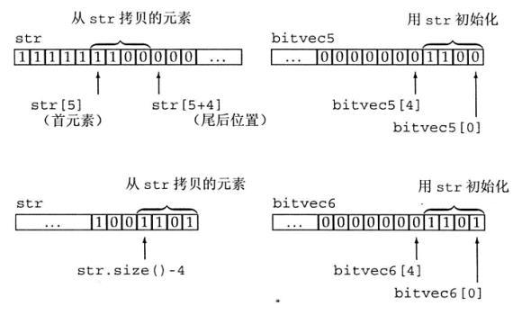

> @Date    : 2020-09-18 16:53:52
>
> @Author  : Lewis Tian (taseikyo@gmail.com)
>
> @Link    : github.com/taseikyo

# 标准库特殊设施

## Table of Contents

- [17.1 tuple](#171-tuple)
	- [17.1.1 定义和初始化 tuple](#1711-定义和初始化-tuple)
		- [访问 tuple 的成员](#访问-tuple-的成员)
		- [关系和相等运算符](#关系和相等运算符)
	- [17.1.2 使用 tuple 返回多个值](#1712-使用-tuple-返回多个值)
- [17.2 bitset 类型](#172-bitset-类型)
	- [17.2.1 定义和初始化 bitset](#1721-定义和初始化-bitset)
		- [用 unsigned 值初始化 bitset](#用-unsigned-值初始化-bitset)
		- [从一个 string 初始化](#从一个-string-初始化)
	- [17.2.2 bitset](#1722-bitset)
		- [提取 bitset 的值](#提取-bitset-的值)
		- [bitset 的 IO 运算符](#bitset-的-io-运算符)
		- [使用 bitset](#使用-bitset)
- [17.3 正则表达式](#173-正则表达式)
	- [17.3.1 使用正则表达式](#1731-使用正则表达式)
	- [17.3.2 匹配与 Regex 迭代器类型](#1732-匹配与-regex-迭代器类型)
- [17.4 随机数](#174-随机数)
	- [17.4.1 随机数引擎和分布](#1741-随机数引擎和分布)
		- [分布类型和引擎](#分布类型和引擎)
		- [比较随机数引擎和 rand 函数](#比较随机数引擎和-rand-函数)
		- [引擎生成一个数值序列](#引擎生成一个数值序列)
		- [设置随机数发生器种子](#设置随机数发生器种子)
	- [17.4.2 其他随机数分布](#1742-其他随机数分布)
		- [生成随机实数](#生成随机实数)
		- [使用分布的默认结果类型](#使用分布的默认结果类型)
		- [生成非均匀分布的随机数](#生成非均匀分布的随机数)
		- [bernoulli_distribution 类](#bernoulli_distribution-类)
- [17.5 IO 库再探](#175-io-库再探)
	- [17.5.1 格式化输入与输出](#1751-格式化输入与输出)
		- [控制布尔值的格式](#控制布尔值的格式)
		- [指定整型值的进制](#指定整型值的进制)
		- [在输出中指出进制](#在输出中指出进制)
		- [指定打印精度](#指定打印精度)
		- [指定浮点数计数法](#指定浮点数计数法)
		- [打印小数点](#打印小数点)
		- [输出补白](#输出补白)
		- [控制输入格式](#控制输入格式)
	- [17.5.2 未格式化的输入 / 输出操作](#1752-未格式化的输入--输出操作)
		- [单字节操作](#单字节操作)
		- [讲字符放回输入流](#讲字符放回输入流)
		- [从输入操作返回的 int 值](#从输入操作返回的-int-值)
		- [多字节操作](#多字节操作)
		- [确定读取了多少个字符](#确定读取了多少个字符)
	- [17.5.3 流随机访问](#1753-流随机访问)

## 17.1 tuple

tuple 是类似 pair 的模板。每个 pair 的成员类型都不相同，但每个 pair 都恰好有两个成员。不同 tuple 类型的成员类型也不相同，但一个 tuple 可以有任意数量的成员。每个确定的 tuple 类型的成员数目是固定的，但一个 tuple 类型的成员数目可以与另一个 tuple 类型不同。当我们希望将一些数据组合成单一对象，但又不想麻烦地定义一个新数据结构来表示这些数据时，tuple 是非常有用的。

表 17.1 tuple 支持的操作

|                    操作                   |                                                                          说明                                                                          |
|:-----------------------------------------:|:------------------------------------------------------------------------------------------------------------------------------------------------------:|
| `tuple<T1,T2,...,Tn>t;`                   | t 是一个 tuple，成员数为 n，第 i 个成员的类型为 Ti。所有成员都进行值初始化                                                                             |
| `tuple<T1,T2,...,Tn> t(v1, v2, ..., vn);` | t 是一个 tuple，成员类型为 T1...Tn，每个成员用对应的初始值 v 进行初始化。此构造函数是 explicit 的                                                      |
| `make_tuple (v1, v2, ..., vn)`            | 返回一个用给定初始值初始化的 tuple。tuple 的类型从初始值的类型推断                                                                                     |
| t1==t2 t1!=t2                             | 当两个 tuple 具有相同数量的成员且成员对应相等时，两个 tuple 相等。这两个操作使用成员的 == 运算符来完成。一旦发现某对成员不等，接下来的成员就不用比较了 |
| t1 relop t2                               | tuple 的关系运算使用字典序。两个 tuple 必须具有相同数量的成员。使用 < 运算符比较 t1 的成员和 t2 中的对应成员                                           |
| `get<i>(t)`                               | 返回 t 的第 i 个数据成员的引用；如果 t 是一个左值，结果是一个左值引用；否则，结果是一个右值引用。tuple 的所有成员都是 public 的                        |
| `tuple_size<tupleType>::value`             | 一个类模板，可以通过一个 tuple 类型来初始化。它有一个名为 value 的 public constexpr static 数据成员，类型为 size_t, 表示给定 tuple 类型中成员的数量    |
| `tuple_element<i, tupleType>::type`        | 一个类模板，可以通过一个整型常量和一个 tuple 类型来初始化。它有一个名为 type 的 public 成员，表示给定 tuple 类型中指定成员的类型                       |                   |


### 17.1.1 定义和初始化 tuple

当我们定义一个 tuple 时，需要指出每个成员的类型：

```C++
tuple<size_t, size_t, size_t> threeD;// 三个成员都设置为 0
tuple<string, vector<double>, int, list<int>> someVal("constants", {3.14, 2.718}, 42, {0, 1, 2, 3, 4, 5});
```

当我们创建一个 tuple 对象时，可以使用 tuple 的默认构造函数，它会对每个成员进行值初始化；也可以像本例中初始化 someVal 一样，为每个成员提供一个初始值。tuple 的这个构造函数是 explicit 的，因此我们必须使用直接初始化语法：

```C++
tuple<size_t, size_t, size_t> threeD = {1, 2, 3};// 错误
tuple<size_t, size_t, size_t> threeD{1, 2, 3};// 正确
```

【有意思，之后都直接用不带等于号的初始化方式得了】

类似 make_pair 函数，标准库定义了 make_tuple 函数，我们还可以用它来生成 tuple 对象：

```C++
// 表示书店交易记录的 tuple, 包含：ISBN、数量和每册书的价格
auto item = make_tuple("0-999-78345-X", 3, 20.00);
```

类似 make_pair，make_tuple 函数使用初始值的类型来推断 tuple 的类型。在本例中，item 是一个 tuple，类型为 tuple<const char*, int, double>。

#### 访问 tuple 的成员

一个 pair 总是有两个成员，这样，标准库就可以为它们命名 (如，first 和 second)。但这种命名方式对 tuple 是不可能的，因为一个 tuple 类型的成员数目是没有限制的。因此，tuple 的成员都是未命名的。要访问一个 tuple 的成员，就要使用一个名为 get 的标准库函数模板。为了使用 get，我们必须指定一个显式模板实参，它指出我们想要访问第几个成员。我们传递给 get 一个 tuple 对象，它返回指定成员的引用：

```C++
auto book = get<0>(item);// 返回 item 的第一个成员
auto cnt = get<1>(item);// 返回 item 的第二个成员
auto price = get<2>(item)/cnt;// 返回 item 的最后一个成员
get<2>(item) *= 0.8;// 打折 20%
```

尖括号中的值必须是一个整型常量表达式（参见 2.4.4 节，第 58 页）。

如果不知道一个 tuple 准确的类型细节信息，可以用两个辅助类模板来查询 tuple 成员的数量和类型：

```C++
typedef decltype(item) trans;//trans 是 item 的类型
// 返回 trans 类型对象中成员的数量
size_t sz = tuple_size<trans>::value;// 返回 3
//cnt 的类型与 item 中第二个成员相同
tuple_element<1, trans>::type cnt = get<1>(item); //cnt 是一个 int
```

为了使用 tuple_size 或 tuple_element，我们需要知道一个 tuple 对象的类型。与往常一样，确定一个对象的类型的最简单方法就是使用 decltype。在本例中，我们使用 decltype 来为 item 类型定义一个类型别名，用它来实例化两个模板。

tuple_size 有一个名为 value 的 public static 数据成员，它表示给定 tuple 中成员的数量。tuple_element 模板除了一个 tuple 类型外，还接受一个索引值。它有一个名为 type 的 public 类型成员，表示给定 tuple 类型中指定成员的类型。

#### 关系和相等运算符

tuple 的关系和相等运算符的行为类似容器的对应操作。这些运算符逐对比较左侧 tuple 和右侧 tuple 的成员。只有两个 tuple 具有相同数量的成员时，我们才可以比较它们。而且，为了使用 tuple 的相等或不等运算符，对每对成员使用 == 运算符必须都是合法的。例如：

```C++
tuple<string, string>duo ("1", "2");
tuple<size_t, size_t>twoD (1, 2);
bool b = (duo == twoD); // 错误：不能比较 sizet 和 string
tuple<size_t, size t, size_t>threeD (1, 2, 3);
b = (twoD < threeD); // 错误：成员数量不同
tuple<size_t, size_t> origin (0, 0);
b = (origin < twoD); // 正确:b 为 true
```

> 由于 tuple 定义了 < 和 == 运算符，我们可以将 tuple 序列传递给算法，并且可以在无序容器中将 tuple 作为关键字类型

### 17.1.2 使用 tuple 返回多个值

## 17.2 bitset 类型

在 4.8 节中我们介绍了将整型运算对象当作二进制位集合处理的一些内置运算符。标准库还定义了 bitset 类，使得位运算的使用更为容易，并且能够处理超过最长整型类型大小的位集合。bitset 类定义在头文件 bitset 中

### 17.2.1 定义和初始化 bitset

bitset 类是一个类模板，它类似 array 类，具有固定的大小。当我们定义一个 bitset 时，需要声明它包含多少个二进制位：

```C++
bitset<32> bitvec(1U);//32 位；低位为 1, 其他位为 0
```

大小必须是一个常量表达式。这条语句定义 bitvec 为一个包含 32 位的 bitset。就像 vector 包含未命名的元素一样，bitset 中的二进制位也是未命名的，我们通过位置来访问它们。编号从 0 开始的二进制位被称为低位 (low-order), 编号到 31 结束的二进制位被称为高位 (high-order)

表 17.2: 初始化 bitset 的方法

|                 操作                |                                                                                                                       说明                                                                                                                      |
|:-----------------------------------:|:-----------------------------------------------------------------------------------------------------------------------------------------------------------------------------------------------------------------------------------------------:|
| `bitset<n> b;`                        | b 有 n 位；每一位均为 0。此构造函数是一个 constexpr                                                                                                                                                                                             |
| `bitset<n> b(u);`                     | b 是 unsigned long long 值 u 的低 n 位的拷贝。如果 n 大于 unsigned long long 的大小，则 b 中超出 unsigned long long 的高位被置为 0。此构造函数是一个 constexpr                                                                                  |
| `bitset<n> b(s, pos, m, zero, one);`  | b 是 string s 从位置 pos 开始 m 个字符的拷贝。s 只能包含字符 zero 或 one; 如果 s 包含任何其他字符，构造函数会抛出 invalid argument 异常。字符在 b 中分别保存为 zero 和 one。pos 默认为 0，m 默认为 string::npos，zero 默认为'0'，one 默认为 '1' |
| `bitset<n> b(cp, pos, m, zero, one);` | 与上一个构造函数相同，但从 cp 指向的字符数组中拷贝字符。如果未提供 m，则 cp 必须指向一个 C 风格字符串。如果提供了 m，则从 cp 开始必须至少有 m 个 zero 或 one 字符                                                                               |
| `b.to_string(zero, one)`              | 接受一个 string 或一个字符指针的构造函数是 explicit 的。在新标准中增加了为 0 和 1 指定其他字符的功能                                                                                                                                            |

#### 用 unsigned 值初始化 bitset

当我们使用一个整型值来初始化 bitset 时，此值将被转换为 unsigned long long 类型并被当作位模式来处理。bitset 中的二进制位将是此模式的一个副本。如果 bitset 的大小大于一个 unsigned long long 中的二进制位数，则剩余的高位被置为 0。如果 bitset 的大小小于一个 unsigned long long 中的二进制位数，则只使用给定值中的低位，超出 bitset 大小的高位被丢弃：

```C++
//bitvec1 比初始值小；初始值中的高位被丢弃
bitset<13> bitvec1 (0xbeef); // 二进制位序列为 1111011101111
//bitvec2 比初始值大；它的高位被置为 0
bitset<20>bitvec2 (0xbeef);// 二进制位序列为 00001011111011101111
// 在 64 位机器中，long long 0ULL 是 64 个 0 比特，因此～0ULL 是 64 个 1
bitset<128>bitvec3 (~0ULL);//0~63 位为 1;63~127 位为 0
```

#### 从一个 string 初始化

bitset 我们可以从一个 string 或一个字符数组指针来初始化 bitset。两种情况下，字符都直接表示位模式。与往常一样，当我们使用字符串表示数时，字符串中下标最小的字符对应高位，反之亦然：

```C++
bitset<32> bitvec4("1100");//2、3 两位为 1, 剩余两位为 0
```

> 如果 string 包含的字符数比 bitset 少，则 bitset 的高位被置为 0。string 的下标编号习惯与 bitset 恰好相反：string 中下标最大的字符（最右字符）用来初始化 bitset 中的低位（下标为 0 的二进制位）。当你用一个 string 初始化一个 bitset 时，要记住这个差别。

我们不必使用整个 string 来作为 bitset 的初始值，可以只用一个子串作为初始值：

```C++
string str("1111111000000011001101");
bitset<32> bitvec5(str, 5, 4);// 从 str[5] 开始的四个二进制位，1100
bitset<32> bitvec6(str, str.size()-4);// 使用最后四个字符
```

bitvec5 用 str 中从 str[5] 开始的长度为 4 的子串进行初始化。与往常一样，子串的最右字符表示最低位。因此，bitvec5 中第 3 位到第 0 位被设置为 1100, 剩余位被设置为 0。传递给 bitvec6 的初始值是一个 string 和一个开始位置，因此 bitvec6 用 str 中倒数第四个字符开始的子串进行初始化。bitvec6 中剩余二进制位被初始化为 0。下图说明了这两个初始化过程



### 17.2.2 bitset

操作 bitset 操作定义了多种检测或设置一个或多个二进制位的方法。bitset 类还支持我们在 4.8 节中介绍过的位运算符。这些运算符用于 bitset 对象的含义与内置运算符用于 unsigned 运算对象相同。

表 17.3 bitset 操作

|            操作            |                                                                      说明                                                                     |
|:--------------------------:|:---------------------------------------------------------------------------------------------------------------------------------------------:|
| b.any()                    | b 中是否存在置位的二进制位                                                                                                                    |
| b.all()                    | b 中所有位都置位了吗                                                                                                                          |
| b.none()                   | b 中不存在置位的二进制位吗                                                                                                                    |
| b.count()                  | b 中置位的位数                                                                                                                                |
| b.size()                   | 一个 constexpr 函数，返回 b 中的位数                                                                                                          |
| b.test(pos)                | 若 pos 位置的位是置位的，则返回 true，否则返回 false                                                                                          |
| b.set(pos, v)              | 将位置 pos 处的位设置为 bool 值 v。v 默认为 true。如果 b.set() 未传递实参，则将 b 中所有位置位                                                |
| b.reset(pos) b.reset()     | 将位置 pos 处的位复位或将 b 中所有位复位                                                                                                      |
| b.flip(pos) b.flip()       | 改变位置 pos 处的位的状态或改变 b 中每一位的状态                                                                                              |
| b[pos]                     | 访问 b 中位置 pos 处的位；如果 b 是 const 的，则当该位置位时 b [pos] 返回一个 bool 值 true，否则返回 false                                    |
| b.to_ulong() b.to_ullong() | 返回一个 unsigned long / unsigned long long 值，其位模式与 b 相同。如果 b 中位模式不能放入指定的结果类型，则抛出一个 overflow error 异常 |
| b.to_string(zero, one)     | 返回一个 string，表示 b 中的位模式。zero 和 one 的默认值分别为 0 和 1，用来表示 b 中的 0 和 1                                                 |
| `os<<b`                    | 将 b 中二进制位打印为字符 1 或 0, 打印到流 os                                                                                                 |
| is>>b                      | 从 is 读取字符存入 b。当下一个字符不是 1 或 0 时，或是已经读入 b.size() 个位时，读取过程停止                                                  |

count、size、a11、any 和 none 等几个操作都不接受参数，返回整个 bitset 的状态。其他操作 —— set、reset 和 flip 则改变 bitset 的状态。改变 bitset 状态的成员函数都是重载的。对每个函数，不接受参数的版本对整个集合执行给定的操作；

#### 提取 bitset 的值

to_ulong 和 to_ullong 操作都返回一个值，保存了与 bitset 对象相同的位模式。只有当 bitset 的大小小于等于对应的大小（to_ulong 为 unsigned long，to_ullong 为 unsigned long long) 时，我们才能使用这两个操作：

```C++
unsigned long ulong = bitvec3.to_ulong();
cout<<"ulong="<< ulong<<endl;
```

#### bitset 的 IO 运算符

输入运算符从一个输入流读取字符，保存到一个临时的 string 对象中。直到读取的字符数达到对应 bitset 的大小时，或是遇到不是 1 或 0 的字符时，或是遇到文件尾或输入错误时，读取过程才停止。随即用临时 string 对象来初始化 bitset。如果读取的字符数小于 bitset 的大小，则与往常一样，高位将被置为 0。

```C++
bitset<16>bits;
cin >> bits; // 从 cin 读取最多 16 个 0 或 1
cout << "bits:" << bits << endl; // 打印刚刚读取的内容
```

#### 使用 bitset

为了说明如何使用 bitset, 我们重新实现 4.8 节中的评分程序，用 bitset 代替 unsigned long 表示 30 个学生的测验结果 —— “通过 / 失败”：

```C++
bool status;// 使用位运算符的版本
unsigned long quizA = 0; // 此值被当作位集合使用
quizA 1 = 1UL << 27; // 指出第 27 个学生通过了测验
status = quizA & (1UL << 27); // 检查第 27 个学生是否通过了测验
quizA 6 = ~(1UL << 27); // 第 27 个学生未通过测验

// 使用标准库类 bitset 完成等价的工作
bitset<30>quizB;// 每个学生分配一位，所有位都被初始化为 0
quizB.set(27);// 指出第 27 个学生通过了测验
status = quizB[27]; // 检查第 27 个学生是否通过了测验
quizB.reset (27);// 第 27 个学生未通过测验
```

## 17.3 正则表达式

正则表达式 (regular expression) 是一种描述字符序列的方法，是一种极其强大的计算工具。但是，用于定义正则表达式的描述语言已经大大超出了本书的范围。

表 17.4 正则表达式库组件

|       操作      |                              说明                              |
|----------------|--------------------------------------------------------------|
| regex           | 表示有一个正则表达式的类                                       |
| regex_match     | 将一个字符序列与一个正则表达式匹配                             |
| regex_search    | 寻找第一个与正则表达式匹配的子序列                             |
| regex_replace   | 使用给定格式替换一个正则表达式                                 |
| sregex iterator | 迭代器适配器，调用regex_search来遍历一个string中所有匹配的子串 |
| smatch          | 容器类，保存在string中搜索的结果                               |
| ssub match      | string中匹配的子表达式的结果                                   |

regex 类表示一个正则表达式。除了初始化和赋值之外，regex 还支持其他一些操作。

函数 regex_match 和 regex_search 确定一个给定字符序列与一个给定 regex 是否匹配。

表 17.5:regex_search 和 regex_match 的参数

这些操作返回 bool 值，指出是否找到匹配

- (seq, m, r, mft) (seq, r, mft)

在字符序列 seq 中查找 regex 对象 r 中的正则表达式。seq 可以是一个 string、表示范围的一对迭代器以及一个指向空字符结尾的字符数组的指针 m 是一个 match 对象，用来保存匹配结果的相关细节

m 和 seq 必须具有兼容的类型

mft 是一个可选的 regex constants::match_flag_type 值。

### 17.3.1 使用正则表达式

### 17.3.2 匹配与 Regex 迭代器类型

我们可以使用 sregex_iterator 来获得所有匹配。regex 迭代器是一种迭代器适配器，被绑定到一个输入序列和一个 regex 对象上。

【这部分挺复杂，到时候用到再查，毕竟现在记了后面要用也不会翻这个 :0】

## 17.4 随机数

程序通常需要一个随机数源。在新标准出现之前，C 和 C++ 都依赖于一个简单的 C 库函数 rand 来生成随机数。此函数生成均匀分布的伪随机整数，每个随机数的范围在 0 和一个系统相关的最大值（至少为 32767）之间

rand 函数有一些问题：即使不是大多数，也有很多程序需要不同范围的随机数。一些应用需要随机浮点数。一些程序需要非均匀分布的数。而程序员为了解决这些问题而试图转换 rand 生成的随机数的范围、类型或分布时，常常会引入非随机性。

定义在头文件 random 中的随机数库通过一组协作的类来解决这些问题：随机数引擎类（random-number engines）和随机数分布类（random-number distribution）。一个引擎类可以生成 unsigned 随机数序列，一个分布类使用一个引擎类生成指定类型的、在给定范围内的、服从特定概率分布的随机数

表17.14：随机数库的组成

- 引擎：类型，生成随机unsigned整数序列
- 分布：类型，使用引擎返回服从特定概率分布的随机数

> C++ 程序不应该使用库函数 rand，而应使用 defaultrandom_engine 类和恰当的分布类对象

### 17.4.1 随机数引擎和分布

随机数引擎是函数对象类，它们定义了一个调用运算符，该运算符不接受参数并返回一个随机 unsigned 整数。

```C++
default_random_engine e;// 生成随机无符号数
for (size_t i = 0; i < 10; ++i)
	cout << e() << " ";
```

标准库定义了多个随机数引擎类，区别在于性能和随机性质量不同。每个编译器都会指定其中一个作为 default_random_engine 类型。此类型一般具有最常用的特性。

表 17.5 随机数引擎操作

|         操作         |                    说明                    |
|:--------------------:|:------------------------------------------:|
| Engine e;            | 默认构造函数；使用该引擎类型默认的种子     |
| Engine e(s);         | 使用整型值s作为种子                        |
| e. seed(s)           | 使用种子s重置引擎的状态                    |
| e. min() e. max()    | 此引擎可生成的最小值和最大值               |
| Engine:: result_type | 此引擎生成的 unsigned 整型类型             |
| e.discard(u)         | 将引擎推进 u 步；u 的类型为 unsigned long long|

对于大多数场合，随机数引擎的输出是不能直接使用的，这也是为什么早先我们称之为原始随机数。问题出在生成的随机数的值范围通常与我们需要的不符，而正确转换随机数的范围是极其困难的。

#### 分布类型和引擎

为了得到在一个指定范围内的数，我们使用一个分布类型的对象：

```C++
// 生成 0 到 9 之间 (包含) 均匀分布的随机数
uniform_int_distribution<unsigned> u(0, 9);
default_random_engine e;// 生成无符号随机整数
for (size_t i = 0; i < 10; ++i)
	// 将 u 作为随机数源
	// 每个调用返回在指定范围内并服从均匀分布的值
	cout << u(e) << " ";
```

此代码生成下面这样的输出

0 1 7 4 5 2 0 6 6 9

此处我们将 u 定义为 uniform int distribution<unsigned>。此类型生成均匀分布的 unsigned 值。当我们定义一个这种类型的对象时，可以提供想要的最小值和最大值。在此程序中，u(0,9) 表示我们希望得到 0 到 9 之间（包含）的数。随机数分布类会使用包含的范围，从而我们可以得到给定整型类型的每个可能值

类似引擎类型，分布类型也是函数对象类。分布类型定义了一个调用运算符，它接受一个随机数引擎作为参数。分布对象使用它的引擎参数生成随机数，并将其映射到指定的分布。

注意，我们传递给分布对象的是引擎对象本身，即 u(e)。如果我们将调用写成 u(e())，含义就变为将 e 生成的下一个值传递给 u，会导致一个编译错误。我们传递的是引擎本身，而不是它生成的下一个值，原因是某些分布可能需要调用引擎多次才能得到一个值

> 当我们说随机数发生器时，是指分布对象和引擎对象的组合

#### 比较随机数引擎和 rand 函数

对熟悉 C 库函数 rand 的读者，值得注意的是：调用一个 default_random engine 对象的输出类似 rand 的输出。随机数引擎生成的 unsigned 整数在一个系统定义的范围内，而 rand 生成的数的范围在 0 到 RAND_MAX 之间。一个引擎类型的范围可以通过调用该类型对象的 min 和 max 成员来获得：

```C++
cout << "min:" << e.min () << "max:" << e.max () << endl;
```

在我们的系统中，此程序生成下面的输出：

```C++
min:1 max:2147483646
```

#### 引擎生成一个数值序列

随机数发生器有一个特性经常会使新手迷惑：即使生成的数看起来是随机的，但对一个给定的发生器，每次运行程序它都会返回相同的数值序列。序列不变这一事实在调试时非常有用。但另一方面，使用随机数发生器的程序也必须考虑这一特性。

作为一个例子，假定我们需要一个函数生成一个 vector，包含 100 个均匀分布在 0 到 9 之间的随机数。我们可能认为应该这样编写此函数：

// 几乎肯定是生成随机整数 vector 的错误方法
// 每次调用这个函数都会生成相同的 100 个数！

```C++
vector<unsigned>bad_randVec() {
	default_random_engine e;
	uniform_int_distribution<unsigned> u(0, 9);
	vector<unsigned>ret;
	for (size_t i=0; i<100; ++i)
		ret.push_back(u(e));
	return ret;
}
// 但是，每次调用这个函数都会返回相同的 vector
vector<unsigned> v1(bad_randVec());
vector<unsigned> v2(bad_randVec());
// 将打印 “equa1"
cout << ((v1 == v2)?"equal": "not equal") << endl;
```

编写此函数的正确方法是将引擎和关联的分布对象定义为 static 的：

```C++
// 返回一个 vector, 包含 100 个均匀分布的随机数
vector<unsigned>good_randVec () {
// 由于我们希望引擎和分布对象保持状态，因此应该将它们
// 定义为 static 的，从而每次调用都生成新的数
	static default_random_engine e;
	static uniform_int_distribution<unsigned> u (0, 9);
	vector<unsigned>ret;
	for (size_t i = 0; i < 100; ++i)
		ret.push_back (u (e));
	return ret;
}
```

由于 e 和 u 是 static 的，因此它们在函数调用之间会保持住状态。第一次调用会使用 u (e) 生成的序列中的前 100 个随机数，第二次调用会获得接下来 100 个

#### 设置随机数发生器种子

随机数发生器会生成相同的随机数序列这一特性在调试中很有用。但是，一旦我们的程序调试完毕，我们通常希望每次运行程序都会生成不同的随机结果，可以通过提供一个种子（seed）来达到这一目的。种子就是一个数值，引擎可以利用它从序列中一个新位置重新开始生成随机数。

为引擎设置种子有两种方式：在创建引擎对象时提供种子，或者调用引擎的seed成员：

```C++
default_random_engine e1;// 使用默认种子
default_random_engine e2 (2147483646);// 使用给定的种子值
//e3 和 e4 将生成相同的序列，因为它们使用了相同的种子
default_random_engine e3;// 使用默认种子值
e3.seed(32767);// 调用 seed 设置一个新种子值
default_random_engine e4(32767);// 将种子值设置为 32767
for (sizeti = 0; i != 100; ++i) {
	if (el() == e2())
		cout << "unseeded match at iteration:" << i << endl;
	if (e3() != e4())
		cout << "seeded differs at iteration:" << i << endl;
}
```

选择一个好的种子，与生成好的随机数所涉及的其他大多数事情相同，是极其困难的。可能最常用的方法是调用系统函数 time。这个函数定义在头文件 ctime 中，它返回从一个特定时刻到当前经过了多少秒。函数 time 接受单个指针参数，它指向用于写入时间的数据结构。如果此指针为空，则函数简单地返回时间:

```C++
default_random_engine e1(time(0));// 稍微随机些的种子
```

### 17.4.2 其他随机数分布

随机数引擎生成 unsigned 数，范围内的每个数被生成的概率都是相同的。而应用程序常常需要不同类型或不同分布的随机数。标准库通过定义不同随机数分布对象来满足这两方面的要求，分布对象和引擎对象协同工作，生成要求的结果。

#### 生成随机实数

程序常需要一个随机浮点数的源。特别是，程序经常需要 0 到 1 之间的随机数。

最常用但不正确的从 rand 获得一个随机浮点数的方法是用 rand() 的结果除以 RANDMAX，即，系统定义的 rand 可以生成的最大随机数的上界。这种方法不正确的原因是随机整数的精度通常低于随机浮点数，这样，有一些浮点值就永远不会被生成了

使用新标准库设施，可以很容易地获得随机浮点数。我们可以定义一个 uniform_real_distribution 类型的对象，并让标准库来处理从随机整数到随机浮点数的映射。与处理 uniform_int_distribution 一样，在定义对象时，我们指定最小值和最大值：

```C++
default_random_engine e;// 生成无符号随机整数
//0 到 1 (包含) 的均匀分布
uniform_real_distribution<double> u(0, 1);
for (size_t i = 0; i < 10; ++i)
	cout << u(e) << " ";
```

这段代码与之前生成 unsigned 值的程序几乎相同。但是，由于我们使用了一个不同的分布类型，此版本会生成不同的结果：

0.131538 0.45865 0.218959 0.678865 0.934693 0.519416...

#### 使用分布的默认结果类型

分布类型都是模板，具有单一的模板类型参数，表示分布生成的随机数的类型，对此有一个例外。这些分布类型要么生成浮点类型，要么生成整数类型

每个分布模板都有一个默认模板实参。生成浮点值的分布类型默认生成 double 值，而生成整型值的分布默认生成 int 值。由于分布类型只有一个模板参数，因此当我们希望使用默认随机数类型时要记得在模板名之后使用空尖括号。

```C++
// 空 <> 表示我们希望使用默认结果类型
uniform_real_distribution<>u (0,1);// 默认生成 double 值
```

#### 生成非均匀分布的随机数

新标准库的另一个优势是可以生成非均匀分布的随机数。实际上，新标准库定义了 20 种分布类型，这些类型列在附录 A.3 中

作为一个例子，我们将生成一个正态分布的值的序列，并画出值的分布。由于 normal_distribution 生成浮点值，我们的程序使用头文件 cmath 中的 lround 函数将每个随机数舍入到最接近的整数。我们将生成 200 个数，它们以均值 4 为中心，标准差为 1.5。由于使用的是正态分布，我们期望生成的数中大约 99% 都在 0 到 8 之间

我们的程序会对这个范围内的每个整数统计有多少个生成的数映射到它：

```C++
default_random_engine e;// 生成随机整数
normal_distribution<> n(4, 1.5);// 均值 4, 标准差 1.5
vector<unsigned> vals(9);//9 个元素均为 0
for (size_t i = 0; i != 200; ++i) {
	unsigned v = lround(n(e)); // 舍入到最接近的整数
	if (v < vals.size()) // 如果结果在范围内
		++vals[v];// 统计每个数出现了多少次
}
for (size_t j = 0; j != vals.size (); ++j)
	cout << j << ":" << string(vals[j], '*')<< endl;
```

#### bernoulli_distribution 类

我们注意到有一个分布不接受模板参数，即 bernoulli_distribution，因为它是一个普通类，而非模板。此分布总是返回一个 bool 值。它返回 true 的概率是一个常数，此概率的默认值是 0.5。

```C++
bernoulli_distribution b(0.8);
```

## 17.5 IO 库再探

### 17.5.1 格式化输入与输出

#### 控制布尔值的格式

默认 true 1，false 0，通过对流使用 boolalpha 操纵符来覆盖：

```C++
cout << "default bool values:" << true << "" << false
     << "\nalpha bool values:" << boolalpha
     << true << " "<<false<< end1;

default bool values:1 0
alpha bool values:true false
```

为了取消 cout 格式状态的改变，我们使用 noboolalpha：

```C++
bool bool_val = get_status();
cout << boolalpha //设置cout的内部状态
     << bool_val
     << noboolalpha; //将内部状态恢复为默认格式
```

本例中我们改变了 bool 值的格式，但只对 bool_val 的输出有效。一旦完成此值的打印，我们立即将流恢复到初始状态。

#### 指定整型值的进制

hex oct dec：十六进制 八进制 十进制

```C++
cout << "default:" << 20 << "" << 1024 << end1;
cout << "octal:" << oct << 20 << "" << 1024 << endl;
cout << "hex:" << hex << 20 << "" << 1024 << end1;
cout << "decimal:" << dec << 20 << "" << 1024 << endl;

default:20 1024
octal:24 2000
hex:14 400
decimal:20 1024
```

> 操纵符 hex、oct 和 dec 只影响整型运算对象，浮点值的表示形式不受影响

#### 在输出中指出进制

默认情况下，当我们打印出数值时，没有可见的线索指出使用的是几进制。例如，20 是十进制的 20 还是 16 的八进制表示？当我们按十进制打印数值时，打印结果会符合我们的期望。如果需要打印八进制值或十六进制值，应该使用 showbase 操纵符。会在输出结果中显示进制：

- 前导 0x 表示十六进制
- 前导 0 表示八进制
- 无前导字符串表示十进制

我们可以使用 showbase 修改前一个程序:

```C++
cout << showbase; // 当打印整型值时显示进制
cout << "default:" << 20 << "" << 1024 << end1;
cout << "in octal:" << oct << 20 << "" << 1024 << end1;
cout << "in hex:" << hex << 20 << "" << 1024 << endl;
cout << "in decimal:" << dec << 20 << "" << 1024 << endl;
cout << noshowbase; // 恢复流状态

default:20 1024
in octal:024 02000
in hex:0x14 0x400
in decimal:20 1024
```

默认情况下，十六进制值会以小写打印，前导字符也是小写的 x。我们可以通过使用 uppercase 操纵符来输出大写的 x 并将十六进制数字 a-f 以大写输出：

```C++
cout << uppercase << showbase << hex
     << "printed in hexadecimal:" << 20 << "" << 1024
     << nouppercase << noshowbase << dec << endl;

printed in hexadecimal:0X14 0X400
```

控制浮点数格式：

- 以多高精度（多少个数字）打印浮点值
- 数值是打印为十六进制、定点十进制还是科学记数法形式
- 对于没有小数部分的浮点值是否打印小数点

默认情况下，浮点值按六位数字精度打印；如果浮点值没有小数部分，则不打印小数点；根据浮点数的值选择打印成定点十进制或科学记数法形式。标准库会选择一种可读性更好的格式：非常大和非常小的值打印为科学记数法形式，其他值打印为定点十进制形式

#### 指定打印精度

默认情况下，精度会控制打印的数字的总数。当打印时，浮点值按当前精度舍入而非截断。因此，如果当前精度为四位数字，则 3.14159 将打印为 3.142; 如果精度为三位数字，则打印为 3.14

我们可以通过调用 IO 对象的 precision 成员或使用 setprecision 操纵符来改变精度。precision 成员是重载的。一个版本接受一个 int 值，将精度设置为此值，并返回旧精度值。另一个版本不接受参数，返回当前精度值。
setprecision 操纵符接受一个参数，用来设置精度

#### 指定浮点数计数法

通过使用恰当的操纵符，我们可以强制一个流使用科学记数法、定点十进制或是十六进制记数法。操纵符 scientific 改变流的状态来使用科学记数法。操纵符 fixed 改变流的状态来使用定点十进制

在新标准库中，通过使用 hexfloat 也可以强制浮点数使用十六进制格式。新标准库还提供另一个名为 defaultfloat 的操纵符，它将流恢复到默认状态 — 根据要打印的值选择记数法

#### 打印小数点

默认情况下，当一个浮点值的小数部分为 0 时，不显示小数点。showpoint操纵符强制打印小数点，noshowpoint 恢复默认行为。

#### 输出补白

当按列打印数据时，我们常常需要非常精细地控制数据格式。标准库提供了一些操纵符帮助我们完成所需的控制：

- setw 指定下一个数字或字符串值的最小空间
- left 表示左对齐输出
- right 表示右对齐输出，右对齐是默认格式
- internal 控制负数的符号的位置，它左对齐符号，右对齐值，用空格填满所有中间空间
- setfill 允许指定一个字符代替默认的空格来补白输出

> setw 类似 endl，不改变输出流的内部状态。它只决定下一个输出的大小

#### 控制输入格式

默认情况下，输入运算符会忽略空白符（空格符、制表符、换行符、换纸符和回车符）。

操纵符 noskipws 会令输入运算符读取空白符，而不是跳过它们。为了恢复默认行为，我们可以使用 skipws 操纵符：

```C++
cin>>noskipws;// 设置 cin 读取空白符
while (cin>>ch)
	cout<<ch;
cin>>skipws；//将cin恢复到默认状态，从而丢弃空白符
```

对于，如果默认情况下，循环执行 4 次，读取字符 a - d，跳过中间的空白符，但是设置了上面的 noskipws 则会循环 7 次

```C++
a b	c
d 

a[空格]c[tab]c
d
```

### 17.5.2 未格式化的输入 / 输出操作

到目前为止，我们的程序只使用过格式化 IO (formatted IO) 操作。输入和输出运算符 (<<和>>) 根据读取或写入的数据类型来格式化它们。输入运算符忽略空白符，输出运算符应用补白、精度等规则

标准库还提供了一组低层操作，支持未格式化 IO (unformatted IO)。这些操作允许我们将一个流当作一个无解释的字节序列来处理

#### 单字节操作

有几个未格式化操作每次一个字节地处理流，它们会读取而不是忽略空白符。例如，我们可以使用未格式化 IO 操作 get 和 put 来读取和写入一个字符:

```C++
char ch;
while(cin.get(ch))
	cout.put(ch);
```

此程序保留输入中的空白符，其输出与输入完全相同。它的执行过程与前一个使用 noskipws 的程序完全相同

表 17.19 单字节低层 IO 操作

|      操作      |                         说明                        |
|:--------------:|:---------------------------------------------------:|
| is.get(ch)     | 从 istream is 读取下一个字节存入字符 ch 中。返回 is |
| os.put(ch)     | 将字符 ch 输出到 ostream os.                        |
| is.get()       | 返回 os 将 is 的下一个字节作为 int 返回             |
| is.putback(ch) | 将字符 ch 放回 is. 返回 is                          |
| is.unget()     | 将 is 向后移动一个字节。返回 is                     |
| is.peek()      | 将下一个字节作为 int 返回，但不从流中删除它         |

#### 讲字符放回输入流

一般情况下，在读取下一个值之前，标准库保证我们可以退回最多一个值。即，标准库不保证在中间不进行读取操作的情况下能连续调用 putback 或 unget

#### 从输入操作返回的 int 值

函数 peek 和无参的 get 版本都以 int 类型从输入流返回一个字符。这有些令人吃惊，可能这些函数返回一个 char 看起来会更自然

这些函数返回一个 int 的原因是：可以返回文件尾标记。我们使用 char 范围中的每个值来表示一个真实字符，因此，取值范围中没有额外的值可以用来表示文件尾

返回 int 的函数将它们要返回的字符先转换为 unsigned char，然后再将结果提升到 int。因此，即使字符集中有字符映射到负值，这些操作返回的 int 也是正值。而标准库使用负值表示文件尾，这样就可以保证与任何合法字符的值都不同。头文件 cstdio 定义了一个名为 EOF 的 const，我们可以用它来检测从 get 返回的值是否是文件尾，而不必记忆表示文件尾的实际数值。对我们来说重要的是，用一个 int 来保存从这些函数返回的值：

```C++
int ch;// 使用一个 int, 而不是一个 char 来保存 get () 的返回值
// 循环读取并输出输入中的所有数据
while ((ch=cin.get()) != EOF)
	cout.put(ch);
```

#### 多字节操作

表 17.20 多字节低层 IO 操作

- is.get(sink,size,delim)

从 is 中读取最多 size 个字节，并保存在字符数组中，字符数组的起始地址由 sink 给出。读取过程直至遇到字符 delim 或读取了 size 个字节或遇到文件尾时停止。如果遇到了 delim, 则将其留在输入流中，不读取出来存入 sink

- is.getline(sink,size,delim)

与接受三个参数的 get 版本类似，但会读取并丢弃 delim

- is.read(sink,size)

读取最多 size 个字节，存入字符数组 sink 中，返回 is

- is.gcount()

返回上一个未格式化读取操作从 is 读取的字节数

- os.write (source,size)

将字符数组 source 中的 size 个字节写入 os，返回 os

- is.ignore(size,delim)

读取并忽略最多 size 个字符，包括 delim. 与其他未格式化函数不同，ignore 有默认参数：size 的默认值为 1，delim 的默认值为文件尾

get 和 getline 函数接受相同的参数，它们的行为类似但不相同。在两个函数中，sink 都是一个 char 数组，用来保存数据。两个函数都一直读取数据，直至下面条件之一发生：

- 已读取了 size-1 个字符
- 遇到了文件尾
- 遇到了分隔符

两个函数的差别时处理分隔符的方式：get 将分隔符留作 istream 中的下一个字符，而 getline 则读取并丢弃分隔符。无论哪个函数都不会将分隔符保存在 sink 中。

#### 确定读取了多少个字符

某些操作从输入读取未知个数的字节。我们可以调用 gcount 来确定最后一个未格式化输入操作读取了多少个字符。应该在任何后续未格式化输入操作之前调用 gcount。特别是，将字符退回流的单字符操作也属于未格式化输入操作。如果在调用 gcount 之前调用了 peek、unget 或 putback，则 gcount 的返回值为 0

### 17.5.3 流随机访问

各种流类型通常都支持对流中数据的随机访问。我们可以重定位流，使之跳过一些数据，首先读取最后一行，然后读取第一行，依此类推。标准库提供了一对函数，来定位（seek）到流中给定的位置，以及告诉（tell）我们当前位置。

虽然标准库为所有流类型都定义了 seek 和 tell 函数，但它们是否会做有意义的事情依赖于流绑定到哪个设备。在大多数系统中，绑定到 cin、cout、cerr 和 c1og 的流不支持随机访问 —— 毕竟，当我们向 cout 直接输出数据时，类似向回跳十个位置这种操作是没有意义的。对这些流我们可以调用 seek 和 te11 函数，但在运行时会出错，将流置于一个无效状态

> 由于 istream 和 ostream 类型通常不支持随机访问，所以本节剩余内容只品 适用于 fstream 和 sstream 类型

