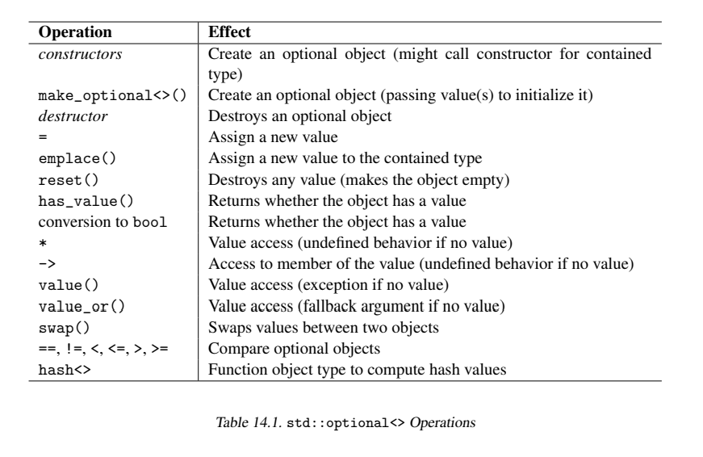

> @Date    : 2020-09-25 09:15:26
>
> @Author  : Lewis Tian (taseikyo@gmail.com)
>
> @Link    : github.com/taseikyo

# `std::optional<>`

## Table of Contents

- [15.1 使用 `std::optional<>`](#151-使用-stdoptional)
	- [15.1.1 可选的返回值](#1511-可选的返回值)
	- [15.1.2 可选的参数和数据成员](#1512-可选的参数和数据成员)
- [15.2 `std::optional<>` 的类型和操作](#152-stdoptional-的类型和操作)
	- [15.2.1 `std::optional<>` 的类型](#1521-stdoptional-的类型)
	- [15.2.2 `std::optional<>` 的操作](#1522-stdoptional-的操作)
		- [构造](#构造)
		- [访问值](#访问值)
		- [比较](#比较)
		- [修改值](#修改值)
		- [移动语义](#移动语义)
		- [哈希](#哈希)
- [15.3 特殊情况](#153-特殊情况)
	- [15.3.1 `bool` 或原生指针的可选对象](#1531-bool-或原生指针的可选对象)
	- [15.3.2 可选对象的可选对象](#1532-可选对象的可选对象)
- [15.4 后记](#154-后记)

在编程时我们*可能*会返回/传递/使用（return/pass/use）一个特定类型的对象。也就是说，我们有可能需要这样一个值也有可能不需要这样一个值。因此，我们需要一种能够模仿指针的语义，指针可以通过赋值为 `nullptr` 来表示不指向任何对象。一种处理的方法是定义该对象的同时再定义一个附加的 `bool` 类型的值作为标志来表示是否应该使用该对象。另外，`std::optional<>` 提供了一种类型安全的方法来实现这种能力

可选对象所占用的内存恰好就等于内含对象的大小加上一个 `bool` 类型的大小。因此，可选对象的大小一般比内含对象大一个字节。对于某些类型而言，该类型的可选对象的大小可能和类型本身相同，附加的 `bool` 信息有可能填充到该类型之中。可选对象不会分配堆内存，和内含对象有相同的内存对齐方式

然而，可选对象并不仅仅是一个对象加上一个 `bool` 值。例如，如果内含对象没有值，将不会为内含对象调用默认构造函数（因此，你可以给对象赋予一个默认状态）

和 `std::variant<>` 和 `std::any` 一样，可选对象有值语义。也就是说，拷贝操作被实现为深拷贝。拷贝操作会创建一个新的独立对象，该对象内的标志和值（如果原对象有的话）都是原对象的拷贝。拷贝一个没有值的 `std::optional<>` 的开销是很低的；拷贝一个有值的 `std::optional<>` 的开销和拷贝一个内含类型对象的开销是相同的。可选对象也支持 move 语义

## 15.1 使用 `std::optional<>`

`std::optional` 模拟了任意类型的一个空实例。这个实例可能是一个成员，可能是一个参数，也可能是一个返回值。你也可以认为 `std::optional<>` 是一个可能含有 0 个或 1 个对象的容器。

### 15.1.1 可选的返回值

下面的程序演示了 `std::optional<>` 被用作返回值时的能力：


```C++
// lib/optional.cpp
#include <optional>
#include <string>
#include <iostream>

// 如果可能的话将 string 转换为 int
std::optional<int> asInt(const std::string& s) {
	try {
		return std::stoi(s);
	} catch (...) {
		return std::nullopt;
	}
}

int main() {
	for (auto s : {"42", "077", "hello", "0x33"}) {
		// 将 s 转换为 int，如果可能的话使用返回值
		std::optional<int> oi = asInt(s);
		if (oi) {
			std::cout << "convert'" << s << "'to int:" << *oi << "\n";
		} else {
			std::cout << "can't convert '" << s << "' to int\n";
		}
	}
}
```

在这段程序中 `asInt()` 是一个将字符串转换为整数的函数。然而，转换可能会失败，所以使用了一个 `std::optional<>` 来让我们可以返回 *no int* 并且避免定义一个特殊的 `int` 值来表示函数转换失败

因此，我们可能会用 `stoi()` 返回的 `int` 来初始化返回值，也可能会返回 `std::nullopt` 来表示没有一个 `int` 类型的值。我们可以像下面这样实现相同的行为:

```C++
std::optional<int> asInt(const std::string&s) {
	std::optional<int> ret; // 初始化状态为没有值
	try {
		ret = std::stoi(s);
	} catch (...) {
	}
	return ret;
}
```

在 `main()` 函数中我们使用不同的字符串调用这个函数：

```C++
for (auto s : {"42", "077", "hello", "0x33"}) {
	// 将 s 转换为 int，如果成功使用返回值：
	std::optional<int> oi = asInt(s);
	...
}
```

对于每一个返回的 `std::optional<int>` 类型的 `oi`，我们可以将它作为 `bool` 类型表达式判断它是否有值并通过解引用的方式访问可选对象的值：

```C++
if (oi) {
	std::cout << "convert'" << s << "'to int:" << *oi << "\n";
}
```

注意对 0x33 调用 `asInt()` 将会返回 0 因为 `stoi()` 默认并不会以 16 进制的方式去解释字符串

还有一些处理返回值的替代实现方案，例如：

```C++
std::optional<int> oi = asInt(s);
if (oi.has_value()) {
    std::cout << "convert'" << s << "'to int:" << oi.value() << "\n";
}
```

这里，`has_value()` 用来检查是否有一个值被返回，通过 `value()` 我们可以访问它的值。`value()` 比 * 操作符更加安全：如果没有值的时候它会抛出一个异常。* 操作符应该在你确定可选对象包含值的时候使用，否则你的程序可能会陷入不确定的行为

注意我们可以通过使用新的类型 `std::string_view`（见 31.2 节）来改进 `asInt()` 函数。

### 15.1.2 可选的参数和数据成员

另一个使用 `std::optional<>` 的例子是可选的参数或者可选的数据成员：

```C++
// lib/optionalmember.cpp
#include <string>
#include <optional>
#include <iostream>

class Name {
  private:
	std::string first;
	std::optional<std::string> middle;
	std::string last;
  public:
	Name (std::string f,
	      std::optional<std::string> m,
	      std::string l)
		: first{std::move(f)}, middle{std::move(m)}, last{std::move(l)} {}
	friend std::ostream& operator << (std::ostream& strm, const Name& n) {
		strm << n.first << " ";
		if (n.middle) {
			strm << *n.middle << " ";
		}
		return strm << n.last;
	}
};

int main() {
	Name n{"Jim", std::nullopt, "Knopf"};
	std::cout << n << '\n';

	Name m{"Donald", "Ervin", "Knuth"};
	std::cout << m << '\n';
}
```

类 `Name` 代表了由一个姓，一个可选的中间名和一个名组成的名字。成员 `middle` 被定义为可选的，构造函数可以传递 `std::nullopt` 来表示没有中间名。这和中间名是一个空字符串是两种不同的状态

注意像往常的值类型一样，定义构造函数时初始化相应成员的最佳方法是以值传递参数并将参数的值搬移到成员里

【学到了，对于直接传 string 类型给类成员初始化的时候用 `std::move`】

还要注意 `std::optional<>` 改变了对成员 `middle` 的值的访问方法。使用 `middle` 作为 `bool` 表达式可以判断是否有中间名，必须使用 `*middle` 来访问真正的值。

另一个选择是通过使用 `value_or()` 成员函数来访问值，当没有值存在时这个成员函数会回滚到一个指定的值。例如，在类 `Name` 里我们可以写：

```C++
std::cout << middle.value_or("");   // 打印出中间名或空
```

## 15.2 `std::optional<>` 的类型和操作

### 15.2.1 `std::optional<>` 的类型

在 `<optional>` 头文件里 C++ 标准库像下面这样定义了类 `std::optional<>`：

```C++
namespace std {
	template<typename T> class optional;
}
```

另外，还定义了下面的类型和对象：

- `std::nullopt_t` 类型的 `nullopt` 作为可选对象无值时的值
- 异常类 `std::bad_optional_access`，它继承自 `std::exception`，当访问没有值的可选对象时会抛出这个异常。

可选对象还使用了定义在 `<utility>` 中的 `std::in_place`（类型为 `std::in_place_t`）来初始化有多个参数的可选对象（如下）。

### 15.2.2 `std::optional<>` 的操作

`std::optional` 操作表（见稍后）列出了所 `std::optional<>` 提供的所有操作。



#### 构造

特殊的构造函数允许直接向内含对象传递参数。

- 你可以创建一个没有值的可选对象。不过这样你就必须声明内含的类型：

```C++
std::optional<int> o1;
std::optional<int> o2(std::nullopt);
```

这样并不会调用内含类型的任何构造函数。

- 你可以向内含类型传递值来初始化。得益于推导指引（见 9.2 节）你不需要指明内含的类型，例如：

```C++
std::optional o3{42};       // 推导出 optional<int>
std::optional<std::string> o4{"hello"};
std::optional o5{"hello"};  // 推导出 optional<const char*>
```

- 为了用多个参数初始化一个可选对象，你必须创建一个内含对象或者添加一个 `std::in_place` 作为第一个参数（此时内含类型不能被推导出来）：

```C++
std::optional o6{std::complex{3.0, 4.0}};
std::optional<std::complex<double>> o7{std::in_place, 3.0, 4.0};
```

注意第二种方式避免了创建一个临时对象。通过使用这种形式，你甚至可以传递一个带有额外参数的初值列：

```C++
// 以 lambda 作为排序准则初始化一个 set
auto sc = [] (int x, int y) {
	return std::abs(x) < std::abs(y);
};
std::optional<std::set<int, decltype(sc)>> o8{std::in_place, {4, 8, -7, -2, 0, 5}, sc};
```

- 你可以拷贝可选对象（包括类型转换）

```C++
std::optional o5{"hello"};  // 推导出 optional<const char*>
std::optional<std::string> o9{o5};  //OK
```

注意也有一个辅助函数叫 `make_optional<>`，它允许使用单个或多个参数来初始化可选对象（不需要 `in_place` 参数）。像通常的 `make...` 函数一样它也是退化的：

```C++
auto o10 = std::make_optional(3.0);     //optional<double>
auto o11 = std::make_optional("hello"); //optional<const char*>
auto o12 = std::make_optional<std::complex<double>>(3.0, 4.0);
```

注意它并没有构造函数接受一个值并根据这个值推导应该初始化为这个值还是初始化为 `nullopt`。因此，这种情况下必须使用 `?`: 运算符。例如：

```C++
std::multimap<std::string, std::string> englishToGerman;
...
auto pos = englishToGerman.find("wisdom");
auto o13 = pos != englishToGerman.end() ? std::optional{pos->second} : std::nullopt;
```

这里，`o13` 会被初始化为 `std::optional<std::string>`，因为类模板参数推导特性会对 `std::optional{pos->second}` 进行推导。类模板参数推导对 `std::nullopt` 不起作用，但是推导表达式类型时运算符?: 会将 `std::nullopt` 的类型进行转换。

#### 访问值

你可以在一个 `bool` 表达式中使用可选对象来检查它是否含有一个值或者调用 `has_value()` 函数：

```C++
std::optional o{42};

if (o) ...          //true
if (!o) ...         //false
if (o.has_value())  //true
```

No I/O operators are defined (because there is no obvious output if the optional object has no value):

```C++
std::cout << o; // ERROR
```

提供了指针语法来访问值，通过 * 运算符你可以直接访问内含的值，通过 -> 你可以访问内含的值的成员：

```C++
std::optional o{std::pair{42, "hello"}};

auto p = *o;            // 初始化 p 为 pair<int, string>
std::cout << o->first;  // 打印出 42
```

注意这些运算符要求该对象要有值。对没有值的可选对象使用这些操作符会导致未定义行为：

```C++
std::optional<std::string> o{"hello"};
std::cout << *o;        //OK: 打印出 "hello"
o = std::nullopt;
std::cout << *o;        // 未定义行为
```

注意事实上第二个输出语句仍能通过编译并且打印出一些东西例如 "hello"，因为该可选对象的底层内存还没有被修改。然而，你绝不应该依赖这一点。如果你不知道一个可选对象是否有值，你必须像下面这样写：

```C++
if (o)  std::cout << *o;        //OK
```

或者，你可以使用 `value()`，它会在没有值时抛出一个 `std::bad_optional_access` 异常：

```C++
std::cout << o.value();         //OK(如果没有值时抛出异常)
```

`std::bad_optional_access` 直接继承自 `std::exception`。

请注意，* 和 value() 都返回包含的对象引用。 因此，在调用这些操作以获取临时返回值时必须小心。例如，对于返回可选字符串的函数：

```C++
std::optional<std::string> getString();
```

将任何 optional 的返回值赋值给新对象始终是安全的：

```C++
auto a = getString().value(); // OK: copy of contained object or exception
```

直接使用返回的值（而不是将其作为参数传递）会带来麻烦

```C++
auto b = *getString(); // ERROR: undefined behavior if std::nullopt
const auto& r1 = getString().value(); // ERROR: reference to deleted contained object
auto&& r2 = getString().value(); // ERROR: reference to deleted contained object
```

引用的问题在于，按照规则，它们会延长 value() 返回值的生存期，而不是 getString() 返回的可选对象的生存期。 因此，r1 和 r2 指的是不再存在的值，使用它们会导致未定义的行为

请注意，使用 range for 循环时很容易出现此问题

```C++
std::optional<std::vector<int>> getVector();
...
for (int i : getVector().value()) { // ERROR: iterate over deleted vector
	std::cout << i << '\n';
}
```

请注意，迭代返回的 int 非可选向量是可行的。 因此，请勿盲目地将函数 foo() 的返回类型替换为相应的可选类型。 而是调用 foo().value()

最后，你可以设置一个回滚值，当可选对象没有值时就会使用这个回滚值：

```C++
std::cout << o.value_or("fallback");    //OK(如果没有值时输出 fallback)
```

请注意，value_or() 返回值，value() 返回引用，对于下面的调用，可能会分配内存，但你调用 value 则不会

```C++
std::cout << middle.value_or("");
std::cout << o.value_or("fallback");
```

但是，如果在临时对象（右值）上调用，则 value_or() 将按值返回已移动的包含值，这意味着该包含值不是复制构造的。这是使 value_or() 适用于仅移动类型的唯一方法，因为左值的重载要求所包含的对象是可复制的

if called on a temporary object (an rvalue), value_or() returns the moved contained value by value, meaning that the contained value is not copy constructed. This is the only way to make value_or() work for types that are move-only, because the overload for lvalues requires the contained object to be copyable.

#### 比较

你可以使用比较运算符。操作数可以是可选对象、内含类型或者 `std::nullopt`。

- 如果两个操作数都是带有值的对象，将会使用内含类型的运算符就行比较。
- 如果两个操作数都是没有值的对象那么当使用 == 时返回 true 使用其他运算符时返回 false
- 如果一个操作数是没有值的对象另一个不是，那么没有值的操作数小于另一个操作数。

```C++
std::optional<int> o0;
std::optional<int> o1{42};

o0 == std::nullopt; // 返回 true
o0 == 42;           // 返回 false
o0 < 42             // 返回 true
o0 > 42             // 返回 false
o1 == 42            // 返回 true
o0 < o1             // 返回 true
```

这意味着内含 `unsigned int` 类型的对象在没有值时小于 0，`bool` 类型的对象在没有值时也小于 0：

```C++
std::optional<unsigned> uo;
uo < 0;     // 返回 true
uo < -42;   // 返回 true
std::optional<bool> bo;
bo < false; // 返回 true
```

另外，底层类型的隐式类型转换也是可以的：

```C++
std::optional<int> o1{42};
std::optional<double> o2{42.0};

o2 == 42;       // 返回 true
o1 == o2;       // 返回 true
```

注意可选类型的 `bool` 值或原生指针值（见 15.3.1 节）可能会导致一些奇怪的结果。

#### 修改值

赋值操作符和 `emplace()` 操作仍然存在：

```C++
std::optional<std::complex<double>> o;  // 没有值
std::optional ox{77};                   // 值为 77 的 optional<int>

o = 42;                 // 值变为(42.0, 0.0)
o = {9.9, 4.4};         // 值变为(9.9, 4.4)
o = ox;                 //OK，int 隐式转换为 complex<double>
o = std::nullopt;       //o 不再有值
o.emplace(5.5, 7.7);    // 值变为(5.5, 7.7)
```

给可选对象赋值为 `std::mullopt` 会移除原本的值，这会调用内含类型的构造函数。你可以通过调用 `reset()` 函数来实现相同的效果：

```C++
o.reset();      //o 不再有值
```

或者使用空花括号赋值：

```C++
o = {};         //o 不再有值
```

最后，我们也可以使用 * 修改值，因为它以引用的方式返回值。然而，注意这种方式首先需要对象原本就持有值：

```C++
std::optional<std::complex<double>> o;
*o = 42;        // 未定义行为
...
if (o) {
    *o = 88;            //OK: 值变为 complex(88.0, 0.0)
    *o = {1.2, 3.4};    //OK: 值变为 complex(1.2, 3.4)
}
```

#### 移动语义

`std::optional<>` 也支持 move 语义。如果你搬移了整个对象，那么新的对象会复制旧对象的状态并搬移旧对象内含的值。结果是旧对象的状态仍然保持保持不变，但其值变为不确定状态

你既可以将内含的值搬移出去，也可以将一个值搬移进去。例如：

```C++
std::optional<std::string> os;
std::string s = "a very very very long string";
os = std::move(s);                  //OK, 移动
std::string s2 = *os;               //OK, 复制
std::string s3 = std::move(*os);    //OK, 移动
```

注意最后一条语句之后 `os` 仍然有一个字符串类型的值，但就像通常值被搬移走的对象一样，此时该值是不确定的。因此，只要你不对它的值做任何假设你就可以放心的使用它，例如你可以给它赋予一个新的字符串值

注意，一些重载确保临时的可选内容被移动。考虑一个返回可选字符串的函数：

```C++
std::optional<std::string> func();
std::string s4 = func().value(); // OK, moves
std::string s5 = *func(); // OK, moves
```

通过为相应的成员函数提供右值重载，可以实现此行为：

```C++
namespace std {
template<typename T>
class optional {
	...
	constexpr T& operator*() &;
	constexpr const T& operator*() const&;
	constexpr T&& operator*() &&;
	constexpr const T&& operator*() const&&;
	constexpr T& value() &;
	constexpr const T& value() const&;
	constexpr T&& value() &&;
	constexpr const T&& value() const&&;
};
}
```

换句话说，你还可以执行以下操作：

```C++
std::optional<std::string> os;
std::string s6 = std::move(os).value(); // OK, moves
```

#### 哈希

可选对象的哈希值等于其内含值的哈希值（如果有值的话）。

## 15.3 特殊情况

某些特定类型的可选对象可能会导致特殊或者预料之外的情况

### 15.3.1 `bool` 或原生指针的可选对象

注意 `bool` 类型和 `bool` 类型的可选对象的比较运算符会有不同的语义。如果内含对象类型为 `bool` 或指针类型会导致令人迷惑的行为：例如：

```C++
std::optional<bool> ob{false};      // 有值，值为 false
if (!ob) ...                        // 返回 false
if (ob == false) ...                // 返回 true

std::optional<int*> op{nullptr};
if (!op) ...                        // 返回 false
if (op == nullptr) ...              // 返回 true
```

### 15.3.2 可选对象的可选对象

原则上你也可以定义可选对象的可选对象：

```C++
std::optional<std::optional<std::string>> oos1;
std::optional<std::optional<std::string>> oos2 = "hello";
std::optional<std::optional<std::string>>
    oos3{std::in_place, std::in_place, "hello"};

std::optional<std::optional<std::complex<double>>>
    ooc{std::in_place, std::in_place, 4.2, 5.3};
```

【禁 止 套 娃】

你也可以用隐式转换的方式进行赋值：

```C++
oos1 = "hello";     //OK: 赋了一个新值
ooc.emplace(std::in_place, 7.2, 8.3);
```

一个可选对象的可选对象既可以是外层没有值，也可以是内层没有值，这两者的语义是不同的：

```C++
*oos1 = std::nullopt;       // 内层可选对象没有值
oos1 = std::nullopt;        // 外层可选对象没有值
```

所以你必须对这种对象进行一些特殊处理：

```C++
if (!oos1)  std::cout << "no value\n";
if (oos1 && !*oos1) std::cout << "no inner value\n";
if (oos1 && *oos1) std::cout << "value:" << **oos1 << '\n';
```

这样的话表示无值的语义就有两种，使用一个带两个 `bool` 类型或状态（见 16.1 节）的 `std::variant<>`（见第 16 章）将会是一个更好的选择

## 15.4 后记

可选对象最早在 2005 年由 Fernando Cacciola 在 [https://wg21.link/n1878](https://wg21.link/n1878) 上提出，Boost.Optional 作为一个参考实现。这个类型由 Fernando Cacciola 和 Andrzej Krzemienski 在 [https://wg21.link/n3793](https://wg21.link/n3793) 上提出加入标准库技术规范

将这个类型和其他组件纳入 C++17 的提案由 Beman Dawes 和 Alisdair Meredith 在 [https://wg21.link/p0220r1](https://wg21.link/p0220r1) 上提出

Tony van Eerd 在 [https://wg21.link/n3765](https://wg21.link/n3765) 和[https://wg21.link/p0307r2](https://wg21.link/p0307r2)上显著地改进了可选类型的比较运算符的语义。Vicente J. Botet Escriba 在 [https://wg21.link/p0032r3](https://wg21.link/p0032r3) 协调了可选类型和 `std::variant<>`，`std::any` 间的 API。Jonathan Wakely 在 [https://wg21.link/p0504r0](https://wg21.link/p0504r0) 上修复了 `in_place` 标签类型的行为
