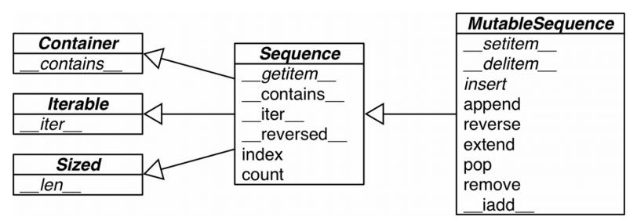

> @Date    : 2020-09-17 14:49:18
>
> @Author  : Lewis Tian (taseikyo@gmail.com)
>
> @Link    : github.com/taseikyo

# 序列构成的数组

## Table of Contents

- [2.1 内置序列类型概览](#21-内置序列类型概览)
- [2.2 列表推导和生成器表达式](#22-列表推导和生成器表达式)
	- [2.2.1 列表推导和可读性](#221-列表推导和可读性)
	- [2.2.2 列表推导同 filter 和 map 的比较](#222-列表推导同-filter-和-map-的比较)
	- [2.2.3 笛卡儿积](#223-笛卡儿积)
	- [2.2.4 生成器表达式](#224-生成器表达式)
- [2.3 元组不仅仅是不可变的列表](#23-元组不仅仅是不可变的列表)
	- [2.3.1 元组和记录](#231-元组和记录)
	- [2.3.2 元组拆包](#232-元组拆包)
	- [2.3.3 嵌套元组拆包](#233-嵌套元组拆包)
	- [2.3.4 具名元组](#234-具名元组)
	- [2.3.5 作为不可变列表的元组](#235-作为不可变列表的元组)
- [2.4 切片](#24-切片)
	- [2.4.1 为什么切片和区间会忽略最后一个元素](#241-为什么切片和区间会忽略最后一个元素)
	- [2.4.2 对对象进行切片](#242-对对象进行切片)
	- [2.4.3 多维切片和省略](#243-多维切片和省略)
	- [2.4.4 给切片赋值](#244-给切片赋值)
- [2.5 对序列使用 + 和 \*](#25-对序列使用--和-)
	- [2.5.1 建立由列表组成的列表](#251-建立由列表组成的列表)
- [2.6 序列的增量赋值](#26-序列的增量赋值)
	- [一个关于 += 的谜题](#一个关于--的谜题)
- [2.7 list.sort 方法和内置函数 sorted](#27-listsort-方法和内置函数-sorted)
- [2.8 用 bisect 来管理已排序的序列](#28-用-bisect-来管理已排序的序列)
	- [2.8.1 用 bisect 来搜索](#281-用-bisect-来搜索)
- [2.9 当列表不是首选时](#29-当列表不是首选时)
	- [2.9.1 数组](#291-数组)
	- [2.9.2 内存视图](#292-内存视图)
	- [2.9.3 NumPy 和 SciPy](#293-numpy-和-scipy)
	- [2.9.4 双向队列和其他形式的队列](#294-双向队列和其他形式的队列)
- [2.11 延伸阅读](#211-延伸阅读)
	- [杂谈](#杂谈)
		- [元组的本质](#元组的本质)
		- [优雅是简约之父](#优雅是简约之父)
		- [扁平序列和容器序列](#扁平序列和容器序列)
		- [混合类型列表](#混合类型列表)
		- [key 参数很妙](#key-参数很妙)
		- [Oracle、 Google 和 Timbot 之间的八卦](#oracle-google-和-timbot-之间的八卦)

## 2.1 内置序列类型概览

Python 标准库用 C 实现了丰富的序列类型：

- 容器序列，下面这些序列能存放不同类型的数据
	- list
	- tuple
	- collections.deque
- 扁平序列，这类序列只能容纳一种类型
	- str
	- bytes
	- bytearray
	- memoryview
	- array.array

容器序列存放的是它们所包含的任意类型的对象的*引用*，而扁平序列里存放的是*值*而不 是引用。换句话说，扁平序列其实是一段连续的内存空间。由此可见扁平序列其实更加紧 凑，但是它里面只能存放诸如字符、字节和数值这种基础类型。

序列类型还能按照能否被修改来分类

- 可变序列
	- list
	- bytearray
	- array.array
	- collections.deque
	- memoryview
- 不可变序列
	- tuple
	- str
	- bytes

图 2-1 显示了可变序列（MutableSequence）和不可变序列（Sequence）的差异，同时 也能看出前者从后者那里继承了一些方法。虽然内置的序列类型并不是直接从 Sequence 和 MutableSequence 这两个抽象基类（Abstract Base Class，ABC）继承而来的，但是了 解这些基类可以帮助我们总结出那些完整的序列类型包含了哪些功能。



图 2-1：这个 UML 类图列举了 collections.abc 中的几个类（超类在左边，箭头从子类指向超类，斜体名称代表抽象类和抽象方法）

## 2.2 列表推导和生成器表达式

列表推导（list comprehension）是构建列表（list）的快捷方式，而生成器表达式（generator expression）则可以用来创建其他任何类型的序列。

> 很多 Python 程序员都把列表推导（list comprehension）简称为 listcomps，生成式表达器（generator expression）则称为 genexps。

### 2.2.1 列表推导和可读性

通常的原则是，只用列表推导来创建新的列表，并且尽量保持简短。如果列表推导的代码超过了两行，你可能就要考虑是不是得用 for 循环重写了。

> Python 会忽略代码里 []、{} 和 () 中的换行，因此如果你的代码里有多行的列表、列表推导、生成器表达式、字典这一类的，可以省略不太好看的续行符 \。

列表推导不会再有变量泄漏的问题

```Python
Python 2.7.6 (default, Mar 22 2014, 22:59:38)
[GCC 4.8.2] on linux2
Type "help", "copyright", "credits" or "license" for more information.
>>> x = 'my precious'
>>> dummy = [x for x in 'ABC']
>>> x
'C'
```

x 原本的值被取代了，但是这种情况在 Python 3 中是不会出现的。

列表推导、生成器表达式，以及同它们很相似的集合（set）推导和字典（dict）推导，在 Python 3 中都有了自己的局部作用域，就像函数似的。表达式内部的变量和赋值只在局部起作用，表达式的上下文里的同名变量还可以被正常引用，局部变量并不会影响到它们。

```Python
>>> x = 'ABC'
>>> dummy = [ord(x) for x in x]
>>> x
'ABC'
>>> dummy
[65, 66, 67]
```

### 2.2.2 列表推导同 filter 和 map 的比较

filter 和 map 合起来能做的事情，列表推导也可以做，而且还不需要借助难以理解和阅读的 lambda 表达式。

### 2.2.3 笛卡儿积

如果你需要一个列表，列表里是 3 种不同尺寸的 T 恤衫，每个尺寸都有 2 个颜色，示例 2-4 用列表推导算出了这个列表，列表里有 6 种组合。

示例 2-4 使用列表推导计算笛卡儿积

```Python
>>> colors = ['black', 'white']
>>> sizes = ['S', 'M', 'L']
>>> tshirts = [(color, size) for color in colors for size in sizes]
>>> tshirts
[('black', 'S'), ('black', 'M'), ('black', 'L'), ('white', 'S'),
('white', 'M'), ('white', 'L')]
>>> for color in colors:
...     for size in sizes:
...         print((color, size))
...
('black', 'S')
('black', 'M')
('black', 'L')
('white', 'S')
('white', 'M')
('white', 'L')
>>> tshirts = [(color, size) for size in sizes
...                          for color in colors]
>>> tshirts
[('black', 'S'), ('white', 'S'), ('black', 'M'), ('white', 'M'),
('black', 'L'), ('white', 'L')]
```

第一个 `tshirts` 是先以颜色后尺码排列；第二个 `tshirts` 依照先尺码后颜色的顺序来排列。区别在于从句的顺序。

列表推导的作用只有一个：生成列表。

### 2.2.4 生成器表达式

虽然也可以用列表推导来初始化元组、数组或其他序列类型，但是生成器表达式是更好的选择。这是因为生成器表达式背后遵守了迭代器协议，可以逐个地产出元素，而不是先建立一个完整的列表，然后再把这个列表传递到某个构造函数里。

生成器表达式的语法跟列表推导差不多，只不过把方括号换成圆括号而已。

```Python
>>> symbols = '$¢£¥€¤'
>>> tuple(ord(symbol) for symbol in symbols)
(36, 162, 163, 165, 8364, 164)
>>> import array
>>> array.array('I', (ord(symbol) for symbol in symbols))
array('I', [36, 162, 163, 165, 8364, 164])
```

array 的构造方法需要两个参数，因此括号是必需的。array 构造方法的第一个参数指定了数组中数字的存储方式。2.9.1 节中有更多关于数组的详细讨论。

## 2.3 元组不仅仅是不可变的列表

有些 Python 入门教程把元组称为 "不可变列表"，然而这并没有完全概括元组的特点。除了用作不可变的列表，它还可以用于没有字段名的记录。

### 2.3.1 元组和记录

元组其实是对数据的记录：元组中的每个元素都存放了记录中一个字段的数据，外加这个字段的位置。正是这个位置信息给数据赋予了意义。

如果只把元组理解为不可变的列表，那其他信息 —— 它所含有的元素的总数和它们的位置 —— 似乎就变得可有可无。但是如果把元组当作一些字段的集合，那么数量和位置信息就 变得非常重要了。

### 2.3.2 元组拆包

最好辨认的元组拆包形式就是平行赋值，也就是说把一个可迭代对象里的元素，一并赋值到由对应的变量组成的元组中。

```Python
>>> lax_coordinates = (33.9425, -118.408056)
>>> latitude, longitude = lax_coordinates # 元组拆包
>>> b, a = a, b
```

还可以用 * 运算符把一个可迭代对象拆开作为函数的参数

```Python
>>> divmod(20, 8)
(2, 4)
>>> t = (20, 8)
>>> divmod(*t)
(2, 4)
>>> quotient, remainder = divmod(*t)
```

在进行拆包的时候，我们不总是对元组里所有的数据都感兴趣，`_` 占位符能帮助处理这种情况。

> 如果做的是国际化软件，那么 _ 可能就不是一个理想的占位符，因为它也是 gettext.gettext 函数的常用别名，gettext 模块的文档（https://docs.python.org/3/library/gettext.html ）里提到了这一点。在其他情况下，`_` 会是一个很好的占位符。

除此之外，在元组拆包中使用 * 也可以帮助我们把注意力集中在元组的部分元素上。

```Python
>>> a, b, *rest = range(5)
>>> a, b, rest
(0, 1, [2, 3, 4])
```

在平行赋值中，* 前缀只能用在一个变量名前面，但是这个变量可以出现在赋值表达式的任意位置：

```Python
>>> a, *body, c, d = range(5)
>>> a, body, c, d
(0, [1, 2], 3, 4)
>>> *head, b, c, d = range(5)
>>> head, b, c, d
([0, 1], 2, 3, 4)
```

### 2.3.3 嵌套元组拆包

接受表达式的元组可以是嵌套式的，例如 (a, b, (c, d))。只要这个接受元组的嵌套结构符合表达式本身的嵌套结构，Python 就可以作出正确的对应。

元组已经设计得很好用了，但作为记录来用的话，还是少了一个功能：我们时常会需要给记录中的字段命名。namedtuple 函数的出现帮我们解决了这个问题。

### 2.3.4 具名元组

collections.namedtuple 是一个工厂函数，它可以用来构建一个带字段名的元组和一个有名字的类 —— 这个带名字的类对调试程序有很大帮助。

> 用 namedtuple 构建的类的实例所消耗的内存跟元组是一样的，因为字段名都被存在对应的类里面。这个实例跟普通的对象实例比起来也要小一些，因为 Python 不会用 `__dict__` 来存放这些实例的属性。

```Python
In [1]: from collections import namedtuple

In [2]: City = namedtuple('City', 'name country population coordinates')

In [3]: tokyo = City('Tokyo', 'JP', 36.933, (35.689722, 139.691667))

In [4]: tokyo
Out[4]: City(name='Tokyo', country='JP', population=36.933, coordinates=(35.689722, 139.691667))

In [5]: tokyo.population
Out[5]: 36.933

In [6]: tokyo.coordinates
Out[6]: (35.689722, 139.691667)

In [7]: tokyo[1]
Out[7]: 'JP'
```

创建一个具名元组需要两个参数，一个是类名，另一个是类的各个字段的名字。后者可以是由数个字符串组成的可迭代对象，或者是由空格分隔开的字段名组成的字符串。

你可以通过字段名或者位置（tokyo.country or tokyo[1]）来获取一个字段的信息。

除了从普通元组那里继承来的属性之外，具名元组还有一些自己专有的属性。示例 2-10 中就展示了几个最有用的： `_fields` 类属性、类方法 `_make(iterable)` 和实例方法 `_asdict()`

```Python
In [8]: City._fields
Out[8]: ('name', 'country', 'population', 'coordinates')

In [9]: LatLong = namedtuple('LatLong', 'lat long')

In [10]: delhi_data = ('Delhi NCR', 'IN', 21.935, LatLong(28.613889, 77.208889))

In [11]: delhi = City._make(delhi_data)

In [12]:  delhi._asdict()
Out[12]:
{'name': 'Delhi NCR',
 'country': 'IN',
 'population': 21.935,
 'coordinates': LatLong(lat=28.613889, long=77.208889)}
```

- `_fields` 属性是一个包含这个类所有字段名称的元组
- 用 `_make()` 通过接受一个可迭代对象来生成这个类的一个实例，它的作用跟 `City(*delhi_data)` 是一样的
- `_asdict()` 把具名元组以 collections.OrderedDict 的形式返回

现在我们知道了，元组是一种很强大的可以当作记录来用的数据类型。它的第二个角色则
是充当一个不可变的列表。

### 2.3.5 作为不可变列表的元组

如果要把元组当作列表来用的话，最好先了解一下它们的相似度如何。

|                           | 列 表 | 元 组 |                                                                      |
|---------------------------|-------|-------|---------------------------------------------------------------------|
| `s.__add__(s2)`           | •     | •     | s + s2，拼接                                                         |
| `s.__iadd__(s2)`          | •     |       | s += s2，就地拼接                                                    |
| s.append(e)               | •     |       | 在尾部添加一个新元素                                                  |
| s.clear()                 | •     |       | 删除所有元素                                                         |
| `s.__contains__(e)`       | •     | •     | s 是否包含 e                                                         |
| s.copy()                  | •     |       | 列表的浅复制                                                         |
| s.count(e)                | •     | •     | e 在 s 中出现的次数                                                  |
| `s.__delitem__(p)`        | •     |       | 把位于 p 的元素删除                                                  |
| s.extend(it)              | •     |       | 把可迭代对象 it 追加给 s                                             |
| `s.__getitem__(p)`        | •     | •     | s[p]，获取位置 p 的元素                                              |
| `s.__getnewargs__()`      |       | •     | 在 pickle 中支持更加优化的序列化                                      |
| s.index(e)                | •     | •     | 在 s 中找到元素 e 第一次出现的位置                                    |
| s.insert(p, e)            | •     |       | 在位置 p 之前插入元素e                                               |
| `s.__iter__()`            | •     | •     | 获取 s 的迭代器                                                      |
| `s.__len__()`             | •     | •     | len(s)，元素的数量                                                   |
| `s.__mul__(n)`            | •     | •     | s * n，n 个 s 的重复拼接                                            |
| `s.__imul__(n)`           | •     |       | s *= n，就地重复拼接                                                 |
| `s.__rmul__(n)`           | •     | •     | n * s，反向拼接 *                                                    |
| s.pop([p])                | •     |       | 删除最后或者是（可选的）位于 p 的元素，并返回它的值                      |
| s.remove(e)               | •     |       | 删除 s 中的第一次出现的 e                                             |
| s.reverse()               | •     |       | 就地把 s 的元素倒序排列                                               |
| `s.__reversed__()`        | •     |       | 返回 s 的倒序迭代器                                                   |
| `s.__setitem__(p, e)`     | •     |       | s[p] = e，把元素 e 放在位置p，替代已经在那个位置的元素                  |
| s.sort([key], [reverse])  | •     |       | 就地对 s 中的元素进行排序，可选的参数有键（key）和是否倒序 （reverse）  |

## 2.4 切片

在 Python 里，像列表（list）、元组（tuple）和字符串（str）这类序列类型都支持切片操作，但是实际上切片操作比人们所想象的要强大很多。

### 2.4.1 为什么切片和区间会忽略最后一个元素

在切片和区间操作里不包含区间范围的最后一个元素是 Python 的风格，这个习惯符合 Python、C 和其他语言里以 0 作为起始下标的传统。

- 当只有最后一个位置信息时，我们也可以快速看出切片和区间里有几个元素： range(3) 和 my_list[:3] 都返回 3 个元素。
- 当起止位置信息都可见时，我们可以快速计算出切片和区间的长度，用后一个数减去第一个下标（stop - start）即可。
- 我们可以利用任意一个下标来把序列分割成不重叠的两部分，只要写成 `my_list[:x]` 和 `my_list[x:]` 就可以了

### 2.4.2 对对象进行切片

我们还可以用 `s[a:b:c]` 的形式对 s 在 a 和 b 之间以 c 为间隔取值。c 的值还可以为负，负值意味着反向取值。

`a:b:c` 这种用法只能作为索引或者下标用在 [] 中来返回一个切片对象： `slice(a, b, c)`。在 10.4.1 节中会讲到，对 `seq[start:stop:step]` 进行求值的时候，Python 会调用 `seq.__getitem__(slice (start, stop, step))`。就算你还不会自定义序列类型，了解一下切片对象也是有好处的。例如你可以给切片命名，就像电子表格软件里给单元格区域取名字一样。

示例 2-11 纯文本文件形式的收据以一行字符串的形式被解析

```Python
>>> invoice = """
... 0.....6................................40........52...55........
... 1909 Pimoroni PiBrella $17.50 3 $52.50
... 1489 6mm Tactile Switch x20 $4.95 2 $9.90
... 1510 Panavise Jr. - PV-201 $28.00 1 $28.00
... 1601 PiTFT Mini Kit 320x240 $34.95 1 $34.95
... """
>>> SKU = slice(0, 6)
>>> DESCRIPTION = slice(6, 40)
>>> UNIT_PRICE = slice(40, 52)
>>> QUANTITY = slice(52, 55)
>>> ITEM_TOTAL = slice(55, None)
>>> line_items = invoice.split('\n')[2:]
>>> for item in line_items:
...     print(item[UNIT_PRICE], item[DESCRIPTION])
...
	$17.50 Pimoroni PiBrella
	$4.95 6mm Tactile Switch x20
	$28.00 Panavise Jr. - PV-201
	$34.95 PiTFT Mini Kit 320x240
```

如果从 Python 用户的角度出发，切片还有个两个额外的功能：多维切片和省略表示法（...）。

### 2.4.3 多维切片和省略

[] 运算符里还可以使用以逗号分开的多个索引或者是切片，NumPy 就用到了这个特性，二维的 numpy.ndarray 就可以用 `a[i, j]` 这种形式来获取，或是用 `a[m:n, k:l]` 的方式来得到二维切片。稍后的示例 2-22 会展示这个用法。要正确处理这种 [] 运算符的话，对象的特殊方法 `__getitem__` 和 `__setitem__` 需要以元组的形式来接收 a[i, j] 中的索引。也就是说，如果要得到 a[i, j] 的值，Python 会调用 `a.__getitem__((i, j))`

Python 内置的序列类型都是一维的，因此它们只支持单一的索引，成对出现的索引是没有用的。

省略（ellipsis）的正确书写方法是三个英语句号（...），而不是 Unicdoe 码位 U+2026 表示的半个省略号（...）。省略在 Python 解析器眼里是一个符号，而实际上它是 Ellipsis 对象的别名，而 Ellipsis 对象又是 ellipsis 类的单一实例。它可以当作切片规范的一部分，也可以用在函数的参数清单中，比如 f (a, ..., z)，或 a [i:...]。在 NumPy 中，... 用作多维数组切片的快捷方式。如果 x 是四维数组，那么 x[i, ...] 就是 x[i, :, :, :] 的缩写。如果想了解更多，请参见 "Tentative NumPy Tutorial"（http://wiki.scipy.org/Tentative_NumPy_Tutorial ）

除了用来提取序列里的内容，切片还可以用来就地修改可变序列，也就是说修改的时候不需要重新组建序列。

### 2.4.4 给切片赋值

如果把切片放在赋值语句的左边，或把它作为 del 操作的对象，我们就可以对序列进行嫁接、切除或就地修改操作。

```Python
>>> l = list(range(10))
>>> l
[0, 1, 2, 3, 4, 5, 6, 7, 8, 9]
>>> l[2:5] = [20, 30]
>>> l
[0, 1, 20, 30, 5, 6, 7, 8, 9]
>>> del l[5:7]
>>> l
[0, 1, 20, 30, 5, 8, 9]
>>> l[3::2] = [11, 22]
>>> l
[0, 1, 20, 11, 5, 22, 9]
>>> l[2:5] = 100
Traceback (most recent call last):
File "<stdin>", line 1, in <module>
TypeError: can only assign an iterable
>>> l[2:5] = [100]
>>> l
[0, 1, 100, 22, 9]
```

如果赋值的对象是一个切片，那么赋值语句的右侧必须是个可迭代对象。即便只有单独一个值，也要把它转换成可迭代的序列。

序列的拼接操作可谓是众所周知，任何一本 Python 入门教材都会介绍 + 和 * 的用法，但是在这些用法的背后还有一些可能被忽视的细节。

## 2.5 对序列使用 + 和 *

+ 和 * 都不修改原有的操作对象，而是构建一个全新的序列。

> 如果在 a * n 这个语句中，序列 a 里的元素是对其他可变对象的引用的话，你就需要格外注意了，因为这个式子的结果可能会出乎意料。比如，你想用 my_list = [[]] * 3 来初始化一个由列表组成的列表，但是你得到的列表里包含 的 3 个元素其实是 3 个引用，而且这 3 个引用指向的都是同一个列表。这可能不是你想要的效果。

### 2.5.1 建立由列表组成的列表

示例 2-12 一个包含 3 个列表的列表，嵌套的 3 个列表各自有 3 个元素来代表井字游戏的一行方块


```Python
>>> board = [['_'] * 3 for i in range(3)]
>>> board
[['_', '_', '_'], ['_', '_', '_'], ['_', '_', '_']]
>>> board[1][2] = 'X'
>>> board
[['_', '_', '_'], ['_', '_', 'X'], ['_', '_', '_']]
```

上面代码建立一个包含 3 个列表的列表，被包含的 3 个列表各自有 3 个元素。

示例 2-13 含有 3 个指向同一对象的引用的列表是毫无用处的

```Python
>>> weird_board = [['_'] * 3] * 3 ①
>>> weird_board
[['_', '_', '_'], ['_', '_', '_'], ['_', '_', '_']]
>>> weird_board[1][2] = 'O'
>>> weird_board
[['_', '_', 'O'], ['_', '_', 'O'], ['_', '_', 'O']]
```

① 外面的列表其实包含 3 个指向同一个列表的引用。当我们不做修改的时候，看起来都
还好。一旦我们试图标记第 1 行第 2 列的元素，就立马暴露了列表内的 3 个引用指向同一个
对象的事实。

## 2.6 序列的增量赋值

增量赋值运算符 += 和 `*=` 的表现取决于它们的第一个操作对象。+= 背后的特殊方法是` __iadd__` （用于"就地加法"）。但是如果一个类没有实现这个方
法的话，Python 会退一步调用 `__add__`

```Python
>>> a += b
```

如果 a 实现了 `__iadd__` 方法，就会调用这个方法。同时对可变序列（例如 list、bytearray 和 array.array）来说，a 会就地改动，就像调用了 `a.extend(b)` 一样。但是如果 a 没有实现 `__iadd__` 的话，a += b 这个表达式的效果就变得跟 a = a + b 一样了：首先计算 a + b，得到一个新的对象，然后赋值给 a。

可变序列一般都实现了 `__iadd__` 方法，因此 += 是就地加法。而不可变序列
根本就不支持这个操作，对这个方法的实现也就无从谈起。

下面展示的是 `*=` 在可变和不可变序列上的作用

```Python
In [24]: l = [1,2,3]

In [25]: id(l)
Out[25]: 1825357169280

In [26]: l *= 2

In [27]: l
Out[27]: [1, 2, 3, 1, 2, 3]

In [28]: id(l)
Out[28]: 1825357169280

In [29]: t = (1,2,3)

In [30]: id(t)
Out[30]: 1823226739584

In [31]: t *= 2

In [32]: id(t)
Out[32]: 1823233080288

In [33]: t
Out[33]: (1, 2, 3, 1, 2, 3)
```

对不可变序列进行重复拼接操作的话，效率会很低，因为每次都有一个新对象，而解释器需要把原来对象中的元素先复制到新的对象里，然后再追加新的元素。（str 是一个例外，因为对字符串做 += 实在是太普遍了，所以 CPython 对它做了优化。为 str 初始化内存的时候，程序会为它留出额外的可扩展空间，因此进行增量操作的时候，并不会涉及复制原有字符串到新位置这类操作）

### 一个关于 += 的谜题

示例 2-14 一个谜题

```Python
>>> t = (1, 2, [30, 40])
>>> t[2] += [50, 60]
```

到底会发生下面 4 种情况中的哪一种？

- a. t 变成 (1, 2, [30, 40, 50, 60])。
- b. 因为 tuple 不支持对它的元素赋值，所以会抛出 TypeError 异常。
- c. 以上两个都不是。
- d. a 和 b 都是对的。

我刚看到这个问题的时候，异常确定地选择了 b，但其实答案是 d，也就是说 a 和 b 都是对的！

> 如果写成 t[2].extend([50, 60]) 就能避免这个异常。确实是这样，但这个例子是为了展示这种奇怪的现象而专门写的。

没人料到的结果： t[2] 被改动了，但是也有异常抛出

```Python
In [41]: t = (1, 2, [30, 40])

In [42]: t[2] += [50, 60]
---------------------------------------------------------------------------
TypeError                                 Traceback (most recent call last)
<ipython-input-42-d877fb0e9d36> in <module>
----> 1 t[2] += [50, 60]

TypeError: 'tuple' object does not support item assignment

In [43]: t
Out[43]: (1, 2, [30, 40, 50, 60])
```

这其实是个非常罕见的边界情况，在 15 年的 Python 生涯中，我还没见过谁在这个地方吃过亏。

至此我得到了 3 个教训：

- 不要把可变对象放在元组里面。
- 增量赋值不是一个原子操作。我们刚才也看到了，它虽然抛出了异常，但还是完成了操作。
- 查看 Python 的字节码并不难，而且它对我们了解代码背后的运行机制很有帮助。

## 2.7 list.sort 方法和内置函数 sorted

list.sort 方法会就地排序列表，也就是说不会把原列表复制一份。这是 Python 的一个惯例：如果一个函数或者方法对对象进行的是就地改动，那它就应该返回 None，好让调用者知道传入的参数发生了变动，而且并未产生新的对象。

与 list.sort 相反的是内置函数 sorted，它会新建一个列表作为返回值。这个方法可以接受任何形式的可迭代对象作为参数，甚至包括不可变序列或生成器（见第 14 章）。而不管 sorted 接受的是怎样的参数，它最后都会返回一个列表。

## 2.8 用 bisect 来管理已排序的序列

bisect 模块包含两个主要函数，bisect 和 insort，两个函数都利用二分查找算法来在有序序列中查找或插入元素。

### 2.8.1 用 bisect 来搜索

bisect(haystack, needle) 在 haystack（干草垛）里搜索 needle（针）的位置，该位置满足的条件是，把 needle 插入这个位置之后，haystack 还能保持升序。也就是在说这个函数返回的位置前面的值，都小于或等于 needle 的值。其中 haystack 必须是一个有序的序列。你可以先用 bisect(haystack, needle) 查找位置 index，再用 haystack.insert(index, needle) 来插入新值。但你也可用 insort 来一步到位，并且后者的速度更快一些。

## 2.9 当列表不是首选时

虽然列表既灵活又简单，但面对各类需求时，我们可能会有更好的选择。比如，要存放 1000 万个浮点数的话，数组（array）的效率要高得多，因为数组在背后存的并不是 float 对象，而是数字的机器翻译，也就是字节表述。这一点就跟 C 语言中的数组一 样。再比如说，如果需要频繁对序列做先进先出的操作，deque（双端队列）的速度应该会更快。

### 2.9.1 数组

如果我们需要一个只包含数字的列表，那么 array.array 比 list 更高效。数组支持所 有跟可变序列有关的操作，包括 pop、insert 和 extend。另外，数组还提供从文件 读取和存入文件的更快的方法，如 frombytes 和 tofile。

Python 数组跟 C 语言数组一样精简。创建数组需要一个类型码，这个类型码用来表示在底层的 C 语言应该存放怎样的数据类型。

【去搜了下类型码，贴在下面】

| Type code |     C Type     |    Python Type    | Minimum size in bytes |
|:---------:|:--------------:|:-----------------:|:---------------------:|
| 'c'       | char           | character         | 1                     |
| 'b'       | signed char    | int               | 1                     |
| 'B'       | unsigned char  | int               | 1                     |
| 'u'       | Py_UNICODE     | Unicode character | 2 (see note)          |
| 'h'       | signed short   | int               | 2                     |
| 'H'       | unsigned short | int               | 2                     |
| 'i'       | signed int     | int               | 2                     |
| 'I'       | unsigned int   | long              | 2                     |
| 'l'       | signed long    | int               | 4                     |
| 'L'       | unsigned long  | long              | 4                     |
| 'f'       | float          | float             | 4                     |
| 'd'       | double         | float             | 8                     |

示例 2-20 一个浮点型数组的创建、存入文件和从文件读取的过程

```Python
In [61]: from array import array

In [62]: from random import random

In [63]: floats = array('d', (random() for i in range(10**7)))

In [64]: floats[1]
Out[64]: 0.2907215491648035

In [65]: fp = open('floats.bin', 'wb')

In [66]: floats.tofile(fp)

In [67]: fp.close()

In [68]: floats2 = array('d')

In [69]: fp = open('floats.bin', 'rb')

In [70]: floats2.fromfile(fp, 10**7)

In [71]: fp.close()

In [72]: floats2[1]
Out[72]: 0.2907215491648035

In [73]: floats2 == floats
Out[73]: True
```

用 array.fromfile 从一个二进制文件里读出 1000 万个双精度浮点数只需要 0.1 秒，这比从文本文件里读取的速度要快 60 倍，因为后者会使用内置的 float 方法把每一行文字转换成浮点数。另外，使用 array.tofile 写入到二进制文件，比以每行一个浮点数的方式把所有数字写入到文本文件要快 7 倍。

> 另外一个快速序列化数字类型的方法是使用 pickle（https://docs.python.org/3/library/pickle.html ）模块。pickle.dump 处理浮点数组的速度几乎跟 array.tofile 一样快。不过前者可以处理几乎所有的内置数字类型，包含复数、嵌套集合，甚至用户自定义的类。前提是这些类没有什么特别复杂的实现。

表2-2：列表和数组的属性和方法

【这里就不列了，有兴趣自行翻书】

从 Python 3.4 开始，数组类型不再支持诸如 list.sort() 这种就地排序方法。要给数组排序的话，得用 sorted 函数。

### 2.9.2 内存视图

memoryview 是一个内置类，它能让用户在不复制内容的情况下操作同一个数组的不同切片。memoryview 的概念受到了 NumPy 的启发（参见 2.9.3 节）。Travis Oliphant 是 NumPy 的主要作者，他在回答 "When should a memoryview be used?"（http://stackoverflow.com/questions/4845418/when-should-a-memoryview-be-used/ ）这个问题时是这样说的：

> 内存视图其实是泛化和去数学化的 NumPy 数组。它让你在不需要复制内容的前提 下，在数据结构之间共享内存。其中数据结构可以是任何形式，比如 PIL 图片、SQLite 数据库和 NumPy 的数组等等。这个功能在处理大型数据集合的时候非常重要。

memoryview.cast 的概念跟数组模块类似，能用不同的方式读写同一块内存数据，而且内容字节不会随意移动。这听上去又跟 C 语言中类型转换的概念差不多。memoryview.cast 会把同一块内存里的内容打包成一个全新的 memoryview 对象给你。

示例 2-21 通过改变数组中的一个字节来更新数组里某个元素的值

```Python
In [75]: numbers = array('h', [-2, -1, 0, 1, 2])

In [76]: memv = memoryview(numbers)

In [77]: len(memv)
Out[77]: 5

In [78]: memv[0]
Out[78]: -2

In [79]: memv_oct = memv.cast('B')

In [80]: memv_oct.tolist()
Out[80]: [254, 255, 255, 255, 0, 0, 1, 0, 2, 0]

In [81]: memv_oct[5] = 4

In [82]: numbers
Out[82]: array('h', [-2, -1, 1024, 1, 2])
```

因为我们把占 2 个字节的整数的高位字节改成了 4，所以这个有符号整数的值就变成了 1024。

### 2.9.3 NumPy 和 SciPy

NumPy 实现了多维同质数组（homogeneous array）和矩阵，这些数据结构不但能处理数字，还能存放其他由用户定义的记录。通过 NumPy，用户能对这些数据结构里的元素进行高效的操作。

SciPy 是基于 NumPy 的另一个库，它提供了很多跟科学计算有关的算法，专为线性代数、数值积分和统计学而设计。SciPy 的高效和可靠性归功于其背后的 C 和 Fortran 代码，而 这些跟计算有关的部分都源自于 Netlib 库（http://www.netlib.org ）。换句话说，SciPy 把 基于 C 和 Fortran 的工业级数学计算功能用交互式且高度抽象的 Python 包装起来。

### 2.9.4 双向队列和其他形式的队列

利用 append 和 pop 方法，我们可以把列表当作栈或者队列来用（比如，把 append 和 pop (0) 合起来用，就能模拟栈的 "先进先出" 的特点）。但是删除列表的第一个元素（抑或是在第一个元素之前添加一个元素）之类的操作是很耗时的，因为这些操作会牵扯到移动列表里的所有元素。

collections.deque 类（双向队列）是一个线程安全、可以快速从两端添加或者删除元素的数据类型。而且如果想要有一种数据类型来存放 "最近用到的几个元素"，deque 也是一个很好的选择。这是因为在新建一个双向队列的时候，你可以指定这个队列的大小，如果这个队列满员了，还可以从反向端删除过期的元素，然后在尾端添加新的元素。

```Python
In [98]: from collections import deque

In [99]: dq = deque(range(10), maxlen=10)

In [100]: dq
Out[100]: deque([0, 1, 2, 3, 4, 5, 6, 7, 8, 9])

In [101]: dq.rotate(-4)

In [102]: dq
Out[102]: deque([4, 5, 6, 7, 8, 9, 0, 1, 2, 3])

In [103]: dq.appendleft(-1)

In [104]: dq
Out[104]: deque([-1, 4, 5, 6, 7, 8, 9, 0, 1, 2])

In [105]: dq.extend([11, 22, 33])

In [106]: dq
Out[106]: deque([6, 7, 8, 9, 0, 1, 2, 11, 22, 33])

In [107]: dq.extendleft([10, 20, 30, 40])

In [108]: dq
Out[108]: deque([40, 30, 20, 10, 6, 7, 8, 9, 0, 1])
```

除了 deque 之外，还有些其他的 Python 标准库也有对队列的实现。

- queue
	- 提供了同步（线程安全）类 Queue、LifoQueue 和 PriorityQueue，不同的线程可以利用这些数据类型来交换信息。这三个类的构造方法都有一个可选参数 maxsize，用来限定队列的大小。但是在满员的时候，这些类不会扔掉旧的元素来腾出位置。相反，如果队列满了，它就会被锁住，直到另外的线程移除了某个元素而腾出了位置。这一特性让这些类很适合用来控制活跃线程的数量。
- multiprocessing
	- 这个包实现了自己的 Queue，它跟 queue.Queue 类似，是设计给进程间通信用的。同时还有一个专门的 multiprocessing.JoinableQueue 类型，可以让任务管理变得更方便。
- asyncio
	- Python 3.4 新提供的包，里面有 Queue、LifoQueue、PriorityQueue 和 JoinableQueue，这些类受到 queue 和 multiprocessing 模块的影响，但是为异步编程里的任务管理提供了专门的便利。
- heapq
	- 跟上面三个模块不同的是，heapq 没有队列类，而是提供了 heappush 和 heappop 方法，让用户可以把可变序列当作堆队列或者优先队列来使用。

## 2.11 延伸阅读

David Beazley 和 Brian K. Jones 的《Python Cookbook（第 3 版）中文版》一书的第 1 章 "数据结构" 里有很多专门针对序列的小窍门。尤其是 "1.11 对切片命名" 这一部分，从中我学会把切片赋值给变量以改善可读性，本书的示例 2-11 对此做了说明。

《Python Cookbook（第 2 版）中文版》用的是 Python 2.4，但其中大部分的代码都可以运行在 Python 3 中。该书第 5 章和第 6 章的大部分内容都是跟序列有关的。该书的编者有 Alex Martelli、Anna Martelli Ravenscroft 和 David Ascher，另外还有十几位 Python 程序员 为内容做出了贡献。第 3 版则是从零开始完全重写的，书的重点也放在了 Python 的语义上，特别是 Python 3 带来的那些变化，而不是像第 2 版那样把重点放在如何解决实际问题上。虽然第 2 版中有些内容已经不是最优解了，但是我仍然推荐把这两个版本都读一读。

Python 官方网站中的 "Sorting HOW TO" 一文（https://docs.python.org/3/howto/sorting.html ）通过几个例子讲解了 sorted 和 list.sort 的高级用法。

"PEP 3132 — Extended Iterable Unpacking"（https://www.python.org/dev/peps/pep-3132/ ）算 得上是使用 `*extra` 句法进行平行赋值的权威指南。如果你想窥探一下 Python 本身的开发 过程，"Missing * -unpacking generalizations"（http://bugs.python.org/issue2292 ）是一个 bug 追踪器，里面有很多关于如何更广泛地使用可迭代对象拆包的讨论和提议。"PEP 448— Additional Unpacking Generalizations"（https://www.python.org/dev/peps/pep-0448/ ）就是这些讨论的直接结果。就在我写这本书的时候，这些改动也许会被集成在 Python 3.5 中。

Eli Bendersky 的博客文章 "Less Copies in Python with the Buffer Protocol and memoryviews"（http://eli.thegreenplace.net/2011/11/28/less-copies-in-python-with-the-bufferprotocol-and-memoryviews/ ）里有一些关于 memoryview 的小教程。

市面上关于 NumPy 的书多到数不清，其中有些书的名字里都不带 "NumPy" 这几个字，例如 Wes McKinney 的《利用 Python 进行数据分析》一书。

科学家尤其钟爱 NumPy 和 SciPy 的强大以及与 Python 的交互式控制台的结合，于是他们专门开发了 IPython。IPython 是 Python 自带控制台的强大替代品，而且它还附带了图形界面、内嵌的图表渲染、文学编程支持（代码和文本互动）和 PDF 渲染。而这些互动多媒体对话还能以 IPython 记事本的形式在网络上分享 —— 详见 "IPython 记事本"（http://ipython.org/notebook.html ）中的截屏和视频。

Python 标准库里的 "8.3. collections — Container datatypes"（https://docs.python.org/3/library/collections.html ）里有一些关于双向队列和其他集合类型的使用技巧。

Python 里的范围（range）和切片都不会返回第二个下标所指的元素，Edsger W. Dijkstra  在一个很短的备忘录里为这一惯例做了最好的辩护。这篇名为 "Why Numbering Should Start at Zero"（http://www.cs.utexas.edu/users/EWD/transcriptions/EWD08xx/EWD831.html ）的备忘录其实是关于数学符号的，但是它跟 Python 的关系在于，Dijkstra 教授严肃又活泼地解释了为什么 2，3，…，12 这个序列应该表达为 2 ≤ i ＜ 13。备忘录对其他所有的表达习惯都作出了反驳，同时还说明了为什么不能让用户自行决定表达习惯。虽然文章的标题是 关于基于 0 的下标，但是整篇文章其实都在说为什么 'ABCED'[1:3] 的结果应该是 'BC' 而不是 'BCD'，以及为什么 2，3，…，12 应该写作 range (2, 13)。

### 杂谈

#### 元组的本质

2012 年，我在 PyCon US 上贴了一张关于 ABC 语言的墙报。Guido 在开创 Python 语言之前曾做过 ABC 解释器方面的工作，因此他也去看了我的墙报。我们聊了不少，而且都提到了 ABC 里的 compounds 类型。compounds 算得上是 Python 元组的鼻祖，它既支持平行赋值，又可以用在字典（dict）里作为合成键（ABC 里对应字典的类型是表格，即 table）。但 compounds 不属于序列，它不是迭代类型，也不能通过下标来提取某个值，更不用说切片了。要么把 compounds 对象当作整体来用，要么用平行赋值把里面所有的字段都提取出来，仅此而已。

我跟 Guido 说，上面这些限制让 compounds 的作用变得很明确，它只能用作没有字段名的记录。Guido 回应说，Python 里的元组能当作序列来使用，其实是一个取巧的实现。

这其实体现了 Python 的实用主义，而实用主义是 Python 较之 ABC 更好用也更成功的原因。从一个语言开发人员的角度来看，让元组具有序列的特性可能需要下点功夫，结果则是设计出了一个概念上并不如 compounds 纯粹，却更灵活的元组 —— 它甚至能当成不可变的列表来使用。

说真的，不可变列表这种数据类型在编程语言里真的非常好用（其实 frozenlist 这个名字更酷），而 Python 里这种类型其实就是一个行为很像序列的元组

#### 优雅是简约之父

很久以前，`*extra` 这种语法就在函数里用来把多个元素赋值给一个参数了。（我有本出版于 1996 年的讲 Python 1.4 的书，里面就提到了这个用法。） Python 1.6 或更新的版本里，这个语法在函数定义里用来把一个可迭代对象拆包成不同的参数，这算是跟上面说的那种用法互补。这一设计直观而优雅，并且取代了 Python 里的 apply 函数。如今到了 Python 3，`*extra` 这个写法又可以用在赋值表达式的左侧，从而在平行赋值里接收多余的元素。这一点让这个本来就很实用的语法锦上添花。

像这样的改进一个接着一个，让 Python 变得越来越灵活，越来越统一，也越来越简单。"优雅是简约之父"（ "Elegance begets simplicity"）是 2009 年在芝加哥的 PyCon 的口号，印在 PyCon 的 T 恤上，同样印在 T 恤上的还有 Bruce Eckel 画的《易经》第二十二卦，即贲卦的卦象。贲代表着典雅高贵。这也是我最喜欢的一件 PyCon 的 T 恤。

#### 扁平序列和容器序列

为了解释不同序列类型里不同的内存模型，我用了容器序列和扁平序列这两个说法。其中 "容器" 一词来自 "Data Model" 文档（https://docs.python.org/3/reference/datamodel.html#objects-values-and-types ）：有些对象里包含对其他对象的引用；这些对象称为容器。

因此，我特别使用了 "容器序列" 这个词，因为 Python 里有是容器但并非序列的类型，比如 dict 和 set。容器序列可以嵌套着使用，因为容器里的引用可以针对包括自身类型在内的任何类型。

与此相反，扁平序列因为只能包含原子数据类型，比如整数、浮点数或字符，所以不能嵌套使用。

称其为 "扁平序列" 是因为我希望有个名词能够跟 "容器序列" 形成对比。这个词是我自己发明的，专门用来指代 Python 中 "不是容器序列" 的序列，在其他地方你可能找不到这样的用法。如果这个词出现在维基百科上面的话，我们需要给它加上 "原创研究" 标签。我更倾向于把这类词称作 "自创名词"，希望它能对你有所帮助并为你所用。

#### 混合类型列表

Python 入门教材往往会强调列表是可以同时容纳不同类型的元素的，但是实际上这样做并没有什么特别的好处。我们之所以用列表来存放东西，是期待在稍后使用它的时候，其中的元素有一些通用的特性（比如，列表里存的是一类可以 "呱呱" 叫的动物，那么所有的元素都应该会发出这种叫声，即便其中一部分元素类型并不是鸭子）。在 Python 3 中，如果列表里的东西不能比较大小，那么我们就不能对列表进行排序。

元组则恰恰相反，它经常用来存放不同类型的的元素。这也符合它的本质，元组就是用作存放彼此之间没有关系的数据的记录。

#### key 参数很妙

list.sort、 sorted、 max 和 min 函数的 key 参数是一个很棒的设计。其他语言里的排序函数需要用户提供一个接收两个参数的比较函数作为参数，像是 Python 2 里的 cmp (a, b)。用 key 参数能把事情变得简单且高效。说它更简单，是因为只需要提供一个单参数函数来提取或者计算一个值作为比较大小的标准即可，而 Python 2 的这种设计则需要用户写一个返回值是 —1、 0 或者 1 的双参数函数。说它更高效，是因为在每个元素上，key 函数只会被调用一次。而双参数比较函数则在每一次两两比较的时候都会被调用。诚然，在排序的时候，Python 总会比较两个键（key），但是那一阶段的计算会发生在 C 语言那一层，这样会比调用用户自定义的 Python 比较函数更快。

另外，key 参数也能让你对一个混有数字字符和数值的列表进行排序。你只需要决定到底是把字符看作数值，还是把数值看作字符：

```Python
>>> l = [28, 14, '28', 5, '9', '1', 0, 6, '23', 19]
>>> sorted(l, key=int)
[0, '1', 5, 6, '9', 14, 19, '23', 28, '28']
>>> sorted(l, key=str)
[0, '1', 14, 19, '23', 28, '28', 5, 6, '9']
```

#### Oracle、 Google 和 Timbot 之间的八卦

sorted 和 list.sort 背后的排序算法是 Timsort，它是一种自适应算法，会根据原始数据的顺序特点交替使用插入排序和归并排序，以达到最佳效率。这样的算法被证明是很有效的，因为来自真实世界的数据通常是有一定的顺序特点的。维基百科上有一个条目是关于这个算法的（https://en.wikipedia.org/wiki/Timsort ）

Timsort 在 2002 年的时候首次用在 CPython 中；自 2009 年起，Java 和 Android 也开始使用这个算法。后面这个时间点如此广为人知，是因为在 Google 对 Sun 的侵权案中，Oracle 把 Timsort 中的一些相关代码当作了呈堂证供。详见 "Oracle v. Google—Day 14 Filings" 一文（http://www.groklaw.net/articlebasic.php?story=20120510205659643 ）

Timsort 的创始人是 Tim Peters，他同时也是一位高产的 Python 核心开发者。由于他贡献了太多代码，以至于很多人都说他其实是人工智能，他也就有了 "Timbot" 这一绰号。在 "Python Humor"（https://www.python.org/doc/humor/#id9 ）里可以读到相关的故事。Tim 也是 "Python 之禅"（import this）的作者。