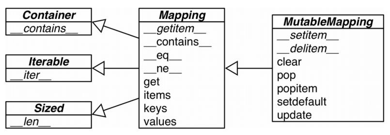

> @Date    : 2020-09-17 20:19:21
>
> @Author  : Lewis Tian (taseikyo@gmail.com)
>
> @Link    : github.com/taseikyo

# 字典和集合

## Table of Contents

- [3.1 泛映射类型](#31-泛映射类型)
	- [3.1.1 什么是可散列的数据类型](#311-什么是可散列的数据类型)
- [3.2 字典推导](#32-字典推导)
- [3.3 常见的映射方法](#33-常见的映射方法)
	- [用 setdefault 处理找不到的键](#用-setdefault-处理找不到的键)
- [3.4 映射的弹性键查询](#34-映射的弹性键查询)
	- [3.4.1 defaultdict 处理找不到的键的一个选择](#341-defaultdict-处理找不到的键的一个选择)
	- [3.4.2 特殊方法 `__missing__`](#342-特殊方法-__missing__)
- [3.5 字典的变种](#35-字典的变种)
- [3.6 子类化 UserDict](#36-子类化-userdict)
- [3.7 不可变映射类型](#37-不可变映射类型)
- [3.8 集合论](#38-集合论)
	- [3.8.1 集合字面量](#381-集合字面量)
	- [3.8.2 集合推导](#382-集合推导)
	- [3.8.3 集合的操作](#383-集合的操作)
- [3.9 dict 和 set 的背后](#39-dict-和-set-的背后)
	- [3.9.1 一个关于效率的实验](#391-一个关于效率的实验)
	- [3.9.2 字典中的散列表](#392-字典中的散列表)
	- [3.9.3 dict 的实现及其导致的结果](#393-dict-的实现及其导致的结果)
	- [3.9.4 set 的实现以及导致的结果](#394-set-的实现以及导致的结果)
- [3.10 本章小结](#310-本章小结)
- [3.11 延伸阅读](#311-延伸阅读)
	- [杂谈](#杂谈)

dict 类型不但在各种程序里广泛使用，它也是 Python 语言的基石。模块的命名空间、实例的属性和函数的关键字参数中都可以看到字典的身影。跟它有关的内置函数都在 `__builtins__.__dict__` 模块中。

正是因为字典至关重要，Python 对它的实现做了高度优化，而散列表则是字典类型性能出众的根本原因。

## 3.1 泛映射类型

collections.abc 模块中有 Mapping 和 MutableMapping 这两个抽象基类，它们的作
用是为 dict 和其他类似的类型定义形式接口



图 3-1： collections.abc 中的 MutableMapping 和它的超类的 UML 类图（箭头从子类指向超类，抽象类和抽象方法的名称以斜体显示）

非抽象映射类型一般不会直接继承这些抽象基类，它们会直接对 dict 或是 collections.User.Dict 进行扩展。这些抽象基类的主要作用是作为形式化的文档，它们定义了构建一个映射类型所需要的最基本的接口。然后它们还可以跟 isinstance 一起被用来判定某个数据是不是广义上的映射类型：

```Markdown
>>> my_dict = {}
>>> isinstance(my_dict, abc.Mapping)
True
```

这里用 isinstance 而不是 type 来检查某个参数是否为 dict 类型，因为这个参数有可能不是 dict，而是一个比较另类的映射类型。

标准库里的所有映射类型都是利用 dict 来实现的，因此它们有个共同的限制，即只有可散列的数据类型才能用作这些映射里的键（只有键有这个要求，值并不需要是可散列的数据类型）。

### 3.1.1 什么是可散列的数据类型

在 Python 词汇表（https://docs.python.org/3/glossary.html#term-hashable ）中，关于可散列类型的定义有这样一段话：

如果一个对象是可散列的（hashable），那么在这个对象的生命周期中，它的散列值是不变的，而且这个对象需要实现 `__hash__()` 方法。另外可散列对象还要有 `__qe__()` 方法，这样才能跟其他键做比较。如果两个可散列对象是相等的，那么它们的散列值一定是一样的

原子不可变数据类型（str、 bytes 和数值类型）都是可散列类型，frozenset 也是
可散列的，因为根据其定义，frozenset 里只能容纳可散列类型。元组的话，只有
当一个元组包含的所有元素都是可散列类型的情况下，它才是可散列的。

```Markdown
>>> tt = (1, 2, (30, 40))
>>> hash(tt)
8027212646858338501
>>> tl = (1, 2, [30, 40])
>>> hash(tl)
Traceback (most recent call last):
File "<stdin>", line 1, in <module>
TypeError: unhashable type: 'list'
>>> tf = (1, 2, frozenset([30, 40]))
>>> hash(tf)
-4118419923444501110
```

> “Python 里所有的不可变类型都是可散列的”。这个说法其实是不准确的，比如虽然元组本身是不可变序列，它里面的元素可能是其他可变类型的引用。

一般来讲用户自定义的类型的对象都是可散列的，散列值就是它们的 id() 函数的返回值，所以所有这些对象在比较的时候都是不相等的。如果一个对象实现了 `__eq__` 方法，并且在方法中用到了这个对象的内部状态的话，那么只有当所有这些内部状态都是不可变的情况下，这个对象才是可散列的。

字典提供了很多种构造方法：

```Markdown
>>> a = dict(one=1, two=2, three=3)
>>> b = {'one': 1, 'two': 2, 'three': 3}
>>> c = dict(zip(['one', 'two', 'three'], [1, 2, 3]))
>>> d = dict([('two', 2), ('one', 1), ('three', 3)])
>>> e = dict({'three': 3, 'one': 1, 'two': 2})
>>> a == b == c == d == e
True
```

字典推导（dict comprehension）也可以用来建造新 dict

## 3.2 字典推导

自 Python 2.7 以来，列表推导和生成器表达式的概念就移植到了字典上，从而有了字典推导（后面还会看到集合推导）。字典推导（dictcomp）可以从任何以键值对作为元素的可迭代对象中构建出字典。

## 3.3 常见的映射方法

表 3-1 为我们展示了 dict、 defaultdict 和 OrderedDict 的常见方法，后面两个数据类型是 dict 的变种，位于 collections 模块内。

### 用 setdefault 处理找不到的键

当字典 `d[k]` 不能找到正确的键的时候，Python 会抛出异常，这个行为符合 Python 所信奉的 “快速失败” 哲学。也许每个 Python 程序员都知道可以用 d.get(k, default) 来代替 d [k]，给找不到的键一个默认的返回值（这比处理 KeyError 要方便不少）。但是要更新某个键对应的值的时候，不管使用 `__getitem__` 还是 get 都会不自然，而且效率低。


```Markdown
my_dict.setdefault(key, []).append(new_value)

if key not in my_dict:
    my_dict[key] = []
my_dict[key].append(new_value)
```

二者的效果是一样的，只不过后者至少要进行两次键查询 —— 如果键不存在的话，就是三次，用 setdefault 只需要一次就可以完成整个操作。

## 3.4 映射的弹性键查询

有时候就算某个键在映射里不存在，我们也希望在通过这个键读取值的时候能得到一个默认值。有两个途径能帮我们达到这个目的，一个是通过 defaultdict 这个类型而不是普通的 dict，另一个是给自己定义一个 dict 的子类，然后在子类中实现 `__missing__` 方法。

### 3.4.1 defaultdict 处理找不到的键的一个选择

在实例化一个 defaultdict 的时候，需要给构造方法提供一个可调用对象，这个可调用对象会在 `__getitem__` 碰到找不到的键的时候被调用，让 `__getitem__` 返回某种默认值。

比如，我们新建了这样一个字典： `dd = defaultdict(list)`，如果键 'new-key' 在 dd
中还不存在的话，表达式 dd['new-key'] 会按照以下的步骤来行事。

1. 调用 list() 来建立一个新列表
2. 把这个新列表作为值，'new-key' 作为它的键，放到 dd 中
3. 返回这个列表的引用

而这个用来生成默认值的可调用对象存放在名为 `default_factory` 的实例属性里

> defaultdict 里的 default_factory 只会在 `__getitem__` 里被调用，在其他的方法里完全不会发挥作用。比如，dd 是个 defaultdict，k 是个找不到的键，dd[k] 这个表达式会调用 default_factory 创造某个默认值，而 dd.get(k) 则会返回 None。

所有这一切背后的功臣其实是特殊方法 `__missing__`。它会在 defaultdict 遇到找不到的键的时候调用 default_factory，而实际上这个特性是所有映射类型都可以选择去支持的。

### 3.4.2 特殊方法 `__missing__`

所有的映射类型在处理找不到的键的时候，都会牵扯到 `__missing__` 方法。虽然基类 dict 并没有定义这个方法，但是 dict 是知道有这么个东西存在的。如果有一个类继承了 dict，然后这个继承类提供了 `__missing__` 方法，那么在 `__getitem__` 碰到找不到的键的时候，Python 就会自动调用它，而不是抛出一个 KeyError 异常。

> `__missing__` 方法只会被 `__getitem__` 调用（比如在表达式 d[k] 中）。提供 `__missing__` 方法对 get 或者 `__contains__`（in 运算符会用到这个方法）这些方法的使用没有影响。

有时候，你会希望在查询的时候，映射类型里的键统统转换成 str。

示例 3-6 当有非字符串的键被查找的时候，StrKeyDict0 是如何在该键不存在的情况下，把它转换为字符串的

```Markdown
Tests for item retrieval using `d[key]` notation::
>>> d = StrKeyDict0([('2', 'two'), ('4', 'four')])
>>> d['2']
'two'
>>> d[4]
'four'
>>> d[1]
Traceback (most recent call last):
...
KeyError: '1'
Tests for item retrieval using `d.get(key)` notation::
>>> d.get('2')
'two'
>>> d.get(4)
'four'
>>> d.get(1, 'N/A')
'N/A'
Tests for the `in` operator::
>>> 2 in d
True
>>> 1 in d
False
```

> 如果要自定义一个映射类型，更合适的策略其实是继承 collections.UserDict 类（示例 3-8 就是如此）。这里我们从 dict 继承，只是为了演示 `__missing__` 是如何被 `dict.__getitem__` 调用的。

示例 3-7 StrKeyDict0 在查询的时候把非字符串的键转换为字符串

```Markdown
class StrKeyDict0(dict):  # <1>

    def __missing__(self, key):
        if isinstance(key, str):  # <2>
            raise KeyError(key)
        return self[str(key)]  # <3>

    def get(self, key, default=None):
        try:
            return self[key]  # <4>
        except KeyError:
            return default  # <5>

    def __contains__(self, key):
        return key in self.keys() or str(key) in self.keys()  # <6>
```

2：如果找不到的键本身就是字符串，那就抛出 KeyError 异常。

3：如果找不到的键不是字符串，那么把它转换成字符串再进行查找。

4：get 方法把查找工作用 self [key] 的形式委托给 `__getitem__`，这样在宣布查找失败之前，还能通过 `__missing__` 再给某个键一个机会。

5：如果抛出 KeyError，那么说明 `__missing__` 也失败了，于是返回 default。

6：先按照传入键的原本的值来查找（我们的映射类型中可能含有非字符串的键），如果没找到，再用 str() 方法把键转换成字符串再查找一次。

下面来看看为什么 isinstance(key, str) 测试在上面的 `__missing__` 中是必需的。

如果没有这个测试，只要 str(k) 返回的是一个存在的键，那么 `__missing__` 方法是没问题的，不管是字符串键还是非字符串键，它都能正常运行。但是如果 str(k) 不是一个存在的键，代码就会陷入无限递归。这是因为 `__missing__` 的最后一行中的 self[str (key)] 会调用 `__getitem__`，而这个 str(key) 又不存在，于是 `__missing__` 又会被调用。

为了保持一致性，`__contains__` 方法在这里也是必需的。这是因为 k in d 这个操作会调用它，但是我们从 dict 继承到的 `__contains__` 方法不会在找不到键的时候调用 `__missing__` 方法。`__contains__` 里还有个细节，就是我们这里没有用更具 Python 风格的方式 —— k in my_dict —— 来检查键是否存在，因为那也会导致 `__contains__` 被递归调用。为了避免这一情况，这里采取了更显式的方法，直接在这个 `self.keys()` 里查询。

> 像 k in my_dict.keys() 这种操作在 Python 3 中是很快的，而且即便映射类型对象很庞大也没关系。这是因为 dict.keys() 的返回值是一个 “视图”。视图就像一个集合，而且跟字典类似的是，在视图里查找一个元素的速度很快。在 “Dictionaryview objects”（https://docs.python.org/3/library/stdtypes.html#dictionary-view-objects ）里可以找到关于这个细节的文档。Python 2 的 dict.keys() 返回的是个列表，因此虽然上面的方法仍然是正确的，它在处理体积大的对象的时候效率不会太高，因为 k in my_list 操作需要扫描整个列表。

出于对准确度的考虑，我们也需要这个按照键的原本的值来查找的操作（也就是 key inself.keys()），因为在创建 StrKeyDict0 和为它添加新值的时候，我们并没有强制要求传入的键必须是字符串。因为这个操作没有规定死键的类型，所以让查找操作变得更加友好。

## 3.5 字典的变种

这一节总结了标准库里 collections 模块中，除了 defaultdict 之外的不同映射类型。

collections.OrderedDict

这个类型在添加键的时候会保持顺序，因此键的迭代次序总是一致的。OrderedDict 的 popitem 方法默认删除并返回的是字典里的最后一个元素，但是如果像 my_odict.popitem(last=False) 这样调用它，那么它删除并返回第一个被添加进去的元素。

collections.ChainMap

该类型可以容纳数个不同的映射对象，然后在进行键查找操作的时候，这些对象会被当作一个整体被逐个查找，直到键被找到为止。这个功能在给有嵌套作用域的语言做解释器的时候很有用，可以用一个映射对象来代表一个作用域的上下文。在 collections 文档介绍 ChainMap 对象的那一部分（https://docs.python.org/3/library/collections.html#collections.ChainMap ）里有一些具体的使用示例，其中包含了下面这个 Python 变量查询规则的代码片段：

```Markdown
import builtins
pylookup = ChainMap(locals(), globals(), vars(builtins))
```

collections.Counter

这个映射类型会给键准备一个整数计数器。每次更新一个键的时候都会增加这个计数器。所以这个类型可以用来给可散列表对象计数，或者是当成多重集来用 —— 多重集合就是集合里的元素可以出现不止一次。Counter 实现了 + 和 - 运算符用来合并记录，还有像 most_common([n]) 这类很有用的方法。most_common([n]) 会按照次序返回映射里最常见的 n 个键和它们的计数，详情参阅文档（https://docs.python.org/3/library/collections.html#collections.Counter ）。下面的小例子利用 Counter 来计算单词中各个字母出现的次数：

```Markdown
>>> ct = collections.Counter('abracadabra')
>>> ct
Counter({'a': 5, 'b': 2, 'r': 2, 'c': 1, 'd': 1})
>>> ct.update('aaaaazzz')
>>> ct
Counter({'a': 10, 'z': 3, 'b': 2, 'r': 2, 'c': 1, 'd': 1})
>>> ct.most_common(2)
[('a', 10), ('z', 3)]
```

colllections.UserDict

这个类其实就是把标准 dict 用纯 Python 又实现了一遍。

跟 OrderedDict、 ChainMap 和 Counter 这些开箱即用的类型不同，UserDict 是让用户继承写子类的。

## 3.6 子类化 UserDict

就创造自定义映射类型来说，以 UserDict 为基类，总比以普通的 dict 为基类要来得方便。

更倾向于从 UserDict 而不是从 dict 继承的主要原因是，后者有时会在某些方法的实现上走一些捷径，导致我们不得不在它的子类中重写这些方法，但是 UserDict 就不会带来这些问题。

UserDict 并不是 dict 的子类，但是 UserDict 有一个叫作 data 的属性，是 dict 的实例，这个属性实际上是 UserDict 最终存储数据的地方。

多亏了 UserDict，示例 3-8 里的 StrKeyDict 的代码比示例 3-7 里的 StrKeyDict0 要短一些，功能却更完善：它不但把所有的键都以字符串的形式存储，还能处理一些创建或者更新实例时包含非字符串类型的键这类意外情况。

示例 3-8 无论是添加、更新还是查询操作，StrKeyDict 都会把非字符串的键转换为字符串

```Markdown
import collections

class StrKeyDict(collections.UserDict):  # <1>

    def __missing__(self, key):  # <2>
        if isinstance(key, str):
            raise KeyError(key)
        return self[str(key)]

    def __contains__(self, key):
        return str(key) in self.data  # <3>

    def __setitem__(self, key, item):
        self.data[str(key)] = item   # <4>
```

因为 UserDict 继承的是 MutableMapping，所以 StrKeyDict 里剩下的那些映射类型的方法都是从 UserDict、 MutableMapping 和 Mapping 这些超类继承而来的。特别是最后的 Mapping 类，它虽然是一个抽象基类（ABC），但它却提供了好几个实用的方法。以下两个方法值得关注。

MutableMapping.update

这个方法不但可以为我们所直接利用，它还用在 `__init__` 里，让构造方法可以利用传入的各种参数（其他映射类型、元素是 (key, value) 对的可迭代对象和键值参数）来新建实例。因为这个方法在背后是用 self[key] = value 来添加新值的，所以它其实是在使用我们的 `__setitem__` 方法。

Mapping.get

在 StrKeyDict0（示例 3-7）中，我们不得不改写 get 方法，好让它的表现跟 `__getitem__` 一致。而在示例 3-8 中就没这个必要了，因为它继承了 Mapping.get 方法，而 Python 的源码（https://hg.python.org/cpython/file/3.4/Lib/_collections_abc.py#l422 ）显示，这个方法的实现方式跟 StrKeyDict0.get 是一模一样的。

之前我们见识过了不可变的序列类型，那有没有不可变的字典类型呢？这么说吧，在标准库里是没有这样的类型的，但是可以用替身来代替。

## 3.7 不可变映射类型

标准库里所有的映射类型都是可变的，但有时候你会有这样的需求，比如不能让用户错误地修改某个映射。

从 Python 3.3 开始，types 模块中引入了一个封装类名叫 MappingProxyType。如果给这个类一个映射，它会返回一个只读的映射视图。虽然是个只读视图，但是它是动态的。这意味着如果对原映射做出了改动，我们通过这个视图可以观察到，但是无法通过这个视图对原映射做出修改。

```Markdown
>>> from types import MappingProxyType
>>> d = {1:'A'}
>>> d_proxy = MappingProxyType(d)
>>> d_proxy
mappingproxy({1: 'A'})
>>> d_proxy[1] ➊
'A'
>>> d_proxy[2] = 'x' ➋
Traceback (most recent call last):
File "<stdin>", line 1, in <module>
TypeError: 'mappingproxy' object does not support item assignment
>>> d[2] = 'B'
>>> d_proxy ➌
mappingproxy({1: 'A', 2: 'B'})
>>> d_proxy[2]
'B'
```

➌ d_proxy 是动态的，也就是说对 d 所做的任何改动都会反馈到它上面。

## 3.8 集合论

“集” 这个概念在 Python 中算是比较年轻的，同时它的使用率也比较低。set 和它的不可变的姊妹类型 frozenset 直到 Python 2.3 才首次以模块的形式出现，然后在 Python 2.6 中它们升级成为内置类型。

集合中的元素必须是可散列的，set 类型本身是不可散列的，但是 frozenset 可以。因此可以创建一个包含不同 frozenset 的 set。

### 3.8.1 集合字面量

> 不要忘了，如果要创建一个空集，你必须用不带任何参数的构造方法 set()。如果只是写成 {} 的形式，跟以前一样，你创建的其实是个空字典。

像 {1, 2, 3} 这种字面量句法相比于构造方法（set ([1, 2, 3])）要更快且更易读。后者的速度要慢一些，因为 Python 必须先从 set 这个名字来查询构造方法，然后新建一个列表，最后再把这个列表传入到构造方法里。但是如果是像 {1, 2, 3} 这样的字面量，Python 会利用一个专门的叫作 BUILD_SET 的字节码来创建集合。

由于 Python 里没有针对 frozenset 的特殊字面量句法，我们只能采用构造方法。Python 3 里 frozenset 的标准字符串表示形式看起来就像构造方法调用一样。

```Markdown
>>> frozenset(range(10))
frozenset({0, 1, 2, 3, 4, 5, 6, 7, 8, 9})
```

### 3.8.2 集合推导

### 3.8.3 集合的操作

【交、差、并、补】

## 3.9 dict 和 set 的背后

想要理解 Python 里字典和集合类型的长处和弱点，它们背后的散列表是绕不开的一环。

### 3.9.1 一个关于效率的实验

示例 3-14 在 haystack 里查找 needles 的元素，并计算找到的元素的个数

```Markdown
found = 0
for n in needles:
	if n in haystack:
		found += 1
```

示例 3-15 利用交集来计算 needles 中出现在 haystack 中的元素的个数

```Markdown
found = len(needles & haystack)
```

表 3-6：在 5 个不同大小的 haystack 里搜索 1000 个元素所需的时间，haystack 分别以字典、集合和列表的形式出现。测试环境是一个有 Core i7 处理器的笔记本，Python 版本是 3.4.0（测试所测量的代码是示例 3-14 中的循环和示例 3-15 的集合 & 操作）

| haystack的 长度 | 增长 系数 | dict花费 时间 | 增长 系数 | 集合花费 时间 | 增长 系数 | 集合交集花 费时间 | 增长 系数 | 列表花费 时间 | 增长系 数 |
|-----------------|-----------|---------------|-----------|---------------|-----------|-------------------|-----------|---------------|-----------|
| 1000            | 1×        | 0.000202s     | 1.00×     | 0.000143s     | 1.00×     | 0.000087s         | 1.00×     | 0.010556s     | 1.00×     |
| 10 000          | 10×       | 0.000140s     | 0.69×     | 0.000147s     | 1.03×     | 0.000092s         | 1.06×     | 0.086586s     | 8.20×     |
| 100 000         | 100×      | 0.000228s     | 1.13×     | 0.000241s     | 1.69×     | 0.000163s         | 1.87×     | 0.871560s     | 82.57×    |
| 1 000 000       | 1000×     | 0.000290s     | 1.44×     | 0.000332s     | 2.32×     | 0.000250s         | 2.87×     | 9.189616s     | 870.56×   |
| 10 000 000      | 10 000×   | 0.000337s     | 1.67×     | 0.000387s     | 2.71×     | 0.000314s         | 3.61×     | 97.948056s    | 9278.90×  |

### 3.9.2 字典中的散列表

散列表其实是一个稀疏数组（总是有空白元素的数组称为稀疏数组）。在一般的数据结构教材中，散列表里的单元通常叫作表元（bucket）。在 dict 的散列表当中，每个键值对都占用一个表元，每个表元都有两个部分，一个是对键的引用，另一个是对值的引用。因为所有表元的大小一致，所以可以通过偏移量来读取某个表元。

因为 Python 会设法保证大概还有三分之一的表元是空的，所以在快要达到这个阈值的时候，原有的散列表会被复制到一个更大的空间里面。

如果要把一个对象放入散列表，那么首先要计算这个元素键的散列值。Python 中可以用 hash() 方法来做这件事情。

> 从 Python 3.3 开始，str、 bytes 和 datetime 对象的散列值计算过程中多了随机的 “加盐” 这一步。所加盐值是 Python 进程内的一个常量，但是每次启动 Python 解释器都会生成一个不同的盐值。随机盐值的加入是为了防止 DOS 攻击而采取的一种安全措施。在 `__hash__` 特殊方法的文档（https://docs.python.org/3/reference/datamodel.html#object.__hash__ ) 里有相关的详细信息。

### 3.9.3 dict 的实现及其导致的结果

1. 键必须是可散列的
	1. 支持 hash() 函数，并且通过 `__hash__()` 方法所得到的散列值是不变的。
	2. 支持通过 `__eq__()` 方法来检测相等性。
	3. 若 a == b 为真，则 hash(a) == hash(b) 也为真。
	- 所有由用户自定义的对象默认都是可散列的，因为它们的散列值由 id() 来获取，而
且它们都是不相等的。
	- 如果你实现了一个类的 `__eq__` 方法，并且希望它是可散列的，那么它一定要有个恰当的 `__hash__` 方法，保证在 a == b 为真的情况下 hash(a) == hash(b) 也必定为真。否则就会破坏恒定的散列表算法，导致由这些对象所组成的字典和集合完全失去可靠性，这个后果是非常可怕的。另一方面，如果一个含有自定义的 `__eq__` 依赖的类处于可变的状态，那就不要在这个类中实现 `__hash__` 方法，因为它的实例是不可散列的。
2. 字典在内存上的开销巨大
	- 由于字典使用了散列表，而散列表又必须是稀疏的，这导致它在空间上的效率低下。
3. 键查询很快
4. 键的次序取决于添加顺序
5. 往字典里添加新键可能会改变已有键的顺序

不要对字典同时进行迭代和修改。如果想扫描并修改一个字典，最好分成两步来进行：首先对字典迭代，以得出需要添加的内容，把这些内容放在一个新字典里；迭代结束之后再对原有字典进行更新。

> 在 Python 3 中，keys()、 items() 和 values() 方法返回的都是字典视图。也就是说，这些方法返回的值更像集合，而不是像 Python 2 那样返回列表。视图还有动态的特性，它们可以实时反馈字典的变化。

### 3.9.4 set 的实现以及导致的结果

set 和 frozenset 的实现也依赖散列表，但在它们的散列表里存放的只有元素的引用（就像在字典里只存放键而没有相应的值）。在 set 加入到 Python 之前，我们都是把字典加上无意义的值当作集合来用的。

在 3.9.3 节中所提到的字典和散列表的几个特点，对集合来说几乎都是适用的。

- 集合里的元素必须是可散列的。
- 集合很消耗内存。
- 可以很高效地判断元素是否存在于某个集合。
- 元素的次序取决于被添加到集合里的次序。
- 往集合里添加元素，可能会改变集合里已有元素的次序。

## 3.10 本章小结

dict 和 set 背后的散列表效率很高，对它的了解越深入，就越能理解为什么被保存的元素会呈现出不同的顺序，以及已有的元素顺序会发生变化的原因。同时，速度是以牺牲空间为代价而换来的。

## 3.11 延伸阅读

Python 标准库中的 “8.3. collections—Container datatypes” 一节（https://docs.python.org/3/library/collections.html ）提到了关于一些映射类型的例子和使用技巧。如果想要创建新的映射类型，或者是体会一下现有的映射类型的实现方式，Python 模块 Lib/collections/__init__.py 的源码是一个很好的参考。


《Python Cookbook（第 3 版）中文版》（David Beazley 和 Brian K. Jones 著）的第 1 章中有 20 个关于数据结构的使用技巧，大多数都在讲 dict 的巧妙用法。

“Python 的字典类：如何打造全能战士” 是《代码之美》第 18 章的标题，这一章集中解释了 Python 字典背后的工作原理。A.M. Kuchling 是这一章的作者，同时他还是 Python 的核心开发者，并撰写了很多 Python 的官方文档和指南。同时 CPython 模块里的 dictobject.c 源文件（https://hg.python.org/cpython/file/tip/Objects/dictobject.c ）还提供了大量的注释。Brandon Craig Rhodes 的讲座 “The MightyDictionary”（http://pyvideo.org/video/276/the-mighty-dictionary-55 ）对散列表做了很精彩的讲解，有趣的是他的幻灯片里也包含了大量的表格。

关于为什么要在语言里加入集合这种数据类型，当初也是有一番考量的。具体情况在 “PEP 218 — Adding a Built-In Set Object Type”（https://www.python.org/dev/peps/pep-0218/ ）中有所记录。在 PEP 128 刚刚通过的时候，还没有针对 set 的特殊字面量句法。后来 Python 3 里加入了对 set 字面量句法的支持，然后这个实现又被向后兼容到了 Python2.7 里，同时被移植的还有 dict 和 set 推导。“PEP 274 — DictComprehensions”（https://www.python.org/dev/peps/pep-0274/ ）就是字典推导的出生证；然而我找不到任何关于集合推导的 PEP，当然很有可能是因为这两个功能太接近了。

### 杂谈

我的朋友 Geraldo Cohen 曾经说过，Python 的特点是“简单而正确”。

dict 类型正是这一特点的完美体现 —— 对它的优化只为一个目标：更好地实现对随机键的读取。而优化的结果非常好，由于速度快而且够健壮，它大量地应用于 Python 的解释器当中。如果对排序有要求，那么还可以选择 OrderedDict。然而对于映射类型来说，保持元素的顺序并不是一个常用需求，因此会把它排除在核心功能之外，而以标准库的形式提供其他衍生的类型。

与之形成鲜明对比的是 PHP。在 PHP 手册中，数组的描述如下（http://php.net/manual/en/language.types.array.php ）：PHP 中的数组实际上是一个有序的映射 —— 映射类型存放的是键值对。这个映射类型被优化为可充当不同的角色。它可以当作数组、列表（向量）、散列表（映射类型的一种实现）、字典、集合类型、栈、队列或其他可能的数据类型。

单凭这段话，我无法想象 PHP 把 list 和 OrderedDict 混合实现的成本有多大。

本书前两章的目的是展示 Python 中的集合类型为特定的使用场景做了怎样的优化。我特意强调了在 list 和 dict 的常规用法之外还有那些特殊的使用情景。

在遇到 Python 之前，我主要使用 Perl、 PHP 和 JavaScript 做网站开发。我很喜欢这些语言中跟映射类型相关的字面量句法特性。某些时候我不得不使用 Java 和 C，然后我就会疯狂地想念这些特性。好用的映射类型的字面量句法可以帮助开发者轻松实现配置和表格相关的开发，也能让我们很方便地为原型开发或者测试准备好数据容器。Java 由于没有这个特性，不得不用复杂且冗长的 XML 来替代。

JSON 被当作 “瘦身版 XML”（http://www.json.org/fatfree.html ）。在很多情景下，JSON 都成功取代了 XML。由于拥有紧凑的列表和字典表达，JSON 格式可以完美地用于数据交换。

PHP 和 Ruby 的散列语法借鉴了 Perl，它们都用 => 作为键和值的连接。JavaScript 则从 Python 那儿偷师，使用了 :。而 JSON 又从 JavaScript 发展而来，它的语法正好是 Python 句法的子集。因此，除了在 true、 false 和 null 这几个值的拼写上有出入之外，JSON 和 Python 是完全兼容的。于是，现在大家用来交换数据的格式全是 Python 的 dict 和 list。

简单而正确。