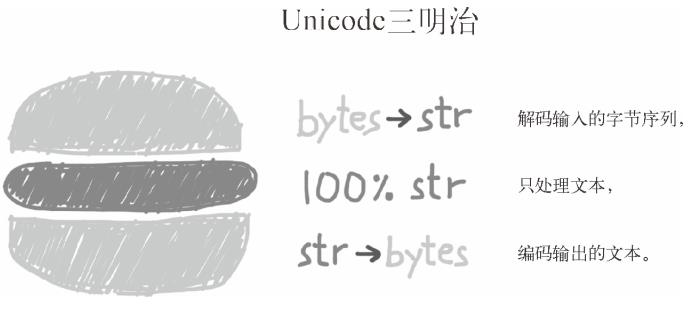

> @Date    : 2020-09-18 11:04:05
>
> @Author  : Lewis Tian (taseikyo@gmail.com)
>
> @Link    : github.com/taseikyo

# 文本和字节序列

## Table of Contents

- [4.1 字符问题](#41-字符问题)
- [4.2 字节概要](#42-字节概要)
	- [结构体和内存视图](#结构体和内存视图)
- [4.3 基本的编解码器](#43-基本的编解码器)
- [4.4 了解编解码问题](#44-了解编解码问题)
	- [4.4.1 处理 UnicodeEncodeError](#441-处理-unicodeencodeerror)
	- [4.4.2 处理 UnicodeDecodeError](#442-处理-unicodedecodeerror)
	- [4.4.3 使用预期之外的编码加载模块时抛出的 SyntaxError](#443-使用预期之外的编码加载模块时抛出的-syntaxerror)
	- [4.4.4 如何找出字节序列的编码](#444-如何找出字节序列的编码)
	- [4.4.5 BOM：有用的鬼符](#445-bom有用的鬼符)
- [4.5 处理文本文件](#45-处理文本文件)
- [4.6 为了正确比较而规范化 Unicode 字符串](#46-为了正确比较而规范化-unicode-字符串)
	- [4.6.1 大小写折叠](#461-大小写折叠)
	- [4.6.2 规范化文本匹配实用函数](#462-规范化文本匹配实用函数)
	- [4.6.3 极端"规范化"：去掉变音符号](#463-极端规范化去掉变音符号)
- [4.7 Unicode文本排序](#47-unicode文本排序)
	- [使用 Unicode 排序算法排序](#使用-unicode-排序算法排序)
- [4.8 Unicode 数据库](#48-unicode-数据库)
- [4.9 支持字符串和字节序列的双模式 API](#49-支持字符串和字节序列的双模式-api)
	- [4.9.1 正则表达式中的字符串和字节序列](#491-正则表达式中的字符串和字节序列)
	- [4.9.2 os 函数中的字符串和字节序列](#492-os-函数中的字符串和字节序列)
- [4.10 本章小结](#410-本章小结)
- [4.11 延伸阅读](#411-延伸阅读)
	- [杂谈](#杂谈)
		- ["纯文本"是什么](#纯文本是什么)
		- [捉摸不透的 Unicode](#捉摸不透的-unicode)
		- [在 RAM 中如何表示字符串](#在-ram-中如何表示字符串)

Python 3 明确区分了人类可读的文本字符串和原始的字节序列。隐式地把字节序列转换成 Unicode 文本已成过去。本章将要讨论 Unicode 字符串、二进制序列，以及在二者之间转换时使用的编码。

## 4.1 字符问题

"字符串"是个相当简单的概念：一个字符串是一个字符序列。在 2015 年，"字符" 的最佳定义是 Unicode 字符。因此，从 Python 3 的 str 对象中获取的元素是 Unicode 字符，这相当于从 Python 2 的 unicode 对象中获取的元素，而不是从 Python 2 的 str 对象中获取的原始字节序列。

Unicode 标准把字符的标识和具体的字节表述进行了如下的明确区分：

- 字符的标识，即码位，是 0 ~ 1,114,111 的数字（十进制），在 Unicode 标准中以 4 ~ 6 个十六进制数字表示，而且加前缀 "U+"。例如，字母 A 的码位是 U+0041，欧元符号的码位是 U+20AC，高音谱号的码位是 U+1D11E。在 Unicode 6.3 中（这是 Python 3.4 使用的标准），约 10% 的有效码位有对应的字符。
- 字符的具体表述取决于所用的编码。编码是在码位和字节序列之间转换时使用的算法。在 UTF-8 编码中，A（U+0041）的码位编码成单个字节 \x41，而在 UTF-16LE 编码中编码成两个字节 \x41\x00。再举个例子，欧元符号（U+20AC）在 UTF-8 编码中是三个字节 ——\xe2\x82\xac，而在 UTF-16LE 中编码成两个字节：\xac\x20。

把码位转换成字节序列的过程是编码；把字节序列转换成码位的过程是解码。

示例 4-1 编码和解码

```Python
In [1]: s = 'café'

In [2]: len(s) # <1>
Out[2]: 4

In [3]: b = s.encode('utf-8') # <2>

In [4]: b
Out[4]: b'caf\xc3\xa9' # <3>

In [5]: len(b) # <4>
Out[5]: 5

In [6]: b.decode('utf-8') # <5>
Out[6]: 'café'
```

1. 'café' 字符串有 4 个 Unicode 字符
2. 使用 UTF-8 把 str 对象编码成 bytes 对象
3. bytes 字面量以 b 开头
4. 字节序列 b 有 5 个字节（在 UTF-8 中，"é"的码位编码成两个字节）
5. 使用 UTF-8 把 bytes 对象解码成 str 对象

> 如果想帮助自己记住 decode() 和 encode() 的区别，可以把字节序列想成晦涩难懂的机器磁芯转储，把 Unicode 字符串想成 "人类可读" 的文本。那么，把字节序列变成人类可读的文本字符串就是解码，而把字符串变成用于存储或传输的字节序列就是编码。

## 4.2 字节概要

Python 内置了两种基本的二进制序列类型：Python 3 引入的不可变 bytes 类型和 Python 2.6 添加的可变 bytearray 类型。

bytes 或 bytearray 对象的各个元素是介于 0 ~ 255（含）之间的整数，而不像 Python 2 的 str 对象那样是单个的字符。二进制序列的切片始终是同一类型的二进制序列，包括长度为 1 的切片

示例 4-2 包含 5 个字节的 bytes 和 bytearray 对象

```Python
In [7]: cafe = bytes('café', encoding='utf_8') # <1>

In [8]: cafe
Out[8]: b'caf\xc3\xa9'

In [9]: cafe[0] # <2>
Out[9]: 99

In [10]: cafe[:1] # <3>
Out[10]: b'c'

In [11]: cafe_arr = bytearray(cafe)

In [12]: cafe_arr # <4>
Out[12]: bytearray(b'caf\xc3\xa9')

In [13]: cafe_arr[-1:] # <5>
Out[13]: bytearray(b'\xa9')
```

1. bytes 对象可以从 str 对象使用给定的编码构建
2. 各个元素是 range(256) 内的整数
3. bytes 对象的切片还是 bytes 对象，即使是只有一个字节的切片
4. bytearray 对象没有字面量句法，而是以 bytearray() 和字节序列字面量参数的形式显示
5. bytearray 对象的切片还是 bytearray 对象

> my_bytes[0] 获取的是一个整数，而 my_bytes[:1] 返回的是一个长度为 1 的 bytes 对象 —— 这一点应该不会让人意外。s[0] == s[:1] 只对 str 这个序列类型成立。不过，str 类型的这个行为十分罕见。对其他各个序列类型来说，s[i] 返回一个元素，而 s[i:i+1] 返回一个相同类型的序列，里面是 s[i] 元素。

虽然二进制序列其实是整数序列，但是它们的字面量表示法表明其中有 ASCII 文本。因此，各个字节的值可能会使用下列三种不同的方式显示。

1. 可打印的 ASCII 范围内的字节（从空格到 ~），使用 ASCII 字符本身
2. 制表符、换行符、回车符和 \ 对应的字节，使用转义序列 \t、\n、\r 和 \\
3. 其他字节的值，使用十六进制转义序列（例如，\x00 是空字节）

在示例 4-2 中，我们看到的是 b'caf\xc3\xa9'：前 3 个字节 b'caf' 在可打印的 ASCII 范围内，后两个字节则不然。

除了格式化方法（format 和 format_map）和几个处理 Unicode 数据的方法（包括 casefold、isdecimal、isidentifier、isnumeric、isprintable 和 encode）之外，str 类型的其他方法都支持 bytes 和 bytearray 类型。这意味着，我们可以使用熟悉的字符串方法处理二进制序列，如 endswith、replace、strip、translate、upper 等，只有少数几个其他方法的参数是 bytes 对象，而不是 str 对象。此外，如果正则表达式编译自二进制序列而不是字符串，re 模块中的正则表达式函数也能处理二进制序列。

二进制序列有个类方法是 str 没有的，名为 fromhex，它的作用是解析十六进制数字对（数字对之间的空格是可选的），构建二进制序列：

```Python
>>> bytes.fromhex('31 4B CE A9')
b'1K\xce\xa9'
```

构建 bytes 或 bytearray 实例还可以调用各自的构造方法，传入下述参数：

- 一个 str 对象和一个 encoding 关键字参数
- 一个可迭代对象，提供 0 ~ 255 之间的数值
- 一个实现了缓冲协议的对象（如 bytes、bytearray、memoryview、array.array）；此时，把源对象中的字节序列复制到新建的二进制序列中

使用缓冲类对象构建二进制序列是一种低层操作，可能涉及类型转换

示例 4-3 使用数组中的原始数据初始化 bytes 对象

```Python
In [15]: import array

In [16]: numbers = array.array('h', [-2, -1, 0, 1, 2])

In [17]: octets = bytes(numbers)

In [18]: octets
Out[18]: b'\xfe\xff\xff\xff\x00\x00\x01\x00\x02\x00'
```

1. 指定类型代码 h，创建一个短整数（16 位）数组
2. octets 保存组成 numbers 的字节序列的副本
3. 表示 5 个短整数的 10 个字节

使用缓冲类对象创建 bytes 或 bytearray 对象时，始终复制源对象中的字节序列。与之相反，memoryview 对象允许在二进制数据结构之间共享内存。如果想从二进制序列中提取结构化信息，struct 模块是重要的工具。下一节会使用这个模块处理 bytes 和 memoryview 对象。

### 结构体和内存视图

struct 模块提供了一些函数，把打包的字节序列转换成不同类型字段组成的元组，还有一些函数用于执行反向转换，把元组转换成打包的字节序列。struct 模块能处理 bytes、 bytearray 和 memoryview 对象。

如 2.9.2 节所述，memoryview 类不是用于创建或存储字节序列的，而是共享内存，让你访问其他二进制序列、打包的数组和缓冲中的数据切片，而无需复制字节序列，例如 Python Imaging Library（PIL） 就是这样处理图像的。

下面展示了如何使用 memoryview 和 struct 提取一个 GIF 图像的宽度和高度

示例 4-4 使用 memoryview 和 struct 查看一个 GIF 图像的首部

```Python
>>> import struct
>>> fmt = '<3s3sHH' # ➊
>>> with open('filter.gif', 'rb') as fp:
...     img = memoryview(fp.read()) # ➋
...
>>> header = img[:10] # ➌
>>> bytes(header) # ➍
b'GIF89a+\x02\xe6\x00'
>>> struct.unpack(fmt, header) # ➎
(b'GIF', b'89a', 555, 230)
>>> del header # ➏
>>> del img
```

1. 结构体的格式：< 是小字节序，3s3s 是两个 3 字节序列，HH 是两个 16 位二进制整数
2. 使用内存中的文件内容创建一个 memoryview 对象
3. 然后使用它的切片再创建一个 memoryview 对象；这里不会复制字节序列
4. 转换成字节序列，这只是为了显示；这里复制了 10 字节
5. 拆包 memoryview 对象，得到一个元组，包含类型、版本、宽度和高度
6. 删除引用，释放 memoryview 实例所占的内存

注意，memoryview 对象的切片是一个新 memoryview 对象，而且不会复制字节序列。

## 4.3 基本的编解码器

## 4.4 了解编解码问题

虽然有个一般性的 UnicodeError 异常，但是报告错误时几乎都会指明具体的异常：UnicodeEncodeError（把字符串转换成二进制序列时）或 UnicodeDecodeError（把二进制序列转换成字符串时）。如果源码的编码与预期不符，加载 Python 模块时还可能抛出 SyntaxError。

### 4.4.1 处理 UnicodeEncodeError

多数非 UTF 编解码器只能处理 Unicode 字符的一小部分子集。把文本转换成字节序列时，如果目标编码中没有定义某个字符，那就会抛出 UnicodeEncodeError 异常，除非把 errors 参数传给编码方法或函数，对错误进行特殊处理。

示例 4-6 编码成字节序列：成功和错误处理

```Python
In [1]: city = 'São Paulo'

In [2]: city.encode('cp437', errors='ignore')
Out[2]: b'So Paulo'

In [3]: city.encode('cp437', errors='replace')
Out[3]: b'S?o Paulo'

In [4]: city.encode('cp437', errors='xmlcharrefreplace')
Out[4]: b'S&#227;o Paulo'

In [5]: city.encode('utf-8')
Out[5]: b'S\xc3\xa3o Paulo'
```

- error='ignore' 处理方式悄无声息地跳过无法编码的字符；
- error='replace'，把无法编码的字符替换成 '?'；数据损坏了，但是用户知道出了问题
- error='xmlcharrefreplace' 把无法编码的字符替换成 XML 实体

> 编解码器的错误处理方式是可扩展的。你可以为 errors 参数注册额外的字符串，方法是把一个名称和一个错误处理函数传给 codecs.register_error 函数。参见 codecs.register_error 函数的文档（https://docs.python.org/3/library/codecs.html#codecs.register_error ）。

### 4.4.2 处理 UnicodeDecodeError

不是每一个字节都包含有效的 ASCII 字符，也不是每一个字符序列都是有效的 UTF-8 或 UTF-16。因此，把二进制序列转换成文本时，如果假设是这两个编码中的一个，遇到无法转换的字节序列时会抛出 UnicodeDecodeError。

很多陈旧的 8 位编码 —— 如 'cp1252'、 'iso8859_1' 和 'koi8_r'—— 能解码任何字节序列流而不抛出错误，例如随机噪声。因此，如果程序使用错误的 8 位编码，解码过程悄无声息，而得到的是无用输出。

乱码字符称为鬼符（gremlin）或 mojibake（文字化け，"变形文本" 的日文）

示例 4-7 把字节序列解码成字符串：成功和错误处理

```Python
In [6]: octets = b'Montr\xe9al'

In [7]: octets.decode('cp1252')
Out[7]: 'Montréal'

In [8]: octets.decode('iso8859_7')
Out[8]: 'Montrιal'

In [9]: octets.decode('koi8_r')
Out[9]: 'MontrИal'

In [10]: octets.decode('utf_8')
---------------------------------------------------------------------------
UnicodeDecodeError                        Traceback (most recent call last)
<ipython-input-10-afaa3d3916c5> in <module>
----> 1 octets.decode('utf_8')

UnicodeDecodeError: 'utf-8' codec can't decode byte 0xe9 in position 5: invalid continuation byte

In [11]: octets.decode('utf_8', errors='replace')
Out[11]: 'Montr�al'
```

使用 'replace' 错误处理方式，\xe9 替换成了 "�"（码位是 U+FFFD），这是官方指定的 REPLACEMENT CHARACTER（替换字符），表示未知字符。

### 4.4.3 使用预期之外的编码加载模块时抛出的 SyntaxError

Python 3 默认使用 UTF-8 编码源码，Python 2（从 2.5 开始）则默认使用 ASCII。如果加载的 .py 模块中包含 UTF-8 之外的数据，而且没有声明编码，会得到类似下面的消息：

```Python
SyntaxError: Non-UTF-8 code starting with '\xe1' in file ola.py on line1, but no encoding declared; see http://python.org/dev/peps/pep-0263/for details
```

### 4.4.4 如何找出字节序列的编码

如何找出字节序列的编码？简单来说，不能。必须有人告诉你

有些通信协议和文件格式，如 HTTP 和 XML，包含明确指明内容编码的首部。可以肯定的是，某些字节流不是 ASCII，因为其中包含大于 127 的字节值，而且制定 UTF-8 和 UTF-16 的方式也限制了可用的字节序列。不过即便如此，我们也不能根据特定的位模式来 100% 确定二进制文件的编码是 ASCII 或 UTF-8。

统一字符编码侦测包 Chardet（https://pypi.python.org/pypi/chardet ）就是这样工作的，它能识别所支持的 30 种编码。Chardet 是一个 Python 库，可以在程序中使用，不过它也提供了命令行工具 chardetect。

```bash
$ chardetect 04-text-byte.asciidoc
04-text-byte.asciidoc: utf-8 with confidence 0.99
```

### 4.4.5 BOM：有用的鬼符

UTF-16 编码的序列开头有几个额外的字节，如下所示：

```Python
In [12]: u16 = 'El Niño'.encode('utf_16')

In [13]: u16
Out[13]: b'\xff\xfeE\x00l\x00 \x00N\x00i\x00\xf1\x00o\x00'
```

我指的是 b'\xff\xfe'。这是 BOM，即字节序标记（byte-order mark），指明编码时使用 Intel CPU 的小字节序。

在小字节序设备中，各个码位的最低有效字节在前面：字母 'E' 的码位是 U+0045（十进制数 69），在字节偏移的第 2 位和第 3 位编码为 69 和 0。

在大字节序 CPU 中，编码顺序是相反的；'E' 编码为 0 和 69。

为了避免混淆，UTF-16 编码在要编码的文本前面加上特殊的不可见字符 ZERO WIDTHNO-BREAK SPACE（U+FEFF）。在小字节序系统中，这个字符编码为 b'\xff\xfe'（十进制数 255, 254）。因为按照设计，U+FFFE 字符不存在，在小字节序编码中，字节序列 b'\xff\xfe' 必定是 ZERO WIDTH NO-BREAK SPACE，所以编解码器知道该用哪个字节序。

UTF-16 有两个变种：UTF-16LE，显式指明使用小字节序； UTF-16BE，显式指明使用大字节序。如果使用这两个变种，不会生成 BOM：

```Python
>>> u16le = 'El Niño'.encode('utf_16le')
>>> list(u16le)
[69, 0, 108, 0, 32, 0, 78, 0, 105, 0, 241, 0, 111, 0]
>>> u16be = 'El Niño'.encode('utf_16be')
>>> list(u16be)
[0, 69, 0, 108, 0, 32, 0, 78, 0, 105, 0, 241, 0, 111]
```

如果有 BOM，UTF-16 编解码器会将其过滤掉，为你提供没有前导 ZERO WIDTH NOBREAK SPACE 字符的真正文本。如果文件使用 UTF-16 编码，而且没有 BOM，那么应该假定它使用的是 UTF-16BE（大字节序）编码。

与字节序有关的问题只对一个字（word）占多个字节的编码（如 UTF-16 和 UTF-32）有影响。UTF-8 的一大优势是，不管设备使用哪种字节序，生成的字节序列始终一致，因此不需要 BOM。某些 Windows 应用（尤其是 Notepad）依然会在 UTF-8 编码的文件中添加 BOM；而且，Excel 会根据有没有 BOM 确定文件是不是 UTF-8 编码，否则，它假设内容使用 Windows 代码页（codepage）编码。UTF-8 编码的 U+FEFF 字符是一个三字节序列：b'\xef\xbb\xbf'。因此，如果文件以这三个字节开头，有可能是带有 BOM 的 UTF-8 文件。然而，Python 不会因为文件以 b'\xef\xbb\xbf' 开头就自动假定它是 UTF-8 编码的。

## 4.5 处理文本文件



图 4-2：Unicode 三明治——目前处理文本的最佳实践

处理文本的最佳实践是 "Unicode 三明治"（如图 4-2 所示）。意思是，要尽早把输入（例如读取文件时）的字节序列解码成字符串。这种三明治中的 "肉片" 是程序的业务逻辑，在这里只能处理字符串对象。在其他处理过程中，一定不能编码或解码。对输出来说，则要尽量晚地把字符串编码成字节序列。

## 4.6 为了正确比较而规范化 Unicode 字符串

因为 Unicode 有组合字符（变音符号和附加到前一个字符上的记号，打印时作为一个整体），所以字符串比较起来很复杂。

```Python
>>> s1 = 'café'
>>> s2 = 'cafe\u0301'
>>> s1, s2
('café', 'café')
>>> len(s1), len(s2)
(4, 5)
>>> s1 == s2
False
```

U+0301 是 COMBINING ACUTE ACCENT，加在 "e" 后面得到 "é"。在 Unicode 标准中，'é' 和 'e\u0301' 这样的序列叫 "标准等价物"（canonical equivalent），应用程序应该把它们视作相同的字符。但是，Python 看到的是不同的码位序列，因此判定二者不相等。

解决方案是使用 unicodedata.normalize 函数提供的 Unicode 规范化。这个函数的第一个参数是这 4 个字符串中的一个：'NFC'、 'NFD'、 'NFKC' 和 'NFKD'。

NFC（Normalization Form C）使用最少的码位构成等价的字符串，而 NFD 把组合字符分解成基字符和单独的组合字符。

```Python
>>> from unicodedata import normalize
>>> s1 = 'café' # 把"e"和重音符组合在一起
>>> s2 = 'cafe\u0301' # 分解成"e"和重音符
>>> len(s1), len(s2)
(4, 5)
>>> len(normalize('NFC', s1)), len(normalize('NFC', s2))
(4, 4)
>>> len(normalize('NFD', s1)), len(normalize('NFD', s2))
(5, 5)
>>> normalize('NFC', s1) == normalize('NFC', s2)
True
>>> normalize('NFD', s1) == normalize('NFD', s2)
True
```

西方键盘通常能输出组合字符，因此用户输入的文本默认是 NFC 形式。不过，安全起见，保存文本之前，最好使用 normalize ('NFC', user_text) 清洗字符串。NFC 也是 W3C 的 "Character Model for the World Wide Web: String Matching and Searching" 规范（https://www.w3.org/TR/charmod-norm/ ）推荐的规范化形式。

在另外两个规范化形式（NFKC 和 NFKD）的首字母缩略词中，字母 K 表示 "compatibility"（兼容性）。这两种是较严格的规范化形式，对 "兼容字符" 有影响。虽然 Unicode 的目标是为各个字符提供 "规范的" 码位，但是为了兼容现有的标准，有些字符会出现多次。

在 NFKC 和 NFKD 形式中，各个兼容字符会被替换成一个或多个 "兼容分解" 字符，即便这样有些格式损失，但仍是 "首选" 表述 —— 理想情况下，格式化是外部标记的职责，不应该由 Unicode 处理。

### 4.6.1 大小写折叠

大小写折叠其实就是把所有文本变成小写，再做些其他转换。这个功能由 str.casefold() 方法（Python 3.3 新增）支持。

自 Python 3.4 起，str.casefold() 和 str.lower() 得到不同结果的有 116 个码位。

### 4.6.2 规范化文本匹配实用函数

由前文可知，NFC 和 NFD 可以放心使用，而且能合理比较 Unicode 字符串。对大多数应用来说，NFC 是最好的规范化形式。不区分大小写的比较应该使用 str.casefold()。

### 4.6.3 极端"规范化"：去掉变音符号

Google 搜索涉及很多技术，其中一个显然是忽略变音符号（如重音符、下加符等），至少在某些情况下会这么做。去掉变音符号不是正确的规范化方式，因为这往往会改变词的意思，而且可能误判搜索结果。

## 4.7 Unicode文本排序

Python 比较任何类型的序列时，会一一比较序列里的各个元素。对字符串来说，比较的是码位。可是在比较非 ASCII 字符时，得到的结果不尽如人意。

### 使用 Unicode 排序算法排序

James Tauber，一位高产的 Django 贡献者，他一定是感受到了这一痛点，因此开发了 PyUCA 库（https://pypi.python.org/pypi/pyuca/ ），这是 Unicode 排序算法（UnicodeCollation Algorithm，UCA）的纯 Python 实现。

示例 4-20 使用 pyuca.Collator.sort_key 方法

```Python
>>> import pyuca
>>> coll = pyuca.Collator()
>>> fruits = ['caju', 'atemoia', 'cajá', 'açaí', 'acerola']
>>> sorted_fruits = sorted(fruits, key=coll.sort_key)
>>> sorted_fruits
['açaí', 'acerola', 'atemoia', 'cajá', 'caju']
```

## 4.8 Unicode 数据库

Unicode 标准提供了一个完整的数据库（许多格式化的文本文件），不仅包括码位与字符名称之间的映射，还有各个字符的元数据，以及字符之间的关系。

unicodedata 模块中有几个函数用于获取字符的元数据。例如，字符在标准中的官方名称是不是组合字符（如结合波形符构成的变音符号等），以及符号对应的人类可读数值（不是码位）。

## 4.9 支持字符串和字节序列的双模式 API

### 4.9.1 正则表达式中的字符串和字节序列

如果使用字节序列构建正则表达式，\d 和 \w 等模式只能匹配 ASCII 字符；相比之下，如果是字符串模式，就能匹配 ASCII 之外的 Unicode 数字或字母。

- 字符串类型
	- re_numbers_str = re.compile(r'\d+')
	- re_words_str = re.compile(r'\w+')
- 字节序列类型
	- re_numbers_bytes = re.compile(rb'\d+')
	- re_words_bytes = re.compile(rb'\w+')

### 4.9.2 os 函数中的字符串和字节序列

GNU/Linux 内核不理解 Unicode，因此你可能发现了，对任何合理的编码方案来说，在文件名中使用字节序列都是无效的，无法解码成字符串。

为了规避这个问题，os 模块中的所有函数、文件名或路径名参数既能使用字符串，也能使用字节序列。如果这样的函数使用字符串参数调用，该参数会使用 sys.getfilesystemencoding() 得到的编解码器自动编码，然后操作系统会使用相同的编解码器解码。

如果必须处理（也可能是修正）那些无法使用上述方式自动处理的文件名，可以把字节序列参数传给 os 模块中的函数，得到字节序列返回值。这一特性允许我们处理任何文件名或路径名，不管里面有多少鬼符。

## 4.10 本章小结

## 4.11 延伸阅读

Ned Batchelder 在 2012 年的 PyCon US 所做的演讲 "Pragmatic Unicode—or—How Do I Stopthe Pain?"（http://nedbatchelder.com/text/unipain.html ）非常出色。Ned 很专业，除了幻灯片和视频之外，他还提供了完整的文字记录。Esther Nam 和 Travis Fischer 在 PyCon 2014 做了一场精彩的演讲："Character encoding and Unicode in Python: How to ( ╯ ° □ °) ╯︵┻━┻ with dignity"[幻灯片（http://www.slideshare.net/fischertrav/character-encodingunicode-how-to-with-dignity-33352863 ），视频（http://pyvideo.org/pycon-us-2014/characterencoding-and-unicode-in-python.html ）]。本章开头那句简短有力的话就是出自这次演讲："人类使用文本，计算机使用字节序列。" 本书的技术审校之一 Lennart Regebro 在 "Unconfusing Unicode: What IsUnicode?"（https://regebro.wordpress.com/2011/03/23/unconfusing-unicode-what-is-unicode/ ）这篇短文中提出了 "Useful Mental Model of Unicode（UMMU）"。Unicode 是个复杂的标准，Lennart 提出的 UMMU 是个很好的切入点。

Python 文档中的 "Unicode HOWTO" 一文（https://docs.python.org/3/howto/unicode.html ）从几个不同的角度对本章所涉及的话题做了讨论，从编码历史到句法细节、编解码器、正则表达式、文件名和 Unicode 的 I/O 最佳实践（即 Unicode 三明治），而且各节都给出了大量参考资料链接。Dive into Python 3 是一本非常优秀的书（Mark Pilgrim 著，http://www.diveintopython3.net ），其中第 4 章 "Strings"（http://www.diveintopython3.net/strings.html ）对 Python 3 对 Unicode 的支持做了很好的介绍。此外，该书的第 15 章（http://getpython3.com/diveintopython3/case-studyporting-chardet-to-python-3.html ）阐述了 Chardet 库从 Python 2 移植到 Python 3 的过程，这是一个宝贵的案例分析，从中可以看出，从旧的 str 类型转到新的 bytes 类型是造成迁移如此痛苦的主要原因，也是检测编码的库应该关注的重点。

如果你用过 Python 2，但是刚接触 Python 3，可以阅读 Guido van Rossum 写的 "What's Newin Python 3.0"（https://docs.python.org/3.0/whatsnew/3.0.html#text-vs-data-instead-of-unicodevs-8-bit ），这篇文章简要列出了新版的 15 点变化，而且附有很多链接。Guido 开门见山地说道："你自以为知道的二进制数据和 Unicode 知识全都变了。" Armin Ronacher 的博客文章 "The Updated Guide to Unicode on Python"（http://lucumr.pocoo.org/2013/7/2/the-updatedguide-to-unicode/ ）深入分析了 Python 3 中 Unicode 的一些陷阱（Armin 不是很热衷于 Python 3）。

《Python Cookbook（第 3 版）中文版》（David Beazley 和 Brian K. Jones 著）的第 2 章 "字符串和文本" 中有几个诀窍谈到了 Unicode 规范化、清洗文本，以及在字节序列上执行面向文本的操作。第 5 章涵盖文件和 I/O，"5.17 将字节数据写入文本文件" 指出，任何文本文件的底层都有一个二进制流，如果需要可以直接访问。之后的 "6.11 读写二进制结构的数组" 用到了 struct 模块。

Nick Coghlan 的 "Python Notes" 博客中有两篇文章与本章的话题十分相关："Python 3 and ASCII Compatible Binary Protocols"（http://pythonnotes.curiousefficiency.org/en/latest/python3/binary_protocols.html ）和 "Processing Text Files in Python 3"（http://pythonnotes.curiousefficiency.org/en/latest/python3/text_file_processing.html ）。强烈推荐阅读。

Python 3.5 将为二进制序列引入新的构造方法和方法，而且会废弃目前使用的构造方法签名（参见 "PEP 467—Minor API improvements for binarysequences"，https://www.python.org/dev/peps/pep-0467/ ）。此外，Python 3.5 还会实现 "PEP461—Adding % formatting to bytes and bytearray"（https://www.python.org/dev/peps/pep-0461/ ）。

Python 支持的编码列表参见 codecs 模块文档的 "Standard Encodings" 一节（https://docs.python.org/3/library/codecs.html#standard-encodings ）。如果需要通过编程的方式获得那个列表，看看 CPython 源码中 /Tools/unicode/listcodecs.py 脚本（https://hg.python.org/cpython/file/6dcc96fa3970/Tools/unicode/listcodecs.py ）是怎么做的。

Martijn Faassen 的文章 "Changing the Python Default Encoding ConsideredHarmful"（http://blog.startifact.com/posts/older/changing-the-python-default-encodingconsidered-harmful.html ）和 Tarek Ziadé 的文章 "sys.setdefaultencoding IsEvil"（http://blog.ziade.org/2008/01/08/syssetdefaultencoding-is-evil/ ）解释了为什么一定不能修改 sys.getdefaultencoding() 获取的编码，即便知道怎么做也不能改。

Unicode Explained（Jukka K. Korpela 著，O'Reilly 出版社，http://shop.oreilly.com/product/9780596101213.do ）和 Unicode Demystified（RichardGillam 著，Addison-Wesley 出版社，http://www.informit.com/store/unicode-demystified-apractical-programmers-guide-to-9780201700527 ）这两本书不是针对 Python 的，但在我学习 Unicode 相关概念时给了我很大的帮助。Victor Stinner 的著作 Programming withUnicode（http://unicodebook.readthedocs.org/index.html ）是一本免费的自出版图书（遵守 CC BY-SA 协议），其中讨论了一般的 Unicode 话题，以及主流操作系统和几门编程语言（包括 Python）中的相关工具和 API。

W3C 网站中的 "Case Folding: AnIntroduction"（https://www.w3.org/International/wiki/Case_folding ）和 "Character Model forthe World Wide Web: String Matching and Searching"（https://www.w3.org/TR/charmodnorm/ ）讨论了规范化相关的概念，前者是介绍性文章，后者则是以枯燥的标准用语写就的工作草案 ——"Unicode Standard Annex #15—Unicode NormalizationForms"（http://unicode.org/reports/tr15/ ）也是这种风格。Unicode.org 网站中的 "FrequentlyAsked Questions / Normalization"（http://www.unicode.org/faq/normalization.html ）更容易理解，Mark Davis 写的 "NFC FAQ"（http://www.macchiato.com/unicode/nfc-faq ）也是如此。Mark 是多个 Unicode 算法的作者，在我写作本书时，他还担任 Unicode 联盟的主席。

### 杂谈

#### "纯文本"是什么

对于经常处理非英语文本的人来说，"纯文本" 并不是指 "ASCII"。Unicode 词汇表（http://www.unicode.org/glossary/#plain_text ）是这样定义纯文本的：只由特定标准的码位序列组成的计算机编码文本，其中不含其他格式化或结构化信息。

这个定义的前半句说得很好，但是我不同意后半句。HTML 就是包含格式化和结构化信息的纯文本格式，但它依然是纯文本，因为 HTML 文件中的每个字节都表示文本字符（通常使用 UTF-8 编码），没有任何字节表示文本之外的信息。png 或 xsl 文档则不同，其中多数字节表示打包的二进制值，例如 RGB 值和浮点数。在纯文本中，数字使用数字符号序列表示。

这本书是我用一种名为 AsciiDoc（http://www.methods.co.nz/asciidoc/ ，很讽刺）的纯文本格式撰写的，它是 O'Reilly 优秀的图书出版平台 Atlas（https://atlas.oreilly.com/ ）的工具链中的一部分。AsciiDoc 的源文件是纯文本，但用的是 UTF-8 编码，而不是 ASCII。如果不这样做的话，撰写本章必定痛苦不堪。姑且不管名称，AsciiDoc 是个很棒的工具。

Unicode 的世界正在不断扩张，但是有些边缘场景缺少支持工具。因此图 4-1、图 4-3 和图 4-4 中的内容要使用图像，因为渲染本书的字体中缺少一些我想展示的字符。不过，Ubuntu 14.04 和 OS X 10.9 的终端能正确显示，包括 "mojibake"（文字化け）这个日文的词。

#### 捉摸不透的 Unicode

讨论 Unicode 规范化时，我经常使用 "往往" "多数" 和 "通常" 等不确定的修饰语。很遗憾，我不能提供更可靠的建议，因为 Unicode 规则有很多例外，很难百分之百确定。

例如，μ（微符号）是 "兼容字符"，而 Ω（欧姆）和 Å（埃）符号却不是。这种差别是有真实影响的：NFC 规范化形式（推荐用于文本匹配）会把 Ω（欧姆）替换成 Ω（大写希腊字母欧米加），把 Å（埃）替换成 Å（上有圆圈的大写字母 A）。但是，作为 "兼容字符" 的 μ（微符号）不会替换成视觉等效的 μ（小写希腊字母 μ）；不过在使用更极端的 NFKC 或 NFKD 规范化形式时会替换，但这是有损转换。

我能理解为什么把 μ（微符号）纳入 Unicode，因为 latin1 编码中有它，如果换成希腊字母 μ，会破坏两种编码之间的转换。说到底，这就是微符号是 "兼容字符" 的原因。但是，如果是由于兼容原因而没把欧姆和埃符号纳入 Unicode，那为什么这两个符号要存在？ Unicode 已经为 GREEK CAPITAL LETTER OMEGA 和 LATIN CAPITALLETTER A WITH RING ABOVE 分配了码位，它们的外观一样，而且 NFC 规范化形式会替换它们。想想看吧。

研究 Unicode 几小时之后，我猜测的原因是：Unicode 异常复杂，充满特殊情况，而且要覆盖各种人类语言和产业标准策略。

#### 在 RAM 中如何表示字符串

Python 官方文档对字符串的码位在内存中如何存储避而不谈。毕竟，这是实现细节。理论上，怎么存储都没关系：不管内部表述如何，输出时每个字符串都要编码成字节序列。

在内存中，Python 3 使用固定数量的字节存储字符串的各个码位，以便高效访问各个字符或切片。

在 Python 3.3 之前，编译 CPython 时可以配置在内存中使用 16 位或 32 位存储各个码位。16 位是 "窄构建"（narrow build），32 位是 "宽构建"（wide build）。如果想知道用的是哪个，要查看 sys.maxunicode 的值：65535 表示 "窄构建"，不能透明地处理 U+FFFF 以上的码位。"宽构建" 没有这个限制，但是消耗的内存更多：每个字符占 4 个字节，就算是中文象形文字的码位大多数也只占 2 个字节。这两种构建没有高下之分，应该根据自己的需求选择。

从 Python 3.3 起，创建 str 对象时，解释器会检查里面的字符，然后为该字符串选择最经济的内存布局：如果字符都在 latin1 字符集中，那就使用 1 个字节存储每个码位；否则，根据字符串中的具体字符，选择 2 个或 4 个字节存储每个码位。这是简述，完整细节参阅 "PEP 393—Flexible StringRepresentation"（https://www.python.org/dev/peps/pep-0393/ ）。

灵活的字符串表述类似于 Python 3 对 int 类型的处理方式：如果一个整数在一个机器字中放得下，那就存储在一个机器字中；否则解释器切换成变长表述，类似于 Python 2 中的 long 类型。这种聪明的做法得到推广，真是让人欢喜！