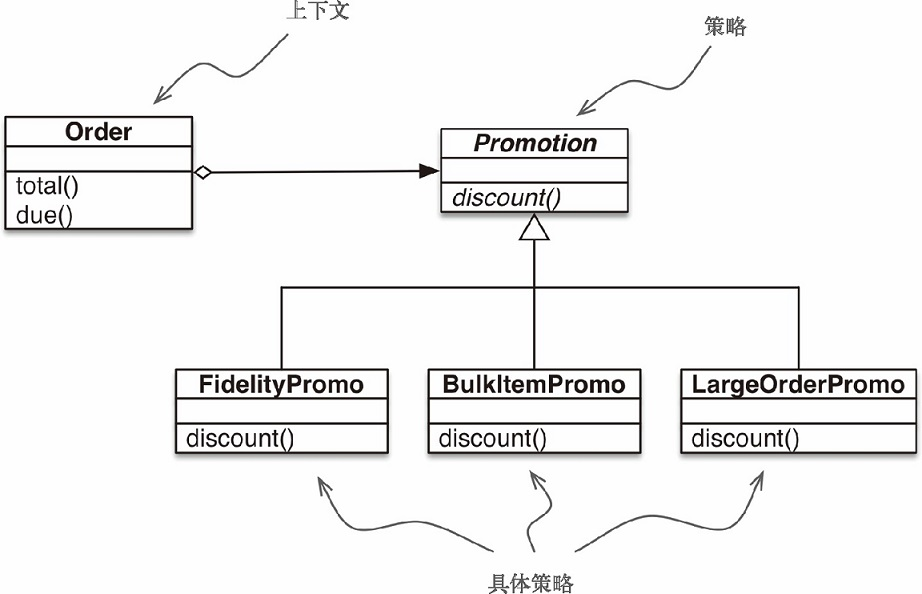
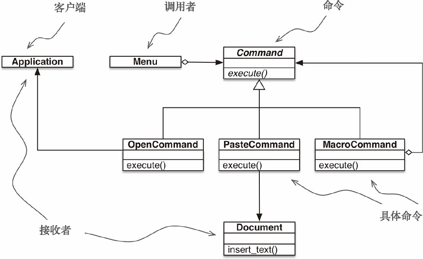

> @Date    : 2020-10-03 19:46:35
>
> @Author  : Lewis Tian (taseikyo@gmail.com)
>
> @Link    : github.com/taseikyo

# 使用一等函数实现设计模式

## Table of Contents

- [6.1 案例分析：重构 "策略" 模式](#61-案例分析重构-策略-模式)
	- [6.1.1 经典的"策略"模式](#611-经典的策略模式)
	- [6.1.2 使用函数实现"策略"模式](#612-使用函数实现策略模式)
	- [6.1.3 选择最佳策略：简单的方式](#613-选择最佳策略简单的方式)
	- [6.1.4 找出模块中的全部策略](#614-找出模块中的全部策略)
- [6.2 "命令"模式](#62-命令模式)
- [6.3 本章小结](#63-本章小结)
- [6.4 延伸阅读](#64-延伸阅读)
	- [杂谈](#杂谈)

虽然设计模式与语言无关，但这并不意味着每一个模式都能在每一门语言中使用。1996 年，Peter Norvig 在题为 "Design Patterns in Dynamic Languages"（http://norvig.com/design-patterns/ ）的演讲中指出，Gamma 等人合著的《设计模式：可复用面向对象软件的基础》一书中有 23 个模式，其中有 16 个在动态语言中 "不见了，或者简化了"（参见第 9 张幻灯片）。他讨论的是 Lisp 和 Dylan，不过很多相关的动态特性在 Python 中也能找到

《设计模式：可复用面向对象软件的基础》的作者在引言中承认，所用的语言决定了哪些模式可用：程序设计语言的选择非常重要，它将影响人们理解问题的出发点。我们的设计模式采用了 Smalltalk 和 C++ 层的语言特性，这个选择实际上决定了哪些机制可以方便地实现，而哪些则不能。若我们采用过程式语言，可能就要包括诸如 "集成" "封装" 和 "多态" 的设计模式。相应地，一些特殊的面向对象语言可以直接支持我们的某些模式，例如 CLOS 支持多方法概念，这就减少了访问者模式的必要性

具体而言，Norvig 建议在有一等函数的语言中重新审视 "策略" "命令" "模板方法" 和 "访问者" 模式。通常，我们可以把这些模式中涉及的某些类的实例替换成简单的函数，从而减少样板代码。本章将使用函数对象重构 "策略" 模式，还将讨论一种更简单的方式，用于简化 "命令" 模式

## 6.1 案例分析：重构 "策略" 模式

如果合理利用作为一等对象的函数，某些设计模式可以简化，"策略" 模式就是其中一个很好的例子。本节接下来的内容中将说明 "策略" 模式，并使用《设计模式：可复用面向对象软件的基础》一书中所述的 "经典" 结构实现它。如果你熟悉这个经典模式，可以跳到 6.1.2 节，了解如何使用函数重构代码来有效减少代码行数

### 6.1.1 经典的"策略"模式

图 6-1 中的 UML 类图指出了"策略"模式对类的编排



《设计模式：可复用面向对象软件的基础》一书是这样概述 "策略" 模式的：定义一系列算法，把它们一一封装起来，并且使它们可以相互替换。本模式使得算法可以独立于使用它的客户而变化

电商领域有个功能明显可以使用 "策略" 模式，即根据客户的属性或订单中的商品计算折扣

假如一个网店制定了下述折扣规则

- 有 1000 或以上积分的顾客，每个订单享 5% 折扣
- 同一订单中，单个商品的数量达到 20 个或以上，享 10% 折扣
- 订单中的不同商品达到 10 个或以上，享 7% 折扣

简单起见，我们假定一个订单一次只能享用一个折扣

"策略"模式的 UML 类图见图 6-1，其中涉及下列内容

- 上下文：把一些计算委托给实现不同算法的可互换组件，它提供服务。在这个电商示例中，上下文是 Order，它会根据不同的算法计算促销折扣
- 策略：实现不同算法的组件共同的接口。在这个示例中，名为 Promotion 的抽象类扮演这个角色
- 具体策略："策略" 的具体子类。fidelityPromo、BulkPromo 和 LargeOrderPromo 是这里实现的三个具体策略

按照《设计模式：可复用面向对象软件的基础》一书的说明，具体策略由上下文类的客户选择。在这个示例中，实例化订单之前，系统会以某种方式选择一种促销折扣策略，然后把它传给 Order 构造方法。具体怎么选择策略，不在这个模式的职责范围内

示例 6-1 实现 Order 类，支持插入式折扣策略

```Python
from abc import ABC, abstractmethod
from collections import namedtuple

Customer = namedtuple('Customer', 'name fidelity')


class LineItem:
    def __init__(self, product, quantity, price):
        self.product = product
        self.quantity = quantity
        self.price = price

    def total(self):
        return self.price * self.quantity


class Order:  # 上下文
    def __init__(self, customer, cart, promotion=None):
        self.customer = customer
        self.cart = list(cart)
        self.promotion = promotion

    def total(self):
        if not hasattr(self, '__total'):
            self.__total = sum(item.total() for item in self.cart)
        return self.__total

    def due(self):
        if self.promotion is None:
            discount = 0
        else:
            discount = self.promotion.discount(self)
        return self.total() - discount

    def __repr__(self):
        fmt = '<Order total: {:.2f} due: {:.2f}>'
        return fmt.format(self.total(), self.due())


class Promotion(ABC):  # 策略：抽象基类
    @abstractmethod
    def discount(self, order):
        """返回折扣金额（正值）"""


class FidelityPromo(Promotion):  # 第一个具体策略
    """为积分为1000或以上的顾客提供5%折扣"""

    def discount(self, order):
        return order.total() * .05 if order.customer.fidelity >= 1000 else 0


class BulkItemPromo(Promotion):  # 第二个具体策略
    """单个商品为20个或以上时提供10%折扣"""

    def discount(self, order):
        discount = 0
        for item in order.cart:
            if item.quantity >= 20:
                discount += item.total() * .1
        return discount


class LargeOrderPromo(Promotion):  # 第三个具体策略
    """订单中的不同商品达到10个或以上时提供7%折扣"""

    def discount(self, order):
        distinct_items = {item.product for item in order.cart}
        if len(distinct_items) >= 10:
            return order.total() * .07
        return 0
```

注意，在示例 6-1 中，我把 Promotion 定义为抽象基类（Abstract Base Class，ABC），这么做是为了使用 @abstractmethod 装饰器，从而明确表明所用的模式

> 在 Python 3.4 中，声明抽象基类最简单的方式是子类化 abc.ABC。我在示例 6-1 中就是这么做的。从 Python 3.0 到 Python 3.3，必须在 class 语句中使用 metaclass= 关键字（例如，class Promotion(metaclass=ABCMeta)）

示例 6-2 是一些 doctest，在某个实现了上述规则的模块中演示和验证相关操作

示例 6-2 使用不同促销折扣的 Order 类示例

```Python
>>> joe = Customer('John Doe', 0) ➊
>>> ann = Customer('Ann Smith', 1100)
>>> cart = [LineItem('banana', 4, .5), ➋
... 		LineItem('apple', 10, 1.5),
... 		LineItem('watermellon', 5, 5.0)]
>>> Order(joe, cart, FidelityPromo()) ➌
<Order total: 42.00 due: 42.00>
>>> Order(ann, cart, FidelityPromo()) ➍
<Order total: 42.00 due: 39.90>
>>> banana_cart = [LineItem('banana', 30, .5), ➎
... 				LineItem('apple', 10, 1.5)]
>>> Order(joe, banana_cart, BulkItemPromo()) ➏
<Order total: 30.00 due: 28.50>
>>> long_order = [LineItem(str(item_code), 1, 1.0) ➐
... 			for item_code in range(10)]
>>> Order(joe, long_order, LargeOrderPromo()) ➑
<Order total: 10.00 due: 9.30>
>>> Order(joe, cart, LargeOrderPromo())
<Order total: 42.00 due: 42.00>
```

❶ 两个顾客：joe 的积分是 0，ann 的积分是 1100
❷ 有三个商品的购物车
❸ fidelityPromo 没给 joe 提供折扣
❹ ann 得到了 5% 折扣，因为她的积分超过 1000
❺ banana_cart 中有 30 把香蕉和 10 个苹果
❻ BulkItemPromo 为 joe 购买的香蕉优惠了 1.50 美元
❼ long_order 中有 10 个不同的商品，每个商品的价格为 1.00 美元
❽ LargerOrderPromo 为 joe 的整个订单提供了 7% 折扣

### 6.1.2 使用函数实现"策略"模式

在示例 6-1 中，每个具体策略都是一个类，而且都只定义了一个方法，即 discount。此外，策略实例没有状态（没有实例属性）。你可能会说，它们看起来像是普通的函数 —— 的确如此。示例 6-3 是对示例 6-1 的重构，把具体策略换成了简单的函数，而且去掉了 Promo 抽象类


示例 6-3 Order 类和使用函数实现的折扣策略

```Python
from collections import namedtuple

Customer = namedtuple('Customer', 'name fidelity')


class LineItem:
    def __init__(self, product, quantity, price):
        self.product = product
        self.quantity = quantity
        self.price = price

    def total(self):
        return self.price * self.quantity


class Order:  # 上下文
    def __init__(self, customer, cart, promotion=None):
        self.customer = customer
        self.cart = list(cart)
        self.promotion = promotion

    def total(self):
        if not hasattr(self, '__total'):
            self.__total = sum(item.total() for item in self.cart)
        return self.__total

    def due(self):
        if self.promotion is None:
            discount = 0
        else:
            discount = self.promotion(self) ➊
        return self.total() - discount

    def __repr__(self):
        fmt = '<Order total: {:.2f} due: {:.2f}>'
        return fmt.format(self.total(), self.due())


➋
def fidelity_promo(order): ➌
	"""为积分为1000或以上的顾客提供5%折扣"""
	return order.total() * .05 if order.customer.fidelity >= 1000 else 0


def bulk_item_promo(order):
    """单个商品为20个或以上时提供10%折扣"""
    discount = 0
    for item in order.cart:
        if item.quantity >= 20:
            discount += item.total() * .1
    return discount


def large_order_promo(order):
    """订单中的不同商品达到10个或以上时提供7%折扣"""
    distinct_items = {item.product for item in order.cart}
    if len(distinct_items) >= 10:
        return order.total() * .07
    return 0

```

❶ 计算折扣只需调用 self.promotion() 函数
❷ 没有抽象类
❸ 各个策略都是函数

示例 6-3 中的代码比示例 6-1 少 12 行。不仅如此，新的 Order 类使用起来更简单，如示例 6-4 中的 doctest 所示

示例 6-4 使用函数实现的促销折扣的 Order 类示例

```Python
>>> joe = Customer('John Doe', 0) ➊
>>> ann = Customer('Ann Smith', 1100)
>>> cart = [LineItem('banana', 4, .5),
... LineItem('apple', 10, 1.5),
... LineItem('watermellon', 5, 5.0)]
>>> Order(joe, cart, fidelity_promo) ➋
<Order total: 42.00 due: 42.00>
>>> Order(ann, cart, fidelity_promo)
<Order total: 42.00 due: 39.90>
>>> banana_cart = [LineItem('banana', 30, .5),
... LineItem('apple', 10, 1.5)]
>>> Order(joe, banana_cart, bulk_item_promo) ➌
<Order total: 30.00 due: 28.50>
>>> long_order = [LineItem(str(item_code), 1, 1.0)
... for item_code in range(10)]
>>> Order(joe, long_order, large_order_promo)
<Order total: 10.00 due: 9.30>
>>> Order(joe, cart, large_order_promo)
<Order total: 42.00 due: 42.00>
```

❶ 与示例 6-1 一样的测试固件
❷ 为了把折扣策略应用到 Order 实例上，只需把促销函数作为参数传入
❸ 这个测试和下一个测试使用不同的促销函数

注意示例 6-4 中的标注：没必要在新建订单时实例化新的促销对象，函数拿来即用

值得注意的是，《设计模式：可复用面向对象软件的基础》一书的作者指出："策略对象通常是很好的享元（flyweight）。" 那本书的另一部分对 "享元" 下了定义："享元是可共享的对象，可以同时在多个上下文中使用。" 共享是推荐的做法，这样不必在每个新的上下文（这里是 Order 实例）中使用相同的策略时不断新建具体策略对象，从而减少消耗。因此，为了避免 "策略" 模式的一个缺点（运行时消耗），《设计模式：可复用面向对象软件的基础》的作者建议再使用另一个模式。但此时，代码行数和维护成本会不断攀升

在复杂的情况下，需要具体策略维护内部状态时，可能需要把 "策略" 和 "享元" 模式结合起来。但是，具体策略一般没有内部状态，只是处理上下文中的数据。此时，一定要使用普通的函数，别去编写只有一个方法的类，再去实现另一个类声明的单函数接口。函数比用户定义的类的实例轻量，而且无需使用 "享元" 模式，因为各个策略函数在 Python 编译模块时只会创建一次。普通的函数也是 "可共享的对象，可以同时在多个上下文中使用"

至此，我们使用函数实现了 "策略" 模式，由此也出现了其他可能性。假设我们想创建一个 "元策略"，让它为指定的订单选择最佳折扣。接下来的几节会接着重构，利用函数和模块是对象，使用不同的方式实现这个需求

### 6.1.3 选择最佳策略：简单的方式

我们继续使用示例 6-4 中的顾客和购物车，在此基础上添加 3 个测试

示例 6-5 best_promo 函数计算所有折扣，并返回额度最大的

```Python
>>> Order(joe, long_order, best_promo) ➊
<Order total: 10.00 due: 9.30>
>>> Order(joe, banana_cart, best_promo) ➋
<Order total: 30.00 due: 28.50>
>>> Order(ann, cart, best_promo) ➌
<Order total: 42.00 due: 39.90>
```

❶ best_promo 为顾客 joe 选择 larger_order_promo
❷ 订购大量香蕉时，joe 使用 bulk_item_promo 提供的折扣
❸ 在一个简单的购物车中，best_promo 为忠实顾客 ann 提供 fidelity_promo 优惠的折扣

best_promo 函数的实现特别简单，如示例 6-6 所示

示例 6-6 best_promo 迭代一个函数列表，并找出折扣额度最大的


```Python
promos = [fidelity_promo, bulk_item_promo, large_order_promo] ➊

def best_promo(order): ➋
	"""选择可用的最佳折扣
	"""
	return max(promo(order) for promo in promos) 
```

❶ promos 列出以函数实现的各个策略
❷ 与其他几个 `*_promo` 函数一样，best_promo 函数的参数是一个 Order 实例
❸ 使用生成器表达式把 order 传给 promos 列表中的各个函数，返回折扣额度最大的那个函数

示例 6-6 简单明了，promos 是函数列表。习惯函数是一等对象后，自然而然就会构建那种数据结构存储函数

虽然示例 6-6 可用，而且易于阅读，但是有些重复可能会导致不易察觉的缺陷：若想添加新的促销策略，要定义相应的函数，还要记得把它添加到 promos 列表中；否则，当新促销函数显式地作为参数传给 Order 时，它是可用的，但是 best_promo 不会考虑它。继续往下读，了解这个问题的几种解决方案

### 6.1.4 找出模块中的全部策略

在 Python 中，模块也是一等对象，而且标准库提供了几个处理模块的函数。Python 文档是这样说明内置函数 globals 的

- globals() 返回一个字典，表示当前的全局符号表。这个符号表始终针对当前模块（对函数或方法来说，是指定义它们的模块，而不是调用它们的模块）

示例 6-7 使用 globals 函数帮助 best_promo 自动找到其他可用的 `*_promo` 函数，过程有点曲折

示例 6-7 内省模块的全局命名空间，构建 promos 列表

```Python
promos = [globals()[name] for name in globals() ➊
		if name.endswith('_promo') ➋
		and name != 'best_promo'] ➌

def best_promo(order):
	"""选择可用的最佳折扣
	"""
	return max(promo(order) for promo in promos) ➍
```

❶ 迭代 globals() 返回字典中的各个 name
❷ 只选择以 `_promo` 结尾的名称
❸ 过滤掉 best_promo 自身，防止无限递归
❹ best_promo 内部的代码没有变化

收集所有可用促销的另一种方法是，在一个单独的模块中保存所有策略函数，把 best_promo 排除在外

在示例 6-8 中，最大的变化是内省名为 promotions 的独立模块，构建策略函数列表。注意，示例 6-8 要导入 promotions 模块，以及提供高阶内省函数的 inspect 模块（简单起见，这里没有给出导入语句，因为导入语句一般放在文件顶部）

示例 6-8 内省单独的 promotions 模块，构建 promos 列表

```Markdown
promos = [func for name, func in
		inspect.getmembers(promotions, inspect.isfunction)]

def best_promo(order):
	"""选择可用的最佳折扣
	"""
	return max(promo(order) for promo in promos)
```

inspect.getmembers 函数用于获取对象（这里是 promotions 模块）的属性，第二个参数是可选的判断条件（一个布尔值函数）。我们使用的是 inspect.isfunction，只获取模块中的函数

不管怎么命名策略函数，示例 6-8 都可用；唯一重要的是，promotions 模块只能包含计算订单折扣的函数。当然，这是对代码的隐性假设。如果有人在 promotions 模块中使用不同的签名定义函数，那么 best_promo 函数尝试将其应用到订单上时会出错

我们可以添加更为严格的测试，审查传给实例的参数，进一步过滤函数。示例 6-8 的目的不是提供完善的方案，而是强调模块内省的一种用途

动态收集促销折扣函数更为显式的一种方案是使用简单的装饰器。第 7 章讨论函数装饰器时会使用其他方式实现这个电商 "策略" 模式示例

下一节讨论 "命令" 模式。这个设计模式也常使用单方法类实现，同样也可以换成普通的函数。

## 6.2 "命令"模式
"命令"设计模式也可以通过把函数作为参数传递而简化。这一模式对类的编排如图 6-2 所
示。



图 6-2：菜单驱动的文本编辑器的 UML 类图，使用"命令"设计模式实现。各个命令可
以有不同的接收者（实现操作的对象）。对 PasteCommand 来说，接收者是
Document。对 OpenCommand 来说，接收者是应用程序

"命令" 模式的目的是解耦调用操作的对象（调用者）和提供实现的对象（接收者）。在《设计模式：可复用面向对象软件的基础》所举的示例中，调用者是图形应用程序中的菜单项，而接收者是被编辑的文档或应用程序自身

这个模式的做法是，在二者之间放一个 Command 对象，让它实现只有一个方法（execute）的接口，调用接收者中的方法执行所需的操作。这样，调用者无需了解接收者的接口，而且不同的接收者可以适应不同的 Command 子类。调用者有一个具体的命令，通过调用 execute 方法执行。注意，图 6-2 中的 MacroCommand 可能保存一系列命令，它的 execute() 方法会在各个命令上调用相同的方法

Gamma 等人说过："命令模式是回调机制的面向对象替代品。" 问题是，我们需要回调机制的面向对象替代品吗？有时确实需要，但并非始终需要

我们可以不为调用者提供一个 Command 实例，而是给它一个函数。此时，调用者不用调用 command.execute()，直接调用 command() 即可。MacroCommand 可以实现成定义了 `__call__` 方法的类。这样，MacroCommand 的实例就是可调用对象，各自维护着一个函数列表，供以后调用

示例 6-9 MacroCommand 的各个实例都在内部存储着命令列表

```Python
class MacroCommand:
	"""一个执行一组命令的命令"""
	def __init__(self, commands):
		self.commands = list(commands) # ➊

	def __call__(self):
		for command in self.commands: # ➋
			command()
```

❶ 使用 commands 参数构建一个列表，这样能确保参数是可迭代对象，还能在各个 MacroCommand 实例中保存各个命令引用的副本
❷ 调用 MacroCommand 实例时，self.commands 中的各个命令依序执行。复杂的"命令"模式（如支持撤销操作）可能需要更多，而不仅是简单的回调函数。即便如此，也可以考虑使用 Python 提供的几个替代品

- 像示例 6-9 中 MacroCommand 那样的可调用实例，可以保存任何所需的状态，而且除了 `__call__` 之外还可以提供其他方法
- 可以使用闭包在调用之间保存函数的内部状态

使用一等函数对 "命令" 模式的重新审视到此结束。站在一定高度上看，这里采用的方式与 "策略" 模式所用的类似：把实现单方法接口的类的实例替换成可调用对象。毕竟，每个 Python 可调用对象都实现了单方法接口，这个方法就是 `__call__`

## 6.3 本章小结

经典的《设计模式：可复用面向对象软件的基础》一书出版几年后，Peter Norvig 指出，"在 Lisp 或 Dylan 中，23 个设计模式中有 16 个的实现方式比 C++ 中更简单，而且能保持同等质量，至少各个模式的某些用途如此"（Norvig 的 "Design Patterns in DynamicLanguages" 演讲，第 9 张幻灯片，http://www.norvig.com/design-patterns/index.htm ）。Python 有些动态特性与 Lisp 和 Dylan 一样，尤其是本书这一部分着重讨论的一等函数

本章开头引用的那句话是 Ralph Johnson 在纪念《设计模式：可复用面向对象软件的基础》原书出版 20 周年的活动上所说的，他指出这本书的缺点之一是："过多强调设计模式的结果，而没有细说过程。" 本章从 "策略" 模式开始，使用一等函数简化了实现方式

很多情况下，在 Python 中使用函数或可调用对象实现回调更自然，这比模仿 Gamma、Helm、Johnson 和 Vlissides 在书中所述的 "策略" 或 "命令" 模式要好。本章对 "策略" 模式的重构和对 "命令" 模式的讨论是为了通过示例说明一个更为常见的做法：有时，设计模式或 API 要求组件实现单方法接口，而那个方法的名称很宽泛，例如 "execute""run" 或 "doIt"。在 Python 中，这些模式或 API 通常可以使用一等函数或其他可调用的对象实现，从而减少样板代码

Peter Norvig 那次设计模式演讲想表达的观点是，"命令" 和 "策略" 模式（以及 "模板方法" 和 "访问者" 模式）可以使用一等函数实现，这样更简单，甚至 "不见了"，至少对这些模式的某些用途来说是如此

## 6.4 延伸阅读

结束对 "策略" 模式的讨论时，我建议使用函数装饰器改进示例 6-8。本章还多次提到了闭包。装饰器和闭包是第 7 章的话题。那一章首先重构本章的电商示例，使用装饰器注册可用的促销方式

《Python Cookbook（第 3 版）中文版》（David Beazley 和 Brian K. Jones 著）的 "8.21 实现访问者模式" 使用优雅的方式实现了 "访问者" 模式，其中的 NodeVisitor 类把方法当作一等对象处理

在设计模式方面，Python 程序员的阅读选择没有其他语言多

据我所知，截至 2014 年 6 月，Learning Python Design Patterns（Gennadiy Zlobin 著，Packt 出版社）是唯一一本专门针对 Python 设计模式的书。不过 Zlobin 这本书特别薄（100 页），只涵盖了 23 种设计模式中的 8 种

《Python 高级编程》（Tarek Ziadé 著）是市面上最好的 Python 中级书，第 14 章 "有用的设计模式" 从 Python 程序员的视角介绍了 7 种经典模式

Alex Martelli 做过几次关于 Python 设计模式的演讲。他在 EuroPython 2011 上的演讲有视频（http://pyvideo.org/europython-2011/python-design-patterns.html ），他的个人网站中有一些幻灯片（http://www.aleax.it/gdd_pydp.pdf ）。这些年，我找到了不同的幻灯片和视频，长短不一，因此要仔细搜索他的名字和 "Python Design Patterns" 这些词

2008 年左右，《Java 编程思想》的作者 Bruce Eckel 开始写一本题为 Python 3 Patterns, Recipes and Idioms 的书（http://www.mindviewinc.com/Books/Python3Patterns/Index.php ）。这本书有很多贡献者，领头人是 Eckel，但是六年过去了，依然没有写完，看样子是流产了（写作本书时，仓库的最后一次改动是在两年前

用 Java 写的设计模式书很多，其中我最喜欢的一本是《Head First 设计模式》（EricFreeman、Bert Bates、Kathy Sierra 和 Elisabeth Robson 著）。这本书讲解了 23 个经典模式中的 16 个。如果你喜欢 Head First 系列丛书的古怪风格，而且想了解这个主题，你会喜欢这本书的。不过，它是围绕 Java 讲解的

如果想换个新鲜的角度，从支持鸭子类型和一等函数的动态语言入手，《Ruby 设计模式》（Russ Olsen 著）一书有很多见解也适用于 Python。虽然 Python 和 Ruby 在句法上有很多区别，但是二者在语义方面很接近，比 Java 或 C++ 接近

在 "Design Patterns in Dynamic Languages"（http://norvig.com/design-patterns/ ）这一演讲中，Peter Norvig 展示了如何使用一等函数（和其他动态特性）简化几个经典的设计模式，或者根本不需要使用设计模式

当然，如果你想认真研究这个话题，Gamma 等人写的《设计模式：可复用面向对象软件的基础》一书是必读的。光是 "引言" 就值回书钱了。人们经常引用这本书中的两个设计原则："对接口编程，而不是对实现编程" 和 "优先使用对象组合，而不是类继承"

### 杂谈

Python 拥有一等函数和一等类型，Norvig 声称，这些特性对 23 个模式中的 16 个有影响（"Design Patterns in Dynamic Languages"，第 10 张幻灯片，http://norvig.com/design-patterns/ ）。读到下一章你会发现，Python 还有泛函数（7.8.2 节）。泛函数与 CLOS 中的多方法（multimethod）类似，Gamma 等人建议使用多方法以一种简单的方式实现经典的 "访问者" 模式。Norvig 却说，多方法能简化 "生成器"（Builder）模式（第 10 张幻灯片）。可见，设计模式与语言特性无法精确对应

世界各地的课堂经常使用 Java 示例讲解设计模式。我不止一次听学生说过，他们以为设计模式在任何语言中都有用。事实证明，在 Gamma 等人合著的那本书中，尽管大部分使用 C++ 代码说明（少数使用 Smalltalk），但是 23 个 "经典的" 设计模式都能很好地在 "经典的" Java 中运用。然而，这并不意味着所有模式都能一成不变地在任何语言中运用。那本书的作者在开头就明确表明了，"一些特殊的面向对象语言可以直接支持我们的某些模式"

与 Java、C++ 或 Ruby 相比，Python 设计模式方面的书籍都很薄。延伸阅读中提到的 Learning Python Design Patterns（Gennadiy Zlobin 著）在 2013 年 11 月才出版。而《Ruby 设计模式》（Russ Olsen 著）在 2007 年就出版了，而且有 384 页，比 Zlobin 的那本书多出 284 页

如今，Python 在学术界越来越流行，希望以后会有更多以这门语言讲解设计模式的书籍。此外，Java 8 引入了方法引用和匿名函数，这些广受期盼的特性有可能为 Java 催生新的模式实现方式 —— 要知道，语言会进化，因此运用经典设计模式的方式必定要随之进化
