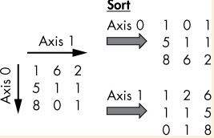

# Data Science

## Basic array arithmetic operations

```python
# Creating a 1D/2D/3D array from a list
import numpy as np

a = np. array([1, 2, 3])
b = np. array([[1, 2],
               [3, 4]])
c = np. array([[[1, 2], [3, 4]],
               [5, 6], [7, 8]])

x = np.array([[1, 0, 0],
              [1, 1, 1],
              [2, 0, 0]])
y = np.array([[1, 1, 1],
              [1, 1, 2],
              [1, 1, 2]])
x+y

x*y

np.max(x)
# 2
np.min(x)
# 0
np.average(x)
# 0.6666666666666666
```

## Slicing, Broadcasting, and Array Types

- Indexing and slicing in NumPy are similar to indexing and slicing in *List*

对于多维数组，可以使用逗号分隔的索引访问不同的维度，但是这种方法在原生的 Python 列表中无法使用。

```python
a = np.array([[0,  1,  2,  3],
              [4,  5,  6,  7],
              [8,  9,  10, 11],
              [12, 13, 14, 15]])
print(a[:, 2])
# Third col:[2 6 1014]
print(a[1, :])
# Second row:[4 5 6 7]
print(a[1, ::2])
# Second row, every other element:[4 6]
print(a[:, :-1])
# All columns except last:
# [[0  1  2]
#  [4  5  6]
#  [8  9  10]
#  [12 13 14]]
print(a[:-2])
# Same as a[:-2,:]
# [[0 1 2 3]
#  [4 5 6 7]]
```

- Broadcasting describes the automatic process of bringing two NumPy arrays into the same shape so that you can apply certain element-wise operations
- Every array has an associated *shape* attribute, a tuple that gives you the number of elements in each axis
- If you increase the dimensionality of an array(for example, you move from 2D to 3D arrays), the new axis becomes axis 0, and the i-th axis of the low-dlimensional array becomes the(i+1)-th axis of the high-dimensional array

```python
import numpy as np

a = np.array([1, 2, 3, 4])
print(a.ndim)
# 1
print(a.shape)
# (4, )
b = np. array([[2, 1, 2], [3, 2, 3], [4, 3, 4]])
print(b.ndim)
# 2
print(b.shape)
# (3, 3)
c = np.array([[[1, 2, 3], [2, 3, 4], [3, 4, 5]],
              [[1, 2, 4], [2, 3, 5], [3, 4, 6]]])
print(c.ndim)
# 3
print(c.shape)
# (2, 3, 3)
```

- Broadcasting automatically fixes element-wise operations of NumPy arrays with different shapes
	- if the left and right data don't match (say, the left operator is a NumPy array, while the right is a float value)
	- NumPy automatically creates a new array from the right-side data
	- The new array has the same size and dimensionality as the array on the left and contains the same float values

所以，所谓的 broadcasting/广播 就是对于不同维度的数组运算时进行升维

```python
b = np. array([[2, 1, 2], [3, 2, 3], [4, 3, 4]])
c = np.array([[[1, 2, 3], [2, 3, 4], [3, 4, 5]],
              [[1, 2, 4], [2, 3, 5], [3, 4, 6]]])
b*c
# array([[[2,  2,  6], [6,  6, 12], [12, 12, 20]],
#        [[2,  2,  8], [6,  6, 15], [12, 12, 24]]])
```

## Conditional Array Search,Filtering,and Broadcasting to Detect Outliers

条件数组搜索，过滤和广播以检测异常值

- NumPy offers the function `nonzero()` that finds indices of elements in an array that are, well, not equal to zero

```python
X = np.array([[1, 0, 0],
              [0, 2, 2],
              [3, 0, 0]])
print(np.nonzero(X))
# (array([0, 1, 1, 2], dtype=int64), array([0, 1, 2, 0], dtype=int64))
```

对于上面的结果，第一个数组表示非零元素的行索引，第二个表示列索引，因此有四个非零元素，分布为 X[0, 0]，X[1, 1]，X[1, 2]，X[2, 0]

```python
X = np.array([[1, 0, 0],
              [0, 2, 2],
              [3, 0, 0]])
print(X > np.average(X))
'''
[[ True False False]
 [False  True  True]
 [ True False False]]
'''
```

## Boolean Indexing to Filter Two-Dimensional Arrays

```python
import numpy as np
a = np.array([[1, 2, 3],
              [4, 5, 6],
              [7, 8, 9]])
index = np.array([[False, False, True],
                    [False, False, False],
                    [True, True, False]])
a[index]
# array([3, 7, 8])
```

这个布尔索引就很有趣，也不难理解，就是判断 a 中每个位置的布尔值和对应 index 位置的值是否匹配/相同，然后取出所有符合条件的值。

```python
# find the names of the Instagram superstars with more than 100 million followers!
# Dependencies
import numpy as np
# Data: popular Instagram accounts(millions followers)
inst = np.array([[232, "@instagram"],
                 [133, "@selenagomez"],
                 [59, "@victoriassecret"],
                 [120, "@cristiano"],
                 [111, "@beyonce"],
                 [76, "@nike"]])

superstars = inst[inst[:, 0].astype(float) > 100, 1]
# array(['@instagram', '@selenagomez', '@cristiano', '@beyonce'], dtype='<U16')
```

## Broadcasting, Slice Assignment, and Reshaping to Clean Every i-th Array Element

- Slice Assignment

```python
a = np.array([4]*16)
print(a)
# [4 4 4 4 4 4 4 4 4 4 4 4 4 4 4 4]
a[1:] = [42]*15
print(a)
# [4 42 42 42 42 42 42 42 42 42 42 42 42 42 42 42]
```

- Reshaping

```python
a = np.array([1, 2, 3, 4, 5, 6])
print(a.reshape((2, 3)))
'''
[[1 2 3]
 [4 5 6]]
'''
print(a.reshape((2, -1)))
'''
[[1 2 3]
 [4 5 6]]
'''
print(a.reshape((-1, 2)))
'''
[[1 2]
 [3 4]
 [5 6]]
'''
```

也可以让 numpy 自己算行/列数，试了下扔 **负数** 进去都可以

- The Axis Argument

```python
b
'''
array([[2, 1, 2],
       [3, 2, 3],
       [4, 3, 4]])
'''

np.average(b, axis=0)
# array([3., 2., 3.])

np.average(b, axis=1)
# array([1.66666667, 2.66666667, 3.66666667])
```

## When to Use the sort() Function and When to Use the argsort()

```python
a = np.array([10, 6, 8, 2, 5, 4, 9, 1])
print(np.sort(a))
# [1 2 4 5 6 8 9 10]
print(np.argsort(a))
# [7 3 5 4 1 2 6 0]
```

很明显 `argsort()` 返回了排序后数组的原下标

```python
a = np.array([[1, 6, 2],
              [5, 1, 1],
              [8, 0, 1]])
print(np.sort(a, axis=0))
[[1 0 1]
 [5 1 1]
 [8 6 2]]
print(np.sort(a, axis=1))
[[1 2 6]
 [1 1 5]
 [0 1 8]]

```



## How to Use Lambda Functions and Boolean Indexing to Filter Arrays

```python
## Data(row=[ tite, rating])
books = np. array([['Coffee Break NumPy', 4.6],
                   ['Lord of the Rings', 5.0],
                   ['Harry Potter', 4.3],
                   ['Winnie-the-Pooh', 3.9],
                   ['The Clown of God', 2.2],
                   ['TCoffee Break Python', 4.7]])
# One-liner
predict_bestseller = lambda x,y: x[x[:,1].astype(float)>y]
# Results
print(predict_bestseller(books,3.9))
```
