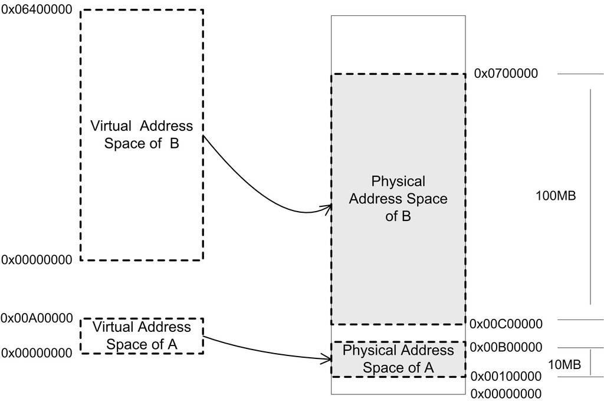
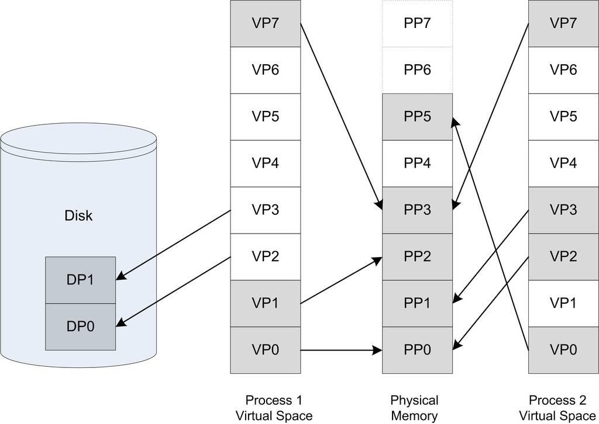
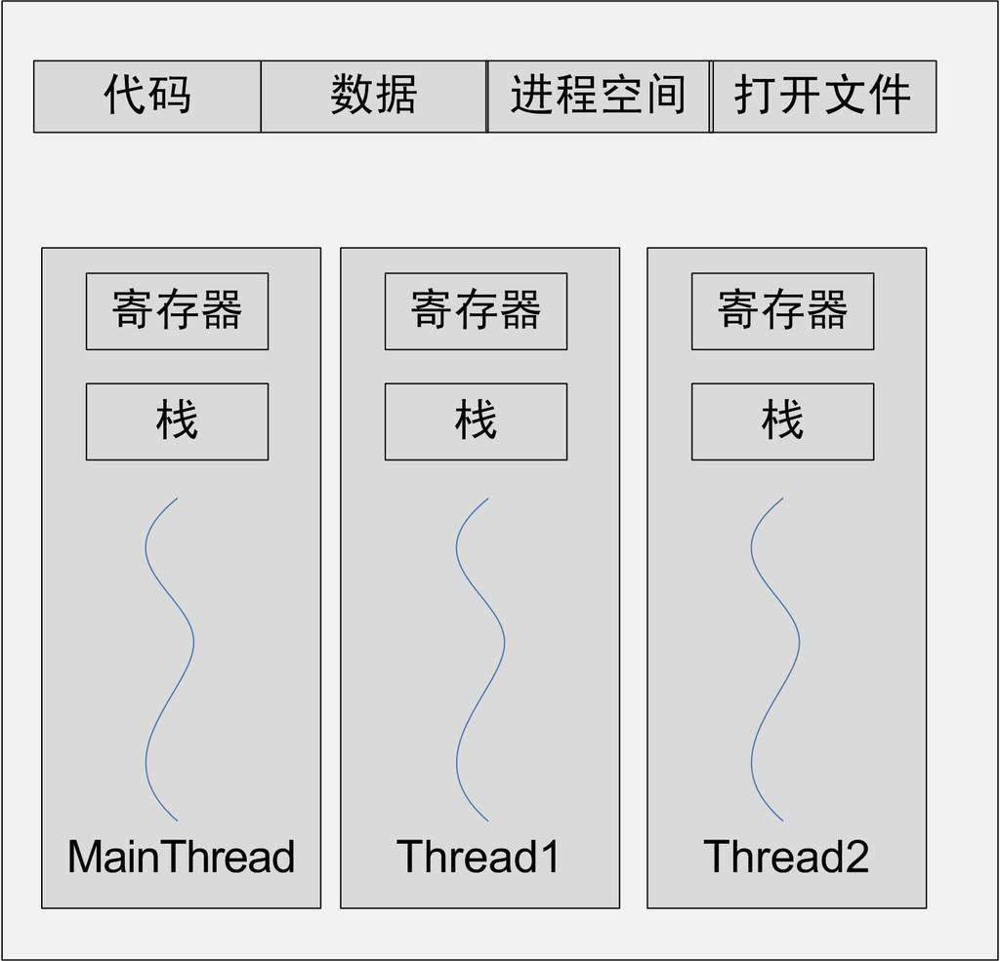
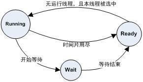
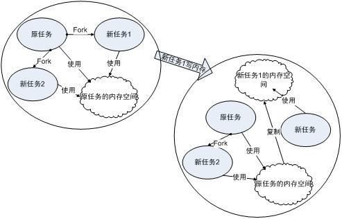
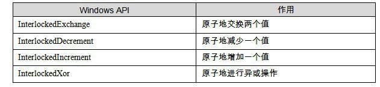
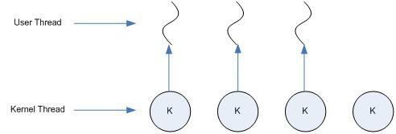
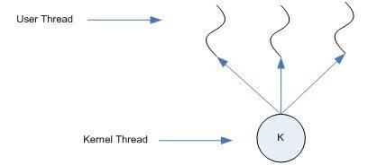
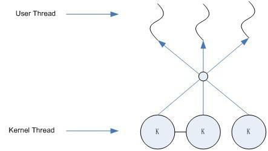

> @Date    : 2020-08-01 21:41:24
>
> @Author  : Lewis Tian (taseikyo@gmail.com)
>
> @Link    : github.com/taseikyo

# 1. 温故而知新

## 1.1 从 Hello World 说起

```c
#include<stdio.h>

int main(){
	printf("Hello World\n");
	return 0;
}
```


对于下面这些问题，你的脑子里能够马上反应出一个很清晰又很明确的答案吗？

- 程序为什么要被编译器编译了之后才可以运行？
- 编译器在把 C 语言程序转换成可以执行的机器码的过程中做了什么，怎么做的？
- 最后编译出来的可执行文件里面是什么？除了机器码还有什么？它们怎么存放的，怎么组织的？
- #include<stdio.h> 是什么意思？把 stdio.h 包含进来意味着什么？C 语言库又是什么？它怎么实现的？
- 不同的编译器 (Microsoft VC、GCC) 和不同的硬件平台 (×86、SPARC、MIPS、ARM), 以及不同的操作系统 (Windows、Linux
、UNIX、Solaris), 最终编译出来的结果一样吗？为什么？
- Hello World 程序是怎么运行起来的？操作系统是怎么装载它的？它从哪儿开始执行，到哪儿结束？main 函数之前发生了什么？main 函数结束以后又发生了什么？
- 如果没有操作系统，Hello World 可以运行吗？如果要在一台没有操作系统的机器上运行 Hello World 需要什么？应该怎么实现？
- printf 是怎么实现的？它为什么可以有不定数量的参数？为什么它能够在终端上输出字符串？
- Hello World 程序在运行时，它在内存中是什么样子的？

## 1.3 站得高，望得远

"Any problem in computer science can be solved by another layer of indirection."

“计算机科学领域的任何问题都可以通过增加一个间接的中间层来解决”

这句话几乎概括了计算机系统软件体系结构的设计要点，整个体系结构从上到下都是按照严格的层次结构设计的。不仅是计算机系统软件整个体系是这样的，体系里面的每个组件比如操作系统本身，很多应用程序、软件系统甚至很多硬件结构都是按照这种层次的结构组织和设计的。

每个层次之间都必须要相互通信，通信则要有协议，我们将其成为接口（interface），接口的下面那层是接口的提供者，由它定义接口；接口的上面那层是接口的使用者，它使用该接口来实现所需要的功能。在层次体系中，接口是被精心设计过的，尽量保持稳定不变，那么理论上层次之间只要遵循这个接口，任何一个层都可以被修改或被替换。除了硬件和应用程序，其他都是所谓的中间层，每个中间层都是对它下面的那层的包装和扩展。正是这些中间层的存在，使得应用程序和硬件之间保持相对的独立，比如硬件和操作系统都日新月异地发展，但是最初为 80386 芯片和 DOS 系统设计的软件在最新的多核处理器和 Windows Vista 下还是能够运行的，这方面归功于硬件和操作系统本身保持了向后兼容性，另一方面不得不归功于这种层次结构的设计方式。最近开始流行的虚拟机技术更是在硬件和操作系统之间增加了一层虚拟层，使得一个计算机上可以同时运行多个操作系统，这也是层次结构带来的好处，在尽可能少改变甚至不改变其他层的情况下，新增加一个层次就可以提供前所未有的功能。

运行库使用操作系统提供的系统调用接口 (System call Interface), 系统调用接口在实现中往往以软件中断 (Software Interrupt) 的方式提供，比如 Linux 使用 0x80 号中断作为系统调用接口，Windows 使用 0×2E 号中断作为系统调用接口 (从 WindowsXPSp2 开始，Windows 开始采用一种新的系统调用方式)

操作系统内核层对于硬件层来说是硬件接口的使用者，而硬件是接囗的定义者，硬件的接口定义决定了操作系统内核，具体来讲就是驱动程序如何操作硬件，如何与硬件进行通信。这种接口往往被叫做硬件规格（Hardware Specification），硬件的生产厂商负责提供硬件规格，操作系统和驱动程序的开发者通过阅读硬件规格文档所规定的各种硬件编程接口标准来编写操作系统和驱动程序

## 1.4 操作系统做什么

### 不要让 CPU 打盹

在计算机发展早期，CPU 资源十分昂贵，如果一个 CPU 只能运行一个程序，那么当程序读写磁盘（当时可能是磁带）时，CPU 就空闲下来了，这在当时简直就是暴殄天物。于是人们很快编写了一个监控程序，当某个程序暂时无须使用 CPU 时，监控程序就把另外的正在等待 CPU 资源的程序启动，使得 CPU 能够充分地利用起来。这种被称为**多道程序**（Multiprogramming）的方法看似很原始，但是它当时的确大大提高了 CPU 的利用率。不过这种原始的多道程序技术存在最大的问题是程序之间的调度策略太粗糙。对于多道程序来说，程序之间不分轻重缓急，如果有些程序急需使用 CPU 来完成一些任务（比如用户交互的任务），那么很有可能很长时间后才有机会分配到 CPU
。这对于有些响应时间要求高的程序来说是很致命的

经过稍微改进，程序运行模式变成了一种协作的模式，即每个程序运行一段时间以后都主动让出 CPU 给其他程序，使得一段时间内每个程序都有机会运行一小段时间。这对于一些交互式的任务尤为重要，比如点击一下鼠标或按下一个键盘按键后，程序所要处理的任务可能并不多，但是它需要尽快地被处理，使得用户能够立即看到效果。这种程序协作模式叫做**分时系统**（Time-Sharing System），这时候的监控程序已经比多道程序要复杂多了，完整的操作系统雏形已经逐渐形成了。Windows 的早期版本（Windows
95 和 Windows NT 之前），Mac OSX 之前的 Mac OS 版本都是采用这种分时系统的方式来调度程序的。比如在 Windows3.1 中，程序调用 Yield、GetMessage 或 PeekMessage 这几个系统调用时，Windows 3.1 操作系统会判断是否有其他程序正在等待 CPU，如果有，则可能暂停执行当前的程序，把 CPU 让出来给其他程序。如果一个程序在进行一个很耗时的计算，一直霸占着 CPU 不放，那么操作系统也没办法，其他程序都只有等着，整个系统看过去好像死机了一样。比如一个程序进入了一个 while（1）的死循环，那么整个系统都停止了

这在现在看来是很荒唐的事，系统中的任何一个程序死循环都会导致系统死机，这是无法令人接受的。当然当时的 PC 硬件处理能力本身就很弱，PC 上的应用也大多是比较低端的应用，所以这种分时方式勉强也能应付一下当时的交互式环境了。此前在高端领域，非 PC 的大中小型机领域，其实已经在研究一种更为先进的操作系统模式了。这种模式就是我们现在很熟悉的多任务（Multi-tasking）系统，操作系统接管了所有的硬件资源，并且本身运行在一个受硬件保护的级别。所有的应用程序都以进程（Process）的方式运行在比操作系统权限更低的级别，每个进程都有自己独立的地址空间，使得进程之间的地址空间相互隔离。CPU 由操作系统统一进行分配，每个进程根据进程优先级的高低都有机会得到 CPU，但是，如果运行时间超出了一定的时间，操作系统会暂停该进程，将 CPU 资源分配给其他等待运行的进程。这种 CPU 的分配方式即所谓的**抢占式**（Preemptive），操作系统可以强制剥夺 CPU 资源并且分配给它认为目前最需要的进程。如果操作系统分配给每个进程的时间都很短，即 CPU 在多个进程间快速地切换，从而造成了很多进程都在同时运行的假象

### 1.4.2 设备驱动

操作系统作为硬件层的上层，它是对硬件的管理和抽象。对于操作系统上面的运行库和应用程序来说，它们希望看到的是一个统一的硬件访问模式。作为应用程序的开发者，我们不希望在开发应用程序的时候直接读写硬件端口、处理硬件中断等这些繁琐的事情。由于硬件之间千差万别，它们的操作方式和访问方式都有区别。比如我们希望在显示器上画一条直线，对于程序员来说，最好的方式是不管计算机使用什么显卡、什么显示器，多少大小多少分辨率，我们都只要调用一个统一的 LineTo() 函数，具体的实现方式由操作系统来完成。试想一下如果程序员需要关心具体的硬件，那么结果会是这样
：对于 A 型号的显卡来说，需要往 I/O 端口 0×1001 写一个命令 0x1111，然后从端口 0x1002 中读取一个 4 字节的显存地址，然后使用 DDA（一种画直线的图形算法）逐个地在显存上画点...如果是 B 型号的显卡，可能完全是另外一种方式。这简直就是灾难。不过在操作系统成熟之前，的确存在这样的情况，就是应用程序的程序员需要直接跟硬件打交道

当成熟的操作系统出现以后，硬件逐渐被抽象成了一系列概念。在 UNIX 中，硬件设备的访问形式跟访问普通的文件形式一样；在 Windows 系统中，图形硬件被抽象成了 GDI，声音和多媒体设备被抽象成了 DirectX 对象；磁盘被抽象成了普通文件系统，等等。程序员逐渐从硬件细节中解放出来，可以更多地关注应用程序本身的开发。这些繁琐的硬件细节全都交给了操作系统，具体地讲是操作系统中的硬件驱动（Device Driver）程序来完成。驱动程序可以看作是操作系统的一部分，它往往跟操作系统内核一起运行在特权级，但它又与操作系统内核之间有一定的独立性，使得驱动程序有比较好的灵活性。因为 PC 的硬件多如牛毛，操作系统开发者不可能为每个硬件开发一个驱动程序，这些驱动程序的开发工作通常由硬件生产厂商完成。操作系统开发者为硬件生产厂商提供了一系列接口和框架，凡是按照这个接口和框架开发的驱动程序都可以在该操作系统上使用。让我们以一个读取文件为例子来看看操作系统和驱动程序在这个过程中扮演了什么样的角色。

提到文件的读取，那么不得不提到文件系统这个操作系统中最为重要的组成部分之一。文件系统管理着磁盘中文件的存储方式，比如我们在 Linux 系统下有一个文件 "/home/user/test.dat"，长度为 8000 个字节。那么我们在创建这个文件的时候，Linux 的 ext3 文件系统有可能将这个文件按照这样的方式存储在磁盘中：文件的前 4096 字节存储在磁盘的 1000 号扇区到 1007 号扇区，每个扇区 512 字节，8 个扇区刚好 4096 字节；文件的第 4097 个字节到第 8000 字节共 3904 个字节，存储在磁盘的 2000 号扇区到 2007 号扇区，8 个扇区也是 4096 字节，只不过只存储了 3904 个有效的字节，剩下的 192 个字节无效

文件系统保存了这些文件的存储结构，负责维护这些数据结构并且保证磁盘中的扇区能够有效地组织和利用。那么当我们在 Linux 操作系统中，要读取这个文件的前 4096 个字节时，我们会使用一个 read 的系统调用来实现。文件系统收到 read 请求之后，判断出文件的前 4096 个字节位于磁盘的 1000 号逻辑扇区到 1007 号逻辑扇区。然后文件系统就向硬盘驱动发出一个读取逻辑扇区为 1000 号开始的 8 个扇区的请求，磁盘驱动程序收到这个请求以后就向硬盘发出硬件命令。向硬件发送 I/O 命令的方式有很多种，其中最为常见的一种就是通过读写 I/O 端口寄存器来实现。在 ×86 平台上，共有 65536 个硬件端口寄存器，不同的硬件被分配到了不同的 I/O 端口地址。CPU 提供了两条专门的指令 "in" 和 "out" 来实现对硬件端口的读和写

对 IDE 接口来说，它有两个通道，分别为 IDE0 和 IDE1，每个通道上可以连接两个设备，分别为 Master 和 Slave，一个 PC 中最多可以有 4 个 IDE 设备。假设我们的文件位于 IDEO 的 Master 硬盘上，这也是正常情况下硬盘所在的位置
。在 PC 中，IDE0 通道的 I/O 端口地址是 0x1F0~0×1F7 及 0×376~0×377。通过读写这些端口地址就能与 IDE 硬盘进行通信。这些端口的作用和操作方式十分复杂，我们以实现读取 1000 号逻辑扇区开始的 8 个扇区为例：

- 第 0x1F3~0×1F64 个字节的端口地址是用来写入 LBA 地址的，那么 1000 号逻辑扇区的 LBA 地址为 0×000003E8，所以我们需要往 0×1F3、0×1F4 写入 0x00，往 0×1F5 写入 0×03，往 0×1F6 写入 0xE8。
- 0x1F2 这个地址用来写入命令所需要读写的扇区数。比如读取 8 个扇区即写入 8。
- 0x1F7 这个地址用来写入要执行的操作的命令码，对于读取操作来说，命令字为 0×20

所以我们要执行的指令为：

```asm
out 0x1F3,0x00
out 0x1F4,0×00
out 0x1F5,0×03
out 0x1F6,0XE8
out 0x1F2,0x08
out 0x1F7,0×20
```

在硬盘收到这个命令以后，它就会执行相应的操作，并且将数据读取到事先设置好的内存地址中（这个内存地址也是通过类似的命令方式设置的）。当然这里的例子中只是最简单的情况，实际情况比这个复杂得多，驱动程序须要考虑硬件的状态（是否忙碌或读取错误）、调度和分配各个请求以达到最高的性能等

## 内存不够怎么办

进程的总体目标是希望每个进程从逻辑上来看都可以独占计算机的资源。操作系统的多任务功能使得 CPU 能够在多个进程之间很好地共享，从进程的角度看好像是它独占了 CPU 而不用考虑与其他进程分享 CPU 的事情。操作系统的 I/O 抽象模型也很好地实现了 I/O 设备的共享和抽象，那么唯一剩下的就是主存，也就是内存的分配问题了

在早期的计算机中，程序是直接运行在物理内存上的，也就是说，程序在运行时所访问的地址都是物理地址。当然，如果一个计算机同时只运行一个程序，那么只要程序要求的内存空间不要超过物理内存的大小，就不会有问题。但事实上为了更有效地利用硬件资源，我们必须同时运行多个程序，正如前面的多道程序、分时系统和多任务中一样，当我们能够同时运行多个程序时，CPU 的利用率将会比较高。那么很明显的一个问题是，如何将计算机上有限的物理内存分配给多个程序使用

假设我们的计算机有 128MB 内存，程序 A 需要 10MB，B 需要 100MB，C 需要 20MB。如果我们需要同时运行A 和 B，那么比较直接的做法是将内存的前 10MB 分配给 A，10MB ~ 110MB 分配给 B。这种简单的内存分配策略问题很多

- 地址空间不隔离所有程序都直接访问物理地址，程序所使用的内存空间不是相互隔离的。恶意的程序可以很容易改写其他程序的内存数据，以达到破坏的目的；有些非恶意的、但是有 bug 的程序可能不小心修改了其他程序的数据，就会使其他程序也崩溃，这对于需要安全稳定的计算环境的用户来说是不能容忍的。用户希望他在使用计算机的时候，其中一个任务失败了，至少不会影响其他任务
- 内存使用效率低由于没有有效的内存管理机制，通常需要一个程序执行时，监控程序就将整个程序装入内存中然后开始执行。如果我们忽然需要运行程序 C，那么这时内存空间其实已经不够了，这时候我们可以用的一个办法是将其他程序的数据暂时写到磁盘里面，等到需要用到的时候再读回来。由于程序所需要的空间是连续的，那么这个例子里面，如果我们将程序 A 换出到磁盘所释放的内存空间是不够的，所以只能将 B 换出到磁盘，然后将 C 读入到内存开始运行。可以看到整个过程中有大量的数据在换入换出，导致效率十分低下
- 程序运行的地址不确定因为程序每次需要装入运行时，我们都需要给它从内存中分配一块足够大的空闲区域，这个空闲区域的位置是不确定的。这给程序的编写造成了一定的麻烦，因为程序在编写时，它访问数据和指令跳转时的目标地址很多都是固定的，这涉及程序的重定位问题，我们在第 2 部分和第 3 部分还会详细探讨重定位的问题

解决这几个问题的思路就是使用我们前文提到过的法宝：增加中间层，即使用一种间接的地址访问方法。整个想法是这样的，我们把程序给出的地址看作是一种虚拟地址（Virtual Address），然后通过某些映射的方法，将这个虚拟地址转换成实际的物理地址。这样，只要我们能够妥善地控制这个虚拟地址到物理地址的映射过程，就可以保证任意一个程序所能够访问的物理内存区域跟另外一个程序相互不重叠，以达到地址空间隔离的效果

### 1.5.1 关于隔离

让我们回到程序的运行本质上来。用户程序在运行时不希望介入到这些复杂的存储器管理过程中，作为普通的程序，它需要的是一个简单的执行环境，有一个单一的地址空间、有自己的 CPU，好像整个程序占有整个计算机而不用关心其他的程序（当然程序间通信的部分除外，因为这是程序主动要求跟其他程序通信和联系）。所谓的地址空间是个比较抽象的概念，你可以把它想象成一个很大的数组，每个数组的元素是一个字节，而这个数组大小由地址空间的地址长度决定，比如 32 位的地址空间的大小为 2^32 = 4294967296 字节，即 4GB，地址空间有效的地址是 0 ~ 4294967295，用十六进制表示就是 0x00000000 ~ 0xFFFFFFFF。地址空间分两种：虚拟地址空间（Virtual Address Space）和物理地址空间（Physical Address Space）
。物理地址空间是实实在在存在的，存在于计算机中，而且对于每一台计算机来说只有唯一的一个，你可以把物理空间想象成物理内存，比如你的计算机用的是 Intel 的 Pentium 4 的处理器，那么它是 32 位的机器，即计算机地址线有 32 条（实际上是 36 条地址线，不过我们暂时认为它只是 32 条），那么物理空间就有 4GB。但是你的计算机上只装了 512MB 的内存，那么其实物理地址的真正有效部分只有 0x00000000 ~ 0×1FFFFFFF，其他部分都是无效的（实际上还有一些外部 I/O 设备映射到物理空间的，也是有效的，但是我们暂时无视其存在）。虚拟地址空间是指虚拟的、人们想象出来的地址空间，其实它并不存在，每个进程都有自己独立的虚拟空间，而且每个进程只能访问自己的地址空间，这样就有效地做到了进程的隔离

### 1.5.2 分段（Segmentation）

最开始人们使用的是一种叫做分段（Segmentation）的方法，基本思路是把一段与程序所需要的内存空间大小的虚拟空间映射到某个地址空间。比如程序 A 需要 10MB 内存，那么我们假设有一个地址从 0x00000000 ~ 0x00A00000 的 10MB 大小的一个假象的空间，也就是虚拟空间，然后我们从实际的物理内存中分配一个相同大小的物理地址，假设是物理地址 0x00100000 开始到 0x00B00000 结束的一块空间。然后我们把这两块相同大小的地址空间 — 映射，即虚拟空间中的每个字节相对应于物理空间中的每个字节。这个映射过程由软件来设置，比如操作系统来设置这个映射函数，实际的地址转换由硬件完成。比如当程序 A 中访问地址 0x00001000 时，CPU 会将这个地址转换成实际的物理地址 0x00101000。那么比如程序 A 和程序 B 在运行时，它们的虚拟空间和物理空间映射关系可能如图 1-5 所示



1-5 段映射机制

分段的方法基本解决了上面提到的 3 个问题中的第一个和第三个。首 先它做到了地址隔离，因为程序 A 和程序 B 被映射到了两块不同的物 理空间区域，它们之间没有任何重叠，如果程序 A 访问虚拟空间的地 址超出了 0x00A00000 这个范围，那么硬件就会判断这是一个非法的 访问，拒绝这个地址请求，并将这个请求报告给操作系统或监控程序 ，由它来决定如何处理。再者，对于每个程序来说，无论它们被分到物理地址的哪一个区域，对于程序来说都是透明的，它们不需要关 心物理地址的变化，它们只需要按照从地址 0x00000000 到 0x00A00000 来编写程序、放置变量，所以程序不再需要重定位

但是分段的这种方法还是没有解决我们的第二个问题，即内存使用效 率的问题。分段对内存区域的映射还是按照程序为单位，如果内存不 足，被换入换出到磁盘的都是整个程序，这样势必会造成大量的磁盘 访问操作，从而严重影响速度，这种方法还是显得粗糙，粒度比较大 。事实上，根据程序的局部性原理，当一个程序在运行时，在某个时 间段内，它只是频繁地用到了一小部分数据，也就是说，程序的很多 数据其实在一个时间段内都是不会被用到的。人们很自然地想到了更 小粒度的内存分割和映射的方法，使得程序的局部性原理得到充分的 利用，大大提高了内存的使用率。这种方法就是分页（Paging）

### 1.5.3 分页（Paging）

分页的基本方法是把地址空间人为地等分成固定大小的页，每一页的 大小由硬件决定，或硬件支持多种大小的页，由操作系统选择决定页 的大小。比如 Intel Pentium 系列处理器支持 4KB 或 4MB 的页大小，那 么操作系统可以选择每页大小为 4KB，也可以选择每页大小为 4MB， 但是在同一时刻只能选择一种大小，所以对整个系统来说，页就是固 定大小的。目前几乎所有的 PC 上的操作系统都使用 4KB 大小的页。我 们使用的 PC 机是 32 位的虚拟地址空间，也就是 4GB，那么按 4KB 每 页分的话，总共有 1 048 576 个页。物理空间也是同样的分法

下面我们来看一个简单的例子，如图 1-6 所示，每个虚拟空间有 8 页 ，每页大小为 1KB，那么虚拟地址空间就是 8KB。我们假设该计算机 有 13 条地址线，即拥有 2^13 的物理寻址能力，那么理论上物理空间可以多达 8KB。但是出于种种原因，购买内存的资金不够，只买得起 6KB 的内存，所以物理空间其实真正有效的只是前 6KB

那么，当我们把进程的虚拟地址空间按页分割，把常用的数据和代码 页装载到内存中，把不常用的代码和数据保存在磁盘里，当需要用到 的时候再把它从磁盘里取出来即可。以图 1-6 为例，我们假设有两个进程 P1 和 P2，它们进程中的部分虚拟页面被映射到了物理页面，比如 VP0、VP1 和 VP7 映射到 PP0、PP2 和 PP3；而有部分 页面却在磁盘中，比如 VP2 和 VP3 位于磁盘的 DP0 和 DP1 中；另外还 有一些页面如 VP4、VP5 和 VP6 可能尚未被用到或访问到，它们暂时 处于未使用的状态。在这里，我们把虚拟空间的页就叫虚拟页 （VP，Virtual Page），把物理内存中的页叫做物理页 （PP，Physical Page），把磁盘中的页叫做磁盘页（DP，Disk Page）。图中的线表示映射关系，我们可以看到虚拟空间的有些页 被映射到同一个物理页，这样就可以实现内存共享



1-6 进程虚拟空间、物理空间和磁盘之间的页映射关系

保护也是页映射的目的之一，简单地说就是每个页可以设置权限属性 ，谁可以修改，谁可以访问等，而只有操作系统有权限修改这些属性 ，那么操作系统就可以做到保护自己和保护进程。对于保护，我们这 里只是简单介绍，详细的介绍和为什么要保护我们将会在本书的第 2 部分再介绍。 虚拟存储的实现需要依靠硬件的支持，对于不同的 CPU 来说是不同的 。但是几乎所有的硬件都采用一个叫 MMU（Memory Management Unit）的部件来进行页映射，如图 1-7 所示


图 1-7 虚拟地址到物理地址的转换

在页映射模式下，CPU 发出的是 Virtual Address，即我们的程序看到 的是虚拟地址。经过 MMU 转换以后就变成了 Physical Address。一般 MMU 都集成在 CPU 内部了，不会以独立的部件存在

## 1.6 众人拾柴火焰高

### 1.6.1 线程基础

现代软件系统中，除了进程之外，线程也是一个十分重要的概念。特别是随着 CPU 频率增长开始出现停滞，而开始向多核方向发展。多线程，作为实现软件并发执行的一个重要的方法，也开始具有越来越重要的地位。我们将在这一节回顾线程相关的内容，包括线程的概念、 线程的调度、线程安全、用户线程与内核线程之间的映射关系。虽然 线程相关的概念与本书的内容并不是十分相关，但是我们相信深刻地 理解线程对于更加深入地理解装载、动态链接和运行库，特别是运行 库与多线程相关部分的内容会有很大的帮助

#### 什么是线程

线程（Thread），有时被称为轻量级进程（Lightweight Process, LWP），是程序执行流的最小单元。一个标准的线程由线程 ID、当前 指令指针（PC）、寄存器集合和堆栈组成。通常意义上，一个进程 由一个到多个线程组成，各个线程之间共享程序的内存空间（包括代 码段、数据段、堆等）及一些进程级的资源（如打开文件和信号）。 一个经典的线程与进程的关系如图 1-8 所示



图 1-8 进程内的线程

大多数应用线程的数量都不止一个。多个线程可以互不干扰 地并发执行，并共享进程的全局变量和堆的数据。那么，多个线程与 单线程的进程相比，又有哪些优势呢？通常来说，使用多线程的原因有如下几点

- 某个操作可能会陷入长时间等待，等待的线程会进入睡眠状态，无法继续执行。多线程执行可以有效利用等待的时间。典型的例子是等待网络响应，这可能要花费数秒甚至数十秒
- 某个操作（常常是计算）会消耗大量的时间，如果只有一个线程，程 序和用户之间的交互会中断。多线程可以让一个线程负责交互，另一 个线程负责计算
- 程序逻辑本身就要求并发操作，例如一个多端下载软件（例如 Bittorrent）
- 多 CPU 或多核计算机本身具备同时 执行多个线程的能力，因此单线程程序无法全面地发挥计算机的全部计算能力

相对于多进程应用，多线程在数据共享方面效率要高很多

#### 线程的访问权限

线程的访问非常自由，它可以访问进程内存里的所有数据，甚至包括 其他线程的堆栈（如果它知道其他线程的堆栈地址，那么这就是很少 见的情况），但实际运用中线程也拥有自己的私有存储空间，包括以下几方面

- 栈（尽管并非完全无法被其他线程访问，但一般情况下仍然可以认为是私有的数据）
- 线程局部存储（Thread Local Storage, TLS）。线程局部存储是某 些操作系统为线程单独提供的私有空间，但通常只具有很有限的容量
- 寄存器（包括 PC 寄存器），寄存器是执行流的基本数据，因此为线程私有

从 C 程序员的角度来看，数据在线程之间是否私有如表 1-1 所示


表 1-1

#### 线程调度与优先级

不论是在多处理器的计算机上还是在单处理器的计算机上，线程总是 “并发” 执行的。当线程数量小于等于处理器数量时（并且操作系统 支持多处理器），线程的并发是真正的并发，不同的线程运行在不同 的处理器上，彼此之间互不相干。但对于线程数量大于处理器数量的 情况，线程的并发会受到一些阻碍，因为此时至少有一个处理器会运行多个线程

在单处理器对应多线程的情况下，并发是一种模拟出来的状态。操作 系统会让这些多线程程序轮流执行，每次仅执行一小段时间（通常是几十到几百毫秒），这样每个线程就 “看起来” 在同时执行。这样的一个不断在处理器上切换不同的线程的行为称之为线程调度 （Thread Schedule）。在线程调度中，线程通常拥有至少三种状态 ，分别是：

- 运行（Running）：此时线程正在执行
- 就绪（Ready）：此时线程可以立刻运行，但 CPU 已经被占用
- 等待（Waiting）：此时线程正在等待某一事件（通常是 I/O 或同步）发生，无法执行

处于运行中线程拥有一段可以执行的时间，这段时间称为时间片 （Time Slice），当时间片用尽的时候，该进程将进入就绪状态。如果在时间片用尽之前进程就开始等待某事件，那么它将进入等待状态。每当一个线程离开运行状态时，调度系统就会选择一个其他的就绪线程继续执行。在一个处于等待状态的线程所等待的事件发生之后， 该线程将进入就绪状态。这 3 个状态的转移如图 1-9 所示



图 1-9 线程状态切换

线程调度自多任务操作系统问世以来就不断地被提出不同的方案和算 法。一般都带有优先级调度 （Priority Schedule）和轮转法（Round Robin）的痕迹。所谓轮转法，即是之前提到的让各个线程轮流执行一小段时间的方法。优先级调度则决定了线程按照什么顺序轮流执行。在具有优先级调度的系统中，线程都拥有各自的线程优先级（Thread Priority）。在 Windows 中，可以通过使用：`BOOL WINAPI SetThreadPriority (HANDLE hThread, int nPriority);` 来设置线程的优先级，而 Linux 下与线程相关的操作可以通过 pthread 库来实现

在 Windows 和 Linux 中，线程的优先级不仅可以由用户手动设置，系统还会根据不同线程的表现自动调整优先级，以使得调度更有效率。例如，频繁地进入等待状态（进入等待状态，会放弃之后仍然可占用的时间份额）的线程（例如处理 I/O 的线程）比频繁进行大量计算、以至于每次都要把时间片全部用尽的线程要受欢迎得多。IO 密集型线程总是比 CPU 密集型线程容易得到优先级的提升

在优先级调度下，存在一种饿死（Starvation）的现象。当一个 CPU 密集 型的线程获得较高的优先级时，许多低优先级的进程就很可能饿死。 而一个高优先级的 IO 密集型线程由于大部分时间都处于等待状态，因 此相对不容易造成其他线程饿死。为了避免饿死现象，调度系统常常 会逐步提升那些等待了过长时间的得不到执行的线程的优先级

线程的优先级改变一般有三种方式：

- 用户指定优先级
- 根据进入等待状态的频繁程度提升或降低优先级
- 长时间得不到执行而被提升优先级

#### 可抢占线程和不可抢占线程 

我们之前讨论的线程调度有一个特点，那就是线程在用尽时间片之后 会被强制剥夺继续执行的权利，而进入就绪状态，这个过程叫做抢占 （Preemption），即之后执行的别的线程抢占了当前线程。在早期的一些系统（例如 Windows 3.1）里，线程是不可抢占的。线程必须动发出一个放弃执行的命令，才能让其他的线程得到执行。在这样的调度模型下，线程必须主动进入就绪状态，而不是靠时间片用尽来被强制进入。如果线程始终拒绝进入就绪状态，并且也不进行任何的等待操作，那么其他的线程将永远无法执行。在不可抢占线程中，线程主动放弃执行无非两种情况：

- 当线程试图等待某事件时（I/O 等）
- 线程主动放弃时间片

因此，在不可抢占线程执行的时候，有一个显著的特点，那就是线程 调度的时机是确定的，线程调度只会发生在线程主动放弃执行或线程 等待某事件的时候。这样可以避免一些因为抢占式线程里调度时机不 确定而产生的问题（见下一节：线程安全）。但即使如此，非抢占式 线程在今日已经十分少见

#### Linux 的多线程

Windows 对进程和线程的实现如同教科书一般标准，Windows 内核 有明确的线程和进程的概念。在 Windows API 中，可以使用明确的 API：CreateProcess 和 CreateThread 来创建进程和线程，并且有一系列的 API 来操纵它们。但对于 Linux 来说，线程并不是一个通用的概念

Linux 对多线程的支持颇为贫乏，事实上，在 Linux 内核中并不存在真 正意义上的线程概念。Linux 将所有的执行实体（无论是线程还是进 程）都称为任务（Task），每一个任务概念上都类似于一个单线程的进程，具有内存空间、执行实体、文件资源等。不过，Linux 下不同的任务之间可以选择共享内存空间，因而在实际意义上，共享了同一 个内存空间的多个任务构成了一个进程，这些任务也就成了这个进程里的线程。在 Linux 下，用以下方法可以创建一个新的任务

| 系统调用 |                 作用                 |
|:--------:|:------------------------------------:|
| fork     | 复制当前进程                         |
| exec     | 使用新的可执行映像覆盖当前可执行映像 |
| clone    | 创建子进程并从指定位置开始执行       |

fork 函数产生一个和当前进程完全一样的新进程，并和当前进程一样从 fork 函数里返回

```c
pid_t pid;
if (pid = fork ()) {
	...
}
```

在 fork 函数调用之后，新的任务将启动并和本任务一起从 fork 函数返 回。但不同的是本任务的 fork 将返回新任务 pid，而新任务的 fork 将返 回 0

fork 产生新任务的速度非常快，因为 fork 并不复制原任务的内存空间，而是和原任务一起共享一个写时复制（Copy on Write, COW）的内存空间（见图 1-10）。所谓写时复制，指的是两个任务可以同时自由地读取内存，但任意一个任务试图对内存进行修改时，内存就会复制一份提供给修改方单独使用，以免影响到其他的任务使用

fork 只能够产生本任务的镜像，因此须要使用 exec 配合才能够启动别 的新任务。exec 可以用新的可执行映像替换当前的可执行映像，因此 在 fork 产生了一个新任务之后，新任务可以调用 exec 来执行新的可执行文件。fork 和 exec 通常用于产生新任务，而如果要产生新线程，则 可以使用 clone

```c
int clone(int (*fn)(void*), void* child_stack, int flags, void* arg);
```



图 1-10 写时复制（Copy-On-Write）

使用 clone 可以产生一个新的任务，从指定的位置开始执行，并且（ 可选的）共享当前进程的内存空间和文件等。如此就可以在实际效果上产生一个线程

### 1.6.2 线程安全

多线程程序处于一个多变的环境当中，可访问的全局变量和堆数据随时都可能被其他的线程改变。因此多线程程序在并发时数据的一致性变得非常重要

#### 竞争与原子操作

多个线程同时访问一个共享数据，可能造成很恶劣的后果。下面是一 个著名的例子，假设有两个线程分别要执行所示的 C 代码

| Thread1 | Thread2 |
|:-------:|:-------:|
| i=1     | --i     |
| ++i     |         |

在许多体系结构上，++i 的实现方法会如下：

1. 读取 i 到某个寄存器 X
2. X++
3. 将 X 的内容存储回 i

由于线程 1 和线程 2 并发执行，因此两个线程的执行序列很可能如下（ 注意，寄存器 X 的内容在不同的线程中是不一样的，这里用 X[1] 和 X[2] 分别表示线程 1 和线程 2 中的 X），如表 1-4 所示


表 1-4 两个线程执行顺序

从程序逻辑来看，两个线程都执行完毕之后，i 的值应该为 1，但从之前的执行序列可以看到，i 得到的值是 0。实际上这两个线程如果同时 执行的话，i 的结果有可能是 0 或 1 或 2。可见，两个程序同时读写同一 个共享数据会导致意想不到的后果

很明显，自增（++）操作在多线程环境下会出现错误是因为这个操 作被编译为汇编代码之后不止一条指令，因此在执行的时候可能执行 了一半就被调度系统打断，去执行别的代码。我们把单指令的操作称 为原子的（Atomic），因为无论如何，单条指令的执行是不会被打断 的。为了避免出错，很多体系结构都提供了一些常用操作的原子指令，例如 i386 就有一条 inc 指令可以直接增加一个内存单元值，可以避免出现上例中的错误情况。在 Windows 里，有一套 API 专门进行一些原子操作（见表 1-5），这些 API 称为 Interlocked API。



表 1-5 Interlocked API

使用这些函数时，Windows 将保证是原子操作的，因此可以不用担 心出现问题。遗憾的是，尽管原子操作指令非常方便，但是它们仅适 用于比较简单特定的场合。在复杂的场合下，比如我们要保证一个复 杂的数据结构更改的原子性，原子操作指令就力不从心了。这里我们 需要更加通用的手段：锁

#### 同步与锁

为了避免多个线程同时读写同一个数据而产生不可预料的后果，我们
需要将各个线程对同一个数据的访问同步（Synchronization）。所
谓同步，既是指在一个线程访问数据未结束的时候，其他线程不得对
同一个数据进行访问。如此，对数据的访问被原子化了

同步的最常见方法是使用锁（Lock）。锁是一种非强制机制，每一
个线程在访问数据或资源之前首先试图获取（Acquire）锁，并在访
问结束之后释放（Release）锁。在锁已经被占用的时候试图获取锁
时，线程会等待，直到锁重新可用

二元信号量（Binary Semaphore）是最简单的一种锁，它只有两种
状态：占用与非占用。它适合只能被唯一一个线程独占访问的资源。
当二元信号量处于非占用状态时，第一个试图获取该二元信号量的线
程会获得该锁，并将二元信号量置为占用状态，此后其他的所有试图
获取该二元信号量的线程将会等待，直到该锁被释放

对于允许多个线程并发访问的资源，多元信号量简称信号量 （Semaphore），它是一个很好的选择。一个初始值为 N 的信号量允许 N 个线程并发访问。线程访问资源的时候首先获取信号量，进行 如下操作：

- 将信号量的值减 1
- 如果信号量的值小于 0，则进入等待状态，否则继续执行

访问完资源之后，线程释放信号量，进行如下操作： 

- 将信号量的值加 1
- 如果信号量的值小于 1，唤醒一个等待中的线程

互斥量（Mutex）和二元信号量很类似，资源仅同时允许一个线程访 问，但和信号量不同的是，信号量在整个系统可以被任意线程获取并 释放，也就是说，同一个信号量可以被系统中的一个线程获取之后由 另一个线程释放。而互斥量则要求哪个线程获取了互斥量，哪个线程 就要负责释放这个锁，其他线程越俎代庖去释放互斥量是无效的

临界区（Critical Section）是比互斥量更加严格的同步手段。在术语 中，把临界区的锁的获取称为进入临界区，而把锁的释放称为离开临 界区。临界区和互斥量与信号量的区别在于，互斥量和信号量在系统 的任何进程里都是可见的，也就是说，一个进程创建了一个互斥量或 信号量，另一个进程试图去获取该锁是合法的。然而，临界区的作用 范围仅限于本进程，其他的进程无法获取该锁。除此之外，临界区具 有和互斥量相同的性质

读写锁（Read-Write Lock）致力于一种更加特定的场合的同步。对 于一段数据，多个线程同时读取总是没有问题的，但假设操作都不是 原子型，只要有任何一个线程试图对这个数据进行修改，就必须使用 同步手段来避免出错。如果我们使用上述信号量、互斥量或临界区中 的任何一种来进行同步，尽管可以保证程序正确，但对于读取频繁， 而仅仅偶尔写入的情况，会显得非常低效。读写锁可以避免这个问题 。对于同一个锁，读写锁有两种获取方式，共享的（Shared）或独 占的（Exclusive）。当锁处于自由的状态时，试图以任何一种方式获 取锁都能成功，并将锁置于对应的状态。如果锁处于共享状态，其他 线程以共享的方式获取锁仍然会成功，此时这个锁分配给了多个线程 。然而，如果其他线程试图以独占的方式获取已经处于共享状态的锁 ，那么它将必须等待锁被所有的线程释放。相应地，处于独占状态的 锁将阻止任何其他线程获取该锁，不论它们试图以哪种方式获取

条件变量（Condition Variable）作为一种同步手段，作用类似于一 个栅栏。对于条件变量，线程可以有两种操作，首先线程可以等待条 件变量，一个条件变量可以被多个线程等待。其次，线程可以唤醒条 件变量，此时某个或所有等待此条件变量的线程都会被唤醒并继续支 持。也就是说，使用条件变量可以让许多线程一起等待某个事件的发 生，当事件发生时（条件变量被唤醒），所有的线程可以一起恢复执行

可重入（Reentrant）与线程安全

一个函数被重入，表示这个函数没有执行完成，由于外部因素或内部 调用，又一次进入该函数执行。一个函数要被重入，只有两种情况

1. 多个线程同时执行这个函数
2. 函数自身（可能是经过多层调用之后）调用自身

一个函数被称为可重入的，表明该函数被重入之后不会产生任何不良 后果。举个例子，如下面这个 sqr 函数就是可重入的：

```c
int sqr(int x) { 
    return x * x;
}
```

一个函数要成为可重入的，必须具有如下几个特点：

- 不使用任何（局部）静态或全局的非 const 变量
- 不返回任何（局部）静态或全局的非 const 变量的指针
- 仅依赖于调用方提供的参数
- 不依赖任何单个资源的锁（mutex 等）
- 不调用任何不可重入的函数

可重入是并发安全的强力保障，一个可重入的函数可以在多线程环境 下放心使用

#### 过度优化

线程安全是一个非常烫手的山芋，因为即使合理地使用了锁，也不一 定能保证线程安全，这是源于落后的编译器技术已经无法满足日益增 长的并发需求。很多看似无错的代码在优化和并发面前又产生了麻烦

```c
x = 0;
Thread1   Thread2
lock();     lock();
x++;      x++;
unlock();   unlock();
```

由于有 lock 和 unlock 的保护，x++ 的行为不会被并发所破坏， 那么 x 的值似乎必然是 2 了。然而，如果编译器为了提高 x 的访问速度 ，把 x 放到了某个寄存器里，那么我们知道不同线程的寄存器是各自独立的，因此如果 Thread1 先获得锁，则程序的执行可能会呈现如下的情况：

```
[Thread1] 读取 x 的值到某个寄存器 R[1]（R[1]=0）。
[Thread1] R[1]++（由于之后可能还要访问 x，因此 Thread1 暂时不
将 R[1] 写回 x）。
[Thread2] 读取 x 的值到某个寄存器 R[2]（R[2]=0）。
[Thread2] R[2]++(R[2]=1)。
[Thread2] 将 R[2] 写回至 x (x=1)。
[Thread1]（很久以后）将 R[1] 写回至 x (x=1)。
```

可见在这样的情况下即使正确地加锁，也不能保证多线程安全。下面
是另一个例子：

```c
x = y = 0;
Thread1  Thread2
x = 1;      y = 1;
r1 = y;     r2 = x;
```

很显然，r1 和 r2 至少有一个为 1，逻辑上不可能同时为 0。然而，事实 上 r1=r2=0 的情况确实可能发生。原因在于早在几十年前，CPU 就发 展出了动态调度，在执行程序的时候为了提高效率有可能交换指令的 顺序。同样，编译器在进行优化的时候，也可能为了效率而交换毫不 相干的两条相邻指令（如 x=1 和 r1=y）的执行顺序。也就是说，以上 代码执行的时候可能是这样的

```c
x = y = 0;
Thread1  Thread2
r1 = y;      y = 1;
x = 1;      r2 = x
```

那么 r1=r2=0 就完全可能了。我们可以使用 volatile 关键字试图阻止过 度优化，volatile 基本可以做到两件事情： 

1. 阻止编译器为了提高速度将一个变量缓存到寄存器内而不写回
2. 阻止编译器调整操作 volatile 变量的指令顺序

volatile 可以完美地解决第一个问题，但是不能解决第二个问题。因为即使 volatile 能够阻止编译器调整顺序 ，也无法阻止 CPU 动态调度换序

另一个颇为著名的与换序有关的问题来自于 Singleton 模式的 double-check。一段典型的 double-check 的 singleton 代码是这样的 （不熟悉 Singleton 的读者可以参考《设计模式：可复用面向对象软件 的基础》，但下面所介绍的内容并不真正需要了解 Singleton）：

```c++
volatile T* pInst = 0;
T* GetInstance() {
	if (pInst == NULL) {
		lock();
		if (pInst == NULL)
			pInst = new T;
		unlock();
	}
	return pInst;
}
```

抛开逻辑，这样的代码乍看是没有问题的，当函数返回时，PInst 总是 指向一个有效的对象。而 lock 和 unlock 防止了多线程竞争导致的麻烦 。双重的 if 在这里另有妙用，可以让 lock 的调用开销降低到最小。读者可以自己揣摩

但是实际上这样的代码是有问题的。问题的来源仍然是 CPU 的乱序执行。C++ 里的 new 其实包含了两个步骤：

1. 分配内存
2. 调用构造函数

所以 pInst = new T 包含了三个步骤：

1. 分配内存
2. 在内存的位置上调用构造函数
3. 将内存的地址赋值给 pInst

在这三步中，（2）和（3）的顺序是可以颠倒的。也就是说，完全有 可能出现这样的情况：pInst 的值已经不是 NULL，但对象仍然没有构 造完毕。这时候如果出现另外一个对 GetInstance 的并发调用，此时 第一个 if 内的表达式 pInst==NULL 为 false，所以这个调用会直接返回尚未构造完全的对象的地址（pInst）以提供给用户使用。那么程序这个时候会不会崩溃就取决于这个类的设计如何了

从上面两个例子可以看到 CPU 的乱序执行能力让我们对多线程的安全 保障的努力变得异常困难。因此要保证线程安全，阻止 CPU 换序是必需的。遗憾的是，现在并不存在可移植的阻止换序的方法。通常情况下是调用 CPU 提供的一条指令，这条指令常常被称为 barrier。一条 barrier 指令会阻止 CPU 将该指令之前的指令交换到 barrier 之后，反之 亦然。换句话说，barrier 指令的作用类似于一个拦水坝，阻止换序 “穿透” 这个大坝

许多体系结构的 CPU 都提供 barrier 指令，不过它们的名称各不相同， 例如 POWERPC 提供的其中一条指令名叫 lwsync。我们可以这样来保 证线程安全：

```c++
#define barrier() __asm__ volatile ("lwsync")
volatile T* pInst = 0;
T* GetInstance() {
	if (!pInst) {
		lock();
		if (!pInst) {
			T* temp = new T;
			barrier();
			pInst = temp;
		}
		unlock();
	}
	return pInst;
}
```

由于 barrier 的存在，对象的构造一定在 barrier 执行之前完成，因此当 pInst 被赋值时，对象总是完好的

### 1.6.3 多线程内部情况

#### 三种线程模型

线程的并发执行是由多处理器或操作系统调度来实现的。但实际情况 要更为复杂一些：大多数操作系统，包括 Windows 和 Linux，都在内 核里提供线程的支持，内核线程（注：这里的内核线程和 Linux 内核里的 kernel_thread 并不是一回事）和我们之前讨论的一样，由多处理器或调度来实现并发。然而用户实际使用的线程并不是内核线程， 而是存在于用户态的用户线程。用户态线程并不一定在操作系统内核里对应同等数量的内核线程，例如某些轻量级的线程库，对用户来说 如果有三个线程在同时执行，对内核来说很可能只有一个线程。本节我们将详细介绍用户态多线程库的实现方式

1. 一对一模型

对于直接支持线程的系统，一对一模型始终是最为简单的模型。对一 对一模型来说，一个用户使用的线程就唯一对应一个内核使用的线程 （但反过来不一定，一个内核里的线程在用户态不一定有对应的线程存在），如图 1-11 所示



图 1-11 一对一线程模

这样用户线程就具有了和内核线程一致的优点，线程之间的并发是真正的并发，一个线程因为某原因阻塞时，其他线程执行不会受到影响。此外，一对一模型也可以让多线程程序在多处理器的系统上有更好的表现

一般直接使用 API 或系统调用创建的线程均为一对一的线程。例如在 Linux 里使用 clone（带有 CLONE_VM 参数）产生的线程就是一个一对一线程，因为此时在内核有一个唯一的线程与之对应。下列代码演示了这一过程：

```c
int thread_function(void*)
{...}

char thread_stack[4096];

void foo {
	clone(thread_function, thread_stack, CLONE_VM, 0);
}
```

Windows 里，使用 API CreateThread 即可创建一个一对一的线程

一对一线程缺点有两个：

- 由于许多操作系统限制了内核线程的数量，因此一对一线程会让用
户的线程数量受到限制
- 许多操作系统内核线程调度时，上下文切换的开销较大，导致用户
线程的执行效率下降

2. 多对一模型

多对一模型将多个用户线程映射到一个内核线程上，线程之间的切换
由用户态的代码来进行，因此相对于一对一模型，多对一模型的线程
切换要快速许多。多对一的模型示意图如图 1-12 所示



图 1-12 多对一线程模型

多对一模型一大问题是，如果其中一个用户线程阻塞，那么所有的线 程都将无法执行，因为此时内核里的线程也随之阻塞了。另外，在多 处理器系统上，处理器的增多对多对一模型的线程性能也不会有明显 的帮助。但同时，多对一模型得到的好处是高效的上下文切换和几乎无限制的线程数量

3. 多对多模型

多对多模型结合了多对一模型和一对一模型的特点，将多个用户线程
映射到少数但不止一个内核线程上，如图 1-13 所示

在多对多模型中，一个用户线程阻塞并不会使得所有的用户线程阻塞
，因为此时还有别的线程可以被调度来执行。另外，多对多模型对用
户线程的数量也没什么限制，在多处理器系统上，多对多模型的线程
也能得到一定的性能提升，不过提升的幅度不如一对一模型高



图 1-13 多对多线程模型

