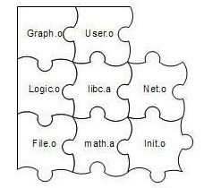

> @Date    : 2020-08-04 17:21:58
>
> @Author  : Lewis Tian (taseikyo@gmail.com)
>
> @Link    : github.com/taseikyo

# 2. 静态链接

平常我们很少关注编译和链接过程，因为通常的开发环境都是流行的集成开发环境（IDE），一般都将编译和链接一步完成， 通常将这个过程称为构建（Build）。即使使用命令行来编译，简单的一句 "gcc hello.c" 命令就包含了非常复杂的过程

IDE 和编译器提供的默认配置、编译和链接参数对于大部分的应用程 序开发而言已经足够使用了。但是在这样的开发过程中，我们往往会 被这些复杂的集成工具所提供的强大功能所迷惑，很多系统软件的运 行机制与机理被掩盖，其程序的很多莫名其妙的错误让我们无所适从 ，面对程序运行时种种性能瓶颈我们束手无策。我们看到的是这些问 题的现象，但是却很难看清本质，所有这些问题的本质就是软件运行 背后的机理及支撑软件运行的各种平台和工具，如果能够深入了解这 些机制，那么解决这些问题就能够游刃有余，收放自如了

## 2.1 被隐藏了的过程

```c
#include <stdio.h>
int main() {
    printf("Hello World\n");
    return 0;
}
```

在 Linux 下，当我们使用 GCC 来编译 Hello World 程序时，只须使用最 简单的命令（假设源代码文件名为 hello.c）：

```bash
$ gcc hello.c
$ ./a.out
Hello World
```

事实上，上述过程可以分解为 4 个步骤，分别是预处理 （Prepressing）、编译（Compilation）、汇编（Assembly）和链 接（Linking），如图 2-1 所示


图 2-1 GCC 编译过程分解

### 2.1.1 预编译

首先是源代码文件 hello.c 和相关的头文件，如 stdio.h 等被预编译器 cpp 预编译成一个 .i 文件。对于 C++ 程序来说，它的源代码文件的扩展名可能是 .cpp 或 .cxx，头文件的扩展名可能是 .hpp，而预编译后的文件扩展名是 .ii。第一步预编译的过程相当于如下命令（-E 表示只进行预编译）：

```bash
$ gcc –E hello.c –o hello.i
# or
$ cpp hello.c > hello.i
```

预编译过程主要处理那些源代码文件中的以 "#" 开始的预编译指令。比如 "#include"、"#define" 等，主要处理规则如下：

- 将所有的 "#define" 删除，并且展开所有的宏定义
- 处理所有条件预编译指令，比如 "#if"、"#ifdef"、"#elif"、"#else"、"#endif"
- 处理 "#include" 预编译指令，将被包含的文件插入到该预编译 指令的位置。注意，这个过程是递归进行的，也就是说被包含的文件 可能还包含其他文件
- 删除所有的注释 "//" 和 "/* */"
- 添加行号和文件名标识，比如 #2 "hello.c" 2，以便于编译时编译 器产生调试用的行号信息及用于编译时产生编译错误或警告时能够显示行号
- 保留所有的 #pragma 编译器指令，因为编译器须要使用它们

经过预编译后的 .i 文件不包含任何宏定义，因为所有的宏已经被展开，并且包含的文件也已经被插入到 .i 文件中。所以当我们无法判断宏定义是否正确或头文件包含是否正确时，可以查看预编译后的文件来确定问题

### 2.1.2 编译

编译过程就是把预处理完的文件进行一系列词法分析、语法分析、语义分析及优化后生产相应的汇编代码文件，这个过程往往是我们所说的整个程序构建的核心部分，也是最复杂的部分之一

`$ gcc –S hello.i –o hello.s`

现在版本的 GCC 把预编译和编译两个步骤合并成一个步骤，使用一个 叫做 cc1 的程序来完成这两个步骤。这个程序位于 "/usr/lib/gcc/i486-linux-gnu/4.1/"，我们也可以直接调用 cc1 来完 成它：

```bash
$ /usr/lib/gcc/i486-linux-gnu/4.1/cc1 hello.c
 main
Execution times (seconds)
 preprocessing  :0.01(100%)usr  0.01(33%)sys  0.0
0( 0%)wall 77 kB( 8%)ggc
 lexical analysis :0.00( 0%)usr 0.00( 0%)sys  0.0
2(50%)wall 0 kB(0%)ggc
 parser         :0.00( 0%)usr 0.00( 0%)sys  0.01(
25%)wall 125 kB(13%)ggc
 expand         :0.00( 0%)usr 0.01(33%)sys  0.00( 
0%)wall 6 kB(1%)ggc
 TOTAL            :0.01         0.03        0.04          
982 kB
```

或者使用如下命令：

`$ gcc –S hello.c –o hello.s`

对于 C 语言的代码来说，这个预编译和编译的程序是 cc1，对于 C++ 来说，有对应的程序叫做 cc1plus；Objective-C 是 cc1obj；fortran 是 f771；Java 是 jc1。所以 实际上 gcc 这个命令只是这些后台程序的包装，它会根据不同的参数 要求去调用预编译编译程序 cc1、汇编器 as、链接器 ld

### 2.1.3 汇编

汇编器是将汇编代码转变成机器可以执行的指令，每一个汇编语句几乎都对应一条机器指令。所以汇编器的汇编过程相对于编译器来讲比较简单，它没有复杂的语法，也没有语义，也不需要做指令优化，只是根据汇编指令和机器指令的对照表一一翻译就可以了，"汇编" 这个名字也来源于此

`$ as hello.s –o hello.o`

或者使用 gcc 命令从 C 源代码文件开始，经过预编译、编译和汇编直接输出目标文件（Object File）：

`$gcc –c hello.c –o hello.o`

### 2.1.4 链接

链接通常是一个让人比较费解的过程，为什么汇编器不直接输出可执行文件而是输出一个目标文件呢？链接过程到底包含了什么内容？为什么要链接？这恐怕是很多读者心中的疑惑。正是因为这些疑惑总是挥之不去，所以我们特意用这一章的篇幅来分析链接，具体地说分析静态链接的章节。下面让我们来看看怎么样调用 ld 才可以产生一个能 够正常运行的 HelloWorld 程序：

`$ ld -static /usr/lib/crt1.o /usr/lib/crti.o /usr/lib/gcc/i486-linux-gnu/4.1.3/crtbeginT.o -L/usr/l ib/gcc/i486-linux-gnu/4.1.3 -L/usr/lib -L/lib hello.o --start-group -lgcc -lgcc_eh -lc --end-group /usr/lib/gcc/i486-linux-gnu/4.1.3/crtend.o/usr/lib/crtn.o`

可以看到，我们需要将一大堆文件链接起来才可以得到 "a.out"， 即最终的可执行文件。看了这行复杂的命令，可能很多读者的疑惑更多了，crt1.o、crti.o、crtbeginT.o、crtend.o、crtn.o 这些文件是什么？它们做什么用的？-lgcc –lgcc_eh –lc 这些都是什么参数？为什么要使用它们？为什么要将它们和 hello.o 链接起来才可以得到可执行文件？等等

这些问题正是本书所需要介绍的内容，它们看似简单，其实涉及了编译、链接和库，甚至是操作系统的一些很底层的内容。我们将紧紧围绕着这些内容，进行必要的分析

## 2.2 编译器做了什么

从最直观的角度来讲，编译器就是将高级语言翻译成机器语言的一个工具。高级语言使得程序员们能够更加关注程序逻辑的本身，而尽量少考虑计算机本身的限制，如字长、内存大小、通信方式、存储方式等。高级编程语言的出现使得程序开发的效率大大提高，高级语言的可移植性 也使得它在多种计算机平台下能够游刃有余

编译过程一般可以分为 6 步 ：扫描、语法分析、语义分析、源代码优化、代码生成和目标代码优 化。整个过程如图 2-2 所示


图 2-2 编译过程


我们将结合图 2-2 来简单描述从源代码（Source Code）到最终目标代码（Final Target Code）的过程。比如我们有一行 C 语言的源代码如下：

```c
array[index] = (index + 4) * (2 + 6)
CompilerExpression.c
```

### 2.2.1 词法分析

首先源代码程序被输入到扫描器（Scanner），扫描器的任务很简单，它只是简单地进行词法分析，运用一种类似于有限状态机（Finite State Machine）的算法可以很轻松地将源代码的字符序列分割成一系列的记号（Token）。比如上面的那行程序，经过扫描以后，产生了 16 个记号，如表 2-1 所示

表 2-1

|  记号 |   类型   |
|:-----:|:--------:|
| array | 标识符   |
| [     | 左方括号 |
| index | 标识符   |
| ]     | 右方括号 |
| =     | 赋值     |
| (     | 左圆括号 |
| index | 标识符   |
| +     | 加号     |
| 4     | 数字     |
| )     | 右圆括号 |
| *     | 乘号     |
| (     | 左圆括号 |
| 2     | 数字     |
| +     | 加号     |
| 6     | 数字     |
| )     | 右圆括号 |

词法分析产生的记号一般可以分为如下几类：关键字、标识符、字面量（包含数字、字符串等）和特殊符号（如加号、等号）。在识别记号的同时，扫描器也完成了其他工作。比如将标识符存放到符号表，将数字、字符串常量存放到文字表等，以备后面的步骤使用

有一个叫做 lex 的程序可以实现词法扫描，它会按照用户之前描述好的词法规则将输入的字符串分割成一个个记号。因为这样一个程序的存在，编译器的开发者就无须为每个编译器开发一个独立的词法扫描器，而是根据需要改变词法规则就可以了

另外对于一些有预处理的语言，比如 C 语言，它的宏替换和文件包含等工作一般不归入编译器的范围而交给一个独立的预处理器

### 2.2.2 语法分析

接下来语法分析器（Grammar Parser）将对由扫描器产生的记号进行语法分析，从而产生语法树（Syntax Tree）。整个分析过程采用了上下文无关语法（Context-free Grammar）的分析手段。简单地讲，由语法分析器生成的语法树就是以表达式 （Expression）为节点的树。我们知道，C 语言的一个语句是一个表达式，而复杂的语句是很多表达式的组合。上面例子中的语句就是一个由赋值表达式、加法表达式、乘法表达式、数组表达式、括号表达式组成的复杂语句。它在经过语法分析器以后形成如图 2-3 所示的语法树


2-3 语法树

从图 2-3 中我们可以看到，整个语句被看作是一个赋值表达式；符号和数字是最小的表达式，它们不是由其他的表达式来组成的，所以它们通常作为整个语法树的叶节点。在语法分析的同时，很多运算符号的优先级和含义也被确定下来了。比如乘法表达式的优先级比加法高，而圆括号表达式的优先级比乘法高，等等。另外有些符号具有多重含义，比如星号 * 在 C 语言中可以表示乘法表达式，也可以表示对指针取内容的表达式，所以 语法分析阶段必须对这些内容进行区分。如果出现了表达式不合法，比如各种括号不匹配、表达式中缺少操作符等，编译器就会报告语法分析阶段的错误

正如前面词法分析有 lex 一样，语法分析也有一个现成的工具叫做 yacc（Yet Another Compiler Compiler）。它也像 lex 一样，可以根据用户给定的语法规则对输入的记号序列进行解析，从而构建出一棵语法树。对于不同的编程语言，编译器的开发者只须改变语法规则，而无须为每个编译器编写一个语法分析器，所以它又被称为"编译 器编译器（Compiler Compiler）"

### 2.2.3 语义分析

接下来进行的是语义分析，由语义分析器（Semantic Analyzer）来完成。语法分析仅仅是完成了对表达式的语法层面的分析，但是它并不了解这个语句是否真正有意义。比如 C 语言里面两个指针做乘法运算是没有意义的，但是这个语句在语法上是合法的；比如同样一个指针和一个浮点数做乘法运算是否合法等。编译器所能分析的语义是静态语义（Static Semantic），所谓静态语义是指在编译期可以确定的语义，与之对应的动态语义（Dynamic Semantic）就是只有在运行期才能确定的语义

静态语义通常包括声明和类型的匹配，类型的转换。比如当一个浮点型的表达式赋值给一个整型的表达式时，其中隐含了一个浮点型到整型转换的过程，语义分析过程中需要完成这个步骤。比如将一个浮点型赋值给一个指针的时候，语义分析程序会发现这个类型不匹配，编译器将会报错。动态语义一般指在运行期出现的语义相关的问题，比如将 0 作为除数是一个运行期语义错误

经过语义分析阶段以后，整个语法树的表达式都被标识了类型，如果有些类型需要做隐式转换，语义分析程序会在语法树中插入相应的转换节点。上面描述的语法树在经过语义分析阶段以后成为如图 2-4 所 示的形式


2-4 标识语义后的语法树

每个表达式（包括符号和数字）都被标识了类型。我们的例子中几乎所有的表达式都是整型的，所以无须做转换，整个分析过程很顺利。语义分析器还对符号表里的符号类型也做了更新

### 2.2.4 中间语言生成

现代的编译器有着很多层次的优化，往往在源代码级别会有一个优化过程。我们这里所描述的源码级优化器（Source Code Optimizer）在不同编译器中可能会有不同的定义或有一些其他的差异。源代码级优化器会在源代码级别进行优化，在上例中，细心的读者可能已经发现，（2 + 6）这个表达式可以被优化掉，因为它的值在编译期就可以被确定。类似的还有很多其他复杂的优化过程，我们在这里就不详细描述了。经过优化的语法树如图 2-5 所示


2-5 优化后的语法树

我们看到（2 + 6）这个表达式被优化成 8。其实直接在语法树上作优化比较困难，所以源代码优化器往往将整个语法树转换成中间代码 （Intermediate Code），它是语法树的顺序表示，其实它已经非常接近目标代码了。但是它一般跟目标机器和运行时环境是无关的，比 如它不包含数据的尺寸、变量地址和寄存器的名字等。中间代码有很多种类型，在不同的编译器中有着不同的形式，比较常见的有：三地址码（Three-address Code）和 P-代码（P-Code）。我们就拿最常见的三地址码来作为例子，最基本的三地址码是这样的：`x = y op z`

这个三地址码表示将变量 y 和 z 进行 op 操作以后，赋值给 x。这里 op 操作可以是算数运算，比如加减乘除等，也可以是其他任何可以应用到 y 和 z 的操作。三地址码也得名于此，因为一个三地址码语句里面有三个变量地址。我们上面的例子中的语法树可以被翻译成三地址码后是 这样的：

```c
t1 = 2 + 6
t2 = index + 4
t3 = t2 * t1
array[index] = t3
```

为了使所有的操作都符合三地址码形式，这里利用了几个临时变量：t1、t2 和 t3。在三地址码的基础上进行优化时，优化程序会将 2+6 的结果计算出来，得到 t1 = 8。然后将后面代码中的 t1 替换成数字8。还可以省去一个临时变量 t3，因为 t2 可以重复利用

经过优化以后的代码如下：

```c
t2 = index + 4
t2 = t2 * 8
array [index] = t2
```

中间代码使得编译器可以被分为前端和后端。编译器前端负责产生机器无关的中间代码，编译器后端将中间代码转换成目标机器代码。这样对于一些可以跨平台的编译器而言，它们可以针对不同的平台使用同一个前端和针对不同机器平台的数个后端

### 2.2.5 目标代码生成与优化

源代码级优化器产生中间代码标志着下面的过程都属于编辑器后端。编译器后端主要包括代码生成器（Code Generator）和目标代码优化器（Target Code Optimizer）。让我们先来看看代码生成器。代码生成器将中间代码转换成目标机器代码，这个过程十分依赖于目标机器，因为不同的机器有着不同的字长、寄存器、整数数据类型和浮点数数据类型等。对于上面例子中的中间代码，代码生成器可能会生成下面的代码序列（我们用 x86 的汇编语言来表示，并且假设 index 的类型为 int 型，array 的类型为 int 型数组）：

```asm
movl index, %ecx        ; value of index to ecx
addl $4, %ecx           ; ecx = ecx + 4
mull $8, %ecx             ; ecx = ecx * 8
movl index, %eax        ; value of index to eax
movl %ecx, array(,eax,4)  ; array[index] = ecx
```

最后目标代码优化器对上述的目标代码进行优化，比如选择合适的寻址方式、使用位移来代替乘法运算、删除多余的指令等。上面的例子中，乘法由一条相对复杂的基址比例变址寻址（Base Index Scale Addressing）的 lea 指令完成，随后由一条 mov 指令完成最后的赋值操作，这条 mov 指令的寻址方式与 lea 是一样的

```asm
movl  index, %edx
leal  32(,%edx,8), %eax
movl  %eax, array(,%edx,4
```

现代的编译器有着异常复杂的结构，这是因为现代高级编程语言本身非常地复杂，比如 C++ 语言的定义就极为复杂，至今没有一个编译器能够完整支持 C++ 语言标准所规定的所有语言特性。另外现代的计算机 CPU 相当地复杂，CPU 本身采用了诸如流水线、多发射、超标量等诸多复杂的特性，为了支持这些特性，编译器的机器指令优化过程也 变得十分复杂。使得编译过程更为复杂的是有些编译器支持多种硬件平台，即允许编译器编译出多种目标 CPU 的代码。比如著名的 GCC 编译器就几乎支持所有 CPU 平台，这也导致了编译器的指令生成过程更为复杂

经过这些扫描、语法分析、语义分析、源代码优化、代码生成和目标代码优化，编译器忙活了这么多个步骤以后，源代码终于被编译成了目标代码。但是这个目标代码中有一个问题是：index 和 array 的地址还没有确定。如果我们要把目标代码使用汇编器编译成真正能够在机器上执行的指令，那么 index 和 array 的地址应该从哪儿得到呢？如果 index 和 array 定义在跟上面的源代码同一个编译单元里面，那么编译器可以为 index 和 array 分配空间，确定它们的地址；那如果是定义在其他的程序模块呢？

这个看似简单的问题引出了我们一个很大的话题：目标代码中有变量定义在其他模块，该怎么办？事实上，定义其他模块的全局变量和函数在最终运行时的绝对地址都要在最终链接的时候才能确定。所以现代的编译器可以将一个源代码文件编译成一个未链接的目标文件，然后由链接器最终将这些目标文件链接起来形成可执行文件。让我们带着这个问题，走进链接的世界

## 2.3 链接器年龄比编译器长

以前，人们编写程序时，将所有源代码都写在同一个文件中，发展到后来一个程序源代码的文件长达数百万行，以至于这个地方的人类已经没有能力维护这个程序了

为了更好地理解计算机程序的编译和链接的过程，我们简单地回顾计算机程序开发的历史一定会非常有益。计算机的程序开发并非从一开始就有着这么复杂的自动化编译、链接过程。原始的链接概念远在高级程序语言发明之前就已经存在了，在最开始的时候，程序员（当时程序员的概念应该跟现在相差很大了）先把一个程序在纸上写好，当然当时没有很高级的语言，用的都是机器语言，甚至连汇编语言都没有。当程序须要被运行时，程序员人工将他写的程序写入到存储设备上，最原始的存储设备之一就是纸带，即在纸带上打相应的孔

这个过程我们可以通过图 2-6 来看到，假设有一种计算机，它的每条指令是 1 个字节，也就是 8 位。我们假设有一种跳转指令，它的高 4 位 是 0001，表示这是一条跳转指令，低位存放的是跳转目的地的绝对地址


2-6 纸带与机器指令

程序并不是一写好就永远不变化的，它可能会经常被修改。比如我们在第 1 条指令之后、第 5 条指令之前插入了一条或多条指令，那么第 5 条指令及后面的指令的位置将会相应地往后移动，原先第一条指令的低 4 位的数字将需要相应地调整。在这个过程中，程序员需要人工重新计算每个子程序或跳转的目标地址。当程序修改的时候，这些位置都要重新计算，十分繁琐又耗时，并且很容易出错。这种重新计算各个目标的地址过程被叫做**重定位**（Relocation）

如果我们有多条纸带的程序，这些程序之间可能会有类似的跨纸带之间的跳转，这种程序经常修改导致跳转目标地址变化在程序拥有多个模块的时候更为严重。人工绑定进行指令的修正以确保所有的跳转目标地址都正确，在程序规模越来越大以后变得越来越复杂和繁琐

先驱者发明了汇编语言，这相比机器语言来说是个很大的进步。汇编语言使用接近人类的各种符号和标记来帮助记忆，比如指令采用两个或三个字母的缩写，记住 "jmp" 比记住 0001XXXX 是跳转（jump）指令容易得多了；汇编语言还可以使用符号来标记位置，比如一个符号 "divide" 表示一个除法子程序的起始地址，比记住从某个位置开始的第几条指 令是除法子程序方便得多。最重要的是，这种符号的方法使得人们从 具体的指令地址中逐步解放出来。比如前面纸带程序中，我们把刚开始第 5 条指令开始的子程序命名为 "foo"，那么第一条指令的汇编就是：`jmp foo`

当然人们可以使用这种符号命名子程序或跳转目标以后，不管这个 "foo" 之前插入或减少了多少条指令导致 "foo" 目标地址发生了什么变化，汇编器在每次汇编程序的时候会重新计算 "foo" 这个符号 的地址，然后把所有引用到 "foo" 的指令修正到这个正确的地址。整个过程不需要人工参与，对于一个有成百上千个类似的符号的程序，程序员终于摆脱了这种低级的繁琐的调整地址的工作，用一句政治口号来说叫做"极大地解放了生产力"。**符号**（Symbol）这个概念随着汇编语言的普及迅速被使用，它用来表示一个地址，这个地址可能是一段子程序（后来发展成函数）的起始地址，也可以是一个变量的起始地址

有了汇编语言以后，生产力大大提高了，随之而来的是软件的规模也开始日渐庞大，这时程序的代码量也已经开始快速地膨胀，导致人们要开始考虑将不同功能的代码以一定的方式组织起来，使得更加容易阅读和理解，以便于日后修改和重复使用。自然而然，人们开始将代码按照功能或性质划分，分别形成不同的功能模块，不同的模块之间按照层次结构或其他结构来组织。这个在现代的软件源代码组织中很常见，比如在 C 语言中，最小的单位是变量和函数，若干个变量和函数组成一个模块，存放在一个 ".c" 的源代码文件里，然后这些源代码文件按照目录结构来组织。在比较高级的语言中，如 Java 中，每个类是一个基本的模块，若干个类模块组成一个包（Package），若干 个包组合成一个程序

现代的大型软件往往拥有成千上万个模块，这些模块之间相互依赖又相对独立。这种按照层次化及模块化存储和组织源代码有很多好处，比如代码更容易阅读、理解、重用，每个模块可以单独开发、编译、测试，改变部分代码不需要编译整个程序等

在一个程序被分割成多个模块以后，这些模块之间最后如何组合形成一个单一的程序是须解决的问题。模块之间如何组合的问题可以归结为模块之间如何通信的问题，最常见的属于静态语言的 C/C++ 模块之间通信有两种方式:

1. 模块间的函数调用
2. 模块间的变量访问

函数访问须知道目标函数的地址，变量访问也须知道目标变量的地址，所以这两种方式都可以归结为一种方式，那就是模块间符号的引用。模块间依靠符号来通信类似于拼图版，定义符号的模块多出一块区域，引用该符号的模块刚好少了那一块区域，两者一拼接刚好完美组合（见图2-7）。这个模块的拼接过程就是本书的一个主题：**链接**（Linking）



2-7 模块间拼合

这种基于符号的模块化的一个直接结果是链接过程在整个程序开发中变得十分重要和突出。我们在本书的后面将可以看到链接器如何将这些编译后的模块链接到一起，最终产生一个可以执行的程序

## 2.4 模块拼装——静态链接

程序设计的模块化是人们一直在追求的目标，因为当一个系统十分复杂的时候，我们不得不将一个复杂的系统逐步分割成小的系统以达到各个突破的目的。一个复杂的软件也如此，人们把每个源代码模块独立地编译，然后按照需要将它们 "组装" 起来，这个组装模块的过程就是**链接**（Linking）。链接的主要内容就是把各个模块之间相互引用的部分都处理好，使得各个模块之间能够正确地衔接。链接器所要做的工作其实跟前面所描述的 "程序员人工调整地址" 本质上没什么两样，只不过现代的高级语言的诸多特性和功能，使得编译器、链接器更为复杂，功能更为强大，但从原理上来讲，它的工作无非就是把一些指令对其他符号地址的引用加以修正。链接过程主要包括了**地址和空间分配**（Address and Storage Allocation）、**符号决议** （Symbol Resolution）和**重定位**（Relocation）等这些步骤

符号决议有时候也被叫做**符号绑定**（Symbol Binding）、**名称绑定** （Name Binding）、**名称决议**（Name Resolution），甚至还有叫做**地址绑定**（Address Binding）、**指令绑定**（Instruction Binding）的，大体上它们的意思都一样，但从细节角度来区分，它们之间还是存在一定区别的，比如 "决议" 更倾向于静态链接，而 "绑定" 更倾向于动态链接，即它们所使用的范围不一样。在静态链接，我们将统一称为符号决议。

最基本的静态链接过程如图 2-8 所示。每个模块的源代码文件（如 .c）文件经过编译器编译成目标文件（Object File，一般扩展名为 .o 或.obj），目标文件和库（Library）一起链接形成最终可执行文件。而最常见的库就是运行时库（Runtime Library），它是支持程序运行的基本函数的集合。库其实是一组目标文件的包，就是一些最常用的代码编译成目标文件后打包存放


2-8 链接过程

我们认为对于 Object 文件没有一个很合适的中文名称，把它叫做中间目标文件比较合适，简称为目标文件，很多时候我们也把目标文件称为模块

现代的编译和链接过程也并非想象中的那么复杂，它还是一个比较容易理解的概念。比如我们在程序模块 main.c 中使用另外一个模块 func.c 中的函数 foo()。我们在 main.c 模块中每一处调用 foo 的时候都 必须确切知道 foo 这个函数的地址，但是由于每个模块都是单独编译的，在编译器编译 main.c 的时候它并不知道 foo 函数的地址，所以它暂时把这些调用 foo 的指令的目标地址搁置，等待最后链接的时候由链接器去将这些指令的目标地址修正。如果没有链接器，须要我们手工把每个调用 foo 的指令进行修正，则填入正确的 foo 函数地址。当 func.c 模块被重新编译，foo 函数的地址有可能改变时，那么我们在 main.c 中所有使用到 foo 的地址的指令将要全部重新调整。这些繁琐的工作将成为程序员的噩梦。使用链接器，你可以直接引用其他模块的函数和全局变量而无须知道它们的地址，因为链接器在链接的时候，会根据你所引用的符号 foo，自动去相应的 func.c 模块查找 foo 的 地址，然后将 main.c 模块中所有引用到 foo 的指令重新修正，让它们的目标地址为真正的 foo 函数的地址。这就是静态链接的最基本的过程和作用

在链接过程中，对其他定义在目标文件中的函数调用的指令须要被重新调整，对使用其他定义在其他目标文件的变量来说，也存在同样的问题。让我们结合具体的 CPU 指令来了解这个过程。假设我们有个全局变量叫做 var，它在目标文件 A 里面。我们在目标文件 B 里面要访问这个全局变量，比如我们在目标文件 B 里面有这么一条指令： movl $0x2a, var 这条指令就是给这个 var 变量赋值 0x2a，相当于 C 语言里面的语句 var = 42。然后我们编译目标文件 B，得到这条指令机器码，如图 2-9 所示


2-9 传送指令

由于在编译目标文件 B 的时候，编译器并不知道变量 var 的目标地址， 所以编译器在没法确定地址的情况下，将这条 mov 指令的目标地址置为 0，等待链接器在将目标文件 A 和 B 链接起来的时候再将其修正。我们假设 A 和 B 链接后，变量 var 的地址确定下来为 0x1000，那么链接器将会把这个指令的目标地址部分修改成 0x10000。这个地址修正的过程也被叫做**重定位**（Relocation），每个要被修正的地方叫一个重定位入口（Relocation Entry）。重定位所做的就是给程序中每个这样的绝对地址引用的位置 "打补丁"，使它们指向正确的地址
