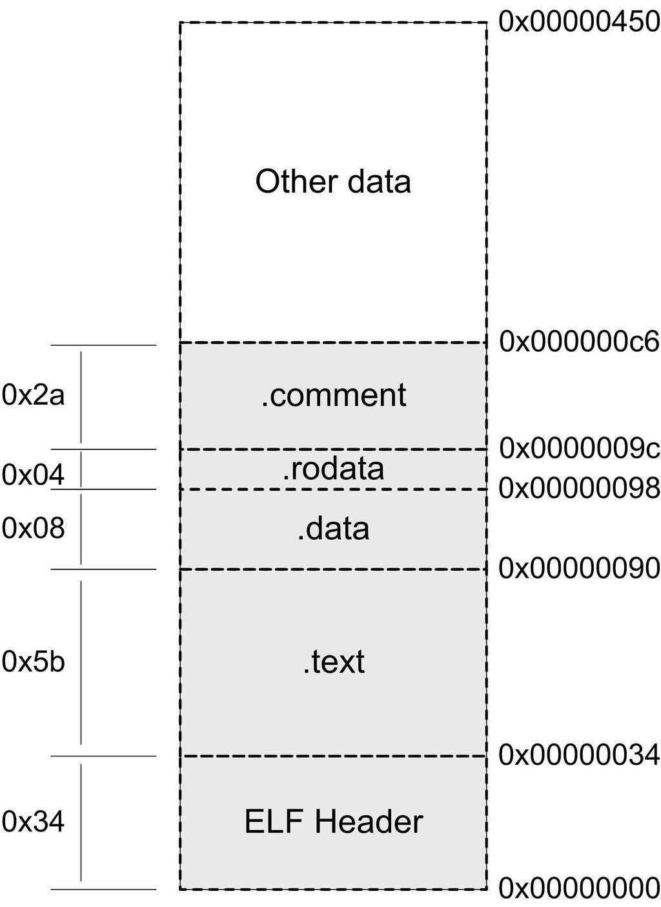

> @Date    : 2020-08-04 22:25:21
>
> @Author  : Lewis Tian (taseikyo@gmail.com)
>
> @Link    : github.com/taseikyo

# 3. 目标文件里有什么

编译器编译源代码后生成的文件叫做目标文件，那么目标文件里面到底存放的是什么呢？或者我们的源代码在经过编译以后是怎么存储的？

目标文件从结构上讲，它是已经编译后的可执行文件格式，只是还没有经过链接的过程，其中可能有些符号或有些地址还没有被调整。其实它本身就是按照可执行文件格式存储的，只是跟真正的可执行文件在结构上稍有不同

可执行文件格式涵盖了程序的编译、链接、装载和执行的各个方面。了解它的结构并深入剖析它对于认识系统、了解背后的机理大有好处

## 3.1 目标文件的格式

流行的可执行文件格式（Executable）主要是 Windows 下的 PE（Portable Executable）和 Linux 的 ELF（Executable Linkable Format），它们都是 COFF（Common file format）格式的变种。目标文件就是源代码编译后但未进行链接的那些中间文件（Windows 的 .obj 和 Linux 下的 .o），它跟可执行文件的内容与结构很相似，所以一般跟可执行文件格式一起采用一种格式存储。从广义上看，目标文件与可执行文件的格式其实几乎是一样的，所以*我们可以广义地将目标文件与可执行文件看成是一种类型的文件*，在 Windows 下，我们可以统称它们为 PE-COFF 文件格式。在 Linux 下， 我们可以将它们统称为 ELF 文件。其他不太常见的可执行文件格式还 有 Intel/Microsoft 的 OMF（Object Module Format）、Unix a.out 格式和 MS-DOS .COM 格式等

不光是可执行文件（Windows 的 .exe 和 Linux 下的 ELF 可执行文件）按照可执行文件格式存储。动态链接库（DLL，Dynamic Linking Library）（Windows 的 .dll 和 Linux 的 .so）及静态链接库（Static Linking Library）（Windows 的 .lib 和 Linux 的 .a）文件都按照可执行文件格式存储

静态链接库稍有不同，它是把很多目标文件捆 绑在一起形成一个文件，再加上一些索引，你可以简单地把它理解为一个包含有很多目标文件的文件包。ELF 文件标准里面把系统中采用 ELF 格式的文件归为如表 3-1 所列举的 4 类

表 3-1

|             ELF文件类型            |                                                                                                                说明                                                                                                                | 实例                                         |
|:----------------------------------|:----------------------------------------------------------------------------------------------------------------------------------------------------------------------------------------------------------------------------------|----------------------------------------------|
| 可重定位文件（Relocatable File）   | 这类文件包含了代码和数据，可以被用来链接成可执行文件或共享目标文件，静态链接库也可以归为这一类                                                                                                                                     | Linux 的 .o / Windows 的 .obj                |
| 可执行文件（Executable File）      | 这类文件包含了可以直接执行的程序，它的代表就是 ELF 可执行文件，它们一般都没有扩展名                                                                                                                                                  | 比如 /bin/bash 文件 windows 的 .exe             |
| 共享目标文件（Shared Object File） | 这种文件包含了代码和数据，可以在以下两种情况下使用：1. 链接器可以使用这种文件跟其他的可重定位文件和共享目标文件链接，产生新的目标文件。2. 动态链接器可以将几个这种共享目标文件与可执行文件结合，作为进程映像的一部分来运行 | Linux 的 .so，如 lib/glibc-2.5.so / Windows 的 DLL |
| 核心转储文件（Core Dump File）     | 当进程意外终止时，系统可以将该进程的地址空间的内容及终止时的一些其他信息转储到核心转储文件                                                                                                                                         | Linux下的core dump                           |

我们可以在 Linux 下使用 file 命令来查看相应的文件格式，上面几种文件在 file 命令下会显示出相应的类型：

```bash
$ file foobar.o
foobar.o: ELF 32-bit LSB relocatable, Intel 80386 , version 1 (SYSV), not stripped 

$ file /bin/bash
/bin/bash: ELF 32-bit LSB executable, Intel 80386 , version 1 (SYSV), for GNU/Linux 2.6.8, dynamica lly linked (uses shared libs), stripped 

$ file /lib/ld-2.6.1.so
/lib/libc-2.6.1.so: ELF 32-bit LSB shared object,  Intel 80386, version 1 (SYSV), for GNU/Linux 2.6. 8, stripped
```

#### 目标文件与可执行文件格式的小历史

目标文件与可执行文件格式跟操作系统和编译器密切相关，所以不同的系统平台下会有不同的格式，但这些格式又大同小异，目标文件格式与可执行文件格式的历史几乎是操作系统的发展史

COFF 是由 Unix System V Release 3 首先提出并且使用的格式规范 ，后来微软公司基于 COFF 格式，制定了 PE 格式标准，并将其用于当 时的 Windows NT 系统。System V Release 4 在 COFF 的基础上引 入了 ELF 格式，目前流行的 Linux 系统也以 ELF 作为基本可执行文件格式。这也就是为什么目前 PE 和 ELF 如此相似的主要原因，因为它们都 是源于同一种可执行文件格式 COFF

Unix 最早的可执行文件格式为 a.out 格式，它的设计非常地简单，以至于后来共享库这个概念出现的时候，a.out 格式就变得捉襟见肘了 。于是人们设计了 COFF 格式来解决这些问题，这个设计非常通用， 以至于 COFF 的继承者到目前还在被广泛地使用

COFF 的主要贡献是在目标文件里面引入了 "段" 的机制，不同的目标文件可以拥有不同数量及不同类型的 "段"。另外，它还定义了调试数据格式

## 3.2 目标文件是什么样的

目标文件中的内容至少有编译后的机器指令代码、数据，除了这些内容以外，目标文件中还包括了链接时所须要的一些信息，比如符号表、调试信息、字符串等。一般目标文件将这些信息按不同的属性，以 "节"（Section）的形式存储，有时候也叫 "段"（Segment），在一般情况下，它们都表示一个一定长度的区域，基本上不加以区别，唯一的区别是在 ELF 的链接视图和装载视图的时候，后面会专门提到

程序源代码编译后的机器指令经常被放在代码段（Code Section）里，代码段常见的名字有 ".code" 或 ".text"；全局变量和局部静 态变量数据经常放在数据段（Data Section），数据段的一般名字都叫 ".data"。让我们来看一个简单的程序被编译成目标文件后的结构，如图 3-1 所示


3-1 程序与目标文件

假设图 3-1 的可执行文件（目标文件）的格式是 ELF，从图中可以看到，ELF 文件的开头是一个 "文件头"，它描述了整个文件的文件属性，包括文件是否可执行、是静态链接还是动态链接及入口地址（如果是可执行文件）、目标硬件、目标操作系统等信息，文件头还包括一个段表（Section Table），段表其实是一个描述文件中各个段的数组。段表描述了文件中各个段在文件中的偏移位置及段的属性等，从段表里面可以得到每个段的所有信息。文件头后面就是各个段的内容，比如代码段保存的就是程序的指令，数据段保存的就是程序的静态变量等

一般 C 语言的编译后执行语句都编译成机器代码，保存在 .text 段；已初始化的全局变量和局部静态变量都保存在 .data 段；未初始化的全局变量和局部静态变量一般放在一个叫 .bss 的段里。我们知道未初始化的全局变量和局部静态变量默认值都为 0，本来它们也可以被放在 .data 段的，但是因为它们都是 0，所以为它们在 .data 段分配空间并且存放数据 0 是没有必要的。程序运行的时候它们的确是要占内存空间的，并且可执行文件必须记录所有未初始化的全局变量和局部静态变量的大小总和，记为 .bss 段。所以 .bss 段只是为未初始化的全局变量和局部静态变量预留位置而已，它并没有内容，所以它在文件中也不占据空间

#### BSS 历史

BSS（Block Started by Symbol）这个词最初是 UA-SAP 汇编器 （United Aircraft Symbolic Assembly Program）中的一个伪指令，用于为符号预留一块内存空间。该汇编器由美国联合航空公司于 20 世纪 50 年代中期为 IBM 704 大型机所开发。后来 BSS 这个词被作为关键字引入到了 IBM 709 和 7090/94 机型上的标准汇编器 FAP（Fortran Assembly Program），用于定义符号并 且为该符号预留给定数量的未初始化空间。[Unix FAQ section 1.3](http://www.faqs.org/faqs/unix-faq/faq/part1/section-3.html) 里面有 Unix 和 C 语言之父 Dennis Rithcie 对 BSS 这个词由来的解释

总体来说，程序源代码被编译以后主要分成两种段：程序指令和程序数据。代码段属于程序指令，而数据段和 .bss 段属于程序数据。很多人可能会有疑问：为什么要那么麻烦，把程序的指令和数据的存放分开？混杂地放在一个段里面不是更加简单？其实数据和指令分段的好处有很多。主要有如下几个方面


- 当程序被装载后，数据和指令分别被映射到两个虚存区域。由于数据区域对于进程来说是可读写的，而指令区域对于进程来说是只读的，所以这两个虚存区域的权限可以被分别设置成可读写和只读。这样可以防止程序的指令被有意或无意地改写
- 对于现代的 CPU 来说，它们有着极为强大的缓存（Cache）体系。由于缓存在现代的计算机中地位非常重要，所以程序必须尽量提高缓存的命中率。指令区和数据区的分离有利于提高程序的局部性。现代 CPU 的缓存一般都被设计成数据缓存和指令缓存分离，所以程序的指令和数据被分开存放对 CPU 的缓存命中率提高有好处
- 最重要的原因是当系统中运行着多个该程序的副本时，它们的指令都是一样的，所以内存中只须要保存一份该程序的指令部分。对于指令这种只读的区域来说是这样，对于其他的只读数据也一样，比如很多程序里面带有的图标、图片、文本等资源也是属于可以共享的。当然每个副本进程的数据区域是不一样的， 它们是进程私有的。不要小看这个共享指令的概念，它在现代的操作系统里面占据了极为重要的地位，特别是在有动态链接的系统中，可以节省大量的内存

## 3.3 挖掘 SimpleSection.o

本节后面的内容就是以 ELF 目标文件格式作为例子，彻底深入剖析目标文件， 争取不放过任何一个字节

真正了不起的程序员对自己的程序的每一个字节都了如指掌。 —— 佚名

我们就以前面提到过的 SimpleSection.c 编译出来的目标文件作为分析对象，这个程序是经过精心挑选的，具有一定的代表性而又不至于过于繁琐和复杂。在接下来所进行的一系列编译、链接和相关的实验过程中，我们将会用到第 1 章所提到过的工具套件，比如 GCC 编译器、 binutils 等工具。图 3-1 中的程序代码如清单 3-1 所示

清单 3-1

```c
/*
 * SimpleSection.c
 *
 * Linux:
 *   gcc -c SimpleSection.c
 *
 * Windows:
 *   cl SimpleSection.c /c /Za
 */
int printf(const char* format, ...);
int global_init_var = 84;
int global_uninit_var;
void func1(int i) {
	printf("%d\n",  i);
}
int main(void) {
	static int static_var = 85;
	static int static_var2;
	int a = 1;
	int b;
	func1(static_var + static_var2 + a + b);
	return a;
}
```

如不加说明，则以下所分析的都是 32 位 Intel x86 平台下的 ELF 文件格式

我们使用 GCC 来编译这个文件（参数 -c 表示只编译不链接）：

`$ gcc –c SimpleSection.c`

我们得到了一个 1 104 字节（该文件大小可能会因为编译器版本以及机器平台不同而变化）的 SimpleSection.o 目标文件。我们可以使用 binutils 的工具 objdump 来查看 object 内部的结构，它可以用来查看各种目标文件的结构和内容

```bash
$ objdump -h SimpleSection.o
SimpleSection.o:     file format elf32-i386
Sections:
Idx Name        Size      VMA         LMA       File off  Algn
  0 .text       0000005b  00000000  00000000  00000034  2**2
                CONTENTS, ALLOC, LOAD, RELOC, READONLY, CODE
  1 .data       00000008  00000000  00000000  00000090  2**2
                CONTENTS, ALLOC, LOAD, DATA
  2 .bss        00000004  00000000  00000000  00000098  2**2
                ALLOC
  3 .rodata     00000004  00000000  00000000  00000098  2**0
                CONTENTS, ALLOC, LOAD, READONLY, DATA
  4 .comment    0000002a  00000000  00000000  0000009c  2**0
                CONTENTS, READONLY
  5 .note.GNU-stack 00000000  00000000  00000000 000000c6  2**0
                CONTENTS, READONLY
```

Linux 还有一个很不错的工具叫 readelf，它是专门针对 ELF 文件格式的解析器，很多时候它对 ELF 文件的分析可以跟 objdump 相互对照

参数 "-h" 就是把 ELF 文件的各个段的基本信息打印出来。我们也可以使用 "objdump –x" 把更多的信息打印出来，但是 "-x" 输出的这些信息又多又复杂，对于不熟悉 ELF 和 objdump 的读者来说可能会很陌生。从上面的结果来看，SimpleSection.o 的段的数量比我们想象中的要多，除了最基本的代码段、数据段和 BSS 段以外，还有 3 个段分别是只读数据段（.rodata）、注释信息段（.comment）和堆栈提示段（.note.GNU-stack），这 3 个额外的段的意义我们暂且不去细究

先来看看几个重要的段的属性，其中最容易理解的是段的长度（Size） 和段所在的位置（File Offset），每个段的第 2 行中的 "CONTENTS"、"ALLOC" 等表示段的各种属性，"CONTENTS" 表示该段在文件中存在。我们可以看到 BSS 段没有 "CONTENTS"，表示它实际上在 ELF 文件中不存在内容。".note.GNU-stack" 段虽然有 "CONTENTS"，但它的长度为 0， 这是个很古怪的段，我们暂且忽略它，认为它在 ELF 文件中也不存在 。那么 ELF 文件中实际存在的也就是 ".text"、".data"、 ".rodata" 和 ".comment" 这 4 个段了，它们的长度和在文件中的偏移位置我们已经用粗体表示出来了。它们在 ELF 中的结构如图 3-3 所示



有一个专门的命令叫做 "size"，它可以用来查看 ELF 文件的代码段、数据段和 BSS 段的长度（dec 表示 3 个段长度的和的十进制，hex 表示长度和的十六进制）：

```bash
$ size SimpleSection.o
  text  data  bss  dec  hex  filename
    95     8    4  107   6b  SimpleSection.o
```

### 3.3.1 代码段

objdump 的 "-s" 参数可以将所有段的内容以十六进制的方式打印出来，"-d" 参数可以将所有包含指令的段反汇编。我们将 objdump 输出中关于代码段的内容提取出来，分析一下关于代码段的内容（省略号表示略去无关内容）

```bash
$ objdump -s -d SimpleSection.o
……
Contents of section .text:
 0000 5589e583 ec088b45 08894424 04c70424  U......E..D$...$
 0010 00000000 e8fcffff ffc9c38d 4c240483  ............L$..
 0020 e4f0ff71 fc5589e5 5183ec14 c745f401  ...q.U..Q....E..
 0030 0000008b 15040000 00a10000 00008d04  ................
 0040 020345f4 0345f889 0424e8fc ffffff8b  ..E..E...$......
 0050 45f483c4 14595d8d 61fcc3             E....Y].a..  
……
00000000 <func1>:
   0:   55                    push   %ebp
   1:   89 e5                 mov    %esp,%ebp
   3:   83 ec 08              sub    $0x8,%esp
   6:   8b 45 08              mov    0x8(%ebp),%eax
   9:   89 44 24 04           mov    %eax,0x4(%esp)
   d:   c7 04 24 00 00 00 00  movl   $0x0,(%esp)
  14:   e8 fc ff ff ff        call   15 <func1+0x15>
  19:   c9                    leave
  1a:   c3                    ret
0000001b <main>:
  1b:   8d 4c 24 04           lea  0x4(%esp),%ecx
  1f:   83 e4 f0              and    $0xfffffff0,%esp
  22:   ff 71 fc              pushl  -0x4(%ecx)
  25:   55                    push   %ebp
  26:   89 e5                 mov    %esp,%ebp
  28:   51                    push   %ecx
  29:   83 ec 14              sub    $0x14,%esp
  2c:   c7 45 f4 01 00 00 00  movl   $0x1,-0xc(%ebp)
  33:   8b 15 04 00 00 00     mov  0x4,%edx
  39:   a1 00 00 00 00        mov  0x0,%eax
  3e:   8d 04 02              lea    (%edx,%eax,1),%eax
  41:   03 45 f4              add    -0xc(%ebp),%eax
  44:   03 45 f8              add    -0x8(%ebp),%eax
  47:   89 04 24              mov    %eax,(%esp)
  4a:   e8 fc ff ff ff        call   4b <main+0x30>
  4f:   8b 45 f4              mov    -0xc(%ebp),%eax
  52:   83 c4 14              add    $0x14,%esp
  55:   59                    pop    %ecx
  56:   5d                    pop    %ebp
  57:   8d 61 fc              lea    -0x4(%ecx),%esp
  5a:   c3                    ret
```

"Contents of section .text" 就是 .text 的数据以十六进制方式打印出来的内容，总共 0x5b 字节，跟前面我们了解到的 ".text" 段长度相符合，最左面一列是偏移量，中间 4 列是十六进制内容，最右面一列是.text 段的 ASCII 码形式。对照下面的反汇编结果，可以很明显地看到，.text 段里所包含的正是 SimpleSection.c 里两个函数 func1() 和 main() 的指令。.text 段的第一个字节 "0x55" 就是 "func1()" 函数的第一条 "push % ebp" 指令，而最后一个字节 0xc3 正是 main() 函数的最后一条指令 "ret"

### 3.3.2 数据段和只读数据段

.data 段保存的是那些已经初始化了的全局静态变量和局部静态变量。前面的 SimpleSection.c 代码里面一共有两个这样的变量，分别是 global_init_varabal 与 static_var。这两个变量每个 4 个字节，一共刚好 8 个字节，所以 ".data" 这个段的大小为 8 个字节

SimpleSection.c 里面我们在调用 "printf" 的时候，用到了一个字符串常量 "% d\n"，它是一种只读数据，所以它被放到了 ".rodata" 段，我们可以从输出结果看到 ".rodata" 这个段的 4 个字节刚好是这个字符串常量的 ASCII 字节序，最后以 \0 结尾

".rodata" 段存放的是只读数据，一般是程序里面的只读变量（如 const 修饰的变量）和字符串常量。单独设立 ".rodata" 段有很多好处，不光是在语义上支持了 C++ 的 const 关键字，而且操作系统在加载的时候可以将 ".rodata" 段的属性映射成只读，这样对于这个段的任何修改操作都会作为非法操作处理，保证了程序的安全性。另外在某些嵌入式平台下，有些存储区域是采用只读存储器的，如 ROM，这样将 ".rodata" 段放在该存储区域中就可以保证程序访问存储器的正确性

有时候编译器会把字符串常量放到 ".data" 段， 而不会单独放在 ".rodata" 段。有兴趣的读者可以试着把 SimpleSection.c 的文件名改成 SimpleSection.cpp，然后用各种 MSVC 编译器编译一下看看字符串常量的存放情况

```bash
$ objdump -x -s -d SimpleSection.o
……
Sections:
  Idx Name          Size      VMA       LMA       File off  Algn
       1 .data      00000008  00000000  00000000  00000090  2**2
                    CONTENTS, ALLOC,    LOAD,     DATA
       3 .rodata    00000004  00000000  00000000  00000098  2**0
                  CONTENTS, ALLOC,    LOAD,     READONLY, DATA
……
Contents of section .data:
 0000 54000000 55000000                    T...U... 
Contents of section .rodata:
 0000 25640a00                              %d..            
……
```

我们看到 ".data" 段里的前 4 个字节，从低到高分别为 0x54、0x00 、0x00、0x00。这个值刚好是 global_init_varabal，即十进 制的 84。global_init_varabal 是个 4 字节长度的 int 类型，为什么存放的次序为 0x54、0x00、0x00、0x00 而不是 0x00、0x00、0x00、0x54？所谓的大端（Big-endian）和小端（Little-endian）的问题。最后 4 个字节刚好是 static_init_var 的值，即 85

### 3.3.3 BSS 段

.bss 段存放的是未初始化的全局变量和局部静态变量，如上述代码中 global_uninit_var 和 static_var2 就是被存放在 .bss 段，其实更准确的说法是 .bss 段为它们预留了空间。但是我们可以看到该段的大小只有 4 个字节，这与 global_uninit_var 和 static_var2 的大小的 8 个字节不符

其实我们可以通过符号表（Symbol Table）看到，只有 static_var2 被存放在了 .bss 段，而 global_uninit_var 却没有被存放在任何段，只是一个未定义的 "COMMON 符号"。这其实是跟不同的语言与不同的编译器实现有关，有些编译器会将全局的未初始化变量存放在目标文件 .bss 段，有 些则不存放，只是预留一个未定义的全局变量符号，等到最终链接成可执行文件的时候再在.bss 段分配空间。我们将在 "弱符号与强符号" 和 "COMMON 块" 这两个章节深入分析这个问题。原则上讲，我们可以简单地把它当作全局未初始化变量存放在 .bss 段。编译单元内部可见的静态变量（比如给 global_uninit_var 加上 static 修饰）的确是存放在 .bss 段的，这一点很容易理解

```bash
$ objdump -x -s -d SimpleSection.o
……
Sections:
   Idx Name         Size      VMA       LMA       File off  Algn
        2 .bss      00000004  00000000  00000000  00000098  2**2
                    ALLOC
……
```

#### Quiz 变量存放位置

现在让我们来做一个小的测试，请看以下代码：

```c
static int x1 = 0;
static int x2 = 1;
```

x1 和 x2 会被放在什么段中呢？ x1 会被放在 .bss 中，x2 会被放在 .data 中。为什么一个在 .bss 段，一个 在.data 段？ 因为 x1 为 0，可以认为是未初始化的，因为未初始化的都是 0，所以被优化掉了可以放在 .bss，这样可以节省磁盘空间，因为 .bss 不占磁盘空间。另外一个变量 x2 初始化值为 1，是初始化的，所以放在 .data 段中


### 3.3.4 其他段

除了.text、.data、.bss 这 3 个最常用的段之外，ELF 文件也有可能包含 其他的段，用来保存与程序相关的其他信息。表 3-2 中列举了 ELF 的一些常见的段

表 3-2


这些段的名字都是由 "." 作为前缀，表示这些表的名字是系统保留的，应用程序也可以使用一些非系统保留的名字作为段名。比如我们可以在 ELF 文件中插入一个 "music" 的段，里面存放了一首 MP3 音乐 ，当 ELF 文件运行起来以后可以读取这个段播放这首 MP3。但是应用程序自定义的段名不能使用 "." 作为前缀，否则容易跟系统保留段名 冲突。一个 ELF 文件也可以拥有几个相同段名的段，比如一个 ELF 文件中可能有两个或两个以上叫做 ".text" 的段。还有一些保留的段名是因为 ELF 文件历史遗留问题造成的，以前用过的一些名字如 .sdata 、.tdesc、.sbss、.lit4、.lit8、.reginfo、.gptab、.liblist、.conflict。可 以不用理会这些段，它们已经被遗弃了

#### Q&A

Q：如果我们要将一个二进制文件，比如图片、MP3 音乐、词典一类 的东西作为目标文件中的一个段，该怎么做？

A：可以使用 objcopy 工具，比如我们有一个图片文件 "image.jpg"，大小为 0x82100 字节：

```bash
$ objcopy -I binary -O elf32-i386 -B i386 image.jpg image.o 
$ objdump -ht image.o
image.o:     file format elf32-i386
Sections:
Idx Name          Size      VMA       LMA       File off  Algn
  0 .data         00081200  00000000  00000000  00000034  2**0
                  CONTENTS, ALLOC, LOAD, DATA
SYMBOL TABLE:
00000000 l    d  .data  00000000 .data
00000000 g       .data  00000000 _binary_image_jpg_start
00081200 g       .data  00000000 _binary_image_jpg_end
00081200 g       *ABS*  00000000 _binary_image_jpg_size
```

符号 "_binary_image_jpg_start"、"_binary_image_jpg_end" 和 "_ binary_image_jpg_size" 分别表示该图片文件在内存中的起始地址、结束地址和大小，我们可以在程序里面直接声明并使用它们

#### 自定义段

正常情况下，GCC 编译出来的目标文件中，代码会被放到 ".text" 段，全局变量和静态变量会被放到 ".data" 和 ".bss" 段，正如我们前面所分析的。但是有时候你可能希望变量或某些部分代码能够放到你所指定的段中去，以实现某些特定的功能。比如为了满足某些硬件的内存和 I/O 的地址布局，或者是像 Linux 操作系统内核中用来完成一些初始化和用户空间复制时出现页错误异常等。GCC 提供了一个扩展机制，使得程序员可以指定变量所处的段：

```c
__attribute__((section("FOO"))) int global = 42;
__attribute__((section("BAR"))) void foo() {
}
```

我们在全局变量或函数之前加上 "__attribute__((section("name")))" 属性就可以把相应的变量或函数放到以 "name" 作为段名的段中

## 3.4 ELF文件结构描述

我们已经通过 SimpleSection.o 的结构大致了解了 ELF 文件的轮廓，接着就来看看 ELF 文件的结构格式。图 3-4 描述的是 ELF 目标文件的总体结构，我们省去了 ELF 一些繁琐的结构，把最重要的结构提取出来，形成了如图 3-4 所示的 ELF 文件基本结构图，随着我们讨论的展开，ELF 文件结构会在这个基本结构之上慢慢变得复杂起来

3-4 ELF 结构

|          ELF Header          |
|:----------------------------:|
| .text                        |
| .data                        |
| .bss                         |
| other sections               |
| Section header table         |
| String Tables、Symbol Tables |

ELF 目标文件格式的最前部是 ELF 文件头（ELF Header），它包含了描述整个文件的基本属性，比如 ELF 文件版本、目标机器型号、程序入口地址等。紧接着是 ELF 文件各个段。其中 ELF 文件中与段有关的重要结构就是段表（Section Header Table），该表描述了 ELF 文件包含的所有段的信息，比如每个段的段名、段的长度、在文件中的偏移、读写权限及段的其他属性。接着将详细分析 ELF 文件头、段表等 ELF 关键的结构。另外还会介绍一些 ELF 中辅助的结构，比如字符串表、符号表等

### 3.4.1 文件头

我们可以用 readelf 命令来详细查看 ELF 文件，代码如清单 3-2 所示

清单 3-2 查看 ELF 文件头

```bash
$ readelf –h SimpleSection.o
ELF Header:
  Magic:   7f 45 4c 46 01 01 01 00 00 00 00 00 0000 00 00
  Class:                              ELF32
  Data:                             2's complement, little endian
  Version:                          1 (current)
  OS/ABI:                             UNIX - System V
  ABI Version:                    0
  Type:                               REL (Relocatable file)
  Machine:                            Intel 80386
  Version:                        0x1
  Entry point address:            0x0
  Start of program headers:       0 (bytes into file)
  Start of section headers:       280 (bytes intofile)
  Flags:                          0x0
  Size of this header:          52 (bytes)
  Size of program headers:        0 (bytes)
  Number of program headers:      0
  Size of section headers:        40 (bytes)
  Number of section headers:      11
  Section header string table index:  8
```

ELF 的文件头中定义了 ELF 魔数、文件机器字节长度、数据存储方式、版本、运行平台、ABI 版本、ELF 重定位类型、硬件平台、硬件平台版本、入口地址、程序头入口和长度、段表的位置和长度及段的数量等。这些数值中有关描述 ELF 目标平台的部分，与我们常见的 32 位 Intel 的硬件平台基本上一样

ELF 文件头结构及相关常数被定义在 "/usr/include/elf.h" 里，因为 ELF 文件在各种平台下都通用，ELF 文件有 32 位版本和 64 位版本。它的文件头结构也有这两种版本，分别叫做 "Elf32_Ehdr" 和 "Elf64_Ehdr"。32 位版本与 64 位版本的 ELF 文件的文件头内容是一样的，只不过有些成员的大小不一样。为了对每个成员的大小做出明确的规定以便于在不同的编译环境下都拥有相同的字段长度，"elf.h" 使用 typedef 定义了一套自己的变量体系

表 3-3

|自定义类型  |描述           |原始类型|长度（字节）|
|-----------|---------------|-------|-----------|
|Elf32_Addr |32位程序地址    |uint32_t|4|
|Elf32_Half |32位无符号短整形|uint16_t|2|
|Elf32_Off  |32位偏移地址    |uint32_t|4|
|Elf32_Sword|32位有符号整形  |uint32_t|4|
|Elf32_Word |32位无符号整形  |int32_t |4|
|Elf64_Addr |64位程序地址    |uint64_t|8|
|Elf64_Haf  |64位无符号短整形|uint16_t|2|
|Elf64_Off  |64位偏移地址    |uint64_t|8|
|Elf64_Sword|64位有符号整形  |uint32_t|4|
|Elf64_Word |64位无符号整形  |int32_t |4|

我们这里以 32 位版本的文件头结构 "Elf32_Ehdr" 作为例子来描述，它的定义如下：

```c
typedef struct {
	unsigned char e_ident[16];
	Elf32_Half e_type;
	Elf32_Half e_machine;
	Elf32_Word e_version;
	Elf32_Addr e_entry;
	Elf32_Off  e_phoff;
	Elf32_Off  e_shoff;
	Elf32_Word e_flags;
	Elf32_Half e_ehsize;
	Elf32_Half e_phentsize;
	Elf32_Half e_phnum;
	Elf32_Half e_shentsize;
	Elf32_Half e_shnum;
	Elf32_Half e_shstrndx;
} Elf32_Ehdr;
```

让我们拿 ELF 文件头结构跟前面 readelf 输出的 ELF 文件头信息相比照，可以看到输出的信息与 ELF 文件头中的结构很多都一一对应。有点例外的是 "Elf32_Ehdr" 中的 e_ident 这个成员对应了 readelf 输出结果中的 "Class"、"Data"、"Version"、"OS/ABI" 和 "ABI Version" 这 5 个参数。剩下的参数与 "Elf32_Ehdr" 中的成员都一一 对应。表 3-4 是 ELF 文件头中各个成员的含义与 readelf 输出结果的对照表


3-4 ELF文件头结构成员含义


3-5 ELF魔数

最开始的 4 个字节是所有 ELF 文件都必须相同的标识码，分别为 0x7F 、0x45、0x4c、0x46，第一个字节对应 ASCII 字符里面的 DEL 控制符 ，后面 3 个字节刚好是 ELF 这 3 个字母的 ASCII 码。这 4 个字节又被称为 ELF 文件的魔数，几乎所有的可执行文件格式的最开始的几个字节都 是魔数。比如 a.out 格式最开始两个字节为 0x01、0x07；PE/COFF 文件最开始两个个字节为 0x4d、0x5a，即 ASCII 字符 MZ。这种魔数 用来确认文件的类型，操作系统在加载可执行文件的时候会确认魔数 是否正确，如果不正确会拒绝加载

接下来的一个字节是用来标识 ELF 的文件类的。第 7 个字节规定 ELF 文件的主版本号 ，一般是 1，因为 ELF 标准自 1.2 版以后就再也没有更新了。后面的 9 个 字节 ELF 标准没有定义，一般填 0，有些平台会使用这 9 个字节作为扩展标志

#### 各种魔数的由来

a.out 格式的魔数为 0x01、0x07，为什么会规定这个魔数呢？

UNIX 早年是在 PDP 小型机上诞生的，当时的系统在加载一个可执行文件后直接从文件的第一个字节开始执行，人们一般在文件的最开始放置一条跳转（jump）指令，这条指令负责跳过接下来的 7 个机器字的文件头到可执行文件的真正入口。而 0x01 0x07 这两个字节刚好是当时 PDP-11 的机器的跳转 7 个机器字的指令。为了跟以前的系统保持兼容性，这条跳转指令被当作魔数一直被保留到了几十年后的今天

#### ELF 文件标准历史

20 世纪 90 年代，一些厂商联合成立了一个委员会，起草并发布了一个 ELF 文件格式标准。1993 年，委员会发布了 ELF 文件标准。当时参与该委员会的有来自于编译器的厂商，如 Watcom 和 Borland；来自 CPU 的厂商如 IBM 和 Intel；来自操作系统的厂商如 IBM 和 Microsoft。1995 年，委员会发布了 ELF 1.2 标准，自此委员会完成了自己的使命，不久就解散了。所以 ELF 文件格式标准的最新版本为 1.2

#### 文件类型

e_type 成员表示 ELF 文件类型，即前面提到过的 3 种 ELF 文件类型，每个文件类型对应一个常量。系统通过这个常量来判断 ELF 的真正文件类型，而不是通过文件的扩展名。相关常量以 "ET_" 开头，如表 3-5 所示

表 3-5

|常量    | 值 | 含义                      |
|--------|---|---------------------------|
|ET_REL  | 1 | 可重定位文件，一般为 .o 文件|
|ET_EXEC | 2 | 可执行文件                 |
|ET_DYN  | 3 | 共享目标文件，一般为 .so 文件|

#### 机器类型

ELF 文件格式被设计成可以在多个平台下使用。这并不表示同一个 ELF 文件可以在不同的平台下使用（就像 java 的字节码文件那样），而是表示不同平台下的 ELF 文件都遵循同一套 ELF 标准

e_machine 成员就表示该 ELF 文件的平台属性，比如 3 表示该 ELF 文 件只能在 Intel x86 机器下使用，这也是我们最常见的情况。相关的常 量以 "EM_" 开头，如表 3-6 所示

表 3-6

|常量     |值|含义          |
|---------|-|--------------|
|EM_M32   |1|AT&T WE 32100 |
|EM_SPARC |2|SPARC         |
|EM_386   |3|Intel X86     |
|EM_68K   |4|Motorola 68000|
|EM_88K   |5|Motorola 88000|
|EM_860   |6|Intel 80860   |

### 3.4.2 段表

ELF 文件中有很多段，这个段表（Section Header Table）就是保存这些段的基本属性的结构。段表是 ELF 中除了文件头以外最重要的结构，它描述了 ELF 的各个段的信息，比如每个段的段名、段的长度、在文件中的偏移、读写权限及段的其他属性。ELF 文件的段结构就是由段表决定的，编译器、链接器和装载器都是依靠段表来定位和访问各个段的属性的。段表在 ELF 文件中的位置由 ELF 文件头的 "e_shoff" 成员决定，比如 SimpleSection.o 中，段表位于偏移 0x118

前文中我们使用了 "objudmp -h" 来查看 ELF 文件中包含的段，结果是 SimpleSection 里面看到了总共有 6 个段，分别是 ".code"、 ".data"、".bss"、".rodata"、".comment" 和 ".note.GNU-stack"。实际上的情况却有所不同，"objdump -h" 命令只是把 ELF 文件中关键的段显示了出来，而省略了其他的辅助性的段，比如：符号表、字符串表、段名字符串表、重定位表等。我们可以使用 readelf 工具来查看 ELF 文件的段，它显示出来的结果才是真正的段表结构：

```bash
$ readelf -S SimpleSection.o
There are 11 section headers, starting at offset 0x118:
Section Headers:
 [Nr] Name          Type      Addr     Off    Size   ES Flg Lk Inf Al
 [ 0]               NULL      00000000 000000 000000 00 0   0  0
 [ 1] .text         PROGBITS  00000000 000034 00005b 00 AX  0  0   4
 [ 2] .rel.text     REL       00000000 000428 000028 08     9  1   4
 [ 3] .data         PROGBITS  00000000 000090 000008 00 WA  0  0   4
 [ 4] .bss          NOBITS    00000000 000098 000004 00 WA  0  0   4
 [ 5] .rodata       PROGBITS  00000000 000098 000004 00 A   0  0   1
 [ 6] .comment        PROGBITS  00000000 00009c 00002a 00 0   0  1
 [ 7] .note.GNU-stack PROGBITS  00000000 0000c6 000000 00 0   0  1
 [ 8] .shstrtab   STRTAB    00000000 0000c6 000051 00 0   0  1
 [ 9] .symtab       SYMTAB    00000000 0002d0 0000f0 10     10 10   4
 [10] .strtab       STRTAB    00000000 0003c0 000066 00 0   0  1
Key to Flags:
  W (write), A (alloc), X (execute), M (merge), S (strings)
  I (info), L (link order), G (group), x (unknown)
  O (extra OS processing required) o (OS specific), p (processor specific)
```

段表的结构比较简单，它是一个以 "Elf32_Shdr" 结构体为元素的数组。数组元素的个数等于段的个数，每个 "Elf32_Shdr" 结构体对应一个段。"Elf32_Shdr" 又被称为段描述符（Section Descriptor）。对于 SimpleSection.o 来说，段表就是有 11 个元素的数组。ELF 段表的这个数组的第一个元 素是无效的段描述符，它的类型为 "NULL"，除此之外每个段描述符都对应一个段。也就是说 SimpleSection.o 共有 10 个有效的段

#### 数组的存放方式

ELF 文件里面很多地方采用了这种与段表类似的数组方式保存。一般定义一个固定长度的结构，然后依次存放。这样我们就可以使用下标来引用某个结构

Elf32_Shdr 被定义在 "/usr/include/elf.h"

清单 3-3 Elf32_Shdr 段描述符结构

```c
typedef struct {
  Elf32_Word    sh_name;
  Elf32_Word    sh_type;
  Elf32_Word    sh_flags;
  Elf32_Addr    sh_addr;
  Elf32_Off     sh_offset;
  Elf32_Word    sh_size;
  Elf32_Word    sh_link;
  Elf32_Word    sh_info;
  Elf32_Word    sh_addralign;
  Elf32_Word    sh_entsize;
} Elf32_Shdr;
```

Elf32_Shdr 的各个成员的含义如表 3-7 所示

表 3-7


注 1：事实上段的名字对于编译器、链接器来说是有意义的，但是对于操作系统来说并没有实质的意义，对于操作系统来说，一个段该如何处理取决于它的属性和权限，即由段的类型和段的标志位这两个成员决定

注 2：关于这些字段，涉及一些映像文件的加载的概念，我们将在本书的第 2 部分详细介绍其相关内容，读者也可以先阅读第 2 部分的最前面一章 "可执行文件的装载于进程"，了解一下加载的概念，然后再来阅读关于段的虚拟大小和虚拟地址的内容。当然，如果读者对映像文件加载过程比较熟悉，应该很容易理解这些内容

让我们对照 Elf32_Shdr 和 "readelf -S" 的输出结果，可以很明显看到，结构体的每一个成员对应于输出结果中从第二列 "Name" 开始的每一列。于是 SimpleSection 的段表的位置如图 3-6 所示

至此，我们才彻彻底底把 SimpleSection 的所有段的位置和长度给分析清楚了。在图 3-6 中，SectionTable 长度为 0x1b8，也就是 440 个字节，它包含了 11 个段描述符，每个段描述符为 40 个字节，这个长度刚好等于 sizeof (Elf32_Shdr)，符合段描述符的结构体长度；整个文件最后一个段 ".rel.text" 结束后，长度为 0x450，即 1104 字节 ，即刚好是 SimpleSection.o 的文件长度。中间 Section Table 和 ".rel.text" 都因为对齐的原因，与前面的段之间分别有一个字节和两个字节的间隔


图 3-6

段的类型（sh_type） 正如前面所说的，段的名字只是在链接和编译过程中有意义，但它不能真正地表示段的类型。我们也可以将一个数据段命名为 ".text"，对于编译器和链接器来说，主要决定段的属性的是段的类型（sh_type）和段的标志位（sh_flags）

段的类型相关常量以 SHT_开头，列举如表 3-8 所示

表 3-8

|常量         |值|含义                            |
|------------|-|---------------------------------|
|SHT_NULL    |0|无效段                            |
|SHT_PROGBITS|1|程序段。代码段、数据段都是这种类型的 |
|SHT_SYMTAB  |2|表示该段的内容为符号表             |
|SHT_STRTAB  |3|表示该段的内容为字符串             |
|SHT_RELA    |4|重定位表。该段包含了重定位信息，具体参考"静态地址决议和重定位"这一节|
|SHT_HASH    |5|符号表的哈希表。见"符号表"这一节    |
|SHT_DYNAMIC |6|动态链接信息具体见"动态链接"一章    |
|SHT_NOTE    |7|提示性信息                        |
|SHT_NOBITS  |8|表示该段在文件中没内容，比如 .bss 段|
|SHT_REL     |9|该段包含了重定位信息，具体参考"静态地址决议和重定位"这一节|
|SHT_SHLIB   |10|保留|
|SHT_DNYSYM  |11|动态链接的符号表。具体见"动态链接"一章|

段的标志位（sh_flag）段的标志位表示该段在进程虚拟地址空间中的属性，比如是否可写，是否可执行等。相关常量以 SHF_开头，如表 3-9 所示

表 3-9

|常量|值|含义|
|---|--|----|
|SHF_WRITE |1|表示该段在进程空间中可写|
|SHF_ALLOC |2|表示该段在进程空间中须要分配空间。有些包含指示或控制信息的段不须要在进程空间中被分配空间，它们一般不会有这个标志。像代码段、数据段和 .bss 段都会有这个标志位|
|SHF_EXECINSTR|4|表示该段在进程空间中可以被执行，一般指代码段|

对于系统保留段，表 3-10 列举了它们的属性

表 3-10


段的链接信息（sh_link、sh_info） 如果段的类型是与链接相关的（不论是动态链接或静态链接），比如重定位表、符号表等， 那么 sh_link 和 sh_info 这两个成员所包含的意义如表 3-11 所示 。对于其他类型的段，这两个成员没有意义

表 3-11


### 3.4.3 重定位表

SimpleSection.o 中有一个叫做 ".rel.text" 的段，它的类型（sh_type）为 "SHT_REL"，也就是说它是一个重定位表（Relocation Table）。正如我们最开始所说的，链接器在处理目标文件时，须要对目标文件中某些部位进行重定位，即代码段和数据段中那些对绝对地址的引用的位置。这些重定位的信息都记录在 ELF 文件的重定位表里面，对于每个须要重定位的代码段或数据段，都会有一个相应的重定位表。比如 SimpleSection.o 中的 ".rel.text" 就是针对 ".text" 段的重定位表，因为 ".text" 段中至少有一个绝对地址的引用，那就是对 "printf" 函数的调用；而 ".data" 段则没有对绝对地址的引用，它只包含了几个常量，所以 SimpleSection.o 中没有针对 ".data" 段的重定位表 ".rel.data"

一个重定位表同时也是 ELF 的一个段，那么这个段的类型（sh_type）就是 "SHT_REL" 类型的，它的 "sh_link" 表示符号表的下标，它的 "sh_info" 表示它作用于哪个段。比如 ".rel.text" 作用于 ".text" 段，而 ".text" 段的下标为 "1"，那么 ".rel.text" 的 "sh_info" 为 "1"

### 3.4.4 字符串表

ELF 文件中用到了很多字符串，比如段名、变量名等。因为字符串的长度往往是不定的，所以用固定的结构来表示它比较困难。一种很常见的做法是把字符串集中起来存放到一个表，然后使用字符串在表中的偏移来引用字符串。如表 3-12


那么偏移与它们对应的字符串如表 3-13 所示

|偏移|字符串|
|----|-----|
|0|空字符串|
|1|helloworld|
|6|world|
|12|Myvariable|

因此在 ELF 文件中引用字符串只须给出一个数字下标即可，不用考虑字符串长度的问题。一般字符串表在 ELF 文件中也以段的形式保存，常见的段名为 ".strtab" 或 ".shstrtab"。这两个字符串表分别为字符串表（String Table）和段表字符串表（Section Header String Table）。顾名思义，字符串表用来保存普通的字符串，比如符号的名字；段表字符串表用来保存段表中用到的字符串， 最常见的就是段名（sh_name）

再回头看这个 ELF 文件头中的 "e_shstrndx" 的含义，前面提到过，"e_shstrndx" 是 Elf32_Ehdr 的最后一个成员，它是 "Section header string table index" 的缩写。我们知道段表字符串表本身也是 ELF 文件中的一个普通的段，知道它的名字往往叫做 ".shstrtab"。那么这个 "e_shstrndx" 就表示 ".shstrtab" 在段表中的下标，即段表字符串表在段表中的下标。前面的 SimpleSection.o 中，"e_shstrndx" 的值为 8，我们再对照 "readelf -S" 的输出结果，可以看到 ".shstrtab" 这个段刚好位于段表中的下标为 8 的位置上。由此，我们可以得出结论，只有分析 ELF 文件头，就可以得到段表和段表字符串表的位置，从而解析整 个 ELF 文件

## 3.5 链接的接口——符号

链接过程的本质就是要把多个不同的目标文件之间相互 "粘" 到一起。为了使不同目标文件之间能够相互粘合，这些目标文件之间必须有固定的规则才行，就像积木模块必须有凹凸部分才能够拼合

在链接中，目标文件之间相互拼合实际上是目标文件之间对地址的引用，即对函数和变量的地址的引用。比如目标文件 B 要用到了目标文件 A 中的函数 "foo"，那么我们就称目标文件 A 定义（Define）了函数 "foo"，称目标文件 B 引用（Reference）了目标文件 A 中的函数 "foo"。这两个概念也同样适用于变量。每个函数或变量都有自己独特的名字，才能避免链接过程中不同变量和函数之间的混淆。在链接中，我们将函数和变量统称为符号（Symbol），函数名或变量名就是符号名（Symbol Name）

链接过程中很关键的一部分就是符号的管理，每一个目标文件都会有一个相应的符号表（Symbol Table），这个表里面记录了目标文件中所用到的所有符号。每个定义的符号有一个对应的值，叫做符号值（Symbol Value），对于变量和函数来说，符号值就是它们的地址。除了函数和变量之外，还存在其他几种不常用到的符号。我们将符号表中所有的符号进行分类，它们有可能是下面这些类型中的一种：

1. 定义在本目标文件的全局符号，可以被其他目标文件引用。比如 SimpleSection.o 里面的 "func1"、"main" 和 "global_init_var"
2. 在本目标文件中引用的全局符号，却没有定义在本目标文件，这一般叫做外部符号（External Symbol），也就是我们前面所讲的符号引用。比如 SimpleSection.o 里面的 "printf"
3. 段名，这种符号往往由编译器产生，它的值就是该段的起始地址。比如 SimpleSection.o 里面的 ".text"、".data" 等
4. 局部符号，这类符号只在编译单元内部可见。比如 SimpleSection.o 里面的 "static_var" 和 "static_var2"。调试器可以使用这些符号来分析程序或崩溃时的核心转储文件。这些局部符号对于链接过程没有作用，链接器往往也忽略它们
5. 行号信息，即目标文件指令与源代码中代码行的对应关系，它也是可选的

最值得关注的就是全局符号，即上面分类中的第一类和第二类。因为链接过程只关心全局符号的相互 "粘合"，局部符号、段名、行号等都是次要的，它们对于其他目标文件来说是 "不可见" 的，在链接过程中也是无关紧要的。我们可以使用很多工具来查看 ELF 文件的符号表，比如 readelf、objdump、nm 等，比如使用 "nm" 来查看 "SimpleSection.o" 的符号结果如下：

```bash
$ nm SimpleSection.o
00000000 T func1
00000000 D global_init_var
00000004 C global_uninit_var
0000001b T main
         U printf
00000004 d static_var.1286
00000000 b static_var2.1287
```

### 3.5.1 ELF 符号表结构

ELF 文件中的符号表往往是文件中的一个段，段名一般叫 ".symtab" 。符号表的结构很简单，它是一个 Elf32_Sym 结构（32 位 ELF 文件）的数组，每个 Elf32_Sym 结构对应一个符号。这个数组的第一个元素，也就是下标 0 的元素为无效的 "未定义" 符号。Elf32_Sym 的结构定义如下：

```c
typedef struct {
    Elf32_Word st_name;
    Elf32_Addr st_value;
    Elf32_Word st_size;
    unsigned char st_info;
    unsigned char st_other;
    Elf32_Half st_shndx;
} Elf32_Sym;
```

这几个成员含义见下表

|   变量   | 含义                                                                                                                                     |
|:--------:|------------------------------------------------------------------------------------------------------------------------------------------|
| st_name  | 符号名。这个成员包含了该符号名在字符串表中的下标（还记得字符串表吧？）                                                                   |
| st_value | 符号相对应的值。这个值跟符号有关，可能是一个绝对值，也可能是一个地址等，不同的符号，它所对应的值含义不同，见下文 "符号值"                |
| st_size  | 符号大小。对于包含数据的符号这个值是该数据类型的大小。比如一个 double 型的符号它占用 8 个字节。如果该值为 0，则表示该符号大小为 0 或未知 |
| st_info  | 符号类型和绑定信息，见下文 "符号类型与绑定信息"                                                                                          |
| st_other | 该成员目前为 0，没用                                                                                                                     |
| st_shndx | 符号所在的段，见下文 "符号所在段                                                                                                         |

符号类型和绑定信息（st_info ） 该成员低 4 位表示符号的类型（ Symbol Type），高 28 位表示符号绑定信息（Symbol Binding ），如下表所示

符号绑定信息

|宏定义名 | 值 | 说明 |
|------|---|-----|
|STB_LOCAL|0 | 局部符号，对于目标文件的外部不可见 |
|STB_GLOBAL |1 | 全局符号，外部可见 |
|STB_WEAK|2 | 弱引用，详见 "弱符号与强符号"|

符号类型

|宏定义名|值|说明|
|-------|-|----|
|STT_NOTYPE |0|未知类型符号|
|STT_OBJECT |1|该符号是个数据对象，比如变量、数组等|
|STT_FUNC |2|该符号是个函数或其他可执行代码|
|STT_SECTION |3|该符号表示一个段，这种符号必须是 STB_LOCAL 的|
|STT_FILE |4|该符号表示文件名，一般都是该目标文件所对应的源文件名，它一定是 STB_LOCAL 类型的，并且它的 stshndx 一定是 SHN_ABS|

符号所在段（st_shndx）如果符号定义在本目标文件中，那么这 个成员表示符号所在的段在段表中的下标；但是如果符号不是定义在 本目标文件中，或者对于有些特殊符号，sh_shndx 的值有些特殊 ，如下表所示

符号所在段特殊常量

| 宏定义名 | 值 | 说明 |
|-------|-|----|
|SHN_ABS |0xff1 | 表示该符号包含了一个绝对的值。比如表示文件名的符号就属于这种类型的|
|SHN_COMMON |0xff2 | 表示该符号是一个 "COMMON 块" 类型的符号，一般来说，未初始化的全局符号定义就是这种类型的，比如 SimpleSection.o 里面的 global_unint_var。有关 "COMMO 详见 "深入静态链接 "之 "COMMON 块"|
|SHN_UNDEF |0 | 表示该符号未定义。这个符号表示该符号在本目标文件被引用到，但是定义在其他目标文件中 |

符号值（st_value）我们前面已经介绍过，每个符号都有一个对应的值，如果这个符号是一个函数或变量的定义，那么符号的值就是这个函数或变量的地址，更准确地讲应该按下面这几种情况区别对待：

1. 在目标文件中，如果是符号的定义并且该符号不是 "COMMON 块" 类型的（即 st_shndx 不为 SHN_COMMON，具体请参照 "深入静态链接" 一章中的 "COMMON 块"），则 st_value 表示该符号在段中的偏移。即符号所对应的函数或变量位于由 st_shndx 指定的段，偏移 st_value 的位置。这也是目标文件中定义全局变量的符号的最常见情 况，比如 SimpleSection.o 中的 "func1"、"main" 和 "global_init_var"
2. 在目标文件中，如果符号是 "COMMON 块" 类型的（即 st_shndx 为 SHN_COMMON），则 st_value 表示该符号的对齐属性。比如 SimpleSection.o 中的 "global_uninit_var"
3. 在可执行文件中，st_value 表示符号的虚拟地址。这个虚拟地址对于动态链接器来说十分有用。我们将在第 3 部分讲述动态链接器。 根据上面的介绍，我们对 ELF 文件的符号表有了大致的了解，接着将 以 SimpleSection.o 里面的符号为例子，分析各个符号在符号表中的状态。这里使用 readelf 工具来查看 ELF 文件的符号，虽然 objdump 工具也可以达到同样的目的，但是总体来看 readelf 的输出格式更为清晰：

```bash
$ readelf –s SimpleSection.o
Symbol table '.symtab' contains 15 entries:
   Num:    Value  Size  Type    Bind   Vis    Ndx Name
     0: 00000000  0   NOTYPE  LOCAL  DEFAULT  UND 
     1: 00000000  0   FILE    LOCAL  DEFAULT  ABS SimpleSection.c
     2: 00000000  0   SECTION LOCAL  DEFAULT    1 
     3: 00000000  0   SECTION LOCAL  DEFAULT    3 
     4: 00000000  0   SECTION LOCAL  DEFAULT    4 
     5: 00000000  0   SECTION LOCAL  DEFAULT    5 
     6: 00000000  4   OBJECT  LOCAL  DEFAULT    4 static_var2.1534
     7: 00000004  4   OBJECT  LOCAL  DEFAULT    3 static_var.1533
     8: 00000000  0   SECTION LOCAL  DEFAULT    7 
     9: 00000000  0   SECTION LOCAL  DEFAULT    6 
    10: 00000000  4   OBJECT  GLOBAL DEFAULT    3 global_init_var
    11: 00000000  27  FUNC    GLOBAL DEFAULT    1 func1
    12: 00000000  0   NOTYPE  GLOBAL DEFAULT  UND printf
    13: 0000001b  64  FUNC    GLOBAL DEFAULT    1 main
    14: 00000004  4   OBJECT  GLOBAL DEFAULT  COM global_uninit_var
```

readelf 的输出格式与上面描述的 Elf32_Sym 的各个成员几乎一一对应，第一列 Num 表示符号表数组的下标，从 0 开始，共 15 个符号；第二列 Value 就是符号值，即 st_value；第三列 Size 为符号大小，即 st_size ；第四列和第五列分别为符号类型和绑定信息，即对应 st_info 的低 4 位和高 28 位；第六列 Vis 目前在 C/C++ 语言中未使用 ，我们可以暂时忽略它；第七列 Ndx 即 st_shndx，表示该符号所属的段；当然最后一列也最明显，即符号名称。从上面的输出可以看到，第一个符号，即下标为 0 的符号，永远是一个未定义的符号。对 于另外几个符号解释如下：

func1 和 main 函数都是定义在 SimpleSection.c 里面的，它们所在的位置都为代码段，所以 Ndx 为 1，即 SimpleSection.o 里面，.text 段 的下标为 1。这一点可以通过 readelf –a 或 objdump –x 得到验证。它们是函数，所以类型是 STT_FUNC；它们是全局可见的，所以是 STB_GLOBAL；Size 表示函数指令所占的字节数；Value 表示函数相对于代码段起始位置的偏移量

再来看 printf 这个符号，该符号在 SimpleSection.c 里面被引用，但是 没有被定义。所以它的 Ndx 是 SHN_UNDEF

global_init_var 是已初始化的全局变量，它被定义在 .bss 段，即下标为 3

global_uninit_var 是未初始化的全局变量，它是一个 SHN_COMMON 类型的符号，它本身并没有存在于 BSS 段；关于未初始 化的全局变量具体请参见 "COMMON 块"

static_var.1533 和 static_var2.1534 是两个静态变量，它们的绑定属性是 STB_LOCAL，即只是编译单元内部可见。至于为什么它们的变量名从 "static_var" 和 "static_var2" 变成了现在这两个 "static_var.1533" 和 "static_var2.1534"，我们在下面一节 "符号修饰" 中将会详细介绍

对于那些 STT_SECTION 类型的符号，它们表示下标为 Ndx 的段的段名。它们的符号名没有显示，其实它们的符号名即它们的段名。比如 2 号符号的 Ndx 为 1，那么它即表示.text 段的段名，该符号的符号名应 该就是 ".text"。如果我们使用 "objdump –t" 就可以清楚地看到 这些段名符号

"SimpleSection.c" 这个符号表示编译单元的源文件名

### 3.5.2 特殊符号

当我们使用 ld 作为链接器来链接生产可执行文件时，它会为我们定义很多特殊的符号，这些符号并没有在你的程序中定义，但是你可以直接声明并且引用它，我们称之为特殊符号。

目前你只须认为这些符号是特殊的，你无须定义它们，但可以声明它们并且使用。链接器会在将程序最终链接成可执行文件的时候将其解析成正确的值，注意，只有使用 ld 链接生产最终可执行文件的时候这些符号才会存在。

|               符号               |                          说明                          |
|:--------------------------------:|:------------------------------------------------------:|
| `__executable_start`             | 程序起始地址，注意，不是入口地址，是程序的最开始的地址 |
| `__etext` 或 `_etext` 或 `etext` | 代码段结束地址，即代码段最末尾的地址                   |
| `_edata` 或 `edata`              | 数据段结束地址，即数据段最末尾的地址                   |
| `_end` 或 `end`                  | 程序结束地址                                           |

```C
/*
 * SpecialSymbol.c
 */
#include <stdio.h>
extern char __executable_start[];
extern char etext[], _etext[], __etext[];
extern char edata[], _edata[];
extern char end[], _end[];
int main() {
	printf("Executable Start %X\n", __executable_start);
	printf("Text End %X %X %X\n", etext, _etext, __etext);
	printf("Data End %X %X\n", edata, _edata);
	printf("Executable End %X %X\n", end, _end);
	return 0;
}
```

```bash
$ gcc SpecialSymbol.c -o SpecialSymbol
$ ./SpecialSymbol
Executable Start 8048000
Text End 80484D4 80484D4 80484D4
Data End 804963C 804963C
Executable End 8049640 804964
```

【在 Windows 上编译报错，在服务器上运行结果如下】

```bash
 taseikyo@noded ~/Desktop/200919-testd gcc SpecialSymbol.c -o SpecialSymbol
SpecialSymbol.c: In function ‘main’:
SpecialSymbol.c:10:2: warning: format ‘%X’ expects argument of type ‘unsigned int’, but argument 2 has type ‘char *’ [-Wformat=]
  printf("Executable Start %X\n", __executable_start);
  ^
SpecialSymbol.c:11:2: warning: format ‘%X’ expects argument of type ‘unsigned int’, but argument 2 has type ‘char *’ [-Wformat=]
  printf("Text End %X %X %X\n", etext, _etext, __etext);
  ^
SpecialSymbol.c:11:2: warning: format ‘%X’ expects argument of type ‘unsigned int’, but argument 3 has type ‘char *’ [-Wformat=]
SpecialSymbol.c:11:2: warning: format ‘%X’ expects argument of type ‘unsigned int’, but argument 4 has type ‘char *’ [-Wformat=]
SpecialSymbol.c:12:2: warning: format ‘%X’ expects argument of type ‘unsigned int’, but argument 2 has type ‘char *’ [-Wformat=]
  printf("Data End %X %X\n", edata, _edata);
  ^
SpecialSymbol.c:12:2: warning: format ‘%X’ expects argument of type ‘unsigned int’, but argument 3 has type ‘char *’ [-Wformat=]
SpecialSymbol.c:13:2: warning: format ‘%X’ expects argument of type ‘unsigned int’, but argument 2 has type ‘char *’ [-Wformat=]
  printf("Executable End %X %X\n", end, _end);
  ^
SpecialSymbol.c:13:2: warning: format ‘%X’ expects argument of type ‘unsigned int’, but argument 3 has type ‘char *’ [-Wformat=]
 taseikyo@noded ~/Desktop/200919-testd ./SpecialSymbol                   
Executable Start 400000
Text End 4005ED 4005ED 4005ED
Data End 601030 601030
Executable End 601038 601038
```

### 3.5.3 符号修饰与函数签名

约在 20 世纪 70 年代以前，编译器编译源代码产生目标文件时，符号名与相应的变量和函数的名字是一样的。比如一个汇编源代码里面包含了一个函数 foo，那么汇编器将它编译成目标文件以后，foo 在目标文件中的相对应的符号名也是 foo。当后来 UNIX 平台和 C 语言发明时，已经存在了相当多的使用汇编编写的库和目标文件。这样就产生了一个问题，那就是如果一个 C 程序要使用这些库的话，C 语言中不可以使用这些库中定义的函数和变量的名字作为符号名，否则将会跟现有的目标文件冲突。比如有个用汇编编写的库中定义了一个函数叫做 main，那么我们在 C 语言里面就不可以再定义一个 main 函数或变量了。同样的道理，如果一个 C 语言的目标文件要用到一个使用 Fortran 语言编写的目标文件，我们也必须防止它们的名称冲突。

为了防止类似的符号名冲突，UNIX 下的 C 语言就规定，C 语言源代码文件中的所有全局的变量和函数经过编译以后，相对应的符号名前加上下划线 `_`。而 Fortran 语言的源代码经过编译以后，所有的符号名前后都加上 `_`。

这种简单而原始的方法的确能够暂时减少多种语言目标文件之间的符号冲突的概率，但还是没有从根本上解决符号冲突的问题。当程序很大时，不同的模块由多个部门（个人）开发，它们之间的命名规范如果不严格，则有可能导致冲突。于是像 C++ 这样的后来设计的语言开始考虑到了这个问题，增加了名称空间（Namespace）的方法来解决多模块的符号冲突问题。

#### C++ 符号修饰

C++ 拥有类、继承、虚机制、重载、名称空间等这些特性，它们使得符号管理更为复杂。最简单的例子，两个相同名字的函数 func (int) 和 func (double)，尽管函数名相同，但是参数列表不同，这是 C++ 里面函数重载的最简单的一种情况，那么编译器和链接器在链接过程中如何区分这两个函数呢？为了支持 C++ 这些复杂的特性，人们发明了符号修饰（Name Decoration）或符号改编（Name Mangling）的机制

```C++
int func(int);
float func(float);
class C {
	int func(int);
	class C2 {
		int func(int);
	};
};
namespace N {
	int func(int);
	class C {
		int func(int);
	};
}
```

这段代码中有 6 个同名函数叫 func，只不过它们的返回类型和参数及所在的名称空间不同。我们引入一个术语叫函数签名（Function Signature），函数签名包含了一个函数的信息，包括函数名、它的参数类型、它所在的类和名称空间及其他信息。

编译器在将 C++ 源代码编译成目标文件时，会将函数和变量的名字进行修饰，形成符号名，也就是说，C++ 的源代码编译后的目标文件中所使用的符号名是相应的函数和变量的修饰后名称。C++ 编译器和链接器都使用符号来识别和处理函数和变量，所以对于不同函数签名的函数，即使函数名相同，编译器和链接器都认为它们是不同的函数。

|       函数签名       | 修饰后名称（符号名）   |
|:-------------------:|:---------------------:|
| int func(int)       | _Z4funci              |
| float func(float)   | _Z4funcf              |
| int C:func(int)     | _ZN1C4funcEi          |
| int C::C2:func(int) | _ZN1C2C24funcEi       |
| int N::func(int)    | _ZN1N4funcEi          |
| int N::C::func(int) | _ZN1N1C4funcEi        |

GCC 的基本 C++ 名称修饰方法如下：所有的符号都以 `_Z` 开头，对于嵌套的名字（在名称空间或在类里面的），后面紧跟 `N`，然后是各个名称空间和类的名字，每个名字前是名字字符串长度，再以 `E` 结尾。比如 `N::C::func` 经过名称修饰以后就是 `_ZN1N1C4funcE`。对于一个函数来说，它的参数列表紧跟在 `E` 后面，对于 int 类型来说，就是字母 `i`。所以整个 `N::C::func(int)` 函数签名经过修饰为 `_ZN1N1C4funcEi`

binutils 里面提供了一个叫 `c++filt` 的工具可以用来解析被修饰过的名称，比如：

```C++
$ c++filt _ZN1N1C4funcEi
N::C::func(int)
```

签名和名称修饰机制不光被使用到函数上，C++ 中的全局变量和静态变量也有同样的机制。

### 3.5.4 extern "C"

C++ 为了与 C 兼容，在符号的管理上，C++ 有一个用来声明或定义一个 C 的符号的 extern "C" 关键字用法：

```C++
extern "C" {
	int func(int);
	int var;
}
```

C++ 编译器会将在 extern "C" 的大括号内部的代码当作 C 语言代码处理。

对于 C++ 来说，必须使用 extern "C" 来声明 memset 这类库函数。但是 C 语言又不支持 extern "C" 语法，如果为了兼容 C 语言和 C++ 语言定义两套头文件，未免过于麻烦。可以使用 C++ 的宏 `__cplusplus`，C++ 编译器会在编译 C++ 的程序时默认定义这个宏，我们可以使用条件宏来判断当前编译单元是不是 C++ 代码

### 3.5.5 弱符号与强符号

我们经常在编程中碰到一种情况叫符号重复定义。多个目标文件中含有相同名字全局符号的定义，那么这些目标文件链接的时候将会出现符号重复定义的错误。

比如我们在目标文件 A 和目标文件 B 都定义了一个全局整形变量 global，并将它们都初始化，那么链接器将 A 和 B 进行链接时会报错。

这种符号的定义可以被称为强符号（Strong Symbol）。有些符号的定义可以被称为弱符号（Weak Symbol）。对于 C/C++ 语言来说，编译器默认函数和初始化了的全局变量为强符号，未初始化的全局变量为弱符号。我们也可以通过 GCC 的 `__attribute__((weak))` 来定义任何一个强符号为弱符号。注意，强符号和弱符号都是针对定义来说的，不是针对符号的引用。

```C++
extern int ext;
int weak;
int strong = 1;
__attribute__((weak)) weak2 = 2;
int main() {
	return 0;
}
```

"weak" 和 "weak2" 是弱符号，"strong" 和 "main" 是强符号，而 "ext" 既非强符号也非弱符号，因为它是一个外部变量的引用。

针对强弱符号的概念，链接器就会按如下规则处理与选择被多次定义的全局符号：

1. 不允许强符号被多次定义（即不同的目标文件中不能有同名的强符号）；如果有多个强符号定义，则链接器报符号重复定义错误
2. 如果一个符号在某个目标文件中是强符号，在其他文件中都是弱符号，那么选择强符号
3. 如果一个符号在所有目标文件中都是弱符号，那么选择其中占用空间最大的一个。比如目标文件 A 定义全局变量 global 为 int 型，占 4 个字节；目标文件 B 定义 global 为 double 型，占 8 个字节，那么目标文件 A 和 B 链接后，符号 global 占 8 个字节（尽量不要使用多个不同类型的弱符号，否则容易导致很难发现的程序错误）

#### 弱引用和强引用

目前我们所看到的对外部目标文件的符号引用在目标文件被最终链接成可执行文件时，它们须要被正确决议，如果没有找到该符号的定义，链接器就会报符号未定义错误，这种被称为强引用（Strong Reference）。与之相对应还有一种弱引用（Weak Reference），在处理弱引用时，如果该符号有定义，则链接器将该符号的引用决议；如果该符号未被定义，则链接器对于该引用不报错。

链接器处理强引用和弱引用的过程几乎一样，只是对于未定义的弱引用，链接器不认为它是一个错误。一般对于未定义的弱引用，链接器默认其为 0，或者是一个特殊的值，以便于程序代码能够识别。弱引用和弱符号主要用于库的链接过程，我们将在 "库" 这一章再来详细讲述。弱符号跟链接器的 COMMON 块概念联系很紧密，我们在后面 "深入静态链接" 这一章中的 "COMMON 块" 一节还会回顾弱符号的概念。

在 GCC 中，我们可以通过使用 `__attribute__((weakref))` 这个扩展关键字来声明对一个外部函数的引用为弱引用

```C++
__attribute__ ((weakref)) void foo();
int main() {
	foo();
}
```

我们可以将它编译成一个可执行文件，GCC 并不会报链接错误。但是当我们运行这个可执行文件时，会发生运行错误。因为当 main 函数试图调用 foo 函数时，foo 函数的地址为 0，于是发生了非法地址访问的错误。改进：

```C++
__attribute__ ((weakref)) void foo();
int main() {
	if (foo) foo();
}
```

这种弱符号和弱引用对于库来说十分有用，比如库中定义的弱符号可以被用户定义的强符号所覆盖，从而使得程序可以使用自定义版本的库函数；或者程序可以对某些扩展功能模块的引用定义为弱引用，当我们将扩展模块与程序链接在一起时，功能模块就可以正常使用；如果我们去掉了某些功能模块，那么程序也可以正常链接，只是缺少了相应的功能，这使得程序的功能更加容易裁剪和组合。

在 Linux 程序的设计中，如果一个程序被设计成可以支持单线程或多线程的模式，就可以通过弱引用的方法来判断当前的程序是链接到了单线程的 Glibc 库还是多线程的 Glibc 库（是否在编译时有 -lpthread 选项），从而执行单线程版本的程序或多线程版本的程序。我们可以在程序中定义一个 pthread_create 函数的弱引用，然后程序在运行时动态判断是否链接到 pthread 库从而决定执行多线程版本还是单线程版本：

```C++
#include <stdio.h>
#include <pthread.h>
int pthread_create(
    pthread_t*,
    const pthread_attr_t*,
    void* (*)(void*),
    void*) __attribute__ ((weak));
int main() {
	if (pthread_create) {
		printf("This is multi-thread version!\n");
		// run the multi-thread version
		// main_multi_thread()
	} else {
		printf("This is single-thread version!\n");
		// run the single-thread version
		// main_single_thread()
	}
}
```

编译运行结果如下：

```C++
$ gcc pthread.c -o pt
$ ./pt
This is single-thread version!
$ gcc pthread.c -lpthread -o pt
$ ./pt
This is multi-thread version!
```

【🐂🍺，学到了学到了！】

## 调试信息

目标文件里面还有可能保存的是调试信息。如果我们在 GCC 编译时加上 "-g" 参数，编译器就会在产生的目标文件里面加上调试信息，我们通过 readelf 等工具可以看到，目标文件里多了很多 "debug" 相关的段：

```
[Nr] Name             Type    Addr    Off Size  ES  Flg Lk  Inf Al
...
[ 4] .debug_abbrev    PROGBITS  00000000 000040 000034 00 0   0  1
[ 5] .debug_info      PROGBITS  00000000 000074 0000af 00 0   0  1
[ 6] .rel.debug_info  REL 00000000 000738 000038 08 9   5  4
[ 7] .debug_line      PROGBITS  00000000 000123 000037 00 0   0  1
[ 8] .rel.debug_line  REL 00000000 000770 000008 08 19  7  4
[ 9] .debug_frame     PROGBITS  00000000 00015c 000034 00 0   0  4
[10] .rel.debug_frame REL 00000000 000778 000010 08 19  9  4
[11] .debug_loc       PROGBITS  00000000 000190 00002c 00 0   0  1
[12] .debug_pubnames  PROGBITS  00000000 0001bc 00001a 00 0   0  1
[13] .rel.debug_pubnam  REL 00000000 000788 000008 08 19  12 4
[14] .debug_aranges   PROGBITS  00000000 0001d6 000020 00 0   0  1
[15] .rel.debug_arange  REL 00000000 000790 000010 08 19  14 4
...
```

在的 ELF 文件采用一个叫 DWARF（Debug With Arbitrary Record Format）的标准的调试信息格式，现在该标准已经发展到了第三个版本，即 DWARF 3，由 DWARF 标准委员会由 2006 年颁布。Microsoft 也有自己相应的调试信息格式标准，叫 CodeView。

调试信息在目标文件和可执行文件中占用很大的空间，往往比程序的代码和数据本身大好几倍，所以当我们开发完程序并要将它发布的时候，须要把这些对于用户没有用的调试信息去掉，以节省大量的空间。在 Linux 下，我们可以使用 “strip” 命令来去掉 ELF 文件中的调试信息：

```bash
$ strip foo
```

## 3.7 本章小结

在这一章中我们深入分析了各种目标文件格式，主要介绍了 ELF 文件的代码段、数据段和 BSS 段等与程序运行密切相关的段结构。除此之外，我们还详细介绍了 ELF 文件的文件头、段表、重定位表、字符串表、符号表、调试表等相关结构。

从这一章中我们了解到，无论是可执行文件、目标文件或库，它们实际上都是一样基于段的文件或是这种文件的集合。程序的源代码经过编译以后，按照代码和数据分别存放到相应的段中，编译器（汇编器）还会将一些辅助性的信息，诸如符号、重定位信息等也按照表的方式存放到目标文件中，而通常情况下，一个表往往就是一个段。

从这一章中我们了解到，无论是可执行文件、目标文件或库，它们实际上都是一样基于段的文件或是这种文件的集合。程序的源代码经过编译以后，按照代码和数据分别存放到相应的段中，编译器（汇编器）还会将一些辅助性的信息，诸如符号、重定位信息等也按照表的方式存放到目标文件中，而通常情况下，一个表往往就是一个段。有了这些目标文件之后，接下来的问题就是如何将它们组合起来，形成一个可以使用的程序或一个更大的模块，这就是静态链接所要解决的问题，我们将在下一章中详细介绍。

【吭哧吭哧，终于看完这一章，20-09-19】