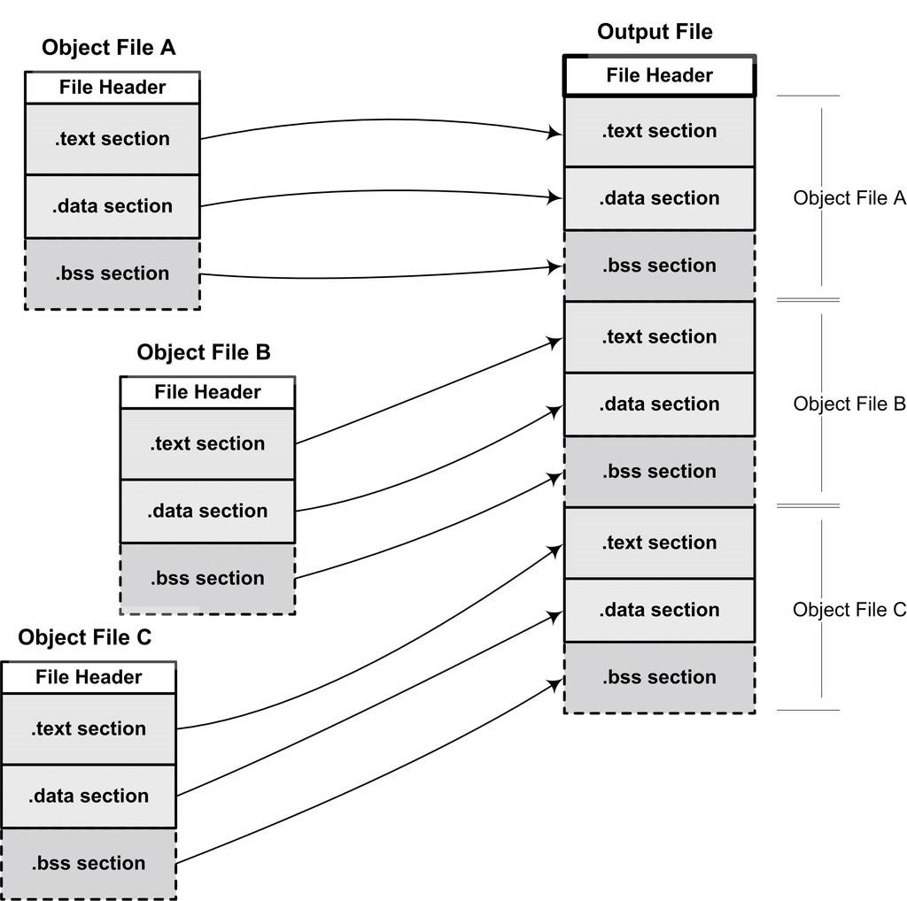

> @Date    : 2020-09-19 20:04:05
>
> @Author  : Lewis Tian (taseikyo@gmail.com)
>
> @Link    : github.com/taseikyo

# 静态链接

当我们有两个目标文件时，如何将它们链接起来形成一个可执行文件？这个过程中发生了什么？这基本上就是链接的核心内容：静态链接。

在这一节里，我们将使用下面这两个源代码文件 "a.c" 和 "b.c" 作为例子展开分析：

```C
// a.c
extern int shared;

int main() {
	int a = 100;
	swap(&a, &shared);
}
```

```C
// b.c
int shared = 1;

void swap(int *a, int *b) {
	*a ^= *b ^= *a ^= *b;
}
```

经过编译以后我们就得到了 "a.o" 和 "b.o" 这两个目标文件。"b.c" 总共定义了两个全局符号，一个是变量 "shared"，另外一个是函数 "swap"；"a.c" 里面定义了一个全局符号就是 "main"。模块 "a.c" 里面引用到了 "b.c" 里面的 "swap" 和 "shared"。我们接下来要做的就是把 "a.o" 和 "b.o" 这两个目标文件链接在一起并最终形成一个可执行文件 "ab"。

## 4.1 空间与地址分配

对于链接器来说，整个链接过程中，它就是将几个输入目标文件加工后合并成一个输出文件。

可执行文件中的代码段和数据段都是由输入的目标文件中合并而来的。对于多个输入目标文件，链接器如何将它们的各个段合并到输出文件？或者说，输出文件中的空间如何分配给输入文件？

### 4.1.1 按序叠加

一个最简单的方案就是将输入的目标文件按照次序叠加起来，如图 4-1 所示。这种做法的确很简单，就是直接将各个目标文件依次合并。但是这样做会造成一个问题，在有很多输入文件的情况下，输出文件将会有很多零散的段。比如一个规模稍大的应用程序可能会有数百个目标文件，如果每个目标文件都分别有 .text 段、.data 段和 .bss 段，那最后的输出文件将会有成百上千个零散的段。

这种做法非常浪费空间，因为每个段都须要有一定的地址和空间对齐要求，比如对于 x86 的硬件来说，段的装载地址和空间的对齐单位是页，也就是 4 096 字节（关于地址和空间对齐，我们在后面还会有专门的章节详细介绍）。那么就是说如果一个段的长度只有 1 个字节，它也要在内存中占用 4 096 字节。这样会造成内存空间大量的内部碎片，所以这并不是一个很好的方案。



图 4-1 简单的空间分配策略

### 4.1.2 相似段合并

一个更实际的方法是将相同性质的段合并到一起，比如将所有输入文件的 ".text" 合并到输出文件的 ".text" 段，接着是 ".data" 段、".bss" 段等，如图 4-2 所示。


图 4-2 实际的空间分配策略

正如我们前文所提到的，".bss" 段在目标文件和可执行文件中并不占用文件的空间，但是它在装载时占用地址空间。所以链接器在合并各个段的同时，也将 ".bss" 合并，并且分配虚拟空间。从 ".bss" 段的空间分配上我们可以思考一个问题，那就是这里的所谓的 "空间分配" 到底是什么空间？

"链接器为目标文件分配地址和空间" 这句话中的 "地址和空间" 其实有两个含义：

1. 在输出的可执行文件中的空间
2. 在装载后的虚拟地址中的虚拟地址空间

对于有实际数据的段，比如 ".text" 和 ".data" 来说，它们在文件中和虚拟地址中都要分配空间，因为它们在这两者中都存在；而对于 ".bss" 这样的段来说，分配空间的意义只局限于虚拟地址空间，因为它在文件中并没有内容。事实上，我们在这里谈到的空间分配只关注于虚拟地址空间的分配，因为这个关系到链接器后面的关于地址计算的步骤，而可执行文件本身的空间分配与链接过程关系并不是很大。

现在的链接器空间分配的策略基本上都采用上述方法中的第二种，使用这种方法的链接器一般都采用两步链接（Two-passLinking）的方法：

1. 空间与地址分配
	- 扫描所有的输入目标文件，并且获得它们的各个段的长度、属性和位置，并且将输入目标文件中的符号表中所有的符号定义和符号引用收集起来，统一放到一个全局符号表。这一步中，链接器将能够获得所有输入目标文件的段长度，并且将它们合并，计算出输出文件中各个段合并后的长度与位置，并建立映射关系
2. 符号解析与重定位
	- 使用上面第一步中收集到的所有信息，读取输入文件中段的数据、重定位信息，并且进行符号解析与重定位、调整代码中的地址等。事实上第二步是链接过程的核心，特别是重定位过程

我们使用 ld 链接器将 "a.o" 和 "b.o" 链接起来：

```bash
$ ld a.o b.o -e main -o ab
```

`-e main` 表示将 main 函数作为程序入口，ld 链接器默认的程序入口为 `_start`

让我们使用 objdump 来查看链接前后地址的分配情况

```bash
$ objdump -h a.o
...
Sections:
Idx Name          Size    VMA       LMA       File off  Algn
  0 .text       00000034  00000000  00000000  00000034  2**2
                CONTENTS, ALLOC, LOAD, RELOC, READONLY, CODE
  1 .data       00000000  00000000  00000000  00000068  2**2
                CONTENTS, ALLOC, LOAD, DATA
  2 .bss        00000000  00000000  00000000  00000068  2**2
                ALLOC
...
$ objdump -h b.o
...
Sections:
Idx Name        Size      VMA       LMA       File off  Algn
  0 .text       0000003e  00000000  00000000  00000034  2**2
                CONTENTS, ALLOC, LOAD, READONLY, CODE
  1 .data       00000004  00000000  00000000  00000074  2**2
                CONTENTS, ALLOC, LOAD, DATA
  2 .bss        00000000  00000000  00000000  00000078  2**2
                ALLOC
...
$objdump -h ab
...
Sections:
Idx Name          Size      VMA       LMA       File off  Algn
  0 .text       00000072  08048094  08048094  00000094  2**2
                  CONTENTS, ALLOC, LOAD, READONLY, CODE
  1 .data       00000004  08049108  08049108  00000108  2**2
                  CONTENTS, ALLOC, LOAD, DATA
```

VMA 表示 Virtual Memory Address，即虚拟地址，LMA 表示 Load Memory Address，即加载地址，正常情况下这两个值应该是一样的，但是在有些嵌入式系统中，特别是在那些程序放在 ROM 的系统中时，LMA 和 VMA 是不相同的。这里我们只要关注 VMA 即可。

链接前后的程序中所使用的地址已经是程序在进程中的虚拟地址，即我们关心上面各个段中的 VMA（Virtual Memory Address）和 Size，而忽略文件偏移（File off）。我们可以看到，在链接之前，目标文件中的所有段的 VMA 都是 0，因为虚拟空间还没有被分配，所以它们默认都为 0。等到链接之后，可执行文件 "ab" 中的各个段都被分配到了相应的虚拟地址。这里的输出程序 "ab" 中，".text" 段被分配到了地址 0x08048094，大小为 0x72 字节；".data" 段从地址 0x08049108 开始，大小为 4 字节。整个链接过程前后，目标文件各段的分配、程序虚拟地址如图 4-3 所示。


我们在图 4-3 中忽略了像 `.comment` 这种无关紧要的段，只关心代码段和数据段。由于在本例中没有 ".bss" 段，所以我们也将其简化了。从图 4-3 中可以看到，"a.o" 和 "b.o" 的代码段被先后叠加起来，合并成 "ab" 的一个 .text 段，加起来的长度为 0x72。所以 "ab" 的代码段里面肯定包含了 main 函数和 swap 函数的指令代码。

什么链接器要将可执行文件 "ab" 的 ".text" 分配到 0x08048094、将 ".data" 分配 0x08049108？而不是从虚拟空间的 0 地址开始分配呢？这涉及操作系统的进程虚拟地址空间的分配规则，在 Linux 下，ELF 可执行文件默认从地址 0x08048000 开始分配。具体见第 6 章 "可执行文件的装载与进程"

### 4.1.3 符号地址的确定

在第一步的扫描和空间分配阶段，链接器按照前面介绍的空间分配方法进行分配，这时候输入文件中的各个段在链接后的虚拟地址就已经确定了，比如 ".text" 段起始地址为 0x08048094，".data" 段的起始地址为 0x08049108。

当前面一步完成之后，链接器开始计算各个符号的虚拟地址。因为各个符号在段内的相对位置是固定的，所以这时候其实 "main"、"shared" 和 "swap" 的地址也已经是确定的了，只不过链接器须要给每个符号加上一个偏移量，使它们能够调整到正确的虚拟地址。

比如我们假设 "a.o" 中的 "main" 函数相对于 "a.o" 的 ".text" 段的偏移是 X，但是经过链接合并以后，"a.o" 的 ".text" 段位于虚拟地址 0x08048094，那么 "main" 的地址应该是 0x08048094 + X。从前面 "objdump" 的输出看到，"main" 位于 "a.o" 的 ".text" 段的最开始，也就是偏移为 0，所以 "main" 这个符号在最终的输出文件中的地址应该是 0x08048094 + 0，即 0x08048094。

## 4.2 符号解析与重定位

### 4.2.1 重定位

在完成空间和地址的分配步骤以后，链接器就进入了符号解析与重定位的步骤，这也是静态链接的核心内容。

在分析符号解析和重定位之前，首先让我们来看看 "a.o" 里面是怎么使用这两个外部符号的，也就是说我们在 "a.c" 的源程序里面使用了 "shared" 变量和 "swap" 函数，那么编译器在将 "a.c" 编译成指令时，它如何访问 "shared" 变量？如何调用 "swap" 函数？

使用 objdump 的 "-d" 参数可以看到 "a.o" 的代码段反汇编结果：

```bash
$ objdump -d a.o

a.o:     file format elf32-i386
Disassembly of section .text:
00000000 <main>:
   0: 8d 4c 24 04           lea 0x4(%esp),%ecx
   4: 83 e4 f0              and    $0xfffffff0,%esp
   7: ff 71 fc              pushl  0xfffffffc(%ecx)
   a: 55                    push   %ebp
   b: 89 e5                 mov    %esp,%ebp
   d: 51                    push   %ecx
   e: 83 ec 24              sub    $0x24,%esp
  11: c7 45 f8 64 00 00 00  movl   $0x64,0xfffffff8(%ebp)
  18: c7 44 24 04 00 00 00  movl   $0x0,0x4(%esp)
  1f: 00 
  20: 8d 45 f8              lea 0xfffffff8(%ebp),%eax
  23: 89 04 24              mov    %eax,(%esp)
  26: e8 fc ff ff ff        call   27 <main+0x27>
  2b: 83 c4 24              add    $0x24,%esp
  2e: 59                    pop    %ecx
  2f: 5d                    pop    %ebp
  30: 8d 61 fc              lea 0xfffffffc(%ecx),%esp
  33: c3                    ret  
```

我们知道在程序的代码里面使用的都是虚拟地址，在这里也可以看到 "main" 的起始地址为 0x00000000，这是因为在未进行前面提到过的空间分配之前，目标文件代码段中的起始地址以 0x00000000 开始，等到空间分配完成以后，各个函数才会确定自己在虚拟地址空间中的位置。

"a.o" 共定义了一个函数 main。这个函数占用 0x33 个字节，共 17 条指令；我们已经用粗体标出了两个引用 "shared" 和 "swap" 的位置，对于 "shared" 的引用是一条 "mov" 指令，这条指令总共 8 个字节，它的作用是将 "shared" 的地址赋值到 ESP 寄存器 + 4 的偏移地址中去，前面 4 个字节是指令码，后面 4 个字节是 "shared" 的地址，我们只关心后面的 4 个字节部分，如图 4-4 所示。


当 "a.c" 在被编译成目标文件时，编译器并不知道 "shared" 和 "swap" 的地址，因为它们定义在其他目标文件中。所以编译器就暂时把地址 0 看作是 "shared" 的地址，我们可以看到这条 "mov" 指令中，关于 "shared" 的地址部分为 "0x00000000"

另外一个是偏移为 0x26 的指令的一条调用指令，它其实就表示对 swap 函数的调用，如图 4-5 所示


这条指令是一条近址相对位移调用指令（Call near, relative,displacement relative to next instruction），后面 4 个字节就是被调用函数的相对于调用指令的下一条指令的偏移量。在没有重定位之前，相对偏移被置为 0xFFFFFFFC（小端），它是常量 "?-4" 的补码形式

让我们来仔细看这条指令的含义。紧跟在这条 call 指令后面的那条指令为 add 指令，add 指令的地址为 0x2b，而相对于 add 指令偏移为 "?4" 的地址即 0x2b - 4 = 0x27。所以这条 call 指令的实际调用地址为 0x27。我们可以看到 0x27 存放着并不是 swap 函数的地址，跟前面 "shared" 一样，"0xFFFFFFFC" 只是一个临时的假地址，因为在编译的时候，编译器并不知道 "swap" 的真正地址。

编译器把这两条指令的地址部分暂时用地址 "0x00000000" 和 "0xFFFFFFFC" 代替着，把真正的地址计算工作留给了链接器。我们通过前面的空间与地址分配可以得知，链接器在完成地址和空间分配之后就已经可以确定所有符号的虚拟地址了，那么链接器就可以根据符号的地址对每个需要重定位的指令进行地位修正。

我们用 objdump 来反汇编输出程序 "ab" 的代码段，可以看到 main 函数的两个重定位入口都已经被修正到正确的位置：

```bash
$objdump -d ab
ab:     file format elf32-i386
Disassembly of section .text:
08048094 <main>:
 8048094: 8d 4c 24 04           lea 0x4(%esp),%ecx
 8048098: 83 e4 f0              and    $0xfffffff0,%esp
 804809b: ff 71 fc              pushl  0xfffffffc(%ecx)
 804809e: 55                    push   %ebp
 804809f: 89 e5                 mov    %esp,%ebp
 80480a1: 51                    push   %ecx
 80480a2: 83 ec 24              sub    $0x24,%esp
 80480a5: c7 45 f8 64 00 00 00  movl   $0x64,0xfffffff8(%ebp)
 80480ac: c7 44 24 04 08 91 04  movl   $0x8049108,0x4(%esp)
 80480b3: 08 
 80480b4: 8d 45 f8              lea 0xfffffff8(%ebp),%eax
 80480b7: 89 04 24              mov    %eax,(%esp)
 80480ba: e8 09 00 00 00        call   80480c8 <swap>
 80480bf: 83 c4 24              add    $0x24,%esp
 80480c2: 59                    pop    %ecx
 80480c3: 5d                    pop    %ebp
 80480c4: 8d 61 fc              lea 0xfffffffc(%ecx),%esp
 80480c7: c3                    ret    
080480c8 <swap>:
 80480c8: 55                    push   %ebp
...
```

经过修正以后，"shared" 和 "swap" 的地址分别为 0x08049108 和 0x00000009（小端字节序）。关于 "shared" 很好理解，因为 "shared" 变量的地址的确是 0x08049108。对于 "swap" 来说稍显晦涩。我们前面介绍过，这个 "call" 指令是一条近址相对位移调用指令，它后面跟的是调用指令的下一条指令的偏移量，"call" 指令的下一条指令是 "add"，它的地址是 0x080480bf，所以 "相对于 add 指令偏移量为 0x00000009" 的地址为 0x080480bf + 9 =0x080480c8，即刚好是 "swap" 函数的地址。

### 4.2.2 重定位表

那么链接器是怎么知道哪些指令是要被调整的呢？这些指令的哪些部分要被调整？怎么调整？比如上面例子中 "mov" 指令和 "call" 指令的调整方式就有所不同。事实上在 ELF 文件中，有一个叫重定位表（Relocation Table）的结构专门用来保存这些与重定位相关的信息，我们在前面介绍 ELF 文件结构时已经提到过了重定位表，它在 ELF 文件中往往是一个或多个段。

对于可重定位的 ELF 文件来说，它必须包含有重定位表，用来描述如何修改相应的段里的内容。对于每个要被重定位的 ELF 段都有一个对应的重定位表，而一个重定位表往往就是 ELF 文件中的一个段，所以其实重定位表也可以叫重定位段，我们在这里统一称作重定位表。

代码段 ".text" 如有要被重定位的地方，那么会有一个相对应叫 ".rel.text" 的段保存了代码段的重定位表；如果代码段 ".data" 有要被重定位的地方，就会有一个相对应叫 ".rel.data" 的段保存了数据段的重定位表。我们可以使用 objdump 来查看目标文件的重定位表：

```bash
$ objdump -r a.o
a.o:     file format elf32-i386
RELOCATION RECORDS FOR [.text]:
OFFSET   TYPE              VALUE 
0000001c R_386_32          shared
00000027 R_386_PC32        swap
```

可以用来查看 "a.o" 中要重定位的地方，即 "a.o" 所有引用到外部符号的地址。每个要被重定位的地方叫一个重定位入口（Relocation Entry）。重定位入口的偏移（Offset）表示该入口在要被重定位的段中的位置，"RELOCATION RECORDS FOR [.text]" 表示这个重定位表是代码段的重定位表，所以偏移表示代码段中须要被调整的位置。对照前面的反汇编结果可以知道，这里的 0x1c 和 0x27 分别就是代码段中 "mov" 指令和 "call" 指令的地址部分。

对于 32 位的 Intel x86 系列处理器来说，重定位表的结构也很简单，它是一个 Elf32_Rel 结构的数组，每个数组元素对应一个重定位入口。Elf32_Rel 的定义如下：

```C
typedef struct {
    Elf32_Addr r_offset;
    Elf32_Word r_info;
} Elf32_Rel;
```

| 变量 | 解释 |
|-|-|
| r_offset | 重定位入口的偏移。对于可重定位文件来说，这个值是该重定位入口所要修正的位置的第一个字节相对于段起始的偏移；对于可执行文件或共享对象文件来说，这个值是该重定位入口所要修正的位置的第一个字节的虚拟地址。|
| r_info | 重定位入口的类型和符号。这个成员的低 8 位表示重定位入口的类型，高 24 位表示重定位入口的符号在符号表中的下标。因为各种处理器的指合格式不一样，所以重定位所修正的指合地址格式也不一样。每种处理器都有自己一套重定位入口的类型。对于可执行文件和共享目标文件来说，它们的重定位入口是动态链接类型的，请参考 "动态链接" 一章 |

### 4.2.3 符号解析

因为我们目标文件中用到的符号被定义在其他目标文件，所以要将它们链接起来。比如我们直接使用 ld 来链接 "a.o"，而不将 "b.o" 作为输入。链接器就会发现 shared 和 swap 两个符号没有被定义，没有办法完成链接工作。

链接时符号未定义的原因很多，最常见的一般都是链接时缺少了某个库，或者输入目标文件路径不正确或符号的声明与定义不一样。所以从普通程序员的角度看，符号的解析占据了链接过程的主要内容。

通过前面指令重定位的介绍，我们可以更加深层次地理解为什么缺少符号的定义会导致链接错误。其实重定位过程也伴随着符号的解析过程，每个目标文件都可能定义一些符号，也可能引用到定义在其他目标文件的符号。重定位的过程中，每个重定位的入口都是对一个符号的引用，那么当链接器须要对某个符号的引用进行重定位时，它就要确定这个符号的目标地址。这时候链接器就会去查找由所有输入目标文件的符号表组成的全局符号表，找到相应的符号后进行重定位。

```bash
$ readelf -s a.o
Symbol table '.symtab' contains 10 entries:
   Num:    Value  Size Type    Bind   Vis      Ndx Name
     0: 00000000  0 NOTYPE  LOCAL  DEFAULT  UND
     1: 00000000  0 FILE    LOCAL  DEFAULT  ABS a.c
     2: 00000000  0 SECTION LOCAL  DEFAULT    1
     3: 00000000  0 SECTION LOCAL  DEFAULT    3
     4: 00000000  0 SECTION LOCAL  DEFAULT    4
     5: 00000000  0 SECTION LOCAL  DEFAULT    6
     6: 00000000  0 SECTION LOCAL  DEFAULT    5
     7: 00000000  52 FUNC   GLOBAL DEFAULT    1 main
     8: 00000000  0 NOTYPE  GLOBAL DEFAULT  UND shared
     9: 00000000  0 NOTYPE  GLOBAL DEFAULT  UND swap
```

"GLOBAL" 类型的符号，除了 "main" 函数是定义在代码段之外，其他两个 "shared" 和 "swap" 都是 "UND"，即 "undefined" 未定义类型，这种未定义的符号都是因为该目标文件中有关于它们的重定位项。所以在链接器扫描完所有的输入目标文件之后，所有这些未定义的符号都应该能够在全局符号表中找到，否则链接器就报符号未定义错误。

### 4.2.4 指令修正方式

不同的处理器指令对于地址的格式和方式都不一样。比如对于 32 位 Intel x86 处理器来说，转移跳转指令（jmp 指令）、子程序调用指令（call 指令）和数据传送指令（mov 指令）寻址方式千差万别。直至 2006 年为止，Intel x86 系列 CPU 的 jmp 指令有 11 种寻址模式；call 指令有 10 种；mov 指令则有多达 34 种寻址模式！这些寻址方式有如下几方面的区别：

- 近址寻址或远址寻址
- 绝对寻址或相对寻址
- 寻址长度为8位、16位、32位或64位

但是对于 32 位 x86 平台下的 ELF 文件的重定位入口所修正的指令寻址方式只有两种：

- 绝对近址32位寻址
- 相对近址32位寻址

这两种重定位方式指令修正方式每个被修正的位置的长度都为 32 位，即 4 个字节。而且都是近址寻址，不用考虑 Intel 的段间远址寻址。前面我们提到过，重定位入口的 r_info 成员低 8 位表示重定位入口类型，如表 4-2 所示。

表 4-2 ×86 基本重定位类型

|   宏定义   | 值 | 重定位修正方法     |
|:----------:|:--:|-------------------|
| R_386_32   | 1  | 绝对寻址修正 S+A   |
| R_386_PC32 | 2  | 相对寻址修正 S+A-P |

- A = 保存在被修正位置的值
- P = 被修正的位置（相对于段开始的偏移量或者虚拟地址），注意，该值可通过 r_offset 计算得到
- S = 符号的实际地址，即由 r_info 的高 24 位指定的符号的实际地址

对照前面 a.o 的重定位信息，我们可以看到第一个重定位入口是对 swap 符号的引用，类型为 R_386_PC32，查阅 Intel 指令手册，它的确是一条相对位移调用指令；而 shared 是 R_386_32 类型的，它修正的是一条传输指令的源，该传输指令的源是一个立即数，即 shared 的绝对地址。

现在让我们假设在将 a.o 和 b.o 链接成最终可执行文件后，main 函数的虚拟地址为 0x1000，swap 函数的虚拟地址为 0x2000；shared 变量的虚拟地址为 0x3000。那么我们的链接器将如何修正 a.o 里面这两个重定位入口呢？

#### 绝对寻址修正

让我们先看 a.o 的第一个重定位入口，即偏移为 0x18 的这条 mov 指令的修正，它的修正方式是 R_386_32，即绝对地址修正。对于这个重定位入口，它修正后的结果应该是 S + A

- S 是符号 shared 的实际地址，即 0x3000
- A 是被修正位置的值，即 0x0000000

所以最后这个重定位入口修正后地址为：0x3000 + 0x00000000= 0x3000。即指令修正后应该是：

```bash
...
1011: c7 45 f8 64 00 00 00  movl   $0x64,0xfffffff8(%ebp)
1018: c7 44 24 04 00 30 00  movl   $0x3000,0x4(%esp)
101f: 00 
1020: 8d 45 f8              lea    0xfffffff8(%ebp),%eax
...
```

#### 相对寻址修正

让我们再来看看 a.o 的第二个重定位入口，即偏移为 0x26 的这条 call 指令的修正，它的指令修正方式是 R_386_PC32，即相对寻址修正。对于这个重定位入口，它修正后的结果应该是 S + A - P


- S 是符号 swap 的实际地址，即 0x2000
- A 是被修正位置的值，即 0xFFFFFFFC（-4）
- P 为被修正的位置，当链接成可执行文件时，这个值应该是被修正位置的虚拟地址，即 0x1000 + 0x27

所以最后这个重定位入口修正后地址为：0x2000 + (-4) - (0x1000 + 0x27) = 0xFD5。即指令修正后应该是：

```bash
...
1023:  8d 45 f8               lea    0xfffffff8(%ebp),%eax
1026:  e8 d5 0f 00 00         call   0xfd5
102b:  89 04 24               mov    %eax,(%esp)
...
2000<swap>:
...
```

从这两个例子可以看出来，绝对寻址修正和相对寻址修正的区别就是绝对寻址修正后的地址为该符号的实际地址；相对寻址修正后的地址为符号距离被修正位置的地址差。

## 4.3 COMMON 块

由于弱符号机制允许同一个符号的定义存在于多个文件中，所以可能会导致的一个问题是：如果一个弱符号定义在多个目标文件中，而它们的类型又不同，怎么办？目前的链接器本身并不支持符号的类型，即变量类型对于链接器来说是透明的，它只知道一个符号的名字，并不知道类型是否一致。那么当我们定义的多个符号定义类型不一致时，链接器该如何处理呢？让我们来分析一下多个符号定义类型不一致的几种情况，主要分三种情况：

- 两个或两个以上强符号类型不一致
- 有一个强符号，其他都是弱符号，出现类型不一致
- 两个或两个以上弱符号类型不一致

对于上述三种情况，第一种情况是无须额外处理的，因为多个强符号定义本身就是非法的，链接器会报符号多重定义错误；链接器要处理的就是后两种情况。

现在的编译器和链接器都支持一种叫 COMMON 块（Common Block）的机制，这种机制最早来源于 Fortran，早期的 Fortran 没有动态分配空间的机制，程序员必须事先声明它所需要的临时使用空间的大小。Fortran 把这种空间叫 COMMON 块，当不同的目标文件需要的 COMMON 块空间大小不一致时，以最大的那块为准。

现代的链接机制在处理弱符号的时候，采用的就是与 COMMON 块一样的机制。前面我们在 SimpleSection.c 例子中看到，编译器将未初始化的全局变量定义作为弱符号处理。比如符号 global_uninit_var，它在符号表中的各个值为（使用 readelf -s）：

```C
st_name = "global_uninit_var"
st_value = 4
st_size = 4
st_info = 0x11 STB_GLOBAL STT_OBJECT
st_other = 0
st_shndx = 0xfff2 SHN_COMMON
```

可以看到它是一个全局的数据对象，它的类型为 SHN_COMMON 类型，这是一个典型的弱符号。那么如果我们在另外一个文件中也定义了 global_uninit_var 变量，且未初始化，它的类型为 double，占 8 个字节，情况会怎么样呢？按照 COMMON 类型的链接规则，原则上讲最终链接后输出文件中，global_uninit_var 的大小以输入文件中最大的那个为准。即这两个文件链接后输出文件中 global_uninit_var 所占的空间为 8 个字节

当然 COMMON 类型的链接规则是针对符号都是弱符号的情况，如果其中有一个符号为强符号，那么最终输出结果中的符号所占空间与强符号相同。值得注意的是，如果链接过程中有弱符号大小大于强符号，那么 ld 链接器会报如下警告：

```bash
ld: warning: alignment 4 of symbol `global’ in a.o is smaller than 8 in b.o
```

这种使用 COMMON 块的方法实际上是一种类似 "黑客" 的取巧办法，直接导致需要 COMMON 机制的原因是编译器和链接器允许不同类型的弱符号存在，但最本质的原因还是链接器不支持符号类型，即链接器无法判断各个符号的类型是否一致。

现在我们再回头总结性地思考关于未初始化的全局变量的问题：在目标文件中，编译器为什么不直接把未初始化的全局变量也当作未初始化的局部静态变量一样处理，为它在 BSS 段分配空间，而是将其标记为一个 COMMON 类型的变量？

通过了解链接器处理多个弱符号的过程，我们可以想到，当编译器将一个编译单元编译成目标文件的时候，如果该编译单元包含了弱符号（未初始化的全局变量就是典型的弱符号），那么该弱符号最终所占空间的大小在此时是未知的，因为有可能其他编译单元中该符号所占的空间比本编译单元该符号所占的空间要大。所以编译器此时无法为该弱符号在 BSS 段分配空间，因为所须要空间的大小未知。但是链接器在链接过程中可以确定弱符号的大小，因为当链接器读取所有输入目标文件以后，任何一个弱符号的最终大小都可以确定了，所以它可以在最终输出文件的 BSS 段为其分配空间。所以总体来看，未初始化全局变量最终还是被放在 BSS 段的。

GCC 的 "-fno-common" 也允许我们把所有未初始化的全局变量不以 COMMON 块的形式处理，或者使用 `__attribute__` 扩展：`int global __attribute__((nocommon));`

一旦一个未初始化的全局变量不是以 COMMON 块的形式存在，那么它就相当于一个强符号

## 4.4 C++ 相关问题

C++ 的一些语言特性使之必须由编译器和链接器共同支持才能完成工作。最主要的有两个方面，一个是 C++ 的重复代码消除，还有一个就是全局构造与析构。另外由于 C++ 语言的各种特性，比如虚拟函数、函数重载、继承、异常等，使得它背后的数据结构异常复杂，这些数据结构往往在不同的编译器和链接器之间相互不能通用，使得 C++ 程序的二进制兼容性成了一个很大的问题，我们在这一节还将讨论 C++ 程序的二进制兼容性问题。

### 4.4.1 重复代码消除

C++ 编译器在很多时候会产生重复的代码，比如模板（Templates）、外部内联函数（Extern Inline Function）和虚函数表（VirtualFunction Table）都有可能在不同的编译单元里生成相同的代码。最简单的情况就拿模板来说，模板从本质上来讲很像宏，当模板在一个编译单元里被实例化时，它并不知道自己是否在别的编译单元也被实例化了。所以当一个模板在多个编译单元同时实例化成相同的类型的时候，必然会生成重复的代码。当然，最简单的方案就是不管这些，将这些重复的代码都保留下来。不过这样做的主要问题有以下几方面：

- 空间浪费
- 地址较易出错。有可能两个指向同一个函数的指针会不相等
- 指令运行效率较低。因为现代的 CPU 都会对指令和数据进行缓存，如果同样一份指令有多份副本，那么指令 Cache 的命中率就会降低

一个比较有效的做法就是将每个模板的实例代码都单独地存放在一个段里，每个段只包含一个模板实例。比如有个模板函数是 add<T>()，某个编译单元以 int 类型和 float 类型实例化了该模板函数，那么该编译单元的目标文件中就包含了两个该模板实例的段。为了简单起见，我们假设这两个段的名字分别叫 `.temp.add<int>` 和 `.temp.add<float>`。这样，当别的编译单元也以 int 或 float 类型实例化该模板函数后，也会生成同样的名字，这样链接器在最终链接的时候可以区分这些相同的模板实例段，然后将它们合并入最后的代码段

这种做法的确被目前主流的编译器所采用，GNU GCC 编译器和 VISUAL C++ 编译器都采用了类似的方法

- GCC 把这种类似的须要在最终链接时合并的段叫 "Link Once"，它的做法是将这种类型的段命名为 ".gnu.linkonce.name"，其中 "name" 是该模板函数实例的修饰后名称
- VISUAL C++ 编译器做法稍有不同，它把这种类型的段叫做 "COMDAT"，这种 "COMDAT" 段的属性字段（PE 文件的段表结构里面的 IMAGE_SECTION_HEADER 的 Characteristics 成员）都有 IMAGE_SCN_LNK_COMDAT（0x00001000）这个标记，在链接器看到这个标记后，它就认为该段是 COMDAT 类型的，在链接时会将重复的段丢弃。

这种重复代码消除对于模板来说是这样的，对于外部内联函数和虚函数表的做法也类似。比如对于一个有虚函数的类来说，有一个与之相对应的虚函数表（Virtual Function Table，一般简称 vtbl），编译器会在用到该类的多个编译单元生成虚函数表，造成代码重复；外部内联函数、默认构造函数、默认拷贝构造函数和赋值操作符也有类似的问题。它们的解决方式基本跟模板的重复代码消除类似。

#### 函数级别链接

由于现在的程序和库通常来讲都非常庞大，一个目标文件可能包含成千上百个函数或变量。当我们须要用到某个目标文件中的任意一个函数或变量时，就须要把它整个链接进来，也就是说那些没有用到的函数也被一起链接了进来。这样的后果是链接输出文件会变得很大，所有用到的没用到的变量和函数都一起塞到了输出文件中。

VISUAL C++ 编译器提供了一个编译选项叫函数级别链接（Functional-Level Linking，/Gy），这个选项的作用就是让所有的函数都像前面模板函数一样，单独保存到一个段里面。当链接器须要用到某个函数时，它就将它合并到输出文件中，对于那些没有用的函数则将它们抛弃。这种做法可以很大程度上减小输出文件的长度，减少空间浪费。但是这个优化选项会减慢编译和链接过程，因为链接器须要计算各个函数之间的依赖关系，并且所有函数都保持到独立的段中，目标函数的段的数量大大增加，重定位过程也会因为段的数目的增加而变得复杂，目标文件随着段数目的增加也会变得相对较大

GCC 编译器也提供了类似的机制，它有两个选择分别是 "-ffunction-sections" 和 "-fdata-sections"，这两个选项的作用就是将每个函数或变量分别保持到独立的段中

### 4.4.2 全局构造与析构

一般的一个 C/C++ 程序是从 main 开始执行的，随着 main 函数的结束而结束。然而，其实在 main 函数被调用之前，为了程序能够顺利执行，要先初始化进程执行环境，比如堆分配初始化（malloc、free）、线程子系统等，关于 main 之前所执行的部分，我们将在本书的第 4 部分详细介绍。C++ 的全局对象构造函数也是在这一时期被执行的，我们知道 C++ 的全局对象的构造函数在 main 之前被执行，C++ 全局对象的析构函数在 main 之后被执行。

Linux 系统下一般程序的入口是 `_start`，这个函数是 Linux 系统库（Glibc）的一部分。当我们的程序与 Glibc 库链接在一起形成最终可执行文件以后，这个函数就是程序的初始化部分的入口，程序初始化部分完成一系列初始化过程之后，会调用 main 函数来执行程序的主体。在 main 函数执行完成以后，返回到初始化部分，它进行一些清理工作，然后结束进程。对于有些场合，程序的一些特定的操作必须在 main 函数之前被执行，还有一些操作必须在 main 函数之后被执行，其中很具有代表性的就是 C++ 的全局对象的构造和析构函数。因此 ELF 文件还定义了两种特殊的段。

- `.init` 该段里面保存的是可执行指令，它构成了进程的初始化代码。因此，当一个程序开始运行时，在 main 函数被调用之前，Glibc 的初始化部分安排执行这个段的中的代码
- `.fini` 该段保存着进程终止代码指令。因此，当一个程序的 main 函数正常退出时，Glibc 会安排执行这个段中的代码

这两个段 `.init` 和 `.fini` 的存在有着特别的目的，如果一个函数放到 `.init` 段，在 main 函数执行前系统就会执行它。同理，假如一个函数放到 `.fini` 段，在 main 函数返回后该函数就会被执行

利用这两个特性，C++ 的全局构造和析构函数就由此实现（第 11 章）

### 4.4.3 C++ 与 ABI

既然每个编译器都能将源代码编译成目标文件，那么有没有不同编译器编译出来的目标文件是不能够相互链接的呢？有没有可能将 MSVC 编译出来的目标文件和 GCC 编译出来的目标文件链接到一起，形成一个可执行文件呢？

如果要将两个不同编译器的编译结果链接到一起，那么，首先链接器必须支持这两个编译器产生的目标文件的格式。比如 MSVC 编译的目标文件是 PE/COFF 格式的，而 GCC 编译的结果是 ELF 格式的，链接器必须同时认识这两种格式才行，否则肯定没戏。那是不是链接器只要同时认识目标文件的格式就可以了呢？

如果要使两个编译器编译出来的目标文件能够相互链接，那么这两个目标文件必须满足下面这些条件：采用同样的目标文件格式、拥有同样的符号修饰标准、变量的内存分布方式相同、函数的调用方式相同，等等。其中我们把符号修饰标准、变量内存布局、函数调用方式等这些跟可执行代码二进制兼容性相关的内容称为 ABI（Application Binary Interface）

#### ABI 与 API

很多人经常将它们的概念搞混。那么它们之间有什么区别呢？实际上它们都是所谓的应用程序接口，只是它们所描述的接口所在的层面不一样。API 往往是指源代码级别的接口，比如我们可以说 POSIX 是一个 API 标准、Windows 所规定的应用程序接口是一个 API；而 ABI 是指二进制层面的接口，ABI 的兼容程度比 API 要更为严格，比如我们可以说 C++ 的对象内存分布（Object Memory Layout）是 C++ ABI 的一部分。API 更关注源代码层面的，比如 POSIX 规定 printf() 这个函数的原型，它能保证这个函数定义在所有遵循 POSIX 标准的系统之间都是一样的，但是它不保证 printf 在实际的每个系统中执行时，是否按照从右到左将参数压入堆栈，参数在堆栈中如何分布等这些实际运行时的二进制级别的问题

比如有两台机器，一台是 Intel x86，另外一台是 MIPS 的，它们都安装了 Linux 系统，由于 Linux 支持 POSIX 标准，所以它们的 C 运行库都应该有 printf 函数。但实际上 printf 在被调用过程中，这些关于参数和堆栈分布的细节在不同的机器上肯定是不一样的，甚至调用 printf 的指令也是不一样的（x86 是 call 指令，MIPS 是 jal 指令），这就是说，API 相同并不表示 ABI 相同

ABI 的概念其实从开始至今一直存在，因为人们总是希望程序能够在不经任何修改的情况下得到重用，最好的情况是二进制的指令和数据能够不加修改地得到重用。人们始终在朝这个方向努力，但是由于现实的因素，二进制级别的重用还是很难实现。最大的问题之一就是各种硬件平台、编程语言、编译器、链接器和操作系统之间的 ABI 相互不兼容，由于 ABI 的不兼容，各个目标文件之间无法相互链接，二进制兼容性更加无从谈起

影响 ABI 的因素非常多，硬件、编程语言、编译器、链接器、操作系统等都会影响 ABI。我们可以从 C 语言的角度来看一个编程语言是如何影响 ABI 的。对于 C 语言的目标代码来说，以下几个方面会决定目标文件之间是否二进制兼容：

- 内置类型（如 int、float、char 等）的大小和在存储器中的放置方式（大端、小端、对齐方式等）
- 组合类型（如 struct、union、数组等）的存储方式和内存分布
- 外部符号（external-linkage）与用户定义的符号之间的命名方式和解析方式，如函数名 func 在 C 语言的目标文件中是否被解析成外部符号 `_func`
- 函数调用方式，比如参数入栈顺序、返回值如何保持等
- 堆栈的分布方式，比如参数和局部变量在堆栈里的位置，参数传递方法等。寄存器使用约定，函数调用时哪些寄存器可以修改，哪些须要保存，等等

C++ 的时代，语言层面对 ABI 的影响又增加了很多额外的内容，这些内容使 C++ 要做到二进制兼容比 C 来得更为不易：

- 继承类体系的内存分布，如基类，虚基类在继承类中的位置等
- 指向成员函数的指针（pointer-to-member）的内存分布，如何通过指向成员函数的指针来调用成员函数，如何传递 this 指针
- 如何调用虚函数，vtable 的内容和分布形式，vtable 指针在 object 中的位置等
- template 如何实例化
- 外部符号的修饰
- 全局对象的构造和析构
- 异常的产生和捕获机制
- 标准库的细节问题，RTTI 如何实现等
- 内嵌函数访问细节

很多时候，库厂商往往不希望库用户看到库的源代码，所以一般是以二进制的方式提供给用户。当用户的编译器型号与版本与编译库所用的编译器型号和版本不同时，就可能产生不兼容。如果让库的厂商提供所有的编译器型号和版本编译出来的库给用户，这基本上不现实，特别是厂商对库已经停止了维护后，使用这样陈年老 "库" 实在是一件令人头痛的事。以上的情况对于系统中已经存在的静态库或动态库须要被多个应用程序使用的情况也几乎相同，或者一个程序由多个公司或多个部门一起开发，也有类似的问题

所以人们一直期待着能有统一的 C++ 二进制兼容标准（C++ ABI）。但是目前情况还是不容乐观，基本形成以微软的 VISUAL C++ 和 GNU 阵营的 GCC（采用 Intel Itanium C++ ABI 标准）为首的两大派系，各持己见互不兼容。早先时候，`*NIX` 系统下的 ABI 也十分混乱，这个情况一直延续到 LSB（Linux Standard Base）和 Intel 的 Itanium C++ ABI 标准出来后才有所改善，但并未彻底解决 ABI 的问题，由于现实的因素，这个问题还会长期地存在，这也是为什么有这么多像我们这样的程序员能够存在的原因。

## 4.5 静态库链接

程序之所以有用，因为它会有输入输出，这些输入输出的对象可以是数据，可以是人，也可以是另外一个程序，还可以是另外一台计算机，一个没有输入输出的程序没有任何意义。但是一个程序如何做到输入输出呢？最简单的办法是使用操作系统提供的应用程序编程接口（API, Application Programming Interface）。

让我们还是先回到一个比较初步的问题，就是程序如何使用操作系统提供的 API。在一般的情况下，一种语言的开发环境往往会附带有语言库（Language Library）。这些库就是对操作系统的 API 的包装，比如我们经典的 C 语言版 "Hello World" 程序，它使用 C 语言标准库的 "printf" 函数来输出一个字符串，"printf" 函数对字符串进行一些必要的处理以后，最后会调用操作系统提供的 API。各个操作系统下，往终端输出字符串的 API 都不一样，在 Linux 下，它是一个 "write" 的系统调用，而在 Windows 下它是 "WriteConsole" 系统 API。

一个静态库可以简单地看成一组目标文件的集合，即很多目标文件经过压缩打包后形成的一个文件。比如我们在 Linux 中最常用的 C 语言静态库 libc 位于 /usr/lib/libc.a，它属于 glibc 项目的一部分；像 Windows 这样的平台上，最常使用的 C 语言库是由集成开发环境所附带的运行库，这些库一般由编译器厂商提供，比如 Visual C++ 附带了多个版本的 C/C++ 运行库。表 4-3 列出了 VC2008（内部版本号 VC9）所附带的一部分 C 运行库（库文件存放在 VC 安装目录下的 lib/ 目录）。

表 4-3

|   C 运行库   |    相关 DLL    | 描述                                       |
|:-----------:|:-------------:|---------------------------------------------|
| libcmt.lib  |               | Multithreaded Static 多线程静态库            |
| msvcrt.lib  | msvcr90.dl    | Multithreaded Dynamic 多线程动态库            |
| libcmtd.lib |               | Multithreaded Static Debug 多线程静态调试库   |
| msvcrtd.lib | msvcrt90d.dll | Multithreaded Dynamic Debug 多线程动态调试库 |

在一个 C 语言的运行库中，包含了很多跟系统功能相关的代码，比如输入输出、文件操作、时间日期、内存管理等。glibc 本身是用 C 语言开发的，它由成百上千个 C 语言源代码文件组成，也就是说，编译完成以后有相同数量的目标文件，比如输入输出有 printf.o，scanf.o；文件操作有 fread.o，fwrite.o；时间日期有 date.o，time.o；内存管理有 malloc.o 等。把这些零散的目标文件直接提供给库的使用者，很大程度上会造成文件传输、管理和组织方面的不便，于是通常人们使用 "ar" 压缩程序将这些目标文件压缩到一起，并且对其进行编号和索引，以便于查找和检索，就形成了 libc.a 这个静态库文件。在我的机器上，该文件有 2.8 MB 大小，我们也可以使用 "ar" 工具来查看这个文件包含了哪些目标文件

```bash
$ ar -t libc.a
init-first.o
libc-start.o
sysdep.o
version.o
check_fds.o
libc-tls.o
elf-init.o
...
```

Visual C++ 也提供了与 Linux 下的 ar 类似的工具，叫 lib.exe，这个程序可以用来创建、提取、列举 `.lib` 文件中的内容。使用 "lib /LISTlibcmt.lib" 就可以列举出 libcmt.lib 中所有的目标文件

libc.a 共包含 1400 个目标文件，我们如何在这么多目标文件中找到 "printf" 函数所在的目标文件呢？答案是使用 "objdump" 或 "readelf" 加上文本查找工具如 "grep"，使用 "objdump" 查看 libc.a 的符号可以发现如下结果：

```bash
$ objdump -t libc.a
...
printf.o:     file format elf32-i386
SYMBOL TABLE:
00000000 l  d .text  00000000 .text
00000000 l  d .data  00000000 .data
00000000 l  d   .bss   00000000 .bss
00000000 l  d .comment   00000000 .comment
00000000 l  d .note.GNU-stack    00000000 .note.GNU-stack
00000000 g  F .text  00000026 __printf
00000000        *UND*  00000000 stdout
00000000        *UND*  00000000 vfprintf
00000000 g  F .text  00000026 printf
00000000 g  F .text  00000026 _IO_printf
...
```

【自己试了下：】

```bash
 taseikyo@node ~ objdump -t /usr/lib32/libc.a | grep ^printf.o -A 18
printf.o:     file format elf32-i386

SYMBOL TABLE:
00000000 l    d  .text	00000000 .text
00000000 l    d  .text.__x86.get_pc_thunk.bx	00000000 .text.__x86.get_pc_thunk.bx
00000000 l    d  .group	00000000 .group
00000000 l    d  .data	00000000 .data
00000000 l    d  .bss	00000000 .bss
00000000 l    d  .note.GNU-stack	00000000 .note.GNU-stack
00000000 l    d  .eh_frame	00000000 .eh_frame
00000000 g     F .text	0000002d __printf
00000000 g     F .text.__x86.get_pc_thunk.bx	00000000 .hidden __x86.get_pc_thunk.bx
00000000         *UND*	00000000 _GLOBAL_OFFSET_TABLE_
00000000         *UND*	00000000 stdout
00000000         *UND*	00000000 vfprintf
00000000 g     F .text	0000002d _IO_printf
00000000 g     F .text	0000002d printf
```

可以看到 "printf" 函数被定义在了 "printf.o" 这个目标文件中。这里我们似乎找到了最终的机制，那就是 "Hello World" 程序编译出来的目标文件只要和 libc.a 里面的 "printf.o" 链接在一起，最后就可以形成一个可用的可执行文件了。这个解释似乎很完美，实际上已经很接近最后的答案了。那么我们就按照这个方案去尝试一下，假设 "Hello World" 程序的源代码为 "hello.c"，使用如下方法编译：

```bash
$ gcc -c -fno-builtin hello.c
```

我们得到了目标文件为 "hello.o"，为什么这里要使用 "-fno-builtin" 参数是因为默认情况下，GCC 会自作聪明地将 "Hello World" 程序中只使用了一个字符串参数的 "printf" 替换成 "puts" 函数，以提高运行速度，我们要使用 "-fno-builtin" 关闭这个内置函数优化选项。现在我们还缺 "printf.o"，通过 "ar" 工具解压出 "printf.o"：

```bash
$ ar -x libc.a

$ ld hello.o printf.o
ld: warning: cannot find entry symbol _start; defaulting to 0000000008048080
printf.o: In function `_IO_printf':
(.text+0x18): undefined reference to `stdout'
printf.o: In function `_IO_printf':
(.text+0x20): undefined reference to `vfprintf'
```

链接却失败了，原因是缺少两个外部符号的定义。其实眼尖的读者可能已经在最开始打印 "printf.o" 的符号表时就看出一点问题来了，那就是 "printf.o" 里面有两个 "UND" 的符号 "stdout" 和 "vfprintf"，也就是有两个未定义的符号。正是这两个未定义的符号打破了看似完美的解释，很明显："printf.o" 依赖于其他的目标文件

用同样的方法，我们可以找到 "stdout" 这个符号所在的目标文件（stdio.o）；而 "vfprintf" 位于 "vfprintf.o"。很不幸的是这两个文件还依赖于其他的目标文件，因为它们也有未定义的符号。这些变量和函数都分布在 glibc 的各个目标文件之中，如果我们能够一一将它们收集齐，那么理论上就可以将它们链接在一起，最后跟 "hello.o" 链接成一个可执行文件。但是，如果靠人工这样做的代价实在是太大了，我们在这里不打算演示这样一个繁琐的过程。幸好 ld 链接器会处理这一切繁琐的事务，自动寻找所有须要的符号及它们所在的目标文件，将这些目标文件从 "libc.a" 中 "解压" 出来，最终将它们链接在一起成为一个可执行文件。那么我们可不可以就这么认为：将 "hello.o" 和 "libc.a" 链接起来就可以得到可执行文件呢？理论上这样就可以了，如图 4-6 所示。


实际情况恐怕还是令人失望的，现在 Linux 系统上的库比我们想象的要复杂。当我们编译和链接一个普通 C 程序的时候，不仅要用到 C 语言库 libc.a，而且还有其他一些辅助性质的目标文件和库。我们可以使用下面的 GCC 命令编译 "hello.c"，"-verbose" 表示将整个编译链接过程的中间步骤打印出来

```Markdown
$gcc -static --verbose -fno-builtin hello.c
Using built-in specs.
Target: i486-linux-gnu
Configured with: ../src/configure -v --enable-languages=c,c++,fortran,objc,obj-c++,treelang --prefix=/usr --enable-shared --with-system-zlib --libexecdir=/usr/lib --without-included-gettext --enable-threads=posix --enable-nls --with-gxx-include-dir=/usr/include/c++/4.1.3 --program-suffix=-4.1 
--enable-__cxa_atexit --enable-clocale=gnu --enable-libstdcxx-debug --enable-mpfr --enable-checking=release i486-linux-gnu
Thread model: posix
gcc version 4.1.3 20070929 (prerelease) (Ubuntu 4
.1.2-16ubuntu2)
 /usr/lib/gcc/i486-linux-gnu/4.1.3/cc1 -quiet -v hello.c -quiet -dumpbase hello.c -mtune=generic -auxbase hello -version -fno-builtin -fstack-prote
ctor -fstack-protector -o /tmp/ccUhtGSB.s
ignoring nonexistent directory "/usr/local/includ
e/i486-linux-gnu"
ignoring nonexistent directory "/usr/lib/gcc/i486
-linux-gnu/4.1.3/../../../../i486-linux-gnu/include"
ignoring nonexistent directory "/usr/include/i486-linux-gnu"
#include "..." search starts here:
#include <...> search starts here:
 /usr/local/include
 /usr/lib/gcc/i486-linux-gnu/4.1.3/include
 /usr/include
End of search list.
GNU C version 4.1.3 20070929 (prerelease) (Ubuntu 4.1.2-16ubuntu2) (i486-linux-gnu)
        compiled by GNU C version 4.1.3 20070929 (prerelease) (Ubuntu 4.1.2-16ubuntu2).
GGC heuristics: --param ggc-min-expand=64 --paramggc-min-heapsize=64493
Compiler executable checksum: caf034d6752b947185f
431aa3e927159
 as --traditional-format -V -Qy -o /tmp/ccQZRPL5.
o /tmp/ccUhtGSB.s
GNU assembler version 2.18 (i486-linux-gnu) using 
BFD version (GNU Binutils for Ubuntu) 2.18
 /usr/lib/gcc/i486-linux-gnu/4.1.3/collect2 -m el
f_i386 --hash-style=both -static /usr/lib/gcc/i48
6-linux-gnu/4.1.3/../../../../lib/crt1.o /usr/lib
/gcc/i486-linux-gnu/4.1.3/../../../../lib/crti.o 
/usr/lib/gcc/i486-linux-gnu/4.1.3/crtbeginT.o -L/
usr/lib/gcc/i486-linux-gnu/4.1.3 -L/usr/lib/gcc/i
486-linux-gnu/4.1.3 -L/usr/lib/gcc/i486-linux-gnu
/4.1.3/../../../../lib -L/lib/../lib -L/usr/lib/.
./lib /tmp/ccQZRPL5.o --start-group -lgcc -lgcc_e
h -lc --end-group /usr/lib/gcc/i486-linux-gnu/4.1
.3/crtend.o /usr/lib/gcc/i486-linux-gnu/4.1.3/../
../../../lib/crtn.o
```

关键的三个步骤上面已经用粗体表示出来了

1. 调用 cc1 程序，这个程序实际上就是 GCC 的 C 语言编译器，它将 "hello.c" 编译成一个临时的汇编文件 "/tmp/ccUhtGSB.s"
2. 调用 as 程序，as 程序是 GNU 的汇编器，它将 "/tmp/ccUhtGSB.s" 汇编成临时目标文件 "/tmp/ccQZRPL5.o"，这个 "/tmp/ccQZRPL5.o" 实际上就是前面的 "hello.o"
3. GCC 调用 collect2 程序来完成最后的链接

但是按照我们之前的理解，链接过程应该由 ld 链接器来完成，这里怎么忽然杀出个 collect2？这是个什么程序？

collect2 可以看作是 ld 链接器的一个包装，它会调用 ld 链接器来完成对目标文件的链接，然后再对链接结果进行一些处理，主要是收集所有与程序初始化相关的信息并且构造初始化的结构

可以看到最后一步中，至少有下列几个库和目标文件被链接入了最终可执行文件：crt1.o crti.o 这些库和目标文件现在看来可能很不熟悉，我们将在第 4 部分专门介绍这些库及它们背后的原理

## 4.6 链接过程控制

绝大部分情况下，我们使用链接器提供的默认链接规则对目标文件进行链接。

但对于一些特殊要求的程序，比如操作系统内核、BIOS（Basic Input Output System）或一些在没有操作系统的情况下运行的程序（如引导程序 Boot Loader 或者嵌入式系统的程序，或者有一些脱离操作系统的硬盘分区软件 PQMagic 等），以及另外的一些须要特殊的链接过程的程序，如一些内核驱动程序等，它们往往受限于一些特殊的条件，如须要指定输出文件的各个段虚拟地址、段的名称、段存放的顺序等，因为这些特殊的环境，特别是某些硬件条件的限制，往往对程序的各个段的地址有着特殊的要求。

由于整个链接过程有很多内容须要确定：使用哪些目标文件？使用哪些库文件？是否在最终可执行文件中保留调试信息、输出文件格式（可执行文件还是动态链接库）？还要考虑是否要导出某些符号以供调试器或程序本身或其他程序使用等

操作系统内核。从本质上来讲，它本身也是一个程序。比如 Windows 的内核 ntoskrnl.exe 就是一个我们平常看到的 PE 文件，它的位置位于 `\WINDOWS\system32\ntoskrnl.exe`。很多人误以为 Window 操作系统的内核很庞大，由很多文件组成。这是一个误解，其实真正的 Windows 内核就是这个文件。

### 4.6.1 链接控制脚本

链接器一般都提供多种控制整个链接过程的方法，以用来产生用户所须要的文件。一般链接器有如下三种方法

1. 使用命令行来给链接器指定参数，如所使用的 ld 的 -o、-e 参数
2. 将链接指令存放在目标文件里面，编译器经常会通过这种方法向链接器传递指令。方法也比较常见，只是我们平时很少关注，比如 VISUAL C++ 编译器会把链接参数放在 PE 目标文件的 `.drectve` 段以用来传递参数。具体可以参考 PE/COFF 一节中的 `.drectve` 段介绍
3. 使用链接控制脚本，使用链接控制脚本方法就是本节要介绍的，也是最为灵活、最为强大的链接控制方法

由于各个链接器平台的链接控制过程各不相同，我们只能侧重一个平台来介绍。ld 链接器的链接脚本功能非常强大，我们接下来以 ld 作为主要介绍对象。VISUAL C++ 也允许使用脚本来控制整个链接过程，VISUAL C++ 把这种控制脚本叫做模块定义文件（Module-Definition File），它们的扩展名一般为 .def

前面我们在使用 ld 链接器的时候，没有指定链接脚本，其实 ld 在用户没有指定链接脚本的时候会使用默认链接脚本。我们可以使用下面的命令行来查看 ld 默认的链接脚本：

```bash
$ ld -verbose
```

默认的 ld 链接脚本存放在 /usr/lib/ldscripts/ 下，不同的机器平台、输出文件格式都有相应的链接脚本。比如 Intel IA32 下的普通可执行 ELF 文件链接脚本文件为 elf_i386.x；IA32 下共享库的链接脚本文件为 elf_i386.xs 等。ld 会根据命令行要求使用相应的链接脚本文件来控制链接过程，当我们使用 ld 来链接生成一个可执行文件的时候，它就会使用 elf_i386.x 作为链接控制脚本；当我们使用 ld 来生成一个共享目标文件的时候，它就会使用 elf_i386.xs 作为链接控制脚本。

为了更加精确地控制链接过程，我们可以自己写一个脚本，然后指定该脚本为链接控制脚本。比如可以使用 - T 参数：`$ ld -T link.script`

### 4.6.2 最 "小" 的程序

为了演示链接的控制过程，我们接着要做一个最小的程序：这个程序的功能是在终端上输出 "Hello world!"。可能很多人的第一反应就是我们学 C 语言时候的那个经典的使用 printf 的 helloworld，然后对着屏幕盲打一遍该程序源代码后编译链接一气呵成，连鼠标都没有移动一下，非常好，你的 C 语言基础很扎实。但是我们这里要演示的程序稍微有所不同

- 首先，经典的 helloworld 使用了 printf 函数，该函数是系统 C 语言库的一部分。为了使用该函数，我们必须在链接时将 C 语言库与程序的目标文件链接产生最终可执行文件。我们希望 "小程序" 能够脱离 C 语言运行库，使得它成为一个独立于任何库的纯正的 "程序"
- 其次，经典的 helloworld 由于使用了库，所以必须有 main 函数。我们知道一般程序的入口在库的 `_start`，由库负责初始化后调用 main 函数来执行程序的主体部分。为了不使用 main 这个我们已经感到厌烦的函数名，"小程序" 使用 nomain 作为整个程序的入口
- 接着，经典的 helloworld 会产生多个段：main 程序的指令部分会产生 `.text` 段、字符串常量 "Hello world!\n" 会被放在数据段或只读数据段，还有 C 库所包含的各种段。为了演示 ld 链接脚本的控制过程，我们将 "小程序" 的所有段都合并到一个叫 "tinytext" 的段，注意：这个段是我们任意命名的，是由链接脚本控制链接过程生成的

TinyHelloWorld.c 源代码如下：

```C
char* str = "Hello world!\n";
void print() {
	asm( "movl $13,%%edx \n\t"
	     "movl %0,%%ecx  \n\t"
	     "movl $0,%%ebx  \n\t"
	     "movl $4,%%eax  \n\t"
	     "int $0x80      \n\t"
	     ::"r"(str):"edx", "ecx", "ebx");
}
void exit() {
	asm( "movl $42,%ebx  \n\t"
	     "movl $1,%eax  \n\t"
	     "int $0x80     \n\t" );
}
void nomain() {
	print();
	exit();
}
```

从源代码我们可以看到，程序入口为 nomain() 函数，然后该函数调用 print() 函数，打印 "Hello World"，接着调用 exit() 函数，结束进程。这里的 print 函数使用了 Linux 的 WRITE 系统调用，exit() 函数使用了 EXIT 系统调用。这里简单介绍系统调用：系统调用通过 0x80 中断实现，其中 eax 为调用号，ebx、ecx、edx 等通用寄存器用来传递参数，比如 WRITE 调用是往一个文件句柄写入数据，如果用 C 语言来描述它的原型就是：int write(int fd, char* buffer, int size);

- WRITE 调用的调用号为 4，则 eax = 4
- fd 表示被写入的文件句柄，使用 ebx 寄存器传递，我们这里是要往默认终端（stdout）输出，它的文件句柄为 0，即 ebx = 0
- buffer 表示要写入的缓冲区地址，使用 ecx 寄存器传递，我们这里要输出字符串 str，所以 ecx = str
- size 表示要写入的字节数，使用 edx 寄存器传递，字符串 "Helloworld!\n" 长度为 13 字节，所以 edx = 13

EXIT 系统调用中，ebx 表示进程退出码（Exit Code），比如我们平时的 main 程序中的 return 的数值会返回给系统库，由系统库将该数值传递给 EXIT 系统调用。这样父进程就可以接收到子进程的退出码。EXIT 系统调用的调用号为 1，即 eax = 1。你可以通过下面的方法得到上一条 bash 命令执行的程序的退出码）：

```bash
$ ./TinyHelloWorld
$ echo $?
42
```

这里要调用 EXIT 结束进程是因为如果是普通程序，main() 函数结束后控制权返回给系统库，由系统库负责调用 EXIT，退出进程。我们这里的 nomain() 结束后系统控制权不会返回，可能会执行到 nomain() 后面不正常的指令，最后导致进程异常退出

我们先不急于使用链接脚本，而先使用普通命令行的方式来编译和链接 TinyHelloWorld.c：

```bash
$ gcc -c -fno-builtin TinyHelloWorld.c
$ ld -static -e nomain -o TinyHelloWorld TinyHelloWorld.o
```

第一步是使用 GCC 将 TinyHelloWorld.c 编译成 TinyHelloWorld.o，接着使用 ld 将 TinyHelloWorld.o 链接成可执行文件 TinyHelloWorld

- `-fno-builtin` GCC 编译器提供了很多内置函数（Built-inFunction），它会把一些常用的 C 库函数替换成编译器的内置函数，以达到优化的功能。比如 GCC 会将只有字符串参数的 printf 函数替换成 puts，以节省格式解析的时间。exit() 函数也是 GCC 的内置参数之一，所以我们要使用 -fno-builtin 参数来关闭 GCC 内置函数功能
- `-static` 这个参数表示 ld 将使用静态链接的方式来链接程序，而不是使用默认的动态链接的方式
- `-e nomain` 表示该程序的入口函数为 nomain，还记得 ELF 文件头 Elf32_Ehdr 的 e_entry 成员吗？这个参数就是将 ELF 文件头的 e_entry 成员赋值成 nomain 函数的地址

我们得到了一个 924 字节（依赖于系统环境）的 ELF 可执行文件，运行它以后能够正确打印 "Hello world!" 并且正常退出。但是当我们用 objdump 或 readelf 查看 TinyHelloWorld 这个文件时，会发现它有 4 个段：`.text`、`.rodata`、`.data` 和 `.comment`。通过前面的介绍我们可以猜到：

- `.text` 保存的是程序的指令（只读）
- `.rodata` 保存的是字符串 "Hello World!\n"（只读）
- `.data` 保存的是 str 全局变量，看上去它是可读写的，但我们并没有在程序中改写该变量，所以实际上它也是只读的
- `.comment` 保存的是编译器和系统版本信息，这些信息也是只读的。由于 `.comment` 里面保存的数据并不关键，对于程序的运行没有作用，所以可以将其丢弃

鉴于这些段的属性如此相似，原则上讲，我们可以把它们合并到一个段里面，该段的属性是可执行、可读的，包含程序的数据和指令。为了达到这个目的，我们必须使用 ld 链接脚本来控制链接过程

### 4.6.3 使用 ld 链接脚本

如果把整个链接过程比作一台计算机，那么 ld 链接器就是计算机的 CPU，所有的目标文件、库文件就是输入，链接结果输出的可执行文件就是输出，而链接控制脚本正是这台计算机的 "程序"，它控制 CPU 的运行，以 "程序" 要求的方式将输入加工成所须要的输出结果。链接控制脚本 "程序" 使用一种特殊的语言写成，即 ld 的链接脚本语言，这种语言并不复杂，只有为数不多的几种操作

无论是输出文件还是输入文件，它们的主要的数据就是文件中的各种段，我们把输入文件中的段称为输入段（Input Sections），输出文件中的段称为输出段（Output Sections）。简单来讲，控制链接过程无非是控制输入段如何变成输出段，比如哪些输入段要合并一个输出段，哪些输入段要丢弃；指定输出段的名字、装载地址、属性，等等。我们先来看看 TinyHelloWorld 的链接脚本 TinyHelloWorld.lds（一般链接脚本名都以 lds 作为扩展名 ld script），有个感性的认识：

```bash
ENTRY(nomain)
SECTIONS
{
    . = 0x08048000 + SIZEOF_HEADERS;
    tinytext  : { *(.text) *(.data) *(.rodata) }
    /DISCARD/ : { *(.comment) }
}
```

这是一个非常简单的链接脚本，第一行的 ENTRY(nomain) 指定了程序的入口为 nomain() 函数；后面的 SECTIONS 命令一般是链接脚本的主体，这个命令指定了各种输入段到输出段的变换，SECTIONS 后面紧跟着的一对大括号里面包含了 SECTIONS 变换规则，其中有三条语句，每条语句一行。第一条是赋值语句，后面两条是段转换规则，它们的含义分别如下：

1. `. = 0x08048000 + SIZEOF_HEADERS` 将当前虚拟地址设置成 0x08048000 + SIZEOF_HEADERS，SIZEOF_HEADERS 为输出文件的文件头大小。"." 表示当前虚拟地址，因为这条语句后面紧跟着输出段 "tinytext"，所以 "tinytext" 段的起始虚拟地址即为 0x08048000 + SIZEOF_HEADERS。它将当前虚拟地址设置成一个比较巧妙的值，以便于装载时页映射更为方便
2. `tinytext : {*(.text) *(.data) *(.rodata) }` 是个段转换规则，它的意思即为所有输入文件中的名字为 ".text"、".data" 或 ".rodata" 的段依次合并到输出文件的 "tinytext"
3. `/DISCARD/ : {*(.comment) }` 将所有输入文件中的名字为 ".comment" 的段丢弃，不保存到输出文件中

通过上述两条转换规则，我们就达到了 TinyHelloWorld 程序的第三个要求：最终输出的可执行文件只有一个叫 "tinytext" 的段。我们通过下面的命令行来编译 TinyHelloWorld，并且启用该链接控制脚本：

```bash
$ gcc -c -fno-builtin TinyHelloWorld.c
$ ld -static -T TinyHelloWorld.lds -o TinyHelloWorld TinyHelloWorld.o
```

我们得到了一个 588 字节的 ELF 可执行文件：TinyHelloWorld，并且执行这个程序能够在终端上正确显示 "Hello World!"。如果你使用 objdump 查看 TinyHelloWorld 的段，你会很高兴地发现，我们达到了目的：整个程序只有一个段 "tinytext"。但是兴奋之余你可能又想用 readelf 工具查看一下，发现程序除了 tinytext 之外居然还有其他 3 个段：.shstrtab、.symtab 和 .strtab。这 3 个段我们在前面已经介绍过了，它们分别是段名字符串表、符号表和字符串表。在默认情况下，ld 链接器在产生可执行文件时会产生这 3 个段。对于可执行文件来说，符号表和字符串表是可选的，但是段名字符串表用户保存段名，所以它是必不可少的。

你可以通过 ld 的 `-s` 参数禁止链接器产生符号表，或者使用 strip 命令来去除程序中的符号表，去掉符号表后的 TinyHelloWorld 只有 340 个字节，但它仍然是一个有效的 ELF 可执行文件，能够正确执行并输出结果

有人专门研究了如何得到一个最小的 ELF 可执行文件，最后成果是最小的 ELF 可执行文件为 45 个字节。这个程序的功能是以 42 为进程退出码正常退出进程，没有任何输入和输出。上面的 TinyHelloWorld 也是以这个特殊的值 42 作为退出码。追溯 "42" 这个奇怪的数字来源，可能因为《银河系漫游指南》里面的终极电脑给出的关于生命、宇宙及万物的终极答案是 42。

### 4.6.4 ld 链接脚本语法简介

ld 链接器的链接脚本语法继承与 AT&T 链接器命令语言的语法，风格有点像 C 语言，它本身并不复杂。链接脚本由一系列语句组成，语句分两种，一种是命令语句，另外一种是赋值语句。我们前面的链接脚本里面的 ENTRY (nomain) 就是命令语句；而. = 0x08480000 +SIZEOF_HEADERS 则是一个经典的赋值语句。之所以说链接脚本语法像 C 语言，主要有如下几点相似之处：

- 语句之间使用分号 ";" 作为分割符 原则上讲语句之间都要以 "；"作为分割符，但是对于命令语句来说也可以使用换行来结束该语句，对于赋值语句来说必须以 "；" 结束
- 表达式与运算符 脚本语言的语句中可以使用 C 语言类似的表达式和运算操作符，比如 +、?、`*`、/、+=、?=、`*=` 等，甚至包括 &、|、>>、<< 等这些位操作符
- 注释和字符引用 使用 `/* */` 作为注释。脚本文件中使用到的文件名、格式名或段名等凡是包含 ";" 或其他的分隔符的，都要使用双引号将该名字全称引用起来，如果文件名包含引号，则很不幸，无法处理

赋值语句比较简单，我们在这里就不详细介绍了。命令语句一般的格式是由一个关键字和紧跟其后的参数所组成。比如前面的 TinyHelloWorld.lds 就是由两个命令语句组成：一个 ENTRY 命令语句和一个 SECTIONS 语句，"ENTRY" 和 "SECTIONS" 为这两个语句的关键字。其中 SECTIONS 语句比较复杂，它又包含了一个赋值语句及一些 SECTIONS 语句所特有的映射规则。其实除了 SECTIONS 命令语句之外，其他命令语句都比较简单，毕竟 SECTIONS 负责指定链接过程的段转换过程，这也是链接的最核心和最复杂的部分。我们先来看看一些常用的命令语句，如表 4-4 所示。


这里只是大概提及以下几个常用的命令语句格式，更多的命令语句的意义及它们的格式请参照 ld 的使用手册。除了这些简单的命令语句之外，剩下最重要、也是最复杂的就是 SECTIONS 命令了。SECTIONS 命令语句最基本格式为：

```C
SECTIONS
{
    ...
    secname : { contents }
    ...
}
```

secname 表示输出段的段名，secname 后面必须有一个空格符，这样使得输出段名不会有歧义，后面紧跟着冒号和一对大括号。大括号里面的 contents 描述了一套规则和条件，它表示符合这种条件的输入段将合并到这个输出段中。输出段名的命名方法必须符合输出文件格式的要求，比如，如果使用 ld 生产一个 a.out 格式的文件，那么输出段名就不可以使用除 ".text"、".data" 和 ".bss" 之外的任何名字，因为 a.out 格式规定段名只允许这三个名字

有一个特殊的段名叫 "/DISCARD/"，如果使用这个名字作为输出段名，那么所有符合后面 contents 所规定的条件的段都将被丢弃，不输出到输出文件中

们最应该关心的是 contents 这个规则。contents 中可以包含若干个条件，每个条件之间以空格隔开，如果输入段符合这些条件中的任意一个即表示这个输入段符合 contents 规则。条件的写法如下：

filename (sections)

filename 表示输入文件名，sections 表示输入段名。让我们举几个条件的例子来看看：

file1.o (.data) 表示输入文件中名为 file1.o 的文件中名叫 .data 的段符合条件

file1.o (.data .rodata) 或 file1.o (.data, .rodata) 表示输入文件中名为 file1.o 的文件中的名叫 .data 或 .rodata 的段符合条件

`*(.data)` 所有输入文件中的名字为.data 的文件符合条件。 * 是通配符，类似于正则表达式中的 * ，我们还可以使用正则表达式中的 ?、[] 等规则

`[a-z]*(.text*[A-Z])` 这个条件比较复杂，它表示所有输入文件中以小写字母 a 到 z 开头的文件中所有段名以 .text 开头，并且以大写字母 A 到 Z 结尾的段。从这个规则中你也许可以看到一些链接脚本功能的强大

## 4.7 BFD 库

由于现代的硬件和软件平台种类非常繁多，它们之间千差万别，比如，硬件中 CPU 有 8 位的、16 位的，一直到 64 位的；字节序有大端的也有小端的；有些有 MMU 有些没有；有些对访问内存地址对齐有着特殊要求，比如 MIPS，而有些则没有，比如 x86。软件平台有些支持动态链接，而有些不支持；有些支持调试，有些又不支持。这些五花八门的软硬件平台基础导致了每个平台都有它独特的目标文件格式，即使同一个格式比如 ELF 在不同的软硬件平台都有着不同的变种。种种差异导致编译器和链接器很难处理不同平台之间的目标文件，特别是对于像 GCC 和 binutils 这种跨平台的工具来说，最好有一种统一的接口来处理这些不同格式之间的差异

BFD 库（Binary File Descriptor library）就是这样的一个 GNU 项目，它的目标就是希望通过一种统一的接口来处理不同的目标文件格式。BFD 这个项目本身是 binutils 项目的一个子项目。BFD 把目标文件抽象成一个统一的模型，比如在这个抽象的目标文件模型中，最开始有一个描述整个目标文件总体信息的 "文件头"，就跟我们实际的 ELF 文件一样，文件头后面是一系列的段，每个段都有名字、属性和段的内容，同时还抽象了符号表、重定位表、字符串表等类似的概念，使得 BFD 库的程序只要通过操作这个抽象的目标文件模型就可以实现操作所有 BFD 支持的目标文件格式

现在 GCC（更具体地讲是 GNU 汇编器 GAS， GNU Assembler）、链接器 ld、调试器 GDB 及 binutils 的其他工具都通过 BFD 库来处理目标文件，而不是直接操作目标文件。这样做最大的好处是将编译器和链接器本身同具体的目标文件格式隔离开来，一旦我们须要支持一种新的目标文件格式，只须要在 BFD 库里面添加一种格式就可以了，而不须要修改编译器和链接器。到目前为止，BFD 库支持大约 25 种处理器平台，将近 50 种目标文件格式

当我们安装了 BFD 开发库以后（在我的 ubuntu 下，包含 BFD 开发库的软件包的名字叫 binutils-dev），我们就可以在程序中使用它。比如下面这段程序可以输出该 BFD 库所支持的所有的目标文件格式

```C
/* target.c */
#include <stdio.h>
#include "bfd.h"
int main() {
	const char** t = bfd_target_list();
	while (*t) {
		printf("%s\n", *t);
		t++;
	}
}
```

编译运行：

```bash
$gcc -o target target.c –lbfd
$./target
elf32-i386
a.out-i386-linux
efi-app-ia32
elf32-little
elf32-big
elf64-x86-64
efi-app-x86_64
elf64-little
elf64-big
srec
symbolsrec
tekhex
binary
ihex
trad-core
```

## 4.8 本章小结

本章我们首先介绍了静态链接中的第一个步骤，即目标文件在被链接成最终可执行文件时，输入目标文件中的各个段是如何被合并到输出文件中的，链接器如何为它们分配在输出文件中的空间和地址。一旦输入段的最终地址被确定，接下来就可以进行符号的解析与重定位，链接器会把各个输入目标文件中对于外部符号的引用进行解析，把每个段中须重定位的指令和数据进行 "修补"，使它们都指向正确的位置。

在本章里，我们还对几个静态链接中的问题进行了分析，比如为什么未初始化的全局 / 静态变量要使用 COMMON 块、C++ 会对链接器和目标文件有什么样的要求、如何使用脚本控制链接过程使得输出的可执行文件能够满足某些特殊的需求，比如不使用默认 C 语言运行库的程序、运行于嵌入式系统的程序，甚至是操作系统内核、驱动程序，等等。

在本章里，我们还对几个静态链接中的问题进行了分析，比如为什么未初始化的全局 / 静态变量要使用 COMMON 块、C++ 会对链接器和目标文件有什么样的要求、如何使用脚本控制链接过程使得输出的可执行文件能够满足某些特殊的需求，比如不使用默认 C 语言运行库的程序、运行于嵌入式系统的程序，甚至是操作系统内核、驱动程序，等等。