> @Date    : 2020-09-24 14:56:20
>
> @Author  : Lewis Tian (taseikyo@gmail.com)
>
> @Link    : github.com/taseikyo

# 可执行文件的装载与进程

可执行文件只有装载到内存以后才能被 CPU 执行。早期的程序装载十分简陋，装载的基本过程就是把程序从外部存储器中读取到内存中的某个位置。随着硬件 MMU 的诞生，多进程、多用户、虚拟存储的操作系统出现以后，可执行文件的装载过程变得非常复杂。

通过这一章，我们希望能通过介绍 ELF 文件在 Linux 下的装载过程，来层层拨开迷雾，看看可执行文件装载的本质到底是什么。首先会介绍什么是进程的虚拟地址空间？为什么进程要有自己独立的虚拟地址空间？然后我们将从历史的角度来看装载的几种方式，包括覆盖装载、页映射。接着还会介绍进程虚拟地址空间的分布情况，比如代码段、数据段、BSS 段、堆、栈分别在进程地址空间中怎么分布，它们的位置和长度如何决定

## 6.1 进程虚拟地址空间

### 程序和进程有什么区别

程序（或者狭义上讲可执行文件）是一个静态的概念，它就是一些预先编译好的指令和数据集合的一个文件；进程则是一个动态的概念，它是程序运行时的一个过程，很多时候把动态库叫做运行时（Runtime）也有一定的含义。有人做过一个很有意思的比喻，说把程序和进程的概念跟做菜相比较的话，那么程序就是菜谱，计算机的 CPU 就是人，相关的厨具则是计算机的其他硬件，整个炒菜的过程就是一个进程。计算机按照程序的指示把输入数据加工成输出数据，就好像菜谱指导着人把原料做成美味可口的菜肴。从这个比喻中我们还可以扩大到更大范围，比如一个程序能在两个 CPU 上执行等

每个程序被运行起来以后，它将拥有自己独立的虚拟地址空间（Virtual Address Space），这个虚拟地址空间的大小由计算机的硬件平台决定，具体地说是由 CPU 的位数决定的。硬件决定了地址空间的最大理论上限，即硬件的寻址空间大小，比如 32 位的硬件平台决定了虚拟地址空间的地址为 0 到 2^32-1，即 0x00000000～0xFFFFFFFF，也就是我们常说的 4 GB 虚拟空间大小；而 64 位的硬件平台具有 64 位寻址能力，它的虚拟地址空间达到了 264 字节，即 0x0000000000000000～0xFFFFFFFFFFFFFFFF，总共 17 179 869 184 GB

其实从程序的角度看，我们可以通过判断 C 语言程序中的指针所占的空间来计算虚拟地址空间的大小。一般来说，C 语言指针大小的位数与虚拟空间的位数相同，如 32 位平台下的指针为 32 位，即 4 字节；64 位平台下的指针为 64 位，即 8 字节

那么 32 位平台下的 4 GB 虚拟空间，我们的程序是否可以任意使用呢

- 很遗憾，不行。因为程序在运行的时候处于操作系统的监管下，操作系统为了达到监控程序运行等一系列目的，进程的虚拟空间都在操作系统的掌握之中。进程只能使用那些操作系统分配给进程的地址，如果访问未经允许的空间，那么操作系统就会捕获到这些访问，将进程的这种访问当作非法操作，强制结束进程。我们经常在 Windows 下碰到令人讨厌的 "进程因非法操作需要关闭" 或 Linux 下的 "Segmentation fault" 很多时候是因为进程访问了未经允许的地址

那么到底这 4 GB 的进程虚拟地址空间是怎样的分配状态呢？首先以 Linux 操作系统作为例子，默认情况下，Linux 操作系统将进程的虚拟地址空间做了如图 6-1 所示的分配

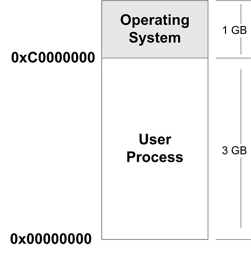

整个 4 GB 被划分成两部分，其中操作系统本身用去了一部分：从地址 0xC00000000 到 0xFFFFFFFF，共 1 GB。剩下的从 0x00000000 地址开始到 0xBFFFFFFF 共 3 GB 的空间都是留给进程使用的。那么从原则上讲，我们的进程最多可以使用 3 GB 的虚拟空间，也就是说整个进程在执行的时候，所有的代码、数据包括通过 C 语言 malloc() 等方法申请的虚拟空间之和不可以超过 3 GB。在现代的程序中，3 GB 的虚拟空间有时候是不够用的，比如一些大型的数据库系统、数值计算、图形图像处理、虚拟现实、游戏等程序需要占用的内存空间较大，这使得 32 位硬件平台的虚拟地址空间显得捉襟见肘。当然一本万利的方法就是使用 64 位处理器，把虚拟地址空间扩展到 17 179 869 184GB。当然不是人人都能顺利地更换 64 位处理器，更何况有很多现有的程序只能运行在 32 位处理器下。那么 32 位 CPU 的平台能不能使用超过 4 GB 的空间呢？这个问题我们将在后面的 "PAE" 一节中进行介绍。

不知读者是否注意到，上文提到这 3 GB 的空间 "原则上" 是可以给进程使用的，但令人遗憾的是，进程并不能完全使用这 3 GB 的虚拟空间，其中有一部分是预留给其他用途的，我们在后面还会提到

对于 Windows 操作系统来说，它的进程虚拟地址空间划分是操作系统占用 2 GB，那么进程只剩下 2 GB 空间。2 GB 空间对一些程序来说太小了，所以 Windows 有个启动参数可以将操作系统占用的虚拟地址空间减少到 1 GB，即跟 Linux 分布一样。方法如下：修改 Windows 系统盘根目录下的 Boot.ini，加上 "/3G" 参数。

```ini
[boot loader]
timeout=30
default=multi(0)disk(0)rdisk(0)partition(1)\WINDOWS
[operating systems]
multi(0)disk(0)rdisk(0)partition(1)\WINDOWS="Micr
osoft Windows XP Professional" /3G /fastdetect /N
oExecute=OptIn
```

【现在好像已经没有这个文件了，大概改名了】

### PAE

32 位的 CPU 下，程序使用的空间能不能超过 4 GB 呢？这个问题其实应该从两个角度来看，首先，问题里面的 "空间" 如果是指虚拟地址空间，那么答案是 "否"。因为 32 位的 CPU 只能使用 32 位的指针，它最大的寻址范围是 0 到 4 GB；如果问题里面的 "空间" 指计算机的内存空间，那么答案为 "是"。Intel 自从 1995 年的 Pentium ProCPU 开始采用了 36 位的物理地址，也就是可以访问高达 64 GB 的物理内存

从硬件层面上来讲，原先的 32 位地址线只能访问最多 4 GB 的物理内存。但是自从扩展至 36 位地址线之后，Intel 修改了页映射的方式，使得新的映射方式可以访问到更多的物理内存。Intel 把这个地址扩展方式叫做 PAE（Physical Address Extension）

扩展的物理地址空间对于普通应用程序是透明的，因为这主要是操作系统的事，在应用程序里，只有 32 位的虚拟地址空间。那么应用程序该如何使用这些大于常规的内存空间呢？一个很常见的方法就是操作系统提供一个窗口映射的方法，把这些额外的内存映射到进程地址空间中来。应用程序可以根据需要来选择申请和映射，比如一个应用程序中 0x10000000～0x20000000 这一段 256 MB 的虚拟地址空间用来做窗口，程序可以从高于 4 GB 的物理空间中申请多个大小为 256 MB 的物理空间，编号成 A、B、C 等，然后根据需要将这个窗口映射到不同的物理空间块，用到 A 时将 0x10000000～0x20000000 映射到 A，用到 B、C 时再映射过去，如此重复操作即可。在 Windows 下，这种访问内存的操作方式叫做 AWE（Address Windowing Extensions）；而像 Linux 等 UNIX 类操作系统则采用 mmap() 系统调用来实现

当然这只是一种补救 32 位地址空间不够大时的非常规手段，真正的解决方法还是应该使用 64 位的处理器和操作系统。这不仅使人想起了 DOS 时代 16 位地址不够用时，也采用了类似的 16 位 CPU 字长，20 位地址线长度，系统有着 640 KB、1 MB 等诸多访问限制。由于很多应用程序须访问超过 1 MB 的内存，所以当时也有很多类似 PAE 和 AWE 的方法，比如当时很著名的 XMS（eXtended Memory Specification）

Windows 下的 PAE 和 AWE 可以使用与 /3G 相似的启动选项 /PAE 和 /AWE 打开

## 6.2 装载的方式

程序执行时所需要的指令和数据必须在内存中才能够正常运行，最简单的办法就是将程序运行所需要的指令和数据全都装入内存中，这样程序就可以顺利运行，这就是最简单的静态装入的办法。但是很多情况下程序所需要的内存数量大于物理内存的数量，当内存的数量不够时，根本的解决办法就是添加内存。相对于磁盘来说，内存是昂贵且稀有的，这种情况自计算机磁盘诞生以来一直如此。所以人们想尽各种办法，希望能够在不添加内存的情况下让更多的程序运行起来，尽可能有效地利用内存。后来研究发现，程序运行时是有局部性原理的，所以我们可以将程序最常用的部分驻留在内存中，而将一些不太常用的数据存放在磁盘里面，这就是动态装入的基本原理

覆盖装入（Overlay）和页映射（Paging）是两种很典型的动态装载方法，它们所采用的思想都差不多，原则上都是利用了程序的局部性原理。动态装入的思想是程序用到哪个模块，就将哪个模块装入内存，如果不用就暂时不装入，存放在磁盘中

### 6.2.1 覆盖装入

覆盖装入在没有发明虚拟存储之前使用比较广泛，现在已经几乎被淘汰了。虽然这种方法很蹩脚，在被虚拟存储惯坏了的现代 PC 机程序员眼里可能不屑一顾，但是它在计算机发展的初期的确为程序能够在内存受限的机器下正常运行提供了一种解决方案。它所体现的一些思想还是很有意义的。值得一提的是，在一些现代嵌入式的内存受限环境下，特别是诸如 DSP 等，这种方法或许还有用武之地

覆盖装入的方法把挖掘内存潜力的任务交给了程序员，程序员在编写程序的时候必须手工将程序分割成若干块，然后编写一个小的辅助代码来管理这些模块何时应该驻留内存而何时应该被替换掉。这个小的辅助代码就是所谓的覆盖管理器（Overlay Manager）。最简单的情况下，一个程序有主模块 "main"，main 分别会调用到模块 A 和模块 B，但是 A 和 B 之间不会相互调用；这三个模块的大小分别是 1 024 字节、512 字节和 256 字节。假设不考虑内存对齐、装载地址限制的情况，理论上运行这个程序需要有 1 792 个字节的内存。如果我们采用覆盖装入的办法，那么在内存中可以这样安排，如下图

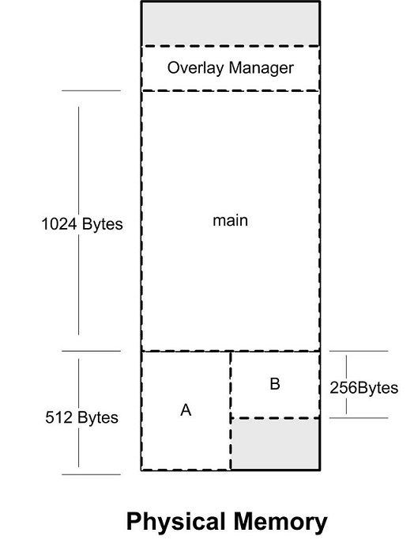

图 6-2 简单覆盖载入

由于模块 A 和模块 B 之间相互调用依赖关系，我们可以把模块 A 和模块 B 在内存中 "相互覆盖"，即两个模块共享块内存区域。当 main 模块调用模块 A 时，覆盖管理器保证将模块 A 从文件中读入内存；当模块 main 调用模块 B 时，则覆盖管理器将模块 B 从文件中读入内存，由于这时模块 A 不会被使用，那么模块 B 可以装入到原来模块 A 所占用的内存空间。很明显，除了覆盖管理器，整个程序运行只需要 1 536 个字节，比原来的方案节省了 256 字节的空间。覆盖管理器本身往往很小，从数十字节到数百字节不等，一般都常驻内存

上面的例子是最简单的覆盖情况，但是事实上程序往往不止两个模块，而模块之间的调用关系也比上面的例子要复杂。在多个模块的情况下，程序员需要手工将模块按照它们之间的调用依赖关系组织成树状结构

按照图 6-3 的组织关系，模块 main 依赖于模块 A 和 B，模块 A 依赖于 C 和 D；模块 B 依赖于 E 和 F，则它们在内存中的覆盖方式如图中所示。很明显，这个程序的运行方式与前面的例子大同小异，值得注意的是，覆盖管理器需要保证两点

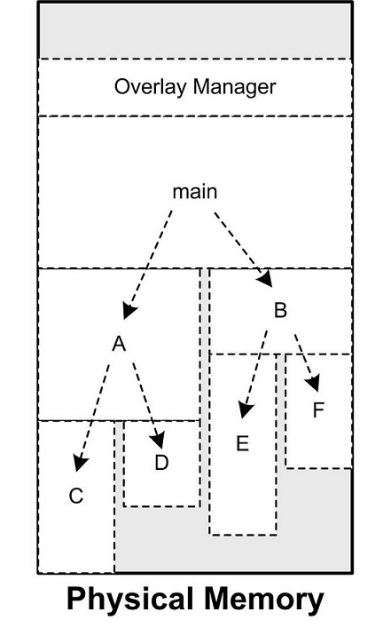

图 6-3 复杂的覆盖载入

这个树状结构中从任何一个模块到树的根（也就是 main）模块都叫调用路径。当该模块被调用时，整个调用路径上的模块必须都在内存中。比如程序正在模块 E 中执行代码，那么模块 B 和模块 main 必须都在内存中，以确保模块 E 执行完毕以后能够正确返回至模块 B 和模块 main。禁止跨树间调用。任意一个模块不允许跨过树状结构进行调用。比如上面例子中，模块 A 不可以调用模块 B、E、F；模块 C 不可以调用模块 D、B、E、F 等。因为覆盖管理器不能够保证跨树间的模块能够存在于内存中。不过很多时候可能两个子模块都需要依赖于某个模块，比如模块 E 和模块 C 都需要另外一个模块 G，那么最方便的做法是将模块 G 并入到 main 模块中，这样 G 就在 E 和 C 的调用路径上了

由于跨模块间的调用都需要经过覆盖管理器，以确保所有被调用到的模块都能够正确地驻留在内存，而且一旦模块没有在内存中，还需要从磁盘或其他存储器读取相应的模块，所以覆盖装入的速度肯定比较慢，不过这也是一种折中的方案，是典型的利用时间换取空间的方法

### 6.2.2 页映射

页映射是虚拟存储机制的一部分，它随着虚拟存储的发明而诞生。前面我们已经介绍了页映射的基本原理，这里我们再结合可执行文件的装载来阐述一下页映射是如何被应用到动态装载中去的。与覆盖装入的原理相似，页映射也不是一下子就把程序的所有数据和指令都装入内存，而是将内存和所有磁盘中的数据和指令按照 "页（Page）" 为单位划分成若干个页，以后所有的装载和操作的单位就是页。以目前的情况，硬件规定的页的大小有 4 096 字节、8 192 字节、2 MB、4 MB 等，最常见的 Intel IA32 处理器一般都使用 4 096 字节的页，那么 512 MB 的物理内存就拥有 512 * 1024 * 1024 / 4 096= 131 072 个页

为了演示页映射的基本机制，假设我们的 32 位机器有 16 KB 的内存，每个页大小为 4 096 字节，则共有 4 个页，如下表所示

| 页编号 | 地址                  |
|--------|-----------------------|
| F0     | 0X00000000-0×00000FFF |
| F1     | 0x00001000-0x00001FFF |
| F2     | 0x00002000-0×00002FFF |
| F3     | 0x00003000-0×00003FFF |

假设程序所有的指令和数据总和为 32 KB，那么程序总共被分为 8 个页。我们将它们编号为 P0～P7。很明显，16 KB 的内存无法同时将 32 KB 的程序装入，那么我们将按照动态装入的原理来进行整个装入过程。如果程序刚开始执行时的入口地址在 P0，这时装载管理器（暂时这么叫）发现程序的 P0 不在内存中，于是将内存 F0 分配给 P0，并且将 P0 的内容装入 F0；运行一段时间以后，程序需要用到 P5，于是装载管理器将 P5 装入 F1；就这样，当程序用到 P3 和 P6 的时候，它们分别被装入到了 F2 和 F3，它们的映射关系如图 6-4 所示

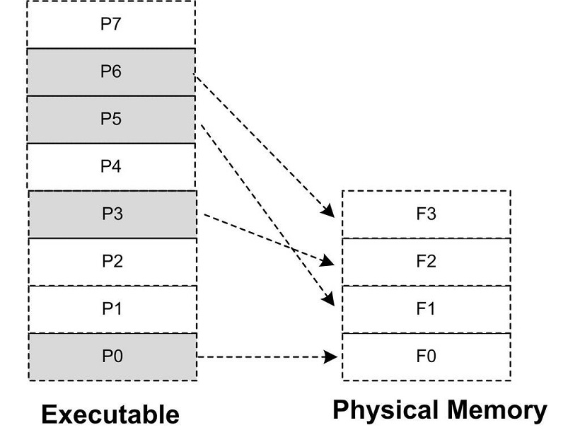

如果这时候程序只需要 P0、P3、P5 和 P6 这 4 个页，那么程序就能一直运行下去。如果这时候程序需要访问 P4，那么装载管理器必须做出抉择，它必须放弃目前正在使用的 4 个内存页中的其中一个来装载 P4。至于选择哪个页，我们有很多种算法可以选择，比如可以选择 F0，因为它是第一个被分配掉的内存页（FIFO，先进先出算法）；假设装载管理器发现 F2 很少被访问到，那么我们可以选择 F2（LUR，最少使用算法）。假设我们放弃 P0，那么这时候 F0 就装入了 P4。程序接着按照这样的方式运行

可能很多读者已经发现了，这个所谓的装载管理器就是现代的操作系统，更加准确地讲就是操作系统的存储管理器。目前几乎所有的主流操作系统都是按照这种方式装载可执行文件的，我们熟悉的 Windows 对 PE 文件的装载及 Linux 对 ELF 文件的装载都是这样完成的，接着我们将从操作系统的角度来看可执行文件的装载

## 6.3 从操作系统角度看可执行文件的装载

从上面动态装入的方式可以看到，可执行文件中的页可能被装入内存中的任意页。如果程序使用物理地址直接进行操作，那么每次页被装入时都需要进行重定位。正如我们在第 1 章中所提到的，在虚拟存储中，现代的硬件 MMU 都提供地址转换的功能。有了硬件的地址转换和页映射机制，操作系统动态加载可执行文件的方式跟静态加载有了很大的区别

### 6.3.1 进程的建立

从操作系统的角度来看，一个进程最关键的特征是它拥有独立的虚拟地址空间，这使得它有别于其他进程。很多时候一个程序被执行同时都伴随着一个新的进程的创建，那么我们就来看看这种最通常的情形：创建一个进程，然后装载相应的可执行文件并且执行。在有虚拟存储的情况下，上述过程最开始只需要做三件事情：

1. 创建一个独立的虚拟地址空间

回忆第 1 章的页映射机制，一个虚拟空间由一组页映射函数将虚拟空间的各个页映射至相应的物理空间，那么创建一个虚拟空间实际上并不是创建空间而是创建映射函数所需要的相应的数据结构，在 i386 的 Linux 下，创建虚拟地址空间实际上只是分配一个页目录（Page Directory）就可以了，甚至不设置页映射关系，这些映射关系等到后面程序发生页错误的时候再进行设置

2. 读取可执行文件头，并且建立虚拟空间与可执行文件的映射关系

上一步的页映射关系函数是虚拟空间到物理内存的映射关系，这一步所做的是虚拟空间与可执行文件的映射关系。我们知道，当程序执行发生页错误时，操作系统将从物理内存中分配一个物理页，然后将该 "缺页" 从磁盘中读取到内存中，再设置缺页的虚拟页和物理页的映射关系，这样程序才得以正常运行。但是很明显的一点是，当操作系统捕获到缺页错误时，它应知道程序当前所需要的页在可执行文件中的哪一个位置。这就是虚拟空间与可执行文件之间的映射关系。从某种角度来看，这一步是整个装载过程中最重要的一步，也是传统意义上 "装载" 的过程

由于可执行文件在装载时实际上是被映射的虚拟空间，所以可执行文件很多时候又被叫做映像文件（Image）

让我们考虑最简单的情况，假设我们的 ELF 可执行文件只有一个代码段 .text，它的虚拟地址为 0x08048000，它在文件中的大小为 0x000e1，对齐为 0x1000。由于虚拟存储的页映射都是以页为单位的，在 32 位的 Intel IA32 下一般为 4 096 字节，所以 32 位 ELF 的对齐粒度为 0x1000。由于该 .text 段大小不到一个页，考虑到对齐该段占用一个段。所以一旦该可执行文件被装载，可执行文件与执行该可执行文件进程的虚拟空间的映射关系如图 6-5 所示

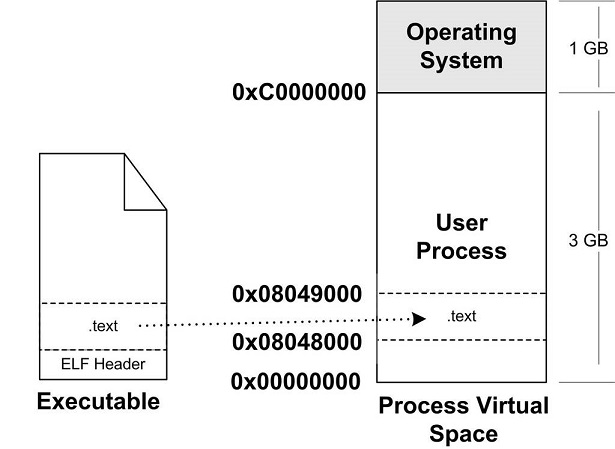

图 6-5 可执行文件与进程虚拟空间

这种映射关系只是保存在操作系统内部的一个数据结构。Linux 中将进程虚拟空间中的一个段叫做虚拟内存区域（VMA, Virtual Memory Area）；在 Windows 中将这个叫做虚拟段（Virtual Section），其实它们都是同一个概念。比如上例中，操作系统创建进程后，会在进程相应的数据结构中设置有一个 text 段的 VMA：它在虚拟空间中的地址为 0x08048000～0x08049000，它对应 ELF 文件中偏移为 0 的 .text，它的属性为只读（一般代码段都是只读的），还有一些其他的属性

上面的例子中，我们描述的是最简单的只有一个段的可执行文件映射的情况。操作系统在内部保存这种结构，很明显是因为当程序执行发生段错误时，它可以通过查找这样的一个数据结构来定位错误页在可执行文件中的位置，此内容后面会详细介绍

3. 将 CPU 的指令寄存器设置成可执行文件的入口地址，启动运行

第三步其实也是最简单的一步，操作系统通过设置 CPU 的指令寄存器将控制权转交给进程，由此进程开始执行。这一步看似简单，实际上在操作系统层面上比较复杂，它涉及内核堆栈和用户堆栈的切换、CPU 运行权限的切换。不过从进程的角度看这一步可以简单地认为操作系统执行了一条跳转指令，直接跳转到可执行文件的入口地址。还记得 ELF 文件头中保存有入口地址吗？没错，就是这个地址

### 6.3.2 页错误

上面的步骤执行完以后，其实可执行文件的真正指令和数据都没有被装入到内存中。操作系统只是通过可执行文件头部的信息建立起可执行文件和进程虚存之间的映射关系而已。假设在上面的例子中，程序的入口地址为 0x08048000，即刚好是 .text 段的起始地址。当 CPU 开始打算执行这个地址的指令时，发现页面 0x08048000～0x08049000 是个空页面，于是它就认为这是一个页错误（Page Fault）。CPU 将控制权交给操作系统，操作系统有专门的页错误处理例程来处理这种情况。这时候我们前面提到的装载过程的第二步建立的数据结构起到了很关键的作用，操作系统将查询这个数据结构，然后找到空页面所在的 VMA，计算出相应的页面在可执行文件中的偏移，然后在物理内存中分配一个物理页面，将进程中该虚拟页与分配的物理页之间建立映射关系，然后把控制权再还回给进程，进程从刚才页错误的位置重新开始执行

随着进程的执行，页错误也会不断地产生，操作系统也会为进程分配相应的物理页面来满足进程执行的需求，如图 6-6 所示。当然有可能进程所需要的内存会超过可用的内存数量，特别是在有多个进程同时执行的时候，这时候操作系统就需要精心组织和分配物理内存，甚至有时候应将分配给进程的物理内存暂时收回等，这就涉及了操作系统的虚拟存储管理

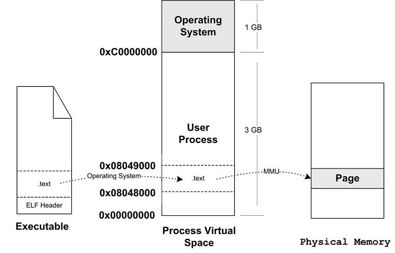

图 6-6 页错误

## 6.4 进程虚存空间分布

### 6.4.1 ELF 文件链接视图和执行视图

前面例子的可执行文件中只有一个代码段，所以它被操作系统装载至进程地址空间之后，相对应的只有一个 VMA。不过实际情况会比这复杂得多，在一个正常的进程中，可执行文件中包含的往往不止代码段，还有数据段、BSS 等，所以映射到进程虚拟空间的往往不止一个段

当段的数量增多时，就会产生空间浪费的问题。因为我们知道，ELF 文件被映射时，是以系统的页长度作为单位的，那么每个段在映射时的长度应该都是系统页长度的整数倍；如果不是，那么多余部分也将占用一个页。一个 ELF 文件中往往有十几个段，那么内存空间的浪费是可想而知的。有没有办法尽量减少这种内存浪费呢？

当我们站在操作系统装载可执行文件的角度看问题时，可以发现它实际上并不关心可执行文件各个段所包含的实际内容，操作系统只关心一些跟装载相关的问题，最主要的是段的权限（可读、可写、可执行）。ELF 文件中，段的权限往往只有为数不多的几种组合，基本上是三种：

- 以代码段为代表的权限为可读可执行的段
- 以数据段和 BSS 段为代表的权限为可读可写的段
- 以只读数据段为代表的权限为只读的段

那么我们可以找到一个很简单的方案就是：对于相同权限的段，把它们合并到一起当作一个段进行映射。比如有两个段分别叫 ".text" 和 ".init"，它们包含的分别是程序的可执行代码和初始化代码，并且它们的权限相同，都是可读并且可执行的。假设 .text 为 4 097 字节，.init 为 512 字节，这两个段分别映射的话就要占用三个页面，但是，如果将它们合并成一起映射的话只须占用两个页面，如图 6-7 所示

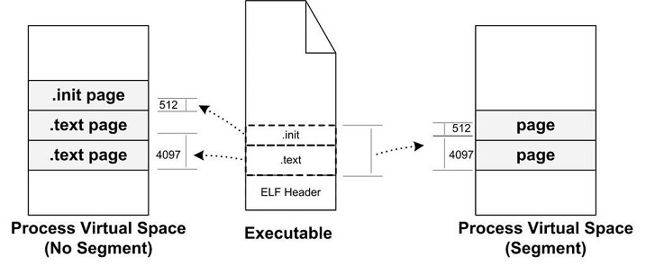

图 6-7 ELF-Segment

ELF 可执行文件引入了一个概念叫做 "Segment"，一个 "Segment" 包含一个或多个属性类似的 "Section"。正如我们上面的例子中看到的，如果将 ".text" 段和 ".init" 段合并在一起看作是一个 "Segment"，那么装载的时候就可以将它们看作一个整体一起映射，也就是说映射以后在进程虚存空间中只有一个相对应的 VMA，而不是两个，这样做的好处是可以很明显地减少页面内部碎片，从而节省了内存空间

我们很难将 "Segment" 和 "Section" 这两个词从中文的翻译上加以区分，因为很多时候 Section 也被翻译成 "段"，回顾第 2 章，我们也没有很严格区分这两个英文词汇和两个中文词汇 "段" 和 "节" 之间的相互翻译。很明显，从链接的角度看，ELF 文件是按 "Section" 存储的，事实也的确如此；从装载的角度看，ELF 文件又可以按照 "Segment" 划分。我们在这里就对 "Segment" 不作翻译，一律按照原词

"Segment" 的概念实际上是从装载的角度重新划分了 ELF 的各个段。在将目标文件链接成可执行文件的时候，链接器会尽量把相同权限属性的段分配在同一空间。比如可读可执行的段都放在一起，这种段的典型是代码段；可读可写的段都放在一起，这种段的典型是数据段。在 ELF 中把这些属性相似的、又连在一起的段叫做一个 "Segment"，而系统正是按照 "Segment" 而不是 "Section" 来映射可执行文件的

下面的例子是一个很小的程序，程序本身是不停地循环执行 "sleep" 操作，除非用户发信号给它，否则就一直运行。它的源代码如下：

```C
#include <stdlib.h>
int main() {
	while (1) {
		sleep(1000);
	}
	return 0;
}
```

我们使用静态连接的方式将其编译连接成可执行文件，然后得到的可执行文件 "SectionMapping.elf" 是一个 Linux 下很典型的可执行文件：

```bash
$gcc -static SectionMapping.c -o SectionMapping.elf
```

使用 readelf 可以看到，这个可执行文件中总共有 33 个段（Section）：

```bash
tian@node:~/Desktop/200924-test$ readelf -S SectionMapping.elf 
There are 33 section headers, starting at offset 0xcdbd0:

Section Headers:
  [Nr] Name              Type             Address           Offset
       Size              EntSize          Flags  Link  Info  Align
  [ 0]                   NULL             0000000000000000  00000000
       0000000000000000  0000000000000000           0     0     0
  [ 1] .note.ABI-tag     NOTE             0000000000400190  00000190
       0000000000000020  0000000000000000   A       0     0     4
  [ 2] .note.gnu.build-i NOTE             00000000004001b0  000001b0
       0000000000000024  0000000000000000   A       0     0     4
readelf: Warning: [ 3]: Link field (0) should index a symtab section.
  [ 3] .rela.plt         RELA             00000000004001d8  000001d8
       0000000000000228  0000000000000018  AI       0    20     8
  [ 4] .init             PROGBITS         0000000000400400  00000400
       0000000000000017  0000000000000000  AX       0     0     4
  [ 5] .plt              PROGBITS         0000000000400418  00000418
       00000000000000b8  0000000000000000  AX       0     0     8
  [ 6] .text             PROGBITS         00000000004004d0  000004d0
       000000000008f5c0  0000000000000000  AX       0     0     16
  [ 7] __libc_freeres_fn PROGBITS         000000000048fa90  0008fa90
       0000000000001523  0000000000000000  AX       0     0     16
  [ 8] __libc_thread_fre PROGBITS         0000000000490fc0  00090fc0
       000000000000108f  0000000000000000  AX       0     0     16
  [ 9] .fini             PROGBITS         0000000000492050  00092050
       0000000000000009  0000000000000000  AX       0     0     4
  [10] .rodata           PROGBITS         0000000000492060  00092060
       000000000001924c  0000000000000000   A       0     0     32
  [11] .stapsdt.base     PROGBITS         00000000004ab2ac  000ab2ac
       0000000000000001  0000000000000000   A       0     0     1
  [12] .eh_frame         PROGBITS         00000000004ab2b0  000ab2b0
       000000000000a530  0000000000000000   A       0     0     8
  [13] .gcc_except_table PROGBITS         00000000004b57e0  000b57e0
       000000000000008e  0000000000000000   A       0     0     1
  [14] .tdata            PROGBITS         00000000006b6120  000b6120
       0000000000000020  0000000000000000 WAT       0     0     8
  [15] .tbss             NOBITS           00000000006b6140  000b6140
       0000000000000040  0000000000000000 WAT       0     0     8
  [16] .init_array       INIT_ARRAY       00000000006b6140  000b6140
       0000000000000010  0000000000000008  WA       0     0     8
  [17] .fini_array       FINI_ARRAY       00000000006b6150  000b6150
       0000000000000010  0000000000000008  WA       0     0     8
  [18] .data.rel.ro      PROGBITS         00000000006b6160  000b6160
       0000000000002d94  0000000000000000  WA       0     0     32
  [19] .got              PROGBITS         00000000006b8ef8  000b8ef8
       00000000000000f8  0000000000000000  WA       0     0     8
  [20] .got.plt          PROGBITS         00000000006b9000  000b9000
       00000000000000d0  0000000000000008  WA       0     0     8
  [21] .data             PROGBITS         00000000006b90e0  000b90e0
       0000000000001af0  0000000000000000  WA       0     0     32
  [22] __libc_subfreeres PROGBITS         00000000006babd0  000babd0
       0000000000000048  0000000000000000  WA       0     0     8
  [23] __libc_IO_vtables PROGBITS         00000000006bac20  000bac20
       00000000000006a8  0000000000000000  WA       0     0     32
  [24] __libc_atexit     PROGBITS         00000000006bb2c8  000bb2c8
       0000000000000008  0000000000000000  WA       0     0     8
  [25] __libc_thread_sub PROGBITS         00000000006bb2d0  000bb2d0
       0000000000000008  0000000000000000  WA       0     0     8
  [26] .bss              NOBITS           00000000006bb2e0  000bb2d8
       00000000000016f8  0000000000000000  WA       0     0     32
  [27] __libc_freeres_pt NOBITS           00000000006bc9d8  000bb2d8
       0000000000000028  0000000000000000  WA       0     0     8
  [28] .comment          PROGBITS         0000000000000000  000bb2d8
       0000000000000029  0000000000000001  MS       0     0     1
  [29] .note.stapsdt     NOTE             0000000000000000  000bb304
       00000000000014cc  0000000000000000           0     0     4
  [30] .symtab           SYMTAB           0000000000000000  000bc7d0
       000000000000a998  0000000000000018          31   678     8
  [31] .strtab           STRTAB           0000000000000000  000c7168
       00000000000068ed  0000000000000000           0     0     1
  [32] .shstrtab         STRTAB           0000000000000000  000cda55
       0000000000000176  0000000000000000           0     0     1
Key to Flags:
  W (write), A (alloc), X (execute), M (merge), S (strings), I (info),
  L (link order), O (extra OS processing required), G (group), T (TLS),
  C (compressed), x (unknown), o (OS specific), E (exclude),
  l (large), p (processor specific)
```

我们可以使用 readelf 命令来查看 ELF 的 "Segment"。正如描述 "Section" 属性的结构叫做段表，描述 "Segment" 的结构叫程序头（Program Header），它描述了 ELF 文件该如何被操作系统映射到进程的虚拟空间：

```bash
$ readelf -l SectionMapping.elf

Elf file type is EXEC (Executable file)
Entry point 0x8048110
There are 5 program headers, starting at offset 52
Program Headers:
  Type         Offset   VirtAddr   PhysAddr  FileSiz MemSiz  Flg Align
  LOAD        0x000000 0x08048000 0x08048000 0x709e5 0x709e5 R E 0x1000
  LOAD        0x0709e8 0x080b99e8 0x080b99e8 0x00798 0x02280 RW  0x1000
  NOTE        0x0000d4 0x080480d4 0x080480d4 0x00020 0x00020 R   0x4
  TLS         0x0709e8 0x080b99e8 0x080b99e8 0x00010 0x00028 R   0x4
  GNU_STACK   0x000000 0x00000000 0x00000000 0x00000 0x00000 RW  0x4
 Section to Segment mapping:
  Segment Sections...
   00     .note.ABI-tag .init .text __libc_freeres_fn .fini .rodata __libc_subfreeres __libc_atexit .eh_frame .gcc_except_table
   01     .tdata .ctors .dtors .jcr .data.rel.ro .got .got.plt .data .bss __libc_freeres_ptrs
   02     .note.ABI-tag
   03     .tdata .tbss
   04
```

我们可以看到，这个可执行文件中共有 5 个 Segment。从装载的角度看，我们目前只关心两个 "LOAD" 类型的 Segment，因为只有它是需要被映射的，其他的诸如 "NOTE"、"TLS"、"GNU_STACK" 都是在装载时起辅助作用的，我们在这里不详细展开。可以用图 6-8 来表示 "SectionMapping.elf" 可执行文件的段与进程虚拟空间的映射关系

所以总的来说，"Segment" 和 "Section" 是从不同的角度来划分同一个 ELF 文件。这个在 ELF 中被称为不同的视图（View），从 "Section" 的角度来看 ELF 文件就是链接视图（Linking View），从 "Segment" 的角度来看就是执行视图（Execution View）。当我们在谈到 ELF 装载时，"段" 专门指 "Segment"；而在其他的情况下，"段" 指的是 "Section"

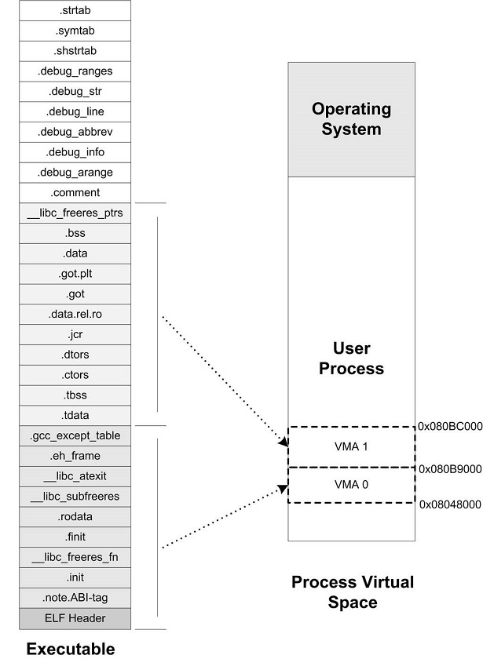

ELF 可执行文件中有一个专门的数据结构叫做程序头表（Program Header Table）用来保存 "Segment" 的信息。因为 ELF 目标文件不需要被装载，所以它没有程序头表，而 ELF 的可执行文件和共享库文件都有。跟段表结构一样，程序头表也是一个结构体数组，它的结构体如下：

```C
typedef struct {
	Elf32_Word p_type;
	Elf32_Off p_offset;
	Elf32_Addr p_vaddr;
	Elf32_Addr p_paddr;
	Elf32_Word p_filesz;
	Elf32_Word p_memsz;
	Elf32_Word p_flags;
	Elf32_Word p_align;
} Elf32_Phdr;
```

Elf32_Phdr 结构体的几个成员与前面我们使用 "readelf –l" 打印文件头表显示的结果一一对应。我们来看 Elf32_Phdr 结构的各个成员的基本含义，如表 6-2 所示

表 6-2

| 成员 | 含义 |
|-|-|
| p_type | "Segment" 的类型，基本上我们在这里只关注 "LOAD" 类型的 "Segment。"LOAD" 类型的常量为 1。还有几个类型诸如 "DYNAMIC、"INTERP" 等我们在介绍 ELF 动态链接时还会碰到 |
| p_offset | "Segment" 在文件中的偏移 |
| p_vaddr | "segment" 的第一个字节在进程虚拟地址空间的起始位置。整个程序头表中，所有 "LOAD"类型的元素按照 p_vaddr 从小到大排列 |
| p_paddr | "Segment" 的物理装载地址，我们在本书的第 2 部分已经碰到过一个叫做 LMA（Load Memory Address）的概念，这个物理装载地址就是 LMA。p_paddr 的值在一般情况下跟 p_vaddr 是一样的 |
| p_filesz | "Segment" 在 ELF 文件中所占空间的长度。它的值可能是 0，因为有可能这个 "Segment" 在 ELF 文件中不存在内容 |
| p_memse | "Segment" 在进程虚拟地址间中所占用的长度。它的值也可能是 0 |
| p_flags | "Segment" 的权限属性，比如可读 "R"、可写 "W" 和可执行 "X" |
| p-align | "Segment" 的对齐属性。实际对齐字节等于 2 的 p_align 次。比如 p_align 等于 10，那么实际的对齐属性就是 2 的 10 次方，即 1024 字节 |

对于 "LOAD" 类型的 "Segment" 来说，p_memsz 的值不可以小于 p_filesz，否则就是不符合常理的。但是，如果 p_memsz 的值大于 p_filesz 又是什么意思呢？如果 p_memsz 大于 p_filesz，就表示该 "Segment" 在内存中所分配的空间大小超过文件中实际的大小，这部分 "多余" 的部分则全部填充为 "0"。这样做的好处是，我们在构造 ELF 可执行文件时不需要再额外设立 BSS 的 "Segment" 了，可以把数据 "Segment" 的 p_memsz 扩大，那些额外的部分就是 BSS。因为数据段和 BSS 的唯一区别就是：数据段从文件中初始化内容，而 BSS 段的内容全都初始化为 0。这也就是我们在前面的例子中只看到了两个 "LOAD" 类型的段，而不是三个，BSS 已经被合并到了数据类型的段里面

### 6.4.2 堆和栈

在操作系统里面，VMA 除了被用来映射可执行文件中的各个 "Segment" 以外，它还可以有其他的作用，操作系统通过使用 VMA 来对进程的地址空间进行管理。我们知道进程在执行的时候它还需要用到栈（Stack）、堆（Heap）等空间，事实上它们在进程的虚拟空间中的表现也是以 VMA 的形式存在的，很多情况下，一个进程中的栈和堆分别都有一个对应的 VMA。在 Linux 下，我们可以通过查看 "/proc" 来查看进程的虚拟空间分布：

```bash
$ ./SectionMapping.elf &
[1] 21963
$ cat /proc/21963/maps
08048000-080b9000 r-xp 00000000 08:01 2801887    ./SectionMapping.elf
080b9000-080bb000 rwxp 00070000 08:01 2801887    ./SectionMapping.elf
080bb000-080de000 rwxp 080bb000 00:00 0          [heap]
bf7ec000-bf802000 rw-p bf7ec000 00:00 0          [stack]
ffffe000-fffff000 r-xp 00000000 00:00 0          [vdso]
```

上面的输出结果中：第一列是 VMA 的地址范围；第二列是 VMA 的权限，"r" 表示可读，"w" 表示可写，"x" 表示可执行，"p" 表示私有（COW, Copy on Write），"s" 表示共享。第三列是偏移，表示 VMA 对应的 Segment 在映像文件中的偏移；第四列表示映像文件所在设备的主设备号和次设备号；第五列表示映像文件的节点号。最后一列是映像文件的路径

我们可以看到进程中有 5 个 VMA，只有前两个是映射到可执行文件中的两个 Segment。另外三个段的文件所在设备主设备号和次设备号及文件节点号都是 0，则表示它们没有映射到文件中，这种 VMA 叫做匿名虚拟内存区域（Anonymous Virtual Memory Area）。我们可以看到有两个区域分别是堆（Heap）和栈（Stack），它们的大小分别为 140 KB 和 88 KB。这两个 VMA 几乎在所有的进程中存在，我们在 C 语言程序里面最常用的 malloc() 内存分配函数就是从堆里面分配的，堆由系统库管理，我们在第 10 章会详细介绍关于堆的内容。栈一般也叫做堆栈，我们知道每个线程都有属于自己的堆栈，对于单线程的程序来讲，这个 VMA 堆栈就全都归它使用。另外有一个很特殊的 VMA 叫做 "vdso"，它的地址已经位于内核空间了（即大于 0xC0000000 的地址），事实上它是一个内核的模块，进程可以通过访问这个 VMA 来跟内核进行一些通信，这里我们就不具体展开了，有兴趣的读者可以去参考一些关于 Linux 内核模块的资料

通过上面的例子，让我们小结关于进程虚拟地址空间的概念：操作系统通过给进程空间划分出一个个 VMA 来管理进程的虚拟空间；基本原则是将相同权限属性的、有相同映像文件的映射成一个 VMA；一个进程基本上可以分为如下几种 VMA 区域：

- 代码 VMA，权限只读、可执行；有映像文件
- 数据 VMA，权限可读写、可执行；有映像文件
- 堆 VMA，权限可读写、可执行；无映像文件，匿名，可向上扩展
- 栈 VMA，权限可读写、不可执行；无映像文件，匿名，可向下扩展

当我们在讨论进程虚拟空间的 "Segment" 的时候，基本上就是指上面的几种 VMA。现在再让我们来看一个常见进程的虚拟空间是怎么样的，如图 6-9 所示

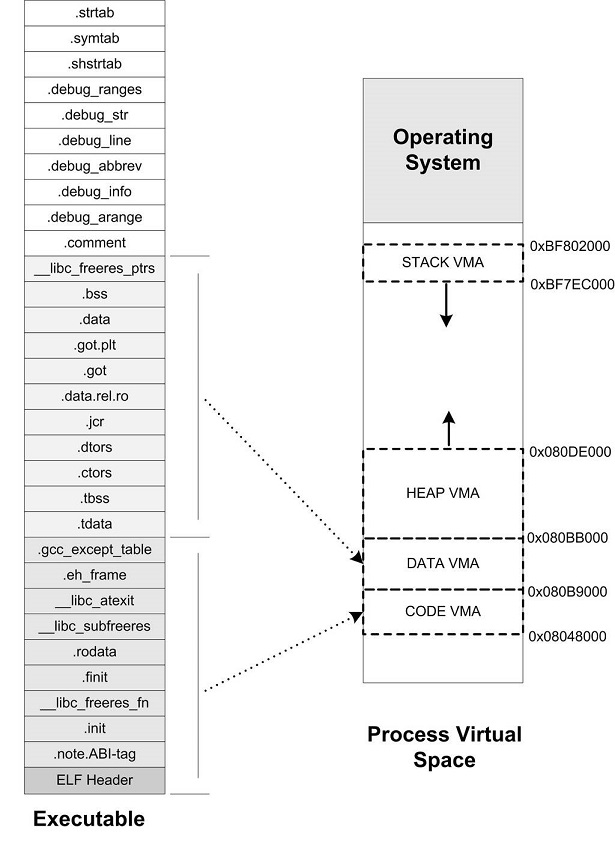

细心的读者可能已经发现，我们在 Linux 的 "/proc" 目录里面看到的 VMA2 的结束地址跟原先预测的不一样，按照计算应该是 0x080bc000，但实际上显示出来的是 0x080bb000。这是怎么回事呢？这是因为 Linux 在装载 ELF 文件时实现了一种 "Hack" 的做法，因为 Linux 的进程虚拟空间管理的 VMA 的概念并非与 "Segment" 完全对应，Linux 规定一个 VMA 可以映射到某个文件的一个区域，或者是没有映射到任何文件；而我们这里的第二个 "Segment" 要求是，前面部分映射到文件中，而后面一部分不映射到任何文件，直接为 0，也就是说前面的从 ".tdata" 段到 ".data" 段部分要建立从虚拟空间到文件的映射，而 ".bss" 和 "`__libcfreeres_ptrs`" 部分不要映射到文件。这样这两个概念就不完全相同了，所以 Linux 实际上采用了一种取巧的办法，它在映射完第二个 "Segment" 之后，把最后一个页面的剩余部分清 0，然后调用内核中的 do_brk()，把 ".bss" 和 "`__libcfreeres_ptrs`" 的剩余部分放到堆段中。不过这种具体实现问题中的细节不是很关键，有兴趣的读者可以阅读位于 Linux 内核源代码 "fs/Binfmt_elf.c" 中的 "load_elf_interp()" 和 "elf_map()" 两个函数

【大概算一下，不知道对不对，0x02280/0x1000 = 3，3 * 0x1000 + 0x080b9000 = 0x080bc000，0x02280 见上面 readelf -l SectionMapping.elf】

### 6.4.3 堆的最大申请数量

Linux 下虚拟地址空间分给进程本身的是 3GB（Windows 默认是 2GB），那么程序真正可以用到的有多少呢？我们知道，一般程序中使用 malloc() 函数进行地址空间的申请，那么 malloc() 到底最大可以申请多少内存呢？用下面这个小程序可以测试 malloc 最大内存申请数量：

```C
#include <stdio.h>
#include <stdlib.h>
unsigned maximum = 0;
int main(int argc, char *argv[]) {
	unsigned blocksize[] = { 1024 * 1024, 1024, 1};
	int i, count;
	for (i = 0; i < 3; i++) {
		for (count = 1;; count++) {
			void *block = malloc( maximum + blocksize[i] * count);
			if (block) {
				maximum = maximum + blocksize[i] * count;
				free(block);
			} else {
				break;
			}
		}
	}
	printf("maximum malloc size = %u bytes\n", maximum);
}
```

在我的 Linux 机器上，运行上面这个程序的结果大概是 2.9 GB 左右的空间；在 Windows 下运行这个程序的结果大概是 1.5 GB。那么 malloc 的最大申请数量会受到哪些因素的影响呢？实际上，具体的数值会受到操作系统版本、程序本身大小、用到的动态/共享库数量、大小、程序栈数量、大小等，甚至有可能每次运行的结果都会不同，因为有些操作系统使用了一种叫做随机地址空间分布的技术（主要是出于安全考虑，防止程序受恶意攻击），使得进程的堆空间变小。关于进程的堆的相关内容，在本书的第 4 部分还会详细介绍

### 6.4.4 段地址对齐

可执行文件最终是要被操作系统装载运行的，这个装载的过程一般是通过虚拟内存的页映射机制完成的。在映射过程中，页是映射的最小单位。对于 Intel 80x86 系列处理器来说，默认的页大小为 4 096 字节，也就是说，我们要映射将一段物理内存和进程虚拟地址空间之间建立映射关系，这段内存空间的长度必须是 4 096 的整数倍，并且这段空间在物理内存和进程虚拟地址空间中的起始地址必须是 4 096 的整数倍。由于有着长度和起始地址的限制，对于可执行文件来说，它应该尽量地优化自己的空间和地址的安排，以节省空间。我们就拿下面这个例子来看看，可执行文件在页映射机制中如何节省空间。假设我们有一个 ELF 可执行文件，它有三个段（Segment）需要装载，我们将它们命名为 SEG0、SEG1 和 SEG2。每个段的长度、在文件中的偏移如表 6-3 所示

表 6-3

| 段   | 长度（字节）  | 偏移（字节）  | 权限       |
|------|--------------|--------------|-----------|
| SEG0 | 127          | 34           | 可读可执行 |
| SEG1 | 9899         | 164          | 可读可写   |
| SEG2 | 1988         |              | 只读      |

这是很常见的一种情况，就是每个段的长度都不是页长度的整数倍，一种最简单的映射办法就是每个段分开映射，对于长度不足一个页的部分则占一个页。通常 ELF 可执行文件的起始虚拟地址为 0x08048000，那么按照这样的映射方式，该 ELF 文件中的各个段的虚拟地址和长度如表 6-4 所示

| 段   | 起始虚拟地址 | 大小   | 有效字节 | 偏移（字节） | 权限       |
|------|--------------|--------|----------|--------------|------------|
| SEG0 | 0X08048000   | 0x1000 | 127      | 34           | 可读可执行 |
| SEG1 | 0808049000   | 0x3000 | 9899     | 164          | 可读可写   |
| SEG2 | 0X0804C000   | 0x1000 | 1988     |              | 只读       |

可以看到这种对齐方式在文件段的内部会有很多内部碎片，浪费磁盘空间。整个可执行文件的三个段的总长度只有 12 014 字节，却占据了 5 个页，即 20 480 字节，空间使用率只有 58.6%

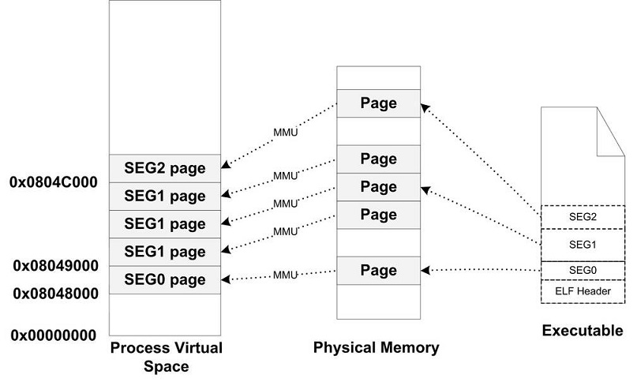

图 6-10 可执行文件段未合并情况

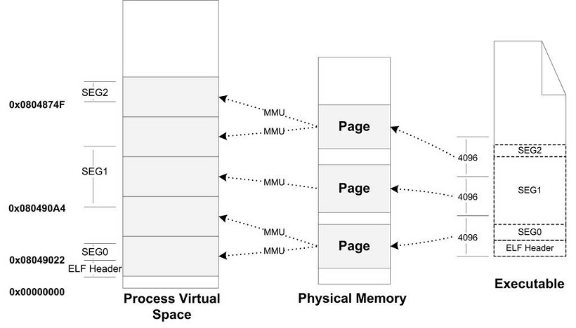

图 6-11 ELF 文件段合并情况

为了解决这种问题，有些 UNIX 系统采用了一个很取巧的办法，就是让那些各个段接壤部分共享一个物理页面，然后将该物理页面分别映射两次（见图 6-11）。比如对于 SEG0 和 SEG1 的接壤部分的那个物理页，系统将它们映射两份到虚拟地址空间，一份为 SEG0，另外一份为 SEG1，其他的页都按照正常的页粒度进行映射。而且 UNIX 系统将 ELF 的文件头也看作是系统的一个段，将其映射到进程的地址空间，这样做的好处是进程中的某一段区域就是整个 ELF 文件的映像，对于一些须访问 ELF 文件头的操作（比如动态链接器就须读取 ELF 文件头）可以直接通过读写内存地址空间进行。从某种角度看，好像是整个 ELF 文件从文件最开始到某个点结束，被逻辑上分成了以 4 096 字节为单位的若干个块，每个块都被装载到物理内存中，对于那些位于两个段中间的块，它们将会被映射两次。现在让我们来看看在这种方法下，上面例子中 ELF 文件的映射方式如表 6-5 所示

表 6-5

| 段   | 起始虚拟地址 | 大小 | 偏移 | 权限       |
|------|--------------|------|------|------------|
| SEG0 | 0x08048022   | 127  | 34   | 可读可执行 |
| SEG1 | 0x080490A4   | 9899 | 164  | 可读可写   |
| SEG2 | 0x0804C74F   | 1988 | 0    | 可读可     |

在这种情况下，内存空间得到了充分的利用，我们可以看到，本来要用到 5 个物理页面，也就是 20 480 字节的内存，现在只有 3 个页面，即 12 288 字节。这种映射方式下，对于一个物理页面来说，它可能同时包含了两个段的数据，甚至可能是多于两个段，比如文件头、代码段、数据段和 BSS 段的长度加起来都没超过 4 096 字节，那么一个物理页面可能包含文件头、代码段、数据段和 BSS 段（见图 6-11）

因为段地址对齐的关系，各个段的虚拟地址就往往不是系统页面长度的整数倍了，有兴趣的读者也可以结合前面的例子思考一下，这些虚拟地址是怎么计算出来的。比如我们拿前面的程序 "SectionMapping.elf" 做例子，看看各个段的虚拟地址是怎么计算出来的。为什么 VMA1 的起始地址是 0x080B99E8？而不是 0x080B89E8 或干脆是 0x080B9000？

VMA0 的起始地址是 0x08048000，长度是 0x709E5，所以它的结束地址是 0x080B89E5。而 VMA1 因为跟 VMA0 的最后一个虚拟页面共享一个物理页面，并且映射两遍，所以它的虚拟地址应该是 0x080B99E5，又因为段必须是 4 字节的倍数，则向上取整至 0x080B99E8

根据上面的段对齐方案，由此我们可以推算出一个规律那就是，在 ELF 文件中，对于任何一个可装载的 "Segment"，它的 p_vaddr 除以对齐属性的余数等于 p_offset 除以对齐属性的余数。比如前面例子中，第二个 "Segment" 的 p_vaddr 为 0x080b99e8，对齐属性为 0x1000 字节，所以 0x080b99e8 % 0x1000 = 0x9e8；而 p_offset 为 0x0709e8，所以 0x0709e8 % 0x1000 = 0x9e8。如何能推导出这条规律？请有兴趣的读者对照前面的对齐规则计算一下应该很快能得出结论

### 6.4.5 进程栈初始化

我们知道进程刚开始启动的时候，须知道一些进程运行的环境，最基本的就是系统环境变量和进程的运行参数。很常见的一种做法是操作系统在进程启动前将这些信息提前保存到进程的虚拟空间的栈中（也就是 VMA 中的 Stack VMA）。让我们来看看 Linux 的进程初始化后栈的结构，我们假设系统中有两个环境变量：

```bash
HOME=/home/user
PATH=/usr/bin
```

比如我们运行该程序的命令行是：

```bash
$ prog 123
```

并且我们假设堆栈段底部地址为 0xBF802000，那么进程初始化后的堆栈就如图 6-12 所示

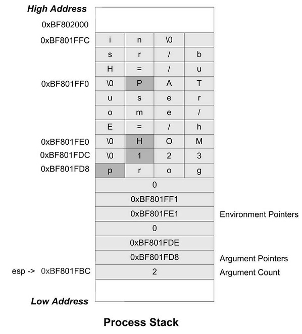

图6 -12 Linux 进程初始堆栈

栈顶寄存器 esp 指向的位置是初始化以后堆栈的顶部，最前面的 4 个字节表示命令行参数的数量，我们的例子里面是两个，即 "prog" 和 "123"，紧接的就是分布指向这两个参数字符串的指针；后面跟了一个 0；接着是两个指向环境变量字符串的指针，它们分别指向字符串 "HOME=/home/user" 和 "PATH=/usr/bin"；后面紧跟一个 0 表示结束。进程在启动以后，程序的库部分会把堆栈里的初始化信息中的参数信息传递给 main() 函数，也就是我们熟知的 main() 函数的两个 argc 和 argv 两个参数，这两个参数分别对应这里的命令行参数数量和命令行参数字符串指针数组

## 6.5 Linux 内核装载 ELF 过程简介

当我们在 Linux 系统的 bash 下输入一个命令执行某个 ELF 程序时，Linux 系统是怎样装载这个 ELF 文件并且执行它的呢？

首先在用户层面，bash 进程会调用 fork() 系统调用创建一个新的进程，然后新的进程调用 execve() 系统调用执行指定的 ELF 文件，原先的 bash 进程继续返回等待刚才启动的新进程结束，然后继续等待用户输入命令。execve() 系统调用被定义在 unistd.h，它的原型如下：

```C
int execve(const char *filename, char *const argv[], char *const envp[]);
```

它的三个参数分别是被执行的程序文件名、执行参数和环境变量。Glibc 对 execvp() 系统调用进行了包装，提供了 execl()、execlp()、execle()、execv() 和 execvp() 等 5 个不同形式的 exec 系列 API，它们只是在调用的参数形式上有所区别，但最终都会调用到 execve() 这个系统中。下面是一个简单的使用 fork() 和 execlp() 实现的 minibash：

```C
#include <stdio.h>
#include <sys/types.h>
#include <unistd.h>
int main() {
	char buf[1024] = {0};
	pid_t pid;
	while (1) {
		printf("minibash$ ");
		scanf("%s", buf);
		pid = fork();
		if (pid == 0) {
			if (execlp(buf, 0) < 0) {
				printf("exec error\n");
			}
		} else if (pid > 0) {
			int status;
			waitpid(pid, &status, 0);
		} else {
			printf("fork error %d\n", pid);
		}
	}
	return 0;
}
```

在进入 execve() 系统调用之后，Linux 内核就开始进行真正的装载工作。在内核中，execve() 系统调用相应的入口是 sys_execve()，它被定义在 `arch\i386\kernel\Process.c`。sys_execve() 进行一些参数的检查复制之后，调用 do_execve()。do_execve() 会首先查找被执行的文件，如果找到文件，则读取文件的前 128 个字节。为什么要这么做呢？因为我们知道，Linux 支持的可执行文件不止 ELF 一种，还有 a.out、Java 程序和以 "#!" 开始的脚本程序。Linux 还可以支持更多的可执行文件格式，如果某一天 Linux 须支持 Windows PE 的可执行文件格式，那么我们可以编写一个支持 PE 装载的内核模块来实现 Linux 对 PE 文件的支持。这里 do_execve() 读取文件的前 128 个字节的目的是判断文件的格式，每种可执行文件的格式的开头几个字节都是很特殊的，特别是开头 4 个字节，常常被称做魔数（Magic Number），通过对魔数的判断可以确定文件的格式和类型。比如 ELF 的可执行文件格式的头 4 个字节为 0x7F、'e'、'l'、'f'；而 Java 的可执行文件格式的头 4 个字节为'c'、'a'、'f'、'e'；如果被执行的是 Shell 脚本或 perl、python 等这种解释型语言的脚本，那么它的第一行往往是 "#!/bin/sh" 或 "#!/usr/bin/perl" 或 "#!/usr/bin/python"，这时候前两个字节 '#' 和 '!' 就构成了魔数，系统一旦判断到这两个字节，就对后面的字符串进行解析，以确定具体的解释程序的路径

当 do_execve() 读取了这 128 个字节的文件头部之后，然后调用 search_binary_handle() 去搜索和匹配合适的可执行文件装载处理过程。Linux 中所有被支持的可执行文件格式都有相应的装载处理过程，search_binary_handle() 会通过判断文件头部的魔数确定文件的格式，并且调用相应的装载处理过程。比如 ELF 可执行文件的装载处理过程叫做 load_elf_binary()；a.out 可执行文件的装载处理过程叫做 load_aout_binary()；而装载可执行脚本程序的处理过程叫做 load_script()。这里我们只关心 ELF 可执行文件的装载，load_elf_binary() 被定义在 `fs/Binfmt_elf.c`，这个函数的代码比较长，它的主要步骤是：


1. 检查 ELF 可执行文件格式的有效性，比如魔数、程序头表中段（Segment）的数量
2. 寻找动态链接的 ".interp" 段，设置动态链接器路径（与动态链接有关，具体请参考第 9 章）
3. 根据 ELF 可执行文件的程序头表的描述，对 ELF 文件进行映射，比如代码、数据、只读数据
4. 初始化 ELF 进程环境，比如进程启动时 EDX 寄存器的地址应该是 DT_FINI 的地址（参照动态链接）
5. 将系统调用的返回地址修改成 ELF 可执行文件的入口点，这个入口点取决于程序的链接方式，对于静态链接的 ELF 可执行文件，这个程序入口就是 ELF 文件的文件头中 e_entry 所指的地址；对于动态链接的 ELF 可执行文件，程序入口点是动态链接器

当 load_elf_binary() 执行完毕，返回至 do_execve() 再返回至 sys_execve() 时，上面的第 5 步中已经把系统调用的返回地址改成了被装载的 ELF 程序的入口地址了。所以当 sys_execve() 系统调用从内核态返回到用户态时，EIP 寄存器直接跳转到了 ELF 程序的入口地址，于是新的程序开始执行，ELF 可执行文件装载完成

## 6.6 Windows PE 的装载

PE 文件的装载跟 ELF 有所不同，由于 PE 文件中，所有段的起始地址都是页的倍数，段的长度如果不是页的整数倍，那么在映射时向上补齐到页的整数倍，我们也可以简单地认为在 32 位的 PE 文件中，段的起始地址和长度都是 4 096 字节的整数倍。由于这个特点，PE 文件的映射过程会比 ELF 简单得多，因为它无须考虑如 ELF 里面诸多段地址对齐之类的问题，虽然这样会浪费一些磁盘和内存空间。PE 可执行文件的段的数量一般很少，不像 ELF 中经常有十多个 “Section”，最后不得不使用 “Segment” 的概念把它们合并到一起装载，PE 文件中，链接器在生产可执行文件时，往往将所有的段尽可能地合并，所以一般只有代码段、数据段、只读数据段和 BSS 等为数不多的几个段

在讨论结构的具体装载过程之前，我们要先引入一个 PE 里面很常见的术语叫做 RVA（Relative Virtual Address），它表示一个相对虚拟地址。这个术语看起来比较晦涩难懂，其实它的概念很简单，就是相当于文件中的偏移量的东西。它是相对于 PE 文件的装载基地址的一个偏移地址。比如，一个 PE 文件被装载到虚拟地址（VA）0x00400000，那么一个 RVA 为 0x1000 的地址就是 0x00401000。每个 PE 文件在装载时都会有一个装载目标地址（Target Address），这个地址就是所谓的基地址（Base Address）。由于 PE 文件被设计成可以装载到任何地址，所以这个基地址并不是固定的，每次装载时都可能会变化。如果 PE 文件中的地址都使用绝对地址，它们都要随着基地址的变化而变化。但是，如果使用 RVA 这样一种基于基地址的相对地址，那么无论基地址怎么变化，PE 文件中的各个 RVA 都保持一致。这里涉及 PE 可执行文件装载的一些内容，我们只是简单介绍一下，更加详细的内容将留到本书后面有关 PE 文件的 Rebasing 机制时再进行分析

装载一个 PE 可执行文件并且装载它，是个比 ELF 文件相对简单的过程：

- 先读取文件的第一个页，在这个页中，包含了 DOS 头、PE 文件头和段表
- 检查进程地址空间中，目标地址是否可用，如果不可用，则另外选一个装载地址。这个问题对于可执行文件来说基本不存在，因为它往往是进程第一个装入的模块，所以目标地址不太可能被占用。主要是针对 DLL 文件的装载而言的，我们在后面的 “Rebasing” 这一节还会具体介绍这个问题
- 使用段表中提供的信息，将 PE 文件中所有的段一一映射到地址空间中相应的位置
- 如果装载地址不是目标地址，则进行 Rebasing
- 装载所有 PE 文件所需要的 DLL 文件
- 对 PE 文件中的所有导入符号进行解析
- 根据 PE 头中指定的参数，建立初始化栈和堆
- 建立主线程并且启动进程

PE 文件中，与装载相关的主要信息都包含在 PE 扩展头（PE OptionalHeader）和段表，我们在第 2 部分已经介绍过了 PE 扩展头部分结构，这里我们将选择几个跟装载相关的成员来分析它们的含义（见表 6-6），当然还有一部分成员是跟进程初始化和运行库有关的，我们把它们留到本书的第 4 部分介绍

表 6-6

| 成员 | 含义 |
|-|-|
| Image Base | PE 文件的优先装载地址。比如，如果该值是 0x00400000，PE 装载器将尝试把文件装到虚拟地址空间的 0x00400000 处。若该地址区域已被其他目标文件占用，那 PE 装载器会选用其他空闲地址。对于可知文件来说，它一般是 0×00400000，对于 DLL 来说它一般是 0x10000000 |
| AddressOfEntryPoint | PE 装载器准备运行的 PE 文件的第一个指合的 RVA。如果我们需要改变整个执行的流程，可以将该值指定到新的 RVA，这样当 PE 文件被开始执行时，会从新 RVA 处的指合首先被执行。这经常是一些病毒感染 PE 文件后所做的第一件事 |
| SectionAlignment | 内存中段对齐的粒度。默认情况下一般是系统页面的大小，x86 下是 4096 字节 |
| FileAlignment | 文件中段对齐的粒度。这个值必须是 2 的指数倍从 512 到 64KB。默认一般是 512 字节 |
| MajorSubsystemVersion MinorSubsystemVersion | 程序运行所需要的 Win32 子系统版本。我们在本书的后面章节还会介绍 Windows 子系统相关内容 |
| SizeOflmage | 内存中整个 PE 映像体的尺寸。它是所有头和节经过节对齐处理后的大小 |
| SizeOfHeaders | 所有头 + 节表的大小，也就是等于文件尺寸减去文件中所有节的尺寸。可以以此值作为 PE 文件第一节的文件偏移量 |
| Subsystem | NT 用来识别 PE 文件属于哪个子系统。对于大多数 Win32 程序，只有两类值：Windows GUI 和 Windows CUI（控制台） |
| SizeOfCode | 代码段的长度 |
| SizeOflnitializedData | 初始化了的数据段长度 |
| SizeOfUninitializedData | 未初始化的数据段长度 |
| BaseOfCode | 代码段起始 RVA |
| BaseOfData | 数据段起始 RVA |

## 6.7 本章小结

在这一章中，我们探讨了程序运行时如何使用内存空间的问题，即进程虚拟地址空间问题。接着我们围绕程序如何被操作系统装载到内存中进行运行，介绍了覆盖装入和页映射的模式，分析了为什么要以页映射的方式将程序映射至进程地址空间，这样做的好处是什么，并从操作系统的角度观察进程如何被建立，当程序开始运行时发生页错误该如何处理等

我们还详细介绍了进程虚拟地址空间的分布，操作系统如何为程序的代码、数据、堆、栈在进程地址空间中分配，它们是如何分布的。最后两个章节我们分别深入介绍了 Linux 和 Windows 程序如何装载并且运行 ELF 和 PE 程序。在这一章中，我们假设程序都是静态链接的，那么它们都只有一个单独的可执行文件模块。下一章中我们将介绍一种与静态链接程序不同的概念，即一个单一的可执行文件模块被拆分成若干个模块，在程序运行时进行链接的一种方式