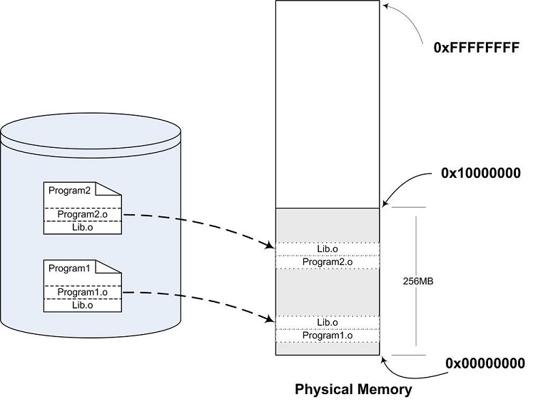
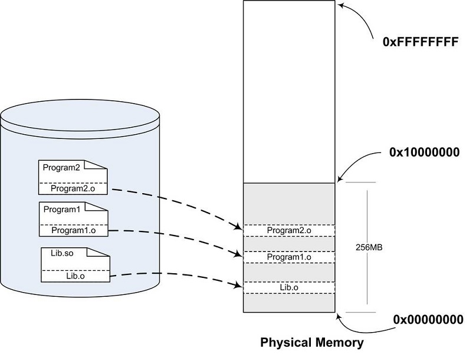
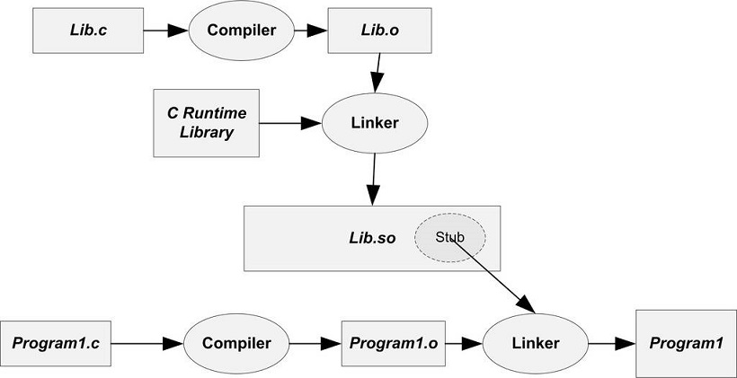
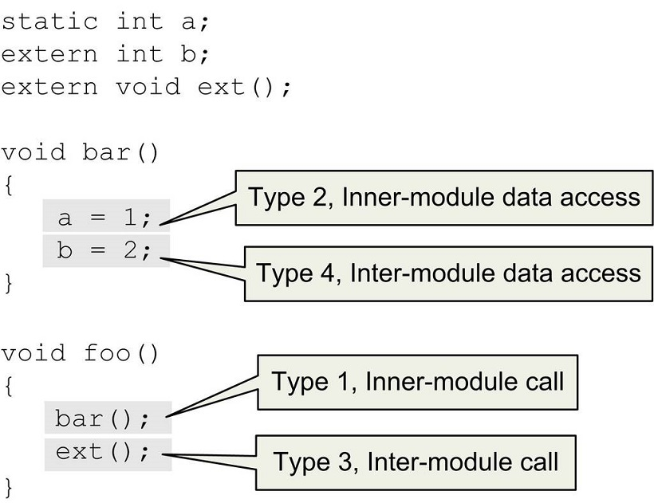

> @Date    : 2020-09-24 21:48:39
>
> @Author  : Lewis Tian (taseikyo@gmail.com)
>
> @Link    : github.com/taseikyo

# 动态链接

## 7.1 为什么要动态链接

静态链接使得不同的程序开发者和部门能够相对独立地开发和测试自己的程序模块，从某种意义上来讲大大促进了程序开发的效率，原先限制程序的规模也随之扩大。但是慢慢地静态链接的诸多缺点也逐步暴露出来，比如浪费内存和磁盘空间、模块更新困难等问题，使得人们不得不寻找一种更好的方式来组织程序的模块。

### 内存和磁盘空间

静态链接这种方法的确很简单，原理上很容易理解，实践上不难实现，在操作系统和硬件不发达的早期，绝大部分系统采用这种方案。随着计算机软件的发展，这种方法的缺点很快就暴露出来了，那就是静态连接的方式对于计算机内存和磁盘的空间浪费非常严重。特别是多进程操作系统情况下，静态链接极大地浪费了内存空间，想象一下每个程序内部除了都保留着 printf() 函数、scanf() 函数、strlen() 等这样的公用库函数，还有数量相当可观的其他库函数及它们所需要的辅助数据结构。在现在的 Linux 系统中，一个普通程序会使用到的 C 语言静态库至少在 1 MB 以上，那么，如果我们的机器中运行着 100 个这样的程序，就要浪费近 100 MB 的内存；如果磁盘中有 2 000 个这样的程序，就要浪费近 2 GB 的磁盘空间，很多 Linux 的机器中，/usr/bin 下就有数千个可执行文件。



比如图 7-1 所示的 Program1 和 Program2 分别包含 Program1.o 和 Program2.o 两个模块，并且它们还共用 Lib.o 这两模块。在静态连接的情况下，因为 Program1 和 Program2 都用到了 Lib.o 这个模块，所以它们同时在链接输出的可执行文件 Program1 和 Program2 有两个副本。当我们同时运行 Program1 和 Program2 时，Lib.o 在磁盘中和内存中都有两份副本。当系统中存在大量的类似于 Lib.o 的被多个程序共享的目标文件时，其中很大一部分空间就被浪费了。在静态链接中，C 语言静态库是很典型的浪费空间的例子，还有其他数以千计的库如果都需要静态链接，那么空间浪费无法想象


### 程序开发和发布

空间浪费是静态链接的一个问题，另一个问题是静态链接对程序的更新、部署和发布也会带来很多麻烦。比如程序 Program1 所使用的 Lib.o 是由一个第三方厂商提供的，当该厂商更新了 Lib.o 的时候（比如修正了 lib.o 里面包含的一个 Bug），那么 Program1 的厂商就需要拿到最新版的 Lib.o，然后将其与 Program1.o 链接后，将新的 Program1 整个发布给用户。这样做的缺点很明显，即一旦程序中有任何模块更新，整个程序就要重新链接、发布给用户。比如一个程序有 20 个模块，每个模块 1MB，那么每次更新任何一个模块，用户就得重新获取这个 20 MB 的程序。如果程序都使用静态链接，那么通过网络来更新程序将会非常不便，因为一旦程序任何位置的一个小改动，都会导致整个程序重新下载

### 动态链接

要解决空间浪费和更新困难这两个问题最简单的办法就是把程序的模块相互分割开来，形成独立的文件，而不再将它们静态地链接在一起。简单地讲，就是不对那些组成程序的目标文件进行链接，等到程序要运行时才进行链接。也就是说，把链接这个过程推迟到了运行时再进行，这就是动态链接（Dynamic Linking）的基本思想

还是以 Program1 和 Program2 为例，假设我们保留 Program1.o、Program2.o 和 Lib.o 三个目标文件。当我们要运行 Program1 这个程序时，系统首先加载 Program1.o，当系统发现 Program1.o 中用到了 Lib.o，即 Program1.o 依赖于 Lib.o，那么系统接着加载 Lib.o，如果 Program1.o 或 Lib.o 还依赖于其他目标文件，系统会按照这种方法将它们全部加载至内存。所有需要的目标文件加载完毕之后，如果依赖关系满足，即所有依赖的目标文件都存在于磁盘，系统开始进行链接工作。这个链接工作的原理与静态链接非常相似，包括符号解析、地址重定位等，我们在前面已经很详细地介绍过了。完成这些步骤之后，系统开始把控制权交给 Program1.o 的程序入口处，程序开始运行。这时如果我们需要运行 Program2，那么系统只需要加载 Program2.o，而不需要重新加载 Lib.o，因为内存中已经存在了一份 Lib.o 的副本（见图 7-2），系统要做的只是将 Program2.o 和 Lib.o 链接起来



很明显，上面的这种做法解决了共享的目标文件多个副本浪费磁盘和内存空间的问题，可以看到，磁盘和内存中只存在一份 Lib.o，而不是两份。另外在内存中共享一个目标文件模块的好处不仅仅是节省内存，它还可以减少物理页面的换入换出，也可以增加 CPU 缓存的命中率，因为不同进程间的数据和指令访问都集中在了同一个共享模块上

上面的动态链接方案也可以使程序的升级变得更加容易，当我们要升级程序库或程序共享的某个模块时，理论上只要简单地将旧的目标文件覆盖掉，而无须将所有的程序再重新链接一遍。当程序下一次运行的时候，新版本的目标文件会被自动装载到内存并且链接起来，程序就完成了升级的目标

当一个程序产品的规模很大的时候，往往会分割成多个子系统及多个模块，每个模块都由独立的小组开发，甚至会使用不同的编程语言。动态链接的方式使得开发过程中各个模块更加独立，耦合度更小，便于不同的开发者和开发组织之间独立进行开发和测试

### 程序可扩展性和兼容性

动态链接还有一个特点就是程序在运行时可以动态地选择加载各种程序模块，这个优点就是后来被人们用来制作程序的插件（Plug-in）。比如某个公司开发完成了某个产品，它按照一定的规则制定好程序的接口，其他公司或开发者可以按照这种接口来编写符合要求的动态链接文件。该产品程序可以动态地载入各种由第三方开发的模块，在程序运行时动态地链接，实现程序功能的扩展

动态链接还可以加强程序的兼容性。一个程序在不同的平台运行时可以动态地链接到由操作系统提供的动态链接库，这些动态链接库相当于在程序和操作系统之间增加了一个中间层，从而消除了程序对不同平台之间依赖的差异性。比如操作系统 A 和操作系统 B 对于 printf () 的实现机制不同，如果我们的程序是静态链接的，那么程序需要分别链接成能够在 A 运行和在 B 运行的两个版本并且分开发布；但是如果是动态链接，只要操作系统 A 和操作系统 B 都能提供一个动态链接库包含 printf ()，并且这个 printf () 使用相同的接口，那么程序只需要有一个版本，就可以在两个操作系统上运行，动态地选择相应的 printf () 的实现版本。当然这只是理论上的可能性，实际上还存在不少问题，我们会在后面继续探讨关于动态链接模块之间兼容性的问题。

从上面的描述来看，动态链接是不是一种"万能膏药"，包治百病呢？很遗憾，动态链接也有诸多的问题及令人烦恼和费解的地方。很常见的一个问题是，当程序所依赖的某个模块更新后，由于新的模块与旧的模块之间接口不兼容，导致了原有的程序无法运行。这个问题在早期的 Windows 版本中尤为严重，因为它们缺少一种有效的共享库版本管理机制，使得用户经常出现新程序安装完之后，其他某个程序无法正常工作的现象，这个问题也经常被称为 "DLL Hell"

### 动态链接的基本实现

动态链接的基本思想是把程序按照模块拆分成各个相对独立部分，在程序运行时才将它们链接在一起形成一个完整的程序，而不是像静态链接一样把所有的程序模块都链接成一个个单独的可执行文件。那么我们能不能按照前面例子中所描述的那样，直接使用目标文件进行动态链接呢？这个问题的答案是：理论上是可行的，但实际上动态链接的实现方案与直接使用目标文件稍有差别。我们将在后面分析目标文件和动态链接文件的区别

动态链接涉及运行时的链接及多个文件的装载，必需要有操作系统的支持，因为动态链接的情况下，进程的虚拟地址空间的分布会比静态链接情况下更为复杂，还有一些存储管理、内存共享、进程线程等机制在动态链接下也会有一些微妙的变化。目前主流的操作系统几乎都支持动态链接这种方式，在 Linux 系统中，ELF 动态链接文件被称为动态共享对象（DSO，Dynamic Shared Objects），简称共享对象，".so" 文件；而在 Windows 系统中，动态链接文件被称为动态链接库（Dynamical Linking Library），它们通常就是我们平时很常见的以 ".dll" 文件

从本质上讲，普通可执行程序和动态链接库中都包含指令和数据，这一点没有区别。在使用动态链接库的情况下，程序本身被分为了程序主要模块（Program1）和动态链接库（Lib.so），但实际上它们都可以看作是整个程序的一个模块，所以当我们提到程序模块时可以指程序主模块也可以指动态链接库

在 Linux 中，常用的 C 语言库的运行库 glibc，它的动态链接形式的版本保存在 "/lib" 目录下，文件名叫做 "libc.so"。整个系统只保留一份 C 语言库的动态链接文件 "libc.so"，而所有的 C 语言编写的、动态链接的程序都可以在运行时使用它。当程序被装载的时候，系统的动态链接器会将程序所需要的所有动态链接库（最基本的就是 libc.so）装载到进程的地址空间，并且将程序中所有未决议的符号绑定到相应的动态链接库中，并进行重定位工作

程序与 libc.so 之间真正的链接工作是由动态链接器完成的，而不是由我们前面看到过的静态链接器 ld 完成的。也就是说，动态链接是把链接这个过程从本来的程序装载前被推迟到了装载的时候。可能有人会问，这样的做法的确很灵活，但是程序每次被装载时都要进行重新进行链接，是不是很慢？的确，动态链接会导致程序在性能的一些损失，但是对动态链接的链接过程可以进行优化，比如我们后面要介绍的延迟绑定（Lazy Binding）等方法，可以使得动态链接的性能损失尽可能地减小。据估算，动态链接与静态链接相比，性能损失大约在 5% 以下。当然经过实践的证明，这点性能损失用来换取程序在空间上的节省和程序构建和升级时的灵活性，是相当值得的

## 7.2 简单的动态链接例子

Windows 平台下的 PE 动态链接机制与 Linux 下的 ELF 动态链接稍有不同，ELF 比 PE 从结构上来看更加简单，我们先以 ELF 作为例子来描述动态链接的过程，接着我们将会单独描述 Windows 平台下 PE 动态链接机制的差异

首先通过一个简单的例子来大致地感受一下动态链接，我们还是以图 7-2 中的 Program1 和 Program2 来做演示。我们分别需要如下几个源文件："Program1.c"、"Program2.c"、"Lib.c" 和 "Lib.h"。它们的源代码如清单 7-1 所示

```C
/* Program1.c */
#include "Lib.h"
int main() {
	foobar(1);
	return 0;
}

/* Program2.c */
#include "Lib.h"
int main() {
	foobar(2);
	return 0;
}

/* Lib.c */
#include <stdio.h>
void foobar(int i) {
	printf("Printing from Lib.so %d\n", i);
}

/* Lib.h */
#ifndef LIB_H
#define LIB_H
void foobar(int i);
#endif
```

程序很简单，两个程序的主要模块 Program1.c 和 Program2.c 分别调用了 Lib.c 里面的 foobar () 函数，传进去一个数字，foobar () 函数的作用就是打印这个数字。然后我们使用 GCC 将 Lib.c 编译成一个共享对象文件:

```Bash
gcc -fPIC -shared -o Lib.so Lib.c
```

上面 GCC 命令中的参数 "-shared" 表示产生共享对象，"-fPIC" 我们稍后还会详细解释，这里暂且略过。这时候我们得到了一个 Lib.so 文件，这就是包含了 Lib.c 的 foobar () 函数的共享对象文件。然后我们分别编译链接 Program1.c 和 Program2.c：

```Bash
gcc -o Program1 Program1.c ./Lib.so
gcc -o Program2 Program2.c ./Lib.so
```

这样我们得到了两个程序 Program1 和 Program2。从 Program1 的角度看，整个编译和链接过程如图 7-3 所示



图 7-3 动态链接过程

Lib.c 被编译成 Lib.so 共享对象文件，Program1.c 被编译成 Program1.o 之后，链接成为可执行程序 Program1。图 7-3 中有一个步骤与静态链接不一样，那就是 Program1.o 被连接成可执行文件的这一步。在静态链接中，这一步链接过程会把 Program1.o 和 Lib.o 链接到一起，并且产生输出可执行文件 Program1。但是在这里，Lib.o 没有被链接进来，链接的输入目标文件只有 Program1.o（当然还有 C 语言运行库，我们这里暂时忽略）。但是从前面的命令行中我们看到，Lib.so 也参与了链接过程。这是怎么回事呢？

### 关于模块（Module）

在静态链接时，整个程序最终只有一个可执行文件，它是一个不可以分割的整体；但是在动态链接下，一个程序被分成了若干个文件，有程序的主要部分，即可执行文件（Program1）和程序所依赖的共享对象（Lib.so），很多时候我们也把这些部分称为模块，即动态链接下的可执行文件和共享对象都可以看作是程序的一个模块

让我们再回到动态链接的机制上来，当程序模块 Program1.c 被编译成为 Program1.o 时，编译器还不不知道 foobar () 函数的地址。当链接器将 Program1.o 链接成可执行文件时，这时候链接器必须确定 Program1.o 中所引用的 foobar () 函数的性质。如果 foobar () 是一个定义于其他静态目标模块中的函数，那么链接器将会按照静态链接的规则，将 Program1.o 中的 foobar 地址引用重定位；如果 foobar () 是一个定义在某个动态共享对象中的函数，那么链接器就会将这个符号的引用标记为一个动态链接的符号，不对它进行地址重定位，把这个过程留到装载时再进行

那么这里就有个问题，链接器如何知道 foobar 的引用是一个静态符号还是一个动态符号？这实际上就是我们要用到 Lib.so 的原因。Lib.so 中保存了完整的符号信息（因为运行时进行动态链接还须使用符号信息），把 Lib.so 也作为链接的输入文件之一，链接器在解析符号时就可以知道：foobar 是一个定义在 Lib.so 的动态符号。这样链接器就可以对 foobar 的引用做特殊的处理，使它成为一个对动态符号的引用

### 动态链接程序运行时地址空间分布

对于静态链接的可执行文件来说，整个进程只有一个文件要被映射，那就是可执行文件本身，我们在前面的章节已经介绍了静态链接下的进程虚拟地址空间的分布。但是对于动态链接来说，除了可执行文件本身之外，还有它所依赖的共享目标文件。那么这种情况下，进程的地址空间分布又会怎样呢

我们还是以上面的 Program1 为例，但是当我们试图运行 Program1 并且查看它的进程空间分布时，程序一运行就结束了。所以我们得对程序做适当的修改，在 Lib.c 中的 foobar () 函数里面加入 sleep 函数：

```C
#include <stdio.h>
void foobar(int i) {
	printf("Printing from Lib.so %d\n", i);
	sleep(-1);
}
```

然后就可以查看进程的虚拟地址空间分布：

```Bash
$./Program1 &
[1] 12985
Printing from Lib.so 1
$ cat /proc/12985/maps
08048000-08049000 r-xp 00000000 08:01 1343432    ./Program1
08049000-0804a000 rwxp 00000000 08:01 1343432    ./Program1
b7e83000-b7e84000 rwxp b7e83000 00:00 0
b7e84000-b7fc8000 r-xp 00000000 08:01 1488993    /lib/tls/i686/cmov/libc-2.6.1.so
b7fc8000-b7fc9000 r-xp 00143000 08:01 1488993    /lib/tls/i686/cmov/libc-2.6.1.so
b7fc9000-b7fcb000 rwxp 00144000 08:01 1488993    /lib/tls/i686/cmov/libc-2.6.1.so
b7fcb000-b7fce000 rwxp b7fcb000 00:00 0
b7fd8000-b7fd9000 rwxp b7fd8000 00:00 0
b7fd9000-b7fda000 r-xp 00000000 08:01 1343290    ./Lib.so
b7fda000-b7fdb000 rwxp 00000000 08:01 1343290    ./Lib.so
b7fdb000-b7fdd000 rwxp b7fdb000 00:00 0
b7fdd000-b7ff7000 r-xp 00000000 08:01 1455332    /lib/ld-2.6.1.so
b7ff7000-b7ff9000 rwxp 00019000 08:01 1455332    /lib/ld-2.6.1.so
bf965000-bf97b000 rw-p bf965000 00:00 0          [stack]
ffffe000-fffff000 r-xp 00000000 00:00 0          [vdso]
$ kill 12985
[1]+  Terminated              ./Program1
```

我们看到，整个进程虚拟地址空间中，多出了几个文件的映射。Lib.so 与 Program1 一样，它们都是被操作系统用同样的方法映射至进程的虚拟地址空间，只是它们占据的虚拟地址和长度不同。Program1 除了使用 Lib.so 以外，它还用到了动态链接形式的 C 语言运行库 libc-2.6.1.so。另外还有一个很值得关注的共享对象就是 ld-2.6.so，它实际上是 Linux 下的动态链接器。动态链接器与普通共享对象一样被映射到了进程的地址空间，在系统开始运行 Program1 之前，首先会把控制权交给动态链接器，由它完成所有的动态链接工作以后再把控制权交给 Program1，然后开始执行

我们通过 readelf 工具来查看 Lib.so 的装载属性，就如我们在前面查看普通程序一样：

```Bash
$ readelf -l Lib.so
Elf file type is DYN (Shared object file)
Entry point 0x390
There are 4 program headers, starting at offset 52
Program Headers:
  Type        Offset   VirtAddr   PhysAddr   FileSiz MemSiz  Flg Align
  LOAD        0x000000 0x00000000 0x00000000 0x004e0 0x004e0 R E 0x1000
  LOAD        0x0004e0 0x000014e0 0x000014e0 0x0010c 0x00110 RW  0x1000
  DYNAMIC     0x0004f4 0x000014f4 0x000014f4 0x000c8 0x000c8 RW  0x4
  GNU_STACK   0x000000 0x00000000 0x00000000 0x00000 0x00000 RW  0x4
 Section to Segment mapping:
  Segment Sections...
00 .hash .gnu.hash .dynsym .dynstr .gnu.version .gnu.version_r .rel.dyn 
   .rel.plt .init .plt .text .fini 
01 .ctors .dtors .jcr .dynamic .got .got.plt .data .bss
02 .dynamic
03
```

除了文件的类型与普通程序不同以外，其他几乎与普通程序一样。还有有一点比较不同的是，动态链接模块的装载地址是从地址 0x00000000 开始的。我们知道这个地址是无效地址，并且从上面的进程虚拟空间分布看到，Lib.so 的最终装载地址并不是 0x00000000，而是 0xb7efc000。从这一点我们可以推断，共享对象的最终装载地址在编译时是不确定的，而是在装载时，装载器根据当前地址空间的空闲情况，动态分配一块足够大小的虚拟地址空间给相应的共享对象

当然，这仅仅是一个推断，至于为什么要这样做，为什么不将每个共享对象在进程中的地址固定，或者在真正的系统中是怎么运作的，我们将在下一节进行解释

## 7.3 地址无关代码

### 7.3.1 固定装载地址的困扰

通过上一节的介绍我们已经基本了解了动态链接的概念，同时，我们也得到了一个问题，那就是：共享对象在被装载时，如何确定它在进程虚拟地址空间中的位置？

为了实现动态链接，我们首先会遇到的问题就是共享对象地址的冲突问题。让我们先来回顾一下第 2 章提到的，程序模块的指令和数据中可能会包含一些绝对地址的引用，我们在链接产生输出文件的时候，就要假设模块被装载的目标地址

很明显，在动态链接的情况下，如果不同的模块目标装载地址都一样是不行的。而对于单个程序来讲，我们可以手工指定各个模块的地址，比如把 0x1000 到 0x2000 分配给模块 A，把地址 0x2000 到 0x3000 分配给模块 B。但是，如果某个模块被多个程序使用，甚至多个模块被多个程序使用，那么管理这些模块的地址将是一件无比繁琐的事情。比如一个很简单的情况，一个人制作了一个程序，该程序需要用到模块 B，但是不需要用到模块 A，所以他以为地址 0x1000 到 0x2000 是空闲的，于是分配给了另外一个模块 C。这样 C 和原先的模块 A 的目标地址就冲突了，任何人以后将不能在同一个程序里面使用模块 A 和 C。想象一个有着成千上万个并且由不同公司和个人开发的共享对象的系统中，采用这种手工分配的方式几乎是不可行的

早期的确有些系统采用了这样的做法，这种做法叫做静态共享库（Static Shared Library），请注意，它跟静态库（Static Library）有很明显的区别。静态共享库的做法就是将程序的各种模块统一交给操作系统来管理，操作系统在某个特定的地址划分出一些地址块，为那些已知的模块预留足够的空间

静态共享库的目标地址导致了很多问题，除了上面提到的地址冲突的问题，静态共享库的升级也很成问题，因为升级后的共享库必须保持共享库中全局函数和变量地址的不变，如果应用程序在链接时已经绑定了这些地址，一旦更改，就必须重新链接应用程序，否则会引起应用程序的崩溃。即使升级静态共享库后保持原来的函数和变量地址不变，只是增加了一些全局函数或变量，也会受到限制，因为静态共享库被分配到的虚拟地址空间有限，不能增长太多，否则可能会超出被分配的空间。种种限制和弊端导致了静态共享库的方式在现在的支持动态链接的系统中已经很少见，而彻底被动态链接取代。我们只有在一些不支持动态链接的旧系统中还能看到静态共享库的踪影。目前知道的使用静态共享库的旧系统有：

- UNIX System V Release 3.2（COFF format）
- 旧的 Linux systems（a.out format）
- BSD/OS derivative of 4.4BSD（a.out and ELF formats.）

为了解决这个模块装载地址固定的问题，我们设想是否可以让共享对象在任意地址加载？这个问题另一种表述方法就是：共享对象在编译时不能假设自己在进程虚拟地址空间中的位置。与此不同的是，可执行文件基本可以确定自己在进程虚拟空间中的起始位置，因为可执行文件往往是第一个被加载的文件，它可以选择一个固定空闲的地址，比如 Linux 下一般都是 0x08040000，Windows 下一般都是 0x0040000

### 7.3.2 装载时重定位

为了能够使共享对象在任意地址装载，我们首先能想到的方法就是静态链接中的重定位。这个想法的基本思路就是，在链接时，对所有绝对地址的引用不作重定位，而把这一步推迟到装载时再完成。一旦模块装载地址确定，即目标地址确定，那么系统就对程序中所有的绝对地址引用进行重定位。假设函数 foobar 相对于代码段的起始地址是 0x100，当模块被装载到 0x10000000 时，我们假设代码段位于模块的最开始，即代码段的装载地址也是 0x10000000，那么我们就可以确定 foobar 的地址为 0x10000100。这时候，系统遍历模块中的重定位表，把所有对 foobar 的地址引用都重定位至 0x10000100

事实上，类似的方法在很早以前就存在。早在没有虚拟存储概念的情况下，程序是直接被装载进物理内存的。当同时有多个程序运行的时候，操作系统根据当时内存空闲情况，动态分配一块大小合适的物理内存给程序，所以程序被装载的地址是不确定的。系统在装载程序的时候需要对程序的指令和数据中对绝对地址的引用进行重定位。但这种重定位比前面提到过的静态链接中的重定位要简单得多，因为整个程序是按照一个整体被加载的，程序中指令和数据的相对位置是不会改变的。比如一个程序在编译时假设被装载的目标地址为 0x1000，但是在装载时操作系统发现 0x1000 这个地址已经被别的程序使用了，从 0x4000 开始有一块足够大的空间可以容纳该程序，那么该程序就可以被装载至 0x4000，程序指令或数据中的所有绝对引用只要都加上 0x3000 的偏移量就可以了

我们前面在静态链接时提到过重定位，那时的重定位叫做链接时重定位（Link Time Relocation），而现在这种情况经常被称为装载时重定位（Load Time Relocation），在 Windows 中，这种装载时重定位又被叫做基址重置（Rebasing），我们在后面将会有专门章节分析基址重置

这种情况与我们碰到的问题很相似，都是程序模块在编译时目标地址不确定而需要在装载时将模块重定位。但是装载时重定位的方法并不适合用来解决上面的共享对象中所存在的问题。可以想象，动态链接模块被装载映射至虚拟空间后，指令部分是在多个进程之间共享的，由于装载时重定位的方法需要修改指令，所以没有办法做到同一份指令被多个进程共享，因为指令被重定位后对于每个进程来讲是不同的。当然，动态连接库中的可修改数据部分对于不同的进程来说有多个副本，所以它们可以采用装载时重定位的方法来解决

Linux 和 GCC 支持这种装载时重定位的方法，我们前面在产生共享对象时，使用了两个 GCC 参数 "-shared" 和 "-fPIC"，如果只使用 "-shared"，那么输出的共享对象就是使用装载时重定位的方法

### 7.3.3 地址无关代码

那么什么是 “-fPIC” 呢？

装载时重定位是解决动态模块中有绝对地址引用的办法之一，但是它有一个很大的缺点是指令部分无法在多个进程之间共享，这样就失去了动态链接节省内存的一大优势。我们还需要有一种更好的方法解决共享对象指令中对绝对地址的重定位问题。其实我们的目的很简单，希望程序模块中共享的指令部分在装载时不需要因为装载地址的改变而改变，所以实现的基本想法就是把指令中那些需要被修改的部分分离出来，跟数据部分放在一起，这样指令部分就可以保持不变，而数据部分可以在每个进程中拥有一个副本。这种方案就是目前被称为地址无关代码（PIC, Position-independent Code）的技术

对于现代的机器来说，产生地址无关的代码并不麻烦。我们先来分析模块中各种类型的地址引用方式。这里我们把共享对象模块中的地址引用按照是否为跨模块分成两类：模块内部引用和模块外部引用；按照不同的引用方式又可以分为指令引用和数据访问，这样我们就得到了如图 7-4 中的 4 种情况

1. 模块内部的函数调用、跳转等
2. 模块内部的数据访问，比如模块中定义的全局变量、静态变量
3. 模块外部的函数调用、跳转等
4. 模块外部的数据访问，比如其他模块中定义的全局变量



### 关于模块内部和模块外部

当编译器在编译 pic.c 时，它实际上并不能确定变量 b 和函数 ext () 是模块外部的还是模块内部的，因为它们有可能被定义在同一个共享对象的其他目标文件中。由于没法确定，编译器只能把它们都当作模块外部的函数和变量来处理。MSVC 编译器提供了 `__declspec(dllimport)` 编译器扩展来表示一个符号是模块内部的还是模块外部的

#### 类型一 模块内部调用或跳转

这 4 种情况中，第一种类型应该是最简单的，那就是模块内部调用。因为被调用的函数与调用者都处于同一个模块，它们之间的相对位置是固定的，所以这种情况比较简单。对于现代的系统来讲，模块内部的跳转、函数调用都可以是相对地址调用，或者是基于寄存器的相对调用，所以对于这种指令是不需要重定位的。比如上面例子中 foo 对 bar 的调用可能产生如下代码

```Bash
 8048344 <bar>:
 8048344:       55                      push   %ebp
 8048345:       89 e5                   mov    %esp,%ebp
 8048347:       5d                      pop    %ebp
 8048348:       c3                      ret
 8048349 <foo>:
 ...
 8048357:       e8 e8 ff ff ff          call   8048344 <bar>
 804835c:       b8 00 00 00 00          mov    $0x0,%eax
 ...
```

foo 中对 bar 的调用的那条指令实际上是一条相对地址调用指令，我们在第 2 部分已经介绍过相对位移调用指令的指令格式，相对偏移调用指令如图 7-5 所示


这条指令中的后 4 个字节是目的地址相对于当前指令的下一条指令的偏移，即 0xFFFFFFE8（Little-endian）。0xFFFFFFE8 是 -24 的补码形式，即 bar 的地址为 0x804835c + (-24) = 0x8048344。那么只要 bar 和 foo 的相对位置不变，这条指令是地址无关的。即无论模块被装载到哪个位置，这条指令都是有效的。这种相对地址的方式对于 jmp 指令也有效

这样看起来第一个模块内部调用或跳转很容易解决，但实际上这种方式还有一定的问题，这里存在一个叫做共享对象全局符号介入（Global Symbol Interposition）问题，这个问题在后面关于 “动态链接的实现” 中还会详细介绍。但在这里，可以简单地把它当作相对地址调用/跳转