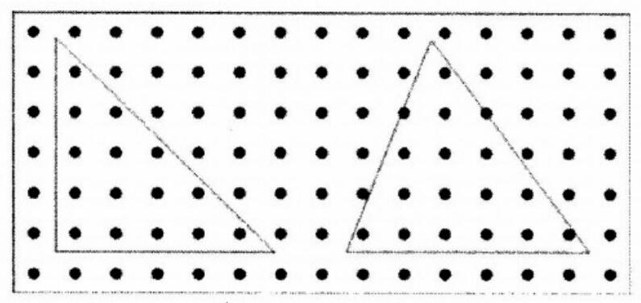
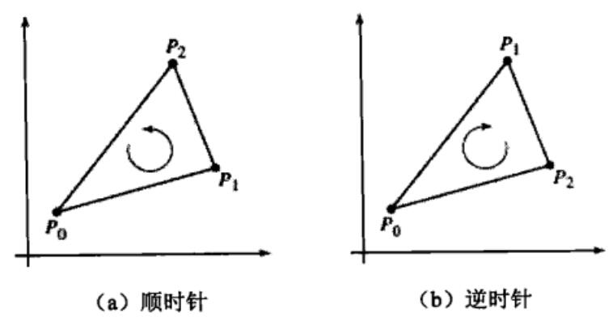

# 基础题目选解

## 5.1.3 周期串

```
如果一个字符串可以由某个长度为k的字符串重复多次得到，我们说该串以k为周期。例如，abcabcabcabc以3为周期（注意，它也以6和12为周期）。输入一个长度不超过80的串，输出它的最小周期。
样例输入：HoHoHo
样例输出：2
```

```c++
#include<stdio.h>
#include<string.h>
int main() {
	char word[100];
	scanf("%s", word);
	int len = strlen(word);
	for (int i = 1; i <= len; j++)
		if (len % i == 0) {
			int ok = 1;
			for (int j = i; j < len; j++)
				if (word[j] != word[j % i]) {
					ok = 0;
					break;
				}
			if (ok) {
				printf("%d\n", i);
				break;
			}
		}
	return 0;
}
```

题目看错了，以为求字符串的最大周期。

## 5.2.1 小学生算术

```Markdown
很多学生在学习加法时，发现 “进位” 特别容易出错。你的任务是计算两个整数在相加时需要多少次进位。你编制的程序应当可以连续处理多组数据，直到读到两个 0（这是输入结束标记）。假设输入的整数都不超过 9 个数字。
样例输入：
123 456
555 555
123 594
0 0
样例输出：
0
3
1
```

```c++
#include <stdio.h>

int main() {
	int a, b;
	while (scanf("%d%d", &a, &b) == 2) {
		if (!a && !b) return;
		int c = 0, ans = 0;
		for (int i = 9; i >= 0; i--) {
			c = (a % 10 + b % 10 + c) > 9 ? 1 : 0;
			ans += c;
			a /= 10; b /= 10;
		}
		printf("%d\n", ans);
	}
	return 0;
}
```

## 5.3.1 6174 问题

假设你有一个各位数字互不相同的四位数，把所有数字从大到小排序后得到 a，从小到大排序后得到 b，然后用 a-b 替换原来这个数，并且继续操作。例如，从 1234 出发，依次可以得到 4321-1234=3087、8730-378=8352、8532-2358=6174。有趣的是，7641-1467=6174，回到了它自己。
输入一个 n 位数，输出操作序列，直到出现循环（即新得到的数曾经得到过）。输入保证在循环之前最多只会产生 1000 个整数。
样例输入：1234
样例输出：1234->3087->8352->6174->6174


两个问题摆在我们面前：如何得到下一个数？如何检查这个数是否已经出现过？

第一个问题需要我们把各个数字排序，因此首先需要把各个数字提取出来。

第二步是逐个生成各个数，并判断是否曾经生成过。

```c++
int get_next(int x) {
	int a, b, n;
	char s[10];
	//转化成字符串
	sprintf(s, "%d", x);
	n = strlen(s);
	//冒泡排序
	for (int i = 0; i < n; i++)
		for (int j = i + 1; j < n; j++)
			if (s[i] > s[j]) {
				char t = s[i]; s[i] = s[j]; s[j] = t;
			}
	sscanf(s, "%d", &b);
	//字符串反转
	for (int i = 0; i < n / 2; i++) {
		char t = s[i]; s[i] = s[n - 1 - i]; s[n - 1 - i] = t;
	}
	sscanf(s, "%d", &a);
	return a - b;
}

int num[2000], count;

int main() {
	scanf("%d", &num[0]);
	printf("%d", num[0]);
	count = 1;
	for (;;) {
		//生成并输出下一个数
		num[count] = get_next(num[count - 1]);
		printf("->%d", num[count]);
		//在数组num中寻找新生成的数
		int found = 0;
		for (int i = 0; i < count; i++)
			if (num[i] == num[count]) {found = 1; break;}
		//如果找到,则退出循环
		if (found) break;
		count++;
	}
	printf("\n");
	return 0;
}
```

## 5.3.2 字母重排

```
输入一个字典（用 ****** 结尾），然后再输入若干单词。每输入一个单词 w，你都需要在字典中找出所有可以用 w 的字母重排后得到的单词，并按照字典序从小到大的顺序在一行中输出（如果不存在，输出:(）。输入单词之间用空格或空行隔开，且所有输入单词都由不超过 6 个小写字母组成。注意，字典中的单词不一定按字典序排列。
样例输入：
tarp given score refund only trap work earn course pepper part
******
resco nfudre aptr sett oresuc
样例输出：
score
refund
part tarp trap
:(
course
```

```
【分析】
首先需要把字典读入并保存下来。接下来需要怎么做呢？最容易想到的方法是这样的：
（1）每读入一个单词，就和字典中的所有单词比较，看看是否可以通过重排得到。
（2）把可以重排得到的单词放在一个数组中。
（3）把这个数组排序后输出。
这样做当然是正确的，但总显得有些 “笨”。有没有更好的方法呢？下面依次看看这 3 个步骤能否简化。
如何判断两个单词是否可以通过重排得到呢？稍微思考就会发现：把各个字母排序，然后直接比较即可。既然如此，我们可以在读入时就把每个单词按照字母排好序，就不必每次重排了。
是不是必须把能重排的单词保存下来再排序呢？这个也没有必要——只要在读入字典之后把所有单词排序，就可以每遇到一个满足条件的单词就立刻输出。
```

```c++
#include<stdio.h>
#include<stdlib.h>
#include<string.h>

int n;
char word[2000][10], sorted[2000][10];

// 字符比较函数
int cmp_char(const void*_a, const void*b) {
	char *a = (char*)_a;
	char *b = (char*)_b;
	return *a - *b;
}

// 字符串比较函数
int cmp_string(const void* _a, const void* _b) {
	char*a = (char*)_a;
	char*b = (char*)b;
	return strcmp(a, b);
}

int main() {
	n = 0;
	for (;;) {
		scanf("%s", word[n]);
		if (word[n][0] == '*') break; //遇到结束标志就终止循环
		n++;
	}
	qsort(word, n, sizeof(word[0]),
	      cmp_string); //给所有单词排序
	for (int i = 0; i < n; i++) {
		strcpy(sorted[i], word[i]);
		qsort(sorted[i], strlen(sorted[i]), sizeof(char), cmp_char);
		//给每个单词排序
	}
	chars[10];
	while (scanf("%s", s) == 1) { //持续读取到文件结尾
		qsort(s, strlen(s), sizeof(char), cmp_char); //给输入单词排序
		int found = 0;
		for (int i = 0; i < n; i++)
			if (strcmp(sorted[i], s) == 0) {
				found = 1;
				printf("%s", word[i]); //输出原始单词,而不是排序后的
			}
		if (!found)
			printf(":(");
		printf("\n");
	}
	return 0;
}

```

## 5.4.2 因子和阶乘

```
输入正整数n（2≤n≤100），把阶乘nl=1×2×3×…×n分解成素因子相乘的形式，从小到大输出各个素数（2、3、5、…）的指数。例如825=3×52×11应表示成（0，1，2，0，1），表示分别有0、1、2、0、1个2、3、5、7、11。你的程序应忽略比最大素因子更大的素数（否则末尾会有无穷多个0）。
样例输入：
5
53
样例输出：
5！=3 1 1
53！=49 23 12 8 4 4 3 2 2 1 1 1 1 1 1 1
```

```c++
#include<stdio.h>
#include<string.h>

//素数判定.注意:n不能太大
int is_prime(int n) {
	for (int i = 2; i * i <= n; i++)
		if (n % i == 0) return 0;
	return 1;
}

//素数表
int prime[100], count = 0;

int main() {
	//n和各个素数的指数
	int n, p[100];
	//构造素数表
	for (int i = 2; i <= 100; i++)
		if (is_prime(i))
			prime[count++] = i;
	while (scanf("%d", &n) == 1) {
		printf("%d!=", n);
		memset(p, 0, sizeof(p));
		int maxp = 0;
		for (int i = 1; i <= n; i++) {
			//必须把i复制到变量m中,而不要在做除法时直接修改它
			int m = i;
			for (int j = 0; j < count; j++)
				while (m % prime[j] == 0) { //反复除以prime[j],并累加p[j]
					m /= prime[j];
					p[j]++;
					if (j > maxp) maxp = j; //更新最大素因子下标
				}
		}
		//只循环到最大下标
		for (int i = 0; i <= maxp; i++)
			printf("%d", p[i]);
		printf("\n");
	}
	return 0;
}
```

## 5.4.3 果园里的树

```
果园里的树排列成矩阵。它们的 x 和 y 坐标均是 1~99 的整数。输入若干个三角形，依次统计每一个三角形内部和边界上共有多少棵树。
样例输入：
1.5 1.5    1.5 6.8    6.8 1.5
10.7 6.9    8.5 1.5    14.5 1.5
样例输出：
15
17
```



```c++
double area2(double x0, double yo, double x1, double y1, double x2,
             double y2) {
	return x0 * y1 + x2 * y0 + x1 * y2 - x2 * y1 - ×0 * y2 - x1 * y0;
}
```

它给出了三角形（x0，y0）-（x1，y1）-（x2，y2）的有向面积（signed area）的两倍。你暂时不必理解它为什么是对的，把它记住就可以了。什么叫有向面积呢？



如果 ▲P0P1P2 三个点呈逆时针排列，则有向面积为正；反之，顺时针为负；三点共线有向面积为 0。

$$

2 A=\left|\begin{array}{lll}
x_{0} & y_{0} & 1 \\
x_{1} & y_{1} & 1 \\
x_{2} & y_{2} & 1
\end{array}\right|=x_{0} y_{1}+x_{2} y_{0}+x_{1} y_{2}-x_{2} y_{1}-x_{0} y_{2}-x_{1} y_{0}

$$

有了它，判断就很简单了：假设输入三角形为 ABC，待判断的点为 O，则 O 在三角形 ABC 的内部或边界上当且仅当 $ S_{\Delta A B C}=S_{\Delta O A B}+S_{\Delta O B C}+S_{\Delta O C A} $ 。

代码不再赘述，但需要注意的是：在判断两个浮点数 a 和 b 是否相等时，请尽量判断 fabs（a-b）是否小于一个事先给定的 eps，如 1e-9。如有可能，请尽量避免浮点运算（例如，若本题的输入都是整数，则可以全部用整数运算；即使输入浮点数，如果规定只保留两位小数，也可以把所有坐标乘以 100，转化为整数）。