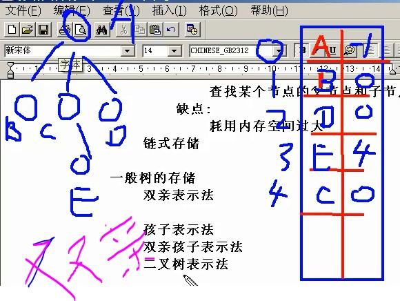
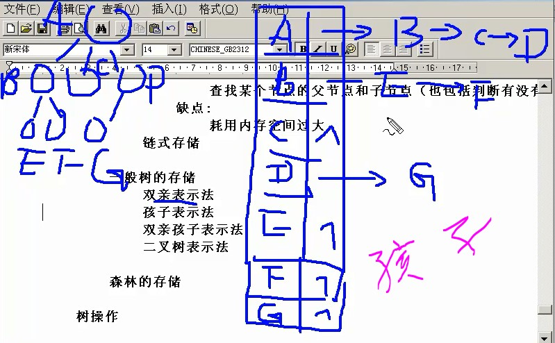
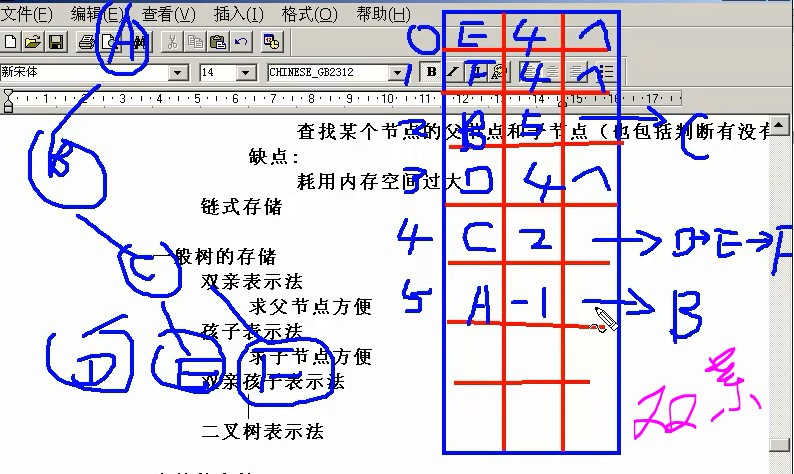
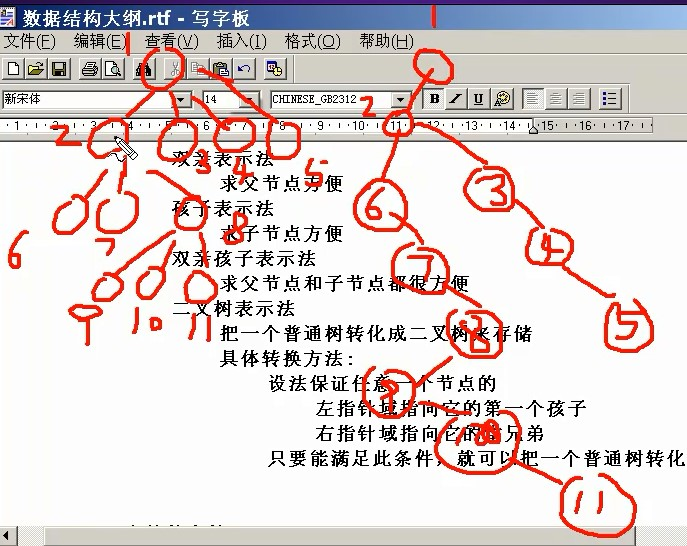
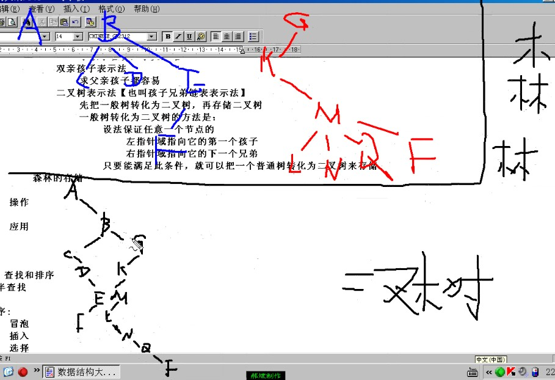

> @Date    : 2020-06-19 17:51:40
>
> @Author  : Lewis Tian (taseikyo@gmail.com)
>
> @Link    : github.com/taseikyo

# 非线性结构

[readme](../README.md) | [previous](03.线性结构.md) | [next](05.查找和排序.md)

## Table of Contents
- [树](#树)
	- [定义](#定义)
	- [专业术语](#专业术语)
	- [分类](#分类)
	- [存储](#存储)
	- [操作](#操作)
	- [应用](#应用)

## 树

### 定义

- 专业定义
	- 有且只有一个称为根的节点
	- 有若干个互不相交的子树，这些子树本身也是一颗树
- 通俗定义
	- 树是由节点和边组成
	- 每个节点只有一个父节点但可以有多个子节点
	- 但有一个节点例外，该节点没有父节点，此节点称为根节点

### 专业术语

- 节点，父节点，子节点
- 子孙，堂兄弟
- 深度：从根节点到最底层节点的层数称之为深度，根节点是第一层
- 叶子节点：没有子节点的节点
- 非终端节点：实际就是非叶子节点
- 度：子节点的个数

### 分类

- 一般树：任意一个节点的子节点的个数都不受限制

- 二叉树：任意一个节点的子节点个数最多两个，且子节点的位置不可更改
	- 一般二叉树
	- 满二叉树：在不增加树层数的前提下，无法再多添加一个节点的二叉树就是满二叉树
	- 完全二叉树：如果只是删除了满二叉树最底层最右边的连续若干个节点，这样形成的二叉树就是完全二叉树。（满二叉树是完全二叉树的一个特例）
- 森林：n 个互不相交的树的集合

### 存储

- 二叉树的存储
	- 连续存储【完全二叉树】
		- 优点：查找某个节点的父节点和子节点（也包括有没有子节点）速度很快
		- 缺点：耗用内存空间过大
	- 链式存储
- 一般树的存储
	- 双亲表示法：求父节点方便
	- 孩子表示法：求子节点方便
	- 双亲孩子表示法：求父节点和子节点都很方便
	- 二叉树表示法：把一个普通树转化成二叉树来存储
		- 具体转换方法：
			- 设法保证任意一个节点的左指针域指向它的第一个孩子，右指针域指向它的兄弟，只要满足此条件，就可以把一个普通树转化为二叉树。
			- 一个普通树转化成的二叉树一定没有右子树
- 森林的存储
	- 先把森林转化为二叉树，再存储二叉树：将相邻的父节点依次作为节点的右子树再对各父节点进行转化

双亲表示法如下所示，右边第二列指的是父亲的编号，比如（E，4）表示 E 的父节点在 4 号，即 C 是 E 的父节点。

孩子表示法如下所示，孩子以链表的形式组织起来

双亲孩子表示法如下，相当于结合了上面两种

树转二叉树如下所示，由于根没有兄弟，所以转成二叉树没有右子树

森林转化为二叉树

### 操作

- 遍历
	1. 先序：根-左-右
	2. 中序：左-根-右
	3. 后序：左-右-根

- 已知两种遍历序列求原始二叉树
	- 先序+中序
	- 后续+中序
	- **但是先序+后序不行**

### 应用

- 树是数据库数据组织的一种重要形式
- 操作系统子父进程的关系本身就是一棵树
- 面向对象语言中类的继承关系本身就是一棵树
- 赫夫曼树

[readme](../README.md) | [previous](03.线性结构.md) | [next](05.查找和排序.md)
