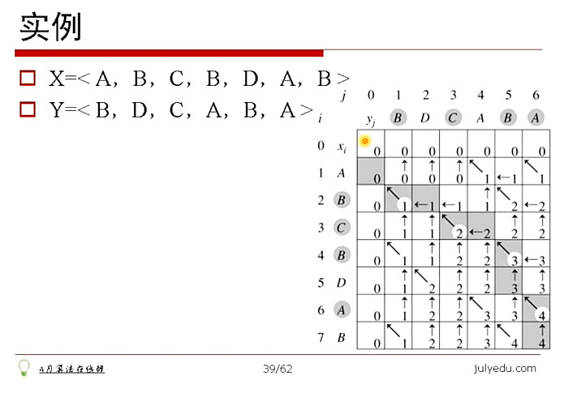
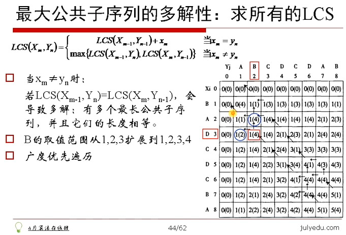

# 01.管窥算法

## Table of Contents

- [最大连续子数组](#最大连续子数组)
	- [问题](#问题)
	- [解法](#解法)
- [查找旋转数组的最小值](#查找旋转数组的最小值)
	- [问题](#问题)
	- [解法](#解法)
- [零子数组](#零子数组)
	- [题目](#题目)
	- [解法](#解法)
- [LCS](#lcs)
	- [题目](#题目)
	- [解法](#解法)
- [最长递增子序列 LIS](#最长递增子序列-lis)
	- [题目](#题目)
	- [解法](#解法)
- [字符串编辑距离](#字符串编辑距离)
	- [问题](#问题)
	- [解法](#解法)

## 最大连续子数组

### 问题：
```
给定一个数组 A[O,...,n-1]，求 A 的连续子数组，使得该子数组的和最大。

例如：
	数组：1，-2，3，10，-4，7，2，-5
	最大子数组：3，10，4，7，2
```

### 解法：

1. 暴力法

```
直接求解 A[i..j] 的值：
0 ≤ i < n
i ≤ j < n
i, i+1,...j-1, j 的最大长度为 n

时间复杂度 O(n^3)
```

```c++
// 01.最大连续子数组_暴力法.cpp
int MaxSubArray(int* A, int n) {
	int maxSum = a[0];
	int currSum;
	for (int i = 0; i < n; i++) {
		for (int j = i; j < n; j++) {
			currSum = 0;
			for (int k = i; k <= j; k++) {
				currSum += A[k];
			}
			if (currSum > maxSum)
				maxSum = currSum;
		}
	}
	return maxSum;
}
```

2. 分治法

```
将数组从中间分开，那么最大子数组要么完全在左半边数组，要么完全在右半边数组，要么跨立在分界点上。
完全在左数组、右数组递归解决。
跨立在分界点上：实际上是左数组的最大后缀和右数组的最大前级的和。因此，从分界点向前扫，向后扫即可。

时间复杂度：O(nlogn)
```

```c++
// 01.最大连续子数组_分治法.cpp
double MaxAddSub(double *a, int from, int to) {
	if (to == from)
		return a[from];
	int middle = (from + to) / 2;
	double m1 = MaxAddSub(a, from, middle);
	double m2 = MaxAddSub(a, middle + 1, to);
	int i, left = a[middle], now = a[middle];
	for (i = middle - 1; i >= from; --i) {
		now += a[i];
		left = max(now, left);
	}
	int right = a[middle + 1];
	now = a[middle + 1];
	for (i = middle + 2; i <= to; ++i) {
		now += a[i];
		right = max(now, right);
	}
	double m3 = left + right;
	return std::max(m1, m2, m3);
}
```

3. 分析法

```
前缀和 p[i] = a[0] + a[1] + ... +a[i]
s[i, j] = p[j] - p[i-1]（定义 p[-1] = 0）

算法过程
	1. 求i前缀 p[i]：
		遍历i：0 ≤ i ≤ n-1
		p[i] = p[i-1] + A[i]
	2. 计算 p[i] - p[j]
		遍历：0 ≤ i ≤ n-1，求最小值 m
		m 的初值取 0（P[-1]=0），然后遍历 p[0...i-1]，更新 m
		p[i]-m 即为以 a[i] 结尾的数组中最大的子数组
	3. 在第 2 步中，可顺手记录 p[i] - m 的最大值。
		为什么？
	1、2 步都是线性的，因此，时间复杂度 O(n)
```


4. 动态规划

```
记 S[i] 为以 A[i] 结尾的数组中和最大的子数组
则：S[i+1] = max(S[i]+A[i+1]，A[i+1])
S[0]=A[0]
遍历 i：0 ≤ i ≤ n-1
动态规划：最优子问题
时间复杂度：O(n)
```

```c++
result = a[0]
sum = a[0]
for i:1 to LENGTH(a)-1
	if sum > 0
		sum+ = a[i]
	else
		sum = a[i]
	if sum > result
		result = sum
return result
```

## 查找旋转数组的最小值

### 问题：

```
假定一个排序数组以某个未知元素为支点点做了旋转，如：原数组 0 1 2 4 5 6 7 旋转后得到 4 5 6 7 0 1 2。请找出旋转后数组的最小值。假定数组中没有重复数字。
```

### 解法：

```
旋转之后的数组实际上可以划分成两个有序的子数组：前面子数组的大小都大于后面子数组中的元素；
	4 5 6 7 0 1 2
	注意到实际上最小的元素就是两个子数组的分界线。

用两个指针 low，high 分别指向数组的第一个元素和最后一个元素。如果是正常的排序数组（元素间
不重复），第一个元素肯定小于最后一个元素。
计算中词位置 mid =(low+high)/2；
	若：A[mid]>A[low]，则A[low，low+1...mid-1，mid]是递增序列，最小元素位于子数组A[mid+1，mid+2...high]中。因此，做赋值 low=mid+1；
	若：A[mid]<A[low]，则A[low，low+1....mid-1，mid]不是递增序列，即：中间元素在该子数组中，做赋值 high=mid。
	注：对偶地，若考察 A[mid] 与 A[high] 的关系，能够得到相似的结论。
```

```c++
// 01.查找旋转数组的最小值_二分法.cpp
int FindMin(int*num，int size) {
	int low = 0;
	int high = size - 1;
	int mid;
	while (low < high) {
		mid = (high + 1ow) / 2;
		if (num[mid] < num[high]) // 最小值在左半部分
			high = mid;
		else if (num[mid]〉num[high]) // 最小值在右半部分
			low = mid + 1;
	}
	return num[low];
}
```


## 零子数组

### 题目：

```
求对于长度为 N 的数组 A，求子数组的和接近 0 的子数组，要求肘间复杂度O(NlogN)。
```

### 解法：

```
算法流程：
申请同样长度的空间 sum[0...N-1]，sum[i] 是A的前项和。
    Trick：定义sum[-1]=0
显然有：
```

$ \sum\limits_{k=i}^{j} A_k = sum(j) - sum(i-1) $

```
算法：
对 sum[0...N-1]  排序，然后计算 sum 相邻元素的差，最小值记为 min1。
    min1：在A中任意取两个集合，各自元素的和求差的最小值
因为 sum[-1] = 0，sum[0...N-1] 的绝对值最小值记为 min2。
    min2：A 的前 k 个元素的和的绝对值的最小值
min1 和 min2 的更小者，即为所求。

sum 本身的计算和相邻元素差的计算，都是O(N)，sum 的排序是 O(NlogN)，因此，总时间复杂度：O(NlogN)

强调：除了计算 sum 相邻元素的差的最小值，别忘了 sum 自身的最小值。
一个对应 A[i...j]，一个对应 A[0...j]
```

## LCS

### 题目：

```
最长公共子序列，即 Longest Common Subsequence，LCS。
一个序列 S 任意删除若千个字符得到新序列 T，则 T 叫做 S 的子序列
两个序列 X 和 Y 的公共子序列中，长度最长的那个，定义为 X 和 Y 的最长公共子序列。
    字符串 13455 与 245576 的最长公共子序列为 455
    字符串 acdfg 与 adfc 的最长公共子序列为 adf
注意区别最长公共子串（Longest Common Substring）
最长公共子串要求连续
```

### 解法：

```
LCS的记号：
字符串X，长度为m，从1开始数；
字符串Y，长度为n，从1开始数；
Xi=<x1，...，xi>即X序列的前个字符（1≤i≤m）（Xi不妨读作“字符串区的i前缀”）
Yj=<y1，...，j>即Y序列的前个字符（1≤j≤n）（字符串Y的j前缀）；

LCS（X，Y）为字符串X和Y的最长公共子序到，即为Z=<z1，，zk>。
    注：不严格的表述。事实上，又和Y的可能存在多个子串，长度相同并且最大，因此，LCS（X，Y）严格的说，是个字符串集合。即：Z∈LCS（X，Y）.

LCS解法的探索：
若 xm=yn，即最后一个字符相同，则：Xm与Yn的最长公共子序到的最后一个字符必定为Xm（=yn）。
    zk=xm=yn 
    LCS（Xm，Yn）=LCS（Xm-1，Ym-1）+xm
若 xm≠yn，则：LCS（Xm：Yn）=max{LCS（Xm-1，Yn），LCS（X，Yn-1）}

总结：
```
$$
LCS(X_m, Y_n) =
\begin{cases}
LCS(X_{m-1}, Y_{n-1}) + x_m \qquad & x_m = y_n \\
max(LCS(X_{m-1}, Y_{n}), LCS(X_{m}, Y_{n-1})) \qquad & x_m ≠ y_n
\end{cases}
$$

```
使用二维数组 c[m ,n]
c[i, j] 记录序列 Xi 和 Yj 的最长公共子序列的长度
    当 i=0 或者 j=0 时，空序列是 Xi 和 Yj 的 LCS，即 c[i, j] = 0
也即：
```

$$
c(i, j) =
\begin{cases}
0 \qquad & i=0 || j=0 \\
c(i-1, j-1) + 1 \qquad & i>0, j>0, x_i = y_i \\
max(c(i-1, j), c(i, j-1)) \qquad & i>0, j>0, x_i ≠ y_i
\end{cases}
$$

```
方向向量
使用二维数组 b[m, n]，其中 b[i, j] 表示 c[i, j] 是由哪一个子问题的解达到的。
即 c[i, j] 是由 c[i-1, j-1]+1，c[i-1, j]，c[i, j-1] 的哪一种得到的，取值范围为 left，top，lefttop 三种。
```



```c++
// 计算 LCS 的长度
Procedure LCS_LENGTH(X, Y)
begin
    m:=length(X);
    n:=length(Y);
    for i:=1 to m do c[i, 0]:=0;
    for j:=1 to n do c[0, j]:=0;
    for i:=1 to m do
        for j:=1 to n do
            if x[i] = y[j] then
                begin
                    c[i, j]:=c[i-1, j-1]+1;
                    b[i, j]:='↖'
                end
            else if c[i-1, j] ≥ c[i, j-1] then
                begin
                    c[i, j]:=c[i-1, j];
                    b[i, j]:='↑'
                end
            else
                begin
                    c[i, j]:=c[i, j-1];
                    b[i, j]:='←'
                end
        return (c, b)
    end

Procedure LCS(b, X, i, j)
begin
    if i=0 or j=0 then return
    if b[i, j] = '↖' then
        begin
            LCS(b, X, i-1, j-1)
            print(x[i]) //打印 x[i]
        end
    else if b[i, j]='↑' then
        LCS(b, X, i-1, j)
    else
        LCS(b, X, i, j-1)

end
```



## 最长递增子序列 LIS

### 题目：

```
Longest Increasing Subsequence
给定一个长度为N的数组，找出一个最长的单调递增子序列。
例如：给定数组{5，6，7，1，2，8}，则其最长的单调递增子序列为{5，6，7，
8}，长度为4。
    分析：其实此LIS问题可以转换成最长公子序列问题，为什么呢？
```

### 解法：

1. LCS

```
原数组：A {5，6，7，1，2，8}
排序后：A'{1，2，5，6，7，8}
因为，原数组A的子序到顺序保持不变，而且排序后A'本身就是递增的，这样，就保证了两序列的最长公共子序列的递增特性。如此，若想求数组A的最长递增子序到，其实就是求数组A与它的排序数组A'的最长公共子序列。
```

2. 动态规划

```
设长度为N的数组为{a0，al，a2，...an-1}，则假定以aj结尾的数组序列的最长递增子序到长度为L（j），则L（j）={max（L（i））+1，i<j且a[i]<a]}。也就是说，我们需要遍历在j之前的所有位置i（从0到j-1），找出满足条件a[i]<a[j]的L（i），求出max（L（i））+1即为L（j）的值。最后，我们遍历所有的L（j）（从0到N-1），找出最大值即为最大递增子序到。时间复杂度为0（N2）。
```

```c++
// 01.最长递增子序列_动态规划.cpp
int lis(int arr[], int len) {
    int longest[len];
    for (int i = 0; i < len; i++ ) {
        longest[i] = 1;
    }
    for (int j = 1; j < len; j++) {
        for (int i = 0; i < j; i++ ) {
            // 注意longest[j]<longest[i]-1这个条件, 不能省略
            if (arr[j] > arr[i] && longest[j] < longest[i] - 1) {
                // 计算以arr[j]结尾的序列的最长递增子序列长度
                longest[j] = longest[i] + 1;
            }
        }
    }
    int max = 0;
    for (int j = 0; j < len; j++) {
        cout << "longest[" << j << "]=" << longest[j] << endl;
        if (longest[j] > max)
            //从longest[]中找出最大值
            max = longest[j];
    }
    return max;
}
```

## 字符串编辑距离

### 问题：

```
两个字符串之间，由一个变成另一个所需的最少编辑操作次数，编辑操作包括：
	将一个字符替换成另一个字符
	插入一个字符
	删除一个字符
```

### 解法：

```
字符率“ALGORITHM”是如何变成字符串“ALTRUISTIC”的
A L G O R   I   T H M
A L   T R U I S T I C


递推关系
枚举字符串 S 和 T 的最后一个字符 S[i]、T[j] 对应的四种情况：（字符-字符）、（字符-空白）、（空白-字符）和（空白-空白），最后一种是多余的编辑操作。

S+空白
T+字符X
	S 变成 T，在末尾插入字符 X
	dp[i, j] = dp[i, j-1]+1

S+字符X
T+字符Y
	S变成T，字符 X 变成 Y
	dp[i, j] = dp[i-1, j-1]+(X==Y?0:1)

S+字符X
T+空白
	S 变成 T，在末尾删除字符 X
	dp[i, j] = dp[i-1, j]+1
```

```c++
// dp[i][j]表示源率 source(0-i)和目标动target(0-j)的编辑距离
int EditDistance(char *pSource，char* pTarget) {
	int srclength = strlen(pSource);
	int targetLength = strlen(pTarget);
	int i，j;
	// 边界dp[i][0]=i dp[0][j].j
	for (i = 1; i <= srcLength; ++i) {
		dp[i][0] = i;
	}
	for (j = 1; j <= targetLength; ++j) {
		dp[0][j] = j;
	}

	for (i = 1; i <= srcLength; ++i) {
		for (j = 1; j <= targetLength; ++j) {
			if (pSource[i - 1] == pTarget[j - 1]) {
				dp[i][j] = dp[i - 1][j - 1];
			} else {
				dp[i][j] = 1 + min(dp[i - 1][j],
				                   dp[i - 1][j - 1],
				                   dp[i][j - 1]);
			}
		}

	}
	return dp[srcLength][targetLength];
}
```

