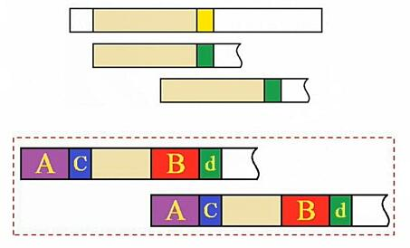
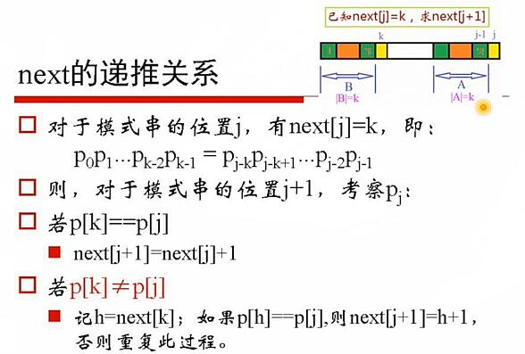
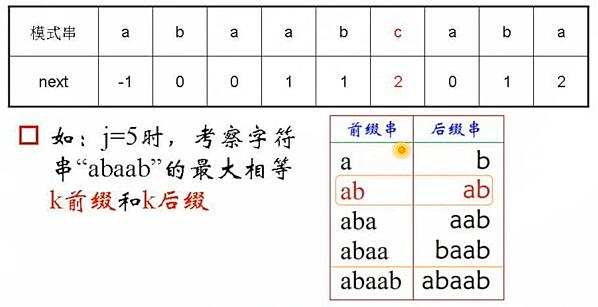
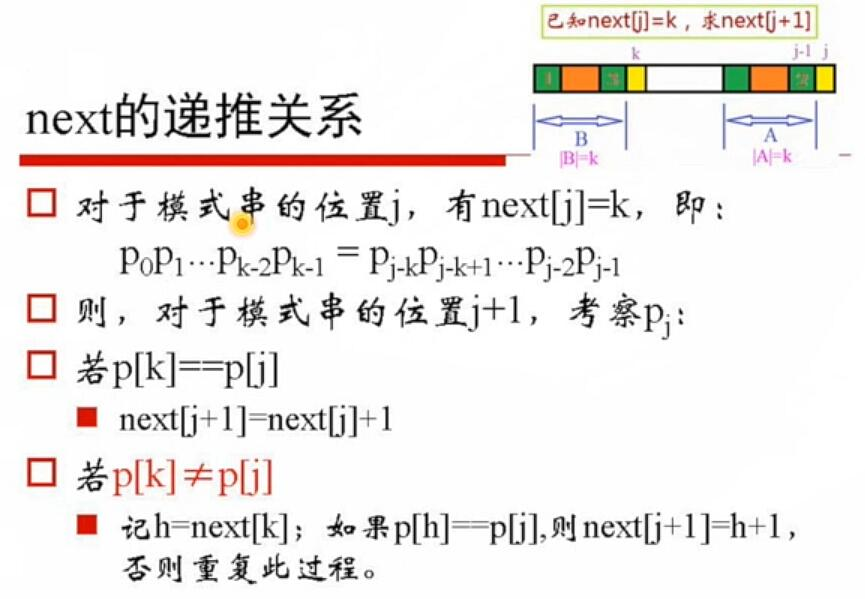
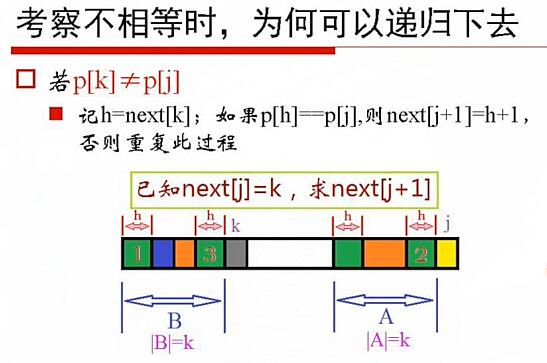
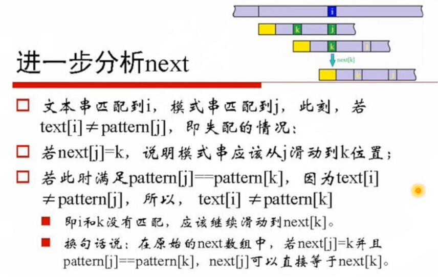
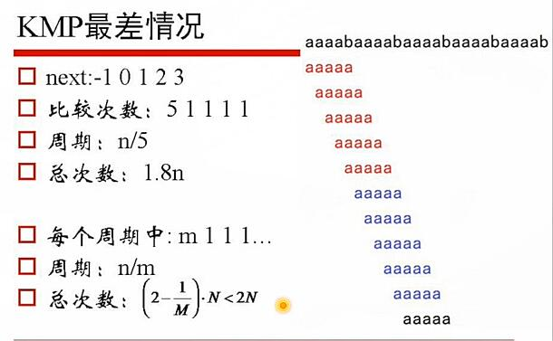
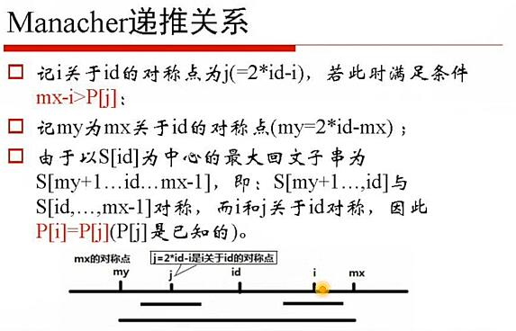
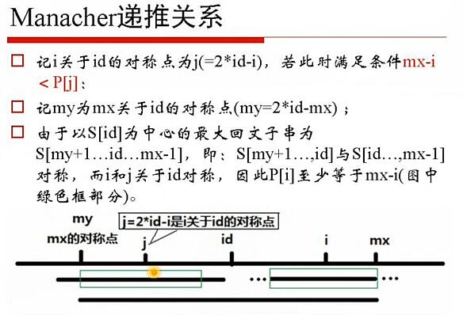

# 02.字符串

## Table of Contents

- [字符串循环左移](#字符串循环左移)
	- [问题](#问题)
	- [解法](#解法)
- [字符串的全排列](#字符串的全排列)
	- [问题](#问题)
	- [解法](#解法)
- [有重复字符的全排列](#有重复字符的全排列)
	- [问题](#问题)
	- [解法](#解法)
- [求字符串的下一个字典序的排列](#求字符串的下一个字典序的排列)
	- [问题](#问题)
	- [解法](#解法)
- [KMP 算法](#kmp-算法)
	- [问题](#问题)
	- [解法](#解法)
- [字符串的最小周期](#字符串的最小周期)
	- [问题](#问题)
	- [解法](#解法)
- [求字符串的最长回文子串（Manacher）](#求字符串的最长回文子串（manacher）)
	- [问题](#问题)
	- [解法](#解法)
- [BM 算法](#bm-算法)

## 字符串循环左移

### 问题

```
给定一个字符串S[0...N-1]，要求把S的前k个字符移动到S的尾部，如把字符串“abcdef” 前面的2个字符a、b移动到字符串的尾部，得到新字符串“cdefab”：即字符串循环左移k。
	多说一句：循环左移k位等价于循环右移n-k位。
算法要求：
	时间复杂度为O（n），空间复杂度为O（1）。
```

### 解法

1. 暴力移位法

```
每次循环左移1位，调用k次即可
	时间复杂度0（kN），空间复杂度O（1）
```

2. 三次拷贝

```
S[0...k]→T[0...k]
S[k+1...N-1]→S[0...N-k-1]
T[0...k]→S[N-k...N-1]
时间复杂度O（N），空间复杂度O（k）
```

3. 利用矩阵的逆的思想

```
（X'Y'）'=YX
	如：abcdef
	X=ab X'=ba
	Y=cdef Y'=fedc
	（X'Y'）'=（bafedc）'=cdefab

时间复杂度O（N），空间复杂度O（1）
```

```c++
// 02.字符串循环左移_矩阵逆的思想.cpp
void ReverseString(char*s, int from, int to) {
	while (from < to) {
		char t = s[from];
		s[from++] = s[to];
		s[to--] = t;
	}
}

void LeftRotatestring(char*s, int n, int m) {
	m %= n;
	Reversestring(s, 0, m - 1);
	ReverseString(s, m, n - 1);
	ReverseString(s, 0, n - 1);
}
```

## 字符串的全排列

### 问题

```
给定字符率S[0...N-1]，设计算法，枚举A的全排列。
```

### 解法

1. 递归

```
以字符串1234为例：
1-234
2-134
3-214
4-231
如何保证不造漏
	保证递归前1234的顺序不变
```

```c++
// 02.字符串的全排列_递归.cpp
char str[] = "1234";
int size = sizeof(str) / sizeof(char);

void Permutation(int from, int to) {
	if (from == to) {
		for (int i = 0; i <= to; i++) {
			cout << str[i];
		}
		cout << '\n';
		return;
	}
	for (int i = from; i <= to; i++) {
		swap(str[i], str[from]);
		Permutation(from + 1, to);
		swap(str[i], str[from]);
	}

}

int _tmain(int argc, _TCHAR* argv[]) {
	Permutation(0, size - 2);
	return 0;
}
```

2. 哈希（）

```
如果是单字符，可以使用mark[256]
如果是整数，可以遍历整数得到最大值max和最小值min，使用mark[max-min+1]
如果是浮点数或者其他结构数据，用Hash（事实上，如果发现整数间变化太大，也应该考虑使用Hash；并且，可以认为整数情况是最朴素的Hash）
```

```c++
// 02.字符串的全排列_哈希.cpp
void Permutation(int from, int to) {
	if (from == to) {
		for (int i = 0; i <= to; i++) {
			cout << str[i];
		}
		cout << '\n';
		return;
	}
	int mark[MARK_SIZE];
	for (int i = 0; i < MARK_SIZE; ++i) {
		mark[i] = 0;
	}
	for (int i = from; i <= to; i++) {
		if (mark[str[i]] == 1) {
			continue;
		}
		mark[str[i]]  = 1;
		swap(str[i], str[from]);
		Permutation(from + 1, to);
		swap(str[i], str[from]);
	}
}
```

## 有重复字符的全排列

### 问题

问题同上，不过给定的字符串中含有重复的字符

### 解法

```
带重复字符的全排列就是每个字符分别与它后面非重复出现的字符交换。
即：第i个字符与第j个字符交换时，要求[i, j）中没有与第j个字符相等的数。
```

```c++
// 02.字符串循环左移_矩阵逆的思想.cpp
bool IsSwap(int from, int to) {
	bool bCan = true;
	for (int i = from; i < to; i++) {
		if (str[to] == str[i]) {
			bCan = false;
			break;
		}
	}
	return bCan;
}

void Permutation(int from, int to) {
	if (from == to) {
		for (int i = 0; i <= to; i++) {
			cout << str[i];
		}
		cout << '\n';
		return;
	}

	for (int i = from; i <= to; i++) {
		if (!IsSwap(from, i)) {
			continue;
		}
		swap(str[i], str[from]);
		Permutation(from + 1, to);
		swap(str[i], str[from]);
	}
}
```

## 求字符串的下一个字典序的排列

### 问题

```
起点：字典序最小的排到，例如12345
终点：字典序最大的排到，例如54321

过程：从当前排列生成字典序刚好比它大的下一个排列
如：21543的下一个排列是23145
	如何计算？
```

### 解法

```
21543 的下一个排列

逐位考察哪个能增大
	一个数右面有比它大的数存在，它就能增大
	那么最后一个能增大的数是 x=1 
1 应该增大到多少？
	增大到它右面比它大的最小的数 y=3
应该变为23xxx
显然，XXX应由小到大排：145
得到23145
```

```
步骤：后找、小大、交换、翻转
查找字符串中最后一个升序的位置i，即：
	S[k]>S[k+1]（k>i），S[i]<S[i+1]；
查找S[i+1..N-1]中比Ai大的最小值Sj；
交换Si，Sj；
翻转S[i+1...N-1]
	思考：交换操作后，S[i+1..N-1]一定是降序的
```


```c++
bool Next_permutation(char a[]) {
	char *pEnd = a + strlen(a);
	if (a == pEnd)
		return false;
	char*p，*q，*pFind;
	pEnd--;
	p = pEnd;
	while (p！ = a) {
		q = p;
		--p;
		// 找降序的相邻2数，前一个数即替换数
		if (*p < *a) {
			// 从后向前找比替换点大的第一个数
			pFind = pEnd;
			while (*pFind <= *p)
				--pFind;
			// 替换
			Swap(pFind，p);
			// 替换点后的数全部反转
			Reverse(q，pEnd);
			return true;
		}
	}
	// 没有下一个排列，会部反特后返回true
	Reverse(p，pEnd);
	return false;
}

void swap(chiar*a，char *b) {
	char t = *a;
	*a = *b;
	*b = t;
}

//反转区间
void Reverse(char*a，char*b) {
	while (a < b)
		Swap(a++，b--);
}
```

## KMP 算法

### 问题

```
字符串查找问题
	给定文本串text和模式串pattern，从文本串text中找出模式串pattern第一次出现的位置。
最基本的字符串匹配算法
	暴力求解（Brute Force）；时问复杂度O（m*n）
KMP算法是一种线性时间复杂度的字符串匹配算法，它是对BF算法改进。

记：文本串长度为N，模式串长度为M
	BF算法的时问复杂度O（M*N），空问复杂度O（1）
	KMP算法的时问复杂度O（M+N），空问复杂度O（N）
```

### 解法

1. 暴力法

```c++
// 02.字符串匹配_暴力
int BruteForceSearch(const char*s，const char*p) {
	int i = 0; // 当前匹配到的原始串首位
	int j = 0; // 模式串的匹配位置
	int size = (int)strlen(s);
	int psize = (int)strlen(p);
	while ((i < size) && (j < psize)) {
		if (s[i + j] == p[j]) {
			//若匹配，则模式串匹配位置后移
			j++;
		} else {
			// 不匹配，则比对下一个位置，模式串回溯到首位
			i++;
			j = 0;
		}
	}
	if (j >= psize)
		return i;
	return -1;
}
```

2. KMP



```Markdown
假设当前文本串text配到i位置，模式串pattern串匹配到j位置。
BF算法中，如果当前字符匹配成功，即text[i+j]==pattern[j]，令i++，j++，继续匹配下一个字符；
	如果失配，即text[i+j]≠pattern[j]，令i++，j=0，即每次匹配失败的情况下，模式串pattern相对于文本串text向右移动了一位。
KMP算法中，如果当前字符匹配成功，即 text[i+j]==pattern[j]，令i++，j+，继续匹配下一个字符；
	如果失配，即text[i+j]≠pattern[i]，令i不变，j=next[i]（这里，next[i]≤j-1），即模式书pattern相对于文本书text向右移动了至少1位（移动的实际位数j-next[j]≥1）
```



- 求字符串的next



- next的递归关系





```c++
// 02.字符串匹配_KMP.cpp
void CalcNext(char*p，int next[]) {
	int nLen = strlen(p);
	next[0] = -1;
	int k = -1;
	int j = 0;
	while (j < nLen - 1) {
		// 此刻，k即next[j-1]，且p[k]表示前缀，p[j]表示后缀
		// 注：k==-1表示未找到k前缀与k后缀相等，首次分析可先忽略
		if (k == -1 || p[j] == p[k]) {
			++k; ++j;
			next[j] = k;
		} else {
			// p[j]与p[k]失配，则继续递归前缀索引p[next[k]]
			k = next[k];
		}
	}
}

int KMP(int n) {
	int ans = -1; int i = 0; int j = 0;
	int pattern_len = strlen(g_pattern);
	while (i < n) {
		if (j == -1 || gs[i] == g_pattern[j]) {
			++i; ++j;
		} else {
			j = g_next[j];
		}
		if (j == pattern_len) {
			ans = i - pattern_len;
			break;
		}
	}
	return ans;
}
```



```c++
void CalcNext2(char*p，int next[]) {
	int nLen = strlen(p);
	next[0] = -1;
	int k = -1;
	int j = 0;
	while (j < nLen - 1) {
		if (k == -1 || p[j] == p[k]) {
			++k; ++j;
			// add start
			if (p[j] == p[k]) {
				next[j] = next[k];
			} else {
				next[j] = k;
			}
			// add end
		} else {
			k = next[k];
		}
	}
}
```



## 字符串的最小周期

### 问题

```
给定一个长度为n的字符串S，如果存在一个字符串T，重复若干次T能够得到S，那么，S叫做周期串，T叫做S的一个周期。
如：字符串ababab是周期串，abab、ab都是它的周期，其中，ab是它的最小周期。
设计一个算法，计算S的最小周期。如果S不存在周期，返回空串。
```

### 解法

```
计算S的next数组
记k=next[len-1]，p=len-k；
若len能够整除p，则p就是最小周期长度，前p个字符就是最小周期。
```

## 求字符串的最长回文子串（Manacher）

### 问题

```
回文子串的定义：
给定字符串str，若s同时满足以下条件：
	s是str的子串
	s是回文串
则，s是str的回文子串。
```

### 解法

1. 暴力法

```c++
int LongestPalindrome(const char *s, int n) {
	int i, j, max;
	if (s = 0 || n < 1)
		return 0;
	max = 0;
	// i is the middle point of the palindrome
	for (i = 0, i < n; ++i) {
		for (j = 0, (i - j >= 0) && (i + j < n), ++j) {
			// if the length of the palindrome is odd.
			if (s[i - j] != s[i + j])
				break
			}
		if (j * 2 + 1 > max)
			max = j * 2 + 1;
		for (j = 0, (i - j >= 0) && (i + j + 1 < n), ++j) {
			//for the even case
			if (s[i - j] != s[i + j + 1])
				break;
		}
		if (j * 2 + 2 > max)
			max = j * 2 + 2;
	}
	return max;
}
```

2. Manacher

```
因为回文串有奇数和偶数的不同。判新一个串是否是回文串，往往要分开编写，造成代码的拖沓。
一个简单的事实：长度为n的字符串，共有n-1个“邻接”，加上首字符的前面，和末字符的后面，共n+1的“空”（gap）。因此，字符串本身和gap一起，共有2n+1个，必定是奇数；
	abbc→#a#b#b#c#
	aba→#a#b#a#
因此，将待计算母串扩很成gap串，计算回文子串的过程中，只考虑奇数匹配即可。


字符串12212321→S[]="$#1#2#2#1#2#3#2#1#"；
	trick：为处理统一，最前面加一位未出现的字符，如S用一个数组P[i]来记录以字符S[i]为中心的最长回文子串向左/右扩张的长度（包括S[i]），比如S和P的对应关条：
S # 1 # 2 # 2 # 1 # 2 # 3 # 2 # 1 #
P 1 2 1 2 5 2 1 4 1 2 1 6 1 2 1 2 1
	P[i]-1正好是原字符串中回文串的总长度
		若P[i]为偶数，考察x=P[i]/2、2*x-1
		思考：若P[i]为奇数呢？
			答：不考虑！（为何？）

假定已经得到了前i个值，考察i+1如何计算
	即：在P[0...i-1]已知的前提下，计算P[i]的值。换句话说，算法的核心，是在P[0...i-1]已知的前提下，能否给P[i]的计算提供一点有用的信息呢？
1. 通过简单的遍历，得到i个三元组{k，P[k]，k+P[k]}，0≤k≤i-1
	trick：以k为中心的字待形成的最大回文子串的最右位置是k+P[k]-1
2. 以k+P[k]为关键字，挑选出这个三元组中，k+P[k]最大的那个三元组，不妨记做（id，P[id]，P[id]+id）。进一步，为了简化，记mx=P[id]+id，因此，得到三元组为（id，P[id]，mx），这个三元组的含义非常明显：所有个三元组中，向右到达最远的位置，就是mx；
3. 在计算P[i]的时候，考察i是否落在了区问[0，mx）中；
	若i在mx的右侧，说明[0，mx）没有能够按制住i，P[0...i-1]的已知，无法给P[i]的计算带来有价值信息；
	若i在mx的左侧，说明[0，mx）控制（也有可能部分控制）了i，现在以图示来详细考察这种情况。

```





```c++
void Manacher(char*s, int*P) {
	int size = strlen(s);
	P[0] = 1;
	int id = 0;
	int mx = 1;
	for (int i = 1; i < size; i++) {
		if (mx > i) {
			P[i] = min(P[2 * id - i], mx - i);
		} else {
			P[i] = 1;
		}
		for (; s[i + P[i]] == s[i - P[i]]; P[i]++);
		if (mx < i + P[i]) {
			mx = i + P[i];
			id = i;
		}
	}
}
```


## BM 算法

好后缀 && 坏字符，感觉太复杂，直接后面找博客看看吧