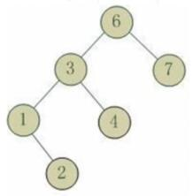
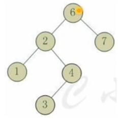
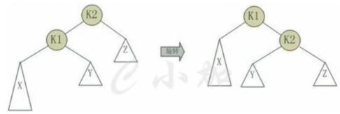
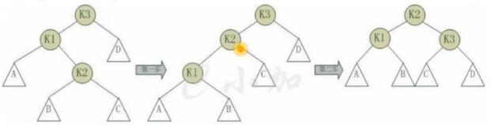
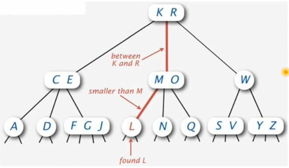
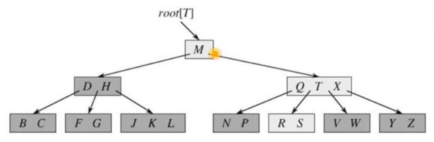

> @Date    : 2020-06-29 16:17:51
>
> @Author  : Lewis Tian (taseikyo@gmail.com)
>
> @Link    : github.com/taseikyo

# 04.树

[readme](../README.md) | [03.数组](03.数组.md) | [05.链表递归栈](05.链表递归栈.md)

## Table of Contents
- [bst 的插入](#bst-的插入)
	- [问题](#问题)
	- [解法](#解法)
- [bst 的建立](#bst-的建立)
	- [问题](#问题)
	- [解法](#解法)
- [bst 的删除](#bst-的删除)
	- [问题](#问题)
	- [解法](#解法)
- [二叉树的遍历](#二叉树的遍历)
	- [问题](#问题)
	- [解法](#解法)
- [根据前中序返回后序](#根据前中序返回后序)
	- [问题](#问题)
	- [解法](#解法)
- [根据中后序返回先序](#根据中后序返回先序)
	- [问题](#问题)
	- [解法](#解法)
- [平衡二叉树](#平衡二叉树)
	- [问题](#问题)
- [平衡二叉树的插入](#平衡二叉树的插入)
	- [问题](#问题)
	- [解法](#解法)
- [平衡二叉树的删除](#平衡二叉树的删除)
	- [问题](#问题)
	- [解法](#解法)
- [平衡二又树的查找](#平衡二又树的查找)
- [二叉到多叉的思考](#二叉到多叉的思考)
- [B 树](#b-树)

## bst 的插入

### 问题

对一个 bst 插入一个节点

### 解法

根据 bst 的性质，插入并不难

```c++
pnode insert(pnode&root, int x) {
	if (root == NULL) {
		pnode p = (pnode)malloc(LEN);
		p->val = x;
		p->lchild = NULL;
		p->rchild = NULL;
		root = p;
	} else if (x < root->val) {
		root->lchild = insert(root->lchild, x);
	} else {
		root->rchild = insert(root->rchild, x);
	}
	return root;
}
```

## bst 的建立

### 问题

给出一个数组（vector）建立一个 bst

### 解法

直接用上面的插入依次插入即可。

## bst 的删除

### 问题

删除 bst 节点

### 解法

记待删除的节点为p，分三种情况进行处理：

1. p 为叶子节点
	- 删除 p，p 的父节点指针 -> nullptr
2. p 为单支节点
	- 将 p 的子树与 p 的父节点相连
3. p 的左子树和右子树均不空

若 p 的左子树和右子树均不空，则找到 p 的直接后继 d（p 的右孩子的最左子孙），因为 d 一定没有左子树，所以使用删除单支节点的方法：删除 d，并让 d 的父亲节点 dp 成为 d 的右子树的父亲节点；同时，用 d 的值代替 p 的值；

对偶的，可以找到 p 的直接前驱 x（p 的左孩子的最右子孙），x 一定没有右子树，所以可以删除 x，并让 x 的父亲节点成为 x 的左子树的父亲节点。

代码见 [04.二叉搜索树的删除.cpp](04.二叉搜索树的删除.cpp)

## 二叉树的遍历

### 问题

遍历整棵树，分前中后三种

### 解法

用递归很简单

```c++
void visit(tree * root) {
	if (!root) {
		return;
	}
	// print(root->val); 此时先序
	visit(root->left);
	// 放在这里是中序
	visit(root->right);
	// 放在这里是后续
}
```

`print(root->val);` 放的位置导致不同的遍历，

## 根据前中序返回后序

### 问题

```
如：已知某二又树的遍历结果如下，求它的后序遍历序到
前序遍历：GDAFEMHZ
中序遍历：ADEFGHMZ
求后续遍历
```

### 解法

```
两个步骤：
1. 根据前序中序，构造二又树
2. 后序遍历二又树

前序遍历：GDAFEMHZ
中序遍历：ADEFGHMZ
根据前序遍历的特点得知，根结点为G；根节点将中序遍历结果ADEFGHZ分成ADEF和HZ两个左子树、右子树。
递归确定中序遍历序列ADEF和前序遍历序列DAEF的子树结构；
递归确定中序遍历序到HZ和前序遍历序到MMHZ的子树结构；
```

```c++
// 04.根据前中序遍历求后序遍历.cpp
void InPre2Post(char* inorder, char* preorder, int length) {
	TreeNode* node = new TreeNode;
	node->elem = *preorder;
	int nRoot = 0;
	for (; nRoot < length; nRoot++){
		if (inorder[nRoot] == *preorder)
			break;
	}
	InPre2Post(inorder, preorder + 1, nRoot);
	InPre2Post(inordertnRoot + 1, preorder + nRoot + 1,
	           length - (nRoot + 1));
	cout << node->elem << endl;
	return;
}
```

## 根据中后序返回先序

### 问题

若已知二叉树的中序和后序遍历：中：ADEFGHMZ 后：AEFDHZMG，如何求二叉树、如何求二叉树的前序遍历呢？

### 解法

跟上面的问题类似，后序遍历最后一个结点即为根结点，即根结点为G递归

```c++
// 04.根据中后序遍历求先序遍历.cpp
void InPost2Pre(char*inorder, char*postorder, int length) {
	TreeNode*node = new TreeNode;
	node->elem = *(postorder + length - 1);
	cout << node->elem << endl;
	int nRoot = 0;
	for (; nRoot < length; nRoot++) {
		if (inorder[nRoot] == *(postorder + length - 1))
			break;
	}
	InPost2Pre(inouder, postorder, nRoot);
	InPost2Pre(inorder + nRoot + 1, postorder + nRoot,
	           length - (nRoot + 1))
}
```

## 平衡二叉树

### 问题

高度不平衡

1. 左左

6节点的左子树3节点高度比右子树7节点大2，左子树3节点的左子树1节点高度大于右子树4节点，这种情况成为左左。



2. 左右

6节点的左子树2节点高度比右子树7节点大2，左子树2节点的左子树1节点高度小于右子树4节点，这种情况成为左右。



3. 右右

跟左左是对称的

4. 右左

跟左右是对称的

左左和右右两种情况是对称的，这两种情况的旋转算法是一致的，只需要经过一次旋转就可以达到目标，称之为单旋转。

左右和右左两种情况也是对称的，这两种情况的旋转算法也是一致的，需要进行两次旋转，称之为双旋转。

- 单旋转

节点 K2 不平衡，因为它的左子树 K1 比右子树 Z 深 2 层，而且 K1 子树中，更深的一层的是 K1 的左子树 X 子树，所以属于左左情况。

如图，假设K2不平衡：

- 为使树恢复平衡，把K1变成根节点
- K2大于K1，所以，把K2置于K1的右子树上
- K1右子树Y大于K1，1小于K2，所以，把Y置于k2的左子树上



```c++
// 左左情况下的旋转
template<class T>
void AVLTree<T>::SingRotateLeft(TreeNode<T>*&k2) {
	TreeNode<T>*k1;
	k1 = k2->lson;
	k2->lson = k1->rson;
	k1->rson = k2;
	k2->hgt = Max(height(k2->lson), height(k2->rson)) + 1;
	k1->hgt = Max(height(k1->lson), k2->hgt) + 1;
}

// 右右情况下的旋转
template<class T>
void AVLTree<T>::SingRotateRight(TreeNode<T>*&k2) {
	TreeNode<T>*k1;
	k1 = k2->rson;
	k2->rson = k1->lson;
	k1->lson = k2;
	k2->hgt = Max(height(k2->lson), height(k2->rson)) + 1;
	k1->hgt = Max(height(k1->lson), k2->hgt) + 1;
}
```

- 双旋转

对于左右和右左，单旋转并不能使它达到平衡，需要两次选择

以左右为例：节点 K3 不平衡，它的左子树 K1 比右子树 D 深 2 层，且 K1 子树更深的是右子树 K2



```c++
// 左右情况的旋转
template<class T>
void AVLTree<T>::DoubleRotateLR(TreeNode<T>*&k3) {
	SingRotateRight(k3->lson);
	SingRotateLeft(k3);
}

// 右左情况的旋转
template<class T>
void AVLTree<T>::DoubleRotateRL(TreeNode<T>*&k3) {
	SingRotateLeft(k3->rson);
	SingRotateRight(k3);
}
```

## 平衡二叉树的插入

### 问题

插入的方法和二又查找树基本一样，区别是，插入完成后需要从插入的节点开始维护一个到根节点的路径，每经过一个节点都要维持树的平衡。维持树的平衡要根据高度差的特点选择不同的旋转算法。

### 解法

代码见 [04.平衡二叉树的插入.cpp](04.平衡二叉树的插入.cpp)

## 平衡二叉树的删除

### 问题

删除的方法也和二又查找树的一致，区别是，删除完成后，需要从删除节点的父亲开始句上维护树的平衡一直到根节点。

### 解法

代码见 [04.平衡二叉树的删除.cpp](04.平衡二叉树的删除.cpp)

## 平衡二又树的查找

平衡二又树和使用和二又查找树完全相同的查找方法，不过根据高度基本平衡存储的特性，平衡二又树能保持O（logN）的稳定时间复杂度，而二又查找树则相当不稳定。

## 二叉到多叉的思考

一个节点存一个值，则有 2 个孩子：W
一个节点存两个值，则有 3 个孩子：MO
一个节点存三个值，则有 4 个孩子：FGJ



## B 树

m 阶 B 树需要满足的条件：

- 每个节点最多 m 个孩子
- 除根结点外，节点至少有 m/2 个孩子
- 跟节点至少有 2 个函子
- 所有叶节点在同一层
- 有 α 个孩子的非叶节点有 α-1 个关键字；节点内部，关键字递增排序



[readme](../README.md) | [03.数组](03.数组.md) | [05.链表递归栈](05.链表递归栈.md)
