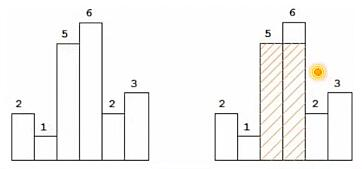
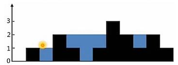

# 05.链表、递归、栈

## Table of Contents
- [链表相加](#链表相加)
	- [问题](#问题)
	- [解法](#解法)
- [链表的部分翻转](#链表的部分翻转)
	- [问题](#问题)
	- [解法](#解法)
- [链表划分](#链表划分)
	- [问题](#问题)
	- [解法](#解法)
- [排序链表中去重](#排序链表中去重)
	- [问题](#问题)
	- [解法](#解法)
- [排序链表中去重2](#排序链表中去重2)
	- [问题](#问题)
	- [解法](#解法)
- [两个链表公共节点](#两个链表公共节点)
	- [问题](#问题)
	- [解法](#解法)
- [两个链表公共祖先](#两个链表公共祖先)
	- [问题](#问题)
	- [解法](#解法)
- [括号匹配](#括号匹配)
	- [问题](#问题)
	- [解法](#解法)
- [最长括号匹配](#最长括号匹配)
	- [问题](#问题)
	- [解法](#解法)
- [逆波兰表达式RPN](#逆波兰表达式rpn)
	- [问题](#问题)
	- [解法](#解法)
- [直方图矩形面积](#直方图矩形面积)
	- [问题](#问题)
	- [解法](#解法)
- [收集雨水](#收集雨水)
	- [问题](#问题)
	- [解法](#解法)
- [卡特兰数问题-求n个数的出栈数](#卡特兰数问题-求n个数的出栈数)
	- [问题](#问题)
	- [解法](#解法)

## 链表相加

### 问题

```
给定两个链表，分别表示两个非负整数。它们的数字逆序存储在链表中，且每个结点只存储一个数字，计算两个数的和，并且返回和的链表头指针。
如：输入：2->4->3、5->6->4，输出：7->0->8
```

### 解法

这题很简单，要么不停新建节点，要么加到一个链表上。

```c++
05.链表相加.cpp
class Solution {
	public：ListNode*addTwoNumbers(ListNode * l1, ListNode * l2) {
		ListNode dummy( -1); //头节点
		int carry = 0;
		ListNode*prev = &dummy;
		for (ListNode*pa = l1, *pb = l2;
		        pa || pb ;
		        pa = pa  ? pa->next : nullptr,
		        pb = pb  ? pb->next : nullptr,
		        prev = prev->next) {
			const int ai = pa == nullptr ? 0：pa->val;
			const int bi = pb == nullptr ? 0：pb->val;
			const int value = (ai + bi + carry) % 10;
			carry = (ai + bi + carry) / 10;
			prev->next = new Listlode(value); //尾插法
		}
		if (carry > 0)
			prev->next = new ListNode(carry);
		return dummy.next;
	}
};
```

## 链表的部分翻转

### 问题

```
给定一个链表，翻转该链表从m到n的位置。
要求直接翻转而非申请新空间。
	如：给定1>2->3->4->5，m=2，n=4，返回1->4->3->2->5。假定给出的参数满足：1≤m≤n≤链表长度。
```

### 解法

```
空转m次，找到第m个结点，即开始翻转的链表头部，记做head；
以head为起始结点点遍历n-m次，将第i次时，将找到的结点插入到head的next中即可。
	即头插法
```

这题有点东西，关键点就在从 m-n 的 for 循环中

```c++
// 05.链表的部分翻转.cpp
class Solution {
	public：ListNode*reverseBetween(ListNode*head, int m, int n) {
		ListNode dummy(-1);
		dummy.next = head;
		ListNode*prev = &dummy;
		for (int i = 0; i < m - 1; ++i)
			prev = prev->next;

		ListNode* const head2 = prev;
		prev = head2->next;
		ListNode* cur = prev->next;
		for (int i = m; i < n; ++i) {
			prev->next = cur->next;
			cur->next = head2->next;
			head2->next = cur; //头插法
			cur = prev->next;
		}
		return dummy.next;
	}
};
```

## 链表划分

### 问题

```
给定一个链表和一个值x，将链表划分成两部分，使得划分后小于x的结点在前，大于等于x的结点在后。在这两部分中要保持原链表中的出现顺序。
	如：给定链表1->4->3->2->5->2和x=3，返回1->2->2->4->3->5。
```

### 解法

```
分别中请两个指针pl和p2，小于x的添加到p1中，大于等于x的添加到p2中；最后，将p2链接到p1的末端即可。
时间复杂度是O（N），空间复杂度为O（1）；该问题其实说明：快速排序对于单链表存储结构仍然适用。
	注：不是所有排序都方便使用链表存储，如堆排序，将不断的查找数组的n/2和n的位置，用链表做存储结构会不太方便。
```

```c++
// 05.链表划分
class Solution {
	public：ListNode*partition(ListNode*head，int x) {
		ListNode left_dummy(-1);// 头结点
		ListNode right_dummy(-1);//头结点
		auto left_cur = &left_dummy;
		auto right_cur = &right_dummy;
		for (ListNode*cur = head; cur; cur = cur->next) {
			if (cur->val < x) {
				left_cur->next = cur; 
				left_cur = cur;
			} else {
				right_cur->next = cur; 
				right_cur = cur;
			}
		}	
		left_cur->next = right_dummy.next;
		right_cur->next = nullptr;
		return left_dummy.next;
	}
};
```

## 排序链表中去重

### 问题

```
给定排序的链表，删除重复元素，只保留重复元素第一次出现的结点。
```

### 解法

```Markdown
若p->next的值和p的值相等，则将p->next->next赋值给p，删除p->next；重复上述过程，直至链表尾端。
```

```c++
class Solution {
  public: ListNode *deleteDuplicates(ListNode *head) {
		if (head == nullptr)
			return nullptr;
		for (ListNode *prev = head, *cur = head->next; cur;
		        cur = cur->next) {
			if (prev->val == cur->val) {
				prev->next = cur->next;
				delete cur;
			} else {
				prev = cur;
			}
		}
		return head;
	}
};
```

## 排序链表中去重2

### 问题

```
若题目变成：若发现重复元素，则重复元素全部删除，代码应该怎么实现呢？
	如：给定1->2->3->3->4->4->5，返回1->2->5。
```

### 解法

```c++
// coding-interviews/020.删除链表中重复的结点.cpp
class Solution {
  public:
	ListNode* deleteDuplication(ListNode* head) {
		if (!head || !head->next) {
			return head;
		}
		ListNode* dummy = new ListNode(-1);
		dummy->next = head;
		ListNode* pre = dummy;
		ListNode* cur = dummy->next;
		while (cur) {
			if (cur->next && (cur->val == cur->next->val)) {
				while (cur->next && (cur->val == cur->next->val)) {
					cur = cur->next;
				}
				pre->next = cur->next;
				cur = cur->next;
			} else {
				pre = pre->next;
				cur = cur->next;
			}
		}
		return dummy->next;
	}
};
```

## 两个链表公共节点

### 问题

```
求两个链表的起始公共节点
```

### 解法

先求出两个链表长度，l1 = len(node1)，l2 = len(node2)，让较长的链表先往后 |l1-l2|步，使得两个链表处于同一起点，然后一步步往后就行。


```c++
// coding-intyerviews/023.两个链表的第一个公共结点.cpp
class Solution {
  public:
	ListNode* FindFirstCommonNode( ListNode* h1, ListNode* h2) {
		int l1 = len(h1);
		int l2 = len(h2);
		if (l1>l2) {
			h1 = walk(h1, l1-l2);
		} else {
			h2 = walk(h2, l2-l1);
		}
		while (h1) {
			if (h1==h2) {
				return h1;
			}
			h1 = h1->next;
			h2 = h2->next;
		}
		return NULL;
	}
	int len(ListNode* h) {
		int ans = 0;
		while (h) {
			ans++;
			h = h->next;
		}
		return ans;
	}
	ListNode* walk(ListNode* h, int x) {
		while (x--) {
			h = h->next;
		}
		return h;
	}
};
```

## 两个链表公共祖先

### 问题

找出两个链表的最近公共祖先（LCA），这个问题跟二叉树的 LCA 问题类似。

### 解法

解法同二叉树 LCA，直接运用递归来做。

```c++
// 05.链表最近公共祖先.cpp
node* getLCA(node* root, node* node1, node* node2) {
	if (root == null)
		return null;
	if (root == node1 || root == node2)
		return root;
	node* left = getLCA(root->left, node1, node2);
	node* right = getLCA(root->right, node1, node2);
	if (left && right)
		return root;
	else if (left)
		return left;
	else if (right)
		return right;
	else
		return null;
}
```

## 括号匹配

### 问题

```
给定字符串，仅由“()[]{}}”六个字符组成。设计算法，判新该字符串是否有效。
	括号必须以正确的顺序配对，如："()"、"()[]”是有效的，但"([)]”无效。
```

### 解法

```
从前向后扫描字符串：
遇到左括号，就压栈x；
遇到右括号y：
	如果发现栈顶元素x和该括号y匹配，则栈顶元素出栈，继续下一个字符。
	如果栈顶元素x和该y不匹配，字符串不匹配；
	如果栈为变，字符串不匹配；
扫描完成后，如果栈恰好为空，则字符串匹配，否则，字符串不匹配。
```

```c++
// 05.括号匹配.cpp
class Solution {
  public: bool isValid(string const& s) {
		string left = "([{";
		string right = ")]}";
		stack<char>stk;
		for (auto c : s) {
			if (left.find(c) != string::npos) {
				stk.push(c);
			} else {
				if (stk.empty() || stk.top() != left[right.find(c)])
					return false;
				else
					stk.pop();
			}
			return stk.empty();
		}
	}
};
```

## 最长括号匹配

### 问题

```
给定字符串，仅包含左括号和右括号，它可能不是括号匹配的，设计算法，找出最长匹配的括号子串，返回该子串的长度。如："()"：2；"(()())"：4。
```

### 解法

这里要注意如 ())()()()() 最长是 8，需要记录上一个不匹配的  ')' 的位置（前面第 2 个右括号）。


```c++
// 05.最长括号匹配_栈.cpp
class Solution {
  public: int longeatValidParenthesea(string s) {
		int max_len = 0, last = -1; // the position of the last')
		stack<int> lefts; // keep track of the positions of non-matching'('s
		for (int i = 0; i < s.size(); ++i) {
			if (s[i] == '(') {
				lefts.push(i);
			} else {
				if (lefts.empty()) {
					// no matching left
					last = i;
				} else {
					// find a natching pair
					lefts.pop();
					if (lefts.empty()) {
						max_len = max(max_len, i - last);
					} else {
						max_len = max(max_len, i - lefts.top());
					}
				}
				return max_len;
			}
		}
	}
};
```

```c++
// 05.最长括号匹配.cpp
int GetlongestPareatleset(canst char*p) {
	int size = (int)strlen(p);
	int answer = 0; // 最终解
	int deep = 0; // 遇到了多少左括号
	int start = 1; // 最深的deep==0时左括号位置
	// 其实，为了方使计算长度，该变量是最深左括号的前一个位置
	int i;
	for (i = 0：i < size : i++) {
		if (p[i] == '(') {
			deep++;
		} else {
			deep--;
			if (deep == 0) {
				answer = max(answer, i - start);
			} else if (deep <
			           0) { // 说明右括号数自大于左括号。初始化为for循环前
				deep = 0;
				start = 1;
			}
		}

	}

	deep = 0; //遇到了多少右括号
	start = size; //最深的deep==0右括号位置
	// 其实，为了方使计算长度，该变量是最深右括号的前一个位置
	for (i = size - 1; i >= 0; i--) {
		if (p[i] == ')') {
			deep++;
		} else {
			deep--;
			if (deep == 0) {
				answer = max(answer, start - i);
			} else if (deep <
			           0) { // 说明右括号数自大于左括号。初始化为for循环前
				deep = 0;
				start = 1;
			}
		}
	}
	return answer;
}
```

## 逆波兰表达式RPN

### 问题

```
逆波兰表达式Reverse Polish Notation，又叫后缀表达式。
习惯上，二元运算符总是置于与之相关的两个运算对象之间，即中缀表达方法。
波兰逻辑学家J.Lukasiewicz于1929年提出了运算符都置于其运算对象之后，故称为后缀表示。
中级表达式：a+(b-c)*d
后级表达式：abc-d*+

计算给定的逆波兰表达式的值。有效操作只有+-*/，每个操作数都是整数。
如：
"2"，"1"，"+"，"3"，"*"：9  (2+1)*3
"4"，"13"，"5"，"/"，"+"：6   4+(13/5)
```

### 解法

```
用栈很简单：
如果是当前字符时数，则压栈
如果是运算符，则弹出栈顶两个数，计算完成后压栈
	如弹出失败，则表达式有问题
```

```c++
// 05.逆波兰式.cpp
class Solution {
  public: int evalRPN(vector<string>& tokens) {
		stack<string>s;
		for (auto token : tokens) {
			if (! is.operator(token)) {
				s.push(token);
			} else {
				int y = stoi(s.top());
				s.pop();
				int x = stoi(s.top());
				s.pop();
				if (token[0] ==  '+')
					x += y;
				else if (token[0] == '-')
					x -= y;
				else if (token[0] == '*')
					x *= y;
				else
					x /= y;
				s.push(to_string(x));
			}
		}
		return stoi(s.top());
	}
  private: bool is_operator(const string& op) {
		return op.size() == 1
		       && string("+-*/").find(op) != string::npos;
	}
};
```

## 直方图矩形面积

### 问题

```
给定n个非负整数，表示直方图的方桂的高度，同时，每个方柱的宽度假定都为1；试找出直方图中最大的矩形面积。如：给定高度为：2，1，5，6，2，3，最大面积为10。
```



### 解法

1. 暴力

```
将直方图的数组记做a[0...size-1]；
计算以方柱a[i]为右边界的直方图中，遍历a[0...i]，依次计算可能的高度和面积，取最大者；
i从0遍历到size-1；
时间复杂度为0(N2)
```


2. 栈

```
显然，若a[i+1]≥a[i]，则以a[i]为右边界的矩形Rect（width，height），总可以添加a[i+1]带来的矩形Rect（1，height），使得面积增大
只有当a[i+1]<a[i]时，才计算a[i]为右边界的矩形面积。
	trick：为了算法一致性，在a[0...size-1]的最后，添加a[size]=0，保证a[size-1]为右边界的矩形得到计算。

做法：
从前向后遍历a[0...size]（末尾添加了0）
若a[i]>a[i-1]，则将a[i]放入缓冲区；
若a[i]≤a[i-1]，则计算缓冲区中能够得到的最大矩形面积。

从a[i]>a[i-1]可以得出：
	缓冲区中放入的值是递增的
	每次只从缓冲区取出最后元素和a[i]比较 —— 栈。
```

```c++
// 05.直方图矩形面积.cpp
int LargestRectangleArea(vector<int>&height) {
	// 确保原数组height的最后一位能够得到计算
	height.push_back(0);
	stack<int>s;
	int answer = 0;
	int temp;
	for (int i = 0; i < (int)height.size();) {
		if (s.empty() || height[i] > height[s.top()]) {
			s.push(i);
			i++;
		} else {
			temp = s.top();
			s.pop();
			answer = max(answer, height[temp] * (s.empty() ? i;
			                                     i - s.top() - 1));
		}
	}
	return answer;
}
```

## 收集雨水

### 问题

```
给定n个非负整数，表示直方图的方柱的高度，同时，每个方柱的宽度假定都为1。若使用这样形状的容器收集雨水，可以盛多少水量？
	如输入：0，1，0，2，1，0，1，3，2，1，2，1；返回6。
```



### 解法

```
记最终盛水量为trap。初值为0；
考察直方图最左边L和最右边R的两个方柱：
	它们两个本身，一定不可能存储雨水：因为在最边界；
	记它们比较低的那个为X，与X相邻的方挂记做Y。
		若Y≥X，可将X丢弃，且trap值不变；
		若Y<X，则X-Y即为了方柱最多盛水量；仍然丢弃X，且trap+=（X-Y）。
		无论如何，L或者R都将向中间考近一步，重复上述过程，直至L==R。
```

```c++
// 05.收集雨水.cpp
int TrappingRainWater(int A[]，int n) {
	int secHight = 0; // 当前找到的第二大的数
	int left = 0;
	int right = n - 1;
	int trap = 0; //依次遍历每个方柱能装水的容量
	while (left < right) {
		if (A[left] < A[right]) {
			secHight = max(A[left]，secHight);
			trap += (secHight - A[left]);
			left++;
		} else {
			secHight = max(A[right]，secHight);
			trap += (secHight - A[right]);
			right--;
		}
		return trap;
	}
}
```

## 卡特兰数问题-求n个数的出栈数

### 问题

```
假定一个栈无穷大，进栈序列为1，2，3。。。n，问共有多少种出栈序列？
```

### 解法

```
Y
^
|     .
|    ..
|   ...
|  ....
| .....
|......
----------> X
问题等价于从左下角(0, 0)到右上角(n, n)，只能向右、向上走（向右代表入栈，向上代表出栈），并且x>=y的路径数目 => C(2n, n)-C(2n,n-1)
```

```
设f(n)=序列个数为n的出栈序列种数
0 第一个出栈的序列数为：f(n-1)
0 第二个出栈的序列数为：f(n-2)
0 第三个出栈的序列数为：1 2的出栈数*f(n-3) = f(2)*f(n-3)
0 第四个出栈的序列数为：1 2 3的出栈数*f(n-3) = f(3)*f(n-3)
...
也就是——
f(n)=f(0)f(n-1)+f(1)f(n-2)+...+f(n-1)f(0)
其中，f(0)=1，f(1)=1
```