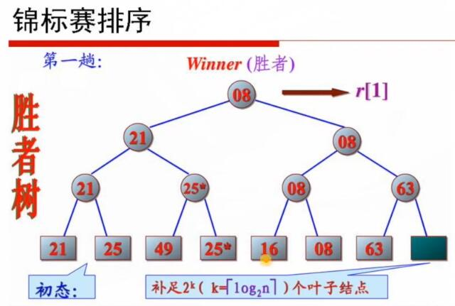
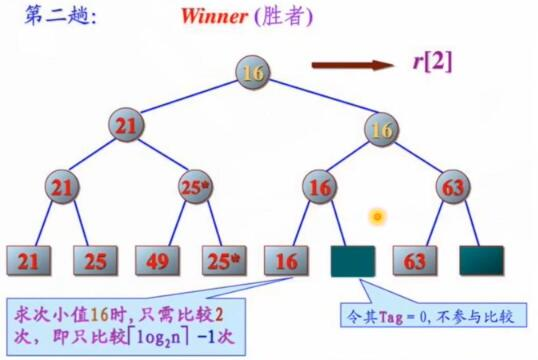

# 06.查找排序

```
给定 n 个元素的集合 A，按照某种方法将 A 中的元素按非降或非增次序排序
分类：内排序，外排序

常见内排序方法
- 插入排序 / 希尔排序
- 选择排序 / 锦标赛排序 / 堆排序
- 冒泡排序 / 快速排序
- 归并排序
- 基数排序
```

## Table of Contents
- [插入排序](#插入排序)
- [锦标赛排序](#锦标赛排序)
- [归并排序](#归并排序)
	- [归并排序两点改进](#归并排序两点改进)
- [外排序](#外排序)
- [堆的定义](#堆的定义)
	- [孩子与父亲的相互索引](#孩子与父亲的相互索引)
	- [堆排序](#堆排序)
- [n 个数中选择 m 个最大的数](#n-个数中选择-m-个最大的数)
- [K 叉堆的结论](#k-叉堆的结论)
- [稳定与非稳定](#稳定与非稳定)
- [快速排序](#快速排序)
- [堆排序和快速排序比较](#堆排序和快速排序比较)
- [n 个数中选择第 k 大的数](#n-个数中选择第-k-大的数)
	- [在A中找第k小元素，使用两次取中规则](#在a中找第k小元素，使用两次取中规则)

## 插入排序

```
// 将A（1：n）中的元素按非降次序分奏，n≥1
procedure INSERTIONSORT（A，n）
	A（0）⬅ -∞                // 设置初始边界值
	for j⬅2 to n do  		   //A（1:j-1）已分类
		item⬅A（j）；i⬅j-1
		while item < A（i）do   // 0≤i<j
			A（i+1）⬅A（i）；i-i-1
		repeat
		A（i+1）+-item；
	repeat
end INSERTIONSORT
```

## 锦标赛排序





## 归并排序

将原数组A（1：n）分成两个子集合：A1（1：n/2）和 A2（n/2+1：n）。分别对两个子集合单独排序，然后将已排序的两个子序列合并。

```
归并排序的总框架
//A（low:high）含有high-low+1=0个待分奏的元素
procedure MERGESORT（A，low，high）
	integer low，high
	if low<high then
		mid-（low+high）/2                    //计算中分点
		call MERGESORT（A，low，mid）         //在第1个子集合上分类
		call MERGESORT（A，mid+1，high）      //在第2个子集合上分奏
		call MERGE（A，low，mid，high）       //归并已分类的两个子集合
	endif
end MERGESORT

procedure MERGE（low，mid，high）
integer h，i，j，k，low，mid，high；
global A（low:high）；local B（low:high）
h⬅low；i⬅low；j⬅mid+1；
while h≤mid and j<high do
	if A（h）≤A（i）then B（i）⬅A（h）；h⬅h+1
	else B（i）⬅A（i）；j⬅j+1
	endif
	i⬅i+1
repeat
if h>mid then for k⬅j to high do B（i）⬅A（k）；i+-i+1；repeat
else for k⬅h to mid do B（i）⬅A（k）；i-i+1；repeat
endif
for k⬅low to high do A（k）⬅B（k）repeat
end MERGE
```

### 归并排序两点改进

1. 在数组较短情况下不进行递归，而是选择其他排序方案，如插入排序
2. 归并过程中，可以用记录数组下标的方式代替申请新内存空间，从而避免A和辅助数组间的频繁数据移动

## 外排序

外排序是指能够处理及大量数据的排序算法，通常来说，外排序处理的数据不能一次性装入内存，只能放在读写较慢的外存（硬盘）上。外排序通常采用的是一种“排序-归并”的策略。在排序阶段，先读入能够放在内存中的数据量，将其排序输出到一个临时文件。而后将这些临时文件合并为一个大的有序文件，即排序结果。

## 堆的定义

```
定义：对于一棵完全二叉树，若树中任一非叶子结点的关键字均不大于（或不小于）其左右孩子（若存在）结点的关键字，则这棵二叉树，叫做小顶堆（大顶堆）。

完全二叉树可以用数组完美存储，对于长度为n的数组a[0...n-1]，若

0≤i≤n-1，a[i]≤a[2i+1] 且 a[i]≤a[2i+2]
那么，a表示一个小顶堆。

重要结论：大顶堆的堆顶元素是最大的。
```

-[06.堆的数组表示.jpg]


### 孩子与父亲的相互索引

```
k 的孩子结点是 2k+1，2k+2（如果存在）
k 的父结点：
- 若 k 为左孩子，则 k 的父结点为 k/2
- 若 k 为右孩子，则 k 的父结点为（k/2）-1

二者公式不一样，十分不便。发现：
- 若 k 为左孩子，则 k 为奇数，则（（k+1）/2）-1 与 k/2 相等
- 若 k 为右孩子，则 k 为偶数，则（（k+1）/2）-1 与（k/2）-1 

相等结论：若待考查结点为 k，记 k+1 为 K，则 k 的父结点为：（K/2）-1
```

### 堆排序

```Markdown
1. 初始化操作：将a[0..n-1]构造为堆（如大顶堆）；
2. 第i（n>i≥1）趟排序：将堆顶记录a[0]和a[n-i]交换，然后将a[0...n-i-1]调整为堆（即：重建大顶堆）；
3. 进行n-1趟，完成排序。

堆排序的时间复杂度？
初始化堆的过程：O（N），注意，一般教科书给出的O（NlogN）不是紧的。
调整堆的过程：O（NlogN）
```

代码见 [06.堆排序.cpp](06.堆排序.cpp)

## n 个数中选择 m 个最大的数

```
建立一个最小堆，最小堆的大小为 m

for 每个数
	i f 这个数比最小堆的维顶元素大
		弹出最小堆的最小元素
		把这个数插入到最小堆
	最小堆中的 m 个元素就是所要求的元素

最小堆的作用：保持始终有 m 个最大元素，且 m 个元素中最小的元素在堆顶。
时间复杂度：O（nlogm）
```

## K 叉堆的结论

```
对 n 个元素建立初始 K 又堆的最多比较次数不超过 $（k/k-1）* n  $ 次；
对 n 个元素的 K 又堆，每次删去堆顶元素并调整使之恢复 K 又堆，这样 m 次过程的最多比较次数不超过 $ m * k * [log_{k}((k-1) n)] $ 次
```

## 稳定与非稳定

事实上，任何一个非稳定的排序，如果能够将元素值 value 与元素所在位置 index 共同排序，即可得到稳定的排序

## 快速排序

```
快速排序是一种基于划分的排序方法；
划分 Partitioning：选取待排序集合 A 中的基个元素 t，按照与 t 的大小关条重新整理 A 中元素，使得整理后的序到中所有在 t 以前出现的元素均小于 t，而所有出现在 t 以后的元素均大于等于 t；元素 t 称为划分元素。

快速排序：通过反复地对 A 进行划分达到排序的目的。
```

## 堆排序和快速排序比较

快速排序的最直接竞争者是堆排序。堆排序通常比快速排序稍微慢，但是最坏情况的运行时问总是 O（nlogn）。快速排序是经常比较快，但仍然有最坏情况性能的机会

堆排序拥有重要的特点：仅使用固定额外的空间，即堆排序是原地排序，而快速排序需要 O（logn）的空间

## n 个数中选择第 k 大的数

```
利用快速排序的思想，随机选择划分元素 t，将数组分成大于 t 和小于等于两部分。记为 a[0...m-1]和 a[m+1...n-1]，若 m=k-1，则 t 即为所求；若 m>k-1，则递归计算 a[0...m-1]中第 k 大的数；若 m>k-1，则递归计算 a[m+1...n-1]中第 k-m 大的数。
平均时间复杂度 O（n），最差 O（n^2）。
	快排的时候，左右两个分支都要进行递归，找 k 大的时候只需要对其中一边进行递归

可使用 “二次取中” 的规则得到最坏情况是 O（n）的算法
```

### 在A中找第k小元素，使用两次取中规则

```
procedure SELECT（A，k，n）
①若n<r，则采用插入法直接对A排序并返回第k小元素
②把A分成大小为r的n/r个子集合，忽略多余的元素；记d=/r
③设M={m1，m2...m}是d个子集合的中间值集合
④v⬅SELECT（M，d/2，d）
⑤j⬅PARTITION（A，v）// v作为划分无素，划分后等于划分元素所在位置的下标//
⑥case
	：k=j:
		return（v）
	：k<j：
		return（SELECT（A，k，j-1））
	：else：设R是A（j+1：n）中元素的集合
		return（SELECT2（R，k-j，n-j））
endcase
end SELECT
```
