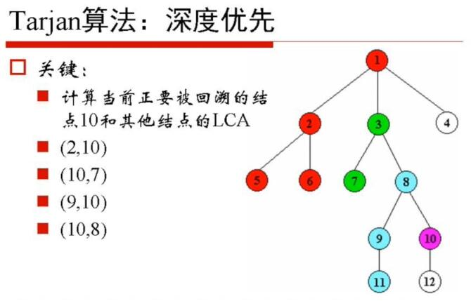
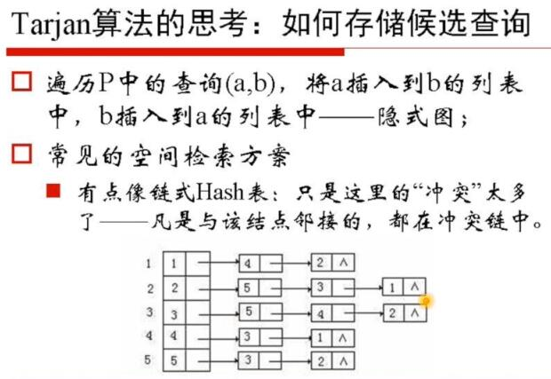
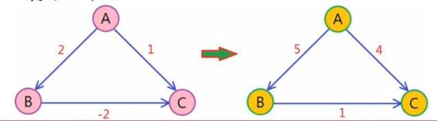
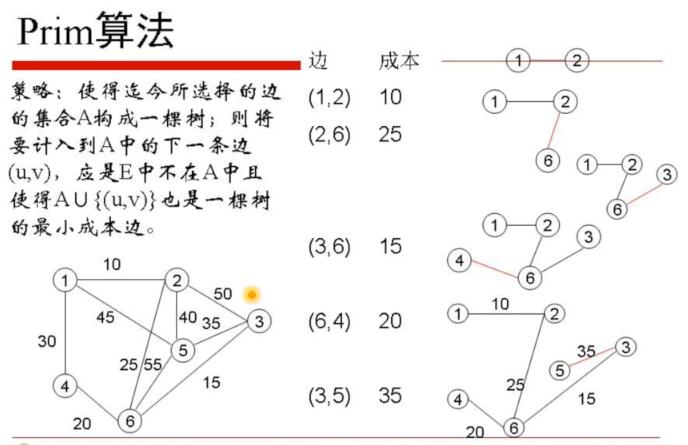
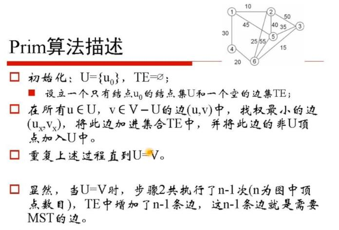
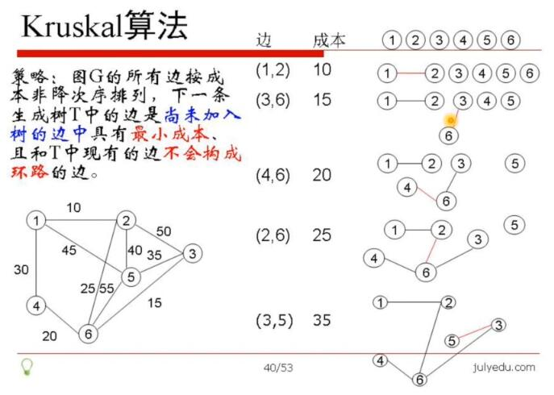
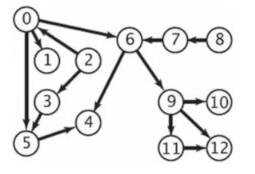

# 08.图论（下）

[readme](../README.md) | [07.图论（上）](07.图论（上）.md) | [09.贪心法和动态规划](09.贪心法和动态规划.md)

## Table of Contents
- [回文划分问题](#回文划分问题)
	- [问题](#问题)
	- [解法](#解法)
- [LCA 的 Tarjan 算法](#lca-的-tarjan-算法)
	- [问题](#问题)
	- [解法](#解法)
- [Dijkstra 最短路径算法](#dijkstra-最短路径算法)
- [Floyd 算法](#floyd-算法)
- [带负权的最短路径](#带负权的最短路径)
	- [Bellman-ford 算法](#bellman-ford-算法)
- [最小生成树 MST](#最小生成树-mst)
	- [Prim 算法 - 加点](#prim-算法---加点)
	- [Kruskal 算法 - 加边](#kruskal-算法---加边)
		- [Kruskal 算法几点说明](#kruskal-算法几点说明)
- [拓扑排序](#拓扑排序)
	- [拓扑排序的方法](#拓扑排序的方法)

## 回文划分问题

### 问题

问题同 [07.回文划分问题](07.图论（上）.md#回文划分问题)

### 解法

```
这次使用动态规划来解决

如果己知：
str[i+1，i+2...n-1]的所有回文划分Φ（i+1）
	注：Φ是个集合，存储了所有可能的回文划分，下同
str[i+2，i+3...n-1]的所有回文划分Φ（i+2）
str[i+3，i+4...n-1]的所有回文划分Φ（i+3）
...
str[n-1]的所有回文划分Φ（n-1），

如何求 str[i,i+1...n-1]的所有划分呢？
	分析：如果已知以 str[i]为起点的子串中 str[i,i+1...j]是回文串，那么，该子串添加到中Φ（j+1）中，即为一种可能的划分方豪。

算法：
	将集合的Φ（i）置空；
	选历 j（i≤j≤n-1），若 str[i,i+1...j]是回文串，则将 {str[i,i+1...j]，Φ（j+1）} 添加到Φ（i）中；
	i 从 n-1 到 0，依次调用上面两步，最终返回Φ（0）即为所求
```

```
动态规划解回文划分的Trick
在计算str[i,i+1..j]是否是回文串这一子问题中，暴力也是无可厚非的。线性探素：j从i到n-1遍历即可。

事实上，可以事先缓存所有的str[i,i+1...j]是回文串的那些记录：用二维布尔数组p[n][n]就够了：p[i][j]的true/false表示了str[i,i+1...j]是否是回文串；

它本身是个小的动态规划：
	如果已知str[i+1...j-1]是回文串，那么，判新str[i,i+1...j]是否是回文串，只需要判新str[i]==str[j]就可以。
```

[08.回文划分问题_动态规划.cpp](08.回文划分问题_动态规划.cpp)

## LCA 的 Tarjan 算法

### 问题

```
Tarjan 算法是 Robert Tarjan 在 1979 年发现的一种高效的离线算法，也就是说，它要首先读入所有的询问（求一次 LCA 叫做一次询问），然后并不一定按照原来的顺序处理这些询问，该算法的时间复杂度
O（N*α（N）+Q），其中，α（x）不大于 4，N 表示问题规模，Q 表示询问次数。
```

### 解法



```c
function TarjanOLCA(u)
MakeSet(u);
u.ancestor ：= u; // 将集合 u 的祖先指向自己
for each v in u.childern do // DFS 所有孩子
	TarjanOLCA(v);
	Union(u, v); // 与跟节点 u 合并（并查集操作）
	Find(u).ancestor := u; // 将 u 所在集合根的祖先指向 u
u.color := black; // 当所有孩子都以便利，则标记根已完成
for each v such that {u, v} in P do //找所有与 u 相关的查询
	if v.color == black // 如果另一个节点 v 是前面标记过的，则输出递归向上返回根的祖先
	print "Tarjan's Least Common Ancestor of " + u + " and " + v + " if " + Find(v).ancestor + ".";
```



## Dijkstra 最短路径算法

```
记起点为 v1，求 v1 到其他所有结点的最短路径。

初始化集合 V={v1}，dist（w）初值为 c（v1，2）；
与 v1 直接邻接的所有结点中，距离 v1 最近的结点记做 v2，则 v1-V2 的边，就是它们的最短距离——将 v2 添加到集合 V 中
	dist（v2）是所有距离中最小的；
	经过任何结点集 {vx} 对再到达 v2 的路径一定大于 c（v1，v2）；
第 i 步：对于尚未加入到 V 中的结点 {w}：
	查找中 {V补（符号打不出来，V 上面一个横杠）} dist（w）最小的结点，记做 u，将 u 加入到 V 中；
	更新：dist（w）=min（dist（w），dist（u）+c（u，w））
上述更新共进行 n-1 次：dist（w）即为所求。
```

## Floyd 算法

```
Floyd 算法又称为插点法，是一种用于寻找给定的加权图中多源点之间最短路径的算法。该算法名称以创始人之一、1978 年图灵奖获得者罗伯特·弗洛伊德命名

通过一个图的权值矩阵求出它的每两点间的最短路径矩阵
```

```
算法分析
记录 map[i,j] 为结点 i 到结点 j 的最短路径的距离；则：
map[i,j]=min{map[i,k]+map[k,j]，map[i,j]}
	k 取所有结点
同时，map[n，n]==0
	i,j,k 各自从 0 到 N-1，所以时间复杂度为 O（n^3）

此外，如果图中存在负的权值，算法也是适用的。

思考：Dijkstra 算法允许边存在负权吗？
```

```
Floyd 算法

D[u，v]=A[u，v]//初始化
For k：=1 to n 
	For i：=1 to n
		For j：=1 to n
			If D[i,j]>D[i,k]+D[K,j] Then
				D[i, j]：=D[i,k]+D[k,j]；
```

## 带负权的最短路径

思路一：将每个权值都加上最小负数的绝对值，使得所有权值为证（x）



Dijkstra 算法无法完成


### Bellman-ford 算法

```
本质：动态规划
适用：单源结点到其他所有结点的最短路径
若u->v是有向边，则d[v]<=d[u]+dis（u，v）
这个操作被成为松弛操作。
优点：对边权正负无要求，可以发现负环。
```

```c
Bellman-Ford(){
	for each vertex v ∈ G do //初始化
		d[v]=+oo
	d[s]=0
	for i=1 to n-1 do
		for each edge（u，v）∈ G do
			if d[v]>d[u]+w（u，v）then //松弛操作
				d[v]=d[u]+w（u，v）
	for each edge（u，v）∈ G do
		if d[v]>d[u]+w（u，v）then // 检查是否存在回路
			return false
	return true
}
```

## 最小生成树 MST

### Prim 算法 - 加点

```
首先以一个结点作为最小生成树的初始结点，然后以迭代的方式找出与最小生成树中各结点权重最小边，并加入到最小生成树中。加入之后如果产生回路则跳过这条边，选择下一个结点。当所有结点都加入到最小生成树中之后，就找出了连通图中的最小生成树了
```
 




### Kruskal 算法 - 加边

```
Kruskal 在找最小生成树结点之前，需要对所有权重边做从小到大排序。将排序好的权重边依次加入到最小生成树中，如果加入肘产生回路就跳过这条边，加入下一条边。当所有结点都加入到最小生成树中之后，就找出了最小生成树。

Prim 算法在得到最小生成树的过程中，始终保持是一颗树
而 Kruskal 算法最开始是森林，直到最后一条边加入，才得到树
```



#### Kruskal 算法几点说明

```
边集 E 以小顶堆的形式保存，一条当前最小成本边可以在O（loge）的时间内找到；
	当然，也可以用其他排序方法对边完全排序。
为了快速判断候选边 e 的加入是否会形成环，可考虑用并查集的方法：把当前状态的每个连通子图保存在各自的集合中；候选边是否可以加入，转化成边的两个顶点是否位于同一集合中；
算法的计算时间是O（eloge）
```

## 拓扑排序

```
对一个有向无环图（Directed Acyclic Graph，DAG）G 进行拓扑排序，是将 G 中所有顶点排成线性序到，使得图中任意一对顶点点 u 和 v，若边（u，v）∈E（G），则 u 在线性序到中出现在 v 之前
```




上图一种可能的拓扑排序是：2 8 0 3 7 1 5 6 9 4 11 10 12


### 拓扑排序的方法

```
从有句图中选择一个没有前驱（即入度为0）的顶点并且输出它；
从网中删去该顶点，并且删去从该顶点发出的全部有向边；
重复上述两步，直到剩余的网中不再存在没有前趋的顶点为止
```

[08.拓扑排序.cpp](08.拓扑排序.cpp)

[readme](../README.md) | [07.图论（上）](07.图论（上）.md) | [09.贪心法和动态规划](09.贪心法和动态规划.md)
