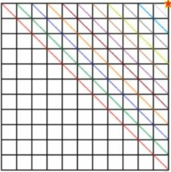
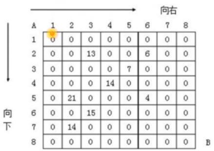
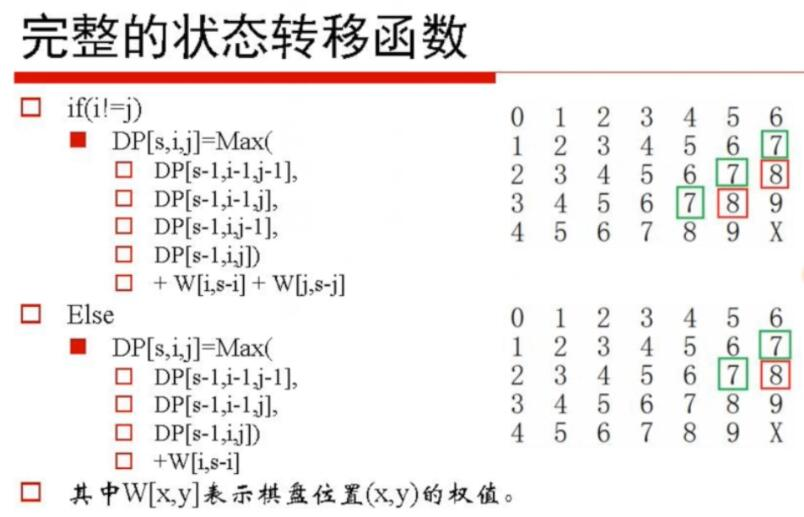

# 09.贪心法和动态规划

## Table of Contents
- [09.贪心法和动态规划](#09.贪心法和动态规划)
- [贪心法](#贪心法)
- [最长递增子序列 LIS](#最长递增子序列-lis)
- [问题](#问题)
- [解法](#解法)
- [矩阵乘积](#矩阵乘积)
	- [问题](#问题)
	- [解法](#解法)
- [字符串的交替连接](#字符串的交替连接)
	- [问题](#问题)
	- [解法](#解法)
- [走棋盘](#走棋盘)
	- [问题](#问题)
	- [解法](#解法)
- [带陷阱的走棋盘](#带陷阱的走棋盘)
	- [问题](#问题)
	- [解法](#解法)
- [两次走棋盘](#两次走棋盘)
	- [问题](#问题)
	- [解法](#解法)
- [卡塔兰数](#卡塔兰数)

## 贪心法

```
根据实际问题，选取一种度量标准。然后按照这种标准对 n 个输入排序，并按序一次输入一个量。如果输入和当前已构成在这种量度意义下的部分最优解加在一起不能产生一个可行解，则不把此输入加到这部分解中。否则，将当前输入合并到部分解中从而得到包含当前输入的新的部分解。
这一处理过程一直持续到n个输入都被考虑完毕，则记入最优解集合中的输入子集构成这种量度意义下的问题的最优解。
这种能够得到某种量度意义下的最优解的分级处理方法称为贪心方法。
```

## 最长递增子序列 LIS

## 问题

```
Longest Increasing Subsequence
给定一个长度为 N 的数组，找出一个最长的单调递增子序到（不一定连续，但是顺序不能乱）。例如：给定一个长度为6的数组A{5，6，7，1，2，8}，则其最长的单调递增子序到为{5，6，7，8}，长度为4。
```

## 解法

```
长度为 N 的数组记为 A={a0,a1, ...an-1}；
记 A 的 i 个字符构成的前缀串为 A=a0a1a2...i-1，以 a i 结尾的最长递增子序列记做 Li，其长度记为 a[i]；
假定已经计算得到了 a[0,1...i-1]，如何计算 a[i] 呢？
根据定义，Li 必须以 ai 结尾，如果将 ai 级到 L0L1..Li-1 的后面，是否允许呢？
如果 aj<ai，别可以将 ai 级到 Lj 的后面，并且使得 Lj 的长度变长。
从而：a[i]={max（a（j））+1，0≤j<i 且 a[j] ≤ a[i]）
需要遍历在 i 之前的所有位置 j，我出满足条件 a[j]≤a[i] 的 a[j]；
计算得到 a[0...n-1] 后，遍而所有的 a[i]，找出最大值即为最大递增子序到的长度
时间复杂度为 O（N^2）
思考：如何求最大递增子序到本身？
	记录前驱
```

[09.LIS_贪心.cpp](09.LIS_贪心.cpp)

## 矩阵乘积

### 问题

```
根据矩阵相乘的定义来计算 C=A×B，需要 m*n*s 次乘法。
三个矩阵 A、B、C 的阶分别是 a0×a1，a1×a2，a2×a3，从而（A×B）XC 和 AX（B×C）的乘法次数是 a0a1a2+aoa2a3、a1a2a3+a0a1a3，二者一般情况是不相等的。
问：给定 n 个矩阵的连乘积：A1XA2XA3...XAn，如何添加括号来改变计算次序，使得乘法的计算量最小？
此外：若 A、B 都是 n 阶方阵，C 的计算时问复杂度为 O（n^3）

■问：可否设计更快的算法？
■答：分治法：Strassen 分块——理论意义大于实践意义。
```

```
给定 n 个矩阵 {A1，A2...An}，其中 Ai 与 Ai+1 是可乘的，i=1，2...，n-1。考察该 n 个矩阵的连乘积：A1XA2×A3...XAn，确定计算矩阵连乘积的计算次序，使得依此次序计算矩阵连乘积需要的乘法次数最少。
■即：利用结合律，通过加括号的方式，改变计算过程，使得数乘的次数最少。
```

### 解法

```
将矩阵连乘积 AiAi+1...Aj，记为 A[i:j]，这里 i≤j
显然，若 i==j，则 A[i:j] 即 A[i] 本身。
考察计算 A[ij:] 的最优计算次序。设这个计算次序在矩阵 Ak 和 Ak+1 之间将矩阵链断开，i≤k<j，则其相应的完全加括号方式为（AiAi+1...Ak）（Ak+1Ak+2...Aj）
计算量：A[i:k] 的计算量加上 A[k+1：j] 的计算量，再加上 A[i:k] 和 A[k+1:j] 相乘的计算量
```

```Markdown
状态转移方程（AiAi+1...Ak）（Ak+1Ak+2...Aj）
口设计算 A[i:j]（1≤i≤j≤n）所需要的最少数乘次数为 m[i,j]，则原问题的最优值为 m[1,n]
记 Ai 的维度为 pi-1×pi
i==j 时，A[i:j] 即 Ai 本身，因此，m[i,i]=0；
（i=1，2.....n）
i<j 时，m[i, j]=m[i,k]+m[k+1, j]+pi-1pkpj
从而：
```

$$

m[i, j] =
\begin{cases}
0 \qquad & i=j \\
\min_{i \le k \lt j} \{m[i, k]+m[k+1, j]+p_{i-1} p_{k} p_{j}\} \qquad & i \lt j
\end{cases}

$$

```
由递推关系，计算 m[i, j] 时，需要用到 m[i+1, j]，m[i+2, j]，m[j-1, j]；
因此，求 m[i,j] 的前提，不是 m[0...i-1；0..j-1]，而是沿着主对角线开始，依次求取到右上角元素。
因为 m[i,j] 一个元素的计算，最多需要遍历 n-1 次，共 O（n^2）个元素，故算法的时间复杂度是 O（n^3），空间复杂度是 O（n^2）。
```



[09.矩阵乘积.cpp](09.矩阵乘积.cpp)

## 字符串的交替连接

### 问题

```
输入三个字符串 s1、s2 和 S3，判新第三个字符串 s3 是否由前两个字符串 s1 和 s2 交错而成，即不改变 s1 和 s2 中各个字符原有的相对顺序，例如当 s1=“aabcc”，s2=“dbbca”，s3=“aadbbcbcac” 时，则输出 true，但如果 s3=“accabdbbca”，则输出 false。

换个表述：s1 和 s2 是 s3 的子序到，且 s1 U s2 = s3
```

### 解法

```
若 s1 和 s2 没有字符重复：遍历 s3 的同时，考察是否是 s1 和 S2 的字符即可；
若字符重复：可以用压栈的方式解决；
此外，还能用动态规划，代码更为简洁。
```

```
状态转移函数

令dp[i,j]表示s3[1..i+j]是否由s1[1..i]和s2[1..j]的字符组成：即dp[i，j]取值范围为true/false
如果s1[i]==s3[i+j]，且dp[i-1,j]为真，那么dp[i][j]为真；
如果s2[j]==s3[i+j]，且dp[i,j-1]为真，那么dp[i][j]为真；
其它情况，dp[i][j]为假。
```

[09.字符串的交替连接.java](09.字符串的交替连接.java)

## 走棋盘

### 问题

```
给定m*n的矩阵，每个位置是一个非负整数，从左上角开始，每次只能朝右和下走，走到右下角，求总和最小的路径。
```



### 解法

```Markdown
状态转移函数
走的方向决定了同一个格子一定不会经过两次。
若当前位于（x，y）处，它的上一步来自于哪些格子呢？
dp[0，0]=a[0，0]
dp[x，y]=min（dp[x-1，y]+a[x，y]，dp[x，y-1]+a[x，y]）
即：dp[x，y]=min（dp[x-1，y]，dp[x，y-1）+a[x,y]

思考：若将上述问题改成“求从左上到右下的最大路径”呢？
```

## 带陷阱的走棋盘

### 问题

```
有一个 n*m 的棋盘网格，机器人最开始在左上角，机器人每一步只能往右或者往下移动。棋盘中有些格子是禁止机器人踏入的，该信息存放在二维数组 blocked 中，如果 blocked[i][j] 为 true，那么机器人不能路入格子（i,j）。
请计算有多少条路径能让机器人从左上角移动到右下角。
```

### 解法

```
状态转移方程

dp[i][j] 表示从起点到（i,j）的路径条数
只能从左边或者上边进入一个格子
如果（i,j）被占用
dp[i][j]=0 
如果（i,j）不被占用
dp[i][j]=dp[i-1][j]+dp[i][j-1]

思考：如果没有占用的格子呢？

一共要走 m+n-2 步，其中（m-1）步向右，（n-1）步向下。组合数 C（m+n-2，m-1）=C（m+n-2，n-1）
```

## 两次走棋盘

### 问题

```
给定 m*n 的矩阵，每个位置是一个非负的权值，从左上角开始，每次只能朝右和下走，走到右下角；然后，从右下角开始，每次只能朝左和朝上走，走到左上角。求权值总和最大的路径。若相同格子走过两次，则该位置的权值只算一次。
```

### 解法

```
分析格网棋盘的特点
考察 5*7 的矩阵棋盘 C，其中，C[i,j] 表示的值 v 表示第 v 步能够到底的位置。
0 1 2 3 4 5 6
1 2 3 4 5 6 7
2 3 4 5 6 7 8
3 4 5 6 7 8 9
4 5 6 7 8 9 X
```

```
在经过 8 步后，肯定处于 C 中编号为 8 的位置。而 C 中共有 3 个编号为 8 的，它们分别是 C 的第 2、3、4 行。故假设第 1 次经过 8 步走到了 C 中的第 2 行，第 2 次经过 8 步走到了 C 中的第 3 行，用 dp[8，2，3] 表示。
用 dp[s，i，j] 记录而次所走的路径获得的最大值，其中 s 表示走的步数，i 和 j 表示在 s 步后第 1 次走的位置和第 2 次走的位置。由于 s = m + n - 2，0≤i<n，0≤j<
m，所以共有 O（n^3）个状态。
```



## 卡塔兰数

- 有 N 个节点的二又树共有多少种情形？
- 一个栈的进栈序到为 1，2，3，n，有多少个不同的出栈序到？
- 凸多边形三角化：将一个凸多边形划分成三角形区域的方法有多少种？
- 由左而右扫描由 n 个 1 和 n 个 0 组成的 2n 位二进制数，要求在任何时刻，1 的累计数不小于 0 的累计数。求满足这样条件的二进制数的个数。

```
注：由 h(n)=C(n，2n)/(n+1) 很容易求得：h(n)=h(n-
1)*(4*n-2)/(n+1)=c(2n，n)-c(2n，n+1)
```

$ H(n)=\frac{1}{n+1} C_{2 n}^{n} $