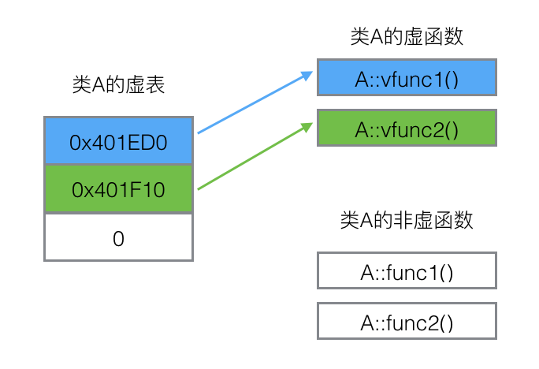
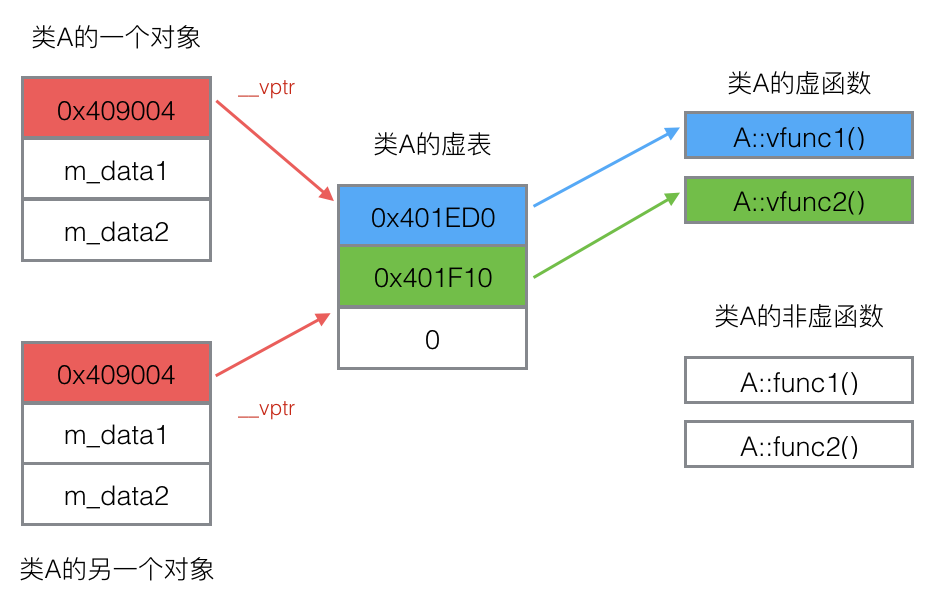
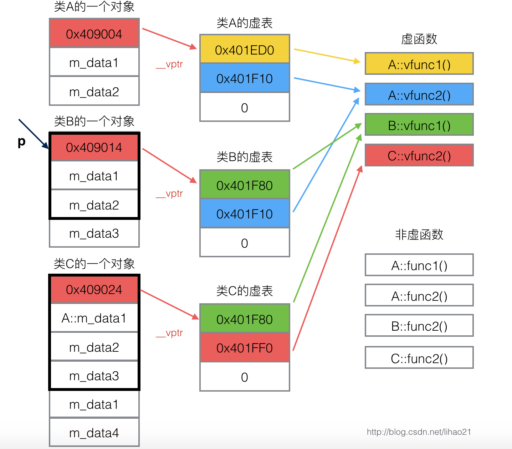

> @Date    : 2020-07-27 22:34:22
>
> @Author  : Lewis Tian (taseikyo@gmail.com)
>
> @Link    : github.com/taseikyo

# C++ 虚函数表剖析

- https://blog.csdn.net/lihao21/article/details/50688337

关键词：虚函数，虚表，虚表指针，动态绑定，多态

## 一、概述

为了实现 C++ 的多态，C++ 使用了一种动态绑定的技术。这个技术的核心是虚函数表（下文简称虚表）。本文介绍虚函数表是如何实现动态绑定的。

## 二、类的虚表

每个包含了虚函数的类都包含一个虚表。  
我们知道，当一个类（A）继承另一个类（B）时，类 A 会继承类 B 的函数的调用权。所以如果一个基类包含了虚函数，那么其继承类也可调用这些虚函数，换句话说，一个类继承了包含虚函数的基类，那么这个类也拥有自己的虚表。

我们来看以下的代码。类 A 包含虚函数 `vfunc1`，`vfunc2`，由于类 A 包含虚函数，故类 A 拥有一个虚表。

```c++
class A {
public:
    virtual void vfunc1();
    virtual void vfunc2();
    void func1();
    void func2();
private:
    int m_data1, m_data2;
};
```

类 A 的虚表如图 1 所示。  



图 1：类 A 的虚表示意图

虚表是一个指针数组，其元素是虚函数的指针，每个元素对应一个虚函数的函数指针。需要指出的是，普通的函数即非虚函数，其调用并不需要经过虚表，所以虚表的元素并不包括普通函数的函数指针。  
虚表内的条目，即虚函数指针的赋值发生在编译器的编译阶段，也就是说在代码的编译阶段，虚表就可以构造出来了。

## 三、虚表指针

虚表是属于类的，而不是属于某个具体的对象，一个类只需要一个虚表即可。同一个类的所有对象都使用同一个虚表。  
为了指定对象的虚表，对象内部包含一个虚表的指针，来指向自己所使用的虚表。为了让每个包含虚表的类的对象都拥有一个虚表指针，编译器在类中添加了一个指针，`*__vptr`，用来指向虚表。这样，当类的对象在创建时便拥有了这个指针，且这个指针的值会自动被设置为指向类的虚表。



图 2：对象与它的虚表

上面指出，一个继承类的基类如果包含虚函数，那个这个继承类也有拥有自己的虚表，故这个继承类的对象也包含一个虚表指针，用来指向它的虚表。

## 四、动态绑定

说到这里，大家一定会好奇 C++ 是如何利用虚表和虚表指针来实现动态绑定的。我们先看下面的代码。

```c++
class A {
public:
    virtual void vfunc1();
    virtual void vfunc2();
    void func1();
    void func2();
private:
    int m_data1, m_data2;
};

class B : public A {
public:
    virtual void vfunc1();
    void func1();
private:
    int m_data3;
};

class C: public B {
public:
    virtual void vfunc2();
    void func2();
private:
    int m_data1, m_data4;
};
```

类 A 是基类，类 B 继承类 A，类 C 又继承类 B。类 A，类 B，类 C，其对象模型如下图 3 所示。



图 3：类 A，类 B，类 C 的对象模型

由于这三个类都有虚函数，故编译器为每个类都创建了一个虚表，即类 A 的虚表（A vtbl），类 B 的虚表（B vtbl），类 C 的虚表（C vtbl）。类 A，类 B，类 C 的对象都拥有一个虚表指针，`*__vptr`，用来指向自己所属类的虚表。

类 A 包括两个虚函数，故 A vtbl 包含两个指针，分别指向 `A::vfunc1()`和`A::vfunc2()`。  
类 B 继承于类 A，故类 B 可以调用类 A 的函数，但由于类 B 重写了 `B::vfunc1()` 函数，故 B vtbl 的两个指针分别指向 `B::vfunc1()`和`A::vfunc2()`。  
类 C 继承于类 B，故类 C 可以调用类 B 的函数，但由于类 C 重写了 `C::vfunc2()` 函数，故 C vtbl 的两个指针分别指向 `B::vfunc1()`（指向继承的最近的一个类的函数）和 `C::vfunc2()`。

虽然图 3 看起来有点复杂，但是只要抓住 “对象的虚表指针用来指向自己所属类的虚表，虚表中的指针会指向其继承的最近的一个类的虚函数” 这个特点，便可以快速将这几个类的对象模型在自己的脑海中描绘出来。

非虚函数的调用不用经过虚表，故不需要虚表中的指针指向这些函数。

假设我们定义一个类 B 的对象。由于 `bObject` 是类 B 的一个对象，故 `bObject` 包含一个虚表指针，指向类 B 的虚表。

```c++
int main() {
    B bObject;
}
```

现在，我们声明一个类 A 的指针 `p` 来指向对象 `bObject`。虽然 `p`是基类的指针只能指向基类的部分，但是虚表指针亦属于基类部分，所以 `p` 可以访问到对象 `bObject` 的虚表指针。`bObject` 的虚表指针指向类 B 的虚表，所以 `p` 可以访问到 B vtbl。如图 3 所示。

```c++
int main() {
    B bObject;
    A *p = & bObject;
}
```

当我们使用 `p` 来调用 `vfunc1()` 函数时，会发生什么现象？

```c++
int main() {
    B bObject;
    A *p = & bObject;
    p->vfunc1();
}
```

程序在执行 `p->vfunc1()` 时，会发现 `p` 是个指针，且调用的函数是虚函数，接下来便会进行以下的步骤。

首先，根据虚表指针 `p->__vptr` 来访问对象 `bObject` 对应的虚表。虽然指针 `p` 是基类 `A*` 类型，但是 `*__vptr`也是基类的一部分，所以可以通过 `p->__vptr` 可以访问到对象对应的虚表。  
然后，在虚表中查找所调用的函数对应的条目。由于虚表在编译阶段就可以构造出来了，所以可以根据所调用的函数定位到虚表中的对应条目。对于 `p->vfunc1()` 的调用，B vtbl 的第一项即是 `vfunc1` 对应的条目。  
最后，根据虚表中找到的函数指针，调用函数。从图 3 可以看到，B vtbl 的第一项指向`B::vfunc1()`，所以 `p->vfunc1()`实质会调用 `B::vfunc1()` 函数。

如果 `p` 指向类 A 的对象，情况又是怎么样？

```c++
int main() {
    A aObject;
    A *p = &aObject;
    p->vfunc1();
}
```

当`aObject`在创建时，它的虚表指针`__vptr`已设置为指向 A vtbl，这样`p->__vptr`就指向 A vtbl。`vfunc1`在 A vtbl 对应在条目指向了`A::vfunc1()`函数，所以 `p->vfunc1()`实质会调用`A::vfunc1()`函数。

可以把以上三个调用函数的步骤用以下表达式来表示：

```c++
(*(p->__vptr)[n])(p)
```

可以看到，通过使用这些虚函数表，即使使用的是基类的指针来调用函数，也可以达到正确调用运行中实际对象的虚函数。

我们把经过虚表调用虚函数的过程称为动态绑定，其表现出来的现象称为运行时多态。动态绑定区别于传统的函数调用，传统的函数调用我们称之为静态绑定，即函数的调用在编译阶段就可以确定下来了。

那么，什么时候会执行函数的动态绑定？这需要符合以下三个条件。

*   通过指针来调用函数
*   指针 upcast 向上转型（继承类向基类的转换称为 upcast，关于什么是 upcast，可以参考本文的参考资料）
*   调用的是虚函数

如果一个函数调用符合以上三个条件，编译器就会把该函数调用编译成动态绑定，其函数的调用过程走的是上述通过虚表的机制。

## 五、总结

封装，继承，多态是面向对象设计的三个特征，而多态可以说是面向对象设计的关键。C++ 通过虚函数表，实现了虚函数与对象的动态绑定，从而构建了 C++ 面向对象程序设计的基石。

## 参考资料

* 《C++ Primer》第三版，中文版，潘爱民等译
* http://www.learncpp.com/cpp-tutorial/125-the-virtual-table/
* 侯捷《C++ 最佳编程实践》视频，极客班，2015
* Upcasting and Downcasting, http://www.bogotobogo.com/cplusplus/upcasting_downcasting.php

## 附录

示例代码：

```c++
// https://github.com/haozlee/vtable/blob/master/main.cpp
#include <iostream>

using namespace std;

class A {
  public:
    A() : m_data1(0), m_data2(0) {}
    virtual void vfunc1() { cout << "A::vfunc1" << endl; };
    virtual void vfunc2() { cout << "A::vfunc2" << endl; };
    void func1() { cout << "A::func1" << endl; };
    void func2() { cout << "A::func2" << endl; };
  private:
    int m_data1, m_data2;
};

class B : public A {
  public:
    B() : A(), m_data3(0) {}
    virtual void vfunc1() { cout << "B::vfunc1" << endl; };
    void func1() { cout << "B::func1" << endl; };
  private:
    int m_data3;
};

class C: public B {
  public:
    C() : B(), m_data1(0), m_data4(0) {}
    virtual void vfunc2() { cout << "C::vfunc2" << endl; };
    void func2() { cout << "C::func2" << endl; };
  private:
    int m_data1, m_data4;
};


int main() {
    B bObject;
    A *p = &bObject;
    p->vfunc1();

    A aObject = (A)bObject;
    aObject.vfunc1();

    C cObject;
    p = &cObject;
    p->vfunc1();
    p->vfunc2();

    cObject.A::func1();

    system("pause");
}
```
